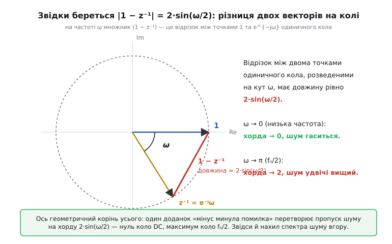
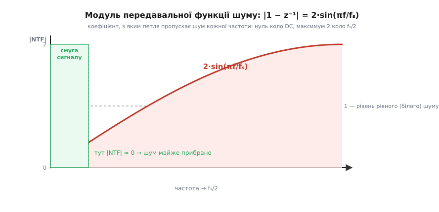
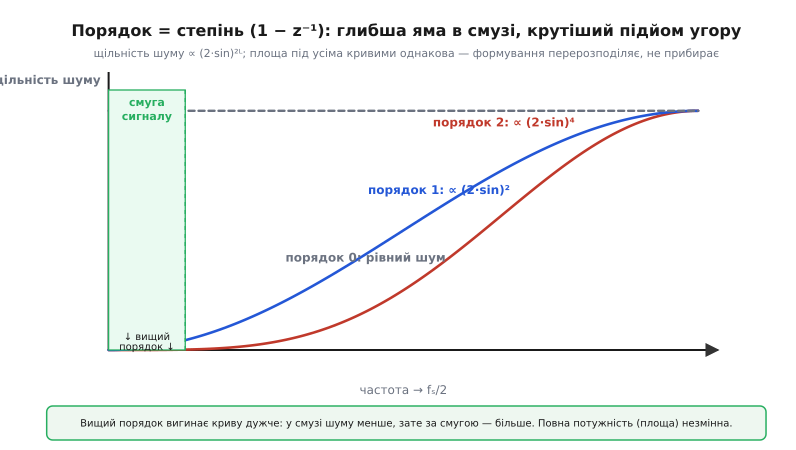

# 🧮 Як зворотний зв'язок родить (1−z⁻¹) і нахил шуму

У самій темі ми домовилися на пальцях: формувач «повертає свою помилку назад», віддає на вихід різницю сусідніх помилок e[n] − e[n−1], а це «дискретна похідна», яка гасить повільне й підкреслює швидке. Пояснення чесне, але воно лишає без відповіді точні питання, від яких залежить будь-який реальний розрахунок. **На скільки саме** тихшає смуга? Чому кажуть «9 децибелів на подвоєння частоти» для першого порядку й «15» для другого, а не якісь інші числа? І звідки взагалі береться слово «нахил», якщо в часі ми бачили лише знакозмінну пилку?

Тут ми пройдемо цей шлях до кінця — від одного-єдиного віднімання минулої помилки до конкретних децибелів. Виявиться, що вся поведінка формувача стиснута в один коротенький многочлен від змінної z, і щойно ми його запишемо, спектр шуму, нахил, порядок і всі цифри випадуть із нього самі, без жодного нового припущення. Це і є та «неминуча алгебра», на яку послалася стаття. Вона проста, якщо йти від причини, а не завчати результат.

## Про що взагалі мова: дві передавальні функції

Спершу треба чітко назвати, що ми міряємо. У петлі формувача крутяться дві геть різні речі: **корисний сигнал**, який ми хочемо провести на вихід недоторканим, і **шум квантування** — та сама викинута при округленні решта, яку ми хочемо відсунути геть зі смуги. Петля поводиться з ними по-різному, і вся суть формування — саме в цій різниці.

Щоб її вхопити, дивляться на дві окремі «передавальні функції» — на два коефіцієнти, з якими вхідне збудження доходить до виходу:

- **STF** (*signal transfer function*, передавальна функція сигналу) — з яким коефіцієнтом на вихід проходить корисний сигнал.
- **NTF** (*noise transfer function*, передавальна функція шуму) — з яким коефіцієнтом на вихід проходить шум квантування, народжений усередині квантувача.

Мета доброго формувача формулюється в цих двох словах одним рядком: **STF ≈ 1 в усій смузі** (сигнал проходить як є, нічого йому не робимо), а **NTF ≈ 0 у смузі сигналу** й велика поза нею (шум із смуги викидаємо, за смугою — хай собі). Уся робота модулятора — розвести ці дві функції: сигнал пропустити, шум придушити, і саме там, де нам треба. Коли кажуть «формувач нахиляє спектр шуму», мовою точною це означає одне: **|NTF| як функція частоти зростає від нуля коло низьких частот угору**. Знайти цю NTF і подивитися на її модуль — і є вся задача.

> 🔧 **Навіщо це.** Розділення на STF і NTF — не формальність, а те, чим користуються, читаючи даташит дельта-сигма АЦП і проєктуючи модулятор. Виробник фактично обіцяє вам дві криві: «сигнал провожу рівно» (STF) і «шум задираю ось так» (NTF). Уся гра з роздільністю, порядком і стійкістю — це гра з формою NTF. Хто бачить її окремо від сигналу, той розуміє, чому підняти порядок покращує шум, але загрожує стійкістю, — і не плутає одне з одним.

## Мова затримки: що таке z⁻¹ і чому саме вона

Щоб дістати NTF, потрібна зручна мова для дискретних сигналів. Уся складність петлі — у затримці: формувач бере **минулу** помилку. Тож заведімо один символ саме для «на такт назад».

Позначмо **z⁻¹ — оператор затримки на один відлік**. Домовленість гранично проста: якщо якийсь сигнал це a[n], то z⁻¹, прикладений до нього, дає a[n−1] — те саме, але зсунуте на такт назад. Двічі поспіль — z⁻² — це два такти назад, a[n−2]. Оце й уся визначення на цьому рівні: **z⁻¹ = «попередній відлік», z⁻ᵏ = «на k відліків раніше».** Ніякої містики; це просто короткий запис для «пам'ятаю, що було».

Навіщо такий символ? Бо він перетворює **рекурентні співвідношення в часі** на **звичайну алгебру**. Речення «вихід дорівнює вхід мінус те, що було на вході такт тому» довго писати індексами: y[n] = x[n] − x[n−1]. Тим самим оператором воно згортається в один рядок без індексів:

```
y = x − z⁻¹·x = (1 − z⁻¹)·x
```

І тепер «затримати й відняти» — це просто **помножити на многочлен (1 − z⁻¹)**. Уся динаміка перетворилася на множник. Саме заради цього z⁻¹ і вводять: складні пам'яткові петлі стають множенням і діленням многочленів, з якими можна поводитись, як зі звичайними дробами.

Є ще одна, глибша причина, чому змінна називається саме z, а не будь-яка буква, — і вона нам знадобиться нижче. Якщо взяти чисту синусоїду частоти ω (у радіанах на відлік) і подати її в систему, то затримка на такт множить її **не на абстрактний символ, а на конкретне комплексне число**: z стає рівним e^(jω). Затримка на один відлік — це поворот фази синусоїди на кут ω, а поворот на площині — це множення на e^(jω). Тому

```
z = e^(jω)      (на частоті ω)
z⁻¹ = e^(−jω)   (затримка = поворот фази назад на ω)
```

Це місток, яким многочлен від z перетворюється на **частотну характеристику**: підставив z = e^(jω) — і замість алгебри дістав криву «коефіцієнт залежно від частоти». Ним ми скористаємось за хвилину, коли треба буде побачити нахил.

## Виведення NTF: рахуємо, куди дінеться шум

Тепер зберімо петлю формувача в цій мові й чесно простежимо шум крізь неї. Візьмімо найпростіший, першого порядку, — той самий, що в темі.

Опишімо квантувач найкорисніше можливим способом. Квантувач — річ нелінійна (він рубає біти), і напряму з ним алгебри не побудуєш. Але є стандартний і чесний трюк: домовимося записувати результат квантування як **вхід плюс похибка**. Тобто якщо у квантувач заходить якесь число v, то на виході маємо

```
Q(v) = v + e
```

де e — і є та сама помилка квантування, викинута решта. Це не наближення, а точне означення e: «скільки квантувач додав до входу». Уся хитрість у тому, що тепер квантувач у рівняннях виглядає як **звичайний суматор**, що підмішує окреме джерело e, — а з таким уже можна працювати лінійно. (Пізніше цю e трактують як шум із власними статистичними властивостями; для виводу форми NTF нам досить, що вона просто десь підмішується.)

Тепер сама петля, і тут вирішує **знак**, тож поставмо його свідомо, а не навмання. Логіка формувача така: цього такту квантувач додасть якусь помилку e[n]; ми хочемо, щоб наступного такту вона **гасилася**, а не накопичувалась. Отже, збережену минулу помилку треба з входу **відняти** — тоді зворотний зв'язок працює проти власної похибки, стягуючи її в середньому до нуля. (Якби ми минулу помилку до входу **додавали**, петля підживлювала б власний шум і на низах він не гаснув би, а роздувався — це був би зворотний зв'язок, що розганяє.) Класична схема так і робить: міряє помилку як різницю до і після квантувача й повертає її у вхід затримкою зі знаком мінус. Крок за кроком, такт за тактом:

1. від входу x[n] **віднімає збережену минулу помилку** e[n−1] — гасить борг минулого разу: v[n] = x[n] − e[n−1];
2. число v[n] квантує, дістаючи вихід y[n] = v[n] + e[n];
3. запам'ятовує нову помилку e[n] на наступний такт.

Підставмо крок 1 у крок 2 і випишімо вихід повністю:

```
y[n] = v[n] + e[n] = x[n] − e[n−1] + e[n]
```

Ось і все співвідношення. Перепишімо його в мові оператора z⁻¹, згадавши, що e[n−1] — це z⁻¹·e:

```
y = x − z⁻¹·e + e = x + (1 − z⁻¹)·e
```

Ось воно — те, заради чого все й затівалося. Порівняймо з нашими двома функціями:

```
y = STF·x + NTF·e
STF = 1
NTF = 1 − z⁻¹
```

**Сигнал проходить із коефіцієнтом 1** — недоторканим, як ми й хотіли (STF = 1). **А шум множиться на (1 − z⁻¹)** — на той самий многочлен «затримай і відніми», що ми зустріли на початку. Один-єдиний доданок «мінус минула помилка» у петлі перетворився на множник (1 − z⁻¹) перед шумом. Оце і є весь механізм формування, записаний точно: NTF = 1 − z⁻¹.

Зверніть увагу, наскільки різна доля сигналу й шуму, хоч петля одна. Сигнал ми навмисне пускаємо повз усі затримки прямо на вихід — йому дістається STF = 1. А шум народжується **всередині** квантувача, і на своєму шляху назовні він неминуче проходить крізь ту саму віднімальну петлю — йому дістається NTF = 1 − z⁻¹. Розвести долі сигналу й шуму — і є вся інженерія модулятора: те саме коло по-різному бачить того, хто зайшов іззовні (сигнал), і того, хто народився всередині (шум).

## Що ця NTF робить із частотами: хорда на колі

Многочлен 1 − z⁻¹ ми маємо; тепер треба **побачити його як функцію частоти** — саме там ховається нахил. Скористаймося містком z = e^(jω):

```
NTF(ω) = 1 − e^(−jω)
```

Нас цікавить **модуль** цього комплексного числа — |NTF(ω)|, бо саме він каже, у скільки разів шум даної частоти проходить на вихід. І тут криється маленьке диво елементарної геометрії, яке варто побачити очима, а не лише вивести.


*Множник (1 − z⁻¹) на частоті ω — це різниця двох одиничних векторів: одного до точки 1 (нульова частота), другого до точки e⁻ʲω, розведених на кут ω. Довжина цього відрізка (хорда кола) дорівнює рівно 2·sin(ω/2). Коло ω = 0 хорда стягується в нуль — шум на низах гаситься; коло ω = π (це fₛ/2) хорда сягає діаметра 2 — шум там удвічі вищий за рівний. Уся форма спектра шуму сидить у цій хорді.*

Розберімо картинку. Число 1 — це точка на одиничному колі під кутом 0 (на осі дійсних). Число e^(−jω) — теж точка на тому самому колі, але під кутом −ω. Різниця двох комплексних чисел — це вектор **від однієї точки до іншої**, тобто **хорда**, що стягує дугу між ними. А довжину хорди одиничного кола, яка спирається на центральний кут ω, дає шкільна тригонометрія:

```
|1 − e^(−jω)| = 2·sin(ω/2)
```

(Швидко чому: рівнобедрений трикутник із двома радіусами-одиницями й кутом ω між ними; висота ділить його навпіл, половина основи = sin(ω/2), уся основа = 2·sin(ω/2).) Отже,

```
|NTF(ω)| = 2·sin(ω/2)
```

Ця крива і є формою спектра шуму, і вся поведінка формувача читається просто з неї.


*Петля пропускає шум із коефіцієнтом |1 − z⁻¹| = 2·sin(πf/fₛ). Коло нуля цей коефіцієнт сам майже нуль — шум там придушено майже повністю; до fₛ/2 він піднімається вище одиниці, аж до 2. Пунктир на рівні 1 — це те, що дало б наївне округлення (рівний, «білий» шум). Уся стратегія: тримати корисну смугу там, ліворуч, де крива притиснута до підлоги.*

Тепер видно все одразу. **Коло нуля частоти** (ω → 0) синус малого кута сам малий, sin(ω/2) ≈ ω/2, тож

```
|NTF(ω)| ≈ ω     (для малих ω)
```

Коефіцієнт пропуску шуму лінійно спадає **до нуля** з наближенням до нульової частоти. Ось воно — те саме «гасить повільне», але тепер точно: не «майже зникає», а лінійно прямує в нуль пропорційно частоті. **Коло верхньої частоти** (ω → π, тобто f → fₛ/2) синус сягає одиниці, і |NTF| = 2 — шум удвічі більший за рівний. Крива монотонно повзе вгору від нуля до двох. Оце і є нахил: не метафора, а конкретна функція 2·sin(ω/2), притиснута до нуля зліва й задерта вправо.

Порівняймо з наївним округленням, щоб виграш став видним у числах. Наївне округлення нічого з помилкою не робить — його «NTF» дорівнює просто 1 на всіх частотах (рівний, білий шум). Формувач множить цей білий шум на 2·sin(ω/2). У корисній смузі, де ω мале, множник менший за одиницю — **шуму меншає**; десь коло ω = π/3 (тобто f = fₛ/6) множник дорівнює рівно 1 — там нічого не змінилось; вище множник більший за одиницю — шуму більшає. Точка «беззбитковості» одна, і нижче неї формувач у виграші, вище — у програші. Оскільки корисна смуга вузька й лежить коло нуля, вона вся потрапляє в зону виграшу — тим більшого, чим вужча смуга.

> 🔧 **Навіщо це.** Формула |NTF| = 2·sin(ω/2) — не прикраса, а робочий інструмент. Підставивши межу своєї корисної смуги (у частках fₛ), ви одразу бачите, у скільки разів формувач першого порядку прибирає шум саме на ваших частотах, і чи варто городити другий порядок. Вона ж чесно попереджає: вище точки f = fₛ/6 формування шум **додає**, тож без фільтра, що зріже верх, ставати гірше, а не краще. Хто тримає цю криву в голові, той не здивується, чому «формувач без децимації» іноді шумить дужче за просте округлення.

## Порядок = степінь: чому другий формувач дає квадрат

Тепер, коли механізм першого порядку прозорий, підняти порядок стає майже очевидним ходом. Перший формувач множить шум на (1 − z⁻¹) — одну «дискретну похідну». А що, як **продиференціювати помилку двічі**? Поставмо в петлю таку структуру, щоб шум проходив крізь (1 − z⁻¹) не раз, а двічі. Тоді

```
NTF₂ = (1 − z⁻¹)²
```

і взагалі для формувача **порядку L**:

```
NTF_L = (1 − z⁻¹)ᴸ
```

Це не окрема гіпотеза, а прямий наслідок того, як складають модулятори: кожен додатковий інтегратор у прямому тракті додає шумові ще один множник (1 − z⁻¹) на шляху назовні. **Порядок формувача — це буквально степінь, у який піднесено (1 − z⁻¹).** Слово «порядок», яке в статті звучало як ярлик, отримало точний зміст: показник степеня многочлена NTF.

Що робить піднесення до степеня з формою шуму? Модуль просто підноситься в той самий степінь:

```
|NTF_L(ω)| = |2·sin(ω/2)|ᴸ = (2·sin(ω/2))ᴸ
```

І тут коло нуля відбувається головне. Ми бачили, що для малих ω один множник поводиться як ≈ ω. Отже L множників поводяться як **ω в степені L**:

```
|NTF_L(ω)| ≈ ωᴸ     (для малих ω)
```

Ось звідки береться крутість. Коефіцієнт пропуску шуму в смузі спадає до нуля не просто лінійно, а **як ωᴸ** — квадратично при L = 2, кубічно при L = 3. Що вищий степінь, то глибша й крутіша «яма» коло нуля, і то менше шуму лишається в смузі. Ціна теж видна з тієї самої формули: коло fₛ/2, де sin(ω/2) = 1, маємо |NTF_L| = 2ᴸ — шум там задирається в 2ᴸ разів, дедалі агресивніше. Порядок стискає шум у смузі коштом дедалі більшого горба нагорі; фільтр за смугою мусить той горб зрізати.


*Три спектри шуму. Порядок 0 — рівна пелена (наївне округлення). Порядок 1 — крива ∝ (2·sin)², уже провалена в смузі. Порядок 2 — крива ∝ (2·sin)⁴, провалена ще глибше, зате круто задерта вправо. Площа під кожною кривою (повна потужність шуму) — та сама: підняли порядок — глибше вичистили смугу, але тим вище виштовхнули шум за неї. Формування перерозподіляє, а не прибирає.*

Аналогія «похідна» тепер працює точно й до кінця. Перша похідна плавної функції мала (плавне змінюється повільно) і скаче на швидких деталях — тому (1 − z⁻¹) гасить низи й підкреслює верхи. Друга похідна робить те саме, але **різкіше**: вона реагує лише на зміну самої швидкості, тож повільне гасить ще сильніше, а швидке підкреслює ще різкіше. Кожен наступний порядок — ще одна похідна, ще крутіший нахил. Аналогія ламається там само, де й будь-яка похідна вищого порядку: чим вищий порядок, тим сильніше система норовить «задзвеніти» — про це нижче, у розділі про стійкість.

## Тепер числа: звідки 9 і 15 децибелів

Ми маємо форму шуму для будь-якого порядку. Лишилось перекласти її в ту саму мову, якою послуговується стаття й даташити, — у децибели виграшу на кожне подвоєння частоти вибірки. Тут з'єднаються три речі: форма NTF, вузькість смуги й [передискретизація](topic:hw-analog/oversampling-decimation).

Спершу згадаймо базу, без формування. Ідеальний квантувач на N біт кидає в сигнал шум із добре відомим рівнем; його відношення сигнал/шум у децибелах — класична формула

```
SNR = 6.02·N + 1.76   [дБ]
```

Кожен біт дає 6.02 дБ — це репер, з яким ми порівнюватимемо все інше. (Звідки саме 6.02 і 1.76 — окрема арифметика рівномірного шуму квантування; тут беремо як відому.)

Тепер увімкнімо **передискретизацію**: братимемо відліки в OSR разів частіше, ніж вимагає корисна смуга (OSR — *oversampling ratio*, коефіцієнт передискретизації). Повна потужність шуму квантування від цього не міняється — вона задана кроком сітки. Але тепер вона розмазана по **ширшому** спектру: від 0 аж до fₛ/2, а fₛ ми підняли в OSR разів. У корисну ж смугу, яка лишилась вузькою, потрапляє тільки її частка — приблизно 1/OSR усього шуму (для рівного шуму без формування). Отже, вдвічі частіші відліки → вдвічі менше шуму в смузі → рівно

```
+3.01 дБ на кожне подвоєння OSR    (сама лише передискретизація, без формування)
```

Це той самий «3 дБ на октаву», що згадувала стаття: піврозділення, яке купує сама швидкість. Не густо — щоб додати один біт (6 дБ), треба зчетверити частоту.

А тепер додаймо формування — і ось де все стрибає. Формувач порядку L множить шум на (2·sin(ω/2))ᴸ, а в смузі це ≈ ωᴸ. Треба порахувати, скільки шуму лишається **в смузі** після такого множення, і як ця величина падає з ростом OSR. Ключ у тому, що піднімати OSR — означає **звужувати** корисну смугу відносно fₛ: верхня межа смуги в частках частоти стає вдвічі меншою за кожне подвоєння OSR. А в тій вузькій смузі NTF поводиться як ωᴸ, тож звуження смуги вдвічі тисне залишковий шум набагато сильніше, ніж просте розмазування.

Проінтегрувавши (2·sin(ω/2))²ᴸ по вузькій смузі, дістають, що потужність шуму в смузі спадає як (1/OSR) від передискретизації, помножене на (1/OSR)²ᴸ від самого нахилу NTF, — разом як (1/OSR)^(2L+1). У децибелах кожне подвоєння OSR дає тоді:

```
приріст SNR = (2L + 1)·3.01   [дБ на кожне подвоєння OSR]
```

Ось звідки всі числа. Підставмо порядки:

```
L = 0 (без формування):  (2·0+1)·3.01 = 1·3.01 ≈ 3 дБ  → пів-біта на подвоєння
L = 1 (перший порядок):  (2·1+1)·3.01 = 3·3.01 ≈ 9 дБ  → 1.5 біта на подвоєння
L = 2 (другий порядок):  (2·2+1)·3.01 = 5·3.01 ≈ 15 дБ → 2.5 біта на подвоєння
L = 3 (третій порядок):  (2·3+1)·3.01 = 7·3.01 ≈ 21 дБ → 3.5 біта на подвоєння
```

Оце й є ті «9 дБ (півтора біта)» й «15 дБ (два з половиною біти)», що їх стаття назвала без виводу. Вони не взяті зі стелі: кожен доданок «мінус минула помилка» додає до показника нахилу ще одиницю, показник (2L+1) стрибає на 2 з кожним порядком, а 2 октави по 3.01 дБ — це і є +6 дБ (додатковий біт) різниці між сусідніми порядками. Формувач першого порядку перетворює кволі 3 дБ/октаву на 9; другий — на 15; і так далі, доки стійкість дозволяє.

**Порахуймо конкретний виграш** — щоб побачити, який це насправді важіль.

**Скільки біт додає формувач другого порядку при OSR = 64.** Аудіо-канал: корисна смуга 20 кГц, а вибірка в 64 рази частіша (типовий дельта-сигма). Порядок L = 2. Скільки «зайвих» біт роздільності купує саме формування, понад те, що дала б сама передискретизація?

```
подвоєнь OSR від 1 до 64:   log₂(64) = 6 октав
приріст на октаву (L=2):    (2·2+1)·3.01 = 15.05 дБ
повний приріст SNR:         6 · 15.05 = 90.3 дБ
у бітах:                    90.3 / 6.02 ≈ 15 біт
```

П'ятнадцять біт роздільності — з грубого, ледь не однобітного квантувача, самим лише формуванням і передискретизацією. Для порівняння, сама передискретизація без формування (L = 0) дала б на тих самих 6 октавах лише 6·3.01 ≈ 18 дБ, тобто три біти. Різниця — 12 біт — і є чистий внесок двох множників (1 − z⁻¹). Ось чому копійчаний модулятор дотягується до чисел, які прямому 15-бітному АЦП коштували б набагато дорожче.

> 🔧 **Навіщо це.** Формула (2L+1)·3 дБ/октаву — це та сама трійка «біти ↔ частота ↔ смуга» з даташита, тільки виведена, а не завчена. Обираючи модулятор, ви нею прикидаєте наперед: скільки треба порядку й скільки передискретизації, щоб дістати потрібні біти у вашій смузі. Вона ж пояснює, чому в даташиті роздільність завжди падає з ростом смуги (менше OSR → менше октав → менше біт) і чому виробники женуть порядок до 4–5 — кожен порядок додає цілі 6 дБ на октаву. Без цього виводу «біти» дельта-сигма АЦП здаються магією; з ним — це проста бухгалтерія показника (2L+1).

## Розплата за крутість: чому не піднімають порядок нескінченно

Формула (2L+1)·3 дБ спокушає: піднімай порядок — і сип собі біти задарма. Якби так, усі АЦП були б двадцятого порядку. Апарат, який ми вивели, сам показує, де підступ, і його варто назвати, щоб картина була чесна.

Погляньмо ще раз на NTF = (1 − z⁻¹)ᴸ, але тепер на її **горб**, а не яму. Коло fₛ/2 модуль дорівнює 2ᴸ: при L = 2 це 4, при L = 5 — аж 32. Формувач високого порядку задирає шум на верхах у десятки разів вище рівного. А тепер згадаймо, що всередині петлі цей задертий шум **повертається на вхід квантувача**. Поки горб помірний, квантувач це терпить. Але коли зворотний зв'язок жене на вхід сигнал, у 2ᴸ разів більший за крок квантування, квантувач **перевантажується** — виходить за межі своїх рівнів, наближення «Q(v) = v + e з невеликою e» ламається, і петля може зірватися в стійке **самозбудження**: на виході замість тихого сформованого шуму заводиться гучний паразитний цикл. Це вже не той нешкідливий шум, який ми планували; це відмова.

Тому реальні модулятори високого порядку **не** ставлять NTF = (1 − z⁻¹)ᴸ у чистому вигляді. Її пом'якшують: у знаменник NTF додають полюси, які **обмежують висоту горба** коло fₛ/2, жертвуючи дещицею придушення в смузі заради стійкості. Правило-орієнтир (критерій Лі, *Lee's rule*) каже тримати пік |NTF| приблизно нижче 1.5, а не пускати його до 2ᴸ. Через це реальний виграш трохи менший за ідеальні (2L+1)·3 дБ, і кожен зайвий порядок дається дедалі важче: третій-четвертий ще окупаються, а десятий уже майже весь з'їдається боротьбою за стійкість. Отут аналогія «просто ще одна похідна» остаточно ламається: похідну можна брати скільки завгодно разів на папері, а от у петлі зі зворотним зв'язком кожна наступна похідна підводить систему ближче до дзвону.

Звідси й практична межа. Порядок 1–2 — прості, беззастережно стійкі, живуть у прошивці в кілька рядків. Порядок 3–5 — робоча конячка серйозних АЦП, але вже з ретельно підібраною, «підрізаною» NTF і перевіркою на стійкість. Вище лізуть рідко й обережно. Формула (2L+1)·3 дБ каже, **скільки можна виграти в ідеалі**; стійкість каже, **скільки з того справді безпечно взяти**, — і інженер завжди тримає в голові обидві.

## Що з усього цього винести

Уся поведінка формувача сховалася в одному короткому многочлені, і ми його розкрутили від причини до наслідку. Оператор z⁻¹ — це просто «попередній відлік», а «затримати й відняти» — це помножити на (1 − z⁻¹). Записавши петлю в цій мові, ми побачили, що сигнал проходить недоторканим (STF = 1), а шум множиться на **NTF = 1 − z⁻¹** — рівно на той доданок «мінус минула помилка», з якого все й почалось. Підставивши z = e^(jω), цей множник обернувся на хорду одиничного кола завдовжки **2·sin(ω/2)**: нуль коло нульової частоти, максимум 2 коло fₛ/2 — точна форма нахилу, який у статті ми лише вгадували на пальцях. Порядок формувача виявився **степенем** цього множника: NTF_L = (1 − z⁻¹)ᴸ, а в смузі |NTF_L| ≈ ωᴸ — що вищий степінь, то глибша яма коло нуля й крутіший горб нагорі, при незмінній повній потужності шуму. Звідси випала й уся арифметика: передискретизація сама дає 3 дБ на подвоєння, а формування порядку L піднімає це до **(2L + 1)·3 дБ** — 9 для першого порядку, 15 для другого, — бо кожен множник (1 − z⁻¹) додає до показника нахилу ще одиницю. І та сама формула, що обіцяє біти, чесно показує їхню ціну: горб NTF росте як 2ᴸ, квантувач можна перевантажити, тож реальний порядок обмежують стійкістю. Один многочлен — і в ньому весь формувач: і виграш, і нахил, і розплата.
