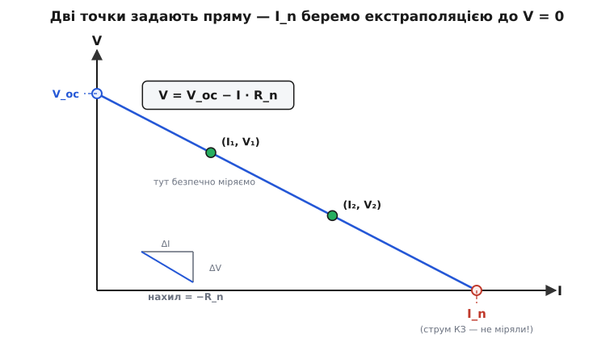

# ⚙️ Нортонів еквівалент на мікроконтролері: I_n і R_n з вимірів, без короткого замикання

Перед мікроконтролером — невідоме джерело. Може, це елемент живлення на виході, може, давач із власною обвʼязкою, може, проста чорна скринька на лабораторному столі: дві клеми назовні, а що всередині — невідомо. Прошивці треба описати цю скриньку парою Нортонових чисел — струмом I_n і опором R_n, — щоб далі рахувати будь-яке навантаження одним рядком. Питання лиш одне, зате гостре: **як добути ці числа, не нашкодивши?**

Бо «канонічне» означення I_n спокушає піти небезпечним шляхом. [I_n — це струм короткого замикання](topic:hw-analog/norton): замкни клеми навпрямки, побач струм. Для слабкого давача це безпечно (амперметр і є майже коротким). Але для зарядженого елемента живлення замкнути клеми накоротко — це пустити лавину струму крізь крихітний [внутрішній опір](topic:hw-analog/internal-resistance): перегрів, зварений ключ, а літієву банку таке коротке може й підпалити. Прошивка, що свідомо коротить джерело, аби «зміряти I_n», — це прошивка, що псує апарат. Отже, число I_n нам потрібне, а робити те, чим його означують, — не можна. Вихід є, і він елегантний: дістати I_n **не вимірявши** його — екстраполяцією.

### Ідея: дві помірні точки, а I_n — на перетині

Уся хитрість спирається на те, що реальне джерело має **пряму** вольт-амперну характеристику. Відбираєш від нього струм I — напруга на клемах падає лінійно:

```
V = V_oc − I · R_n
```

Тут V_oc — напруга холостого ходу (струму не беремо), а нахил падіння — це і є внутрішній опір R_n (той самий R_th: [Нортон і Тевенін описують одну скриньку](topic:hw-analog/norton)). Пряму ж однозначно задають **дві точки**. Звідси весь задум: нехай мікроконтролер під'єднає до клем **два різні відомі навантаження** (через ключі), зніме АЦП дві пари (I, V) — і дістане дві точки на цій прямій. Через них проходить рівно одна лінія, а отже, обидва числа прямої — V_oc і R_n — визначені.

А де ж тут I_n? Це струм за нульової напруги на клемах (повне коротке: V = 0). На графіку — **точка, де пряма перетинає вісь струму**. Нам не треба туди їхати реальним навантаженням — досить **продовжити** пряму, яку вже задали дві безпечні точки, до перетину з V = 0. Той перетин і дає I_n. Коротке замикання ми відтворюємо **на папері мікроконтролера**, а не на клемах джерела.


*Два помірні навантаження дають дві пари (I, V) у безпечній середині характеристики. Через них проходить рівно одна пряма V = V_oc − I·R_n; її нахил — це −R_n, перетин з віссю V — це V_oc, а перетин з віссю I (екстраполяцією, а не реальним коротким) — це шуканий I_n.*

Перетворимо це з картинки на арифметику. Записуємо обидві точки в рівняння прямої:

```
V₁ = V_oc − I₁ · R_n
V₂ = V_oc − I₂ · R_n
```

Дві невідомі (V_oc і R_n), два рівняння — система замкнена. Віднімемо друге від першого: однакові V_oc скоротяться, лишиться сам опір.

```
V₁ − V₂ = (I₂ − I₁) · R_n
```

Звідси нахил, тобто R_n; далі V_oc підставлянням однієї точки; а I_n — як перетин прямої з V = 0 (звідки V_oc = I_n·R_n):

```
R_n  = (V₁ − V₂) / (I₂ − I₁)        ← нахил прямої
V_oc = V₁ + I₁ · R_n                ← екстраполяція вліво, до I = 0
I_n  = V_oc / R_n                   ← екстраполяція вправо, до V = 0
```

Три рядки — і скринька описана повністю. Зверніть увагу, як природно лягають **обидва** Нортонові числа: R_n — це нахил, I_n — це перетин. Жодного короткого замикання, жодного чистого холостого ходу: обидві робочі точки лежать у безпечній середині характеристики, а небезпечні краї дістаються продовженням лінії в обидва боки.

> 🔧 **Навіщо це.** Саме так працюють тестери внутрішнього опору, вимірювачі стану акумулятора й «розумні» павербанки: прошивка сама прикладає два навантаження, читає напругу й видає опис джерела — і робить це **щоразу безпечно**, бо ніколи не замикає клеми. Метод двох струмових щаблів зі співвідношенням R = (V₁−V₂)/(I₂−I₁) — не саморобка, а індустріальний стандарт вимірювання DCIR (постійнострумового внутрішнього опору): його приписують норми на акумулятори (IEC 61960 — щабель струму після паузи; USABC — щабель на десятки секунд), і він живе всередині мікросхем-паливомірів.

### Worked-приклад: рахуємо руками

Перш ніж довірити числа прошивці, проженемо їх власноруч — на тих самих діях, що виконає мікроконтролер.

**Приклад. Невідомий елемент живлення. Прошивка вмикає легке навантаження R₁ = 10 Ω і читає на клемах V₁ = 3.90 В; потім важче R₂ = 2.7 Ω і читає V₂ = 3.60 В. Знайти Нортонів еквівалент (I_n, R_n).**

```
Струми точок (закон Ома, I = V/R — навантаження ж відоме):
        I₁ = V₁/R₁ = 3.90 / 10  = 0.390 А
        I₂ = V₂/R₂ = 3.60 / 2.7 = 1.333 А
Опір Нортона — нахил прямої:
        R_n = (V₁ − V₂)/(I₂ − I₁)
            = (3.90 − 3.60)/(1.333 − 0.390)
            = 0.30 / 0.943                  = 0.318 Ω
Напруга холостого ходу — екстраполяція до I = 0:
        V_oc = V₁ + I₁·R_n = 3.90 + 0.390·0.318 = 4.02 В
Струм Нортона — екстраполяція до V = 0:
        I_n  = V_oc / R_n = 4.02 / 0.318         = 12.6 А
Перевірка V_oc другою точкою:
        V_oc = V₂ + I₂·R_n = 3.60 + 1.333·0.318 = 4.02 В   ✓
```

Обидві точки дали той самий V_oc = 4.02 В — пряма зійшлася, числа правильні. Виходить еквівалент Нортона **12.6 А ∥ 0.32 Ω**. Зверніть увагу на сам I_n: 12.6 ампера — ось скільки джерело віддало б у коротке замикання. Тепер ясно, чому те коротке робити не варто було б: це справді лавина. А ми дістали її значення, **жодного разу не наблизившись** до нього реальним навантаженням — найбільший наш струм був лиш 1.33 А.

### Робочий код для мікроконтролера

Сама арифметика тривіальна — три рядки, — тож головна вага коду не в ній, а в **акуратному вимірі**: усереднити шум АЦП, дочекатися встановлення після перемикання, перевірити, що точки досить різні. Ось закінчена функція мовою C: та сама арифметика, що в прикладі, плюс захист від типових пасток.

:::tabs
```cpp
#include <cstdint>
#include <cmath>

namespace {
    constexpr float R1_OHM   = 10.0f;    // легке навантаження, Ом
    constexpr float R2_OHM   = 2.7f;     // важче навантаження, Ом
    constexpr float ADC_VREF = 3.30f;    // опорна напруга АЦП, В
    constexpr float ADC_MAX  = 4095.0f;  // 12-бітний АЦП
    constexpr float ADC_GAIN = 11.0f;    // подільник входу: 10:1 (1+10k/1k) → діапазон до ~36 В
    constexpr std::uint32_t SETTLE_MS = 50;    // пауза на встановлення після перемикання
    constexpr std::uint8_t  N_AVG     = 32;    // скільки відліків усереднити
    constexpr float MIN_DI_A = 0.10f;    // мінімальна різниця струмів (інакше шум з'їсть знаменник)
}

enum class NortonStatus {          // результат вимірювання
    Ok,
    ErrDiTooSmall,                 // I₂−I₁ потонуло в шумі — точки замалі різні
    ErrNonlinear                   // R_n вийшов від'ємним/безглуздим
};

struct Norton {
    float i_n = 0.0f;              // струм Нортона (струм КЗ), А — дістаний екстраполяцією
    float r_n = 0.0f;             // опір Нортона (= R_th), Ом
    float v_oc = 0.0f;            // напруга холостого ходу, В — проміжне число
    NortonStatus status = NortonStatus::Ok;
};

// заглушки під вашу платформу:
extern std::uint16_t adc_read_raw();            // один сирий відлік АЦП
extern void          load_select(std::uint8_t n); // 1 → R1, 2 → R2, 0 → відключити геть
extern void          delay_ms(std::uint32_t ms);

// усереднене читання напруги на клемах (у вольтах), з урахуванням подільника входу
static float read_terminal_v() {
    std::uint32_t acc = 0;
    for (std::uint8_t i = 0; i < N_AVG; ++i)
        acc += adc_read_raw();
    const float v_adc = (static_cast<float>(acc) / N_AVG) * (ADC_VREF / ADC_MAX);
    return v_adc * ADC_GAIN;            // назад до напруги на клемах
}

// зняти одну точку (I, V) під заданим навантаженням
static void measure_point(std::uint8_t load, float r_ohm, float &v, float &i) {
    load_select(load);                  // під'єднати навантаження ключем
    delay_ms(SETTLE_MS);                // дочекатися сталого рівня
    v = read_terminal_v();
    i = v / r_ohm;                      // струм точки — навантаження ж відоме
}

Norton measure_norton() {
    Norton out;

    float v1, i1, v2, i2;
    measure_point(1, R1_OHM, v1, i1);   // легке навантаження → мала просадка
    measure_point(2, R2_OHM, v2, i2);   // важче навантаження → більша просадка
    load_select(0);                     // зняти навантаження — не гріти джерело!

    // запобіжник №1: точки мають давати ДОСИТЬ різні струми,
    // інакше знаменник (i2 − i1) тоне в шумі АЦП і R_n стрибає в безглуздя.
    if (std::fabs(i2 - i1) < MIN_DI_A) {
        out.status = NortonStatus::ErrDiTooSmall;
        return out;                     // повторити з помітніше різними навантаженнями
    }

    out.r_n  = (v1 - v2) / (i2 - i1);   // нахил прямої = внутрішній опір
    out.v_oc = v1 + i1 * out.r_n;       // екстраполяція вліво, до I = 0

    // запобіжник №2: на справді лінійному джерелі R_n > 0; від'ємний/нуль —
    // ознака грубого збою (переплутані навантаження, шум, нелінійність).
    if (out.r_n <= 0.0f) {
        out.status = NortonStatus::ErrNonlinear;
        return out;
    }

    out.i_n  = out.v_oc / out.r_n;      // екстраполяція вправо, до V = 0 → струм КЗ
    out.status = NortonStatus::Ok;
    return out;
}
```
```python
import time
from dataclasses import dataclass

import pyvisa  # автоматизація стендового вимірювача (DMM + комутатор навантажень)

R1_OHM   = 10.0    # легке навантаження, Ом
R2_OHM   = 2.7     # важче навантаження, Ом
SETTLE_S = 0.05    # пауза на встановлення після перемикання, с
N_AVG    = 32      # скільки відліків усереднити
MIN_DI_A = 0.10    # мінімальна різниця струмів (інакше шум з'їсть знаменник)


class MeasurementError(Exception):
    """Вимір не вдався — точки замалі різні або джерело нелінійне."""


@dataclass
class Norton:
    i_n: float    # струм Нортона (струм КЗ), А — дістаний екстраполяцією
    r_n: float    # опір Нортона (= R_th), Ом
    v_oc: float   # напруга холостого ходу, В — проміжне число


def read_terminal_v(dmm) -> float:
    """Усереднене читання напруги на клемах (у вольтах)."""
    samples = (float(dmm.query("MEAS:VOLT:DC?")) for _ in range(N_AVG))
    return sum(samples) / N_AVG


def measure_point(dmm, load, sel: int, r_ohm: float) -> tuple[float, float]:
    """Зняти одну точку (V, I) під заданим навантаженням."""
    load.select(sel)                    # під'єднати навантаження ключем
    time.sleep(SETTLE_S)                # дочекатися сталого рівня
    v = read_terminal_v(dmm)
    i = v / r_ohm                       # струм точки — навантаження ж відоме
    return v, i


def measure_norton(dmm, load) -> Norton:
    v1, i1 = measure_point(dmm, load, 1, R1_OHM)  # легке навантаження → мала просадка
    v2, i2 = measure_point(dmm, load, 2, R2_OHM)  # важче навантаження → більша просадка
    load.select(0)                      # зняти навантаження — не гріти джерело!

    # запобіжник №1: точки мають давати ДОСИТЬ різні струми,
    # інакше знаменник (i2 − i1) тоне в шумі й R_n стрибає в безглуздя.
    if abs(i2 - i1) < MIN_DI_A:
        raise MeasurementError("I₂−I₁ замале — повторіть з різнішими навантаженнями")

    r_n  = (v1 - v2) / (i2 - i1)        # нахил прямої = внутрішній опір
    v_oc = v1 + i1 * r_n               # екстраполяція вліво, до I = 0

    # запобіжник №2: на справді лінійному джерелі R_n > 0; від'ємний/нуль —
    # ознака грубого збою (переплутані навантаження, шум, нелінійність).
    if r_n <= 0.0:
        raise MeasurementError("R_n ≤ 0 — джерело нелінійне або переплутані навантаження")

    i_n = v_oc / r_n                   # екстраполяція вправо, до V = 0 → струм КЗ
    return Norton(i_n=i_n, r_n=r_n, v_oc=v_oc)


if __name__ == "__main__":
    rm = pyvisa.ResourceManager()
    dmm = rm.open_resource("USB0::0x0000::0x0000::INSTR")   # ваш мультиметр
    load = LoadSwitch(rm)                                   # комутатор R1/R2/off
    result = measure_norton(dmm, load)
    print(f"I_n = {result.i_n:.1f} А,  R_n = {result.r_n:.2f} Ом")
```
:::

Підставте в розум платні значення з прикладу — функція поверне ті самі 12.6 А і 0.32 Ω, не наблизивши джерело до короткого замикання ні на крок. Три речі в коді варті окремого слова, бо саме вони відрізняють робочий вимір від наївного.

**Усереднення АЦП.** Один відлік АЦП тремтить: теплові шуми, наводки, остання непевна молодша значуща цифра. Тому `read_terminal_v` бере N_AVG відліків і ділить — шум випадковий, тож при усередненні N відліків його розкид падає десь у √N разів. Це особливо важливо тут, бо далі ми **віднімаємо** V₁ − V₂, а віднімання двох близьких чисел підсилює відносний шум кожного.

**Очікування на встановлення.** Після перемикання ключа напруга на клемах сідає на новий рівень не вмить — заважають хімія елемента й паразитні ємності кола. Прочитаєш АЦП відразу — зміряєш перехідний процес, а не сталу робочу точку, і пряма піде криво. Тому `delay_ms(SETTLE_MS)` стоїть **перед** кожним читанням, після кожного перемикання.

**Перевірка різниці струмів.** У знаменнику стоїть (I₂ − I₁). Якщо два навантаження близькі, ця різниця крихітна, і будь-який залишковий шум АЦП роздуває R_n до безглуздя — фактично ділення на майже-нуль. `MIN_DI_A` ловить цей випадок і чесно повертає помилку замість сміттєвого числа: краще перевиміряти з помітніше різними навантаженнями, ніж видати фальшивий опис джерела.

### Крос-звірка через перетворення джерел

Маючи (I_n, R_n), варто провести незалежну перевірку — її дарма не пропускати, бо вона ловить грубі помилки масштабування АЦП чи переплутаних навантажень майже задарма. Інструмент — [перетворення джерел](topic:hw-analog/norton): те саме реальне джерело можна описати або як Нортонове (струм I_n паралельно з R_n), або як Тевенінове (напруга V_th послідовно з тим самим R_n), і обидва описи **зобовʼязані** дати ту саму напругу холостого ходу:

```
V_th = I_n · R_n     (перетворення Нортон → Тевенін)
```

А ту саму V_th прошивка вже має незалежно — це V_oc, яке вона дістала екстраполяцією прямої вліво. Якщо два шляхи сходяться, вимір цілісний:

```c
// крос-звірка: V_th із перетворення джерел має збігтися з V_oc із прямої
static int norton_self_check(const norton_t *n) {
    float v_th = n->i_n * n->r_n;       // Нортон → Тевенін
    float err  = fabsf(v_th - n->v_oc); // має бути ≈ 0
    return err < 0.05f * n->v_oc;       // дозвіл 5 % на шум вимірів
}
```

Тут збіг закладено самою алгеброю: I_n ми ж і означили як V_oc/R_n, тож I_n·R_n тотожно повертає V_oc. Тому ця перевірка ловить не помилку арифметики (її там нема), а **грубий збій вимірювання чи масштабування**: якщо, скажімо, переплутати R₁ і R₂ місцями, R_n вийде від'ємним і запобіжник спрацює раніше; якщо схибити з коефіцієнтом подільника АЦП, обидва числа поїдуть, але їхній добуток уже не зійдеться з прямою. Дешева страховка від тихої помилки, що інакше видала б правдоподібне, але хибне число.

### Складність і пастки

Арифметика тривіальна — три рядки, — та диявол живе у вимірюванні. Кожна пастка нижче псує або знаменник (I₂ − I₁), або саму напругу, тож недбалість тут дорого коштує: число вийде, виглядатиме правдоподібно, а буде хибним.

- **Не коротити клеми — у цьому весь сенс методу.** Спокуса «просто зміряти I_n» через коротке замикання нікуди не зникає, та піддаватися їй не можна: для зарядженого джерела це лавина струму, що стресує сам елемент і ключ, а літієву банку гріє через [джоулеве тепло](topic:ph-electromagnetism/joule-heating) (втрати I²·R) аж до загоряння. Увесь метод і збудовано, щоб I_n дістати **екстраполяцією**, а не дотиком до небезпечного краю. Тому код одразу викликає `load_select(0)` — навантаження висить лише ті кілька мілісекунд, що треба на вимір.
- **Навантаження мають давати ДОСИТЬ різні струми.** Це не дрібниця стилю, а умова, що метод узагалі працює. Знаменник (I₂ − I₁) має вивищуватися над шумом АЦП; інакше точки майже зливаються, нахил визначається безглуздо, і R_n стрибає. Бери одне навантаження легке, друге помітно важче — у прикладі струми відрізнялися втричі, це здоровий запас. Орієнтир: важче навантаження бажано порівнянне за порядком із самим R_n (тоді просадка V₁ − V₂ добре помітна), але не настільки мале, щоб зайти в небезпечну зону струму. Якщо R_n наперед невідомий зовсім — роби пробний вимір абияк, прикинь порядок опору й уже тоді добирай пару резисторів свідомо.
- **Масштабування АЦП і шунта — джерело тихих помилок.** Число на виході залежить від точності двох ланцюгів: подільника напруги на вході АЦП (`ADC_GAIN`) і самих опорів навантаження. Помилишся з коефіцієнтом подільника — обидва Нортонові числа поїдуть пропорційно. Похибка номіналу R₁/R₂ прямо перетікає у струми точок, а отже, у нахил. Тому в серйозному приладі резистори навантаження беруть точними (1 % і краще), а подільник і опорну напругу АЦП — калібрують. Саме на такі промахи й полює крос-звірка через перетворення джерел.
- **R_n — це миттєвий знімок, а не стала.** [Внутрішній опір](topic:hw-analog/internal-resistance) джерела залежить від заряду, температури й самого струму, яким його будять. Виміряне R_n справедливе **тут і зараз**, за цього стану й цих навантажень; за іншого режиму воно інше. Це не вада методу, а властивість джерела — просто памʼятайте, що міряєте поточний стан, а не паспортну величину на всі випадки.
- **Лінійність — припущення, яке варто контролювати.** Дві точки завжди лягають на якусь пряму — навіть якщо джерело насправді гнеться (глибокий розряд, насичення давача). Сам метод цього не помітить. Хочете впевненості — зніміть **третю** точку й гляньте, чи лежить вона на тій самій прямій: відхилення викаже нелінійність. Для самого еквівалента двох точок досить, але третя — дешевий контроль якості.

> 🔧 **Навіщо це.** Маючи лише два резистори, два ключі (зазвичай це [MOSFET-и в ролі ключа](topic:hw-components/mosfet-switch)) та [АЦП](topic:hw-analog/adc), мікроконтролер визначає Нортонів еквівалент будь-якого реального джерела — безпечно, бо ніколи його не коротить. Це готовий блок для зарядних пристроїв, павербанків і моніторів стану батареї. Окрема цінна служба — стеження за «здоровʼям» акумулятора в часі: внутрішній опір елемента з віком повзе вгору, тож **зростання** виміряного R_n від циклу до циклу певно сигналить, що банка старіє й час її міняти. Тут, щоправда, без ілюзій: саме лише R_n не дає повної картини стану (близькі значення може дати й справна підсаджена банка, і втомлена заряджена), тому в серйозних паливомірах опір беруть не наодинці, а разом із обліком заряду й температури — як одну з кількох ознак, а не присуд.
