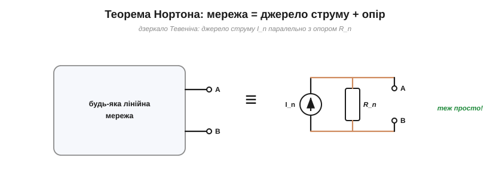
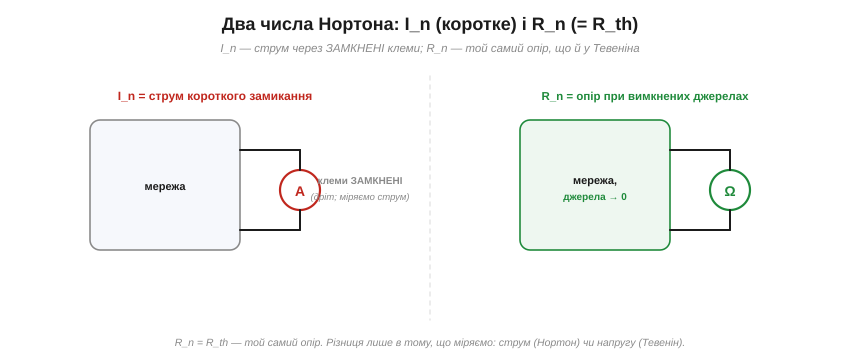
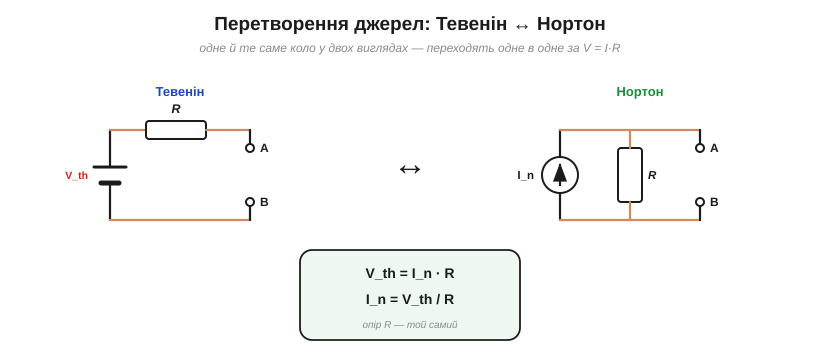
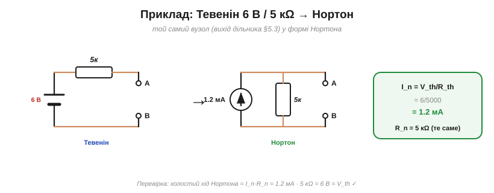

# Теорема Нортона: двоїстість

У [теореми Тевеніна](topic:hw-analog/thevenin) є **дзеркальний** двійник — **теорема Нортона**. Ту саму ідею в **дуальній** формі 1926 року незалежно описали двоє: Едвард Лорі Нортон у звіті Bell Labs і Ганс Фердинанд Маєр у Siemens & Halske, тож строго її звуть теоремою Маєра — Нортона. В основі — двоїстість [послідовного](topic:hw-analog/series-connection) і [паралельного](topic:hw-analog/parallel-connection) з'єднань.

### Що каже теорема Нортона


*Теорема Нортона — дзеркало Тевеніна: будь-яку лінійну мережу з двох клем можна замінити джерелом **струму** I_n паралельно з опором R_n.*

Теорема Нортона: будь-яка лінійна двополюсна мережа еквівалентна джерелу **струму** I_n (струм Нортона) **паралельно** з опором R_n. Порівняйте з [Тевеніном](topic:hw-analog/thevenin): там було джерело **напруги послідовно** з опором, тут — джерело **струму паралельно**. Точна двоїстість: напруга↔струм, послідовно↔паралельно. Обидві схеми описують **ту саму** чорну скриньку й однаково правдиві; це лише два «обличчя» одного еквівалента.

На схемах джерело струму малюють кружком зі стрілкою (напрям струму), на відміну від двох рисок батареї. І так само, як реальна батарея, реальне струмове джерело має скінченний внутрішній опір — це і є R_n, тільки ввімкнений **паралельно** (а не послідовно, як r у Тевеніна).

### I_n і R_n


*Два числа Нортона: **I_n** — струм через **замкнені** клеми (коротке замикання); **R_n** — той самий опір, що й R_th (мережа з вимкненими джерелами). Тевенін міряє напругу холостого ходу, Нортон — струм короткого замикання.*

Два числа Нортона знаходять майже так само, як Тевенінові, лише дзеркально. **I_n — це струм короткого замикання**: той, що потече через клеми, якщо **замкнути** їх навпрямки (дротом). **R_n — це той самий опір, що й R_th** (мережа з вимкненими джерелами); опір у Тевеніна й Нортона **однаковий**. Уся різниця в тому, **що** ми міряємо на клемах: Тевенін дивиться на напругу холостого ходу (клеми розімкнені), Нортон — на струм короткого замикання (клеми замкнені).

Маленьке застереження з безпеки: «коротке замикання» для знаходження I_n — здебільшого **розрахункова** операція. Реально замикати клеми потужного джерела не варто — потече величезний струм (ε/r, обмежений лише [внутрішнім опором](topic:hw-analog/internal-resistance)), можливі іскри й перегрів. Для слабких джерел I_n міряють амперметром (він і є майже коротким замиканням, бо має дуже малий опір), а для потужних — рахують.

### Перетворення джерел: Тевенін ↔ Нортон

Оскільки обидва описують ту саму скриньку, між ними є простий **перехід** — і це один із найкорисніших прийомів у всій схемотехніці.


*Перетворення джерел: Тевенін (V_th послідовно з R) і Нортон (I_n паралельно з R) — це одне коло у двох виглядах. Переходять одне в одне за V_th = I_n·R; опір R той самий.*

**Перетворення джерел** (*source transformation*) дозволяє будь-якої миті замінити «джерело напруги + послідовний опір» на «джерело струму + паралельний опір» (і навпаки), за простими формулами:

V_th = I_n · R,  I_n = V_th / R,  опір R — **той самий**.

Навіщо це потрібно? Бо різні форми **по-різному комбінуються**. Джерела напруги легко складати, коли вони послідовні; джерела струму — коли паралельні. Перетворюючи туди-сюди, можна **злити** елементи, що інакше не складались, і поетапно спростити навіть заплутане коло до одного еквівалента. Це робоча конячка ручного аналізу схем.

Найчастіше це виглядає так: бачите джерело напруги з послідовним резистором, що заважає звести паралельні гілки, — перетворюєте його на Нортонове джерело струму з паралельним резистором, і тепер усі паралельні опори та струмові джерела складаються легко. Звівши все докупи, за потреби перетворюєте результат назад на Тевенін. Туди-сюди — і ціла мережа сходиться до одного джерела з одним опором.

### Коли який зручніший


*Обидва еквіваленти рівносильні; обирають за зручністю. Тевенін природний для послідовних з'єднань і «напругових» джерел; Нортон — для паралельних і «струмових».*

Раз вони рівносильні, який брати? Питання **зручності**. **Тевенін** природніший там, де елементи йдуть **послідовно**, де цікавить **напруга** на навантаженні, де джерело «напругове» (батарея, блок живлення). **Нортон** — там, де елементи **паралельні**, де цікавить **струм** у гілці, а джерело «струмове». Останнє не екзотика: фотодіод, давач, транзистор у певному режимі поводяться саме як **джерела струму**, і їх природно описувати по-Нортонівськи. Досвідчений інженер тримає в голові обидва й перемикається між ними, як між мовами.

### Приклад


*Приклад: Тевенін 6 В / 5 кΩ у формі Нортона: I_n = V_th/R_th = 6/5000 = 1.2 мА, R_n = 5 кΩ. Перевірка: I_n·R_n = 6 В = V_th.*

Візьмімо готовий [еквівалент Тевеніна](topic:hw-analog/thevenin) і перетворімо його на Нортон.

**Приклад. Еквівалент Тевеніна 6 В з R_th = 5 кΩ — який його еквівалент Нортона?**

```
I_n = V_th / R_th = 6 / 5000              = 1.2 мА   (струм короткого замикання)
R_n = R_th                                = 5 кΩ     (той самий опір)
Перевірка: холостий хід = I_n·R_n = 1.2 мА · 5 кΩ = 6 В = V_th  ✓
```

Перевірка зійшлася: розімкнувши клеми Нортонової схеми, весь струм I_n тече крізь R_n, даючи напругу I_n·R_n = 6 В — рівно V_th. Дві схеми **нерозрізнимі** ззовні, як і має бути.

> 🔧 **Навіщо це.** Головна практична цінність Нортона — **перетворення джерел** як інструмент спрощення. Замінюючи «напруга + послідовний R» на «струм + паралельний R», ви зводите докупи елементи, що в первісному вигляді не складались, — і складне коло тане до простого еквівалента. А ще Нортон — природна мова для **струмових** джерел: фотодіод дає струм, пропорційний світлу; багато давачів і транзисторних каскадів — теж джерела струму. Описувати їх по-Тевенінівськи незручно, а по-Нортонівськи — якраз. Пам'ятайте головне: Тевенін і Нортон — **те саме** ззовні (V_th = I_n·R, опір спільний), тож обирайте ту форму, що спрощує саме вашу задачу.

---

Підсумок: **теорема Нортона** — дзеркало Тевеніна: будь-яка лінійна мережа = джерело **струму** I_n паралельно з опором R_n. I_n — струм короткого замикання; R_n = R_th (той самий опір). Між формами є просте **перетворення джерел** (V_th = I_n·R), що служить потужним інструментом спрощення кіл. Тевенін зручний для послідовних/напругових задач, Нортон — для паралельних/струмових.

---
