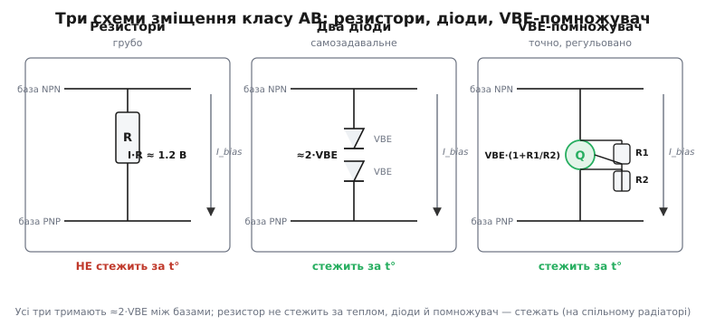

# 🔌 Схеми зміщення вихідного каскаду класу AB

Вихідний каскад класу AB має одну-єдину делікатну задачу, від якої залежить, чи звучатиме він чисто: тримати між базами двох вихідних транзисторів сталу напругу зміщення приблизно у два пороги переходу, ≈2·VBE, щоб обидва прилади в спокої стояли ледь прочинені. Це звучить просто, аж поки не починаєш робити насправді. Бо ця напруга мусить бути не «приблизно правильною раз і назавжди», а **живою** — стежити за температурою, бо поріг переходу повзе вниз, коли кристал гріється. Поставите зміщення мертвим числом — каскад або пісочитиме холодним, або піде в тепловий розгін гарячим.

Тут немає магії й немає партномера, який «усе зробить». Є три типові кола, кожне зі своїм характером, і одне ключове рішення — який струм спокою закласти. Розберімо ці кола як **клас вузла**: що це за блок, яка в нього схема, як його підключають у каскад, як порахувати номінали з першого разу й на які граблі тут наступають усі.

## Що це за вузол і де він стоїть

Перш ніж дивитися на самі схеми, домовмося, **де** в каскаді живе блок зміщення й що від нього хочуть.

Двотактний вихід — це NPN зверху (тягне вихід до плюсової шини) і PNP знизу (тягне до мінусової), їхні емітери з'єднані в спільну точку виходу. Сигнал від попереднього каскаду — підсилювача напруги — приходить однією лінією. Якби цю лінію завести **прямо** на обидві бази разом, бази мали б однаковий потенціал; але щоб обидва прилади були прочинені, базі NPN треба бути **вище** від спільного емітера на ≈0.6 В, а базі PNP — **нижче** на ≈0.6 В. Тобто між двома базами треба втримати розрив ≈1.2 В, причому так, щоб **сигнал проходив крізь цей розрив наскрізь**, рухаючи обидві бази вгору-вниз разом, не змінюючи відстані між ними.

Ось точне формулювання задачі блока зміщення: це **плавальне джерело сталої напруги**, увімкнене між двома базами. «Плавальне» (англ. *floating* — не прив'язане до землі) — бо обидва його кінці гойдаються разом із сигналом; воно лише тримає між собою фіксований проміжок ≈2·VBE. Для сигналу цей блок має бути **малого опору** — інакше сигнал на ньому загубиться; а для постійного струму — давати потрібну сталу напругу.

```
                    +V
                     │
            ┌────────┴────────┐
            │              ┌──┴──┐
            │              │ NPN │  тягне вихід угору
            │              └──┬──┘
       I_bias ↓          база │ (вище за вихід на ≈VBE)
            │          ┌──────┴──────┐
сигнал ─────┤  БЛОК    │   зміщення  │  тримає 2·VBE
            │  ЗМІЩЕННЯ │  між базами │
            │          └──────┬──────┘
            │          база    │ (нижче за вихід на ≈VBE)
            │              ┌──┴──┐
            │              │ PNP │  тягне вихід униз
            │              └──┬──┘
            └────────┬────────┘
                     │
                    −V
                  спільні емітери → вихід
```

Через блок зміщення завжди тече якийсь струм підпору I_bias — його зазвичай задає джерело струму попереднього каскаду. Цей струм мусить бути більший за струм, який блок «віддає» в бази вихідних приладів на піках сигналу, інакше на піку зміщення «провисне». Тримайте в голові цей струм — від нього залежать номінали в усіх трьох схемах.

> 🔧 **Навіщо це.** Якщо колись доведеться розбирати чужу схему вихідного каскаду чи рисувати власну на дискретних транзисторах, перше, що треба впізнати на схемі, — оцей плавальний блок між базами. Знайшли його — знайшли «серце» класу AB: саме він і тільки він визначає струм спокою, а отже й те, чи каскад чистий, чи холодний, чи живий узагалі. Усе інше в каскаді — обрамлення навколо цього блоку.

## Підхід перший: резистори — грубо й без термостеження

Найпростіша думка, яка спадає першою: розсунути дві бази звичайним падінням напруги на резисторі. Через блок тече струм підпору I_bias; пропустимо його крізь резистор R_bias, увімкнений між базами, — на ньому впаде V = I_bias·R_bias. Підберемо добуток так, щоб вийшло ≈1.2 В, — і начебто все.

```
        I_bias ↓
   база NPN ──┬───────────
             ┌┴┐
             │ │ R_bias    падіння = I_bias · R_bias ≈ 1.2 В
             └┬┘
   база PNP ──┴───────────
```

**Скільки опору.** Хай струм підпору I_bias = 5 мА, хочемо на резисторі ≈1.2 В:

```
R_bias = V / I_bias = 1.2 / 0.005 = 240 Ом
```

Просто, дешево, працює… на столі, поки нічого не нагрілося. А тепер — чому це найгірший із трьох підходів, і чому варто розуміти його ваду до кінця.

Біда у двох словах: **резистор нічого не знає про транзистор**. Падіння на ньому задане законом Ома й залежить лише від струму та опору — і ніяк не пов'язане з порогом переходу, який треба компенсувати. А цей поріг — величина не стала:

```
Поріг переходу VBE падає зі зростанням температури:
ΔVBE / ΔT ≈ −2 мВ на кожен °C
```

Уявіть, що каскад попрацював і вихідні транзистори нагрілися на 40 °C. Їхній поріг впав на 40·2 = 80 мВ на кожен прилад, разом на ≈160 мВ. Щоб струм спокою лишився тим самим, зміщення між базами мало б **теж** упасти на 160 мВ. Але резистор тримає свої 1.2 В як укопаний — він-бо «не в курсі», що пороги поповзли. Виходить, тепер на прилади подано **на 160 мВ більше**, ніж їм треба, — і крізь них поллється набагато більший струм спокою. Більший струм гріє ще дужче, поріг падає ще нижче, надлишок зміщення росте — це і є замкнене коло теплового розгону. Резистор не лише не гальмує його, а **підкидає дров**.

Є й симетрична біда з холодного боку: на старті, поки каскад іще не прогрівся, поріг високий, а зміщення фіксоване — його може **не вистачити**, і лишиться маленька сходинка перехідного спотворення, доки прилади не вийдуть на робочу температуру.

Тому чисто резисторне зміщення годиться лише там, де на якість виходу майже начхати: дешева сигналізація, службовий буфер, де сходинку однаково ніхто не почує, а потужності так мало, що тепловий розгін фізично неможливий. Як тільки на кону чистота звуку чи помітна вихідна потужність — резистор сходить зі сцени. Його єдина чеснота — нуль додаткових деталей; усе інше проти нього.

> 🔧 **Навіщо це.** Резисторне зміщення варто знати не щоб його ставити, а щоб **упізнати ваду** в чужій схемі. Побачили, що бази вихідних транзисторів розсунуті простим резистором, а каскад гарячий або «пісочить» по-різному в різну погоду, — діагноз готовий: зміщення не стежить за температурою, треба міняти топологію на діоди чи VBE-помножувач. Це типовий «дешевий гріх» аматорських підсилювачів.

## Підхід другий: пара кремнієвих діодів — самозадавальне зміщення

Розумніший хід випливає прямо з причини самої вади. Якщо нам треба компенсувати **два пороги переходу**, то найприродніше взяти за зразок зміщення… ті самі переходи. Кремнієвий діод — це й є p–n перехід із того ж кремнію, що й перехід база–емітер транзистора, і падає на ньому те саме ≈0.6 В у прямому напрямку. Поставимо між базами **два діоди** послідовно (по одному «на голову» кожного вихідного транзистора), пропустимо крізь них струм підпору — і вони самі дадуть ≈1.2 В. Не треба нічого підбирати: діод **сам** знає правильну напругу, бо він тієї ж природи, що й те, що ми компенсуємо.

```
        I_bias ↓
   база NPN ──┬───────
            ──┴──   D1   ▲ падає ≈ VBE
            ──┬──        │ (у прямому напрямку)
            ──┴──   D2   ▲ падає ≈ VBE
   база PNP ──┬───────
              разом ≈ 2·VBE
```

Краса не лише в тому, що напруга виходить сама собою правильна. Головне — діод **повторює температурну поведінку** транзистора. Падіння на прямому діоді теж зменшується з нагрівом, теж приблизно на −2 мВ/°C. Отже, якщо притиснути ці діоди до того ж радіатора, що й вихідні транзистори, то коли прилади гріються й їхній поріг падає, поріг діодів падає **синхронно** — і зміщення між базами **само** зменшується рівно настільки, скільки треба, щоб струм спокою лишився стабільним. Зміщення з мертвого числа перетворюється на живе, що стежить за теплом. Саме це й рятує від теплового розгону, з яким резистор не впорався.

**Чому тепловий контакт обов'язковий.** Підкреслимо, бо це найчастіша помилка. Уся компенсація працює лише тоді, коли діоди **тієї ж температури**, що й вихідні транзистори. Якщо діоди лишити теліпатися в повітрі на платі, а транзистори прикрутити до гарячого радіатора, то прилади нагріються й попросять менше зміщення, а діоди залишаться холодними й нічого не зменшать — компенсації нема, розгін повертається. Тому діоди притискають до спільного радіатора з вихідними приладами, мажуть теплопровідною пастою, інколи беруть діод просто в одному корпусі з транзистором. **Тепловий контакт — не дрібниця для краси, а сама суть прийому.**

Тепер чесно про межі цього підходу — бо ідеальним він не буває.

Перше: два діоди дають **рівно** ≈1.2 В, ні крапелькою більше. А реальному каскаду часто треба трохи **більше**: вихідні транзистори нерідко складені (наприклад, пара Дарлінгтона — два переходи замість одного на плече), тоді компенсувати треба вже **чотири** пороги, ≈2.4 В, і двох діодів замало. Доводиться ставити чотири діоди — а четвірка вже погано «лягає» на потрібне число, дискретність крупна, точно не підженеш.

> Складений транзистор, де два прилади поводяться як один із велетенським підсиленням, але **подвоєним** порогом ≈1.2 В замість 0.6 В, — типовий мешканець вихідних плечей. Чому в нього два пороги й чому це міняє арифметику зміщення, розібрано в темі [Схема Дарлінгтона](topic:hw-analog/darlington-pair).

Друге: діод дає **те, що дає**, — у вас немає ручки точно виставити струм спокою. Хочете трохи чистіший перехід ціною ледь більшого струму — діоди вам цього не дозволять, вони жорстко тримають свої ≈2·VBE. Зміщення **самозадавальне**, але саме тому й **нерегульоване**.

Третє, тонше: компенсація діодами буває **надмірною**. Діоди й вихідні транзистори, хоч і кремнієві, працюють за різних струмів і трохи різного нагріву; температурний нахил у них близький, але не точно однаковий, та й до радіатора діод прогрівається з запізненням. На практиці пара діодів іноді компенсує «занадто» або «замало» на кілька відсотків, і ідеально стабільного струму спокою на всьому діапазоні не дає. Для багатьох задач цього вистачає; для прецизійних — ні.

Отже діоди — добрий середній клас: розумніші за резистор (самі дають напругу й стежать за теплом), але грубі за номіналом (крок ≈0.6 В) і без ручки налаштування. Коли треба влучити точно — переходять до третього підходу.

> 🔧 **Навіщо це.** Діодне зміщення — улюблений «дешевий, але правильний» прийом: дві копійчані деталі, жодних розрахунків, а тепловий розгін уже приборкано самою фізикою. Ставте його, коли потрібен чистий каскад без претензій на ідеал і коли число порогів зручно лягає на ціле число діодів (одне плече = два діоди). Тільки **не забудьте про тепловий контакт** — без нього все це не працює, і це провал номер один у самостійних конструкціях.

## Підхід третій: VBE-помножувач — точне, регульоване зміщення

А якщо потрібне і термостеження, і **точне** число вольтів, яке можна виставити під конкретні транзистори й бажаний струм спокою? Тоді ставлять найгнучкіший вузол — **VBE-помножувач** (англ. *VBE multiplier*, помножувач напруги база–емітер). Це маленький додатковий транзистор плюс два резистори, увімкнені так, що вузол тримає між своїми кінцями напругу, **кратну** одному порогу, а множник задають саме ці два резистори. Хочете 1.2 В — поставите множник ≈2; хочете 2.4 В під дарлінгтонівські плечі — поставите ≈4; хочете 1.9 В — будь ласка, помножувач дає **будь-яке** дробове число, на відміну від діодів із їхнім жорстким кроком.

Розберімо, **як** він це робить — тут гарна фізика, варта розуміння, бо вона ж пояснює, чому помножувач і термостежить.

```
   колектор ──┬───────────  верхній кінець (до бази NPN)
             ┌┴┐
             │ │ R1        ← верхній резистор
             └┬┘
       база ──┼──────┐
             ┌┴┐    │
             │ │ R2  │ Q (помножувач)  база стежить за вузлом дільника
             └┬┘    │
   емітер ───┴──────┴───  нижній кінець (до бази PNP)
```

Додатковий транзистор Q увімкнений між верхнім і нижнім кінцями вузла. Два резистори, R1 (зверху, від колектора до бази) і R2 (знизу, від бази до емітера), утворюють **дільник** напруги, що стоїть на повній напрузі вузла «колектор–емітер» V_CE. Середня точка дільника заведена на **базу** Q.

Тепер — ключ. Транзистор Q «слухає» свою напругу база–емітер і поводиться так: щойно ця напруга трохи перевищить поріг (≈0.6 В), Q відкривається й починає шунтувати струм, **знижуючи** напругу на собі. Це від'ємний зворотний зв'язок, і він заганяє систему в рівновагу, де напруга база–емітер самого Q дорівнює рівно його порогу VBE. А оскільки на базу подано лише **частку** повної напруги вузла (ту, що знімається з нижнього резистора дільника), то повна напруга мусить бути більшою в стільки разів, у скільки повний дільник більший за нижнє плече.

Доведемо це акуратно. На R2 падає рівно VBE (бо база Q тримається на пороговій напрузі над емітером). Через R2 тече струм:

```
I_R2 = VBE / R2
```

Якщо знехтувати маленьким струмом бази Q (він малий — Q бере з дільника крихту), то той самий струм тече й крізь R1. Тоді на R1 падає:

```
V_R1 = I_R2 · R1 = VBE · R1 / R2
```

А повна напруга вузла — це сума падінь на обох резисторах:

```
V_bias = V_R1 + V_R2 = VBE · R1/R2 + VBE = VBE · (1 + R1/R2)
```

Ось і вся формула помножувача — чиста, як дзвін:

```
V_bias = VBE · (1 + R1/R2)
```

Множник (1 + R1/R2) — ваша ручка. Хочете подвоїти поріг (множник 2) — беріть R1 = R2. Хочете множник 3.2 — беріть R1/R2 = 2.2. Усе зміщення тепер задається **відношенням** двох резисторів, а не випадковим струмом чи кількістю діодів.

**Як рахувати номінали.** Покажемо весь шлях на числах — саме так роблять, добираючи помножувач.

**Умова.** Вихідні плечі — поодинокі транзистори (один поріг VBE ≈ 0.62 В кожен), треба зміщення V_bias ≈ 1.30 В (трохи більше за голі 1.24, бо хочемо невеликий струм спокою на емітерних резисторах, про них далі). Поріг самого помножувача VBE ≈ 0.62 В. Струм підпору крізь вузол I_bias = 5 мА.

```
Крок 1. Потрібний множник:
   M = V_bias / VBE = 1.30 / 0.62 ≈ 2.10
   M = 1 + R1/R2  →  R1/R2 = M − 1 = 1.10

Крок 2. Струм дільника беремо помітно більший за струм бази Q,
   але набагато менший за I_bias (щоб дільник не «крав» струм підпору).
   Хай I_дільн ≈ 1 мА (п'ята частина від I_bias):
   R2 = VBE / I_дільн = 0.62 / 0.001 = 620 Ом

Крок 3. R1 із відношення:
   R1 = 1.10 · R2 = 1.10 · 620 ≈ 680 Ом   (найближчий ряд)

Перевірка:
   V_bias = 0.62 · (1 + 680/620) = 0.62 · 2.097 ≈ 1.30 В  ✓
```

Чотири рядки розрахунку — і ви маєте точно те зміщення, яке хотіли, з можливістю підкрутити його зміною одного резистора. Часто R1 (або частину його) беруть **підстроювальним**, щоб виставити струм спокою точно вже на готовій платі, на слух чи за міліамперметром.

**Чому помножувач теж термостежить — і навіть краще керовано.** Раз напруга вузла прив'язана до власного порога VBE транзистора Q, вона **успадковує** його температурну поведінку: коли Q гріється, його поріг падає на ті ж −2 мВ/°C, і все зміщення повзе вниз. Притисніть Q до радіатора з вихідними приладами — і отримаєте те саме термостеження, що й від діодів. Але є тонкий бонус: множник масштабує **і температурний нахил теж**. Бо V_bias = VBE·M, а отже й ΔV_bias/ΔT = (ΔVBE/ΔT)·M. Множник 2 дає нахил ≈−4 мВ/°C, множник 4 — ≈−8 мВ/°C. Це означає, що помножувач компенсує саме **стільки** порогів, скільки в нього вписали множником, — два пороги, чотири, дробове число — на відміну від діодів, де крок жорсткий. Підбором множника настроюють силу термокомпенсації під конкретну топологію плечей.

> Цей вузол — приклад того, як один транзистор з від'ємним зворотним зв'язком тримає сталу напругу. Та сама ідея «прилад слухає свою VBE й заганяє коло в рівновагу» лежить в основі багатьох опорних і дзеркальних схем; коротко про механізм такого самостабілізування — у темі [Дзеркало струмів](topic:hw-analog/current-mirror).

VBE-помножувач — вищий клас зміщення: точний (будь-який множник), регульований (крути R1), термостежний (успадковує VBE), та ще й масштабує компенсацію під число порогів. Платня — один зайвий транзистор і два резистори проти двох діодів. Саме його ставлять там, де перехідне спотворення критичне: у якісних аудіопідсилювачах, у прецизійних драйверах. Усередині інтегральних ОП застосовують ту саму ідею, тільки на кристалі, де всі прилади поряд і за визначенням однакової температури.

> 🔧 **Навіщо це.** Якщо доведеться будувати дискретний вихідний каскад під якість, VBE-помножувач — ваш робочий інструмент: одним відношенням резисторів виставляєте струм спокою точно, підстроювальним R1 доводите його на готовій платі, а тепловим контактом транзистора Q з радіатором приборкуєте розгін. Запам'ятайте формулу V_bias = VBE·(1 + R1/R2) — це той рідкісний випадок, коли одна проста рівність прямо дає вам ручку керування «серцем» каскаду.

## Емітерні резистори: тиха страховка від розгону

Хоч би яку схему зміщення ви взяли, у серйозному каскаді біля кожного вихідного транзистора майже завжди стоїть маленький резистор у його **емітері** — частки ома, типово 0.1–0.5 Ом. Вони називаються **емітерними резисторами дегенерації** (англ. *emitter degeneration resistors*, від *degenerate* — «послаблювати» підсилення заради стійкості) і роблять дві важливі речі, попри мізерний номінал.

Принцип простий і красивий — це **від'ємний зворотний зв'язок струму**. Уявіть, що крізь NPN раптом потік більший струм (нагрівся, поріг упав). Цей струм тече і крізь його емітерний резистор, тож на резисторі росте падіння напруги. Але це падіння **віднімається** від напруги, що відкриває перехід: ефективне зміщення на самому переході = (зовнішнє зміщення) − (падіння на емітерному резисторі). Більший струм → більше падіння → менше відкриває перехід → струм **сам себе** притримує. Резистор у емітері — це автоматичний гальмівний зворотний зв'язок: чим дужче прилад розганяється, тим сильніше резистор його осаджує.

```
Без емітерного R:  струм залежить лише від зміщення й порога — нічим не стримується.
З емітерним R_e:   V_перех = V_зміщ − I_e · R_e
                   I_e ↑  ⇒  I_e·R_e ↑  ⇒  V_перех ↓  ⇒  I_e притримується
                   (від'ємний зворотний зв'язок струму — самостабілізація)
```

Ось чому емітерні резистори — друга лінія оборони проти теплового розгону, на додачу до термостежного зміщення. Навіть якщо компенсація зміщення трохи «не влучила», емітерні резистори м'яко зв'яжуть струм і не дадуть йому втекти. Вони ж вирівнюють струм між **паралельними** вихідними транзисторами, коли потужності одного приладу мало й ставлять кілька: без резисторів найгарячіший прилад забрав би на себе весь струм, із резисторами струм ділиться рівно.

> Чому без баластного опору паралельні прилади не діляться струмом порівну, а найгарячіший «перетягує ковдру» на себе, — окрема важлива тема. Механізм нерівного поділу й те, як його лікують малими резисторами, розібрано в темі [Розподіл струму між паралельними джерелами](topic:hw-power/current-sharing).

Чому ж резистор **малий**, частки ома? Бо за нього платять. Падіння на ньому з'їдає трохи розмаху виходу (на піку струму губиться I·R_e вольтів) і ледь підвищує вихідний опір каскаду. Тож беруть компроміс: достатньо великий, щоб стабілізувати й вирівняти струм, але достатньо малий, щоб майже не красти розмах. Звідси й типові 0.1–0.5 Ом. На цих резисторах, до речі, зручно **міряти** струм спокою: знаєте R_e, виміряли падіння — порахували струм через плече, не розриваючи кола.

> 🔧 **Навіщо це.** Емітерні резистори — дешева страховка, яку гріх не поставити в дискретному силовому каскаді. Вони рятують, коли термокомпенсація неточна, і обов'язкові, якщо плече складене з кількох паралельних транзисторів. Бонусом дають зручні «вимірювальні» точки: падіння на R_e — це прямий доступ до струму плеча. Жертва — крихітна (частки вольта розмаху), користь — велика (жива схема замість згорілої).

## «Перший байт»: як вибрати струм спокою

Усі три схеми зрештою впираються в одне число — **струм спокою** I_q, той струм, що тече крізь вихідні прилади в тиші, без сигналу. Це головна ручка класу AB, і саме її ви виставляєте, добираючи зміщення. Вибір I_q — завжди **баланс двох протилежних бід**.

З одного боку тягне **чистота переходу**. Більший струм спокою → обидва прилади відкриті ширше → довша зона біля нуля, де ведуть **обидва** разом → плавніше зшиваються половинки сигналу → менша сходинка перехідного спотворення. У граничному випадку, піднявши I_q аж до повного струму навантаження, отримаєте чистий клас A без жодної сходинки — але це вже інша, гаряча історія.

З другого боку тягне **нагрів**. Струм спокою тече з плюсової шини в мінусову **постійно**, навіть у мертвій тиші, й увесь осідає теплом. Подвоїли I_q — подвоїли марновану в спокої потужність. Завеликий струм спокою — гарячий каскад, потреба в радіаторі, ризик розгону, змарнована енергія.

```
малий I_q ←──────────── струм спокою ──────────→ великий I_q
  холодно, ощадно                          чисто, без сходинки
  але сходинка вилазить                     але гаряче, ризик розгону
              ↑ оптимум класу AB: рівно стільки,
                щоб прибрати сходинку, не більше
```

Інженерне правило просте: беріть **найменший** струм спокою, за якого сходинка вже не чутна (не помітна на потрібному рівні якості) — і ні міліампером більше. Кожен зайвий міліампер понад це — чистий нагрів без користі для звуку. Це і є «оптимум AB»: рівно на межі, де перехід уже гладкий, а каскад іще холодний.

Як його ставлять на практиці. Грубо прикидають із даних приладів, потім **доводять на готовій платі**: вмикають каскад без сигналу, міряють струм спокою (зручно — за падінням на емітерних резисторах) і крутять зміщення (підстроювальний R1 у помножувачі або підбір діодів), поки I_q не сяде на бажане. Важливо робити це **після прогріву**, коли каскад вийшов на робочу температуру, — бо холодний і гарячий I_q різні, а нас цікавить сталий.

```c
// Прикидка струму спокою плеча за падінням на емітерному резисторі.
// Зручно для доведення зміщення «по приладу» на готовій платі:
// виміряли падіння на R_e (в тиші, після прогріву) — маєте струм спокою.
float quiescent_current_A(float v_drop_on_Re, float r_emitter_ohm) {
    return v_drop_on_Re / r_emitter_ohm;   // I = U / R, струм плеча
}

// ... приклад: R_e = 0.22 Ом, виміряне падіння = 2.2 мВ
float iq = quiescent_current_A(0.0022f, 0.22f);  // = 0.010 А = 10 мА
// 10 мА у спокої — типова робоча точка середнього аудіокаскаду.
```

> 🔧 **Навіщо це.** Струм спокою — те єдине число, заради якого існують усі три схеми зміщення. Виставите його замало — каскад пісочитиме на тихому; забагато — гріятиметься й проситиме радіатор. Уся майстерність налаштування класу AB зводиться до того, щоб посадити I_q точно на оптимум і **тримати** його там попри нагрів — а це вже робота термостежного зміщення з емітерними резисторами в парі.

## Типові граблі класу

Зберімо в одному місці пастки, на які наступають усі, хто будує зміщення класу AB сам, — бо помилки тут тихі: схема працює, аж поки не згорить або не запісочить.

**Зміщення без теплового контакту.** Діоди чи транзистор помножувача висять у повітрі, а вихідні прилади гріються на радіаторі окремо. Уся термокомпенсація — фікція: елемент зміщення лишається холодним і не зменшує напругу, коли прилади просять менше. Результат — повзучий струм спокою й тепловий розгін. **Правило: елемент зміщення завжди на тому ж радіаторі, що й вихідні транзистори, через теплопровідну пасту.** Це провал номер один.

**Резистор там, де треба термостеження.** Поставили грубе резисторне зміщення в каскад із помітною потужністю — і дивуєтесь, чому він то гарячий, то пісочить, залежно від температури в кімнаті. Резистор не стежить за порогом; для будь-чого серйознішого за дрібний буфер беріть діоди або помножувач.

**Замало порогів для складених плечей.** Плечі — пари Дарлінгтона (по два переходи), а зміщення розраховане на два пороги замість чотирьох. Зміщення недотягує, обидва плеча майже закриті, сходинка велетенська. **Рахуйте число переходів у плечі**: поодинокий транзистор — один поріг (два на пару плечей, ≈1.2 В), Дарлінгтон — два пороги (чотири на пару, ≈2.4 В).

**Струм спокою виставлений «на холодну».** Налаштували I_q одразу після ввімкнення, поки каскад іще холодний, зраділи й пішли. За хвилину каскад прогрівся, поріг упав, струм спокою поповз угору — і робоча точка вже не та, що ви виставили (а в гіршому разі — розгін). **Доводьте I_q після прогріву, на сталому режимі.**

**Завеликий струм спокою «про запас».** «Хай буде більше, точно не пісочитиме» — і каскад дарма гріється на пів вата в тиші, тягне зайве з живлення, наближається до межі радіатора. Зайвий I_q понад поріг чутності сходинки — чистий збиток. Беріть мінімум, за якого чисто.

**Дільник помножувача краде струм підпору.** Резистори R1, R2 взяли замалими, дільник тягне крізь себе струм, порівнянний зі струмом підпору I_bias, — і на піках сигналу зміщенню «не вистачає» струму, воно провисає, вилазить спотворення на гучному. **Струм дільника беріть набагато меншим за струм підпору** (орієнтир — п'ята-десята частина), щоб дільник майже не чіпав I_bias.

**Забули емітерні резистори в потужному каскаді.** Особливо з паралельними приладами: без баластних R_e найгарячіший транзистор перетягує струм на себе, гріється ще дужче — локальний розгін одного приладу навіть при «правильному» загальному зміщенні. **Паралельні плечі — обов'язково з емітерними резисторами.**

## Як обрати між трьома


*Три способи створити зміщення ≈2·VBE між базами вихідних транзисторів. Резистори (ліворуч) дають падіння I·R, але не стежать за порогом і температурою. Два діоди (посередині) самі задають ≈2·VBE й термостежать, якщо притиснуті до спільного радіатора, та крок жорсткий. VBE-помножувач (праворуч) — транзистор Q із дільником R1/R2 — тримає VBE·(1 + R1/R2), будь-яке точне число й регулюється одним резистором. Стрілка I_bias — струм підпору, що тече крізь блок.*

Підіб'ємо коротко, бо вибір майже завжди очевидний, щойно сформулювати потреби.

**Резистори** — лише там, де якість виходу не важить і потужність мізерна (тепловий розгін фізично неможливий): дешевий буфер, службове коло. Чеснота одна — нуль зайвих деталей; вади — не термостежить, грубе. У будь-якому серйозному каскаді — ні.

**Пара діодів** — добрий дешевий вибір для чистого каскаду без претензій на ідеал, коли число порогів зручно лягає на ціле число діодів (поодинокі плечі = два діоди). Самозадавальне, термостежне, дві копійчані деталі. Межі — крок ≈0.6 В (точно не підженеш), струм спокою не регулюється, компенсація буває злегка над- чи недостатня. **Обов'язково тепловий контакт.**

**VBE-помножувач** — коли треба точно й регульовано: якісний аудіокаскад, прецизійний драйвер, складені чи паралельні плечі, потреба підкрутити струм спокою на готовій платі. Будь-який множник V_bias = VBE·(1 + R1/R2), термостеження з масштабованим нахилом, підстроювання одним резистором. Ціна — зайвий транзистор і два резистори. Усередині інтегральних ОП — та сама ідея на кристалі, де про тепловий контакт подбала природа: усі прилади поряд, однакової температури.

І наскрізна нитка всіх трьох: яку б схему ви не взяли, **елемент зміщення мусить бути теплом прив'язаний до вихідних приладів, а струм спокою — виставлений на мінімум, за якого перехід уже чистий**. Зміщення задає робочу точку, термоконтакт тримає її при нагріві, емітерні резистори страхують від розгону, а струм спокою — те число, заради якого вся ця машинерія й існує. Зрозумівши цю четвірку, ви прочитаєте будь-який вихідний каскад класу AB і збудуєте власний так, щоб він був чистий, холодний і живий.
