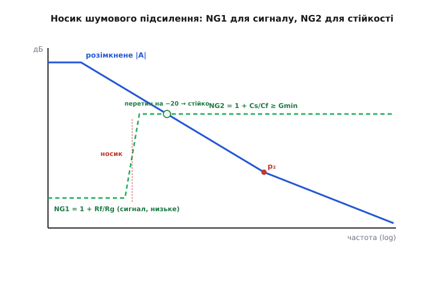

# 🔌 Декомпенсовані операційні підсилювачі

Більшість операційних підсилювачів продають уже «дурнестійкими»: усередині сидить ємність корекції, дібрана так щедро, що мікросхему можна замкнути будь-як — хоч простим повторювачем — і вона не зірветься в генерацію. Зручно, але дорого: ця сама щедра ємність обвалює смугу й швидкодію. Тому поряд з кожним таким «безпечним» підсилювачем нерідко стоїть його близнюк-спринтер — **декомпенсований** *(decompensated, англ. «недо-компенсований»)* операційний підсилювач: те саме ядро, але з навмисне **меншою** ємністю корекції. Він у рази швидший — і за це вимагає від вас однієї умови: ніколи не опускати підсилення нижче паспортної межі. Опустите — заспіває.

Цей клас не має партномера, який «усе вирішить»: декомпенсований підсилювач — не модель, а **спосіб налаштування ядра**, спільний для багатьох мікросхем різних виробників. Поводиться він скрізь однаково, тож і правила читання даташита, і граблі, і прийоми приборкання — спільні. Розберімо його як клас: що це за прилад, як прочитати в документації його головну прикмету, як його підключати, де він кусає й чим його змусити працювати навіть там, де він «не має права».

## Що це за клас: ядро те саме, корекція менша

Усередині типового операційного підсилювача працює дволанковий тракт: вхідна ланка перетворює різницю напруг на струм, друга ланка цей струм підсилює до повного розмаху на виході. Між входом і виходом другої ланки виробник вішає крихітний **конденсатор корекції** Cc (одиниці-десятки пікофарад). Через [ефект Міллера](topic:hw-analog/miller-effect) цей конденсатор виглядає для входу другої ланки в багато разів більшим, ніж він є, і відтягує один внутрішній полюс далеко вниз по частоті — робить його **домінантним**. Завдяки цьому підсилення в петлі встигає впасти до одиниці ще на пологому нахилі −20 дБ/дек, до того, як вступлять інші, високочастотні полюси. Це і є компенсація; докладно механізм розібрано в темі-власниці.

> 🔧 **Навіщо це.** Уся різниця між «повністю компенсованим» і «декомпенсованим» підсилювачем — у єдиному числі: величині цього Cc. Зрозумівши, що це за конденсатор і що він робить, ви читаєте обидва різновиди як дві точки на одному важелі «стійкість ↔ швидкість», а не як два окремі загадкові прилади.

Тепер ключ. Розмір Cc — це **ручка компромісу**. Більший Cc → нижче відтягнуто домінантний полюс → довший пологий відтинок −20 дБ/дек → коло стійке навіть на одиничному підсиленні, але смуга й [швидкість наростання](topic:hw-analog/real-opamp-limits) — мізерні. Менший Cc → домінантний полюс відтягнуто не так далеко → пологий відтинок коротший, другий полюс ближче → стійко вже **не на будь-якому**, а лише на достатньо високому підсиленні, зате смуга й швидкість наростання — у рази більші.

Виробник бере одне й те саме кремнієве ядро й випускає його **двома сортами**:

```
                Cc великий                    Cc малий
        ┌───────────────────────┐    ┌───────────────────────┐
        │ ПОВНІСТЮ КОМПЕНСОВАНИЙ │    │    ДЕКОМПЕНСОВАНИЙ     │
        │  (unity-gain stable)  │    │     (decompensated)   │
        ├───────────────────────┤    ├───────────────────────┤
        │ стійкий аж до ×1       │    │ стійкий лише від ×Gmin │
        │ (повторювач)          │    │ (типово ×5…×10)       │
        │ смуга, slew — менші   │    │ смуга, slew — у рази  │
        │                       │    │ більші                │
        └───────────────────────┘    └───────────────────────┘
              те саме ядро, різниться лише ємність корекції
```

Через це декомпенсовану й повністю компенсовану версії дуже часто пускають **парою** — як два варіанти одного приладу, з сусідніми позначеннями в одному сімействі. Інженер вибирає: треба «поставив і забув» — бере компенсовану; треба видавити з ядра максимум швидкодії й він гарантує собі підсилення не нижче порога — бере декомпенсовану. Це не «гірша» й «краща» мікросхеми, а **один компроміс, по-різному розв'язаний**.


*Те саме ядро, дві корекції. Повністю компенсований (ліворуч): великий Cc тягне домінантний полюс глибоко вниз, крива доходить до 0 дБ далеко лівіше другого полюса — пологий −20 дБ/дек, стійко на будь-якому підсиленні аж до повторювача, але смуга мала. Декомпенсований (праворуч): малий Cc лишає домінантний полюс вище, пологий відтинок короткий, до 0 дБ підсилення доходить уже на підході до другого полюса — смуга й швидкість у рази більші, та лінія 1/β мусить сісти на криву ще на пологій ділянці, тобто підсилення не нижче Gmin.*

## Перший байт даташита: «minimum stable gain»

У декомпенсованого підсилювача є одна паспортна прикмета, яку треба вміти знайти **раніше**, ніж паяти схему, бо саме вона відрізняє його від звичайного й диктує, як його можна вмикати. Шукайте в документації рядок на кшталт:

- **«minimum stable gain»** (мінімальний стійкий коефіцієнт підсилення), часто з числом 5 або 10;
- **«stable for gains ≥ 5»**, «gain of 10 or greater», «G ≥ 10 V/V»;
- іноді — пряма примітка «**decompensated**» у назві чи описі різновиду;
- характерна пара в одному сімействі: дві дуже схожі назви, де в однієї GBW помітно більший, а в описі стоїть більший мінімальний коефіцієнт.

Якщо такий рядок є — перед вами декомпенсований підсилювач, і **цей рядок головніший за все інше в даташиті**. Він каже: замкнене підсилення нижче цього порога заборонене, бо там петля зривається.

> 🔧 **Навіщо це.** Це той самий клас помилки, що й «забув підтяжку на відкритому колекторі»: схема буде бездоганна на папері й заспіває на столі, бо людина не помітила єдиного критичного рядка в даташиті. Звичка спершу знайти «minimum stable gain», а вже потім рахувати решту — економить день осцилографування «чому воно дзвенить».

Тут є тонкість, на якій спотикаються найчастіше: **що саме мають на увазі під «gain»**. Стійкість петлі визначає не підсилення сигналу, а **шумове підсилення** *(noise gain)* — те, з яким коло підсилює власну шумову/похибкову напругу на вході, тобто рівень `1/β`, на якому горизонтальна лінія перетинає спадну криву `|A|`. Для неінвертуючого ввімкнення сигнальне й шумове підсилення збігаються: обидва дорівнюють `1 + Rf/Rg`. А для інвертуючого — **ні**:

```
неінвертуюче:   шумове підсилення = сигнальне = 1 + Rf/Rg
інвертуюче:     сигнальне  = −Rf/Rg
                шумове     = 1 + Rf/Rg        (на одиницю більше за модуль сигнального!)
```

Звідси прямий практичний наслідок. Якщо в даташиті стоїть «minimum stable gain = 10», то для **неінвертуючого** каскаду це означає просто `1 + Rf/Rg ≥ 10`, тобто підсилення сигналу не нижче ×10. А для **інвертуючого** — оскільки стійкість тримає шумове підсилення `1 + Rf/Rg`, реальний мінімальний **модуль сигнального** підсилення виходить на одиницю **меншим**: інвертор стійкий уже від `|A| = Gmin − 1`, тобто ×9. Дрібниця, але саме на ній будують один із прийомів приборкання, до якого ще дійдемо.

**Інвертор на декомпенсованому ОП із Gmin = 5: яке найменше підсилення можна взяти?**

:::tabs
```cpp
#include <cstdio>

int main() {
    int  g_min   = 5;            // «minimum stable gain» з даташита (шумове!)
    // Неінвертуюче ввімкнення: сигнальне = шумове
    int  ni_min  = g_min;        // → не нижче ×5
    // Інвертуюче ввімкнення: шумове = 1 + Rf/Rg = Gmin,
    //   тож |сигнальне| = Rf/Rg = Gmin − 1
    int  inv_min = g_min - 1;    // → можна аж до ×4 за модулем

    std::printf("неінвертуюче: |A| >= %d\n", ni_min);   // 5
    std::printf("інвертуюче:   |A| >= %d\n", inv_min);   // 4
    return 0;
}
```
```python
g_min   = 5             # «minimum stable gain» з даташита (шумове!)
# Неінвертуюче ввімкнення: сигнальне = шумове
ni_min  = g_min         # → не нижче ×5
# Інвертуюче ввімкнення: шумове = 1 + Rf/Rg = Gmin,
#   тож |сигнальне| = Rf/Rg = Gmin − 1
inv_min = g_min - 1     # → можна аж до ×4 за модулем

print(f"неінвертуюче: |A| >= {ni_min}")   # 5
print(f"інвертуюче:   |A| >= {inv_min}")   # 4
```
```js
const gMin  = 5;            // «minimum stable gain» з даташита (шумове!)
// Неінвертуюче ввімкнення: сигнальне = шумове
const niMin = gMin;        // → не нижче ×5
// Інвертуюче ввімкнення: шумове = 1 + Rf/Rg = Gmin,
//   тож |сигнальне| = Rf/Rg = Gmin − 1
const invMin = gMin - 1;   // → можна аж до ×4 за модулем

console.log(`неінвертуюче: |A| >= ${niMin}`);   // 5
console.log(`інвертуюче:   |A| >= ${invMin}`);   // 4
```
:::

```
Gmin = 5  (шумове підсилення, з даташита)
неінвертуюче:  1 + Rf/Rg >= 5      →  |A| >= 5
інвертуюче:    1 + Rf/Rg >= 5      →  Rf/Rg >= 4   →  |A| >= 4
```

Висновок: одна й та сама паспортна «п'ятірка» дозволяє неінвертуючому каскаду ×5, а інвертуючому — ×4, бо стійкість дивиться на шумове підсилення, а воно в інвертора на одиницю вище за модуль сигнального. Це не хитрість, а пряме читання означення `1/β`.

## Блок-схема й чому повторювач — заборонений

Щоб бачити, де клас кусає, корисно тримати в голові його внутрішню блок-схему й те, як до неї чіпляється зовнішнє коло зворотного зв'язку.

```
            ┌──────────────────────── ОП (декомпенсований) ───────────────────┐
            │                                                                 │
 IN+ ───────┤(+)                                  Cc (малий!)                 │
            │   ┌──────────┐        ┌───────────┐  ││  ┌──────────┐           │
            │   │  вхідна  │  i →   │  друга    │──┼┼──│ вихідний │           │
 IN− ───┬───┤(−)│  ланка   │───────▶│  ланка    │  ││  │ повторю- │───┬─── OUT │
        │   │   │ (крутість│        │ (підсил.  │◀─┘   │ вач      │   │       │
        │   │   │  gm)     │        │  напруги) │      └──────────┘   │       │
        │   │   └──────────┘        └───────────┘                    │       │
        │   └─────────────────────────────────────────────────────────────────┘
        │                                                            │
        │            зовнішнє коло зворотного зв'язку                │
        └───[ Rf ]───────────────────────┬──────────────────────────┘
                                       [ Rg ]
                                          │
                                         ┴ (земля / опорна)
   β = Rg/(Rf+Rg)  →  1/β = 1 + Rf/Rg = рівень, на якому петля «сідає» на |A|
```

Дільник `Rf`–`Rg` повертає на інвертуючий вхід частку виходу β; саме `1/β = 1 + Rf/Rg` — та горизонтальна полиця, що перетинає спадну криву розімкненого підсилення. Стійкість вирішує, **на якому нахилі** криву перетинає ця полиця: на пологому −20 дБ/дек — запас фази здоровий; на крутому −40 (де вже вступив другий полюс) — петля дзвенить. Декомпенсований ОП лишає пологий відтинок коротким, тож **висока** полиця ще встигає сісти на нього, а **низька** (повторювач, де β = 1 і полиця падає аж на 0 дБ) — уже ні.

> **Повторювач** — це гранична межа зворотного зв'язку: на вхід повертають **усі 100 %** виходу (`Rf = 0`, `Rg = ∞`), тож β = 1 і полиця `1/β` лежить на самому 0 дБ. Для декомпенсованого підсилювача це найгірший із можливих режимів: полиця сідає на криву в найнижчій, найкрутішій точці. Що таке повторювач і навіщо він, — у темі [Повторювач напруги](topic:hw-analog/voltage-follower).

Ось чому **замкнути декомпенсований ОП повторювачем — класична катастрофа цього класу**. Здавалося б, повторювач — найбезпечніше, найпростіше ввімкнення, його ставлять не думаючи. Але для декомпенсованого приладу це рівно та єдина заборонена точка: полиця `1/β = 1` перетинає криву глибоко за другим полюсом, на −40 дБ/дек, запас фази коло нуля — і «найбезпечніший» буфер перетворюється на генератор на кілька мегагерц. Людина, що звикла до компенсованих ОП, навіть не подивиться в даташит — а там саме під цей випадок стоїть заборона.

## Підключення: тримати 1/β вище порога

Правильне застосування декомпенсованого підсилювача зводиться до однієї думки: **полиця `1/β` мусить сидіти не нижче Gmin**. Поки `1 + Rf/Rg ≥ Gmin`, перетин лягає на пологий −20, запас фази здоровий, прилад віддає всю свою швидкодію. Звідси два сценарії.

**Сценарій простий — вам і так треба велике підсилення.** Будуєте каскад на ×10, ×20, ×50 — нічого спеціального робити не треба: ставите звичайний дільник `Rf`–`Rg`, який і так дає потрібне підсилення вище Gmin, і прилад працює без жодних хитрощів. Це його рідна стихія: малосигнальний підсилювач датчика, ланка з великим коефіцієнтом, де декомпенсований ОП дає смугу, якої компенсований і близько не дасть. Тут декомпенсований підсилювач — чистий виграш, без плати.

**Сценарій незручний — вам треба мале підсилення (чи буфер), а швидкодію хочеться лишити.** Ось де клас стає підступним. Здавалося б, замкнути цей швидкий ОП на ×1 чи ×2 не можна — заспіває. Але є прийом, що дозволяє це **обійти**, не втрачаючи смуги.

## Прийом приборкання: шумове підсилення проти сигнального

Ключ — у тому, що ми вже бачили: стійкість дивиться на **шумове** підсилення `1/β`, а корисний сигнал каскад віддає із **сигнальним**. Поки в неінвертуючому ввімкненні вони збігаються, підняти одне — означає підняти й друге. Але їх можна **розчепити**: змусити петлю бачити високе шумове підсилення (щоб бути стійкою), лишивши при цьому низьке сигнальне (бо саме воно вам потрібне). Це і є **компенсація шумовим підсиленням** *(noise-gain compensation)*.

Розберімо механізм від причини. `1/β` — це рівень, на якому горизонтальна полиця перетинає криву `|A|`. Якщо ми **на високих частотах** примусово піднімемо цю полицю вище Gmin (а на постійному струмі лишимо її низькою, рівною бажаному сигнальному підсиленню), то перетин із кривою `|A|` відбудеться там, де полиця вже висока — тобто на пологому −20, **до** другого полюса. Петля стане стійкою. А сигнал на постійному струмі й низьких частотах піде з тим малим підсиленням, яке ми хотіли. Уся хитрість — зробити `1/β` **частотно-залежним**: малим унизу (для сигналу) і великим угорі (для стійкості).

Роблять це двома способами, обидва — додаванням одного конденсатора.

### Спосіб А: конденсатор у коло зворотного зв'язку («носовий»)

Найпряміший хід — підняти шумове підсилення на високих частотах **малим конденсатором Cs**, увімкненим від інвертуючого входу на землю (паралельно `Rg`), плюс, за потреби, конденсатором `Cf` паралельно `Rf`. На постійному струмі конденсатори — розрив, β задає чистий резистивний дільник, сигнальне підсилення = `1 + Rf/Rg` (низьке, яке ви хотіли). А на високих частотах `Cs` шунтує `Rg`, β падає, шумове підсилення `1/β` зростає до високого плато, заданого вже **відношенням ємностей**:

```
низькі частоти (Cs, Cf — розрив):   NG1 = 1 + Rf/Rg          (= сигнальне, низьке)
високі частоти (ємності правлять):  NG2 = 1 + Cs/Cf          (високе, ≥ Gmin)
```

Підбираєте `Cs`/`Cf` так, щоб `NG2 = 1 + Cs/Cf ≥ Gmin`, — і на тій частоті, де крива `|A|` доходить до полиці, шумове підсилення вже сидить на високому плато NG2, перетин лягає на пологий нахил, запас фази повертається. Сигнал же на робочих (низьких) частотах іде з NG1.

Цей прийом ще називають **носовим конденсатором** через характерний «носик», що з'являється на діаграмі шумового підсилення: полиця спершу низька (NG1), потім підіймається сходинкою до NG2 саме перед перетином з `|A|`.


*Як шумове підсилення розчіплюють із сигнальним. Полиця 1/β більше не пласка: на низьких частотах вона тримається на NG1 = 1 + Rf/Rg — це підсилення, яке бачить корисний сигнал (низьке, скажімо ×2). Перед самим перетином зі спадною кривою |A| додані конденсатори піднімають полицю сходинкою на NG2 = 1 + Cs/Cf ≥ Gmin. Крива |A| перетинає вже високе плато — на пологому −20 дБ/дек, тож запас фази здоровий, хоча сигнал іде з малим підсиленням. Платня — підрослий високочастотний шум, бо шум множиться на високе NG2.*

### Спосіб Б: інвертуюче ввімкнення з конденсатором від входу на землю

Те саме можна зробити елегантніше в **інвертуючому** каскаді. Інвертор зручний тим, що його шумове підсилення `1 + Rf/Rg` уже на одиницю вище за модуль сигнального `Rf/Rg` — тобто частина запасу стійкості є «безплатно». Додавши конденсатор `Cs` від інвертуючого входу (віртуальної землі) на землю, ви на високих частотах ще піднімаєте шумове підсилення до потрібного плато, не чіпаючи сигнального тракту `Rf/Rg` зовсім. Сигнал іде інверсним з малим підсиленням, а петля бачить високе шумове — стійко.

> 🔧 **Навіщо це.** Це той прийом, що перетворює декомпенсований ОП із «капризного швидкого приладу, який не можна вмикати буфером» на універсальний інструмент: ви отримуєте і його велику смугу, і потрібне вам мале підсилення водночас. Ціна — кілька децибел зайвого високочастотного шуму (бо шум підсилюється з високим NG2) і два-три додаткові пасивні елементи. Для швидких підсилювачів сигналу це майже завжди вигідний обмін.

**Розчіплення підсилень: декомпенсований ОП (Gmin = 10) як інвертор на ×2.**

:::tabs
```cpp
#include <cstdio>

int main() {
    int g_min = 10;          // мінімальне стійке (шумове) підсилення з даташита

    // Хочемо інвертор із сигнальним підсиленням ×2  →  Rf/Rg = 2
    float rf_rg = 2.0f;
    float ng1   = 1.0f + rf_rg;          // низькочастотне шумове = сигнальне+1 = 3

    // 3 < 10  →  без компенсації петля сяде на круте −40, зрив.
    // Піднімаємо ВЧ-шумове конденсаторами до NG2 ≥ Gmin:
    float ng2_target = (float)g_min;     // ціль: 10 (з невеликим запасом — більше)

    // NG2 = 1 + Cs/Cf  →  Cs/Cf = NG2 − 1
    float cs_cf = ng2_target - 1.0f;     // = 9  →  напр. Cf = 2 пФ, Cs = 18 пФ

    std::printf("сигнальне |A| = %.0f (інверсне)\n", rf_rg);          // 2
    std::printf("NG1 (НЧ шумове) = %.0f  -> само по собі < Gmin\n", ng1);  // 3
    std::printf("ціль NG2 (ВЧ шумове) = %.0f >= Gmin\n", ng2_target);  // 10
    std::printf("потрібне Cs/Cf = %.0f\n", cs_cf);                    // 9
    return 0;
}
```
```python
g_min = 10               # мінімальне стійке (шумове) підсилення з даташита

# Хочемо інвертор із сигнальним підсиленням ×2  →  Rf/Rg = 2
rf_rg = 2.0
ng1   = 1.0 + rf_rg                  # низькочастотне шумове = сигнальне+1 = 3

# 3 < 10  →  без компенсації петля сяде на круте −40, зрив.
# Піднімаємо ВЧ-шумове конденсаторами до NG2 ≥ Gmin:
ng2_target = float(g_min)            # ціль: 10 (з невеликим запасом — більше)

# NG2 = 1 + Cs/Cf  →  Cs/Cf = NG2 − 1
cs_cf = ng2_target - 1.0             # = 9  →  напр. Cf = 2 пФ, Cs = 18 пФ

print(f"сигнальне |A| = {rf_rg:.0f} (інверсне)")               # 2
print(f"NG1 (НЧ шумове) = {ng1:.0f}  -> само по собі < Gmin")  # 3
print(f"ціль NG2 (ВЧ шумове) = {ng2_target:.0f} >= Gmin")      # 10
print(f"потрібне Cs/Cf = {cs_cf:.0f}")                         # 9
```
```js
const gMin = 10;             // мінімальне стійке (шумове) підсилення з даташита

// Хочемо інвертор із сигнальним підсиленням ×2  →  Rf/Rg = 2
const rfRg = 2.0;
const ng1  = 1.0 + rfRg;              // низькочастотне шумове = сигнальне+1 = 3

// 3 < 10  →  без компенсації петля сяде на круте −40, зрив.
// Піднімаємо ВЧ-шумове конденсаторами до NG2 ≥ Gmin:
const ng2Target = gMin;               // ціль: 10 (з невеликим запасом — більше)

// NG2 = 1 + Cs/Cf  →  Cs/Cf = NG2 − 1
const csCf = ng2Target - 1.0;         // = 9  →  напр. Cf = 2 пФ, Cs = 18 пФ

console.log(`сигнальне |A| = ${rfRg.toFixed(0)} (інверсне)`);              // 2
console.log(`NG1 (НЧ шумове) = ${ng1.toFixed(0)}  -> само по собі < Gmin`); // 3
console.log(`ціль NG2 (ВЧ шумове) = ${ng2Target.toFixed(0)} >= Gmin`);     // 10
console.log(`потрібне Cs/Cf = ${csCf.toFixed(0)}`);                        // 9
```
:::

```
треба:        інвертор, сигнальне |A| = 2   →  Rf/Rg = 2
саме по собі: NG1 = 1 + 2 = 3   <   Gmin = 10   →  зрив (перетин на −40)
лік:          підняти ВЧ-шумове до NG2 = 1 + Cs/Cf ≥ 10
              Cs/Cf = 10 − 1 = 9    →   напр. Cf = 2 пФ, Cs = 18 пФ
результат:    сигнал іде з ×2, петля бачить шумове 10 → стійко
```

Висновок: «заборонений» для повторювача декомпенсований підсилювач спокійно працює інвертором на ×2, якщо змусити його петлю **бачити** шумове підсилення 10 (конденсаторним «носиком»), лишивши сигналу його законні ×2. Розчіплення двох підсилень — головний прийом усього класу.

## Типові граблі класу

Зберімо в одному місці пастки, на які наступають усі, хто бере декомпенсований підсилювач уперше. Підступність класу в тому, що схема працює бездоганно — рівно до межі підсилення, а за нею тихо зривається, і причину шукають де завгодно, тільки не в одному рядку даташита.

**Замкнули повторювачем.** Найгрубіша й найчастіша. Узяли швидкий ОП, поставили буфером «бо повторювач — це ж найпростіше», — і дістали генератор на кілька мегагерц. Полиця `1/β = 1` сіла на криву за другим полюсом. **Правило: декомпенсований ОП повторювачем не вмикають ніколи** — або беріть компенсовану версію того ж сімейства, або піднімайте шумове підсилення конденсаторами.

**Сплутали сигнальне підсилення з шумовим.** Зробили інвертор на ×4 із паспортним Gmin = 5 і вирішили, що ×4 < 5, отже зрив. А насправді для інвертора стійкість дивиться на `1 + Rf/Rg = 5 ≥ Gmin` — каскад стійкий. І навпаки: неінвертуючий ×4 при Gmin = 5 — таки зрив, бо там шумове = сигнальне = 4 < 5. **Завжди рахуйте `1/β = 1 + Rf/Rg`, а не модуль сигнального.**

**Низьке підсилення без компенсації шумового.** Треба ×2, поставили чистий резистивний дільник на ×2 — і петля бачить шумове 3, нижче Gmin, зрив. Забули, що мале підсилення на декомпенсованому приладі вимагає підняти **шумове** конденсаторним носиком. **Мале сигнальне підсилення ⇒ обов'язково noise-gain compensation.**

**Носовий конденсатор недотягує до Gmin.** Поставили `Cs`/`Cf`, але NG2 = 1 + Cs/Cf вийшло, скажімо, 6 при Gmin = 10 — підняли, та недостатньо, перетин усе одно лягає зарано. **Цілься NG2 не просто `≥ Gmin`, а з невеликим запасом** (на 20–50 % вище), бо точна частота другого полюса має розкид.

**Забули про зрослий шум.** Підняли шумове підсилення до 10, щоб стабілізувати ×2-каскад, — і здивувалися, що на виході побільшало високочастотного шуму. Це не дефект: шум підсилювача множиться саме на шумове підсилення, а ви його навмисне підняли. **Плата за стійкість через noise gain — зайвий ВЧ-шум**; якщо він критичний, обмежте смугу далі по тракту або візьміть компенсовану версію.

**Ємнісне навантаження поверх усього.** Декомпенсований ОП швидкий, тож його вихідний полюс від ємності навантаження виходить ще ближче до небезпечної зони, ніж у повільного. Повісили на швидкий вихід кабель чи вхідну ємність АЦП — і навіть «правильно» налаштований за підсиленням каскад знову дзвенить. **Швидкий ОП особливо чутливий до ємнісного навантаження** — розв'язувальний резистор у вихід тут потрібен майже завжди.

## Варіації класу

Декомпенсовані підсилювачі — не одна точка, а ціла лінійка, що відрізняється тим, **наскільки глибоко** прибрали ємність корекції. Спільне в усіх — менший Cc, більша швидкодія, паспортний поріг підсилення; різняться вони лише числом цього порога й тим, як його обходять.

**Помірно декомпенсовані (Gmin ≈ 5).** М'який варіант: ємність зрізали небагато, мінімальне підсилення скромне (×5). Зручні тим, що інвертором беруть уже від ×4, а неінвертуючим — від ×5; компенсація шумового потрібна лише якщо хочеться зовсім малого підсилення. Це найпопулярніший підклас: помітний приріст смуги за помірну ціну в гнучкості.

**Глибоко декомпенсовані (Gmin ≈ 10 і вище).** Агресивний варіант: ємність зрізали сильно, смуга й швидкість наростання — рекордні для цього ядра, але поріг високий (×10, інколи ×25 і більше). Це прилади для каскадів із заздалегідь великим підсиленням — малосигнальних підсилювачів датчиків, передпідсилювачів, де ×10 і так є робочою точкою. Буфером без серйозного носового конденсатора їх не вмикають узагалі.

**Пара «компенсований + декомпенсований» в одному сімействі.** Найзручніша для інженера форма випуску: виробник дає два майже однакові прилади з сусідніми позначеннями — один unity-gain stable, другий декомпенсований, з тим самим розташуванням виводів і живленням. Це дозволяє **спроєктувати плату під обидва** й вибрати сорт уже за результатом: не вистачає смуги — переставив на декомпенсовану версію (підвівши підсилення чи додавши носовий конденсатор); хочеться простоти буфера — лишив компенсовану. Той самий слід на платі, той самий даташит — інша лише корекція ядра.

**Струмово-зворотні підсилювачі — окремий звір, не плутати.** Іноді поряд із декомпенсованими згадують підсилювачі зі зворотним зв'язком по струму, бо вони теж дуже швидкі. Але це **інший** механізм: там стійкість задає не дільник підсилення, а сам `Rf` як абсолютне значення, і поняття «мінімального стійкого підсилення» до них не застосовне в тому ж сенсі. Декомпенсований ОП — це **звичайний** (напругозворотний) підсилювач із меншою корекцією; не змішуйте його правила з правилами струмово-зворотних.

Наскрізна нитка всього класу одна. Декомпенсований операційний підсилювач — те саме ядро, що й звичайний, але з навмисне меншою ємністю корекції: за це він віддає в рази більшу смугу й швидкість наростання, а натомість вимагає тримати **шумове** підсилення петлі не нижче паспортного Gmin. Поки `1/β = 1 + Rf/Rg ≥ Gmin`, він працює без хитрощів і дає свою швидкодію задарма; коли вам потрібне мале сигнальне підсилення чи буфер — ви **розчіплюєте** сигнальне й шумове підсилення конденсаторним носиком, змушуючи петлю бачити високе шумове, а сигнал лишаючи з низьким. Прочитайте в даташиті єдиний рядок «minimum stable gain», не сплутайте сигнальне з шумовим — і найкапризніший швидкий підсилювач стане слухняним інструментом замість генератора, якого ви не просили.
