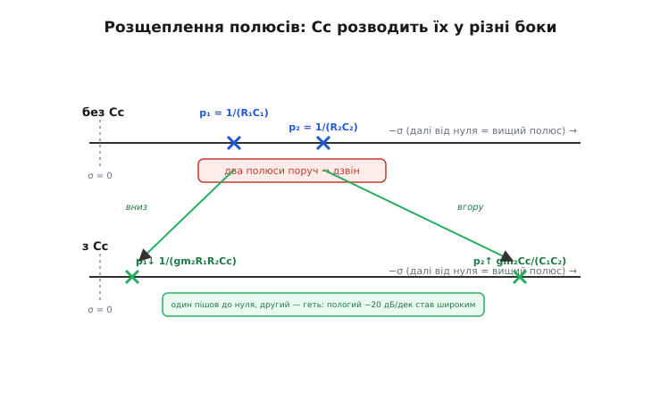
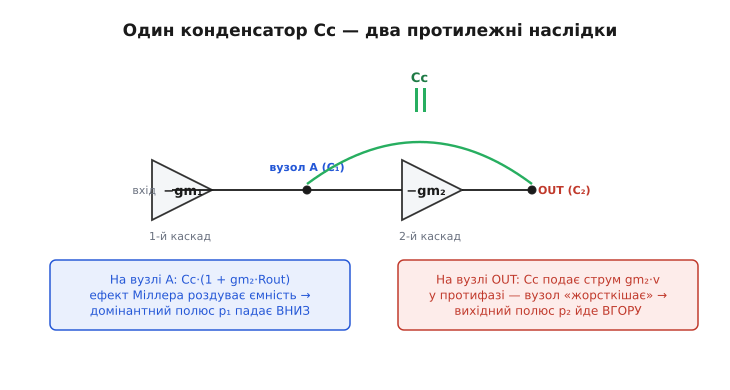

# 🧮 Розщеплення полюсів: як один конденсатор тягне два полюси в різні боки

Є тут дрібниця, яка спершу здається фокусом. Усередині двоступеневого операційного підсилювача два полюси — один на високоомному вузлі між каскадами, другий на виході. Щоб зробити підсилювач стійким, між входом і виходом другого каскаду вмикають **один** маленький конденсатор корекції Cc — тридцять пікофарад, ціла копійка ємності. І от що з ним стається: домінантний полюс **падає** вниз по частоті в тисячі разів, а другий полюс **підіймається** вгору. Не обидва вниз, не обидва вгору — **в протилежні боки**, ніби їх хтось розвів руками. Цей розліт так і звуть — **розщеплення полюсів** *(pole splitting)*.

Чому це не очевидно? Бо конденсатор — пасивна, «загальмовуюча» деталь. Здоровий глузд каже: додав ємність — щось **уповільнилось**, полюс **поїхав вниз**. І справді, домінантний полюс їде вниз, тут інтуїція не підводить. Але як та сама ємність могла **прискорити** другий вузол, відсунувши його полюс **вгору**? Прискорити конденсатором — це звучить як нагріти морозивом. Уся ця вставка — про те, чому фокусу тут нема: один конденсатор, перекинутий через підсилювальний каскад, фізично робить **дві різні речі на двох різних вузлах**, і ці речі тягнуть полюси у протилежні напрямки. Розберімо обидві від першопричини, а потім складемо точні формули, у яких цей розліт стане видно числом.

## Що таке полюс вузла й де вони лежать без корекції

Спершу домовмося, що саме ми будемо розводити. Двоступеневий ОП — це два підсилювальні каскади поспіль. Перший (диференціальна пара з активним навантаженням) дає велике підсилення й має на своєму виході **високий опір** R1 разом із паразитною ємністю C1 — назвемо цей внутрішній вузол **A**. Другий каскад (підсилювач зі спільним витоком/емітером, його крутість — провідність передачі **gm2**) бере сигнал із вузла A, ще раз підсилює та віддає на **вихід**, де теж є опір Rout (позначмо R2) і ємність C2 (власна плюс навантаження).

Кожен такий вузол — це проста RC-ланка: опір вузла, що заряджає його ємність. А RC-ланка дає **полюс** на частоті, де її реактивний опір зрівнюється з активним, тобто де `ω·R·C = 1`. Звідси два полюси без жодної корекції:

```
вузол A (вхід 2-го каскаду):   p1 = 1 / (R1·C1)
вузол OUT (вихід):             p2 = 1 / (R2·C2)
```

> 🔧 **Навіщо це.** Це не абстракція: саме ці два числа виробник підсилювача зсуває, проєктуючи компенсацію, і саме від їхнього взаємного розташування залежить, чи зможете ви замкнути ОП повторювачем без дзвону. Уся гра стійкості — це гра з положенням цих двох полюсів, а Cc — головний важіль, яким їх рухають.

Біда в тому, що **без корекції ці полюси лежать поряд** — обидва в районі сотень кілогерц чи мегагерців. А два близькі полюси — це рецепт зриву: на частоті, де підсилення в петлі ще велике, їхні затримки вже встигають докрутити фазу до фатальних −180°, і замкнений підсилювач співає. Те, чому близькі полюси означають дзвін, докладно розібрано в самій темі через правило швидкості зближення; тут нам важлива інша половина — **як саме Cc розводить ці два полюси так далеко**, щоб між ними з'явилася широка полога ділянка −20 дБ/дек, на якій підсилення встигне впасти до одиниці.


*Суть розщеплення на одній осі. Зверху — некомпенсований підсилювач: полюси вузлів A і OUT сидять поряд, коло дзвенить. Знизу — той самий підсилювач із Cc: домінантний полюс p₁ сповз майже до нуля (1/(gm₂R₁R₂Cc)), а вихідний p₂ відлетів далеко геть (gm₂Cc/(C₁C₂)). Один конденсатор розвів їх у протилежні боки — і відкрив широкий пологий проміжок, на якому підсилення безпечно сходить до одиниці.*

## Перший рух: ефект Міллера тягне домінантний полюс униз

Почнімо з вузла A — і з тієї половини, де інтуїція не зраджує. Конденсатор Cc увімкнено між входом і виходом другого каскаду, а другий каскад **інвертує** й підсилює: коли вхід (вузол A) ворухнеться вгору на Δv, вихід шарпне вниз на gm2·R2·Δv — у багато разів сильніше й у протилежний бік. Тепер подивимося, що відчуває вузол A, заряджаючи Cc.

Напруга **на самому конденсаторі** Cc — це різниця між його кінцями. Лівий кінець ворухнувся на +Δv, правий (вихід) — на −(gm2·R2)·Δv. Отже напруга на Cc змінилася не на Δv, а на

```
Δv_Cc = Δv − (−gm2·R2·Δv) = Δv·(1 + gm2·R2)
```

— у `(1 + gm2·R2)` разів більше, ніж ворухнувся сам вузол A. А заряд, який мусить перекачати вузол A, дорівнює `Cc·Δv_Cc`. Поділивши заряд на власне ворушіння вузла Δv, дістанемо **ефективну ємність**, яку вузол A бачить на місці Cc:

```
Cc(ефективна на вході) = Cc·(1 + gm2·R2)
```

Ось воно — **ефект Міллера**: конденсатор, перекинутий через інвертуючий каскад із підсиленням Av2 = gm2·R2, для входу виглядає у `(1 + Av2)` разів більшим, ніж він є фізично. Тридцять пікофарад при підсиленні другого каскаду в кількасот разів обертаються для вузла A на ефективні **наногенрі** ємності — десятки тисяч пікофарад. Назва — за іменем Джона Мілтона Міллера (John Milton Miller), який у 1920 році описав це збільшення вхідної ємності триодної лампи через ємність між сіткою й анодом; той самий механізм тепер працює в кожному МОН-транзисторі й біполярі. (Усталений факт: оригінал — «Dependence of the input impedance of a three-electrode vacuum tube upon the load in the plate circuit», Scientific Papers of the Bureau of Standards, 1920.)

> 🔧 **Навіщо це.** Саме завдяки Міллеру виробник може покласти на кристал крихітні 30 пФ замість неможливих десятків нанофарад. Без множення на підсилення каскаду домінантний полюс довелося б тягнути вниз гігантською ємністю, яка фізично не вмістилась би в інтегральну схему. Міллерів важіль — це те, що робить внутрішню компенсацію взагалі здійсненною.

Що з полюсом вузла A? Він був `p1 = 1/(R1·C1)`. Тепер до C1 додалася ефективна ємність Cc, причому величезна:

```
p1 ≈ 1 / [ R1·(C1 + Cc·(1 + gm2·R2)) ] ≈ 1 / (R1·gm2·R2·Cc)
```

(C1 поряд із роздутою Cc·gm2·R2 — піщинка, її відкидаємо; одиницею в `(1+gm2·R2)` теж нехтуємо, бо gm2·R2 ≫ 1). Ось перший результат, уже в тій формі, що шукали: **домінантний полюс упав** з 1/(R1·C1) до 1/(R1·gm2·R2·Cc), тобто **в gm2·R2 разів нижче** — рівно у стільки, у скільки Міллер роздув ємність. Інтуїтивна половина зійшлася: додали ємність — вузол уповільнився — полюс поїхав униз. Усе чесно.

Глибша причина, чому конденсатор, перекинутий через підсилювальний інвертуючий каскад, виглядає на вході помноженим на коефіцієнт підсилення, — це і є [ефект Міллера](topic:hw-analog/miller-effect); там розписано, звідки береться множник (1 + Av) і коли він ламається. Тут досить підсумку: **вхідна ємність = Cc·(1 + gm2·R2)**, і саме вона тягне p1 униз.

## Другий рух, найхитріший: той самий Cc штовхає вихідний полюс угору

Тепер найцікавіше — і та половина, де здоровий глузд спотикається. Якщо Міллерова ємність так роздулася на вході, чому вона не роздулася так само на виході й не поїхала вузол OUT теж униз? Мала б, за «здоровим глуздом», ще й вихід уповільнити. А насправді вихідний полюс **підіймається**. Розгадка — у тому, **що** Cc робить на вихідному вузлі, бо це зовсім не те, що він робить на вхідному.

Подивімося на вузол OUT очима зворотного зв'язку. Cc з'єднує вихід із входом того самого каскаду, який вихід і керує. Це **місцевий зворотний зв'язок** довкола другого каскаду — причому **від'ємний** (бо каскад інвертує). А головна властивість від'ємного зворотного зв'язку — він **знижує вихідний опір**. Простежмо механізм буквально, без абстракцій.

Хай якесь зовнішнє збурення спробувало смикнути вихід угору на δ. Через Cc це збурення δ долітає назад на вузол A (вхід каскаду). Каскад інвертує: вхід угору → вихід **униз**. Тобто щойно вихід смикнувся вгору, каскад через Cc **сам себе** штовхнув назад униз — опирається збуренню. Цей зустрічний струм, яким каскад гасить власне ворушіння виходу, тече **через gm2**: керована напругою вузла A, друга крутість впорскує у вихід струм `gm2·δ` у протифазі. Що сильніший gm2, то жорсткіше каскад тримає свій вихід.

А «жорсткіше тримає вихід» — це інша назва для **нижчого вихідного опору**. Зворотний зв'язок через Cc знижує опір вихідного вузла на високих частотах (там, де Cc вже проводить) приблизно до `1/gm2`. І ось ключ: полюс вузла — це `1/(R·C)`, тож якщо **опір** вузла впав із R2 до ~1/gm2, полюс **виріс**:

```
p2 ≈ gm2 / C2    (груба оцінка, поки ємність на вузлі = лише C2)
```

Опір у знаменнику зменшився — полюс у чисельнику побільшав. Той самий конденсатор, що на **вході** додав ємності й сповільнив вузол, на **виході** додав зворотного зв'язку й **прискорив** його. Дві різні дії на двох різних кінцях — звідси й рознесення в протилежні боки.

> 🔧 **Навіщо це.** Це пояснює, чому компенсація не просто «жертвує» другим полюсом, а активно його **прибирає з дороги**: відсунутий високо вгору, він уже не встигає докрутити фазу на робочих частотах. Якби Cc лише опускав домінантний полюс, не чіпаючи другого, корекція була б удвічі марнотратнішою — довелося б тягнути перший полюс ще нижче, щоб розминутися з другим. Розщеплення дає корисне з обох кінців за один конденсатор.

Аналогія «зворотний зв'язок знижує вихідний опір» точна, але показати, де вона ламається, корисно. Вона працює, **поки Cc встигає донести сигнал назад на вузол A** — тобто на частотах, де реактивний опір Cc малий. На зовсім високих частотах сам Cc стає «коротким», провідність каскаду перестає встигати, і опис через 1/gm2 розсипається. Саме на цій межі ховається й неприємний побічний ефект — правосторонній нуль, до якого ми дійдемо наприкінці. Поки що тримаймо інтуїцію: **вхід — ємність униз по полюсу, вихід — зворотний зв'язок угору по полюсу**.


*Один конденсатор, дві протилежні дії. На вузлі A (вхід другого каскаду) Cc через ефект Міллера виглядає помноженим на (1 + gm₂·Rout) — домінантний полюс p₁ падає вниз. На вузлі OUT той самий Cc замикає від'ємний місцевий зворотний зв'язок: каскад через gm₂ впорскує зустрічний струм, знижує вихідний опір до ~1/gm₂ — вихідний полюс p₂ йде вгору. Звідси й розщеплення в різні боки.*

## Формальний апарат: два рівняння вузлів і квадратний знаменник

Інтуїція дала напрямок і навіть грубі формули. Тепер перевіримо її точним рахунком — і заразом дістанемо точні вирази, у яких видно, **наскільки** рознеслися полюси. Інструмент — той самий, що для будь-якого лінійного кола: пишемо баланс струмів у вузлах у мові комплексної частоти **s**, де похідна за часом стає множенням на s, а провідність конденсатора C — це просто `s·C`.

Модель двоступеневого ОП у двох вузлах. **Вузол A**: опір на землю R1, ємність C1, на нього втікає вхідний сигнальний струм першого каскаду (його замінимо джерелом — нам зараз важлива не абсолютна передача, а полюси). **Вузол OUT**: опір R2, ємність C2, керується струмом другого каскаду `gm2·V_A` (крутість gm2 перетворює напругу вузла A на вихідний струм), мінус — бо каскад інвертує. **Між ними** — конденсатор Cc, провідність `s·Cc`.

Запишімо два балансні рівняння. У вузлі OUT струми, що з нього витікають: через R2 на землю, через C2 на землю, через Cc назад на вузол A, і впорснутий каскадом струм `gm2·V_A` (він втікає, тож із мінусом у сумі «витікаючих»):

```
V_out/R2  +  s·C2·V_out  +  s·Cc·(V_out − V_A)  +  gm2·V_A  =  0
```

У вузлі A струми, що витікають: через R1, через C1, і через Cc на вихід (вхідне джерело лишимо символом I_in справа):

```
V_A/R1  +  s·C1·V_A  +  s·Cc·(V_A − V_out)  =  I_in
```

Дві лінійні рівності з двома невідомими V_A і V_out. Передавальна функція V_out/I_in — це дріб, у якого в знаменнику стоїть **визначник** системи. Саме знаменник несе полюси, тож складемо його. Згрупуймо кожне рівняння за V_A і V_out.

Рівняння вузла A:

```
V_A·(1/R1 + s·C1 + s·Cc)  −  V_out·(s·Cc)  =  I_in
```

Рівняння вузла OUT:

```
V_A·(gm2 − s·Cc)  +  V_out·(1/R2 + s·C2 + s·Cc)  =  0
```

(зібрали члени з V_A: `gm2` від крутості й `−s·Cc` від конденсатора). Визначник цієї пари — добуток діагоналей мінус добуток побічних:

```
Δ = (1/R1 + s·C1 + s·Cc)·(1/R2 + s·C2 + s·Cc)  −  (−s·Cc)·(gm2 − s·Cc)
```

Розкриймо обережно, по членах. Перший добуток:

```
(1/R1)(1/R2)  +  (1/R1)(s·C2)  +  (1/R1)(s·Cc)
+ (s·C1)(1/R2)  +  s²·C1·C2  +  s²·C1·Cc
+ (s·Cc)(1/R2)  +  s²·Cc·C2  +  s²·Cc²
```

Другий доданок (із подвійним мінусом стає плюсом):

```
+ (s·Cc)·(gm2 − s·Cc)  =  s·Cc·gm2  −  s²·Cc²
```

Складаємо. Член `s²·Cc²` з першого добутку й `−s²·Cc²` з другого **взаємознищуються** — приємно, бо квадрат ємності корекції випадає. Лишається акуратний квадратний тричлен за s. Зберімо за степенями:

```
Δ = (1/R1·R2)
  + s·[ C2/R1 + Cc/R1 + C1/R2 + Cc/R2 + gm2·Cc ]
  + s²·[ C1·C2 + C1·Cc + Cc·C2 ]
```

Помножмо все на `R1·R2`, щоб вільний член став одиницею (зручна нормована форма знаменника `1 + b1·s + b2·s²`):

```
b1 = R2·C2 + R1·C1 + R1·Cc + R2·Cc + gm2·R1·R2·Cc
b2 = R1·R2·(C1·C2 + C1·Cc + Cc·C2)
```

Ось повний знаменник без жодних наближень. Уся фізика розщеплення тепер сидить у двох коефіцієнтах — лишилося прочитати з них полюси.

## Звідки беруться формули p1 і p2

Знаменник `1 + b1·s + b2·s² = (1 − s/p1)(1 − s/p2)`, де полюси p1, p2 — від'ємні дійсні числа (для стійкого підсилювача). Розкривши добуток, маємо два точні зв'язки:

```
b1 = −(1/p1 + 1/p2)
b2 = 1/(p1·p2)
```

Тут нам страшенно щастить: полюси **широко рознесені** (у тому й суть розщеплення!), `|p2| ≫ |p1|`. Коли один полюс набагато ближчий до нуля за інший, у сумі `1/p1 + 1/p2` доданок `1/p1` цілком панує (бо менший полюс дає більший доданок), і ним наближають усе b1:

```
b1 ≈ −1/p1     ⟹     p1 ≈ −1/b1
```

Підставмо b1 і відкиньмо в ньому все, крім найбільшого члена. А найбільший там — **gm2·R1·R2·Cc** (він несе добуток двох великих опорів і крутості; решта членів — поодинокі RC). Отже:

```
        1                    1
p1 ≈ −─── ≈ − ──────────────────────────
        b1          gm2·R1·R2·Cc
```

Це і є шукана формула домінантного полюса — рівно те, що дала інтуїція Міллера. Запишімо її в звичному вигляді (без знака, як модуль частоти):

```
p1 ≈ 1 / (gm2·R2·Cc·R1)
```

Тепер другий полюс. З `b2 = 1/(p1·p2)` маємо `p2 = 1/(b2·p1)`. А `1/p1 ≈ −b1`, тож `p2 ≈ −b1/b2`. Це точний місток: **p2 ≈ −b1/b2**. Підставмо домінантні члени. У чисельнику b1 ≈ gm2·R1·R2·Cc; у знаменнику b2 = R1·R2·(C1·C2 + C1·Cc + Cc·C2). Опори R1·R2 скорочуються повністю:

```
              gm2·R1·R2·Cc                     gm2·Cc
p2 ≈ ───────────────────────────────  =  ──────────────────────
       R1·R2·(C1·C2 + C1·Cc + Cc·C2)        C1·C2 + Cc·(C1 + C2)
```

Ось точний другий полюс. Звідси видно дві речі. По-перше, опори з нього зникли — **положення p2 опором вузла не керується**, лише ємностями й крутістю; це й є слід того, що зворотний зв'язок «закоротив» вихідний опір. По-друге, в знаменнику три члени, і їхня боротьба дає дві ходові наближені форми як два граничні випадки:

```
якщо Cc мала (Cc ≲ C1, C2):    панує C1·C2   →   p2 ≈ gm2·Cc / (C1·C2)
якщо Cc велика (Cc ≫ C1, C2):  панує Cc·(C1+C2) → p2 ≈ gm2 / (C1 + C2)
```

Перша межа дає компактний вираз **gm2·Cc/(C1·C2)**: він точний, доки ємність корекції не перевалила за паразитні C1, C2. Друга — звична «підручникова» оцінка `p2 ≈ gm2/(C1+C2)` (а для типового C2 ≫ C1 ще простіше, `p2 ≈ gm2/C2`), що збігається з грубою інтуїцією «опір упав до 1/gm2, полюс став gm2/C2». Обидві кажуть одне: **p2 росте з gm2** і **падає з ємностями вузлів** — рівно протилежно до того, що робить Cc з полюсом p1. Конденсатор корекції, входячи в чисельник p2, **піднімає** другий полюс; той самий конденсатор, входячи в знаменник p1, **опускає** перший. Один важіль, два протилежні плечі — розщеплення доведене не інтуїцією, а алгеброю.

Зведемо обидві формули поряд, щоб розліт упадав в око:

```
домінантний:   p1 ≈ 1 / (gm2·R1·R2·Cc)      ← униз, у gm2·R2 разів проти 1/(R1C1)
вихідний:      p2 ≈ gm2·Cc / (C1·C2)         ← угору, у ~gm2·R2 разів проти 1/(R2C2)
```

Перевіримо, що рознесення справді **симетричне** за множником. Без Cc полюси були `1/(R1C1)` і `1/(R2C2)`. З Cc перший упав у `gm2·R2` разів (порівняй p1 з 1/(R1C1): відношення = C1/(gm2·R2·Cc) ≈ 1/(gm2·R2), коли Cc≈C1). Другий у тій самій малій-Cc межі — `gm2·Cc/(C1·C2)`, а проти `1/(R2·C2)` це відношення `gm2·Cc·R2/C1 ≈ gm2·R2` (при Cc≈C1). Один зменшився в gm2·R2 разів, другий у стільки ж збільшився — полюси **розлетілися навколо свого попереднього місця приблизно на однаковий множник у логарифмі**. Звідси й слово «розщеплення»: підсилення другого каскаду gm2·R2 — це той коефіцієнт, що **роз'їжджає** пару полюсів у обидва боки. Що сильніший другий каскад, то ширше розщеплення за той самий конденсатор.

## Чому це дає добуток підсилення на смугу gm1/Cc

Розщеплення — не самоціль; його роблять, щоб домінантний полюс залишився **єдиним** аж до частоти одиничного підсилення. Подивімося, у що це виливається для смуги. Повне підсилення підсилювача на постійному струмі — добуток підсилень обох каскадів: `A0 = (gm1·R1)·(gm2·R2)`, де gm1 — крутість першого (вхідного) каскаду. Від домінантного полюса p1 підсилення котиться вниз −20 дБ/дек, і **частота одиничного підсилення** (де |A| = 1) — це добуток підсилення на полюс:

```
ω_t = A0 · |p1| = (gm1·R1)·(gm2·R2) · 1/(gm2·R1·R2·Cc)
```

Підставмо й дивімося, що скоротиться. Чисельник `gm1·R1·gm2·R2`, знаменник `gm2·R1·R2·Cc`. Скорочуються **gm2, R1 і R2** — усі троє! Лишається сама лиш чистота:

```
ω_t ≈ gm1 / Cc
```

Це варто потримати в голові — формула майже неймовірно проста. Частота одиничного підсилення (а отже й [добуток підсилення на смугу](topic:hw-analog/gain-bandwidth-product)) **не залежить ні від опорів вузлів, ні від крутості другого каскаду, ні від паразитних ємностей** — тільки від крутості **першого** каскаду gm1 і ємності корекції Cc. Чому так гарно скоротилося? Бо це той самий gm1 і той самий Cc, що утворюють інтегратор у петлі: на робочих частотах увесь підсилювач поводиться як один струмовий інтегратор — вхідна крутість gm1 жене струм у конденсатор Cc, а напруга на Cc і є вихід. Швидкість такого інтегратора — рівно gm1/Cc, незалежно від усього іншого.

> 🔧 **Навіщо це.** Ось практичний висновок, заради якого все рахувалось. Хочете швидший підсилювач — є рівно дві ручки: **підняти gm1** (більший струм у вхідній парі) або **зменшити Cc**. Зменшувати Cc можна лише доти, доки домінантний полюс не наблизився до другого, тобто доки розщеплення ще тримає запас фази; за цією межею ω_t заходить за p2, перетин зісковзує на −40 дБ/дек, і коло дзвенить. Тому декомпенсовані підсилювачі ставлять **менший** Cc (вища ω_t = gm1/Cc) ціною того, що другий полюс уже не так далеко — і вимагають тримати замкнене підсилення вище мінімального. Формула gm1/Cc — це лінійка, якою цей компроміс міряють.

## Де ця ідилія ламається: правосторонній нуль

Чесний рахунок мусить показати й тріщину. Дотепер ми писали лише знаменник передавальної функції — полюси. Але повна передача V_out/I_in має й **чисельник**, а в ньому Cc лишає неприємний слід. Згадаймо: Cc — це не лише шлях зворотного зв'язку (вихід → вхід), а й шлях **прямого протікання** сигналу повз підсилювальний каскад (вхід → вихід безпосередньо через ємність). На високих частотах, де провідність Cc велика, сигнал може **прослизнути крізь конденсатор на вихід, оминаючи каскад**.

І ось у чому каверза. Нормальний шлях через каскад **інвертує** (крутість gm2 дає вихідний струм у протифазі). А шлях прямо крізь Cc **не інвертує** — він просто перекидає напругу. На частоті, де ці два шляхи дають однаковий за величиною струм у вихід, вони, бувши в протифазі один до одного, **взаємно гасяться**: вихід обнуляється. Це **нуль** передавальної функції. Знайдемо його частоту: струм каскаду `gm2·V_A`, струм крізь Cc у вихід `s·Cc·V_A`; рівність за модулем настає при

```
gm2 = s·Cc     ⟹     z = gm2 / Cc     (правосторонній нуль, RHP)
```

Біда цього нуля не в тому, що він є, а в тому, що він **правосторонній** (у правій половині s-площини, z = +gm2/Cc). Лівосторонній нуль додавав би фазу й **допомагав** стійкості; правосторонній натомість поводиться **підступно**: на амплітуду він діє як звичайний нуль (підіймає її, сповільнює спад), а на **фазу** — як **полюс**, тобто відбирає ще −90°, точнісінько як зайвий полюс. Це найгірша комбінація для запасу фази: амплітуда тримається висока (перетин 0 дБ відсувається далі вгору по частоті), а фаза в той же час провалюється — обидва ефекти крадуть запас одночасно.

Наскільки це страшно — залежить від того, де z лежить відносно ω_t. Маємо `z = gm2/Cc`, а `ω_t = gm1/Cc`, тож

```
z / ω_t = gm2 / gm1
```

Якщо крутість другого каскаду набагато більша за крутість першого (`gm2 ≫ gm1`), нуль сидить далеко за частотою одиничного підсилення й шкодить мало. У КМОН-підсилювачах, однак, крутості каскадів часто **співмірні**, нуль підлазить близько до ω_t і відчутно з'їдає запас фази — тому в інтегральних ОП проти нього спеціально воюють. Класичний прийом — увімкнути **послідовно з Cc невеликий резистор Rz**: він додає до прямого шляху затримку, яка зсуває нуль. Підібравши `Rz = 1/gm2`, нуль відганяють у нескінченність (струми перестають збігатися на скінченній частоті), а ще більшим Rz його можна перекинути в **ліву** половину й там поставити на службу — погасити ним перший паразитний полюс. Цей «нуль-гасний резистор» — стандартна деталь усередині сучасних КМОН-ОП.

Тут варто простежити за знаками уважно, бо легко злякатися не того. Велика крутість gm2 для розщеплення **корисна** — більший gm2 ширше розводить полюси й вище штовхає p2. І той самий великий gm2 заразом **відганяє нуль угору** по частоті, бо z = gm2/Cc росте разом із gm2. Виходить, gm2 допомагає двічі — і полюси розводить, і нуль прибирає з дороги. Справжня загроза з протилежного боку: нуль присувається до робочої смуги при **великому Cc** (z = gm2/Cc падає з ростом ємності) або при **малому gm2**. Тобто переборщивши з ємністю корекції заради стійкості, можна затягнути правосторонній нуль у робочу смугу й тим **зіпсувати** запас фази, який Cc нібито мав поліпшити. Звідси правило: компенсуй рівно стільки, скільки треба, — зайвий Cc не лише вбиває смугу через gm1/Cc, а ще й тягне RHP-нуль під ноги.

## Як це працює в самій темі стійкості

Складімо все докупи — навіщо ця математика темі компенсації. Стійкість двоступеневого ОП тримається на тому, що **в петлі панує один полюс** аж до частоти одиничного підсилення: поки крива котиться −20 дБ/дек, фаза коло −90°, запас здоровий. Розщеплення полюсів — це точний механізм, яким виробник це забезпечує одним конденсатором:

- **Cc через Міллера тягне домінантний полюс униз** до одиниць чи десятків герц — `p1 ≈ 1/(gm2·R1·R2·Cc)`. Звідси починається довгий пологий спад.
- **Той самий Cc через місцевий зворотний зв'язок штовхає вихідний полюс угору** — `p2 ≈ gm2·Cc/(C1·C2)`. Звідси другий полюс відлітає геть із робочої смуги й не встигає докрутити фазу.
- Між рознесеними полюсами розкривається широка ділянка −20 дБ/дек, на якій підсилення безпечно сходить до одиниці на частоті `ω_t ≈ gm1/Cc`.

Саме тому в темі сказано, що перекинутий через каскад конденсатор не просто зсуває один полюс, а корисно **розсуває обидва**: низький — ще нижче, високий — ще вище. Тепер видно, що це не метафора, а два різні фізичні механізми на двох вузлах, які зводяться до двох членів одного квадратного знаменника. А правосторонній нуль `z = gm2/Cc` — нагадування, що навіть такий елегантний хід має ціну, і реальна компенсація майже завжди тягне за собою ще й нуль-гасний резистор.

Хто простежив цей висновок наскрізно — від ефекту Міллера на вузлі A через зворотний зв'язок на вузлі OUT до коефіцієнтів b1, b2 і нуля в чисельнику — той не запам'ятовує формули p1 і p2, а **виводить** їх, і розуміє, чому домінантний полюс падає рівно у стільки разів, у скільки другий каскад підсилює, а швидкодія всього підсилювача впирається в одне-єдине відношення gm1/Cc.
