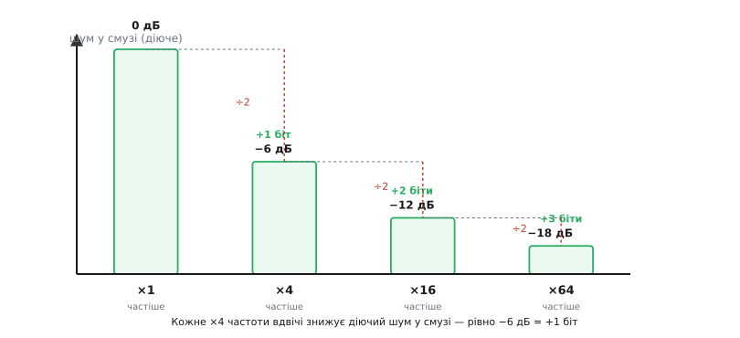
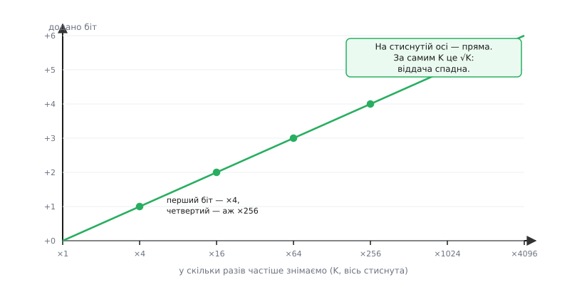

# 🧮 Виграш передискретизації: звідки ½ біта за учетверення

Стаття про [передискретизацію](topic:hw-analog/oversampling-decimation) спирається на коротке правило: **знімати вчетверо частіше — додати рівно один біт роздільності**. Правило зручне, але поки воно тільки продекламоване, лишається дражлива недомовка: чому саме вчетверо, а не вдвічі й не вдесятеро? Чому виграш зупиняється так швидко, що четвертий доданий біт коштує вже в двісті п'ятдесят шість разів більше знімків, ніж перший? Ця вставка бере ту одну фразу й **виводить її з першопричини** — з того, як фіксована потужність шуму розтікається по частоті. У кінці «½ біта за учетверення» перестане бути магічним числом і стане неминучим наслідком двох простих кроків: шум розмазується рівномірно, а діюче значення росте як корінь.

Центральна величина тут — **густина шуму**: скільки потужності шуму припадає на одиницю частоти. Саме її, а не повну потужність, змінює передискретизація, і саме через неї народжується весь виграш.

---

## Що взагалі означає «додати біт»

Спершу домовимося, що ми міряємо, бо «біт роздільності» — річ, яку легко сплутати з «бітом у слові даних». Коли кажуть, що АЦП має 12 біт, мають на увазі не тільки ширину числа на виході, а **відношення сигналу до шуму**: наскільки повношкальний сигнал «гучніший» за неминучий шум округлення. Це відношення й перекладають у біти. Один біт — це рівно вдвічі дрібніший крок квантування, тобто вдвічі тихіший шум відносно сигналу за напругою. А відношення напруг у децибелах — це 20·log₁₀:

```
вдвічі тихіший шум за напругою = 20·log₁₀2 ≈ 6.02 дБ
```

Ось перший стовп, на якому все триматиметься: **один біт роздільності ≡ 6.02 дБ** відношення сигнал/шум. Число не кругле, але точне; його виводить окрема вставка [про σ = LSB/√12 і стелю 6.02·N + 1.76 дБ](topic:hw-analog/sampling-quantization/math-quantization-noise.md), і ми беремо його тут готовим. Далі вся задача звужується до одного питання: **на скільки децибелів передискретизація опускає шум у нашій смузі?** Знайдемо це число — поділимо на 6.02 — дістанемо додані біти. Уся кількісна історія виграшу вкладається в цю одну дію.

> 🔧 **Навіщо це.** Плутати «біт числа» з «бітом роздільності» — джерело найбезглуздіших очікувань. Хтось усереднює 16 знімків 12-бітного АЦП, кладе суму в 16-бітну змінну й радіє «чотирьом новим бітам» — а насправді додав лише два, бо роздільність міряється шумом, а не шириною поля. Тримаючи в голові «біт = 6.02 дБ шуму», ви одразу знаєте стелю: скільки насправді виграли, а не скільки нулів дописалося у двійковому записі.

---

## Де живе шум: не число, а густина по смузі

Тепер найважливіший зсув погляду, без якого решта не складеться. Шум квантування — це не одна цифра «стільки-то мілівольт»; це **потужність, розлита по смузі частот**. Уявіть її як пелену, натягнуту рівним шаром від нуля до половини частоти знімків. Половина частоти знімків, fs/2, — це стеля того, що взагалі можна побачити після дискретизації: усе, що швидше, складається вниз і сидить під цією стелею разом з рештою. Тож весь шум округлення, скільки б його не було, **міститься** у смузі [0, fs/2] і розкладений по ній рівномірно.

Чому саме рівномірно? Бо помилка округлення в кожному відліку майже не пов'язана з помилкою в сусідньому: сигнал гуляє по шкалі, і куди він упаде всередині щабля цього разу — наперед невгадно. Послідовність таких майже незалежних поштовхів у частотному розкладі виглядає **плоскою** — однаково у всіх частотах, як білий колір містить усі кольори порівну. Такий шум і звуть білим. (Аналогія точна рівно доти, доки помилки справді незалежні; на тихому, застиглому вході вони починають повторюватися, робляться корельованими, спектр перестає бути плоским — але це та сама межа, за якою й усереднення втрачає силу, і про неї стаття говорить окремо.)

Уведімо величину, яка все вирішує. Позначимо повну потужність шуму як P — вона фіксована, бо задана самим кроком квантування: P = σ², де σ = LSB/√12. Розкладемо цю потужність по смузі шириною fs/2. Тоді на кожен герц припадає

```
густина шуму = P / (fs/2)     [потужність на одиницю частоти]
```

Ось де захована вся суть передискретизації, і варто зупинитися на цьому рядку. **Чисельник P не залежить від частоти знімань** — шуму рівно стільки, скільки диктує крок АЦП, хоч знімай раз на секунду, хоч мільйон разів. А **знаменник fs/2 прямо пропорційний частоті знімань**. Отже, знімаючи частіше, ми лишаємо ту саму потужність, але розтягуємо її на ширшу смугу — густина падає. Не потужність зникає, а **розмазується тонше**.


*Площа сірої пелени — повна потужність шуму — однакова в обох панелях, бо шуму стільки ж. Знімаючи ×K частіше (праворуч), ту саму площу розтягуємо на смугу до K·fs/2 — у K разів ширшу, тож висота (густина) у K разів менша. Зелена смуга корисного сигналу однакова: її ширину задає сам сигнал, а не частота знімань. У ній шуму тепер у K разів менше.*

---

## Перший крок виводу: у смузі сигналу шуму менше в K разів

Тепер зберімо виграш чисельно. Знімаємо не з мінімально потрібною частотою fs, а в K разів швидше — з K·fs. Смуга, по якій розкладено шум, стала в K разів ширшою: тепер це [0, K·fs/2]. Потужність та сама P, тож густина впала рівно в K разів:

```
густина була   = P / (fs/2)
густина стала  = P / (K·fs/2) = (1/K) · попередня
```

Але корисний сигнал нам потрібен лише у **вузькій** смузі біля нуля — тій самій [0, fs/2], що й до передискретизації, бо саме таку смугу вимагає сам сигнал і ширшою вона не робиться від того, що ми знімаємо частіше. Скільки шуму сидить у цій вузькій смузі тепер? Густина × ширина смуги:

```
шум у смузі сигналу = густина_стала × (fs/2)
                    = [P / (K·fs/2)] × (fs/2)
                    = P / K
```

Ось воно, і воно варте того, щоб прочитати двічі. Уся широка смуга [0, K·fs/2] несе повну потужність P. Але в нашому вузькому вікні [0, fs/2] — лише **K-та частина** цієї смуги, тож і потужності там лише P/K. Решта, (K−1)/K усього шуму, сидить вище нашого вікна, у смузі [fs/2, K·fs/2], — і саме її зрізає цифровий фільтр перед проріджуванням. **Потужність шуму в корисній смузі впала рівно в K разів.**

Тут природно запитати: а куди подівся сигнал? Нікуди — він як був у смузі [0, fs/2], так і лишився, бо його ширину задає він сам. Ми зменшили шум у вікні, не торкнувшись сигналу в ньому. Це й є весь механізм: **не підсилити сигнал, а розтягнути й відрізати шум**.

---

## Другий крок: від потужності до діючого значення — корінь, а не саме число

Ми знайшли, що **потужність** шуму в смузі впала в K разів. Але роздільність, відношення сигнал/шум, порівнює не потужності, а **амплітуди** — діючі (RMS) значення напруги. А діюче значення — це корінь із потужності:

```
σ_у_смузі = √(потужність у смузі) = √(P / K) = σ / √K
```

Ось другий стовп, і саме він, а не перший, робить виграш скромним. Потужність упала в K разів — але діюче значення шуму, з яким змагається сигнал, упало лише в **√K** разів. Учетверимо частоту (K = 4): потужність шуму — учетверо менша, а діюче значення — лише вдвічі. Візьмемо K = 100: потужності в сто разів менше, а шум за напругою тихіший лишень удесятеро.

Чому так — не формальність, а фізика додавання випадкових величин. Коли складають K майже незалежних шумових поштовхів (а усереднення — це і є їхнє додавання), їхні знаки то збігаються, то ні, тож повна амплітуда суми росте не як K, а як √K — це те саме правило, чому за N кроків навмання відходиш від старту приблизно на √N кроків, а не на N. Сигнал же в сусідніх відліках майже однаковий — його доданки додаються **в лад**, амплітуда до амплітуди, тобто ростуть як повне K. Ділимо суму на кількість — сигнал лишається собою, а шум зменшується як K/√K = √K відносно нього. Звідси й береться корінь: **упорядкований сигнал додається лінійно, безладний шум — по корені**.

> 🔧 **Навіщо це.** Правило «√K, а не K» одразу тверезить очікування. Хочете вдесятеро тихіший шум — готуйте не десять знімків, а сто. Хочете стишити його в тридцять разів (типова мета «сховати» останній розряд) — це вже майже тисяча знімків на одне число. Тому в прошивці передискретизацією знімають один-два біти й зупиняються: далі корінь робить кожен наступний крок нестерпно дорогим.

---

## Складаємо: виграш = 10·log₁₀(K) децибелів

Обидва кроки готові — лишається перекласти зменшення шуму в децибели й поділити на 6.02, щоб дістати біти. Виграш у відношенні сигнал/шум — це наскільки тихішим став шум відносно того самого сигналу. За напругою шум упав у √K разів, а децибел для відношення напруг — це 20·log₁₀:

```
виграш = 20·log₁₀(√K) = 20 · ½ · log₁₀K = 10·log₁₀K   (дБ)
```

Той самий результат виходить і коротшим шляхом — прямо через потужність, і корисно побачити обидва, бо вони мають зійтися. Потужність шуму впала в K разів, а децибел для відношення **потужностей** — це 10·log₁₀:

```
виграш = 10·log₁₀(K)   (дБ)     ← через потужність, той самий вислід
```

Два шляхи — від амплітуди (20·log₁₀√K) і від потужності (10·log₁₀K) — дають те саме число, бо √K за напругою й K за потужністю описують один і той самий факт. Це не збіг, а перевірка: якби вони розійшлися, десь була б помилка.

**Формула виграшу — це весь результат вставки в одному рядку.** Усе решта — її прочитання. Підставмо кратності, які трапляються на практиці:

```
K = 2:    10·log₁₀2   ≈ 3.01 дБ   →  3.01 / 6.02 = ½ біта
K = 4:    10·log₁₀4   ≈ 6.02 дБ   →  6.02 / 6.02 = 1 біт
K = 16:   10·log₁₀16  ≈ 12.0 дБ   →  12.0 / 6.02 = 2 біти
K = 64:   10·log₁₀64  ≈ 18.1 дБ   →  18.1 / 6.02 = 3 біти
K = 256:  10·log₁₀256 ≈ 24.1 дБ   →  24.1 / 6.02 = 4 біти
```

Ось звідки береться те саме «правило вчетверо», з якого починалася вставка. **Один біт коштує 6.02 дБ; учетверення частоти дає рівно 10·log₁₀4 = 6.02 дБ.** Числа збігаються не тому, що хтось так домовився, а тому, що обидва тримаються на тому самому log₁₀2: біт — це 20·log₁₀2 за напругою, а учетверення дає 10·log₁₀4 = 10·log₁₀2² = 20·log₁₀2. Те саме 20·log₁₀2 з двох боків. Тому й збіг точний, а не наближений.

А подвоєння частоти (K = 2) дає рівно половину цього — 3.01 дБ, тобто **½ біта**. Ось відповідь на першу недомовку: не «приблизно пів біта», а рівно, бо 10·log₁₀2 — це половина від 10·log₁₀4 за самою властивістю логарифма (log₁₀4 = 2·log₁₀2).


*Висота стовпця — діюче значення шуму в смузі сигналу. Кожне учетверення частоти (×1 → ×4 → ×16 → ×64) вдвічі знижує цю висоту (÷2 за напругою = потужність ÷4), а вдвічі тихший шум відносно сигналу — це рівно −6 дБ, тобто +1 біт роздільності. Сходинки однакові за висотою в бітах, але кожна коштує вчетверо більше знімків за попередню.*

---

## Чому це загальне правило: біти = ½·log₂(K)

Тепер запишемо виграш не в децибелах, а прямо в бітах — так одразу видно і «правило вчетверо», і його ціну. Додані біти — це виграш у дБ, поділений на 6.02 дБ за біт:

```
Δбіт = 10·log₁₀K / (20·log₁₀2) = ½ · (log₁₀K / log₁₀2) = ½ · log₂K
```

Формула Δбіт = ½·log₂K — сама серцевина, і вона надзвичайно промовиста. Логарифм за основою 2 питає: у скільки подвоєнь укладається K? А половина спереду каже: кожне подвоєння частоти дає лише пів біта. Перевірмо на знайомих числах: log₂4 = 2, тож Δбіт = ½·2 = 1 біт; log₂256 = 8, тож Δбіт = ½·8 = 4 біти. Збігається з таблицею вище — і тепер не таблицею, а однією формулою.

Оберніть її — і дістанете зворотне, практичніше питання: скільки знімати, щоб додати задані p бітів?

```
p = ½·log₂K   ⟹   log₂K = 2p   ⟹   K = 2²ᵖ = 4ᵖ
```

**Щоб додати p бітів, знімай 4ᵖ разів частіше.** Один біт — ×4. Два — ×16. Три — ×64. Чотири — ×256. Саме це правило стаття застосовує в коді, коли складає 4ᵖ знімків і ділить суму на 2ᵖ (а не на повну кількість): ділення на 2ᵖ = √(4ᵖ) — це той самий корінь із кількості, що ми вивели як √K. Тепер видно, що «ділити на корінь» — не трюк, а пряме перенесення формули σ/√K у цілочислову арифметику: сума масштабується як K, шум у ній — як √K, тож ділення на √K лишає рівно виграні біти.

---

## Ціна: чому виграш так швидко видихається

Ось ми й дійшли до другої недомовки — чому далі невигідно. Відповідь уже в руках, треба лише прочитати формулу «навпаки». Виграш росте як **логарифм** кратності, а логарифм — найповільніша з функцій, що взагалі ростуть. Це означає: кожен наступний біт коштує **вчетверо** більше знімків, ніж попередній.

```
0 → 1 біт:  знімків 1 → 4       додали ×4       (+3 знімки на 1 біт)
1 → 2 біти: знімків 4 → 16      додали ще ×4    (+12 знімків)
2 → 3 біти: знімків 16 → 64     додали ще ×4    (+48 знімків)
3 → 4 біти: знімків 64 → 256    додали ще ×4    (+192 знімки)
```

Сходинки в бітах однакові — але сходинки у **знімках** ростуть учетверо щоразу. Перший біт майже дармовий: чотири знімки замість одного. Четвертий — уже двісті п'ятдесят шість знімків на кожне єдине число на виході. А час прямо пропорційний кількості знімків: якщо АЦП дає 50 тисяч знімків за секунду, то +4 біти — це 256 знімків ≈ 5 мілісекунд на одне число, тобто заледве двісті значень за секунду. Наступний біт (п'ятий) коштував би вже 1024 знімки й опустив би темп до п'ятдесяти чисел за секунду.


*Крива доданих бітів проти кратності K. Вісь частоти стиснута (кожна поділка — учетверо), тож ідеальне правило лягає прямою; на нестиснутій осі, за самим K, це був би пологий √K. Кроки по осі бітів однакові, але за ними ховається щоразу вчетверо більша ціна: біти йдуть арифметично (+1, +1, +1), а знімки — геометрично (×4, ×16, ×64, ×256).*

Причина цієї стіни — той самий корінь із другого кроку. Виграш живе в √K, а щоб корінь подвоївся, саме K має вирости вчетверо. Корінь — повільна функція саме тому, що обертає піднесення до квадрата, найшвидшу з простих. Отже, повільність віддачі — не вада реалізації, яку можна обійти хитрішим кодом; це **математична межа простого усереднення**. Складаючи незалежні поштовхи, ти купуєш точність по корені — і ніяк інакше, поки шум білий і рівномірний.

> 🔧 **Навіщо це.** Ця межа підказує, коли зупинитися. Один-два біти передискретизацією — майже задарма, варто завжди. Три — терпимо, якщо темп даних дозволяє. Чотири — вже на грані: 256 знімків на число з'їдають і час, і струм. П'ять і більше самим лише усередненням — майже завжди помилка планування: дешевше взяти [АЦП вищої роздільності](topic:hw-analog/adc-types) або перейти на [формування шуму](topic:hw-analog/noise-shaping), де та сама кратність дає не пів біта, а півтора й більше.

---

## Де тут проходить межа: чому дельта-сигма обходить корінь

Варто чітко побачити, що саме ми вивели — і чого **не** вивели. Формула Δбіт = ½·log₂K справедлива для **рівномірного** розмазування шуму: ми взяли, що вся потужність P лягає плоским шаром по смузі, а тоді зрізали зайве. Це найчесніше, що можна зробити, коли шум білий, і найбільше, чого досягне просте усереднення блоками.

Але «плоский шар» — не єдиний спосіб розкласти шум по частоті. Уявіть, що замість рівного шару ми зуміли б **згребти** шум із нашої вузької смуги вгору, у високі частоти, де його однаково зріже фільтр. Тоді в корисному вікні його лишилося б куди менше, ніж K-та частина, — і виграш на кожне учетверення був би не пів біта, а більше. Саме це й робить [дельта-сигма АЦП](topic:hw-analog/adc-types) своїм зворотним зв'язком: не рівномірно мастить шум, а **активно виштовхує** його зі смуги сигналу. Прийом зветься [формуванням шуму (*noise shaping*)](topic:hw-analog/noise-shaping), і завдяки йому кожне учетверення частоти дає півтора біта й більше замість наших скромних пів. Ось чому грубий однобітний компаратор у дельта-сигмі дає двадцять чотири чесні біти: не самим усередненням, а усередненням плюс формуванням.

Наша ж формула — це **нижня, базова смуга** того, що дає передискретизація без жодних хитрощів, на будь-якому звичайному АЦП. Пів біта за учетверення — стеля простого усереднення й підлога всього сімейства передискретизаційних методів. Знати цю підлогу важливо: вона каже, чого чекати від `analogRead` у циклі, і водночас показує, наскільки більше можна взяти, коли до передискретизації додають розумний зворотний зв'язок.

---

## Приклад: 12-бітний ESP32 до чотирнадцяти біт

Зведімо весь апарат в одне робоче число. АЦП ESP32 має рідні 12 біт; хочемо чотирнадцять — додати два біти. Пройдімо весь ланцюг виводу на конкретних значеннях.

**Скільки знімати й що з того вийде (12 → 14 біт, ESP32).**

```
ціль:            +2 біти
кратність:       K = 4ᵖ = 4² = 16 знімків на одне число
виграш у дБ:     10·log₁₀16 = 12.0 дБ
перевірка бітами: 12.0 / 6.02 = 1.995 ≈ 2 біти ✓

шум був (12 біт): σ = LSB/√12,  LSB = 3.3 В / 4095 ≈ 0.806 мВ
                  σ ≈ 0.233 мВ  (діюче, у смузі до fs/2)
шум став:         σ / √K = 0.233 / √16 = 0.233 / 4 ≈ 0.0583 мВ
                  → учетверо тихіший = −12 дБ = +2 біти ✓

ефективний крок:  був 0.806 мВ (12 біт)
                  став 0.806 / 4 ≈ 0.202 мВ (14 біт, 0..16380)
```

Зверніть увагу, як кожен рядок — це не окреме правило, а той самий вивід під іншим кутом. «×16 знімків» — це 4ᵖ. «√16 = 4» — це той корінь із другого кроку. «−12 дБ» — це 10·log₁₀16. «Ділити на 4, не на 16» у коді статті — це ділення на √K, тобто на 2ᵖ. Усі чотири погляди сходяться в одне: склали шістнадцять знімків, поділили на чотири, дістали число у вчетверо дрібнішій сітці, де шум за напругою вчетверо тихіший — рівно два виграні біти.

І одразу видно ціну наступного кроку. П'ятнадцятий біт (третій доданий) зажадав би вже K = 64 — учетверо більше знімків заради ще одного подвоєння кореня. Шістнадцятий — K = 256. Крива з попередньої фігури не абстракція: це прямий рахунок, скільки разів доведеться викликати `analogRead` заради кожного дописаного розряду. [Робочий код цього усереднення з кільцевим буфером і пастками переповнення](topic:hw-analog/oversampling-decimation/proj-decimate-c.md) стаття розбирає окремо; тут ми вивели, **чому** ділити треба саме на корінь і **чому** ціна росте саме вчетверо на біт.

---

Підсумуймо нитку одним ланцюгом. Повна потужність шуму квантування фіксована кроком АЦП — але розлита плоским шаром по смузі до fs/2, тож має **густину**. Знімаючи в K разів частіше, ми не міняємо потужність, а розтягуємо той самий шар на K-разово ширшу смугу: густина падає в K разів, і в нашому вузькому вікні лишається лише P/K потужності. Потужність — у K разів менша, але діюче значення, з яким змагається сигнал, — лише в √K, бо незалежні поштовхи додаються по корені, а впорядкований сигнал — лінійно. Перекладаємо √K у децибели — виходить 10·log₁₀K виграшу; ділимо на 6.02 дБ за біт — виходить Δбіт = ½·log₂K. Звідси й «пів біта за подвоєння», і «один біт за учетверення», і невблаганна ціна: щоб додати p бітів, знімай 4ᵖ разів частіше, бо корінь купує точність повільно й іншого способу немає, поки шум білий. А коли до передискретизації додають [формування шуму](topic:hw-analog/noise-shaping), корінь відступає — але це вже не наша базова формула, а її потужніший нащадок.
