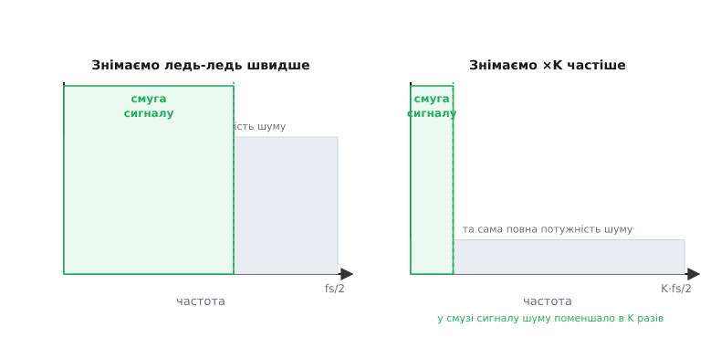
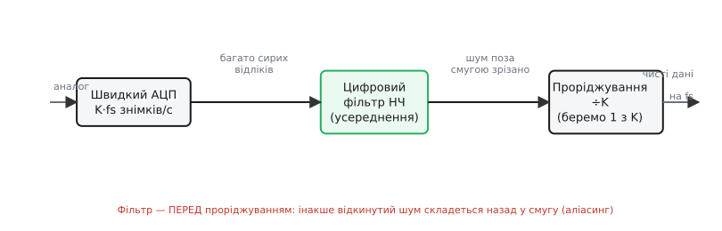
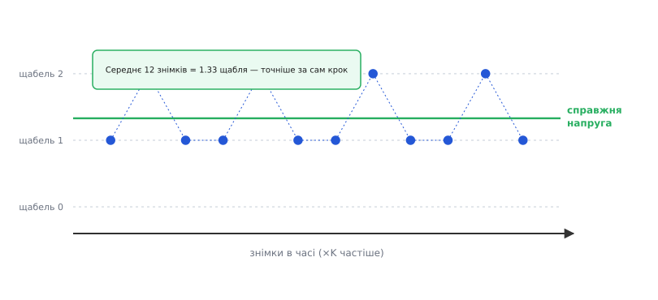

# Передискретизація й децимація: купити точність швидкістю

Здавалося б, знімати сигнал частіше, ніж того вимагає сама його швидкість, — марнотратство: зайві відліки, зайва пам'ять, зайва робота. А виявляється, цей «надлишок» можна виміняти на дорожчий товар — **точність**. Прийом простий до зухвалості: знімаємо набагато частіше, ніж треба, а тоді цифрою «згущуємо» цей потік назад до потрібної швидкості, але вже чистіший. Перша половина — **передискретизація (*oversampling*; over- — над, понад + sampling — знімання)**: брати знімки в рази частіше за необхідне. Друга — **децимація (*decimation*; від лат. *decimatio* — страта кожного десятого; тут — викидання зайвих відліків)**, або проріджування: цифровим фільтром усереднити сусідні знімки й лишити кожен K-тий. На виході — та сама частота, що й була потрібна, але точніша, ніж видав би сам АЦП на ній безпосередньо.

Слово «децимація» прийшло з римського війська: за тяжку провину когорту шикували й страчували кожного десятого — *decimus*. У цифровому обробленні страта безкровна: з потоку лишаємо кожен K-тий відлік, решту відкидаємо. Але — і це серцевина прийому — відкидаємо не сліпо, а **усереднивши** перед тим, щоб викинута інформація не пропала намарне, а влилася в ті, що лишаються.

### Навіщо взагалі знімати швидше, ніж треба

Уявімо звичайну задачу: зміряти повільний сигнал — напругу з термопари, тиск, освітленість. Сама природа сигналу частих знімків не вимагає: він ледь повзе, і кількох відліків на секунду цілком досить, щоб устежити за ним без втрат. За [теоремою дискретизації](root:com-signal/nyquist-aliasing) для повільного сигналу й частота знімків потрібна низька. Тоді навіщо ганяти АЦП у сотні разів швидше?

Бо нас тисне не швидкість сигналу, а **роздільність** — крок [квантування](root:hw-analog/sampling-quantization). Останній біт АЦП завжди тремтить: на нерухомому вході два сусідні читання різняться на одиницю-дві коду — це [шум, у якому тонуть молодші біти](root:hw-analog/adc-resolution). Природна реакція — усереднити кілька читань, щоб випадкове тремтіння взаємно погасилось. А усереднення й означає **взяти багато знімків там, де вистачило б одного**. Ось де народжується передискретизація: ми знімаємо частіше не тому, що сигнал того просить, а тому, що з кожним зайвим знімком приносимо ще трохи інформації, яку потім згорнемо в точніше число.

Тобто маємо **бюджет**, який можна витрачати по-різному. Швидкий АЦП дає певну кількість знімків за секунду. Можна пустити їх усі на швидкість — стежити за швидким сигналом. А можна, якщо сигнал повільний, пустити їх на точність — узяти багато знімків того самого повільного сигналу й усереднити. Передискретизація з децимацією — це і є механізм такого обміну: **зайву швидкість виміняти на роздільність**.

### Чому усереднення додає точності: шум розмазується

Аби зрозуміти, чому це працює, а не просто покладатися на «усереднимо — стане краще», подивімося, де живе шум. У АЦП є неминучий [шум квантування](root:hw-analog/sampling-quantization/math-quantization-noise.md) — округлення до щабля з діючим значенням σ = LSB/√12. Питання тонке: цей шум — це **повна потужність**, і вона нікуди не дівається від того, як часто ми знімаємо. Та коли ми знімаємо швидше, ця **та сама** потужність розкладається на ширшу смугу частот.

Ось ключ. Уся потужність шуму завжди розподілена рівномірно по смузі від нуля до половини частоти знімків — до fs/2. Знімаємо вдвічі частіше — смуга стає вдвічі ширша (до fs), а потужність та сама; отже, на кожну одиницю частоти шуму припадає вдвічі менше. Корисний же сигнал як був, так і лишився у **вузькій** смузі біля нуля — він не «розтягується» від частіших знімків. Тож у тій вузькій смузі, що нас цікавить, шуму поменшало, а сигналу — ні.


*Уся потужність шуму квантування (сіра пелена) розподілена по смузі до fs/2 — і ПЛОЩА її однакова в обох випадках, бо шуму стільки ж. Знімаючи ×K частіше (праворуч), ту саму площу розмазуємо на смугу до K·fs/2 — у K разів ширшу, тож висота (густина шуму) у K разів менша. Зелена смуга корисного сигналу однакова: вона не залежить від частоти знімків. У ній шуму тепер у K разів менше.*

Лишається зібрати сигнал назад, відкинувши ту широку смугу, де тепер сидить більшість шуму. Це і робить **цифровий фільтр низьких частот**: пропускає вузьку смугу сигналу, відрізає все вище. Найпростіший такий фільтр — **усереднення**: скласти K сусідніх знімків і поділити на K. Шум, бувши випадковим і різнознаковим, у сумі частково гаситься; сигнал, майже однаковий у сусідніх знімках, складається без втрат. А коли широку «шумну» смугу зрізано, відліки стали надлишкові — їх можна **проріджувати**, лишаючи кожен K-тий, і повертатися до потрібної частоти fs.

Скільки точності це дає? Для звичайного АЦП без [формування шуму](root:hw-analog/noise-shaping) діє скромне, але точне правило: **кожне збільшення частоти вчетверо додає один біт** роздільності. Знімати в 4 рази частіше — це +6 дБ, тобто +1 біт; у 16 разів — +2 біти; у 256 разів — +4 біти. Виграш росте лише як корінь із кратності, тож гнатися за багатьма зайвими бітами самим лише усередненням — дорого: [звідки береться рівно ½ біта на кожне учетверення й чому далі це невигідно](root:hw-analog/oversampling-decimation/math-oversampling-gain.md) — окрема кількісна розмова.

> 🔧 **Навіщо це.** Будь-який мікроконтролер із вбудованим 12-бітним АЦП — ESP32, STM32, AVR — дістає від передискретизації найдешевше «доточування» роздільності без жодної зовнішньої деталі: читаєте той самий вхід у циклі 16 чи 64 рази (`analogRead` в Arduino-core, `adc_oneshot_read` в ESP-IDF, `HAL_ADC_GetValue` на STM32), складаєте, ділите — і дістаєте 13–15 «чесних» біт там, де залізо обіцяло 12. Платите за це лише часом і трохи кодом; жодних додаткових мікросхем. Саме тому прийом — перший, до якого вдаються, коли вбудованого АЦП «майже вистачає».

### Дві операції: усереднити, тоді відкинути

Розкладімо прийом на дві окремі дії, бо плутати їх не можна — порядок критичний.

**Передискретизація** — це лише про швидкість знімання: брати відліки в K разів частіше, ніж зрештою треба. Сама собою вона нічого не покращує — лише створює надлишок, сировину для другого кроку. Якщо просто знімати швидше й нічого з тим не робити, точніше не стане; виграш народжується в другій дії.

**Децимація** — це насправді теж дві дії, склеєні в одну, і їх корисно бачити нарізно:
- **фільтрація** — усереднити (чи інакше згладити) сусідні знімки, прибравши шум з широкої смуги;
- **проріджування (*downsampling*)** — лишити кожен K-тий результат, відкинувши решту, щоб повернутися до потрібної частоти.


*Повний шлях. Швидкий АЦП дає K·fs сирих відліків за секунду. Цифровий фільтр НЧ (у простому випадку — усереднення) зрізає шум поза вузькою смугою сигналу. Лише ПІСЛЯ цього проріджування ÷K викидає зайві відліки, повертаючи частоту fs. Фільтр обов'язково передує проріджуванню — інакше зрізаний шум складеться назад у смугу (аліасинг).*

> 🔧 **Навіщо це.** Розрізняти дві дії — практичний навик діагностики. Якщо передискретизований сигнал не став чистішим, питання одне: чи справді стоїть фільтр **перед** проріджуванням, чи код просто бере кожен K-тий сирий відлік? Друге — поширена помилка, і вона не лише не допомагає, а **псує** (див. нижче). Бачачи дві операції окремо, ви одразу знаєте, де шукати ваду.

### Чому фільтр мусить іти ПЕРЕД проріджуванням

Це найважливіша й найчастіше зневажена деталь усього прийому. Спокуса очевидна: якщо мені потрібен кожен K-тий відлік, чому б просто не брати кожен K-тий, минаючи фільтр? Бо так ми не позбудемося шуму, а **затягнемо його назад** у корисну смугу.

Згадаймо, навіщо знімали швидко: щоб **розмазати** шум по широкій смузі до K·fs/2. Тепер, якщо просто викинути 9 із кожних 10 відліків (для K = 10), ми тим самим знижуємо частоту знімків назад до fs — а отже, повертаємо смугу до вузької fs/2. Але куди подінеться весь той шум, що сидів у викинутій широкій частині? Він нікуди не зникає — він **складається** (*aliasing*, від *alias* — інше ім'я) назад у вузьку смугу, перевдягнувшись у низькі частоти. Це той самий [ефект колеса, що крутиться назад](root:com-signal/nyquist-aliasing): надто рідке знімання видає швидке за повільне. Уся праця передискретизації йде нанівець — у вузькій смузі шуму стає рівно стільки ж, скільки було б без жодного оверсемплінгу.

Тому порядок незмінний: **спершу зрізати фільтром усе, що вище за нову, вужчу смугу, і лише потім проріджувати**. Фільтр прибирає шум з тієї широкої частини, яку проріджування інакше «загорнуло» б назад. Це не просто «гарна практика» — це сама причина, чому передискретизація працює. Викинути відлік можна лише після того, як усе зайве з нього вже згладжено в сусідні.

Найдешевший фільтр, що робить це достатньо добре, — те саме усереднення: суму K знімків ділимо на K й беремо як один результат. Воно водночас і згладжує (низькочастотний фільтр), і вже згортає K відліків в один (проріджування) — обидві дії в одному русі. Тому усереднення блоками — улюблений спосіб децимації в прошивці: одна петля закриває обидві операції.

### Усереднення допомагає лише тоді, коли є чому усереднюватись

Тут чигає підступна пастка, через яку прийом часом «не працює» — і важливо розуміти чому. Усереднення гасить шум лише за умови, що читання АЦП **різняться** між собою. А вони різнитимуться тільки якщо в сигналі є хоч трохи шуму, що перекидає його через межу щабля. Якщо ж вхід ідеально нерухомий і лежить точно посеред щабля, АЦП щоразу повертатиме **те саме** число — і скільки таких однакових чисел не усереднюй, точніше за один щабель не стане.


*Справжня напруга (зелена) лежить між щаблями 1 і 2, ближче до 1 — десь на 1.33 щабля, але сам АЦП на щабель такого видати не може. Шум перекидає знімки то на щабель 1, то на щабель 2 (8 разів на «1», 4 рази на «2»). Їхнє середнє — 1.33 — лягає точно туди, де справжнє значення, ТОЧНІШЕ за крок самого АЦП. Без шуму всі знімки прилипли б до одного щабля, і середнє не зрушило б ні на йоту.*

Звучить парадоксально: шум **потрібен**, щоб усереднення працювало. І це справді так. Невеликий шум змушує АЦП «голосувати» між сусідніми щаблями — і частка голосів за вищий щабель кодує те, наскільки справжнє значення до нього ближче. Усереднивши, ми зчитуємо цю частку як дробову частину щабля. Якщо власного шуму схеми бракує, його іноді **додають навмисно** — крихітний контрольований сигнал, що хитає вхід через межу щабля; цей прийом звуть **дизерингом (*dithering*)**, і він лежить в основі того, [як усереднення повертає «з'їдені» біти](root:hw-analog/enob). На щастя, у реальній платі власного шуму зазвичай удосталь, і дизеринг сам собою вже присутній — окремо додавати його доводиться рідко.

Звідси практичний висновок: передискретизація з усередненням дає зиск тоді, коли сигнал **живий** — є шум, наведення, легке тремтіння. На ідеально тихому, нерухомому вході вона безсила, бо усереднювати нічого. Це не вада прийому, а межа його застосовності, і знати її варто, щоб не дивуватися, чому на одному стенді 64-кратне усереднення додало два біти, а на іншому — нічого.

### Передискретизація проти формування шуму

Варто чітко відмежувати наш прийом від спорідненого, але потужнішого. Просте усереднення передискретизованого сигналу — це **рівномірне** розмазування шуму: всю його потужність розкладаємо по широкій смузі, а тоді зрізаємо. Виграш скромний — ½ біта на кожне учетверення частоти. Щоб самим лише усередненням добути 16 біт з 1-бітного АЦП, довелося б знімати в сотні тисяч разів частіше — нездійсненно.

Інша архітектура — [дельта-сигма АЦП](root:hw-analog/adc-types) — додає до передискретизації хитрий зворотний зв'язок, який не просто розмазує шум рівномірно, а **активно виштовхує** його з корисної смуги вгору, у високі частоти, де його не шкода. Цей трюк зветься [формуванням шуму (*noise shaping*)](root:hw-analog/noise-shaping): у вузькій смузі сигналу шуму лишається куди менше, ніж дало б рівне розмазування, тож виграш на кожне учетверення — не ½ біта, а півтора й більше. Саме завдяки формуванню шуму грубий 1-бітний компаратор у дельта-сигмі дає 24 «чесні» біти.

Але — і це важливо — **децимація потрібна обом**. І простому усередненню, і дельта-сигмі однаково треба наприкінці цифровий фільтр-дециматор, що зрізає шум поза смугою й проріджує надшвидкий потік до кількох точних чисел за секунду. Формування шуму вирішує, **як саме** розкласти шум по частотах; децимація — те, що зрештою **збирає** чистий сигнал назад. Тому фільтр-дециматор — серце будь-якого дельта-сигма АЦП, а наш прийом передискретизації з усередненням — його простіший родич, доступний на будь-якому звичайному АЦП без особливої архітектури.

### Як це робиться в прошивці

Перейдімо до коду — він короткий і повчальний. Завдання однакове на будь-якому мікроконтролері з вбудованим АЦП: підняти роздільність 12-бітного перетворювача (як в ESP32 чи в більшості STM32) на два біти — до ефективних 14, — усереднивши блоки по 16 знімків. За правилом «×4 = +1 біт» два біти потребують ×16, тобто 16 знімків на один результат. Різниться між середовищами лише те, як зветься одне читання каналу; сама петля скрізь та сама.

Перший, наївний підхід — просто скласти 16 і поділити на 16:

:::tabs
```arduino
// Просте усереднення 16 знімків — повертає те саме 12-бітне число, лише чистіше.
uint16_t read_avg16(uint8_t pin) {
    uint32_t acc = 0;
    for (int i = 0; i < 16; i++) {
        acc += analogRead(pin);     // 16 знімків того самого входу
    }
    return (uint16_t)(acc / 16);    // середнє — у тому самому масштабі 0..4095
}
```
```esp-idf
#include "esp_adc/adc_oneshot.h"

// Просте усереднення 16 знімків — повертає те саме 12-бітне число, лише чистіше.
uint16_t read_avg16(adc_oneshot_unit_handle_t adc, adc_channel_t ch) {
    uint32_t acc = 0;
    int raw = 0;
    for (int i = 0; i < 16; i++) {
        ESP_ERROR_CHECK(adc_oneshot_read(adc, ch, &raw));  // 16 знімків того самого каналу
        acc += (uint32_t)raw;
    }
    return (uint16_t)(acc / 16);    // середнє — у тому самому масштабі 0..4095
}
```
```stm32
#include "stm32f4xx_hal.h"

// Просте усереднення 16 знімків — повертає те саме 12-бітне число, лише чистіше.
// Канал уже налаштовано (одиничне перетворення), hadc — ADC_HandleTypeDef.
uint16_t read_avg16(ADC_HandleTypeDef *hadc) {
    uint32_t acc = 0;
    for (int i = 0; i < 16; i++) {
        HAL_ADC_Start(hadc);
        HAL_ADC_PollForConversion(hadc, 10);  // 16 знімків того самого входу
        acc += HAL_ADC_GetValue(hadc);
    }
    HAL_ADC_Stop(hadc);
    return (uint16_t)(acc / 16);    // середнє — у тому самому масштабі 0..4095
}
```
```micropython
# Просте усереднення 16 знімків — повертає те саме 12-бітне число, лише чистіше.
def read_avg16(adc):
    acc = 0
    for _ in range(16):
        acc += adc.read()           # 16 знімків того самого входу
    return acc // 16                # середнє — у тому самому масштабі 0..4095
```
:::

Це вже гасить шум, але викидає здобуте: ділення на 16 повертає результат у старий 12-бітний масштаб, відрізаючи дробову частину щабля, заради якої все й робилося. Щоб **зберегти** додаткові біти, ділити треба не на 16, а на 4 — тоді сума 16 знімків лягає у ширший, 14-бітний масштаб (0…16380):

:::tabs
```arduino
// Передискретизація з децимацією: 16 знімків → один 14-бітний результат.
// Сума ділиться на √16 = 4, а не на 16 — так зберігаються 2 додаткові біти.
//   ×4 знімків = +1 біт  →  ×16 = +2 біти  →  ділимо на 2² = 4.
uint16_t oversample_14bit(uint8_t pin) {
    uint32_t acc = 0;
    for (int i = 0; i < 16; i++) {
        acc += analogRead(pin);     // 12-бітні знімки (0..4095)
    }
    return (uint16_t)(acc >> 2);    // ÷4: результат уже 14-бітний (0..16380)
}
```
```esp-idf
#include "esp_adc/adc_oneshot.h"

// Передискретизація з децимацією: 16 знімків → один 14-бітний результат.
// Сума ділиться на √16 = 4, а не на 16 — так зберігаються 2 додаткові біти.
//   ×4 знімків = +1 біт  →  ×16 = +2 біти  →  ділимо на 2² = 4.
esp_err_t oversample_14bit(adc_oneshot_unit_handle_t adc, adc_channel_t ch, uint16_t *out) {
    uint32_t acc = 0;
    int raw = 0;
    for (int i = 0; i < 16; i++) {
        esp_err_t err = adc_oneshot_read(adc, ch, &raw);  // 12-бітні знімки (0..4095)
        if (err != ESP_OK) return err;
        acc += (uint32_t)raw;
    }
    *out = (uint16_t)(acc >> 2);    // ÷4: результат уже 14-бітний (0..16380)
    return ESP_OK;
}
```
```stm32
#include "stm32f4xx_hal.h"

// Передискретизація з децимацією: 16 знімків → один 14-бітний результат.
// Сума ділиться на √16 = 4, а не на 16 — так зберігаються 2 додаткові біти.
//   ×4 знімків = +1 біт  →  ×16 = +2 біти  →  ділимо на 2² = 4.
// (На L4/G4/H7 те саме вміє саме залізо — поле Oversampling у налаштуванні АЦП:
//  Ratio = 16, RightBitShift = 2; тоді петля не потрібна взагалі.)
uint16_t oversample_14bit(ADC_HandleTypeDef *hadc) {
    uint32_t acc = 0;
    for (int i = 0; i < 16; i++) {
        HAL_ADC_Start(hadc);
        HAL_ADC_PollForConversion(hadc, 10);
        acc += HAL_ADC_GetValue(hadc);   // 12-бітні знімки (0..4095)
    }
    HAL_ADC_Stop(hadc);
    return (uint16_t)(acc >> 2);    // ÷4: результат уже 14-бітний (0..16380)
}
```
```micropython
# Передискретизація з децимацією: 16 знімків → один 14-бітний результат.
# Сума ділиться на √16 = 4, а не на 16 — так зберігаються 2 додаткові біти.
#   ×4 знімків = +1 біт  →  ×16 = +2 біти  →  ділимо на 2² = 4.
def oversample_14bit(adc):
    acc = 0
    for _ in range(16):
        acc += adc.read()           # 12-бітні знімки (0..4095)
    return acc >> 2                 # ÷4: результат уже 14-бітний (0..16380)
```
:::

Правило загальне: щоб додати **p** біт, усереднюй **4ᵖ** знімків і ділили суму на **2ᵖ** (а не на повну кількість). Різниця — рівно дробова частина щабля, яку голосування між рівнями донесло, а повне ділення відкинуло б.

**Приклад (скільки знімків на скільки біт, ESP32).** Рідні 12 біт, ціль — додати точності.

```
Хочу +1 біт (13):  знімків = 4¹ = 4,    ділю суму на 2¹ = 2  → 0..8190
Хочу +2 біти (14): знімків = 4² = 16,   ділю суму на 2² = 4  → 0..16380
Хочу +3 біти (15): знімків = 4³ = 64,   ділю суму на 2³ = 8  → 0..32760
Хочу +4 біти (16): знімків = 4⁴ = 256,  ділю суму на 2⁴ = 16 → 0..65520

Ціна часу: +4 біти = 256 знімків на один результат.
При 50 тис. знімків/с це ≈ 5 мс на одне 16-бітне число — ~200 за секунду.
```

Видно ціну обміну: кожні наступні два біти коштують у 16 разів більше знімків, а отже й часу. Тому передискретизацією зазвичай додають один-два біти — далі дешевше взяти [зовнішній АЦП вищої роздільності](root:hw-analog/adc-types). [Робочий код децимації з кільцевим буфером, ковзним вікном і пастками переповнення суматора](root:hw-analog/oversampling-decimation/proj-decimate-c.md) — окрема практична розмова; тут досить розуміти суть: складаємо багато, ділимо на корінь із кількості.

Зверніть увагу й на тонкість, що ховається в типі `acc`. Сума 256 дванадцятибітних чисел сягає 256 × 4095 ≈ 1.05 млн — це вже не вміщується в 16-бітне поле (стеля 65 535), тож суматор обов'язково має бути 32-бітним (`uint32_t`). Забути про це — класична помилка: 16-бітний лічильник тихо переповниться, і результат стане безглуздим. Дрібниця, та саме на ній спотикаються найчастіше.

Підсумуймо нитку. Знімаючи частіше, ніж вимагає сигнал, ми розмазуємо неминучий шум квантування по ширшій смузі; цифровий фільтр НЧ зрізає ту широку смугу, лишаючи сигнал чистішим; проріджування повертає потрібну частоту. Усе це — обмін зайвої швидкості на роздільність, доступний на будь-якому АЦП: ½ біта за кожне учетверення для простого усереднення й куди більше — коли передискретизацію підсилюють [формуванням шуму](root:hw-analog/noise-shaping). Головне ж — пам'ятати порядок: усереднити, **тоді** відкинути, бо інакше відкинутий шум складеться назад і вся праця піде намарне.
