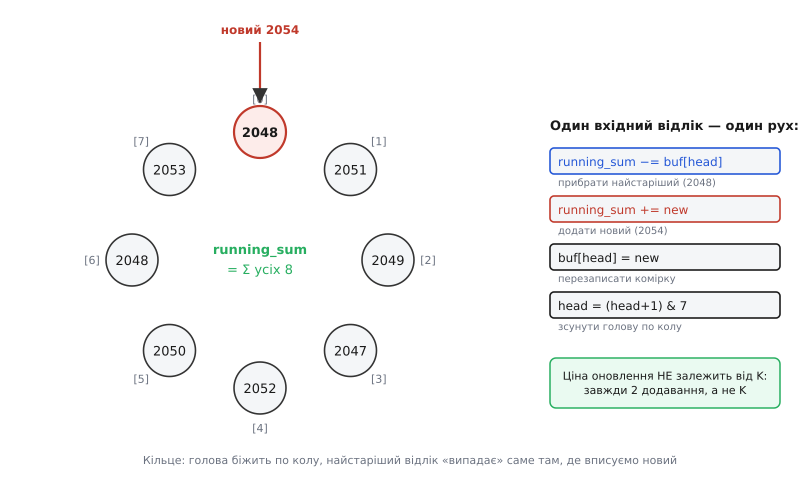

# ⚙️ Робочий дециматор у прошивці: кільцевий буфер і ковзне вікно

Проста петля «склади шістнадцять, поділи на чотири» — чудова, щоб зрозуміти суть передискретизації. Але як тільки її ставлять у справжню прошивку, вилазять питання, яких у навчальному прикладі не було. Що робити, коли відліки не приходять пачками по шістнадцять, а капають по одному з переривання таймера? Як віддавати згладжене число **на кожен** новий відлік, а не раз на блок? Скільки місця й тактів це коштує? І де саме ховаються числові пастки, через які код мовчки видає казна-що?

Ця розмова — про дециматор, який можна лишити в бойовій прошивці й не думати про нього. Ми пройдемо два робочі варіанти — **блоковий** і **ковзний** — доведемо кожен до реального C для мікроконтролера, а тоді розберемо пастки, кожну з яких хтось уже наступив.

Нагадаю, звідки зиск, щоб не було відчуття магії. Знімаючи в K разів частіше, ніж вимагає сигнал, ми розмазуємо шум квантування по ширшій смузі; усереднення зрізає ту широку смугу, лишаючи сигнал чистішим; проріджування повертає потрібну частоту. Правило виграшу скромне: кожне збільшення частоти вчетверо додає рівно один біт роздільності, тож усе тримається на порядку дій — усереднити, **тоді** відкинути.

## Два різні дециматори, які часто плутають

Перше, що треба розвести чітко, — це **дві різні** задачі, які обидві звуть «усередненням», і код у них зовсім різний.

**Блокова децимація.** Накопичуємо рівно K відліків, віддаємо одне число, скидаємо суматор у нуль, починаємо наступний блок. На вхід — K сирих відліків, на вихід — один. Частота на виході в K разів нижча за вхідну. Це буквально те, що робить наївна петля: набрали блок — виплюнули результат — забули. Такий дециматор **справді проріджує**: якщо АЦП сипле 50 000 відліків на секунду, а K = 256, на виході маємо ≈195 чисел на секунду.

**Ковзне (рухоме) усереднення.** Тримаємо вікно останніх K відліків і на **кожен** новий відлік віддаємо середнє цього вікна. Вихідна частота **дорівнює вхідній** — на кожен вхід є вихід, просто згладжений. Тут проріджування ще не відбулося: ми лише відфільтрували. Це вже не дециматор у чистому вигляді, а **фільтр** — той самий низькочастотний фільтр, що має стояти *перед* проріджуванням. Хочемо ще й знизити частоту — беремо з цього згладженого потоку кожен K-тий.

Різниця не косметична. Блоковий варіант дає одне свіже число раз на K відліків — між ними виходу немає взагалі. Ковзний дає свіже число щоразу, тож реагує на зміну сигналу без затримки на цілий блок, але й рахує в K разів частіше. Що обрати — залежить від задачі:

- Треба просто підняти роздільність повільного вимірювання (термопара, тиск) і віддавати результат кілька разів на секунду — **блоковий**: простіший, дешевший, нічого зайвого.
- Треба **безперервно** згладжений потік із високою частотою оновлення (стежити за плавним рухом, малювати графік у реальному часі) — **ковзний**.

> 🔧 **Навіщо це.** Плутанина цих двох — джерело двох протилежних скарг. «Мій дециматор віддає результат лише зрідка» — це блоковий там, де хотіли ковзний. «Мій дециматор жере весь процесор» — це ковзний (рахує на кожен відлік) там, де вистачило б блокового. Спершу вирішіть, яка з двох задач у вас, і половина проблем зникне ще до першого рядка коду.

## Блоковий дециматор, який годиться в прошивку

Почнімо з блокового — він простіший, і на ньому зручно показати всі числові пастки, бо в ковзному вони ті самі, лише прихованіші.

Наївна петля з основної статті синхронна: вона сама крутить `analogRead` шістнадцять разів поспіль і блокує потік, доки не набере блок. У справжній прошивці так не роблять — відліки приходять **асинхронно**, з переривання таймера чи з черги DMA, по одному. Тож дециматор має бути **накопичувачем зі станом**: йому згодовують по одному відліку, а він сам вирішує, коли блок повний і час віддати результат.

Оформімо це структурою й функцією «додай відлік»:

:::tabs
```cpp
#include <stdint.h>
#include <stdbool.h>

// Блоковий дециматор: накопичує SHIFT_K² відліків, віддає одне число вищої роздільності.
// K = 16 знімків на результат  →  +2 біти  →  ділимо суму на 4 = 2².
#define BLOCK_N     16        // скільки сирих відліків у блоці (мусить бути 4ᵖ)
#define BLOCK_SHIFT 2         // ділення на 2ᵖ; для +2 біт p=2, ділимо на 4

typedef struct {
    uint32_t acc;             // суматор — ОБОВ'ЯЗКОВО 32-бітний (див. пастки нижче)
    uint16_t count;           // скільки відліків уже в блоці
} block_dec_t;

// Згодувати один сирий відлік. Повертає true, коли блок завершився
// й у *out лежить готовий результат вищої роздільності.
bool block_push(block_dec_t *d, uint16_t sample, uint16_t *out) {
    d->acc += sample;                     // накопичуємо
    if (++d->count < BLOCK_N)
        return false;                     // блок ще не повний — виходу нема

    *out    = (uint16_t)(d->acc >> BLOCK_SHIFT);  // ÷4: результат уже 14-бітний
    d->acc   = 0;                          // готуємо наступний блок
    d->count = 0;
    return true;
}
```
```python
# Блоковий дециматор: накопичує SHIFT_K² відліків, віддає одне число вищої роздільності.
# K = 16 знімків на результат  →  +2 біти  →  ділимо суму на 4 = 2².
BLOCK_N     = 16        # скільки сирих відліків у блоці (мусить бути 4ᵖ)
BLOCK_SHIFT = 2         # ділення на 2ᵖ; для +2 біт p=2, ділимо на 4


class BlockDecimator:
    def __init__(self):
        self.acc = 0       # суматор (у Python ціле безмежне — переливу нема)
        self.count = 0     # скільки відліків уже в блоці

    # Згодувати один сирий відлік. Повертає готовий результат вищої
    # роздільності, коли блок завершився, інакше None.
    def push(self, sample):
        self.acc += sample                # накопичуємо
        self.count += 1
        if self.count < BLOCK_N:
            return None                   # блок ще не повний — виходу нема

        out = self.acc >> BLOCK_SHIFT     # ÷4: результат уже 14-бітний
        self.acc = 0                      # готуємо наступний блок
        self.count = 0
        return out
```
:::

Уся логіка — в одному `if`. Кожен виклик додає відлік у суматор; коли лічильник дійшов до `BLOCK_N`, віддаємо суму, зсунуту на `BLOCK_SHIFT`, і обнуляємо стан. Зверніть увагу: ділимо **не** на `BLOCK_N` (16), а на `2²` = 4 — саме так зберігаються два додаткові біти, заради яких усе робилось. Поділили б на всі 16 — повернули б результат у старий 12-бітний масштаб і викинули б дробову частину щабля, яку голосування між рівнями щойно донесло.

А тепер — як це живе в реальному циклі. Відлік приходить із переривання таймера, дециматор крутиться у фоні:

```c
// Глобальний стан дециматора та прапорець «готово».
static volatile block_dec_t g_dec = {0, 0};
static volatile uint16_t    g_result;
static volatile bool        g_ready = false;

// Обробник переривання таймера АЦП: викликається на кожен сирий відлік.
void IRAM_ATTR adc_isr(void) {
    uint16_t raw = adc_read_raw();         // швидке читання регістра АЦП
    uint16_t out;
    if (block_push((block_dec_t *)&g_dec, raw, &out)) {
        g_result = out;                    // блок готовий
        g_ready  = true;                   // сигналимо основному циклу
    }
}

void loop(void) {
    if (g_ready) {
        g_ready = false;
        uint16_t value14 = g_result;       // 14-бітне число, 0..16380
        // ... вжити value14: відправити, показати, порівняти з порогом ...
    }
}
```

Основний цикл жодного разу не блокується на читанні АЦП: уся чорна робота — в перериванні, а `loop` лише забирає готове число, коли з'явиться прапорець. Це і є та форма, якої бракувало навчальній петлі: **не** «зупинись і набери шістнадцять», а «постійно перетравлюй потік, віддавай результат, коли дозрів».

> 🔧 **Навіщо це.** Слово `volatile` тут не прикраса. Змінні `g_ready`, `g_result` і сам стан дециматора міняє переривання, а читає основний цикл — два різні контексти виконання. Без `volatile` оптимізатор має право припустити, що `g_ready` ніхто «збоку» не змінює, закешувати його в регістрі й ганяти `if (g_ready)` у нескінченному циклі, ніколи не перечитуючи пам'ять. Прошивка зависне на порожньому місці, і на найвищому рівні оптимізації, де компілятор агресивніший. Класична пастка обміну даними між ISR і `main`.

## Ковзне вікно: чому потрібен кільцевий буфер

Тепер складніший, але часто потрібніший варіант — **ковзне усереднення**. Хочемо на кожен новий відлік мати середнє останніх K відліків.

Лобовий спосіб очевидний: тримати масив останніх K відліків і щоразу заново пробігати його, додаючи всі K чисел. Працює — але дорого: на **кожен** вхідний відлік це K додавань. При K = 64 і швидкому потоці процесор захлинеться самим лише усередненням, не встигаючи ні на що інше.

Придивімося, що насправді змінюється від відліку до відліку. Вікно зсунулось на один: **один** новий відлік увійшов, **один** найстаріший випав, решта K−2 лишились ті самі. Навіщо ж перераховувати всю суму, якщо змінилися лише два її члени? Тримаймо **біжучу суму** й на кожен крок робімо рівно два рухи: відняти той, що випадає, додати той, що входить.

```
running_sum += новий − найстаріший
```

Ось де народжується **кільцевий буфер (*ring buffer*, або *circular buffer*)**. Нам треба пам'ятати останні K відліків, щоб знати, який саме зараз «випадає». Тримати їх у звичайному масиві й совати всі елементи на одну позицію при кожному відліку — знову K операцій, те саме зло. Кільцевий буфер уникає зсування: масив фіксованого розміру K, і покажчик-«голова», що біжить по колу. Новий відлік пишемо на місце найстарішого (голова саме там і стоїть), потім голову зсуваємо на одну позицію вперед — а дійшовши до кінця масиву, вона перестрибує на початок. Ніхто нічого не соває; кільце просто крутиться.


*Вісім останніх відліків лежать у кільці. Нова точка (2054) пишеться туди, де стоїть голова, — а саме там лежить найстаріший відлік (2048), що якраз «випадає» з вікна. Оновлення біжучої суми — два рухи: відняти найстаріший, додати новий; потім голова зсувається на одну комірку по колу. Ціна кроку НЕ залежить від K: завжди два додавання, а не K.*

Розмір вікна беремо **степенем двійки** не випадково: тоді зсув голови по колу — це не дороге ділення з остачею `head % K`, а дешеве побітове `head & (K−1)`. Для K = 8 маска — `0b111` = 7; коли голова доходить до 8, `8 & 7` дає 0, і вона плавно повертається на початок. Один такт замість десятків на ділення.

## Робочий код ковзного дециматора

Зберімо все докупи. Структура тримає масив-кільце, біжучу суму, позицію голови й лічильник заповнення (він потрібен, щоб коректно поводитись, поки вікно ще не набралося — про це нижче).

:::tabs
```cpp
#include <stdint.h>
#include <stdbool.h>

// Ковзне усереднення на кільцевому буфері.
// WIN мусить бути степенем двійки, щоб маска WIN-1 замінила ділення з остачею.
#define WIN        16                 // розмір вікна (степінь 2!)
#define WIN_MASK   (WIN - 1)          // 0b1111 = 15 — для зсуву голови по колу
#define WIN_SHIFT  4                  // log2(WIN): ділення суми на WIN = зсув на 4

typedef struct {
    uint16_t buf[WIN];    // кільце останніх WIN відліків
    uint32_t sum;         // біжуча сума вмісту кільця — 32-бітна (пастка нижче)
    uint16_t head;        // куди пишемо наступний; там же лежить найстаріший
    uint16_t filled;      // скільки комірок уже реально заповнено (для розігріву)
} sliding_t;

// Ініціалізація: усе в нуль.
void sliding_init(sliding_t *s) {
    for (uint16_t i = 0; i < WIN; i++) s->buf[i] = 0;
    s->sum = 0;
    s->head = 0;
    s->filled = 0;
}

// Згодувати новий відлік, отримати згладжене середнє вікна.
uint16_t sliding_push(sliding_t *s, uint16_t sample) {
    s->sum -= s->buf[s->head];        // прибрати найстаріший (він саме під головою)
    s->sum += sample;                 // додати новий
    s->buf[s->head] = sample;         // перезаписати комірку
    s->head = (s->head + 1) & WIN_MASK; // зсунути голову по колу (дешева маска)

    if (s->filled < WIN) s->filled++; // поки вікно набирається — рахуємо реальний вміст

    return (uint16_t)(s->sum / s->filled); // середнє по вже заповненій частині
}
```
```python
# Ковзне усереднення на кільцевому буфері.
# WIN мусить бути степенем двійки, щоб маска WIN-1 замінила ділення з остачею.
WIN       = 16                 # розмір вікна (степінь 2!)
WIN_MASK  = WIN - 1            # 0b1111 = 15 — для зсуву голови по колу
WIN_SHIFT = 4                  # log2(WIN): ділення суми на WIN = зсув на 4


class SlidingAverage:
    # Ініціалізація: усе в нуль.
    def __init__(self):
        self.buf = [0] * WIN   # кільце останніх WIN відліків
        self.sum = 0           # біжуча сума вмісту кільця
        self.head = 0          # куди пишемо наступний; там же лежить найстаріший
        self.filled = 0        # скільки комірок уже реально заповнено (для розігріву)

    # Згодувати новий відлік, отримати згладжене середнє вікна.
    def push(self, sample):
        self.sum -= self.buf[self.head]      # прибрати найстаріший (він саме під головою)
        self.sum += sample                   # додати новий
        self.buf[self.head] = sample         # перезаписати комірку
        self.head = (self.head + 1) & WIN_MASK  # зсунути голову по колу (дешева маска)

        if self.filled < WIN:
            self.filled += 1                 # поки вікно набирається — рахуємо реальний вміст

        return self.sum // self.filled       # середнє по вже заповненій частині
```
:::

Серце — чотири рядки в `sliding_push`: відняти той, що випадає (він лежить точно під головою, бо голова завжди стоїть на найстарішому), додати новий, перезаписати комірку, зсунути голову маскою. Жодних циклів, жодного проходу по масиву — **сталий час на будь-який розмір вікна**. Вікно на 16 відліків і на 1024 коштують однаково: два додавання.

Один тонкий момент у поверненні. Поки кільце ще не заповнилося вщент (перші WIN відліків після старту), у ньому лежать нулі з ініціалізації, і ділити на повне WIN не можна — вийде заниження. Тому ділимо на `filled` — скільки відліків реально надійшло. Це і є коректний **розігрів (*warm-up*)** фільтра: перше значення дорівнює першому відліку, друге — середньому двох, і лише з WIN-го відліку вікно повне й ділення йде на WIN. Прибрати цей лічильник — і перші WIN виходів будуть неправдиво занижені, бо ділитимуться на повне WIN, тоді як половина доданків — ще нулі.

Щоб отримати ще й **зниження частоти** (справжню децимацію, а не лише згладжування), беремо з цього потоку кожен WIN-тий результат:

```c
// Ковзний фільтр + проріджування = повний дециматор зі зниженням частоти.
static sliding_t g_flt;
static uint16_t  g_decim_cnt = 0;

void adc_isr(void) {
    uint16_t raw = adc_read_raw();
    uint16_t smoothed = sliding_push(&g_flt, raw);   // згладили (фільтр стоїть ПЕРЕД проріджуванням)

    if (++g_decim_cnt >= WIN) {                        // проріджуємо ÷WIN
        g_decim_cnt = 0;
        publish_sample(smoothed);                     // віддаємо лише кожен WIN-тий
    }
}
```

Тут наочно видно закон порядку з основної статті: `sliding_push` (фільтр) стоїть **перед** лічильником проріджування. Спокуса «взяти кожен WIN-тий сирий відлік» без фільтра — і є та помилка, що загортає широкосмуговий шум назад у корисну смугу (аліасинг). Фільтр першим, проріджування другим — інакше вся праця передискретизації йде намарне.

> 🔧 **Навіщо це.** Порівняйте ціну. Лобове усереднення без кільця — K додавань на відлік; при K = 256 і потоці 50 кГц це 12.8 мільйона додавань на секунду лише на суму. Кільцевий буфер робить те саме **двома** додаваннями на відлік — 100 тисяч на секунду, у пару тисяч разів дешевше, і ціна не росте з K. На мікроконтролері, де тактів обмаль, ця різниця вирішує, влізе фільтр у бюджет часу чи ні.

## Пастка перша: розрядність суматора

Тепер — пастки. Кожну з них хтось уже впіймав важким шляхом, ганяючись за «неможливим» багом; знаючи їх наперед, ви заощадите вечір із осцилографом.

Найпідступніша — **переповнення суматора**, бо код виглядає бездоганно й навіть **майже** працює, а тоді на певних даних тихо видає казна-що. Порахуймо межу чесно. Один відлік 12-бітного АЦП — до 4095 (2¹²−1). Скільки їх максимум складеться в суму:

```
Один блок 256 відліків:  256 × 4095 = 1 048 320
Стеля 16-бітного числа (uint16_t):   65 535
Стеля 32-бітного (uint32_t):  4 294 967 295
```

Сума вже за **шістнадцяти** відліків (16 × 4095 = 65 520) майже впритул підпирає стелю `uint16_t` — 65 535; ще один максимальний відлік, і перелив. А блок на 256 перевищує її в шістнадцять разів. Тому суматор **мусить** бути 32-бітним. Оголосите його `uint16_t` — і на великих сумах він тихо «обернеться» через нуль: замість 65 540 отримаєте 4, і середнє стане безглуздим.

Пастка тим гидкіша, що не падає з помилкою. `uint16_t acc` пройде компіляцію, пройде швидкий тест на малому сигналі (де суми ще не досягли стелі) і зламається лише в полі, на яскравому вході чи більшому вікні. Виведіть загальну межу й закладіть запас:

```
Скільки треба біт для суми N відліків розрядності B:
   max_sum = N × (2ᴮ − 1)
   bits    = ceil( log2(max_sum) )

Приклад: N=256, B=12  →  max_sum ≈ 1.05·10⁶  →  bits = 20  →  32-бітне з запасом
Приклад: N=1024, B=16 →  max_sum ≈ 6.7·10⁷  →  bits = 26  →  32-бітне, ще влазить
Приклад: N=65536, B=16 →  max_sum ≈ 4.3·10⁹ →  bits = 32  →  uint32_t ще стачить, але ВПРИТУЛ (далі → uint64_t)
```

Правило просте: `uint32_t` покриває будь-яку розумну комбінацію (десятки-сотні тисяч 16-бітних відліків), і лише за екстремальних вікон переходьте на `uint64_t`. Зайвих байтів на суматорі не шкодуйте — це один із небагатьох випадків, де ощадливість дорого коштує.

## Пастка друга: ділити на корінь, а не на кількість

Друга пастка тонша, бо код і з нею «працює» — просто не дає обіцяного виграшу, і ви губитеся, чому +2 біти не з'явилися.

Щоб **зберегти** додаткові біти, суму K відліків ділять **не на K, а на √K** — тобто на `2ᵖ`, де p — скільки біт додаємо. Це прямий наслідок правила «×4 частоти = +1 біт»: аби додати p біт, беремо `4ᵖ` відліків і ділимо на `2ᵖ`. Плутанина «поділю на кількість, це ж середнє» повертає результат у стару розрядність і викидає саме той дріб щабля, заради якого все затівалось.

Складімо обидва ділення поруч на одному блоці, щоб різниця була очевидна:

```
Блок = 16 знімків 12-бітного АЦП, справжня напруга ≈ 1.33 щабля.
Сума 16 знімків (8 разів «щабель 1» + 8 разів «щабель 2») = 24.

Ділення на 16 (наївне «середнє»):
   24 / 16 = 1  (цілочисельно)  →  повернулися в 12 біт, дріб з'їдено, виграшу НЕМА

Ділення на 4 = √16 (правильне для +2 біт):
   24 / 4 = 6   →  масштаб 14-бітний; 6/4 = 1.5 щабля вихідної сітки
   → зберегли дробову частину, яку донесло голосування між рівнями
```

Зверніть увагу на слово «цілочисельно». У C ділення цілих **відкидає** дробову частину, не округлює: `24 / 16` дає рівно 1, а не 1.5. Ось чому наївне ділення на повну кількість не просто марне — воно активно нищить здобуток, обрубуючи саме ту інформацію, що сиділа в молодших розрядах. Правильний масштаб (`>> p`) цю інформацію лишає в числі; а вже як розпорядитися нею — ваша справа.

Практично це значить: у коді фігурує **зсув на p**, а не ділення на K. У блоковому дециматорі вище — `d->acc >> BLOCK_SHIFT` (BLOCK_SHIFT = 2 для +2 біт), а не `d->acc / BLOCK_N`. Різниця в одному символі, а в ній — весь сенс прийому.

Тонкість: ковзний дециматор із `sliding_push` вище ділить на `filled` (повне WIN), бо його задача інша — віддати **справжнє середнє вікна** в тому ж масштабі, для згладжування. Розширення розрядності («+біти») — це властивість **блокового** проріджування, де сума йде на менший дільник. Якщо від ковзного теж хочете додаткові біти, а не лише згладжування, — на кроці проріджування діліть накопичене на `2ᵖ`, а не усереднюйте вікно. Знову: спершу вирішіть, згладжування вам треба чи розрядність, і код підкаже сам себе.

## Пастка третя: зсув, знак і хибне округлення

Ще кілька дрібніших, але кусючих граблів — усі про те, як залізо й C трактують числа.

**Зсув від'ємних чисел.** Правило «÷2ᵖ = зсув вправо на p» бездоганне лише для **беззнакових** цілих. Тільки-но відліки стають знаковими (`int16_t` — коли, скажімо, віднімаєте зсув нуля чи працюєте з різницею), правий зсув від'ємного числа поводиться інакше, ніж ділення: `-1 >> 1` дає −1 (арифметичний зсув округлює вниз, до −∞), а `-1 / 2` дає 0 (ділення округлює до нуля). На межі це дасть систематичну похибку в один щабель на від'ємній половині. Висновок: тримайте сирі відліки **беззнаковими** якомога довше; де без знаку не обійтись — діліть явним `/`, а не зсувом, і не дивуйтеся зайвому такту.

**Округлення проти обрубання.** Цілочисельне ділення завжди рубає вниз, тож середнє систематично занижене в середньому на пів-одиниці. Здебільшого це байдуже, але коли важить кожен молодший біт, додайте перед діленням половину дільника — так вийде чесне округлення до найближчого:

```c
// Округлення до найближчого замість обрубання вниз.
// Додаємо половину дільника ПЕРЕД зсувом: (сума + K/2) / K.
uint16_t rounded = (uint16_t)((acc + (BLOCK_N >> 1)) >> BLOCK_SHIFT_FULL);
//                                    ^^^^^^^^^^^^^ = 8 для блоку 16
```

Дрібниця на один щабель, але саме за нею женуться, коли меряють щось, де останній біт справді потрібен.

**Порядок «фільтр → проріджування» ще раз, але в коді.** Найдорожча пастка не числова, а логічна, і в коді вона виглядає невинно: взяти кожен K-тий сирий відлік замість того, щоб згладити перед проріджуванням. Порівняйте два рядки:

```c
// ХИБНО: беремо кожен K-тий СИРИЙ відлік. Шум із широкої смуги
//        складається назад у корисну (аліасинг) — виграшу нуль.
if (++cnt >= K) { cnt = 0; publish(raw); }

// ПРАВИЛЬНО: спершу згладжуємо (фільтр), тоді беремо кожен K-тий.
uint16_t smoothed = sliding_push(&flt, raw);
if (++cnt >= K) { cnt = 0; publish(smoothed); }
```

Перший варіант компілюється, працює, віддає числа потрібної частоти — і не покращує **нічого**, бо пропускає єдиний крок, заради якого все затівалось. Це найпоширеніша причина скарги «зробив передискретизацію, а чистіше не стало». Фільтр — перед проріджуванням, завжди; викинути відлік можна лише після того, як усе зайве з нього згладжено в сусідні.

> 🔧 **Навіщо це.** Ці три граблі об'єднує одне: код **компілюється і майже працює**, тому їх не ловить ні компілятор, ні швидкий тест. Переповнення спрацьовує лише на великих сумах; неправильний дільник тихо з'їдає біти; аліасинг видає числа правильної частоти без покращення. Усі троє — «мовчазні» баги, і саме тому знати їх наперед цінніше, ніж уміти ловити постфактум.

## Скільки це коштує й де межа

Зведімо ціну обміну, бо саме вона диктує, коли передискретизація доречна, а коли час брати інше залізо.

**Пам'ять.** Блоковий дециматор — кілька байтів стану (суматор + лічильник), і по суті безкоштовний. Ковзний тримає весь буфер: WIN відліків по 2 байти. Вікно на 256 — це 512 байтів ОЗП; на дрібному мікроконтролері з кількома кілобайтами це вже відчутно. Що ширше вікно (більший виграш), то більше пам'яті просить ковзний варіант; блоковий від розміру блоку не роздувається зовсім. Ще один довід на користь блокового там, де ковзний не конче потрібен.

**Час.** Обидва — сталого часу на відлік: блоковий робить одне додавання, ковзний — два (відняти-додати) плюс маску. Ані той, ані той не пробігає масив, тож із розміром вікна ціна кроку не росте. Реальна ціна — в **загальній кількості** відліків, яку диктує потрібний виграш:

```
Виграш роздільності від блокового усереднення (без формування шуму):
   +1 біт  →  ×4 відліків
   +2 біти →  ×16
   +3 біти →  ×64
   +4 біти →  ×256

При потоці 50 000 відліків/с (типово для швидкого АЦП МК):
   +2 біти (×16):   16 відліків/результат  →  ≈ 3 125 результатів/с
   +3 біти (×64):   64 відліки/результат   →  ≈   780 результатів/с
   +4 біти (×256): 256 відліків/результат  →  ≈   195 результатів/с
```

Кожні наступні два біти коштують у шістнадцять разів більше відліків, тобто в шістнадцять разів нижчу вихідну частоту (для блокового) або в шістнадцять разів більший буфер (для ковзного). Виграш росте лише як корінь із кратності — тому передискретизацією зазвичай додають **один-два** біти, і на цьому спиняються. Гнатися за третім-четвертим самим лише усередженням — марнотратство: за ті самі гроші дешевше взяти [зовнішній АЦП вищої роздільності](root:hw-analog/adc-types) або [дельта-сигму з формуванням шуму](root:hw-analog/noise-shaping), де на кожне учетверення частоти припадає не пів-біта, а півтора й більше.

**Межа застосовності.** І головне, що не полагодить жоден код: усереднення додає точності лише коли читання АЦП **різняться** між собою. Потрібен бодай крихітний шум, що перекидає сигнал через межу щабля, — тоді частка «голосів» за вищий щабель кодує дробову частину, і середнє лягає між рівнями точніше за крок самого АЦП. На ідеально тихому, нерухомому вході всі відліки прилипнуть до одного щабля, середнє не зрушить ні на йоту, і хоч мільйон їх усередни — точніше за один щабель не стане. У реальній платі власного шуму зазвичай удосталь, тож це працює само собою; але якщо стенд надто тихий, а виграшу немає, — річ не в коді, а в тім, що усереднювати нічого. Це не вада прийому, а його природна межа, і сталого часу кільцевий буфер її не відсуває.

Підсумок практичний. Блоковий дециматор — стан у кілька байтів, одне додавання на відлік, віддає число раз на блок; беріть його для повільних вимірювань, де треба лише підняти роздільність. Ковзний на кільцевому буфері — буфер на WIN відліків, два додавання на відлік, згладжений вихід на кожен вхід; беріть, коли треба безперервний потік. В обох випадках суматор — 32-бітний, дільник — `2ᵖ` (а не повне K, якщо женетесь за бітами), фільтр — суворо перед проріджуванням. Три числа, три пастки — і дециматор роками стоїть у прошивці, про який більше не думаєш.
