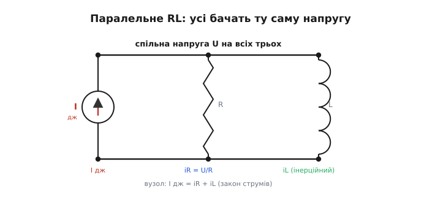
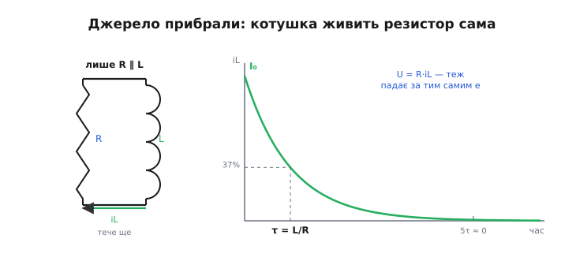
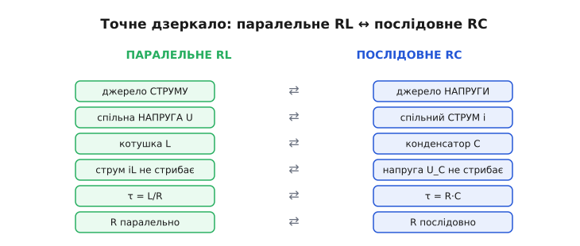
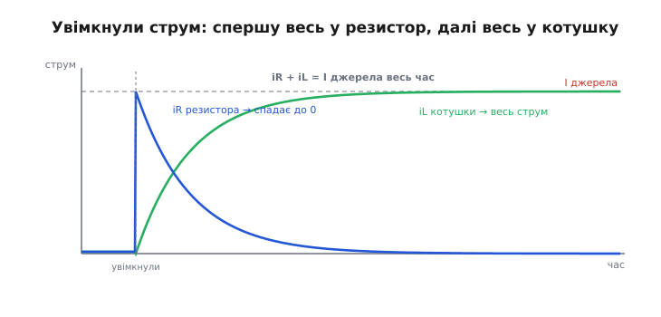

# Паралельне RL-коло: двоїсті перехідні процеси

Поставте резистор і котушку **поряд** — обидва кінці одного до обох кінців другого — і підведіть до цієї пари не джерело напруги, а джерело струму. Виходить паралельне RL-коло: дві гілки, одна спільна напруга на обох. На вигляд дрібниця проти звичного послідовного кола, де резистор і котушка стоять ланцюжком. Та насправді тут інша геометрія змушує струм і напругу помінятися ролями — і все коло стає **точним дзеркалом** не послідовного RL, а зарядного RC-кола. Розберімо, що це за дзеркало, чому котушка тут живить резистор сама, коли джерело зникає, і де така схема трапляється насправді.

Слово «паралельний» (гр. *parállēlos* — той, що йде поряд) тут буквальне: гілки йдуть поряд, кінець до кінця, тож напруга на них **однакова за означенням** — це не наслідок розрахунку, а сама умова з'єднання. А «перехідний» (лат. *transitus* — перехід) нагадує: нас цікавить не усталений стан, а та мить **переходу** між станами, коли струм перерозподіляється між гілками. Саме в цій миті вся суть.

### Одна напруга на всіх, струми розходяться

Почнімо з того, що відрізняє паралель від послідовності, бо звідси випливе все інше. У послідовному колі через усі елементи тече **той самий струм** (їм нема куди розгалузитися), а напруга джерела ділиться між ними. У паралельному — навпаки: на всіх гілках **та сама напруга** (вони підвішені до одних двох вузлів), а струм розгалужується, ділячись між ними. Це проста, але вирішальна заміна ролей: послідовність нав'язує спільний струм, паралель — спільну напругу.


*Паралельне RL: джерело струму, резистор R і котушка L підвішені до однієї пари вузлів, тож напруга U на них спільна. Струм джерела розходиться на дві гілки — миттєвий iR = U/R через резистор та інерційний iL через котушку. У вузлі завжди I дж = iR + iL (за [законом струмів Кірхгофа](topic:hw-analog/kcl)).*

Тепер придивімося до гілок окремо. Через резистор струм слухняно йде за [законом Ома](topic:hw-analog/ohms-law): iR = U/R, миттєво, без жодної інерції — яка зараз напруга, такий зараз і струм. А через котушку струм поводиться зовсім інакше: він **інерційний**. [Котушка опирається будь-якій зміні свого струму](topic:ph-electromagnetism/inductance): за V = L·di/dt будь-яка зміна струму вимагає напруги, а миттєва зміна вимагала б нескінченної напруги — тож струм крізь котушку завжди повзе плавно, без стрибків. Виходить разюча різниця темпераментів двох сусідів під однією напругою: резистор відгукується вмить, котушка — поволі, з «розгоном» і «вибігом».

> 🔧 **Навіщо це.** Ця пара «миттєвий R + інерційний L під спільною напругою» — це і є природна модель багатьох реальних вузлів: котушки реле з паралельним гасним резистором, обмотки давача з розрядним опором, дроселя живлення з демпфувальним резистором. Щойно ви бачите резистор, посаджений **прямо на виводи** котушки, перед вами паралельне RL — і його поведінку диктують саме закони цієї теми, а не послідовного кола.

Спільна напруга — це той місток, який пов'язує дві гілки. Котушка своїм інерційним струмом задає, **яка** напруга встановиться на вузлі, а ця напруга вмить визначає струм резистора. Тому розповідь про паралельне RL — це завжди розповідь про те, як котушка «веде» напругу, а резистор за нею покірно йде.

### Природна реакція: котушка живить резистор сама

Найяскравіше двоїсту натуру цього кола видно, коли **прибрати джерело**. Уявіть, що крізь котушку вже тек усталений струм I₀ (джерело його накачало), а тоді джерело раптом від'єднали — лишилися самі R і L, замкнені в петлю. Що буде?

Струм котушки **не може зникнути вмить** — це той самий залізний принцип інерції. Тож у першу мить після від'єднання крізь котушку все ще тече I₀. Але текти йому тепер нікуди, окрім як через резистор. І ось струм котушки біжить крізь резистор, створюючи на ньому напругу U = R·iL. Ця напруга прикладена назад до котушки — і змушує її струм спадати (за V = L·di/dt напруга на котушці тягне струм униз). Що менший струм — то менша напруга на резисторі — то повільніший спад. Класична самозгасальна картина: струм сам створює напругу, яка його ж і гасить, дедалі слабше.


*Природна реакція. Лишилися самі R і L у петлі; струм котушки iL спадає від початкового I₀ за експонентою зі сталою τ = L/R: за одну τ лишається 37%, за п'ять — практично нуль. Напруга на резисторі U = R·iL повторює ту саму форму. Уся [накопичена в полі енергія котушки](topic:ph-electromagnetism/inductor-energy) перетворюється на тепло в резисторі.*

Закон цього спаду — спадна експонента:

```
iL(t) = I₀ · e^(−t/τ),   τ = L/R
```

Це **природна реакція** (англ. *natural response*) кола: те, як воно поводиться **саме по собі**, без зовнішнього джерела, лише розряджаючи запасену енергію. Темп задає вже знайома [стала часу RL](topic:hw-analog/rl-time-constant): τ = L/R. За одну τ струм спадає до 37% початкового, за 5τ — менш як до 1%, тобто «практично до нуля». Уся [енергія магнітного поля ½·L·I₀²](topic:ph-electromagnetism/inductor-energy), що була запасена в котушці, під час цього спаду перетворюється на тепло в резисторі.

Перевірмо, що τ справді в секундах. Індуктивність у генрі (це В·с/А), опір в омах (В/А):

```
[L/R] = (В·с/А) / (В/А) = с   ✓
```

**Приклад (за скільки згасне струм котушки).** Котушка реле L = 50 мГн з паралельним гасним резистором R = 100 Ом; усталений струм перед від'єднанням I₀ = 30 мА:

```
τ = L / R = (50 × 10⁻³ Гн) / (100 Ом) = 0.5 × 10⁻³ с = 0.5 мс
Через 5τ:  t = 5 × 0.5 мс = 2.5 мс  →  струм ≈ 1% від 30 мА ≈ 0.3 мА
```

Тобто за дві з половиною мілісекунди реле фактично знеструмиться, а заразом це й час його **відпускання** — якір тримається, доки струм у котушці не впаде нижче порога. А тепер прикиньмо максимальну напругу, яку гасний резистор «дозволяє» котушці в першу мить: U₀ = R·I₀ = 100 Ом × 30 мА = 3 В. Скромні три вольти — і саме заради цього резистор і ставлять: без нього котушка, лишившись зовсім без шляху для струму, наводить [небезпечний сплеск напруги (брикання)](topic:hw-components/inductor-kickback) у сотні вольтів. Резистор паралельно котушці — це й є шлях, куди струмові спокійно стекти.

> 🔧 **Навіщо це.** Тут видно компроміс гасного резистора одним рядком. Менший R — нижчий сплеск напруги (U₀ = R·I₀ безпечніший для ключа), але менша τ = L/R означає... стривайте, ні: менший R дає **меншу** τ (бо R у знаменнику), тобто струм гасне ШВИДШЕ. Отже малий R і гасить швидше, і тримає нижчий сплеск — суцільний виграш? Не зовсім: малий R постійно відбирає частину робочого струму джерела на себе (марно гріється, поки реле ввімкнене), тож надто малим його брати теж не можна. Вибір R — це баланс між швидкістю згасання, висотою сплеску й марними втратами в робочому режимі.

### Те саме дзеркало, що й RC — але інше

Тепер найцікавіше — чому ця природна реакція виглядає так знайомо. Спадна експонента, стала часу, 37% за одну τ, 5τ до нуля — усе це **точно повторює розряд конденсатора** через резистор. І це не випадковість: паралельне RL — пряме дзеркало послідовного (зарядного) RC-кола, ланка за ланкою.

Щоб побачити дзеркало, треба лише послідовно поміняти ролі. У RC-колі резистор і конденсатор стоять **послідовно**, через них тече **спільний струм**, а керує всім **напруга** на конденсаторі (вона не стрибає). У паралельному RL резистор і котушка стоять **паралельно**, на них **спільна напруга**, а керує всім **струм** котушки (він не стрибає). Поміняйте місцями «струм ↔ напруга», «послідовно ↔ паралельно», «конденсатор ↔ котушка» — і одне коло перетворюється на друге, разом з усіма його рівняннями.


*Двоїстість (лат. dualis — двоїстий) ланка за ланкою. Джерело струму ↔ джерело напруги; спільна напруга ↔ спільний струм; котушка ↔ конденсатор; «струм котушки не стрибає» ↔ «напруга на конденсаторі не стрибає»; τ = L/R ↔ τ = R·C; резистор паралельно ↔ резистор послідовно. Засвоївши одне коло, ви безкоштовно знаєте й друге.*

Особливо повчальна одна пара в цій таблиці — місце резистора. У зарядному RC більший резистор **сповільнює** процес (τ = R·C росте з R: більший R менше струму ллє в конденсатор). А в паралельному RL більший резистор процес **пришвидшує** (τ = L/R спадає з R). Чому так дзеркально? Бо в RC резистор стоїть **на шляху** струму, що заряджає конденсатор, — і, обмежуючи струм, гальмує заповнення. А в паралельному RL резистор стоїть **поряд** із котушкою як приймач її струму — і чим він менший (краще проводить), тим жадібніше «висмоктує» струм котушки, тим швидше її гасить. Те саме слово «резистор», а роль у двох колах протилежна — рівно тому, що в одному він послідовний, а в другому паралельний.

> 🧮 **Математична вставка:** [двоїстість RL ↔ RC — звідки береться повний словник перекладу](topic:hw-analog/parallel-rl/math-duality.md). Те саме диференціальне рівняння «темп ∝ залишок» з переставленими літерами: чому заміна струм↔напруга, L↔C, послідовно↔паралельно переводить будь-яке твердження про одне коло у правильне твердження про друге, і як ця симетрія випливає з самих рівнянь котушки та конденсатора.

Ця дзеркальність — не зовнішня схожість графіків, а глибока [двоїстість між котушкою і конденсатором](topic:ph-electromagnetism/inductance): котушка робить неперервним **струм**, конденсатор — **напругу**; одна запасає енергію в магнітному полі, другий — в електричному. Будь-яке речення про RC має близнюка про RL, варто лише переставити дуальні слова. Тому, знаючи розряд конденсатора, ви вже знаєте й згасання струму в паралельному RL — це те саме явище, лише розказане «іншою мовою».

### Увімкнення: резистор приймає ривок, котушка переймає поволі

Дзеркало працює й на увімкненні. Підведімо до знеструмленого паралельного RL **джерело струму** — таке, що тримає заданий струм I незалежно від напруги (дуальне до джерела напруги в RC). Що станеться в перший момент і куди піде струм?

У першу мить струм котушки ще нульовий — він **не може** стрибнути. Отже весь струм джерела I мусить піти в єдину гілку, що здатна прийняти його вмить, — у резистор: iR = I, а напруга на вузлі підскакує до U = R·I. Ця напруга прикладена до котушки й починає **розганяти** її струм. У міру того як iL наростає, він забирає на себе дедалі більшу частку I, лишаючи резисторові дедалі менше; напруга на вузлі при цьому спадає (бо iR = U/R меншає). Зрештою весь струм джерела перетікає в котушку: iL = I, iR = 0, напруга на вузлі — нуль (для сталого струму [котушка поводиться як простий дріт](topic:ph-electromagnetism/inductance)).


*Реакція на ввімкнення джерела струму. У перший момент струм котушки нульовий, тож увесь струм джерела йде в резистор (iR стрибає до I). Далі струм котушки наростає за експонентою L/R, переймаючи на себе весь струм, а струм резистора симетрично спадає до нуля. Сума завжди стала: iR + iL = I джерела. Це дзеркало того, як у RC зарядний струм спершу весь ішов у резистор, а тоді переходив на конденсатор.*

Передача естафети тут гарна й симетрична: на старті весь струм у резисторі, а в котушці нуль; наприкінці весь струм у котушці, а в резисторі нуль; сума ж незмінна — iR + iL = I в кожну мить, бо так велить [закон струмів Кірхгофа](topic:hw-analog/kcl) у вузлі. Закони обох гілок:

```
iL(t) = I · (1 − e^(−t/τ)),   iR(t) = I · e^(−t/τ),   τ = L/R
```

Це та сама універсальна експонента з тими самими орієнтирами:

```
за 1·τ  →  63% переходу        за 4·τ  →  98%
за 2·τ  →  86%                  за 5·τ  →  99% ≈ «готово»
за 3·τ  →  95%
```

**Приклад (як швидко струм перейде в котушку).** Дросель L = 1 мГн паралельно з демпфувальним резистором R = 22 Ом, джерело тримає I = 0.5 А:

```
τ = L / R = (1 × 10⁻³ Гн) / (22 Ом) ≈ 45 мкс
За 1·τ (≈ 45 мкс):   iL ≈ 0.63 × 0.5 А ≈ 0.32 А,   iR ≈ 0.18 А
За 5·τ (≈ 0.23 мс):  iL ≈ 0.5 А (майже весь),       iR ≈ 0
Початковий стрибок напруги:  U₀ = R·I = 22 Ом × 0.5 А = 11 В
```

За якихось чверть мілісекунди струм повністю «осідає» в котушці, а резистор повертається до неробочого стану. Той початковий стрибок 11 В на вузлі — плата за швидкість: чим більший демпфувальний резистор, тим вищий цей стрибок, але тим швидше (менша τ) струм переходить у котушку. Знову дзеркало RC, де навпаки — більший R давав менший зарядний струм і повільніше заповнення, але не міняв кінцевого стану.

### Той самий годинник у змінному струмі

Стала часу L/R — це не лише про увімкнення-вимкнення, а й про те, як паралельне RL **просіює частоти**. Якщо подати на вузол не сходинку, а синусоїду, дві гілки поведуться по-різному, бо [опір котушки змінному струмові](topic:hw-components/inductive-reactance) залежить від частоти: X_L = 2πf·L. На дуже низькій частоті котушка майже коротить вузол (її опір малий) і забирає весь струм; на дуже високій — котушка «закривається» великим опором, і струм тече переважно через резистор. Десь посередині є частота, де опір котушки зрівнюється з опором резистора, і саме там пролягає межа поведінки.

Ця межа — **частота злому** — задається тією ж парою L і R:

```
f = R / (2π·L)
```

Звідки вона береться, видно одразу: прирівняймо опір котушки до опору резистора, X_L = R, тобто 2πf·L = R, і вийде f = R/(2πL). На цій частоті струм порівну ділиться між гілками. І це знову дзеркало RC, де межу задавало f = 1/(2π·R·C): та сама R, але котушка замість конденсатора, тож L опинилася в знаменнику замість добутку R·C. Той самий годинник L/R, що в перехідному процесі рахував мілісекунди, у частотній області визначає, де коло перестає пропускати струм у котушку й починає віддавати його резисторові.

Глибше частотну поведінку паралельного RL (повний хід опору з частотою, фаза, де воно поводиться як [реактивний опір](topic:hw-components/reactance)) розкриває окрема тема [опору котушки](topic:hw-components/inductive-reactance) — тут досить знати, що та сама стала L/R, яка керує згасанням струму, керує й тим, на якій частоті коло «перемикає» струм між гілками.

### Чим це корисно й де трапляється

Зведімо суть докупи через те, навіщо паралельне RL узагалі будують. Воно з'являється щоразу, коли поряд із котушкою (реле, дроселем, обмоткою давача) ставлять резистор **прямо на її виводи** — і завжди з однією метою: дати струмові котушки **шлях**, коли джерело зникає. Без цього шляху котушка, обстоюючи свій струм, наводить руйнівний сплеск напруги; з резистором паралельно струм спокійно стікає крізь нього за час кількох τ = L/R, обертаючи запасену енергію на тепло. Це найпростіший спосіб приборкати інерцію котушки — заплатити трохи теплом за безпеку ключа.

Друге типове місце — там, де навантаженням слугує **джерело струму**, а котушка стоїть паралельно з резистивним навантаженням: розподіл струму між ними в часі — це рівно картина увімкнення з цієї теми. І третє — частотне: паралельна пара R і L працює дільником струму, що пропускає низькі частоти в котушку, а високі лишає резисторові, з межею на f = R/(2πL).

Підсумуймо. Паралельне RL — це резистор і котушка під **спільною напругою**, де керує **інерційний струм котушки**, а резистор миттєво йде за напругою. Коли джерело зникає, котушка живить резистор сама: її струм спадає за експонентою зі сталою **τ = L/R** (37% за одну τ, нуль за п'ять), віддаючи енергію поля в тепло. Коли струм вмикають, резистор приймає весь ривок, а котушка поволі переймає його на себе — і сума струмів завжди дорівнює струмові джерела. Уся ця поведінка — **точне дзеркало зарядного RC-кола**: поміняйте струм на напругу, котушку на конденсатор, паралель на послідовність — і одне коло стане другим. Тому, опанувавши заряд конденсатора, ви вже володієте й паралельним RL; лишається тільки пам'ятати, що тут резистор грає протилежну роль — менший опір не сповільнює, а **пришвидшує** згасання струму, бо стоїть не на шляху струму, а поряд як його приймач.

---
