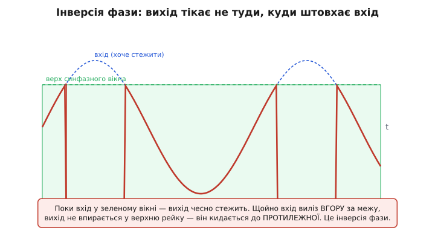
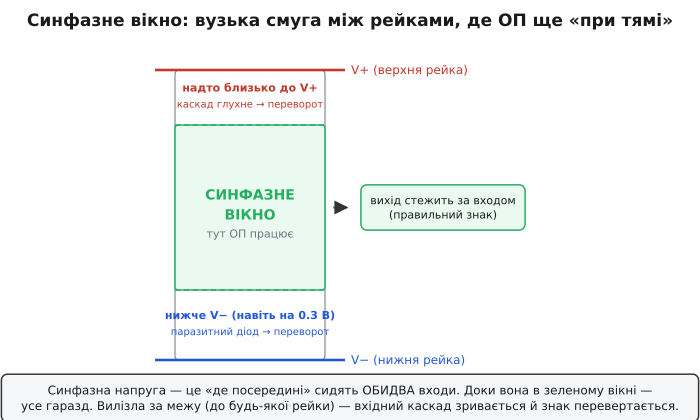
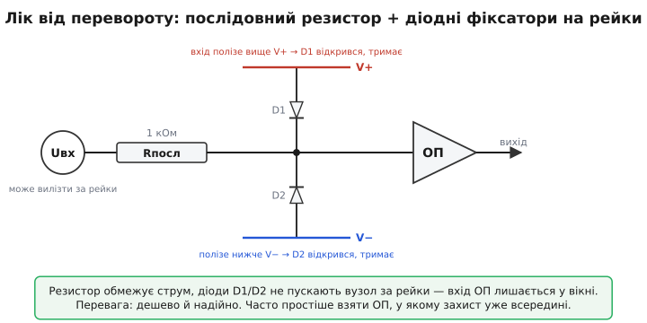

# Інверсія фази в ОП (phase inversion)

Уявіть повторювач напруги: вихід операційного підсилювача має слухняно йти за входом, точка в точку. Ви повільно піднімаєте вхідну напругу — вихід піднімається разом із нею. Ще вище — ще вище. І раптом, коли вхід підбирається надто близько до живлення, вихід не впирається у верхню межу й не зупиняється там, як ви очікували. Він **зривається вниз** — кидається до протилежної рейки. Сигнал на виході пішов **проти** входу: штовхаєте вгору — а воно тікає донизу.

Це і є **інверсія фази** *(англ. phase inversion, також phase reversal — «перевертання фази»)*: коли вхідна напруга виходить за дозволену межу, вихідний каскад показує сигнал **з перевернутим знаком**. Назва трохи лукава — фаза тут не «зсувається» плавно, як у фільтрі; вихід просто стрибком летить не туди. Але корінь явища дуже конкретний, і коли його зрозумієш, дивне перетворюється на очевидне.


*Що бачить розробник. Доки вхід (пунктир) у зеленому вікні дозволених напруг — вихід (червоний) чесно стежить за ним. Щойно вхід виліз угору за межу, вихід не зупиняється на верхній рейці — він кидається до НИЖНЬОЇ. Сигнал на виході пішов проти входу.*

## Звідки взялося «вікно»

Щоб зрозуміти переворот, спершу треба прийняти просту річ: входи ОП працюють **не на будь-якій напрузі**, а лише в певній смузі — між живленнями, та ще й із запасом від них. Цю смугу звуть **діапазоном синфазної напруги** *(common-mode input voltage range)*. «Синфазна» напруга — це те, **де приблизно посередині сидять обидва входи разом** (їхнє спільне положення відносно землі), на відміну від **різниці** між ними, яку ОП власне й підсилює.

Чому смуга, а не «вся напруга від рейки до рейки»? Бо вхідний каскад ОП — це не магія, а конкретні транзистори, увімкнені в конкретну схему. Кожному з них треба, щоб на ньому **лишалося падіння напруги** для нормальної роботи: транзистор має бути «у своєму режимі», де він керує струмом. Підтягнеш вхід надто близько до однієї з рейок — і транзисторам уже **нема де розміститися**: падіння, потрібного їм для роботи, просто не лишається. Каскад зривається з робочого режиму.

> 🔧 **Навіщо це.** Синфазне вікно — перше, що дивляться в довіднику ОП, коли вхід може гуляти близько до живлення: однополярне живлення 0…5 В, сигнал від давача, що інколи сягає рейки, вхід АЦП. Якщо вікно ОП — скажімо, від 0 до V+−1.5 В, а сигнал підходить до 4.8 В при V+ = 5 В, ви вже за межею — і переворот чигає. Половина «незрозумілих глюків» аналогового тракту — це непомічене порушення синфазного вікна.


*Синфазне вікно. Доки спільне положення входів у зеленій смузі — ОП підсилює як належить, вихід стежить за входом. Підійшло до верхньої рейки чи опустилося нижче нижньої (інколи досить і 0.3 В за неї) — вхідний каскад зривається, і знак сигналу перевертається.*

Поки синфазна напруга в межах вікна — усе чудово: ОП підсилює різницю входів, [«віртуальне коротке»](root:hw-analog/virtual-short) тримається, вихід слухається. Вийшла за межу — і починається цікаве.

## Що ламається всередині (біполярний вхід)

Візьмімо найпоширеніший випадок — ОП із біполярними входами (як-от LM324, придатний саме для однополярного живлення). Його вхід — це [диференційна пара](root:hw-analog/opamp-input-stage): два транзистори, що ділять спільний струм; різниця їхніх керувань стає вихідним сигналом. У нормі сигнал з бази транзистора з'являється на колекторі **перевернутим** — це звичайна робота підсилювального каскаду, і саме на цьому перевертанні побудована вся логіка зворотного зв'язку ОП.

А тепер опустімо вхід **нижче нижньої рейки**. Для LM324 досить усього на 0.3 В нижче V−, і починаються неприємності. База вхідного транзистора опиняється нижче його колектора настільки, що **колектор-базовий перехід відкривається** — у нормі він закритий (зворотно зміщений), а тут стає прямозміщеним, мов звичайний діод. Транзистор входить у **насичення**.

І ось ключ: у насиченому транзисторі колектор-базовий перехід відкритий, тож напруга з бази проходить на колектор уже **не перевернутою**, а прямою. Той самий каскад, що мав давати інверсію, раптом перестає інвертувати. Знак сигналу всередині тракту **перекидається** — а зворотний зв'язок, що був від'ємним, миттю стає **додатним**. Додатний зв'язок не вгамовує помилку, а **роздуває** її: вихід зривається й летить до рейки, що відповідає новому, перевернутому знаку.

Причинний ланцюг короткий і невблаганний: вхід вийшов за рейку → колектор-базовий перехід відкрився → каскад перестав інвертувати → від'ємний зв'язок став додатним → вихід кинувся до протилежної межі. Жодної магії — лише транзистор, який вигнали з його режиму.

## Той самий розлад на польових входах

ОП із [польовими](root:hw-components/jfet) входами (JFET, як у TL07x) хворіють на те саме, тільки причина зветься інакше. У польовому транзисторі між заслінкою (gate) і каналом є **паразитний перехід** — фактично вбудований діод. Поки заслінка тримається в межах вікна, він закритий і нікому не заважає. Та коли напруга на заслінці перевищує напругу каналу (стоку) на діодний поріг, цей перехід **відкривається** — і знову струм тече туди, куди не має, вхідний каскад зривається, знак перевертається. Картина для зовнішнього спостерігача та сама: вихід кинувся до протилежної рейки.

Цікава деталь у тому, **хто хворіє, а хто ні**. Біполярні й польові (JFET) входи схильні до перевороту найбільше — у них є ті самі паразитні переходи, що відкриваються за межею. А ось **CMOS-входи** (на МОН-транзисторах) найстійкіші: у них заслінка ізольована тонким оксидом, прямого переходу заслінка-канал нема, тож і відкриватися нічому. Тому в багатьох сучасних rail-to-rail ОП на CMOS перевороту просто немає за конструкцією — і це часто вирішальна причина обрати саме такий.

> 🔧 **Навіщо це.** Коли ви бачите в довіднику гордий рядок «no phase reversal» або «phase-reversal protected» — це не маркетинг, а конкретна обіцянка: вхід можна на коротку мить завести за рейку, і вихід не перекинеться, лише впреться в межу. Для входів, куди приходить сигнал ззовні плати (давач на довгому дроті, кнопка, вхід підсилювача), ця обіцянка економить діодний захист і безсонні ночі.

## Це не «вигорання», але пастка гірша

Найважливіше для практики: переворот фази **не псує** мікросхему. Це не пробій, не вигорання. Поверни вхід назад у вікно — і ОП **сам отямиться**, вихід повернеться до нормальної роботи. Довідник LM324 так і пише: щойно вхід знову стане вищим за −0.3 В, нормальний стан **відновиться сам**. Доказовий статус тут усталений: явище описане в довідниках виробників (Analog Devices, Texas Instruments, onsemi) десятиліттями й відтворюване на лабораторному столі.

То в чому ж пастка, якщо нічого не горить? У тому, що в реальній схемі переворот часто **сам себе тримає** (англ. latch — «защіпка»). Уявіть повторювач: вихід з'єднаний назад зі входом. Вхід вискочив за рейку → вихід перекинувся й помчав до протилежної межі → але ж він тягне за собою **той самий вхід** (зв'язок!) → і тримає його за межею. Защіпка замкнулась: вихід застряг у рейці й **не відпускає**, навіть коли причина зникла. Вийти з неї можна лише зовнішнім втручанням — прибрати напругу, смикнути вхід у вікно силою.

Для прошивки це означає підступну річ: датчик, чий сигнал на мить торкнувся рейки (стрибок живлення, наведення на довгому дроті, перехідний процес під час увімкнення), може **залатати** аналоговий тракт у перевернутому стані — і АЦП відтоді читатиме стабільне сміття, доки ви не перезапустите вузол. Жодного «вигорілого» компонента, плата ціла, а покази брешуть.

**Перевірка: чи виліз сигнал за синфазне вікно**

Перш ніж довіряти показу АЦП, варто чесно порахувати, чи лишається вхідний сигнал у вікні ОП за найгірших умов. Хай ОП живиться 0…5 В, його синфазне вікно — від 0 до V+−1.5 = 3.5 В, а попереду стоїть повторювач-буфер на вході АЦП.

:::tabs
```cpp
// Чи безпечний синфазний рівень для ОП на одному живленні 0..5 В?
// Вікно з довідника: [v_cm_min .. v_cm_max]. Сигнал може мати викид.
#include <stdbool.h>

static const float V_CM_MIN = 0.0f;     // нижня межа синфазного вікна, В
static const float V_CM_MAX = 3.5f;     // верхня межа: V+ − 1.5 В
static const float MARGIN   = 0.20f;    // запас на дрейф/температуру, В

bool cm_level_safe(float v_signal_peak) {
    float lo = V_CM_MIN + MARGIN;       // 0.20 В
    float hi = V_CM_MAX - MARGIN;       // 3.30 В
    return (v_signal_peak >= lo) && (v_signal_peak <= hi);
}

// приклад: давач інколи викидає до 3.8 В
//   cm_level_safe(3.8f) → 3.8 > 3.30 → false → переворот можливий!
```
```python
# Чи безпечний синфазний рівень для ОП на одному живленні 0..5 В?
# Вікно з довідника: [v_cm_min .. v_cm_max]. Сигнал може мати викид.

V_CM_MIN = 0.0    # нижня межа синфазного вікна, В
V_CM_MAX = 3.5    # верхня межа: V+ − 1.5 В
MARGIN   = 0.20   # запас на дрейф/температуру, В

def cm_level_safe(v_signal_peak: float) -> bool:
    lo = V_CM_MIN + MARGIN    # 0.20 В
    hi = V_CM_MAX - MARGIN    # 3.30 В
    return lo <= v_signal_peak <= hi

# приклад: давач інколи викидає до 3.8 В
#   cm_level_safe(3.8) → 3.8 > 3.30 → False → переворот можливий!
```
```go
// Чи безпечний синфазний рівень для ОП на одному живленні 0..5 В?
// Вікно з довідника: [v_cm_min .. v_cm_max]. Сигнал може мати викид.
package sensor

const (
	vCmMin = 0.0  // нижня межа синфазного вікна, В
	vCmMax = 3.5  // верхня межа: V+ − 1.5 В
	margin = 0.20 // запас на дрейф/температуру, В
)

func cmLevelSafe(vSignalPeak float64) bool {
	lo := vCmMin + margin // 0.20 В
	hi := vCmMax - margin // 3.30 В
	return vSignalPeak >= lo && vSignalPeak <= hi
}

// приклад: давач інколи викидає до 3.8 В
//   cmLevelSafe(3.8) → 3.8 > 3.30 → false → переворот можливий!
```
:::

Висновок прямий: 3.8 В уже вище за робочу межу 3.3 В — сигнал залазить у небезпечну зону, і саме на цих викидах тракт може перекинутись. Лік — або тримати сигнал нижче (дільником, іншим розмахом), або взяти ОП із ширшим вікном чи захищений від перевороту, або поставити фіксатори на вході.

## Як це лікують

Перший шлях — **не пускати вхід за рейку**. Класична схема: **послідовний резистор** на вході плюс пара **діодів-фіксаторів** (clamp diodes) на рейки живлення. Поки вхід у межах — діоди закриті, ніхто нікому не заважає. Щойно вхід полізе вище V+ — верхній діод відкривається й скидає надлишок у рейку; полізе нижче V− — відкривається нижній. Резистор обмежує струм через діод, щоб нічого не перегрілося. Вхід ОП фізично не може опинитися більш ніж на діодний поріг за рейкою — а отже, до перевороту не доходить.


*Лік на вході. Резистор обмежує струм, два діоди не дають вузлу піти за рейки — вхід ОП лишається у вікні навіть коли джерело викидає більше. Цей вузол — окремий випадок [захисту аналогового входу](root:hw-analog/input-protection-analog), де ту саму ідею застосовують і проти перенапруги, і проти статики.*

Другий шлях — простіший і часто кращий: **узяти ОП, у якому захисту й не треба**. Сучасні CMOS rail-to-rail підсилювачі здебільшого взагалі не перевертаються, а багато біполярних і JFET-ОП мають вбудований захист від перевороту прямо в кристалі (виробники так і позначають). Якщо вхід відкритий світу, обрати від початку «phase-reversal protected» ОП дешевше, ніж обвішувати плату діодами.

Третій, програмний шлях — **помітити защіпку й вибити її**. Якщо аналоговий вузол може залатати, прошивка має це розпізнати (показ застряг у крайньому коді АЦП довше, ніж дозволяє фізика сигналу) і **струсонути** тракт: коротко зняти й подати живлення вузла, перемкнути мультиплексор на безпечне джерело й назад, або просто підняти тривогу. Це не заміна апаратному захисту, а страхувальна сітка.

**Сторож защіпки в прошивці**

:::tabs
```cpp
// Виявити «застряглий» вихід ОП (ознака перевороту/защіпки) і скинути вузол.
// Якщо АЦП довго стоїть у крайньому коді — фізичний сигнал так не поводиться.
#include <stdint.h>
#include <stdbool.h>

#define ADC_MAX        4095u     // 12-бітний АЦП
#define RAIL_GUARD     20u       // «крайня» зона: ≤20 або ≥4075
#define STUCK_LIMIT    50u       // стільки поспіль вибірок у рейці = підозра

static uint16_t stuck_count = 0;

void power_cycle_analog(void);   // зняти/подати живлення аналогового вузла

bool opamp_latched(uint16_t adc) {
    bool at_rail = (adc <= RAIL_GUARD) || (adc >= ADC_MAX - RAIL_GUARD);
    stuck_count = at_rail ? (stuck_count + 1) : 0;

    if (stuck_count >= STUCK_LIMIT) {
        power_cycle_analog();    // струсонути тракт — вибити защіпку
        stuck_count = 0;
        return true;             // повідомити верхньому рівню: був збій
    }
    return false;
}
```
```python
# Виявити «застряглий» вихід ОП (ознака перевороту/защіпки) і скинути вузол.
# Якщо АЦП довго стоїть у крайньому коді — фізичний сигнал так не поводиться.

ADC_MAX     = 4095   # 12-бітний АЦП
RAIL_GUARD  = 20     # «крайня» зона: ≤20 або ≥4075
STUCK_LIMIT = 50     # стільки поспіль вибірок у рейці = підозра

_stuck_count = 0

def power_cycle_analog() -> None:   # зняти/подати живлення аналогового вузла
    ...

def opamp_latched(adc: int) -> bool:
    global _stuck_count
    at_rail = adc <= RAIL_GUARD or adc >= ADC_MAX - RAIL_GUARD
    _stuck_count = _stuck_count + 1 if at_rail else 0

    if _stuck_count >= STUCK_LIMIT:
        power_cycle_analog()        # струсонути тракт — вибити защіпку
        _stuck_count = 0
        return True                 # повідомити верхньому рівню: був збій
    return False
```
```go
// Виявити «застряглий» вихід ОП (ознака перевороту/защіпки) і скинути вузол.
// Якщо АЦП довго стоїть у крайньому коді — фізичний сигнал так не поводиться.
package analog

const (
	adcMax     = 4095 // 12-бітний АЦП
	railGuard  = 20   // «крайня» зона: ≤20 або ≥4075
	stuckLimit = 50   // стільки поспіль вибірок у рейці = підозра
)

var stuckCount uint16

func powerCycleAnalog() // зняти/подати живлення аналогового вузла

func opampLatched(adc uint16) bool {
	atRail := adc <= railGuard || adc >= adcMax-railGuard
	if atRail {
		stuckCount++
	} else {
		stuckCount = 0
	}

	if stuckCount >= stuckLimit {
		powerCycleAnalog() // струсонути тракт — вибити защіпку
		stuckCount = 0
		return true        // повідомити верхньому рівню: був збій
	}
	return false
}
```
:::

Логіка проста: реальний аналоговий сигнал не «прилипає» до крайнього коду АЦП на десятки вибірок поспіль — він гуляє. Якщо ж прилип, найімовірніша причина — тракт перекинувся й тримає сам себе; короткий перезапуск живлення вузла розмикає защіпку, і вимірювання оживає.

> 🔧 **Навіщо це.** На відповідальному пристрої (медичний давач, керування двигуном, безпековий вхід) залатаний у сміття аналоговий канал, який мовчки бреше, — гірший за чесний збій. Сторож із кількох рядків перетворює невидиму ваду на помітну подію: тракт сам оживає, а система знає, що було порушення, і може його залогувати.

## Коротко про головне

Інверсія фази — не таємнича вада, а пряма розплата за вихід **за межі синфазного вікна** ОП. Вхід підбирається надто близько до рейки → вхідний транзистор (біполярний чи польовий) зривається з режиму через паразитний перехід, що відкрився → каскад перестає інвертувати → від'ємний зворотний зв'язок обертається на додатний → вихід кидається до **протилежної** рейки замість того, щоб упертися в найближчу. Мікросхема при цьому ціла й сама отямиться, щойно вхід повернеться у вікно; небезпека — у самопідтримній защіпці, що тримає тракт у брехливому стані, поки його не струсонути. Лік відомий і недорогий: тримати вхід у вікні (резистор + діоди), обрати ОП без цієї вади (CMOS rail-to-rail чи захищений), а в прошивці — мати сторожа, що розпізнає застряглий канал і оживить його.
