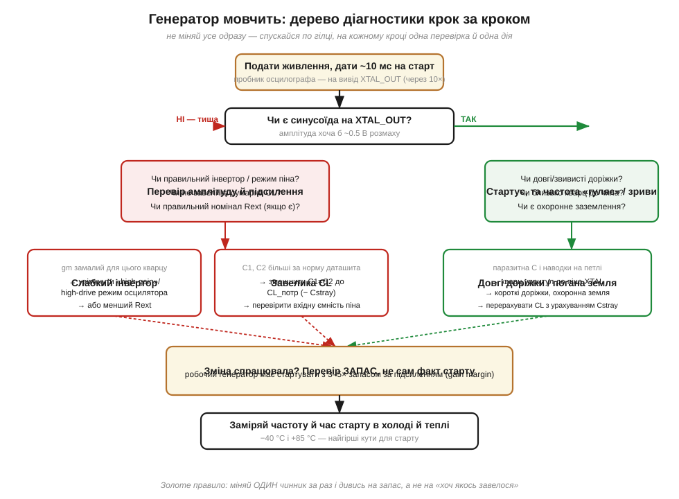
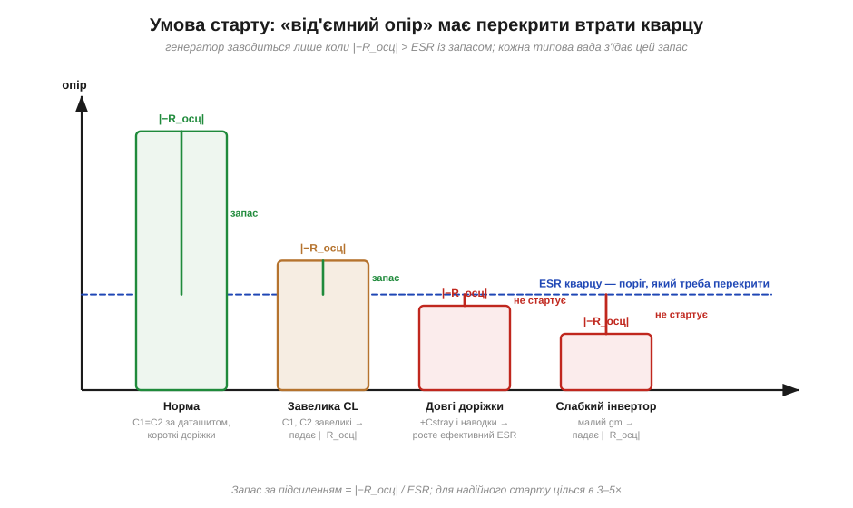

# ⚙️ Чому генератор не стартує: діагностика крок за кроком

> [Генератор П'єрса](topic:hw-analog/pierce-oscillator) (*Pierce oscillator*) зібрано з трьох частин: кварц, інвертор-підсилювач і два конденсатори C1, C2, що задають навантажувальну ємність (*load capacitance*, CL). На папері він заводиться завжди. На живій платі — раз у раз мовчить або стартує мляво й «гуляє» частотою. Тут — **як саме** шукати причину, не міняючи все наосліп.

### Задача

Генератор не подає синусоїди (або вона є, але кволенька й нестабільна). Питання не «що замінити», а «чому петля не самозбуджується». Підступ у тому, що видимих причин три, вони дають схожий симптом, а лікуються по-різному: **завелика CL** (надмірні C1, C2), **довгі доріжки** до кварцу (паразитна ємність і наводки) і **слабкий інвертор** (замале підсилення для саме цього кварцу). Тицяти в них навмання — означає випадково «полагодити» одне, зламавши інше.

### Ідея: одна умова старту, три способи її порушити

Усе зводиться до одного. Інвертор з обв'язкою поводиться для кварцу як **від'ємний опір** (*negative resistance*, −R_осц) — джерело, що накачує енергію. Кварц має власні втрати — еквівалентний послідовний опір (*equivalent series resistance*, ESR) із [моделі Баттерворта–ван Дайка](topic:hw-components/quartz-rlc-model). Коливання наростають лише тоді, коли накачка перекриває втрати з **запасом**:

```
|−R_осц|  >  ESR × (запас 3…5)     # умова надійного старту
```

Тепер три причини читаються як три способи зменшити ліву частину або роздути праву:

- **завелика CL** → C1, C2 сильніше навантажують інвертор, |−R_осц| падає;
- **довгі доріжки** → додають паразитну ємність Cstray і вносять наводки, ефективний ESR росте;
- **слабкий інвертор** → мала крутизна gm, від'ємного опору бракує від народження.


*Спускаємося по одній гілці: «тиша» веде до підсилення й CL, «стартує, та гуляє» — до доріжок і землі. Гілки збігаються в одному висновку: перевіряти запас, а не сам факт старту.*

### Перша відповідь — від самого чипа

Перш ніж братися за осцилограф, згадаймо, що чип уже сам знає, чи ожила петля. Апаратура генератора піднімає прапор «стабільно» лише тоді, коли коливання розгойдались і встоялись. Отже, найдешевша діагностика — прочитати цей прапор на старті, і зробити це **з таймаутом**: мовчазний кварц не сміє підвісити ядро назавжди. Якщо прапор так і не піднявся — це гілка «тиша», і далі йдемо на стіл; якщо піднявся, а потім зник під час роботи — це гілка «завівся, та зірвався», яку ловить окремий сторож (*Clock Security System*, CSS).

```c
#include <stdint.h>

/* Регістри беруться з CMSIS-заголовка виробника; тут суть показано
   на STM32-подібному RCC із зовнішнім генератором HSE.               */
#define RCC_CR         (*(volatile uint32_t *)0x40021000u)
#define RCC_CIR        (*(volatile uint32_t *)0x40021008u)
#define RCC_CR_HSEON   (1u << 16)   /* подати накачку на інвертор генератора */
#define RCC_CR_HSERDY  (1u << 17)   /* залізо підняло: «петля стабільна»     */
#define RCC_CR_CSSON   (1u << 19)   /* Clock Security System: стереже зрив   */
#define RCC_CIR_CSSF   (1u << 7)    /* прапор: CSS зловив зрив генератора    */
#define RCC_CIR_CSSC   (1u << 23)   /* запис 1 знімає прапор CSSF            */

/* Скільки разів опитати прапор, перш ніж визнати тишу. Рахувати під
   найгірший кут: висока Q плюс мороз -40 °C дають найдовший розгін.    */
#define HSE_START_TIMEOUT  20000u

typedef enum { OSC_OK, OSC_NO_START } osc_status_t;

/* Самоперевірка на старті: «чи ожила петля?» — машинною відповіддю. */
osc_status_t hse_start(void)
{
    RCC_CR |= RCC_CR_HSEON;                     /* увімкнути генератор */

    /* Чекаємо, поки апаратура САМА підніме прапор стабільності. Лічильник
       обов'язковий: без нього мовчазний кварц підвісив би чип назавжди. */
    uint32_t guard = HSE_START_TIMEOUT;
    while ((RCC_CR & RCC_CR_HSERDY) == 0u) {
        if (guard-- == 0u) {
            RCC_CR &= ~RCC_CR_HSEON;            /* прибрати накачку        */
            return OSC_NO_START;                /* тиша → бенч-діагностика */
        }
    }

    RCC_CR |= RCC_CR_CSSON;   /* завівся: тепер стережемо зрив під час роботи */
    return OSC_OK;
}

void clock_init(void)
{
    if (hse_start() == OSC_OK) {
        clock_switch_to_hse();   /* лише ТЕПЕР чіпляємо ядро, UART, таймери */
    } else {
        flag_oscillator_fault(); /* лишаємось на внутрішньому RC, не зависаємо */
    }
}

/* CSS б'є сюди, коли РОБОЧИЙ генератор раптом замовк (відпаяний кварц,
   тріщина, наводка). Апаратура вже перекинула такт на внутрішній RC.   */
void NMI_Handler(void)
{
    if (RCC_CIR & RCC_CIR_CSSF) {
        RCC_CIR |= RCC_CIR_CSSC;   /* зняти прапор */
        clock_loss_recover();      /* аварійний режим / контрольований рестарт */
    }
}
```

Три речі тут не випадкові. **Таймаут** перетворює «зависання» на діагноз: замість вічного очікування прошивка за скінченний час каже «тиша» й лишається на внутрішньому RC-генераторі — система жива, хай і з гіршою точністю такту. **CSS** ловить найпідступніший випадок — коли кварц завівся на старті, а зірвався пізніше (від холоду, просідання живлення чи тріщини): без нього чип просто «замерз» би на мертвому такті. І **порядок** у `clock_init` прямий: ядро й периферію перемикаємо на цей такт лише *після* прапора — рушати залежні від такту дільники, доки генератор ще пливе, не можна.

### Далі — на столі

Коли прошивка каже «тиша» (або ви бачите, що частота гуляє), настає ручна частина. Дивимося на вхід інвертора XTAL_IN осцилографом — обов'язково через пробник 10×: власні 10…15 пФ пробника 1× самі гасять кволий вузол, і ви побачите «тишу» там, де все майже працює. Далі йдемо потрібною гілкою дерева.

Якщо синусоїди **немає** — послаблюємо навантаження й додаємо підсилення. Насамперед звужуємо CL, перерахувавши номінали під реальну паразитну ємність плати:

```
CL = C1·C2/(C1+C2) + Cstray        # що інвертор реально «бачить»
C1 = C2 = 2·(CL_потр − Cstray)     # звідси номінали під потрібну CL
```

Часто це вже й рятує. Якщо тиша лишається — вмикаємо в регістрах МК режим high-drive (більша крутизна інвертора) і прибираємо зайвий зовнішній Rext, якщо він стоїть. Якщо ж синусоїда **є**, та частота «гуляє» чи зривається — причина в розведенні: кварц ставимо впритул до піна, доріжки короткі, довкола — охоронна земляна заливка; і перераховуємо CL з урахуванням справжнього Cstray плати. Головне правило всієї цієї роботи — міняти **один чинник за раз**, інакше не зрозумієш, що саме допомогло.

### Скільки саме запасу — підстановочний тест

Сам факт старту нічого не гарантує: генератор може завестися з нікчемним запасом і зірватися на морозі. Тому запас **вимірюють**, а не сподіваються на нього. Зручний спосіб — **підстановочний** (*drive-level / negative-resistance test*): послідовно з кварцом тимчасово вмикають резистор Rt і нарощують його, доки генерація не зривається. Те граничне Rt додається до ESR — і відношення (ESR + Rt)/ESR показує наявний запас. Повторюють це в холоді (−40 °C) і теплі (+85 °C) — саме там найгірші кути старту.


*Стовпчик — наявний |−R_осц|, пунктир — поріг ESR. «Норма» має товстий зелений запас; завелика CL і слабкий інвертор підрізають стовпчик, довгі доріжки піднімають поріг — і генерація зривається.*

### Складність і пастки на МК

Самого алгоритму мало: на живій платі є кілька місць, де легко обманути себе або «полагодити» одне, зламавши інше. Ось ті граблі, на які наступають найчастіше.

- **Не діагностуйте 1×-пробником.** Його 10…15 пФ додаються до вузла й самі гасять кволий генератор — побачите «тишу» там, де насправді все майже працює. Тільки 10× або активний пробник.
- **CL — це не C1.** Інвертор «бачить» C1 і C2 **послідовно**, плюс паразитна ємність піна й доріжок: CL ≈ C1·C2/(C1+C2) + Cstray. Тому формула вище ставить C1 = C2 = 2·(CL_потр − Cstray): забути Cstray (типово кілька пФ) — і частота сяде з [помилкою в десятки ppm](topic:hw-components/frequency-accuracy-ppm).
- **«Завелося» ≠ «працює».** Генератор може стартувати з нікчемним запасом — і зриватися на морозі, при просіданні живлення чи з часом, коли ESR кварцу підросте від старіння. Запас перевіряють, а не сподіваються на нього.
- **Слабкий інвертор лікують режимом, а не «більшим C».** Спокуса додати ємності, щоб «розгойдати», робить рівно навпаки — топить |−R_осц|. Якщо gm замалий, вмикають high-drive режим генератора в регістрах МК або беруть кварц із меншим ESR.
- **Старт іще пливе.** На самому старті частота й амплітуда ще «пливуть»; програмному коду не варто чіпати залежні від такту дільники (UART, таймери), доки прапор стабільності генератора (HSERDY) не підніметься — саме тому в `clock_init` перемикання йде після успішного `hse_start()`.

> 🔧 **Навіщо це.** Кварцовий генератор — [серцебиття всієї системи](topic:hw-analog/reference-frequency): не завівся він — не завелося нічого, причому збій «плаваючий» і ловиться найгірше. Тримайте в голові одну умову — |−R_осц| мусить перекрити ESR із запасом 3–5× — і три способи її зламати: завелика CL, довгі доріжки, кволий інвертор. Тоді замість того, щоб навмання перепаювати конденсатори, ви за кілька хвилин звузите коло до однієї причини й полагодите її свідомо.
