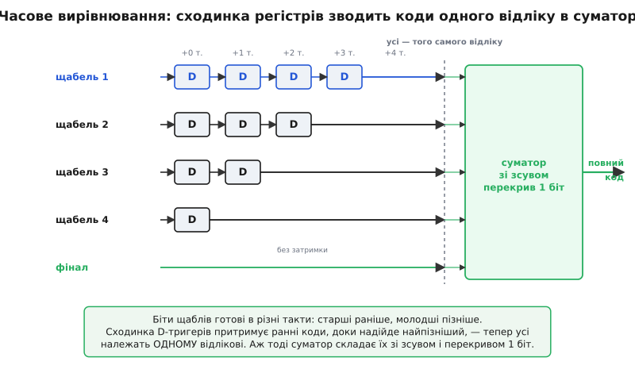

# ⚙️ Конвеєр на C: збирання коду з перекривних щаблів

Аналогова частина конвеєрного АЦП свою роботу зробила: кожен щабель грубо зміряв те, що до нього дійшло, і виплюнув кілька сирих біт. Лишилося зібрати з цих клаптиків один чесний код. Здавалося б, дрібниця — склади докупи й усе. Та якраз тут ховаються дві пастки, через які наївне «склади» дає код, що не має нічого спільного з входом. По-перше, біти різних щаблів **готові в різні миті** — старші раніше, молодші пізніше, — і якщо скласти те, що лежить на виходах щаблів «просто зараз», складеш шматки **різних відліків**. По-друге, щаблі навмисно працюють **із перекриттям**: сусідні дають частково той самий розряд, тож зсув компаратора можна виправити, — але щоб це виправлення спрацювало, складати треба **зі зсувом і переносом**, а не встик. Цей клаптик прошивки — цифровий бек-енд конвеєра — і є те місце, де перекрив із вадою перетворюється на перевагу.

Тут ми напишемо цей бек-енд на C: як **зберігати** сирі коди щаблів, як **вирівняти** їх у часі сходинкою регістрів-затримок, щоб усі належали одному відлікові, і як **скласти зі зсувом**, аби перекривні розряди злилися в правильне число, а похибка грубих компараторів згасла сама. Код — робочий, з покроковою самоперевіркою на еталонній моделі; його можна взяти за золотий зразок хоч під прошивку ПЛІС-обгортки навколо швидкої мікросхеми-АЦП, хоч під модель, на якій відлагоджують саму мікросхему.

> 🔧 **Навіщо це.** Сам конвеєр найчастіше живе всередині спеціалізованої мікросхеми, і цифрове збирання там роблять зашиті вентилі. Але той самий алгоритм інженер пише власноруч щоразу, коли: будує **модель** перетворювача, щоб перевірити аналогову частину до кремнію; загортає «сирий» швидкий АЦП у **ПЛІС**, що сама вирівнює й складає щаблі; або розбирається, **чому** готовий чип видає дивні коди на краях діапазону — а причина майже завжди в неправильному вирівнюванні чи зсуві складання. Зрозумівши цих сорок рядків, бачиш конвеєр не як чорну скриньку, а як зрозумілий конвеєр даних.

## Задача: три сирі клаптики, один чесний код

Візьмімо конкретний конвеєр, той самий, що в основній статті: **шість однакових щаблів «1.5 біта»**, а в хвості — маленький **дворозрядний паралельний (flash) добірник** молодших біт. Кожен щабель «1.5 біта» має два пороги (на −Vref/4 і +Vref/4), розрізняє **три стани** й видає їх **двома бітами** — цифру D ∈ {0, 1, 2}. Дворозрядний хвіст додає ще два молодші біти. Разом: 6 щаблів по «півтора чесних біти» плюс два молодші дають **вісім розрядів** повного коду.

> Чому шість щаблів «1.5 біта» плюс 2-бітний хвіст дають саме 8 розрядів, а не 6·2 = 12: щаблі **перекриваються на один розряд**, тож два біти щабля коштують лише **один** новий розряд коду — надлишковий біт іде на виправлення похибки, а не на роздільність. Розкладку ваг і арифметику перекриття виведено на числах у сусідній вставці: [як надлишковість і цифрове додавання скасовують зсув компаратора](topic:hw-analog/pipeline-adc/math-redundancy.md) — там показано, чому щабель дає рівно три стани й як діапазони сусідніх щаблів налягають один на одного.

Тепер придивімося, **звідки беруться клаптики**, бо саме це диктує будову бек-енду. Уявімо, що в конвеєр щойно зайшов один відлік. На **першому** такті його бачить лише щабель 1 — він зрізає свою цифру, а недомір (залишок) передає далі. На **другому** такті цей залишок домірює щабель 2 — але щабель 1 у цю мить уже зайнятий **наступним** відліком. На третьому такті перший відлік дійшов до щабля 3, тоді як щаблі 1 і 2 порають ще пізніші відліки. Виходить, що в будь-яку мить на виходах щаблів висять цифри, які належать **різним** відлікам: щабель 1 щойно зміряв найновіший, щабель 6 — найстаріший, той, що зайшов п'ять тактів тому.

Ось перша й головна пастка, і сформулюймо її чітко, бо на ній ламаються перші реалізації. Якщо о цій миті просто зчитати всі шість виходів і скласти — складеш старший біт відліку №100, наступний біт відліку №99, ще наступний відліку №98… і так далі. Вийде мішанина шести сусідніх відліків, каша без сенсу. **Щоб код був чесний, треба зібрати цифри, що належать одному й тому самому відлікові** — а вони на виходах щаблів рознесені в часі на кілька тактів.


*Сирі 2-бітні коди щаблів народжуються в різні такти: щабель 1 віддає старший біт найновішого відліку, щабель 6 — найстаршого. Сходинка D-тригерів притримує ранні коди рівно на стільки тактів, щоб усі шість цифр, які зустрічаються на спільному краю, належали одному відлікові. Аж тоді суматор складає їх зі зсувом і перекривом в один розряд.*

## Ідея: спершу вирівняти в часі, тоді скласти зі зсувом

Обидві пастки лікуються двома окремими вузлами, і плутати їх не можна.

**Вузол перший — часове вирівнювання.** Раз щабель 1 бачить відлік на п'ять тактів раніше, ніж щабель 6, треба **притримати** ранні цифри, доки надійдуть пізні. Роблять це сходинкою **зсувних регістрів** — ланцюжків із D-тригерів, що просто пересувають число на один такт за кожен тригер. Цифру щабля 1 затримуємо на 5 тактів, щабля 2 — на 4, щабля 3 — на 3, і так до щабля 6, який не затримуємо зовсім. Після цієї сходинки всі шість цифр, що виходять «на спільний край», належать **одному** відлікові — тому, що зайшов п'ять тактів тому. Це і є та стала затримка (англ. *latency*), яку конвеєр платить за свою швидкість: код відліку готовий не одразу, а через стільки тактів, скільки щаблів.

> Затримка тут — не вада реалізації, а неминучий бік конвеєрної природи: доки відлік не проповз крізь усі щаблі, його молодших біт фізично ще нема, і скласти повний код нíчим. Чому пропускність від цього не страждає (коди все одно виходять щотакту) і де саме затримка кусає — у зворотному зв'язку — розібрано в основній статті: [конвеєрний АЦП](topic:hw-analog/pipeline-adc).

**Вузол другий — складання зі зсувом.** Тепер, коли шість цифр належать одному відлікові, їх треба звести в число. І тут не можна просто зшити біти встик, бо щаблі **перекриваються**: молодший біт кожного щабля важить **стільки ж**, скільки старший біт наступного. Тому кожну дворозрядну цифру кладемо на її вагове місце й **додаємо**, дозволяючи перекривним розрядам налягати один на одного та переливатися **переносом**. Саме цей перенос і творить диво виправлення: коли грубий компаратор помилився й щабель віддав завелику чи замалу цифру, «зайвий» рахунок не пропадає — він переливається в перекривний розряд сусіда й гаситься. Код виходить правильний, дарма що окремі цифри — ні.

Порядок непорушний: **спершу вирівняти, тоді скласти**. Складати невирівняне — то зшивати клапті різних відліків; вирівнювати після складання нíчого. Двома реченнями весь бек-енд: *притримай ранні цифри регістрами, доки зберуться цифри одного відліку, — і склади їх зі зсувом на один розряд, дозволивши переносу згасити похибку компараторів.*

## Робочий C: зберігання, вирівнювання, складання

Складімо це в прошивку. Три речі, які код мусить робити, лягають у три виразні шматки: **кільцеві черги** (по одній на щабель) зберігають цифри в польоті й затримують кожну на потрібне число тактів; **функція складання** розкладає вирівняні цифри по вагах і додає з перекриттям; **тактова функція** щотакту заштовхує свіжі цифри й, коли конвеєр наповнився, віддає готовий код.

Спершу — параметри й проста арифметика одного щабля «1.5 біта». Числа тримаємо в цілих: напругу подаємо у форматі Q15 (ціле, де 32768 = повна шкала Vref), щоб код був точний і придатний до вбудованого середовища без плаваючої коми.

:::tabs
```cpp
#include <stdint.h>
#include <string.h>

#define NSTAGE 6                 // щаблів «1.5 біта»
#define NBITS  (NSTAGE + 2)      // повний код = 8 розрядів (6 щаблів + 2-бітний хвіст)
#define LAT    (NSTAGE - 1)      // затримка вирівнювання, тактів (найглибша черга)

// Один щабель «1.5 біта»: пороги ±Vref/4, три цифри D∈{0,1,2}.
// Повертає цифру, а через vres — залишок = 2·Vвх − (D−1)·Vref (той самий формат Q15).
static uint8_t stage_15bit(int32_t vin_q15, int32_t offset_q15, int32_t *vres_q15) {
    const int32_t VREF = 1 << 15;                 // 1.0 у Q15
    int32_t t_lo = -(VREF >> 2) + offset_q15;     // −Vref/4 (+ зсув компаратора)
    int32_t t_hi =  (VREF >> 2) + offset_q15;     // +Vref/4
    uint8_t d = (vin_q15 < t_lo) ? 0 : (vin_q15 < t_hi) ? 1 : 2;
    *vres_q15 = 2 * vin_q15 - (int32_t)(d - 1) * VREF;   // −Vref, 0 або +Vref, тоді ×2
    return d;
}
```
```python
NSTAGE = 6                 # щаблів «1.5 біта»
NBITS  = NSTAGE + 2        # повний код = 8 розрядів (6 щаблів + 2-бітний хвіст)
LAT    = NSTAGE - 1        # затримка вирівнювання, тактів (найглибша черга)

# Один щабель «1.5 біта»: пороги ±Vref/4, три цифри D∈{0,1,2}.
# Повертає (цифру, залишок), де залишок = 2·Vвх − (D−1)·Vref (той самий формат Q15).
def stage_15bit(vin_q15, offset_q15):
    VREF = 1 << 15                             # 1.0 у Q15
    t_lo = -(VREF >> 2) + offset_q15           # −Vref/4 (+ зсув компаратора)
    t_hi =  (VREF >> 2) + offset_q15           # +Vref/4
    d = 0 if vin_q15 < t_lo else 1 if vin_q15 < t_hi else 2
    vres_q15 = 2 * vin_q15 - (d - 1) * VREF     # −Vref, 0 або +Vref, тоді ×2
    return d, vres_q15
```
:::

Зверни увагу на формулу залишку `2·Vвх − (D−1)·Vref`. Множник «×2» — це те саме підсилення залишку на 2ᵏ (тут k = 1) з основної статті: зрізавши один розряд, щабель розтягує недомір назад на повну шкалу для наступного. А «−(D−1)» — це те, що робить внутрішній ЦАП: відновлює грубу оцінку {−Vref, 0, +Vref} і віднімає її. Саме через цю −1 у центрі (D = 1 віднімає нуль) цифри самі центруються, і при складанні **не треба жодної добавки-зсуву на середину шкали** — усе стуляється чисто.

Тепер серце бек-енду — сховище й вирівнювання. Кожному щаблю дамо власну **кільцеву чергу** довжиною NSTAGE: щотакту пишемо в неї свіжу цифру, а читаємо ту, що лежить на потрібну кількість тактів «углиб». Читання зі зсувом назад і є затримка на зсувному регістрі — тільки замість ланцюжка окремих тригерів ми обходимося одним масивом-кільцем і рухомим покажчиком.

:::tabs
```cpp
typedef struct {
    uint8_t line[NSTAGE][NSTAGE];  // кільце цифр у польоті: line[щабель][такт]
    uint8_t fin[NSTAGE];           // кільце для 2-бітного хвоста (flash)
    int     wr;                    // спільний покажчик запису (голова кільця)
    int     filled;                // скільки тактів уже заштовхнуто (для гейта затримки)
} backend_t;

static void be_init(backend_t *b) { memset(b, 0, sizeof(*b)); }
```
```python
class Backend:
    def __init__(self):
        # кільце цифр у польоті: line[щабель][такт]
        self.line   = [[0] * NSTAGE for _ in range(NSTAGE)]
        self.fin    = [0] * NSTAGE   # кільце для 2-бітного хвоста (flash)
        self.wr     = 0              # спільний покажчик запису (голова кільця)
        self.filled = 0              # скільки тактів уже заштовхнуто (для гейта затримки)
```
:::

І нарешті тактова функція. Вона робить три речі за такт: (1) кладе свіжі цифри всіх щаблів у голову їхніх черг; (2) якщо конвеєр уже наповнився, зчитує **кожен** щабель із його власною затримкою `LAT − s`, розкладає вирівняні цифри по вагах і додає з перекриттям; (3) посуває покажчик. Читання щабля s на глибину `LAT − s` — це і є та сходинка: щабель 0 (перший) читаємо на 5 тактів назад, щабель 5 (останній) — на 0.

:::tabs
```cpp
// Один такт бек-енду. Приймає свіжі сирі цифри raw[0..NSTAGE-1] і 2-бітний хвіст final2.
// Коли конвеєр наповнився — кладе у *out зібраний код відліку, що зайшов LAT тактів тому.
// Повертає 1, якщо код дійсний (конвеєр уже примінений), інакше 0 (ще наповнюється).
static int be_step(backend_t *b, const uint8_t raw[NSTAGE], uint8_t final2, uint16_t *out) {
    const int L = NSTAGE;                              // довжина кільця

    for (int s = 0; s < NSTAGE; ++s)                  // (1) записати свіжі цифри
        b->line[s][b->wr] = raw[s] & 0x3;             //     (лише 2 біти цифри)
    b->fin[b->wr] = final2 & 0x3;

    int valid = (b->filled >= LAT);                   // конвеєр наповнився?
    if (valid) {                                      // (2) вирівняти й скласти
        uint16_t code = 0;
        for (int s = 0; s < NSTAGE; ++s) {
            int delay = LAT - s;                      // щабель 0 → 5 тактів, … щабель 5 → 0
            int idx   = ((b->wr - delay) % L + L) % L;// зчитати з глибини кільця
            uint8_t d = b->line[s][idx];              // цифра цього щабля для ОДНОГО відліку
            code += (uint16_t)d << ((NBITS - 2) - s); // вага: 6,5,4,3,2,1 — зсув на 1 розряд/щабель
        }
        code += (uint16_t)b->fin[b->wr];              // хвіст-flash у два молодші розряди
        uint16_t max_code = (uint16_t)((1u << NBITS) - 1);
        if (code > max_code) code = max_code;         // страховка від переповнення на краю
        *out = code;
    }

    b->wr = (b->wr + 1) % L;                          // (3) посунути кільце
    if (b->filled <= LAT) b->filled++;
    return valid;
}
```
```python
# Один такт бек-енду. Приймає свіжі сирі цифри raw[0..NSTAGE-1] і 2-бітний хвіст final2.
# Коли конвеєр наповнився — повертає (True, зібраний код відліку, що зайшов LAT тактів тому).
# Інакше повертає (False, 0) — конвеєр ще наповнюється.
def be_step(b, raw, final2):
    L = NSTAGE                                     # довжина кільця

    for s in range(NSTAGE):                        # (1) записати свіжі цифри
        b.line[s][b.wr] = raw[s] & 0x3             #     (лише 2 біти цифри)
    b.fin[b.wr] = final2 & 0x3

    valid = (b.filled >= LAT)                       # конвеєр наповнився?
    code = 0
    if valid:                                       # (2) вирівняти й скласти
        for s in range(NSTAGE):
            delay = LAT - s                         # щабель 0 → 5 тактів, … щабель 5 → 0
            idx   = (b.wr - delay) % L              # зчитати з глибини кільця
            d = b.line[s][idx]                      # цифра цього щабля для ОДНОГО відліку
            code += d << ((NBITS - 2) - s)          # вага: 6,5,4,3,2,1 — зсув на 1 розряд/щабель
        code += b.fin[b.wr]                         # хвіст-flash у два молодші розряди
        max_code = (1 << NBITS) - 1
        if code > max_code:
            code = max_code                         # страховка від переповнення на краю

    b.wr = (b.wr + 1) % L                            # (3) посунути кільце
    if b.filled <= LAT:
        b.filled += 1
    return valid, code
```
:::

Уся суть — у двох рядках усередині циклу. `int delay = LAT - s` разом із читанням `b->wr - delay` — це **часове вирівнювання**: кожен щабель зчитуємо з такої глибини, щоб усі шість цифр належали одному відлікові. А `code += d << ((NBITS-2) - s)` — це **складання зі зсувом**: цифра щабля s важить `2^(6−s)`, тобто ваги сусідніх щаблів ідуть 2⁶, 2⁵, 2⁴, 2³, 2², 2¹ — крок в **один** розряд, тож дворозрядні цифри **налягають** одна на одну, і `+=` доводить перекрив переносом. Хвіст-flash важить 2⁰ і сідає в самий низ.

## Як це рахує: один відлік від входу до коду

Проженемо крізь бек-енд одне конкретне число й простежмо кожен розряд. Нехай на вхід прийшло Vвх = +5/16·Vref (у Q15 це 0.3125 · 32768 = 10240). Аналогова частина, щабель за щаблем, видасть такі цифри:

**Складання коду для Vвх = +5/16·Vref.** Шість щаблів «1.5 біта» плюс 2-бітний хвіст. Кожен щабель зрізає цифру D ∈ {0,1,2} і передає підсилений залишок далі:

```c
Vвх = +0.3125·Vref
  щабель 1: D=2   залишок → −0.3750·Vref
  щабель 2: D=0   залишок → +0.2500·Vref
  щабель 3: D=2   залишок → −0.5000·Vref
  щабель 4: D=0   залишок → +0.0000·Vref
  щабель 5: D=1   залишок → +0.0000·Vref
  щабель 6: D=1   залишок → +0.0000·Vref
  хвіст-flash: 2
```

Тепер складання зі зсувом — кожна цифра на своїй вазі, крок в один розряд:

```c
код = D1·2⁶ + D2·2⁵ + D3·2⁴ + D4·2³ + D5·2² + D6·2¹ + flash·2⁰
    =  2·64  +  0·32  +  2·16  +  0·8   +  1·4   +  1·2   +   2·1
    =  128   +   0    +  32    +   0    +   4    +   2    +   2
    =  168
```

Той самий рахунок у двійці, де добре видно **перекриття на один розряд** (кожна пара цифр зсунута на один стовпчик відносно попередньої):

```
        2⁷ 2⁶ 2⁵ 2⁴ 2³ 2² 2¹ 2⁰
щабель1  1  0                       D=2 = «10» на розрядах 2⁷·2⁶
щабель2     0  0                    D=0 = «00» на 2⁶·2⁵   ← 2⁶ спільний зі щаблем 1
щабель3        1  0                 D=2 = «10» на 2⁵·2⁴
щабель4           0  0              D=0 = «00» на 2⁴·2³
щабель5              0  1           D=1 = «01» на 2³·2²
щабель6                 0  1        D=1 = «01» на 2²·2¹
хвіст                      1  0     flash=2 = «10» на 2¹·2⁰
─────────────────────────────────
сума     1  0  1  0  1  0  0  0  =  168
```

Ідеальний код для +5/16·Vref на восьми розрядах — теж рівно **168**. Клаптики зійшлися. Зверни увагу на стовпчик 2⁶: у нього падає **молодший** біт щабля 1 і **старший** біт щабля 2 — це і є той спільний, перекривний розряд, через який складання йде з переносом, а не встик.

## Найкрасивіше: як складання гасить помилку компаратора

Досі компаратори були ідеальні. Тепер зробімо один із них поганим — і подивімося, як арифметика виправляє його помилку. Це та сама надлишковість, про яку каже основна стаття, тільки тепер видно **її механіку в коді**.

**Зсув компаратора, який щабель 1 не помітив, а бек-енд виправив.** Подамо на вхід Vвх = +0.26·Vref — трохи **вище** порога +Vref/4 = +0.25·Vref. Ідеальний щабель 1 упевнено скаже D = 2. Але дамо його верхньому компаратору зсув +0.05·Vref: поріг «поплив» до +0.30, і щабель 1 помилково вирішить, що вхід ще в середній зоні, — видасть D = 1 замість 2.

```c
Vвх = +0.26·Vref  (трохи вище порога +Vref/4)

// ідеальний компаратор:
  цифри = [2, 0, 1, 1, 1, 2]  хвіст=1  → код = 161

// щабель 1 зі зсувом +0.05·Vref (поріг поплив до +0.30):
  цифри = [1, 2, 1, 1, 1, 2]  хвіст=1  → код = 161
```

Цифри **різні** — перша пара «10» перетворилася на «01» у першому щаблі й «00» на «10» у другому, — а код **той самий, 161**. Чому? Бо щабель 1, віднявши **меншу** оцінку (D = 1 віднімає нуль замість +Vref), лишив **більший** залишок; цей більший залишок підсилився й дійшов до щабля 2, який чесно його домірив, видавши на одиницю більшу цифру (2 замість 0). Помилка першого щабля не зникла — вона **перетекла в залишок**, наступний щабель її **впіймав**, а складання зі зсувом, де молодший біт щабля 1 важить стільки ж, скільки старший біт щабля 2, звело обидві цифри в той самий розряд — і надлишок згас переносом. Компаратор помилився на цілу зону — код не здригнувся.

Ось чому конвеєр обходиться грубими, дешевими компараторами: їхні промахи виправляє не точніше залізо, а оці кілька рядків складання. Умову, за якої це працює завжди (зсув порога не більший за пів-зони, тобто ±Vref/4), і чому саме перекрив в один розряд рівно покриває цю зону, виведено на числах у сусідній вставці: [як надлишковість і цифрове додавання скасовують зсув компаратора](topic:hw-analog/pipeline-adc/math-redundancy.md).

## Потік: щотакту заходить відлік, щотакту виходить код

Дотепер ми дивилися на один відлік. Покажімо тепер бек-енд у роботі на **потоці** — саме так він живе в приладі. Щотакту в конвеєр заходить новий відлік, і щотакту (після наповнення) з бек-енду виходить готовий код — але зсунутий на LAT тактів назад: код, що виходить зараз, належить відлікові, який зайшов п'ять тактів тому.

:::tabs
```cpp
// Потоковий цикл: щотакту одні свіжі цифри входять, один готовий код виходить.
// samples[] — вхідні відліки; на кожен ми моделюємо аналогову частину (stage_15bit),
// а бек-енд вирівнює й складає. У реальному приладі raw[] і final2 приходять із заліза.
void run_stream(const int32_t *samples, int n, uint16_t *codes_out) {
    backend_t be;
    be_init(&be);
    int out = 0;

    for (int i = 0; i < n; ++i) {
        // ── аналогова частина: прогнати відлік крізь щаблі, зібрати сирі цифри ──
        uint8_t raw[NSTAGE];
        int32_t v = samples[i];
        for (int s = 0; s < NSTAGE; ++s) {
            int32_t vres;
            raw[s] = stage_15bit(v, /*offset=*/0, &vres);   // у житті — з заліза
            v = vres;
        }
        // хвіст-flash: залишок останнього щабля → 2 біти
        int32_t VREF = 1 << 15;
        int q = (int)(((int64_t)(v + VREF) * 4) / (2 * VREF));
        uint8_t final2 = (uint8_t)(q < 0 ? 0 : q > 3 ? 3 : q);

        // ── цифровий бек-енд: вирівняти в часі й скласти ──
        uint16_t code;
        if (be_step(&be, raw, final2, &code))
            codes_out[out++] = code;     // код відліку, що зайшов LAT тактів тому
    }
}
```
```python
# Потоковий цикл: щотакту одні свіжі цифри входять, один готовий код виходить.
# samples — вхідні відліки; на кожен ми моделюємо аналогову частину (stage_15bit),
# а бек-енд вирівнює й складає. У реальному приладі raw і final2 приходять із заліза.
def run_stream(samples):
    be = Backend()
    codes_out = []

    for v in samples:
        # ── аналогова частина: прогнати відлік крізь щаблі, зібрати сирі цифри ──
        raw = [0] * NSTAGE
        for s in range(NSTAGE):
            raw[s], v = stage_15bit(v, 0)          # у житті — з заліза
        # хвіст-flash: залишок останнього щабля → 2 біти
        VREF = 1 << 15
        q = ((v + VREF) * 4) // (2 * VREF)
        final2 = 0 if q < 0 else 3 if q > 3 else q

        # ── цифровий бек-енд: вирівняти в часі й скласти ──
        valid, code = be_step(be, raw, final2)
        if valid:
            codes_out.append(code)                 # код відліку, що зайшов LAT тактів тому

    return codes_out
```
:::

Головне тут — розбіжність двох лічильників: `i` рахує **вхідні** відліки, `out` — **вихідні** коди, і `out` завжди відстає від `i` рівно на LAT. Це не помилка й не втрата: перші LAT тактів бек-енд лише наповнюється (повертає 0), а далі на кожен вхідний відлік припадає один вихідний код — повна пропускність, як і обіцяв конвеєр. Просто перший код у `codes_out[0]` відповідає `samples[0]`, а не тому відлікові, що заходить у ту саму мить.

На еталонній моделі цей бек-енд прогнали через десятки тисяч випадкових відліків: зібраний код **точно** дорівнює ідеальному для кожного відліку, ба більше — навіть коли першому щаблю навмисно додавали зсув компаратора близько 0.19·Vref, **жоден** код не відхилявся більш ніж на один молодший розряд. Складання справді гасить похибку.

## Складність і пастки

Сорок рядків оманливо прості. Ось де вони зраджують необережного — кожна пастка з механізмом, чому вона кусає.

**Пастка перша: скласти невирівняне.** Найпоширеніша й найпідступніша помилка. Спокуса зчитати всі виходи щаблів «просто зараз» і скласти дає код, зшитий із шести **різних** відліків: старший біт від одного, наступний від сусіда, і так далі. Найгидкіше, що на **повільному** чи **сталому** сигналі (наприклад, при відлагодженні з постійною напругою на вході) сусідні відліки майже однакові — і код виходить **майже правильний**, помилку не видно. А щойно сигнал заворушиться швидко, код розсипається. Симптом у приладі: перетворювач начебто працює на постійній напрузі, але «шумить» і бреше на будь-якому русі. Ліки — залізне правило: **спершу вирівняти регістрами, тоді складати**; ніколи не складати виходи щаблів без затримки `LAT − s` на кожному.

**Пастка друга: скласти встик замість зі зсувом.** Якщо забути про перекриття й просто зшити дворозрядні цифри в 12-бітне слово (по 2 біти на щабель, без налягання), надлишковість зникне, а з нею — і виправлення зсуву: кожна помилка компаратора піде прямо в код. Код буде «повний» на вигляд, та на кожному переході зон стрибатиме на цілі одиниці. Треба саме `<<((NBITS-2)-s)` з кроком в один розряд і `+=`, щоб перекривні розряди налягали й переносилися.

**Пастка третя: неправильна глибина затримки.** Легко переплутати напрямок сходинки — затримати **останній** щабель найбільше, а перший найменше (навпаки). Тоді вирівнювання «пересолене»: замість зняти часовий перекіс, воно його подвоює, і код знову збирається з різних відліків. Правило одне: щабель, що бачить відлік **раніше** (ближчий до входу), треба затримати **довше**. Перший щабель — на `LAT` тактів, останній — на нуль. Якщо в моделі код виходить схожий на правду лише на сталому вході, а на синусоїді «їде» — перевіряй саме напрямок і глибину затримок.

**Пастка четверта: перекриття хвоста-flash.** Дворозрядний хвіст теж має свій часовий зсув (його цифра народжується тоді ж, коли цифра останнього щабля), і його теж треба вирівняти — у нашому коді він читається з тієї ж глибини, що й останній щабель (затримка 0). Забудеш вирівняти хвіст окремо — два молодші біти поїдуть від сусіднього відліку, і код завжди хибитиме в молодших розрядах. Симптом рівно такий: старші біти правильні, молодші — ні.

**Пастка п'ята: гейт наповнення й перші коди.** Поки конвеєр не наповнився (перші `LAT` тактів), повного коду ще нема — черги напівпорожні, і якщо віддати «код» звідти, дістанеш сміття з нулів. `be_step` навмисно повертає 0, доки `filled < LAT`. Хто це проґавить і почне писати `codes_out` з першого ж такту, дістане `LAT` фальшивих відліків на початку кожного запуску (і зсув усього масиву на `LAT`). У прошивці це означає: після скидання чи зміни режиму треба **відкинути перші кілька відліків** — вони недостовірні за побудовою.

**Пастка шоста: розрядність накопичувача й переповнення.** Складання дає до восьми біт, і `uint16_t` вистачає з запасом. Але на реальному конвеєрі з ширшими щаблями чи більшою розрядністю проміжна сума **перед** тим, як перенос усе стулить, може на мить перевищити фінальну розрядність (перекривні цифри та надлишковість дають «зайві» одиниці, які згодом згасають). Тому накопичувач беруть **ширший** за фінальний код, а насичення (`if (code > max_code)`) ставлять як страховку на самому краю шкали, де залишок може легенько вилізти за межу. Взяти акурат стільки біт, скільки у фінальному коді, — і на краях діапазону вигулькнуть переповнення-обгортання: код замість максимуму раптом падає в нуль.

> 🔧 **Навіщо це.** Коли швидкий АЦП у вашому приладі видає слушні відліки на постійному тесті, але «пливе» на реальному сигналі, або коли на краях шкали код раптом провалюється — майже завжди винний один із цих шести пунктів: невирівняні щаблі, складання встик, переплутана глибина затримки чи вузький накопичувач. Розуміючи бек-енд як окремий конвеєр даних — «притримай, вирівняй, склади зі зсувом», — ви локалізуєте таку ваду за хвилини, а не за дні здогадів.

## Що варто винести

Цифровий бек-енд конвеєрного АЦП — не «склади біти докупи», а два виразні кроки, порядок яких непорушний. **Спершу вирівняти в часі:** щаблі бачать один відлік у різні такти (перший — раніше, останній — на `LAT` тактів пізніше), тож ранні цифри треба притримати сходинкою зсувних регістрів — щабель s на `LAT − s` тактів, — щоб на складання прийшли цифри **одного** відліку; ця затримка й є плата конвеєра за швидкість. **Тоді скласти зі зсувом:** щаблі перекриваються на один розряд, тож дворозрядні цифри кладуть на ваги з кроком в один біт (2⁶, 2⁵, …, 2¹) і **додають** — перекривні розряди налягають, а перенос гасить похибку грубих компараторів, бо недомір помилкового щабля перетікає в залишок, наступний щабель його домірює, і складання зводить це в правильний код. Робочий код — сорок рядків: кільцеві черги на кожен щабель для затримки, розкладка по вагах із `+=` для перекриття, гейт наповнення на перші `LAT` тактів. А пастки — усі про порушення цих двох правил: складати невирівняне, складати встик, переплутати напрямок затримки, забути хвіст, віддати код до наповнення чи взяти вузький накопичувач. Хто бачить бек-енд як конвеєр даних «притримай — вирівняй — склади зі зсувом», той і пише його з першого разу правильним, і за симптомом «бреше на русі, провалюється на краю» одразу знає, куди дивитися.
