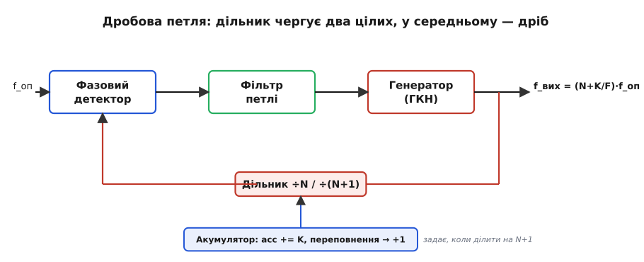
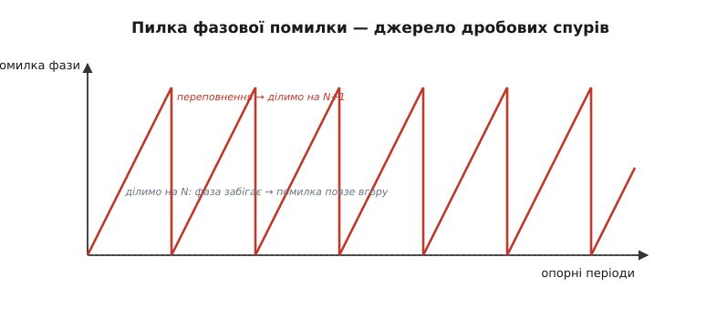
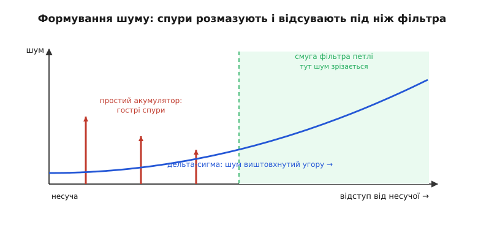

# Дробовий синтез частоти (Fractional-N): як дістати «нецілу» частоту з одного кварца

Уявіть радіоприймач, який має точно сісти на канал 2412 МГц, потім перескочити на 2417, потім на 2422 — сітка стандарту Wi-Fi іде через 5 МГц. Усередині приймача є один-єдиний опорний кварц, скажімо на 26 МГц, і петля автопідстроювання, що множить його на ціле число. Спробуймо: 2412 поділити на 26 — виходить 92.77. Не ціле. На жодне ціле опору не помножиш, щоб дістати рівно 2412. Найближче ціле дає 92 × 26 = 2392 МГц або 93 × 26 = 2418 МГц — повз канал на двадцять із гаком мегагерц. Катастрофа: приймач просто не налаштується туди, куди треба.

Звідси й уся затія. **Дробовий синтез частоти** *(англ. fractional-N — «дробове N», де N — коефіцієнт множення)* — це спосіб змусити петлю помножити опору не на ціле, а на **дробове** число: на 92.77, на 154.5, на будь-що проміжне. Тоді з того самого кварца виходить будь-яка частота з кроком хоч у кілогерц, а не грубими сходинками завширшки в цілу опору. Розберімо повільно, **звідки** береться цей дріб, якщо цифрова логіка вміє ділити лише на ціле, і **яку ціну** за нього доводиться платити.

> 🔧 **Навіщо це.** Відкрийте даташит майже будь-якого радіочипа — Bluetooth, Wi-Fi, стільниковий модем, GPS — і в синтезаторі частоти ви побачите слово «fractional-N» та регістри, куди вписують ціле й дробове частини коефіцієнта. Без дробу сітка каналів була б прив'язана до опорного кварца, і щоб ходити по каналах із кроком 200 кГц чи 5 МГц, довелося б ставити мізерну опору — а з нею петля стає кволою й шумною. Дробовий синтез розв'язує цей вузол: дрібний крок частоти при доволі високій опорі. Хто проєктує радіо чи навіть просто хоче нестандартну тактову частоту з наявного кварца — не обійдеться без розуміння fractional-N.

## Нагадування про ціле множення — і чому його замало

Стаття стоїть на одному фундаменті: на [фазовому автопідстроюванні частоти](root:hw-analog/phase-locked-loop). Коротко, що звідти треба тримати в голові. Петля складається з фазового детектора (порівнює фази опори й власного генератора), фільтра й керованого напругою генератора; у зворотний зв'язок ставлять **дільник на N**. Детектор бачить вихід генератора, поділений на N, і жене цю величину до опори. У рівновазі поділена частота дорівнює опорі, звідки вихід = N × опору. Змінив N — змінив вихідну частоту.

Уся хитрість і обмеження сидять у тому, що **дільник цифровий, а цифрова логіка ділить лише на ціле число**. Лічильник, що видає один імпульс на кожні N вхідних, працює тільки з цілим N: на 92 вміє, на 93 вміє, а «на 92.77» — фізично нема як, бо не буває 0.77 імпульсу. Тому проста петля прив'язана до сітки:

```
f_вих = N · f_оп ,   N ∈ {1, 2, 3, …}
```

Сусідні досяжні частоти різняться рівно на одну опору — це **крок сітки**. Хочеш дрібніший крок — мусиш зменшити опору f_оп. Але опору не можна знижувати безкарно: фазовий детектор порівнює фази лише в моменти опорних імпульсів, і чим вони рідші, тим повільніше петля «бачить» помилку, тим вужчою мусить бути смуга фільтра — а вузька смуга означає млявий захват і гірше пригнічення власного шуму генератора. Виходить глухий кут: **дрібний крок вимагає малої опори, а мала опора псує петлю**. Дробовий синтез розриває цю пов'язку — дає дрібний крок, лишивши опору високою.

## Головна ідея: усереднити два цілих дільники

Тепер ключовий хід, і він напрочуд простий. Якщо ми не вміємо ділити на 92.77, але вміємо на 92 і на 93 — давайте **чергувати**. Більшу частину часу ділимо на 92, а зрідка — на 93. Якщо з кожних ста опорних періодів 23 рази поділити на 93, а 77 разів на 92, то **в середньому** дільник поведеться як

```
N_сер = (77 · 92 + 23 · 93) / 100 = 92.23
```

Підберемо пропорцію — дістанемо будь-яке середнє між 92 і 93. Загальна формула проста: якщо з кожних F періодів ми K разів ділимо на N+1, а решту (F−K) разів — на N, то

```
N_сер = N + K/F
```

де дріб K/F — це і є та сама нецілa добавка (тут K — лічильник, F — знаменник дробу, англ. *modulus*). Петля, як завжди, жене **середню** поділену частоту до опори. А середня поділена частота тепер відповідає дробовому дільнику. Отже вихід застигає на

```
f_вих = (N + K/F) · f_оп
```

і ми дістали неціле множення, ні разу не поділивши на неціле число. Дільник, що вміє за командою перемикатися між N і N+1, звуть **дводільниковим** *(dual-modulus divider)*, а керує ним маленький цифровий вузол — **акумулятор**.


*Дробова петля. Усе як у звичайному синтезаторі, але дільник у зворотному зв'язку перемикається між N і N+1 за командою акумулятора. У середньому виходить дробовий коефіцієнт N+K/F, тож вихідна частота лягає між цілими кратними опори — з кварцовою стабільністю й дрібним кроком.*

## Акумулятор: як машина вирішує, коли ділити на N+1

Лишається питання: **за яким правилом** чергувати? Не можна просто «23 рази підряд на 93, потім 77 на 92» — тоді частота стрибала б грубими порціями. Потрібно розкидати ці перемикання якомога рівніше в часі. Це робить акумулятор — лічильник, що накопичує дріб.

Логіка така. Заведімо лічильник, до якого щоопорного періоду додаємо чисельник K. Коли він **переповнюється** (досягає або перевищує знаменник F), ми робимо дві речі: цього разу ділимо на N+1 замість N, і **віднімаємо F** з лічильника, лишивши залишок. Так переповнення трапляються саме з потрібною частотою — K разів на кожні F періодів, — і розкидані вони настільки рівномірно, наскільки дозволяє арифметика.

:::tabs
```cpp
// Дробовий акумулятор: вирішує, ділити цього періоду на N чи N+1.
// Знаменник F і чисельник K задають дробову частину K/F.
// Викликаємо раз на кожен опорний період; повертає поточний дільник.

#include <cstdint>

constexpr std::uint32_t N_INT = 92u;    // ціла частина коефіцієнта
constexpr std::uint32_t F_MOD = 100u;   // знаменник дробу (modulus)
constexpr std::uint32_t K_NUM = 23u;    // чисельник дробу -> середнє 92.23

static std::uint32_t acc = 0;           // акумулятор фази (0 .. F_MOD-1)

std::uint32_t next_divider() {
    acc += K_NUM;                       // накопичуємо дріб щоперіоду
    if (acc >= F_MOD) {                 // переповнення -> цього разу ділимо на N+1
        acc -= F_MOD;                   // лишаємо залишок для рівномірності
        return N_INT + 1u;              // = 93
    }
    return N_INT;                       // = 92
}
```
```python
# Дробовий акумулятор: вирішує, ділити цього періоду на N чи N+1.
# Знаменник F і чисельник K задають дробову частину K/F.
# Викликаємо раз на кожен опорний період; повертає поточний дільник.

N_INT = 92    # ціла частина коефіцієнта
F_MOD = 100   # знаменник дробу (modulus)
K_NUM = 23    # чисельник дробу -> середнє 92.23

acc = 0       # акумулятор фази (0 .. F_MOD-1)

def next_divider():
    global acc
    acc += K_NUM              # накопичуємо дріб щоперіоду
    if acc >= F_MOD:          # переповнення -> цього разу ділимо на N+1
        acc -= F_MOD          # лишаємо залишок для рівномірності
        return N_INT + 1      # = 93
    return N_INT              # = 92
```
:::

Простежмо кілька кроків при K = 23, F = 100. Акумулятор іде 0 → 23 → 46 → 69 → 92 → (115 ≥ 100, переповнення!) → ділимо на 93, лишається 15 → 38 → 61 → 84 → (107, переповнення) → на 93, лишається 7… За сто періодів переповнень буде рівно 23, тобто на 93 поділимо 23 рази — точно як хотіли. А завдяки залишку перемикання сидять не купою, а врозкид. Це і є серце найпростішого дробового синтезатора: **акумулятор накопичує нецілу частину фази, а кожне його переповнення «вставляє» один зайвий період дільника, щоб у середньому вийшов потрібний дріб**.

Зверніть увагу на красу цього механізму: акумулятор — це фактично цифрова модель **фази**. Дробовий дільник «недобирає» трохи фази щоперіоду (бо ділить на менше число, ніж треба в середньому), цей недобір копиться в акумуляторі, і коли набереться цілий період — його повертають, поділивши один раз на більше. Та сама ідея накопичення дробу, що працює у фазовому акумуляторі прямого цифрового синтезу.

## Плата за дріб: дробові спури

Тепер найважливіше, і саме тут дробовий синтез показує характер. Подивімося уважно, що бачить фазовий детектор **миттєво**, а не в середньому.

Поки акумулятор повзе до переповнення, дільник раз за разом ділить на 92 — тобто на **менше**, ніж треба для рівноваги (нам потрібно 92.23). Дільник на менше число означає, що поділена частота трохи **зависока**, отже її фаза щоперіоду забігає наперед відносно опори. Помилка фази **накопичується**, період за періодом, рівно як заряд в акумуляторі. Аж тут — переповнення, поділ на 93 (на **більше**), миттєвий стрибок фази назад, і все починається спочатку. Виходить, на вході фазового детектора сидить не нуль, а **пилкоподібна** хвиля фазової помилки: повільне накопичення вгору, різке скидання вниз, знову вгору. Точно як зуби пилки.


*Звідки беруться спури. Між переповненнями дільник ділить на менше число, тож фаза генератора забігає наперед і помилка повзе вгору. Переповнення повертає поділ на N+1 — і помилка стрибком скидається. Ця пилка повторюється з частотою переповнень і дає в спектрі гострий побічний пік — спур.*

Ця пилка **періодична**: вона повторюється з частотою, з якою акумулятор переповнюється, тобто f_оп × K/F. А все періодичне в спектрі дає гострі лінії. Тож на виході генератора, обабіч корисної частоти, виростають небажані піки — їх звуть **дробовими спурами** *(англ. spur, спур — «побічний паросток, відросток», від spurious — «несправжній»)*. Це вузькі сторонні складові, що стоять близько до несучої й часто пролазять крізь фільтр петлі, бо їхня частота може бути нижчою за смугу фільтра. Для радіо це біда: спур обабіч несучої — це чужа лінія, що заважає прийманню сусідніх каналів, точно як [фазовий шум](root:hw-analog/jitter-phase-noise), тільки гострий і на конкретній частоті.

Ось фундаментальний компроміс дробового синтезу. **Цілий синтезатор шумить менше (нема перемикань дільника), але має грубий крок. Дробовий дає тонкий крок, але платить спурами від цих перемикань.** Уся подальша інженерія fractional-N — це боротьба з цими спурами.

## Як приборкують спури: розмазати замість прибрати

Прямо прибрати спур фільтром не вийде: він сидить заблизько до несучої. Тому пішли іншим шляхом — **зробити помилку неперіодичною**. Якщо пилка перестане строго повторюватися, її енергія в спектрі вже не збереться в гострий пік, а **розмажеться** в широку, ледь помітну шумову підлогу. Лінію видно, а рівний фон — майже ні.

Перша і найгрубіша версія цього — **підмішати дрож** *(англ. dither — тремтіння)*: додати до акумулятора трохи випадковості, щоб переповнення траплялися не за строгим розкладом. Періодичність ламається, гострий спур розпливається в шум. Метод старий і робочий, але грубий — він просто **підіймає** загальний шумовий фон.

Набагато розумніший спосіб дала ідея **дельта-сигма** *(англ. delta-sigma, ΔΣ — «різниця-сума»)*. Замість простого акумулятора керування дільником віддають дельта-сигма-модулятору — цифровому вузлу, що не просто чергує N і N+1, а підмішує до перемикань спеціально **сформований** шум. Хитрість його — у **формуванні шуму** *(noise shaping)*: модулятор так влаштовує свою послідовність, що неминучу помилку квантування він **виштовхує з низьких частот у високі**. Близько до несучої, де фільтр петлі безсилий, шуму стає дуже мало; а вся «бруднота» переїжджає на високі відступи, де фільтр петлі її залюбки давить.


*Формування шуму дельта-сигмою. Простий акумулятор дає гострі спури близько до несучої (червоні піки). Дельта-сигма-модулятор розмазує їх і виштовхує енергію шуму на високі частоти (синій схил угору), а смуга фільтра петлі (зелена) їх там зрізає. Близько до несучої лишається тиша.*

Чому це працює саме так — глибина окремої теми. Інтуїтивно: модулятор тримає **зворотний зв'язок усередині себе**, накопичуючи власну помилку округлення й компенсуючи її наступними кроками, через що повільні (низькочастотні) складові помилки взаємно гасяться, а лишається тільки швидке тремтіння. Те саме формування шуму, на якому стоять і дельта-сигма-перетворювачі сигналу. Як модулятор будує цю послідовність, чому шум росте саме як степінь частоти й що дає каскад із кількох таких ланок — у [математичній вставці про формування шуму](root:hw-analog/pll-fractional-n/math-delta-sigma-shaping.md).

> 🔧 **Навіщо це.** У регістрах сучасного синтезатора ви побачите не лише ціле N і дріб, а й вибір **порядку дельта-сигма-модулятора** (зазвичай 2-й чи 3-й). Вищий порядок сильніше прибирає шум коло несучої, але крутіше задирає його вгорі — і вимагає трохи ширшої смуги фільтра, щоб устигнути той шум зрізати. Це жива настройка: радіоінженер крутить порядок модулятора й смугу петлі, шукаючи, де спури вже не заважають, а високочастотний шум іще не пролазить. Не розумієш формування шуму — не налаштуєш чистий синтезатор.

## Скільки дробу влазить: розрядність акумулятора

Корисно відчути, **наскільки** дрібний крок дає дробовий синтез. Крок частоти тепер не опора, а опора, поділена на знаменник F:

```
крок = f_оп / F
```

Чим більший знаменник, тим тонша сітка. А знаменник задає розрядність акумулятора: акумулятор на M біт має F = 2ᴹ, тобто 2ᴹ можливих дробових позицій.

**Який крок дає 24-бітний акумулятор при опорі 26 МГц?**

:::tabs
```cpp
// Розрядність акумулятора визначає тонкість сітки частот.
// M-бітний акумулятор -> знаменник F = 2^M -> крок = f_оп / 2^M.

#include <cstdint>

std::uint32_t f_ref_hz = 26000000u;   // опора 26 МГц
std::uint32_t M_bits   = 24u;         // 24-бітний акумулятор

// F = 2^24 = 16 777 216
// крок = 26 000 000 / 16 777 216 ≈ 1.55 Гц

double step_hz = static_cast<double>(f_ref_hz) / (1u << M_bits);
// step_hz ≈ 1.55 Гц
```
```python
# Розрядність акумулятора визначає тонкість сітки частот.
# M-бітний акумулятор -> знаменник F = 2^M -> крок = f_оп / 2^M.

f_ref_hz = 26000000   # опора 26 МГц
M_bits   = 24         # 24-бітний акумулятор

# F = 2^24 = 16 777 216
# крок = 26 000 000 / 16 777 216 ≈ 1.55 Гц

step_hz = f_ref_hz / (1 << M_bits)
# step_hz ≈ 1.55 Гц
```
:::

Півтора герца кроку при опорі 26 МГц — це сітка в сімнадцять мільйонів разів дрібніша, ніж дав би цілий синтезатор. Саме тому дробовий синтез вважають майже «безперервним»: на 24 бітах будь-яку розумну частоту можна дістати з похибкою в одиниці герц. А головне — опору ми **не чіпали**: вона лишилася високими 26 МГц, петля лишилася жвавою, і за весь цей дрібний крок ми заплатили тільки складнішим керуванням дільником і дельта-сигмою проти спурів.

## Що ще варто тримати в голові

Кілька штрихів, без яких картина дробового синтезу неповна.

**Лінійність — таємний ворог.** Уся ідея формування шуму спирається на те, що шкідливий шум сидить високо й фільтр його зрізає. Та якщо десь у петлі є **нелінійність** (наприклад, зарядний насос детектора реагує не цілком рівно на різні фази), вона **змішує** високочастотний шум назад униз, до несучої — і ретельно прибрані спури частково повертаються. Тому в дробових синтезаторах особливо дбають про лінійність [фазочастотного детектора й зарядного насоса](root:hw-analog/phase-locked-loop/comp-pfd-charge-pump.md): саме там формований шум легко «складається» назад у близькі спури.

**Цілочисловий бар'єр.** Спури найгірші, коли дріб K/F близький до простого значення на кшталт 0 чи 1/2: переповнення стають майже періодичними, і їх важко розмазати. Тому найгидкіші точки — частоти трохи **вище від цілого кратного опори**. Розробники свідомо уникають роботи рівно на цілому каналі або підмішують туди дрож.

**Знайомий родич — прямий цифровий синтез.** Той самий фазовий акумулятор, що накопичує дріб, стоїть і в основі прямого цифрового синтезу частоти, тільки там його виходом адресують таблицю синуса, а не керують дільником петлі. Спорідненість глибока: і там, і там частоту задають дробом, накопиченим у цифровому лічильнику.

Підсумуймо суть. Цифровий дільник уміє ділити лише на ціле, тож проста петля множить опору грубими сходинками. **Дробовий синтез чергує два сусідніх цілих дільники так, що в середньому виходить дробове множення** — і дає майже будь-яку частоту з одного кварца, лишивши опору високою. Платою за цей дріб є **дробові спури** — гострі побічні лінії від періодичного накопичення фазової помилки; їх приборкують, ламаючи періодичність: грубо — дрожем, тонко — дельта-сигма-модулятором, що виштовхує шум туди, де фільтр петлі його зрізає. Саме завдяки fractional-N кожен радіочип у кишені сідає рівно на свій канал, маючи всередині лише скромний кварц і трохи цифрової кмітливості.

> 📜 **Звідки взялося.** Думку «усереднити дільник, щоб дістати дробове множення» втілили ще наприкінці 1960-х: схему з накопиченням дробової фази (її назвали Digiphase) показав 1969 року Гаррі Джиллетт, а британська фірма Racal довела її до серійних приймачів. Сучасний же вигляд із дельта-сигмою прийшов 1990-го. Хто й коли зробив ці кроки, як від простого акумулятора дійшли до формування шуму — в [історичній вставці](root:hw-analog/pll-fractional-n/hist-digiphase-deltasigma.md).
