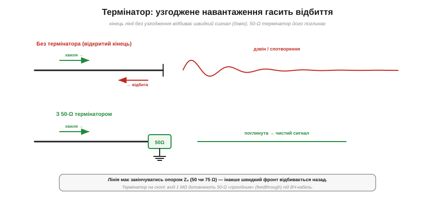
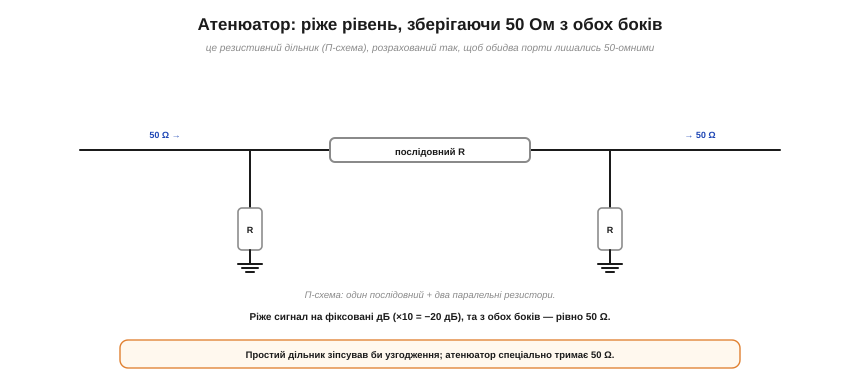

# 🔌 Термінатор і атенюатор: «заглушки» з коробки осцилографа

> **Узгодження** навантаження з джерелом — ідея проста: щоб віддати в навантаження максимум потужності, його опір має дорівнювати внутрішньому опору джерела (для ліній передачі — їхньому хвильовому опору). А в коробці з причандаллям до осцилографа лежать дрібні роз'ємні «заглушки», що втілюють цю ідею **в металі**: **термінатори** й **атенюатори**. Розберімо, що це й навіщо.

### Термінатор: узгоджене навантаження проти відбиттів

*Угорі: відкритий кінець лінії **відбиває** швидкий сигнал назад — виходить «дзвін» і спотворення. Унизу: 50-Ω термінатор на кінці **поглинає** хвилю, і сигнал лишається чистим. Лінія має закінчуватись своїм хвильовим опором Z₀ (50 чи 75 Ω).*

**Термінатор** — це просто резистор на **хвильовий опір** лінії (50 або 75 Ω) у роз'ємі, який накручують на **кінець** кабелю. Навіщо? На високих частотах і швидких фронтах кабель поводиться як **лінія передачі**: якщо її кінець **не узгоджено** (відкритий чи замкнений), сигнал **відбивається** назад — і накладається на корисний, даючи «дзвін», ступінчасті спотворення, хибні покази. Термінатор із опором, що дорівнює Z₀, **поглинає** хвилю без відбиття — це той самий принцип узгодження опорів, тільки для **рухомих** хвиль, а не для сталого режиму.

На осцилографі тут є тонкість. Його вхід зазвичай **високоомний** (1 МΩ) — щоб не навантажувати коло. Та для швидких чи ВЧ-сигналів по 50-Ω кабелю такий вхід — це фактично «відкритий кінець», що дає відбиття. Тому до нього додають **прохідний** 50-Ω термінатор (*feedthrough*) або вмикають вбудований режим «50 Ω», щоб узгодити кабель.

### Атенюатор: дільник, що зберігає 50 Ом

*Атенюатор — резистивний дільник (тут П-схема: послідовний резистор плюс два паралельні), розрахований так, щоб з обох боків лишалось рівно 50 Ω. Він ріже сигнал на фіксовані децибели (×10 = −20 дБ), не псуючи узгодження, — на відміну від простого дільника.*

**Атенюатор** — це резистивний дільник у роз'ємі, що **зменшує** амплітуду сигналу на фіксовану величину (у децибелах: −10 дБ, −20 дБ…) і водночас **зберігає 50 Ω** з обох боків. Останнє — головне: простий [дільник напруги](topic:hw-analog/voltage-divider) теж послабив би сигнал, та зіпсував би узгодження й дав би відбиття. Тому атенюатор будують спеціальною **П-** (чи **Т-**) схемою з трьох резисторів, підібраних так, щоб кожен порт виглядав на 50 Ω. Його накручують, щоб **захистити** чутливий вхід від завеликого сигналу або щоб виставити рівень — не порушуючи 50-омного тракту.

### Силовий родич: навантаження-пустушка

Поряд у коробці часто лежить і **навантаження-пустушка** (*dummy load*) — потужний 50-Ω резистор, що поглинає **весь** вихід передавача, [перетворюючи його на тепло](topic:ph-electromagnetism/joule-heating) (I²R). Так радіо налаштовують, **не випромінюючи** в ефір: уся потужність іде в узгоджене навантаження, яке від того добряче гріється.

### Типові граблі

- **Забути термінатор** — відбиття, дзвін, неправильні виміри на швидких сигналах. Кінець лінії має бути узгоджений.
- **Не той опір.** 50-Ω термінатор на 75-Ω лінії (чи навпаки) — це знову розузгодження.
- **Перевищити потужність.** Термінатори, атенюатори й пустушки мають **допустиму потужність**; подаси більше — згорять (особливо пустушка, що поглинає все).
- **Постійна складова.** Деякі прохідні термінатори пропускають лише змінний сигнал; з постійним зміщенням це треба враховувати.

Отак три копійчані «заглушки» — термінатор, атенюатор і пустушка — виявляються ідеєю узгодження опорів, відлитою в роз'єми: поглинай хвилю узгодженим опором, послаблюй сигнал, не псуючи 50 Ω, і вантаж передавач, не виходячи в ефір.
