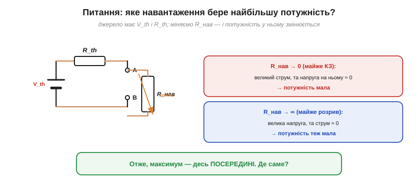
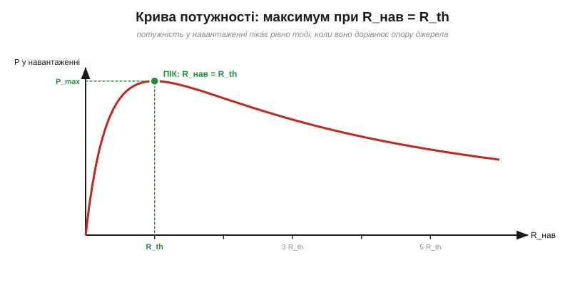
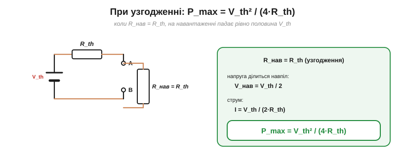
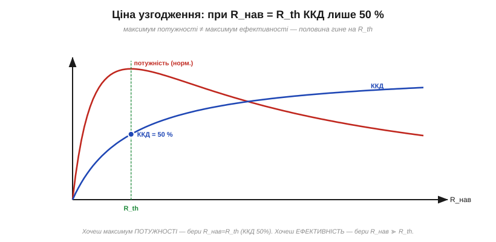
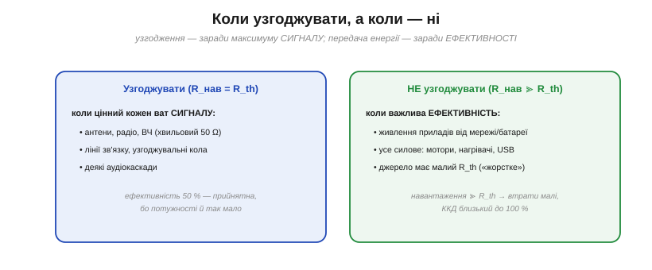

# Узгодження й максимальна передача потужності

Маючи еквівалент Тевеніна (V_th, R_th), поставмо красиве й практичне питання: **яке навантаження візьме від джерела найбільшу потужність?** Відповідь не очевидна — і веде до важливої інженерної ідеї **узгодження**.

### Питання: яке навантаження бере найбільше?

*Джерело (V_th, R_th) живить змінне навантаження R_нав. Замале R_нав (майже КЗ) — великий струм, та напруга на ньому ≈ 0; завелике (майже розрив) — велика напруга, та струм ≈ 0. В обох крайнощах потужність мала, тож максимум — десь посередині.*

Поміркуймо над крайнощами. Якщо R_нав **дуже мале** (майже коротке замикання), крізь нього тече великий струм, але напруга на ньому майже нульова — а P = V·I, тож потужність мізерна. Якщо R_нав **дуже велике** (майже розрив), на ньому велика напруга, але струм майже нульовий — потужність знову мізерна. В обох крайнощах P → 0. Отже, десь **посередині** ховається максимум. Лишається знайти, де саме.

### Теорема: максимум при R_нав = R_th

*Крива потужності в навантаженні залежно від R_нав має чіткий пік — рівно при R_нав = R_th. Це і є теорема про максимальну передачу потужності.*

Відповідь напрочуд красива: **потужність у навантаженні максимальна, коли R_нав = R_th** — коли навантаження **дорівнює** внутрішньому опору джерела. Це **теорема про максимальну передачу потужності**. Її легко вивести: потужність у навантаженні P = V_th²·R_нав/(R_нав + R_th)²; прирівнявши похідну цього виразу по R_нав до нуля, дістаємо рівно R_нав = R_th. Стан, коли навантаження «підігнане» під джерело, і називають **узгодженням** (*impedance matching*).

Інтуїтивно це баланс: менше R_нав підсилює струм, але слабшає напругу на навантаженні; більше R_нав — навпаки. Рівність R_нав = R_th — золота середина, де добуток V·I найбільший. Гарна симетрія: джерело «віддає найщедріше» тому навантаженню, що на нього найбільше схоже.

> 🧮 **Точне виведення.** Повну викладку — як похідна dP/dR обертається на нуль рівно при R = R_th (а її знак доводить, що це максимум), і чому пік «пласкоголовий» (відхилившись удвічі, втрачаєш лише ~11 % потужності) — у вставці [Максимум через похідну](root:hw-analog/power-matching/math-derivative-max.md).

### Скільки саме: P_max = V²/(4R_th)

*При узгодженні (R_нав = R_th) напруга джерела ділиться навпіл, а максимальна потужність у навантаженні P_max = V_th²/(4·R_th).*

Порахуймо й саму потужність. При узгодженні R_нав = R_th дільник із двох рівних опорів ділить напругу **навпіл**: на навантаженні падає V_th/2, а струм дорівнює V_th/(2·R_th). Перемноживши, дістаємо максимальну потужність:

P_max = V_th² / (4·R_th).

Це найбільше, що джерело з даними V_th і R_th узагалі здатне віддати в зовнішнє навантаження. Хочете більше — мусите або підняти V_th, або знизити R_th самого джерела.

Це, до речі, межа й для [реального джерела з ЕРС та внутрішнім опором](root:hw-analog/internal-resistance): максимальна потужність, яку батарея з ЕРС ε та внутрішнім опором r узагалі здатна віддати, — це ε²/(4·r), і дістається вона при навантаженні R_нав = r. Намагатися «вичавити» більше марно: за меншого опору джерело лише наближається до короткого замикання, а потужність у навантаженні падає. (І це знову межа простої моделі «ε + r»: реальну батарею не варто тримати в узгодженому режимі — половина потужності гріє її нутро, а хімічні й теплові обмеження ставлять стелю задовго до того.)

### Ціна узгодження: ККД лише 50 %

А тепер — важлива пастка, що ламає наївне «узгоджуй завжди».

*Пастка: максимум потужності — не максимум ефективності. При R_нав = R_th половина всієї потужності гине на R_th, тож ККД лише 50 %. Ефективність зростає, коли R_нав ≫ R_th, але потужність у навантаженні тоді падає.*

Зверніть увагу: при узгодженні **однаковий** опір R_нав і R_th несуть однаковий струм, тож на кожному виділяється **порівну** потужності. А це означає, що рівно **половина** всієї потужності джерела безповоротно гріє його **внутрішній** опір R_th, і лише половина дістається навантаженню. Коефіцієнт корисної дії при узгодженні — лише **50 %**! Максимум потужності й максимум ефективності — це **різні** режими: ефективність росте, коли R_нав ≫ R_th (втрати на R_th малі), але потужність у навантаженні тоді мала. Доводиться обирати, що важливіше.

### Коли узгоджувати, а коли — ні

*Узгоджують (R_нав = R_th) там, де цінний кожен ват сигналу: антени, ВЧ (50 Ω), лінії зв'язку. НЕ узгоджують (R_нав ≫ R_th) у силовому живленні, де важлива ефективність: мотори, нагрівачі, USB.*

Звідси проста практична карта. **Узгоджують** там, де цінний кожен ват **сигналу**, а втрати на ККД — другорядні (бо потужності й так обмаль): антени й радіо (звідси хвильові опори **50 Ω** і **75 Ω**), високочастотні лінії, кола зв'язку, деякі аудіокаскади. **Не узгоджують** у **силовому** живленні, де головне — ефективність: блок живлення, батарея, USB живлять прилади, чий опір **набагато більший** за внутрішній опір джерела (R_нав ≫ R_th), тож втрати малі, а ККД близький до 100 %. Саме тому реальні джерела живлення роблять «жорсткими» (малий R_th), а не «узгодженими».

> 📜 А звідки взялися самі числа **50 Ω** і **75 Ω**? Це не оптимуми, а компроміси: 50 Ω балансує потужність, втрати й напругу коаксіалу, а 75 Ω мінімізує втрати й пасує під антену. Гарну історію цього компромісу (Bell Labs, 1929) — у вставці [Звідки взялися 50 Ом](root:hw-analog/power-matching/hist-50-ohm.md).

І ще тонкість на майбутнє: у колах змінного струму «опір» узагальнюється до **імпедансу** (з урахуванням ємностей та індуктивностей), і узгодження стає узгодженням **імпедансів** — наріжним поняттям радіо- та звукотехніки. Тільки «дзеркалити» тут означає брати **комплексно-спряжений** імпеданс, Z_нав = Z_дж* (активні частини зрівнюють, а реактивну компенсують протилежною: ємність — індуктивністю, і навпаки); сама ж ідея лишається — щоб віддати максимум сигналу, навантаження має «віддзеркалити» джерело.

> 🔧 **Навіщо це.** Головне рішення — **потужність чи ефективність?**, бо в узгодженій точці вони конфліктують. Для **сигналів** (антена, радіо, ВЧ-лінія) узгоджують опори (R_нав = R_th), бо там виловлюють максимум слабкого сигналу, а 50 % ККД не біда. Для **живлення** (мотори, нагрівачі, зарядка) узгодження було б катастрофою — половина енергії грілася б усередині джерела; натомість беруть навантаження, **набагато більше** за R_th, і дістають високий ККД. Тому, до речі, не можна «висмоктати» з розетки чи блока живлення довільно велику потужність, узгодившись із ним: спершу впадеш у к.з. Запам'ятайте дороговказ: **сигнал — узгоджуй; енергію — передавай ефективно**.

> 🔌 **Узгодження в металі.** Готові «заглушки» з коробки осцилографа — **термінатори** (узгоджене 50-Ω навантаження, що гасить відбиття на кінці лінії) й **атенюатори** (дільники, що ріжуть рівень, зберігаючи 50 Ω) — це й є ідея узгодження, втілена в роз'ємах: [Термінатор і атенюатор](root:hw-analog/power-matching/comp-terminator.md).
