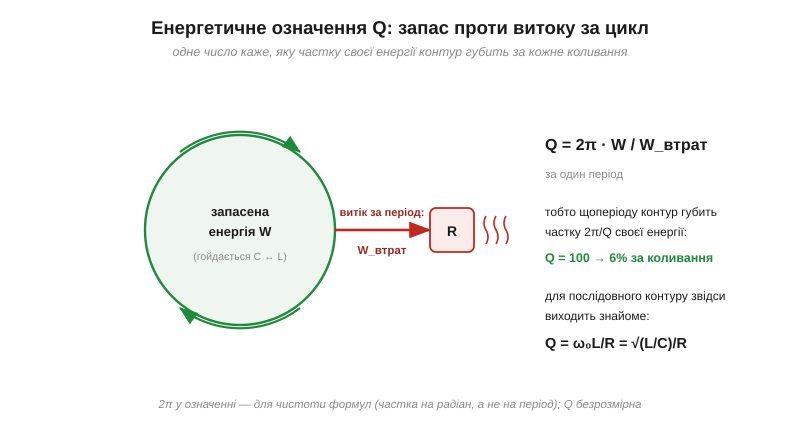
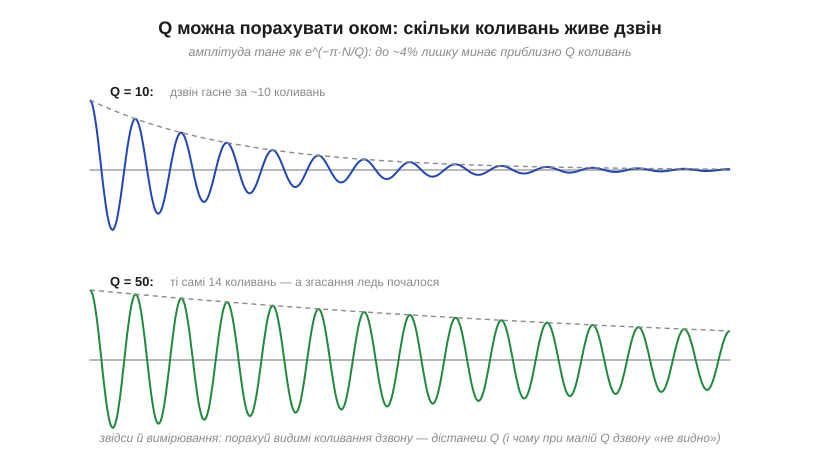

# 🧮 Добротність Q математично: запасена енергія і швидкість згасання

Добротність Q показує себе з кількох боків: гострота піка, ширина смуги, тривалість дзвону, формула Q = ω₀L/R. Виглядає як купа окремих фактів — а насправді всі вони випливають з одного енергетичного означення. Нижче — це означення, два коротких виведення і правило, за яким Q можна порахувати просто оком на екрані осцилографа.

### Означення: запас проти витоку

Фундаментальне означення добротності не згадує ні котушок, ні омів:

```
Q = 2π · (запасена енергія W) / (енергія, втрачена за один період)
```

Словами: Q каже, **яку частку своєї енергії коливальна система губить за цикл** — а саме, частку 2π/Q. Контур із Q = 100 щоколивання втрачає ~6% запасу; з Q = 10 — аж 63%. Множник 2π тут для зручності (частка «на радіан», а не на період) — завдяки йому всі формули нижче виходять без хвостів. Q безрозмірна, і означення годиться для будь-чого, що коливається: маятника, струни, мікрохвильового резонатора.


*Енергія гойдається між полями C і L (це [обмін енергією на резонансі](root:hw-analog/lc-resonance)), а резистор щоперіоду «відкушує» свою частку в тепло. Відношення запасу до відкушеного — і є Q. З цього означення випливають усі робочі формули добротності.*

### Виведення Q = ω₀L/R — у три рядки

Перевіримо, що енергетичне означення дає знайому формулу Q = ω₀L/R. У послідовному контурі на резонансі тече струм з амплітудою I₀. Запас енергії — у котушці на піку струму ([енергія в полі котушки](root:ph-electromagnetism/inductor-energy)); втрати — на резисторі ([теплові втрати за Джоулем](root:ph-electromagnetism/joule-heating), середня потужність синусоїдного струму — ½I₀²R):

```
W       = ½·L·I₀²
W_втрат = P·T = (½·I₀²·R) · T
Q       = 2π·W/W_втрат = 2π·L/(R·T) = ω₀·L/R        (бо 2π/T = ω₀)
```

А скориставшись [формулою Томсона](root:hw-analog/lc-resonance/math-thomson-formula.md) (ω₀² = 1/LC), цю саму Q можна записати симетрично:

```
Q = ω₀L/R = 1/(ω₀·C·R) = (1/R)·√(L/C)
```

Величину √(L/C) звуть **характеристичним опором** контуру: Q — це просто відношення цього «внутрішнього» опору до опору втрат. Хочеш добротніший контур — або зменшуй R, або збільшуй L коштом C за того самого f₀.

### Q у часі: порахуй коливання дзвону

Енергетичне означення одразу каже, як гасне вільний дзвін контуру. Щоперіоду енергія множиться на (1 − 2π/Q), тобто за N коливань:

```
E(N) ≈ E₀·e^(−2π·N/Q)
A(N) ≈ A₀·e^(−π·N/Q)        (амплітуда — корінь з енергії)
```

Звідси кишенькове правило: амплітуда падає до ~4% початкової за **N ≈ Q коливань** (бо e^(−π) ≈ 0.04 на кожні Q періодів). Інакше кажучи — **скільки коливань дзвону видно на осцилографі, така приблизно і Q**.


*Той самий контур, різні втрати. За Q = 10 дзвін живе близько десяти коливань; за Q = 50 ті самі чотирнадцять періодів — лише початок згасання. Це й пояснює пораду з вимірювання індуктивності: за малої Q дзвону «не видно», бо він гасне за пару періодів.*

Це правило працює і навспак — на ньому тримається [вимірювання індуктивності за дзвоном](root:hw-analog/rl-time-constant/proj-inductance-meter.md): якщо дзвін зникає за один-два періоди, добротність кола одиниці, і час міняти умови вимірювання.

### Q у частоті: чому смуга — це f₀/Q

Третя іпостась — смуга Q = f₀/Δf. Строге виведення потребує [передавальної функції кола](root:hw-analog/frequency-response), але інтуїція прозора і чесна: система, що вільно дзвенить лише N ≈ Q коливань, «пам'ятає» свою частоту з відносною точністю порядку 1/N. Короткий дзвін — розмита нота, довгий — чиста. Тому відносна ширина відгуку Δf/f₀ ≈ 1/Q: **тривалість дзвону в часі та гострота піка в частоті — два прояви одного числа**. Зведемо всі чотири обличчя:

```
Q = 2π·W/W_втрат за період        (означення)
Q = ω₀L/R = √(L/C)/R              (компоненти послідовного контуру)
Q ≈ N коливань дзвону             (часова картина)
Q = f₀/Δf                          (частотна картина)
```

**Приклад (контур приймача).** Той самий контур, що в [розрахунку за формулою Томсона](root:hw-analog/lc-resonance/math-thomson-formula.md): L = 100 мкГн, C = 100 пФ, f₀ ≈ 1.59 МГц; опір втрат R = 10 Ом:

```
X = ω₀L = 2π·1.59×10⁶·10⁻⁴ ≈ 1000 Ом
Q = X/R = 1000/10 = 100
Δf = f₀/Q ≈ 16 кГц          (акурат смуга однієї АМ-станції!)
дзвін: ~100 коливань ≈ 63 мкс
```

Одна Q розповіла все: і що контур вибере станцію, не зачепивши сусідню (смуга), і скільки житиме його вільний дзвін, і що 6% енергії губиться щоперіоду.

### Де це працює в курсі

Енергетичне означення — ключ до всіх «добротностей»: висока Q [кварцу](root:hw-components/quartz-resonator) — це мізерні втрати кристалічної решітки на цикл; низька Q [феритової бусини](root:hw-components/ferrite-bead) — навмисне величезні; Q [котушки](root:hw-components/inductor-types) з даташита — її X/R на робочій частоті. А пара «тривалість у часі ↔ ширина в частоті» з цієї вставки — прояв загального принципу, що однаково керує і сигналами, і фільтрами.
