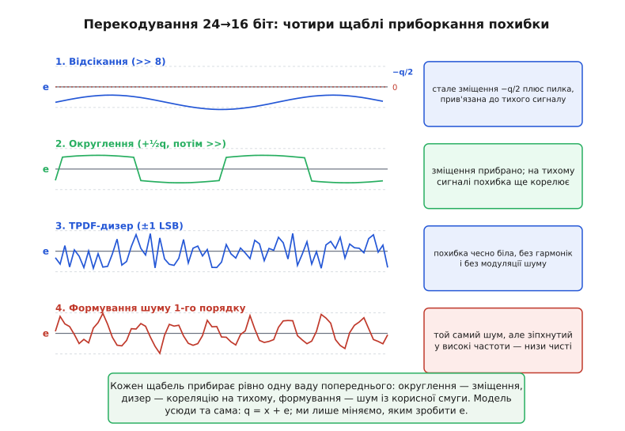
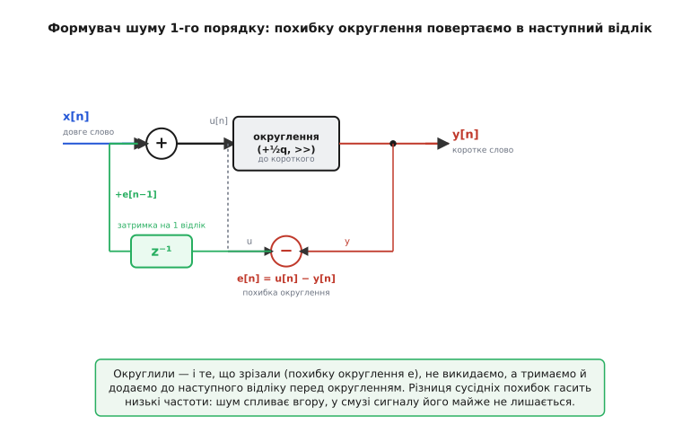

# ⚙️ Перекодування розрядності: шум квантування у цифрі

Шум квантування звикли шукати на вході — там, де жива напруга з давача лягає на код АЦП. Але є місце, де він народжується вже після того, як усе оцифроване й, здавалося б, точне: **усередині процесора**, коли довше число доводиться записати коротшим. Зменшуєте 24-розрядний звук до 16 для компакт-диска — вісім молодших розрядів мусять кудись подітися. Перемножуєте у фільтрі відлік на коефіцієнт — добуток виходить удвічі довшим за регістр, і половину розрядів треба зрізати. Накопичуєте суму в широкому акумуляторі, а віддати мусите у вузьке слово. Скрізь одне: **довге слово → коротке**, і в цьому скороченні знову сидить та сама похибка, що й на вході АЦП.

Це і є суть, з якою варто зайти в тему: перекодування розрядності — **не інша задача**, а той самий квантувач, лише переставлений із аналогового входу всередину цифри. Модель не міняється ні на йоту:

```
q = x + e
```

x — точне довге слово, q — коротке, e — похибка, що з'явилася при скороченні. Уся різниця в тім, що тут x уже цифровий (не напруга, а ціле число), а квантувач — не компаратори АЦП, а **ваш власний код**, кілька рядків цілочислової арифметики. І оскільки квантувач тепер ваш, то і **всі чотири ручки керування шумом теж ваші**: як саме зрізати розряди, чи додавати дизер, чи формувати спектр — вирішуєте ви, рядком коду. Тут ми пройдемо ці ручки по черзі — від найгрубшої до найтоншої, — щоразу робочим C для прошивки, і побачимо, як кожна прибирає рівно одну ваду попередньої. А заразом розберемо пастки, яких на вході АЦП не буває, бо там квантує залізо, а тут — цілі числа в C, з їхнім норовом: знак при зсуві вправо, переповнення акумулятора, втрата розрядів у проміжку.

> 🔧 **Навіщо це.** Це не академічна вправа, а щоденний код прошивки. Цифровий фільтр на фіксованій комі, кодек, що тисне 24 біти в 16, регулятор, що множить помилку на коефіцієнт, — усі вони всередині ріжуть слово, і від того, як саме ви це зробите, залежить, чи буде на виході рівна шумова підлога, чи паразитне деренчання й повзучий зсув нуля. Той, хто бачить у зсуві `>>` просто «поділити на два», рано чи пізно ловить загадкове зміщення й гармоніки на тихих ділянках. Той, хто бачить там квантувач із моделлю q = x + e, одразу знає, яку ручку крутити.

## Задача: 24 біти в 16, і чому «просто відкинути» — це вже помилка

Візьмемо найнаочніший випадок — перекодування звуку. Студійний тракт працює у 24 розрядах: запис, обробка, зведення — усе там, бо запас точності дає волю робити десятки операцій, не накопичуючи чутного бруду. Але компакт-диск за стандартом Red Book (специфікація Philips і Sony 1980 року на аудіо-CD) вміщає рівно **16 розрядів** лінійної імпульсно-кодової модуляції на 44.1 кГц — це усталений факт, а не наближення. Отже, на останньому кроці 24-розрядний майстер мусить стати 16-розрядним. Вісім молодших розрядів кожного відліку доведеться прибрати.

Число зберігається як ціле зі знаком у доповняльному коді (англ. *two's complement* — представлення від'ємних цілих, у якому старший біт означає знак, а `−1` виглядає як усі одиниці). 24-розрядний відлік лежить, скажімо, у 32-розрядній змінній `int32_t`, займаючи молодші 24 біти. Щоб дістати 16-розрядний, треба **скинути 8 молодших розрядів** — рівно на стільки коротша сітка. Крок нової сітки в одиницях старої:

```
q = 2⁸ = 256
```

Тобто один рівень 16-розрядної сітки дорівнює 256 рівням 24-розрядної. Усе, що дрібніше за 256 у старому слові, у новому не поміститься — і саме воно стане похибкою e. За моделлю q/√12 середньоквадратичний шум цього перекодування — це q/√12 = 256/√12 ≈ 74 рівні старої сітки, або, як і належить, ≈ 0.29 нового найменшого розряду.

Найнаївніший спосіб напрошується сам: раз треба прибрати 8 молодших розрядів — зсунемо число на 8 позицій управо.

:::tabs
```cpp
int16_t requantize_truncate(int32_t x24)
{
    return (int16_t)(x24 >> 8);   // ← «просто відкинути молодші 8 біт»
}
```
```python
def requantize_truncate(x24: int) -> int:
    return x24 >> 8   # ← «просто відкинути молодші 8 біт»
```
:::

Виглядає бездоганно й працює швидко. І саме тут — перша, найтонша пастка всієї теми: **зсув управо в C — це не округлення, а відсікання вниз, і воно вносить стале зміщення.** Розберімо, чому.

## Пастка перша: відсікання дає сталий зсув −q/2

Зсув `>> 8` викидає 8 молодших розрядів **безповоротно** — те, що вони несли, просто зникає. А несли вони дробову частину нового рівня: від 0 до 255 одиниць старої сітки. Подивімось, куди після цього лягає результат.

Нехай справжнє значення — 1000 (в одиницях старої, 24-розрядної сітки). Ділимо на 256: виходить 3.906… нового рівня. Зсув `>> 8` дає 3 — тобто **округлення завжди вниз**, до найближчого меншого рівня, ніколи до найближчого. Похибка тут:

```
e = q_вихід − x = 3·256 − 1000 = 768 − 1000 = −232
```

І так буде **завжди**: скільки б не було справжнє значення, відсікання тягне його вниз, до найближчого нижнього рівня. Похибка ніколи не буває додатною — вона гуляє в межах [−255, 0], а не [−128, +127], як мала б за чесного округлення. Її середнє — не нуль, а приблизно **−q/2 = −128**. Це і є **стале зміщення** (англ. *DC offset* — постійна складова, зсув нуля): цілий сигнал з'їжджає вниз на пів-кроку нової сітки.


*Чотири щаблі приборкання похибки перекодування 24→16 біт, кожен прибирає одну ваду попереднього. Верхня смуга — відсікання: похибка тримається нижче нуля (сталий зсув −q/2) і повільно хвилюється разом із тихим сигналом. Нижче — округлення (зсув прибрано), TPDF-дизер (похибка чесно біла) і формування шуму (той самий шум, але зіпхнутий у високі частоти).*

Чому це погано, а не просто «на пів-кроку нижче»? Дві причини, і обидві болючі. По-перше, стала складова −128 просто **марнує один із небагатьох 16-розрядних рівнів**: увесь сигнал зсунуто, динамічний діапазон трошки з'їдено. По-друге — і це гірше — на **тихому** сигналі відсікання поводиться не як шум, а як **спотворення**. Уявіть повільну синусоїду, що ледь-ледь ворушиться навколо якогось рівня. Її похибка після відсікання йде не хаотично, а гладкою хвилею, жорстко прив'язаною до самого сигналу: там, де синусоїда вгорі, дробова частина одна, там, де внизу, — інша, і все передбачувано повторюється з періодом сигналу. А передбачувана, прив'язана до сигналу похибка — це [гармоніки на спектрі](root:hw-analog/adc-quantization/hist-quantization-noise.md), гостре деренчання, а не рівне шипіння. Вухо ловить таке деренчання куди гостріше, ніж рівний шум тієї самої потужності.

> Чому саме прив'язана до сигналу похибка сідає гострими гармоніками, а некорельована — рівним килимом, і як телефонна імпульсно-кодова модуляція вперше наштовхнула на різницю між шумом і спотворенням, — у нарисі [хто і як зрозумів, що округлення — це шум](root:hw-analog/adc-quantization/hist-quantization-noise.md). Тут ми беремо цю різницю як робочий факт.

І ще одна тонкість саме про C, яку легко проґавити. Зсув управо `>>` для **знакового** типу в сучасних компіляторах — арифметичний: старший біт (знак) розмножується, тож `−1000 >> 8` дасть не «майже нуль», а −4 (округлення вниз для від'ємних — це вниз за числовою віссю, тобто в **більший мінус**). Тобто відсікання тягне вниз і додатні, і від'ємні значення однаково — завжди в бік мінус нескінченності. Це послідовно, але означає, що зсув геть не симетричний навколо нуля. (Формально до C++20 поведінка `>>` для від'ємних була визначена реалізацією; на практиці всі поширені компілятори роблять арифметичний зсув, а з C++20 це вже гарантія стандарту. Але покладатися на це наосліп не варто — про безпечний шлях нижче.)

## Ручка перша: округлення — додати пів-кроку перед зсувом

Лік від зміщення простий і давній: якщо зсув завжди округлює вниз, **підштовхнімо число вгору рівно на пів-кроку перед зсувом**, щоб «вниз» перетворилося на «до найближчого». Пів-кроку нової сітки — це q/2 = 128 = 2⁷ одиниць старої. Додаємо цю сталу, а потім зсуваємо:

:::tabs
```cpp
int16_t requantize_round(int32_t x24)
{
    return (int16_t)((x24 + (1 << 7)) >> 8);   // +½q, потім відсікання
}
```
```python
def requantize_round(x24: int) -> int:
    return (x24 + (1 << 7)) >> 8   # +½q, потім відсікання
```
:::

Простежмо на тому самому числі 1000. Додаємо 128: виходить 1128. Зсув `>> 8`: 1128 / 256 = 4.40… → 4. Похибка:

```
e = 4·256 − 1000 = 1024 − 1000 = +24
```

Тепер похибка **додатна** — бо 1000 ближче до 1024 (4-й рівень), ніж до 768 (3-й), і округлення чесно потягло до найближчого. Спробуйте будь-яке інше число: похибка тепер гуляє в межах [−128, +127], симетрично навколо нуля, і **середнє її — нуль**. Сталого зсуву більше немає. Один рядок — `+ (1 << 7)` перед зсувом — і ціла постійна складова зникла.

Чому саме `1 << 7`, а не `128` числом? Функціонально це те саме, але запис через зсув **промовляє намір**: пів-кроку — це «одиниця, посунута на (число_зрізаних_розрядів − 1) позицій». Якщо завтра ви ріжете не 8, а 12 розрядів, формула сама підкаже: додати `1 << 11`. Загальне правило для скорочення на `S` розрядів:

:::tabs
```cpp
int32_t round_shift(int32_t x, int S)
{
    return (x + (1 << (S - 1))) >> S;   // округлення до найближчого при зсуві на S
}
```
```python
def round_shift(x: int, S: int) -> int:
    return (x + (1 << (S - 1))) >> S   # округлення до найближчого при зсуві на S
```
:::

Ось перша пастка саме цілочислового округлення, якої на вході АЦП не буває. Додавання `1 << (S-1)` до `x` **може переповнити** тип, якщо `x` уже близько до верхньої межі `int32_t`. Для 24-розрядного значення в 32-розрядній змінній запасу вистачає з головою (24 біти сигналу плюс константа в 8-му розряді — далеко до 31-го). Але якщо ви ріжете, скажімо, повне 32-розрядне слово, додавання константи вилізе за межу — і замість найбільшого додатного дістанете найбільший від'ємний. Тому правило: **перед додаванням пів-кроку переконайся, що тип ширший за сигнал хоча б на потрібні розряди**, або рахуй проміжок у ширшому типі (`int64_t`). До акумулятора й переповнення ми ще повернемось окремо — там ця пастка головна.

> 🔧 **Навіщо це.** Округлення замість відсікання — це безкоштовне (один додаток на відлік) прибирання постійного зсуву й половинного кроку похибки. У регуляторі на фіксованій комі, де ви множите помилку на коефіцієнт і зсуваєте добуток, відсікання поволі накопичує зсув нуля — виконавчий орган з'їжджає, і ви шукаєте причину в датчику, а вона в одному пропущеному `+½q`. У кодеку відсікання додає постійну складову, що на ЦАП обертається зайвим струмом спокою. Округлення знімає це одним рядком — тому в бойовому коді зсув-відсікання без пів-кроку майже завжди помилка.

Округлення прибрало зсув. Але одна вада лишилась, і саме на тихому сигналі: похибка округлення, хоч тепер і симетрична, усе ще **корелює з сигналом**. Повільна синусоїда, що повзе кількома рівнями, дає похибку, яка так само повільно й передбачувано повторюється — просто тепер навколо нуля, а не зі зсувом. Гармоніки поменшали, але не зникли. Щоб вибити їх зовсім, потрібна друга ручка.

## Ручка друга: дизер — навмисний шум, що робить похибку чесно білою

Тепер парадоксальний, але точний хід: щоб прибрати паразитні гармоніки, треба **навмисно додати до сигналу трохи шуму** — перед квантуванням. Це і є **дизер** (англ. *dither* — тремтіння, дрож). Ідея тонка, тож розберімо її від причини.

Гармоніки на тихому сигналі беруться з того, що похибка округлення **прив'язана** до сигналу: одне й те саме значення завжди дає одну й ту саму похибку, тож похибка повторює форму сигналу. Розірвати цей зв'язок можна, зробивши так, щоб на яку частку кроку ляже черговий відлік, стало **випадковим**. Для цього перед округленням підмішуємо крихітну випадкову величину розміром близько кроку. Тепер сигнал 1000.4 то округлиться до 4-го рівня, то до 3-го — залежно від кидка дизера, — і в середньому по багатьох відліках дасть чесні 3.9. Похибка перестає повторювати сигнал: вона стає **некорельованою й білою**, гострі гармоніки розпливаються назад у рівну шумову підлогу.

Але не будь-який шум годиться, і тут криється друга тонкість. Найпростіший дизер — рівномірний в межах одного кроку (RPDF, англ. *rectangular probability density function* — рівномірний розподіл, «прямокутний»). Він прибирає гармоніки, але лишає гидшу ваду — **модуляцію шуму** (*noise modulation*): рівень залишкового шуму починає ледь помітно плавати разом із сигналом, і вухо чіпляється за це «дихання» підлоги дужче, ніж за рівний шум. Лік знайшли давно: брати дизер із **трикутним** розподілом (TPDF, англ. *triangular probability density function*) розмахом у **два** кроки. Такий дизер повністю розриває і зв'язок похибки із сигналом, **і** зв'язок її дисперсії із сигналом — залишковий шум стає рівним і незмінним, скільки б сигнал не гуляв. Це усталений результат теорії дизера (Ліпшиц, Ванденбурґ і Верк, кінець 1980-х формалізували саме умову двох кроків для TPDF).

А отримати трикутний розподіл до смішного легко: **сума двох незалежних рівномірних** дає трикутний. Тобто беремо два виклики генератора рівномірних чисел і додаємо — статистика зробить решту. Ось робочий перекодувач із TPDF-дизером:

:::tabs
```cpp
#include <stdint.h>

// Дешевий швидкий генератор псевдовипадкових (xorshift32).
// Тримає власний стан; на кожен виклик — новий 32-розрядний кидок.
static uint32_t rng_state = 0x1234567u;

static inline uint32_t xorshift32(void)
{
    uint32_t s = rng_state;
    s ^= s << 13;
    s ^= s >> 17;
    s ^= s << 5;
    rng_state = s;
    return s;
}

// TPDF-дизер розмахом ±q (тобто повний розмах 2q) для скорочення на S розрядів.
// q = 1<<S — крок нової сітки в одиницях старого слова.
static inline int32_t tpdf_dither(int S)
{
    uint32_t q = 1u << S;
    // два незалежні рівномірні на [0, q) — їхня сума трикутна на [0, 2q)
    int32_t r1 = (int32_t)(xorshift32() % q);
    int32_t r2 = (int32_t)(xorshift32() % q);
    // зсунути так, щоб центр був у нулі: розмах стає [−q, +q)
    return r1 + r2 - (int32_t)q;
}

int16_t requantize_dither(int32_t x24, int S)
{
    int32_t d = tpdf_dither(S);                 // ±q, трикутний
    int32_t half = 1 << (S - 1);                // пів-кроку для округлення
    return (int16_t)((x24 + d + half) >> S);    // сигнал + дизер + ½q, тоді зсув
}
```
```python
# Дешевий швидкий генератор псевдовипадкових (xorshift32).
# Тримає власний стан; на кожен виклик — новий 32-розрядний кидок.
_MASK32 = 0xFFFFFFFF
_rng_state = 0x1234567

def xorshift32() -> int:
    global _rng_state
    s = _rng_state
    s ^= (s << 13) & _MASK32
    s ^= s >> 17
    s ^= (s << 5) & _MASK32
    _rng_state = s
    return s

# TPDF-дизер розмахом ±q (тобто повний розмах 2q) для скорочення на S розрядів.
# q = 1<<S — крок нової сітки в одиницях старого слова.
def tpdf_dither(S: int) -> int:
    q = 1 << S
    # два незалежні рівномірні на [0, q) — їхня сума трикутна на [0, 2q)
    r1 = xorshift32() % q
    r2 = xorshift32() % q
    # зсунути так, щоб центр був у нулі: розмах стає [−q, +q)
    return r1 + r2 - q

def requantize_dither(x24: int, S: int) -> int:
    d = tpdf_dither(S)          # ±q, трикутний
    half = 1 << (S - 1)         # пів-кроку для округлення
    return (x24 + d + half) >> S   # сигнал + дизер + ½q, тоді зсув
```
:::

Зверніть увагу на порядок доданків: спочатку до сигналу додаємо **і дизер, і пів-кроку округлення**, і лише тоді зсуваємо. Дизер розхитує, пів-кроку центрує — разом вони дають чесну білу похибку без зсуву й без гармонік. Розмах дизера тут ±q (два кроки повного розмаху), як і велить TPDF; RPDF-варіант розмахом лише в один крок вийшов би з одного виклику `xorshift32() % q`, але він лишає модуляцію шуму, тож у чистовому коді беруть саме суму двох.

Ціна дизера чесна: він **додає** трохи шуму — повна шумова потужність трохи зростає (TPDF розмахом два кроки додає рівно вдвічі більше шумової потужності, ніж чистий шум квантування). Але натомість прибирає деренчання, яке вухо ловить набагато гостріше. На тихих фейдах, наприкінці треків, у паузах — саме там, де відсікання й голе округлення видають гармоніки, — дизер тримає рівну, чесну підлогу. Тому при зведенні 24→16 для CD дизер накладають **останньою** операцією, вже перед самим записом: усе, що йде після нього, знову внесло б корельовану похибку.

> 🔧 **Навіщо це.** Дизер — це різниця між «майстер звучить чисто» і «на тихих місцях щось деренчить». У прошивці він потрібен не лише для звуку: скрізь, де ви показуєте повільний тихий сигнал грубою сіткою (термометр, що застряг між двома кодами й «клацає» туди-сюди; давач, чий тихий вихід ліг рівно між рівнями), крихта доданого шуму розбиває залипання й робить показ чесним у середньому. Часто дизер уже дає власний шум тракту — тоді він «безкоштовний», бо потрібне тремтіння вже є. Але коли сигнал занадто чистий (усе всередині цифри, шуму взятися нема звідки), дизер треба додати руками — саме цим кодом.

Дизер зробив похибку чесно білою. Це вже добре — рівний шум замість гармонік. Але шум усе ще **рівно розмазаний по всій смузі**, зокрема й там, де сидить корисний сигнал. Якщо смуга сигналу вузька (як звук — до 20 кГц при частоті 44.1 кГц, тобто в нижній половині), більшість шумової потужності лежить **поза** нею намарно. Звідси остання, найтонша ручка: не прибрати шум, а **пересунути** його туди, де він не заважає.

## Ручка третя: формування шуму — виганяємо його зі смуги зворотним зв'язком

Повний шум квантування q/√12 нікуди не подіти — стільки інформації втрачено, і крапка. Але його можна **перерозподілити по частоті**: витягти з корисної низькочастотної смуги й зіпхнути вгору, у високі частоти, де сигналу нема й де його потім однаково зріже фільтр. Це **формування шуму** (*noise shaping*), і найпростіший, першого порядку, робиться напрочуд ощадливо — **зворотним зв'язком по похибці округлення**.

Ідея — суто причинно-наслідкова, і варто відчути її, а не завчити. Коли ми округлюємо, ми щоразу щось **зрізаємо** — ту саму похибку e. Досі ми її просто викидали. А що, як **не викидати**, а запам'ятати й **додати до наступного відліку** перед його округленням? Тоді те, що ми недодали цього разу, ми компенсуємо наступного. Похибка перестає бути незалежною від відліку до відліку: сусідні похибки тепер **пов'язані так, що гасять одна одну на низьких частотах**. Повільна складова похибки (та, що в смузі сигналу) сама себе віднімає; лишається швидка складова — а швидка це і є висока частота. Шум спливає вгору, низи очищаються.


*Округлюємо довге слово до короткого; різниця між входом округлення u[n] і виходом y[n] — це похибка округлення e[n]. Її затримуємо на один відлік (z⁻¹) і додаємо до наступного вхідного відліку перед округленням. Різниця сусідніх похибок гасить низькі частоти — шум квантування спливає у високі, а в смузі сигналу його майже не лишається.*

У формулах вся схема — один рядок. Позначимо вхід відліку x[n], похибку попереднього кроку e[n−1]. Тоді:

```
u[n] = x[n] + e[n−1]        ← додаємо накопичену похибку
y[n] = round(u[n])          ← округлюємо до короткого слова
e[n] = u[n] − y[n]          ← нова похибка округлення (те, що зрізали)
```

Ефект на спектр шуму — множник (1 − z⁻¹), тобто **різниця сусідніх відліків шуму**. На нулі частоти різниця сусідів дорівнює нулю — там шуму не лишається зовсім; на верхній частоті вона максимальна — туди шум і йде. Ось робочий перекодувач із формувачем першого порядку. Стан — одна змінна `err`, що переносить похибку між викликами:

:::tabs
```cpp
#include <stdint.h>

// Формувач шуму 1-го порядку для скорочення на S розрядів.
// Стан — накопичена похибка округлення (в одиницях ДОВГОГО слова).
static int32_t ns_err = 0;

int16_t requantize_noiseshape(int32_t x24, int S)
{
    int32_t half = 1 << (S - 1);
    int32_t u    = x24 + ns_err;            // додаємо похибку попереднього відліку
    int16_t y    = (int16_t)((u + half) >> S);   // округлюємо до короткого слова

    // нова похибка = вхід округлення − відновлений із виходу рівень
    // (y << S) повертає короткий рівень назад в одиниці довгого слова
    ns_err = u - ((int32_t)y << S);
    return y;
}
```
```python
# Формувач шуму 1-го порядку для скорочення на S розрядів.
# Стан — накопичена похибка округлення (в одиницях ДОВГОГО слова).
ns_err = 0

def requantize_noiseshape(x24: int, S: int) -> int:
    global ns_err
    half = 1 << (S - 1)
    u = x24 + ns_err            # додаємо похибку попереднього відліку
    y = (u + half) >> S         # округлюємо до короткого слова

    # нова похибка = вхід округлення − відновлений із виходу рівень
    # (y << S) повертає короткий рівень назад в одиниці довгого слова
    ns_err = u - (y << S)
    return y
```
:::

Дивіться, наскільки це дешево: **одна змінна стану, одне додавання, одне віднімання** понад звичайне округлення. Жодних множень, жодних коефіцієнтів фільтра. А виграш у смузі — відчутний: формувач першого порядку прибирає з низів приблизно ще один-два ефективні розряди, вищі порядки (більше ланок пам'яті) — ще більше. На цьому самому принципі стоять [сигма-дельта перетворювачі](root:hw-analog/sigma-delta-adc), що квантують грубо — інколи одним-єдиним бітом! — зате женуть шум зі смуги так люто, що витискають 20 і більше ефективних розрядів.

І тут — головна пастка формувача, суто цілочислова. `ns_err` **мусить** рахуватися в одиницях **довгого** слова, а не короткого. Подивіться на рядок `ns_err = u - ((int32_t)y << S)`: ми беремо вихідний короткий рівень `y`, повертаємо його в одиниці довгого слова зсувом `<< S`, і віднімаємо від входу округлення `u`. Різниця — це рівно те, що зрізали, з повною точністю. Якби ми записали похибку грубо (наприклад, у коротких одиницях), формувач ганяв би сам себе неточними числами й замість очищення низів наробив би там нового бруду. Точність петлі зворотного зв'язку тримається на тому, що похибку носимо в **найширшій** доступній розрядності.

Тепер зберемо всі три ручки в один перекодувач — округлення проти зсуву, дизер проти гармонік, формування проти шуму в смузі:

:::tabs
```cpp
#include <stdint.h>

static uint32_t rng_state = 0x1234567u;
static int32_t  ns_err    = 0;

static inline uint32_t xorshift32(void)
{
    uint32_t s = rng_state;
    s ^= s << 13; s ^= s >> 17; s ^= s << 5;
    rng_state = s;
    return s;
}

// Повний перекодувач: округлення + TPDF-дизер + формування шуму 1-го порядку.
int16_t requantize_full(int32_t x24, int S)
{
    uint32_t q    = 1u << S;
    int32_t  half = 1 << (S - 1);

    // TPDF-дизер розмахом ±q (сума двох рівномірних)
    int32_t d = (int32_t)(xorshift32() % q)
              + (int32_t)(xorshift32() % q) - (int32_t)q;

    // формування: додаємо і дизер, і накопичену похибку
    int32_t u = x24 + d + ns_err;
    int16_t y = (int16_t)((u + half) >> S);

    // похибку рахуємо БЕЗ дизера — переносити треба лише похибку округлення,
    // не наш власний доданий шум (інакше формувач боровся б із дизером)
    int32_t u_clean = x24 + ns_err;
    ns_err = u_clean - ((int32_t)y << S);
    return y;
}
```
```python
_MASK32 = 0xFFFFFFFF
_rng_state = 0x1234567
ns_err = 0

def xorshift32() -> int:
    global _rng_state
    s = _rng_state
    s ^= (s << 13) & _MASK32; s ^= s >> 17; s ^= (s << 5) & _MASK32
    _rng_state = s
    return s

# Повний перекодувач: округлення + TPDF-дизер + формування шуму 1-го порядку.
def requantize_full(x24: int, S: int) -> int:
    global ns_err
    q    = 1 << S
    half = 1 << (S - 1)

    # TPDF-дизер розмахом ±q (сума двох рівномірних)
    d = (xorshift32() % q) + (xorshift32() % q) - q

    # формування: додаємо і дизер, і накопичену похибку
    u = x24 + d + ns_err
    y = (u + half) >> S

    # похибку рахуємо БЕЗ дизера — переносити треба лише похибку округлення,
    # не наш власний доданий шум (інакше формувач боровся б із дизером)
    u_clean = x24 + ns_err
    ns_err = u_clean - (y << S)
    return y
```
:::

Тут схована ще одна тонкість, легка для помилки: у зворотний зв'язок треба пускати **лише похибку округлення, без дизера**. Дизер ми додаємо навмисне й хочемо, щоб він лишався білим; якби ми занесли його в `ns_err`, формувач почав би його ж і виганяти зі смуги — і зіпсував би обом роботу. Тому нова похибка рахується від «чистого» входу `u_clean = x24 + ns_err` (сигнал плюс стара похибка, без дизера), а дизер живе тільки в тому `u`, що йде на округлення. Дрібниця в одному рядку — а без неї дві ручки б'ються одна з одною.

> Як формування шуму виводиться від першопричини — чому множник (1 − z⁻¹) саме так гне спектр, чому вищі порядки крутіші й де межа трюку — розібрано на прикладі перетворювача у темі [сигма-дельта перетворювачі](root:hw-analog/sigma-delta-adc). Тут ми беремо формувач як робочий шаблон коду; корінь у нього той самий — шум квантування керована величина, а не стихія.

## Той самий шум усередині фільтра: округлення добутку

Досі був звук — наочно, але це не єдине місце. Найпідступніше перекодування живе там, де його не чекають: **усередині цифрового фільтра з фіксованою комою**. Розберімо, бо саме тут модель q = x + e рятує від годин відлагодження.

Фільтр працює просто: бере вхідні відліки, множить кожен на свій коефіцієнт і додає. Але ось арифметична правда, об яку всі спотикаються: **добуток двох чисел удвічі довший за співмножники**. Перемножили 16-розрядний відлік на 16-розрядний коефіцієнт — дістали 32-розрядний добуток. Якщо результат треба покласти назад у 16-розрядний регістр (бо наступна ланка знову чекає 16 біт), половину розрядів доведеться зрізати — і це рівно те саме перекодування довгого в коротке, з тим самим шумом квантування. Його навіть звуть окремо — **шум округлення** (*roundoff noise*), — але це та сама модель q = x + e, лише всередині обчислення.

Коефіцієнти фільтра — дробові (менші за одиницю), тож їх зберігають масштабованими цілими у форматі з фіксованою комою (англ. *fixed-point* — ціле число, що трактується як дріб через уявну кому в наперед заданому розряді; на противагу рухомій комі `float`). Скажімо, коефіцієнт 0.75 у форматі Q15 (15 розрядів після коми) — це 0.75 × 32768 = 24576. Множимо відлік на такий коефіцієнт, дістаємо добуток, зсунутий на 15 розрядів угору, — і мусимо зсунути назад на 15, щоб повернути масштаб. Ось де народжується округлення:

:::tabs
```cpp
#include <stdint.h>

// Одна ланка фільтра: y = (b0·x0 + b1·x1) у форматі Q15.
// Пастка: добуток 16×16 = 32 біти, СУМУ тримаємо в 64-розрядному акумуляторі,
// і лише в кінці зсуваємо назад на 15 з округленням.
int16_t fir_tap_correct(int16_t x0, int16_t x1, int16_t b0, int16_t b1)
{
    int64_t acc = 0;                       // ← широкий акумулятор!
    acc += (int64_t)b0 * x0;               // кожен добуток — до 32 біт
    acc += (int64_t)b1 * x1;               // сума кількох — ще ширша

    acc += (1LL << 14);                    // +½ молодшого розряду (округлення для Q15)
    acc >>= 15;                            // повернути масштаб Q15 → ціле

    // насичення до 16 біт замість тихого переповнення
    if (acc >  32767) acc =  32767;
    if (acc < -32768) acc = -32768;
    return (int16_t)acc;
}
```
```python
# Одна ланка фільтра: y = (b0·x0 + b1·x1) у форматі Q15.
# У Python цілі необмежені, тож акумулятор «широкий» сам собою —
# але Q15-округлення й насичення до 16 біт лишаються обов'язковими.
def fir_tap_correct(x0: int, x1: int, b0: int, b1: int) -> int:
    acc = 0
    acc += b0 * x0               # кожен добуток — до 32 біт
    acc += b1 * x1               # сума кількох — ще ширша

    acc += (1 << 14)             # +½ молодшого розряду (округлення для Q15)
    acc >>= 15                   # повернути масштаб Q15 → ціле

    # насичення до 16 біт замість тихого переповнення
    if acc >  32767: acc =  32767
    if acc < -32768: acc = -32768
    return acc
```
:::

Тут дві цілочислові пастки, обидві класичні, обидві коштували комусь безсонної ночі.

**Пастка акумулятора.** Кожен добуток `b·x` займає до 32 розрядів. Якщо додавати їх у 32-розрядну змінну, сума кількох добутків **переповнить** її — і замість великого додатного вискочить велике від'ємне число, сигнал вибухне тріском. Тому акумулятор мусить бути **ширший за один добуток**: для 16×16 беруть 64-розрядний (`int64_t`) або спеціальний 40-розрядний акумулятор DSP-процесора. Правило: **акумулятор ширший за добуток настільки, скільки доданків додаєте** (кожне подвоєння числа доданків — плюс один розряд запасу). Пропустив це — і фільтр працює до першого гучного сигналу, а тоді зривається; шукати причину в коефіцієнтах марно, вона в розрядності проміжку.

**Пастка округлення й зсуву.** Зсув `acc >>= 15` повертає масштаб — і, як ми вже знаємо, без пів-кроку він відсікає вниз, вносячи те саме зміщення. Тому `acc += (1LL << 14)` перед зсувом (пів-кроку для 15-розрядного зсуву — це `1 << 14`). І константа мусить бути `1LL` (64-розрядна), а не `1` (32-розрядна): якщо написати `1 << 14` у 32-розрядному контексті, а потім додати до 64-розрядного `acc`, саме число вміститься, але звичка писати короткі константи біля широких акумуляторів — прямий шлях до переповнення в сусідньому місці. У фіксованій комі ширину константи узгоджують із шириною акумулятора свідомо.

Порівняйте з наївним варіантом, у якому обидві пастки спрацьовують:

```c
// ЯК НЕ ТРЕБА: акумулятор завузький, зсув без округлення.
int16_t fir_tap_broken(int16_t x0, int16_t x1, int16_t b0, int16_t b1)
{
    int32_t acc = b0 * x0 + b1 * x1;   // ① b0*x0 рахується як 16×16→int (можливе переповнення
                                       //    ще до присвоєння!), сума двох — теж завузька
    return (int16_t)(acc >> 15);       // ② відсікання вниз → зміщення + шум округлення в смузі
}
```

У рядку ① є навіть підступніша біда, ніж завузький акумулятор: у C добуток `b0 * x0` двох `int16_t` рахується в типі `int` (звичайне цілочислове підвищення), і якщо `int` у вас 16-розрядний (буває на дрібних мікроконтролерах), добуток переповнить його ще **до** того, як щось десь запишеться. Тому в чистовому коді кожен співмножник **явно розширюють** до потрібної ширини перед множенням — `(int64_t)b0 * x0`, — щоб множення від початку йшло в широкому типі. Це не педантизм: пропущене приведення тут — одна з найпоширеніших причин, чому фільтр «іноді» дає сміття на великих значеннях.

> 🔧 **Навіщо це.** Цифровий фільтр на фіксованій комі — хліб прошивки: згладити показ давача, прибрати мережеву наводку 50 Гц, зробити регулятор. І майже кожен початковий баг у ньому — не в теорії фільтра, а рівно в цих двох цілочислових пастках: завузький акумулятор (сигнал вибухає на гучному) і зсув без округлення (повзе нуль, на тихому — гармоніки). Хто тримає в голові, що зсув добутку — це квантувач із моделлю q = x + e, той одразу кладе широкий акумулятор, додає пів-кроку й, коли смуга вузька, ставить формувач — і фільтр працює чисто з першого разу.

## Складність і пастки: що переносити в реальний код

Зберемо докупи те, об що спотикаються, — бо саме пастки, а не формули, відрізняють код, що працює на столі, від коду, що працює в полі під гучним сигналом і на тихих ділянках.

**Зсув управо — це відсікання вниз, не округлення.** `x >> S` завжди тягне до найближчого нижнього рівня (для від'ємних — у більший мінус), даючи стале зміщення −q/2. Лік — додати `1 << (S−1)` перед зсувом. Це перший рядок, який дописують, і найчастіший, який забувають.

**Знак при зсуві.** Для знакових типів `>>` у поширених компіляторах арифметичний (розмножує знак), тож від'ємні числа теж округлюються вниз послідовно — але формально до C++20 це було на розсуд реалізації. Щоб не залежати від настрою компілятора й не наламати дров на екзотичній платформі, надійніше **не покладатися на знаковий зсув наосліп**: або працювати з невід'ємним проміжком, або ділити явно, або перевірити, що ваша тулка робить арифметичний зсув. Ще одна дрібниця: зсув на розрядність типу або більшу (`x >> 32` для 32-розрядного) — **невизначена поведінка** в C, не «нуль», як дехто гадає.

**Переповнення акумулятора похибки й сум.** Проміжок мусить бути ширший за те, що в нього кладуть: добуток 16×16 — це 32 біти, сума багатьох добутків — ще ширша, акумулятор похибки формувача носить повну довгу розрядність. Завузький тип тихо переповнюється й обертає великий додатний результат на великий від'ємний — сигнал зривається тріском на гучному місці, а причина ховається в проміжку, не в логіці.

**Приведення типу перед множенням, а не після.** `(int64_t)b0 * x0`, а не `(int64_t)(b0 * x0)`: у другому варіанті множення вже сталося у вузькому типі й, можливо, переповнилося — приведення рятує запізно. Розширювати треба **до** операції.

**Дизер — сума двох рівномірних (TPDF), розмах два кроки.** Один рівномірний (RPDF) прибирає гармоніки, але лишає модуляцію шуму; трикутний розмахом два кроки прибирає і її. Отримати трикутний — просто скласти два виклики генератора. І класти дизер треба **останньою** операцією перед квантуванням, бо все після нього внесе нову корельовану похибку.

**У зворотний зв'язок формувача — лише похибку округлення, без дизера.** Інакше формувач виганяє власний доданий шум і б'ється з дизером. Похибку рахуй від чистого входу (сигнал плюс стара похибка), дизер тримай окремо, тільки в тому, що йде на округлення.

**Порядок операцій.** Спершу все додати в широкому проміжку (сигнал + дизер + похибка + пів-кроку), і лише **в самому кінці** зсунути. Кожен проміжний зсув — це зайвий квантувач із власним e; що менше зсувів, то менше доданого шуму.

Уся тема тримається на одній думці, з якої й почали: перекодування розрядності — це **той самий шум квантування, що на вході АЦП**, лише квантувач тепер ваш власний, кілька рядків цілочислової арифметики. Модель незмінна — q = x + e. Але оскільки квантувач ваш, ваші й усі ручки: **округленням** прибрати зміщення, **дизером** зробити похибку чесно білою на тихих сигналах, **формуванням** вигнати шум із корисної смуги. І ваші ж пастки, яких у залізі не буває, — знак зсуву, ширина акумулятора, приведення типів. Хто бачить у скороченні слова квантувач, той крутить ці ручки свідомо й дістає чисту підлогу з першого разу; хто бачить лише `>> 8`, той потім місяцями ловить у прошивці повзучий нуль і деренчання на тихих місцях, не знаючи, що впустив у код окреме джерело шуму.
