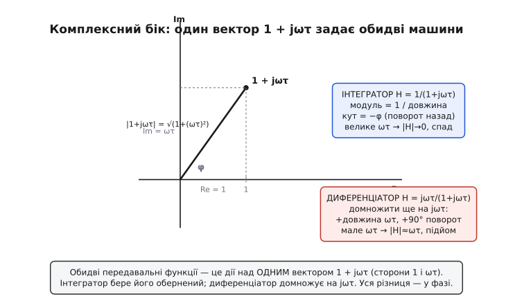
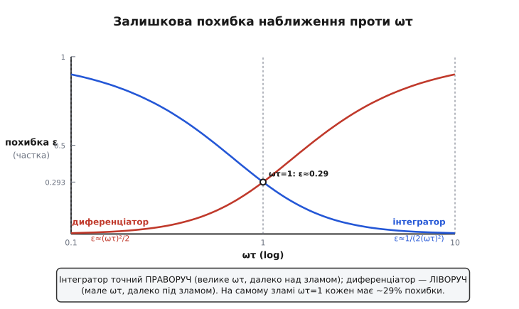

# 🧮 Виведення передавальних функцій і похибки наближення

Часовий опис RC-ланцюжка — напруга як інтеграл струму, струм як похідна напруги — дає правильну інтуїцію, але лишає три питання без точної відповіді. Чому нахил характеристики саме 6 децибел на октаву, а не 5 і не 9? Чому ділення на частоту в одному описі — це те саме, що інтегрування в іншому? І, найважливіше для практика: коли я ставлю RC біля межі його смуги, *наскільки* реальний вихід відхиляється від ідеального ∫ чи d/dt — на відсоток, на десять відсотків? На всі ці питання відповідає один апарат — передавальна функція через комплексний імпеданс. Виведемо її з нуля для обох схем, а тоді витиснемо з неї точну формулу залишкової похибки.

Передавальна функція (англ. *transfer function*) — це відношення виходу до входу як функція частоти, записане так, щоб ним можна було користуватися алгеброю, а не диференціальними рівняннями. Її ідею й загальний зміст [розбирає окрема стаття](topic:hw-analog/transfer-function); тут вона — робочий інструмент: для кожної з двох схем ми отримаємо її явний вигляд і прочитаємо з неї все, що часовий опис лишив на рівні «приблизно».

## Один трюк, що перетворює коло на ділення: jω замість d/dt

Уся складність кіл із конденсаторами в тому, що конденсатор зв'язує струм і напругу через похідну: i = C·(dV/dt). Похідна — це диференціальне рівняння, а їх розв'язувати щоразу наново втомливо. Але є один окремий випадок, де похідна перестає бути операцією й стає простим множенням, — і цей випадок покриває майже всю аналогову схемотехніку.

Розгляньмо суто синусоїдний сигнал. Замість писати V(t) = A·cos(ωt + φ) і тягти за собою фазу окремо, домовимося подавати таку синусоїду одним комплексним числом — її **фазором**: число, чий модуль — це амплітуда A, а аргумент — фаза φ. Реальна напруга — це обертовий вектор A·e^(jωt), а фазор — його «знімок» на нульовий момент. Що тут виграється, видно одразу, щойно ми продиференціюємо цей обертовий вектор:

```
d/dt [ A·e^(jωt) ]  =  jω · A·e^(jωt)
```

Похідна синусоїди — це та сама синусоїда, лише помножена на jω. Операція «взяти похідну в часі» перетворилася на операцію «помножити на jω». Множник j (уявна одиниця, √−1) повертає вектор на 90° — і це точна фізика: похідна синуса є косинус, тобто та сама хвиля, зсунута чверть періоду наперед. Множник ω каже, що швидша хвиля має крутіший нахил, тож більшу похідну. Двоє питань в одному множнику: ω — наскільки, j — куди по фазі.

> 🔧 **Навіщо це.** Цей трюк — не математична краса, а те, чим щодня працює кожен, хто рахує фільтри. Замінивши d/dt на jω, ви викидаєте диференціальні рівняння й рахуєте коло звичайним законом Ома з комплексними числами: послідовно — додаєте опори, паралельно — як завжди, дільник — як завжди. Уся теорія змінного струму тримається на цій одній підстановці; її історія — від операційного числення [Олівера Гевісайда](topic:ph-electromagnetism/impedance/hist-heaviside-steinmetz.md), що ввів сам термін «імпеданс», до комплексного методу Чарлза Штайнмеца, який зробив j оператором повороту на 90°.

Тепер застосуймо це до конденсатора. Його закон i = C·(dV/dt) для синусоїди перетворюється на i = C·(jω)·V, звідки відношення напруги до струму — той самий «опір», лише комплексний:

```
Z_C = V / i = 1 / (jωC)
```

Це **імпеданс** конденсатора (англ. *impedance* — повний опір, комплексний). Прочитаймо його, бо в ньому вже сидить уся подальша поведінка. По-перше, модуль |Z_C| = 1/(ωC) спадає з частотою: на низьких ω конденсатор — майже розрив (опір величезний), на високих — майже коротке замикання. По-друге, множник 1/j = −j повертає фазу на −90°: струм у конденсаторі випереджає напругу на чверть періоду. Цей самий 1/(jωC), поставлений у дільник напруги, і дасть нам обидві передавальні функції — лишилося скласти дільник. Сам [реактивний опір конденсатора X_C = 1/(ωC)](topic:hw-components/capacitive-reactance) — це модуль цього імпедансу; повна ж комплексна форма потрібна саме тут, бо без множника j ми б утратили фазу, а вся різниця між інтегратором і диференціатором — у фазі.

## Інтегратор як дільник: вихід на конденсаторі

RC-інтегратор — це резистор R і конденсатор C послідовно між входом і землею, вихід знімається з конденсатора. Але «послідовно з виходом на одному з двох» — це буквально дільник напруги. У звичайному резистивному дільнику з двох опорів вихід на нижньому плечі дорівнює входу, помноженому на відношення «нижнє плече до суми плечей». Тут плечі — комплексні імпеданси: верхнє R, нижнє Z_C. Записуємо дільник один в один:

```
H(jω) = V_вих / V_вх = Z_C / (R + Z_C)
```

Підставимо Z_C = 1/(jωC) і приберемо дріб у дробі — помножимо чисельник і знаменник на jωC:

```
H(jω) = [ 1/(jωC) ] / [ R + 1/(jωC) ]
      = 1 / ( jωRC + 1 )
      = 1 / ( 1 + jωRC )
```

Ось вона — передавальна функція пасивного RC-інтегратора. У ній сидить добуток RC, тобто стала часу τ, тож зручно одразу записати через неї: H(jω) = 1/(1 + jωτ). Усе, що схема робить із сигналом будь-якої частоти, повністю описане цим одним дробом. Розберімо його на три режими.

**Дуже низькі частоти (ωτ ≪ 1).** Доданок jωτ у знаменнику крихітний проти одиниці, тож H ≈ 1/1 = 1. Сигнал проходить наскрізь без зміни амплітуди й майже без зсуву фази. Конденсатор на низькій частоті — розрив, увесь вхід падає на ньому, на виході повна вхідна напруга. Це смуга, де схема ще *не* інтегрує — вона просто пропускає.

**Дуже високі частоти (ωτ ≫ 1).** Тепер навпаки: одиниця в знаменнику нехтовна проти jωτ, і дріб спрощується до того, що нас цікавить найбільше:

```
H(jω) ≈ 1 / (jωτ) = 1/(jωRC)         (за ωτ ≫ 1)
```

Дивіться, що сталося. Вихід дорівнює входу, **поділеному на jω** (з точністю до сталої 1/τ). А ділити на jω — це, за нашим трюком навпаки, *інтегрувати* в часі: якщо множення на jω було похідною, то ділення на jω є оберненою операцією, інтегралом. Саме тут, високо над зламом, схема стає чесним інтегратором. І це той самий висновок, що часовий опис давав умовою τ ≫ T: великий період означає малу частоту відносно зламу 1/τ, а «високо над зламом» по частоті — це і є «період коротший за τ».

**Точка зламу (ωτ = 1).** Між двома режимами лежить частота, де jωτ за модулем дорівнює одиниці — рівно тоді, коли ω = 1/τ = 1/(RC). Це частота зламу ω꜀ = 1/(RC), або в герцах f꜀ = 1/(2πRC). Тут модуль знаменника |1 + j·1| = √(1²+1²) = √2, тож |H| = 1/√2 ≈ 0.707 — амплітуда падає в √2 раза, тобто рівно на 3 децибели. Звідси й назва «частота −3 дБ»: межа, де схема віддає 70.7% амплітуди й переходить від пропускання до інтегрування.

## Чому нахил саме −6 дБ на октаву: це видно з модуля

Тепер головне число — нахил. Візьмемо модуль передавальної функції. Модуль дробу — це модуль чисельника поділити на модуль знаменника; чисельник 1, знаменник 1 + jωτ із модулем √(1 + (ωτ)²):

```
|H(jω)| = 1 / √( 1 + (ωτ)² )
```

Високо над зламом (ωτ ≫ 1) одиницею під коренем нехтуємо, лишається |H| ≈ 1/(ωτ). Тобто **амплітуда обернено пропорційна частоті**: подвоїли частоту — амплітуда впала вдвічі. Октава (лат. *octava* — восьма; у техніці — подвоєння частоти) — це і є множення частоти на 2. Подивімося, на скільки децибел падає амплітуда за одну октаву.

Децибел означений як 20·log₁₀ від відношення амплітуд. Беремо дві частоти, одна вдвічі вища за іншу, і ділимо їхні підсилення. Оскільки |H| ∝ 1/ω, відношення підсилень дорівнює оберненому відношенню частот, тобто 1/2:

```
Δ(дБ) = 20·log₁₀( |H(2ω)| / |H(ω)| )
      = 20·log₁₀( (1/2ω) / (1/ω) )
      = 20·log₁₀( 1/2 )
      = 20·(−0.301)
      = −6.02 дБ
```

Ось звідки береться 6 дБ/октаву — не з домовленості, а з двох речей разом: з того, що |H| ∝ 1/ω (одне jω у знаменнику), і з того, що децибел має множник 20·log₁₀, а log₁₀(2) = 0.301. Перемножте — і вийде рівно −6.02 дБ на кожне подвоєння частоти. Якби в знаменнику стояло (jω)², амплітуда падала б як 1/ω², відношення за октаву було б 1/4, і нахил став би 20·log₁₀(1/4) = −12 дБ/окт. Кожне jω у знаменнику додає рівно 6 дБ/окт спаду — тому порядок фільтра й нахил жорстко зчеплені. Те саме число в інших одиницях: за декаду (множення частоти на 10) спад буде 20·log₁₀(1/10) = −20 дБ/дек. «6 дБ/окт» і «20 дБ/дек» — один і той самий нахил.

> 🔧 **Навіщо це.** Нахил 6 дБ/окт — це робоча одиниця всієї фільтрової інженерії. Коли в даташиті пишуть «фільтр першого порядку», мають на увазі рівно один множник jω, тобто рівно цей нахил. Треба крутіше зрізати завади — ставлять кілька RC-ланок або вищий порядок, і кожен доданий полюс додає ще 6 дБ/окт. Уміючи читати нахил, ви з однієї характеристики на [діаграмі Боде](topic:hw-analog/bode-plot) одразу бачите порядок схеми й те, скільки RC-ланок усередині.

## Диференціатор як дзеркальний дільник: вихід на резисторі

Тепер та сама пара R і C, але вихід знімається з резистора (а конденсатор стоїть першим, між входом і вузлом виходу). Дільник той самий, лише виходом тепер служить інше плече — резистор. Вихід дорівнює входу, помноженому на «опір плеча виходу до суми плечей», а плече виходу тепер R:

```
H(jω) = V_вих / V_вх = R / (R + Z_C)
```

Підставляємо Z_C = 1/(jωC), множимо чисельник і знаменник на jωC:

```
H(jω) = R / ( R + 1/(jωC) )
      = jωRC / ( jωRC + 1 )
      = jωRC / ( 1 + jωRC )  =  jωτ / (1 + jωτ)
```

Знаменник той самий — той самий злам 1/τ розділяє смуги. Уся різниця в чисельнику: тепер угорі стоїть **jωτ**. Це множення на jω, а множення на jω є диференціюванням. Перевіримо по режимах, дзеркально до інтегратора.

**Дуже низькі частоти (ωτ ≪ 1).** Знаменник ≈ 1, тож H ≈ jωτ. Вихід дорівнює входу, **помноженому на jω** (зі сталою τ). Це чиста похідна в часі. Саме внизу, нижче зламу, схема й диференціює — і це той самий висновок, що часова умова τ ≪ T: малий τ означає високий злам 1/τ, тож робочий сигнал лежить нижче нього.

**Дуже високі частоти (ωτ ≫ 1).** Чисельник і знаменник обидва ростуть як jωτ, їхнє відношення прямує до 1: H ≈ 1. Конденсатор на високій частоті — коротке замикання, увесь вхід проходить на резистор, схема перестає диференціювати й просто пропускає сигнал. Це смуга, де диференціатор уже *не* диференціює.

**Нахил +6 дБ/окт.** Модуль на низьких частотах: чисельник |jωτ| = ωτ, знаменник ≈ 1, тож |H| ≈ ωτ — амплітуда **прямо пропорційна частоті**. Подвоїли частоту — подвоїли амплітуду. Те саме обчислення в децибелах, але відношення підсилень тепер 2, а не 1/2:

```
Δ(дБ) = 20·log₁₀( |H(2ω)| / |H(ω)| )
      = 20·log₁₀( 2ωτ / ωτ )
      = 20·log₁₀( 2 )
      = +6.02 дБ
```

Підйом +6 дБ/окт — дзеркало спаду інтегратора, і з тієї самої причини: одне jω, цього разу в чисельнику, дає |H| ∝ ω, а 20·log₁₀(2) = +6.02. Повна симетрія: інтегратор ділить на jω і спадає, диференціатор множить на jω і зростає, та сама стала τ задає обом точку перелому.


*Знаменник 1 + jωτ — той самий вектор для обох схем: дійсна частина 1, уявна ωτ. Інтегратор бере обернений до нього модуль (1/довжина) і протилежний кут; диференціатор домножує ще на jωτ, додаючи довжину ωτ і поворот на +90°. Уся поведінка обох машин — геометрія одного трикутника зі сторонами 1 і ωτ.*

## Фаза: чому −90° і +90° — це межі, а не сталі

Часто кажуть «інтегратор зсуває на −90°, диференціатор на +90°». Це правда лише глибоко в робочій смузі, а біля зламу фаза інша — і передавальна функція показує точно, яка. Фаза H — це аргумент комплексного числа, тобто арктангенс відношення уявної частини до дійсної.

Для інтегратора H = 1/(1 + jωτ): знаменник має фазу +arctan(ωτ), а оскільки він у знаменнику, фаза виходу — мінус ця величина:

```
φ_інт = − arctan(ωτ)
```

На низькій частоті ωτ → 0, arctan(0) = 0 — зсуву нема, сигнал проходить у фазі. На зламі ωτ = 1, arctan(1) = 45° — зсув рівно −45° (а не −90°!). І лише високо над зламом ωτ → ∞, arctan → 90° — аж там зсув наближається до −90°. Тобто чесний інтегральний зсув −90° схема дає тільки в тій самій смузі, де вона чесно інтегрує; на зламі вона зсуває вдвічі менше. Для диференціатора H = jωτ/(1 + jωτ): чисельник jωτ додає +90°, знаменник віднімає arctan(ωτ), разом:

```
φ_диф = 90° − arctan(ωτ)
```

На низькій частоті це 90° − 0 = +90° (чиста похідна), на зламі 90° − 45° = +45°, високо вгорі 90° − 90° = 0° (просто пропускання). Фаза й амплітуда — два боки одного дробу: де схема працює (інтегрує/диференціює), там і фаза доходить до своїх ±90°; де перестає, там фаза сповзає до нуля.

## Головне число для практика: похибка наближення на межі смуги

Тепер найкорисніше. Ідеальний інтегратор має H_ідеал = 1/(jωτ) — рівно ділення на jω. Реальна схема дає H = 1/(1 + jωτ). Ці два збігаються тільки в межі ωτ → ∞; на скінченній частоті між ними є розбіжність, і ось точна її міра. Поділимо реальне на ідеальне:

```
H / H_ідеал = [ 1/(1+jωτ) ] / [ 1/(jωτ) ]
            = jωτ / (1 + jωτ)
```

Цікаво й симетрично: похибковий множник інтегратора — це **передавальна функція диференціатора**, і навпаки. Нас цікавить, наскільки модуль цього множника відрізняється від ідеальної одиниці. Його модуль:

```
| H / H_ідеал | = ωτ / √( 1 + (ωτ)² )
```

Це число завжди трохи менше за 1 — реальний інтегратор завжди віддає трохи *менше* за ідеальний (та сама «дірявість» із часового опису, тепер у числі). Запровадимо безрозмірне відношення, яке все вирішує: r = ωτ = τ/(період/2π), тобто скільки сталих часу «вміщається» в період сигналу. Чим вище над зламом працюємо, тим більше r, тим ближче множник до одиниці. Випишемо відносну похибку амплітуди ε як відхилення від ідеальної одиниці:

```
ε = 1 − r/√(1 + r²)        (r = ωτ)
```

Для практики r зазвичай велике (працюємо ж далеко над зламом), і тут формула гарно спрощується. За великого r розкладемо √(1 + r²) = r·√(1 + 1/r²) ≈ r·(1 + 1/(2r²)), звідки r/√(1+r²) ≈ 1/(1 + 1/(2r²)) ≈ 1 − 1/(2r²). Залишкова похибка інтегрування:

```
ε ≈ 1 / (2·r²) = 1 / (2·(ωτ)²)        (для ωτ ≫ 1)
```

Похибка падає **як квадрат** відношення ωτ. Це потужний важіль: відсунули робочу частоту від зламу вдвічі — похибка впала вчетверо. Порахуймо в конкретних числах, бо саме так це й застосовують.

**Умова: інтегруємо сигнал із періодом T, поставивши τ = RC у 5 разів більшим за період (τ = 5T). Яка похибка амплітуди?**

```
ω = 2π/T                      кутова частота сигналу
ωτ = (2π/T)·(5T) = 10π ≈ 31.4   безрозмірне відношення r
ε ≈ 1/(2·31.4²) = 1/1972 ≈ 0.00051
```

Похибка близько 0.05% — інтеграл точний до півтисячної. А тепер протилежний край, де RC ставлять економно, лише трохи більшим за період:

**Умова: τ = T (стала часу дорівнює одному періоду).**

```
ωτ = 2π ≈ 6.28
ε ≈ 1/(2·6.28²) = 1/78.9 ≈ 0.0127  →  ≈ 1.3%
```

Уже 1.3% — на межі того, що ще терпиме для згладжування, але замало для точного інтегрування. А якщо τ дорівнює лише половині періоду (ωτ = π ≈ 3.14), формула наближення вже гранична, тож порахуймо точно: r/√(1+r²) = 3.14/√(1+9.87) = 3.14/3.30 = 0.952, тобто ε ≈ 4.8%. Звідси й береться інженерне правило «τ хоча б у кілька разів більша за період»: воно прямо випливає із закону ε ≈ 1/(2(ωτ)²) — три-п'ять сталих часу на період заганяють похибку під відсоток.

Для диференціатора все дзеркально. Ідеал H_ідеал = jωτ, реальність H = jωτ/(1 + jωτ), їхнє відношення:

```
H / H_ідеал = 1 / (1 + jωτ)
```

— тепер похибковий множник є передавальною функцією *інтегратора*. Його модуль 1/√(1 + (ωτ)²); диференціатор працює внизу, де ωτ мале, тож тут зручно мале ωτ. Розкладемо √(1 + (ωτ)²) ≈ 1 + (ωτ)²/2, і відносна похибка амплітуди:

```
ε ≈ (ωτ)² / 2        (для ωτ ≪ 1)
```

Дзеркало інтеграторської формули: там було 1/(2(ωτ)²), тут (ωτ)²/2 — у одного велике ωτ у знаменнику, у другого мале ωτ у чисельнику, а коефіцієнт ½ той самий. Похибка диференціатора теж падає квадратично, але вже коли ωτ *зменшується*: менший τ — чистіша похідна.

**Умова: диференціюємо сигнал із періодом T, поставивши τ = T/10. Похибка?**

```
ωτ = (2π/T)·(T/10) = 2π/10 ≈ 0.628
ε ≈ 0.628²/2 = 0.197         →  ≈ 20%
```

Аж 20% — несподівано багато! Це показує важливу річ: правило «τ ≪ T» вимагає *набагато* меншого, ніж здається. τ менше періоду в 10 разів дає ще 20% похибки; щоб збити її під відсоток, треба ωτ ≈ 0.14, тобто τ менше періоду разів у сорок п'ять. Диференціатор куди вибагливіший до запасу за смугою, ніж інтегратор, — і формула ε ≈ (ωτ)²/2 каже точно, наскільки.


*Дві дзеркальні криві похибки. Інтегратор (праворуч) тим точніший, чим далі вгору за зламом працює: ε тане як 1/(ωτ)². Диференціатор (ліворуч) тим точніший, чим нижче за зламом: ε тане як (ωτ)². На самому зламі ωτ = 1 кожен дає ε = 1 − 1/√2 ≈ 0.293, тобто майже 30% — біля зламу інтегрувати чи диференціювати не можна взагалі.*

Звернімо увагу на точку зламу окремо, бо вона повчальна. Підставивши ωτ = 1 у точну формулу ε = 1 − ωτ/√(1+(ωτ)²), дістанемо ε = 1 − 1/√2 = 1 − 0.707 = 0.293. Майже 30% похибки рівно на частоті зламу — для обох схем однаково. Це кількісно ставить крапку в питанні «а що як працювати прямо на зламі»: не можна, бо там жодна з операцій не виконується навіть наближено, схема в цій точці — ні те ні се, перехідна зона завширшки приблизно октава в кожен бік.

## Що цей апарат повертає в саму тему

Тепер три питання, з яких ми почали, мають точні відповіді — і всі троє вийшли з одного дробу. Передавальна функція інтегратора 1/(1 + jωτ) і диференціатора jωτ/(1 + jωτ) — це той самий дільник напруги, лише вихід знятий із різних плечей; той самий знаменник дає їм спільний злам 1/(RC). Нахил 6 дБ/окт виявився не домовленістю, а добутком двох чисел — одного jω (звідки |H| ∝ ω^±1) і множника 20·log₁₀ у децибелі (звідки 0.301 на октаву); кожне додане jω додає рівно цей нахил. Ділення на jω в частотній області — це інтегрування в часовій, множення на jω — диференціювання, бо саме так jω означене через d/dt на синусоїді. А похибка наближення впала в точну формулу: для інтегратора ε ≈ 1/(2(ωτ)²), для диференціатора ε ≈ (ωτ)²/2 — обидві квадратичні, дзеркальні, з тим самим коефіцієнтом ½, і обидві дають 29% на самому зламі. Інженерне правило «τ у кілька разів більша (чи менша) за період» — це і є вимога відсунутися від зламу настільки, щоб квадратичний закон загнав ε під потрібний відсоток.
