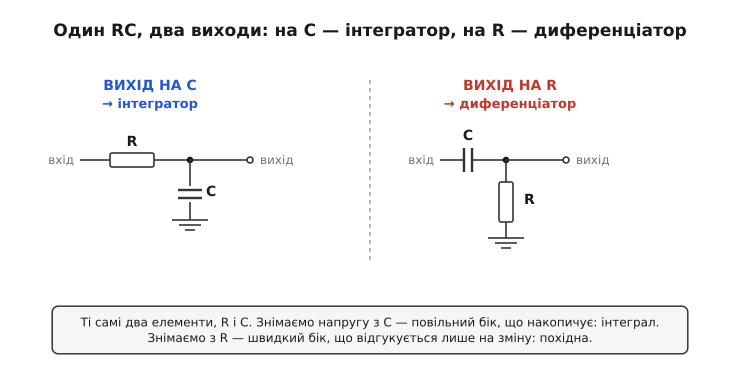
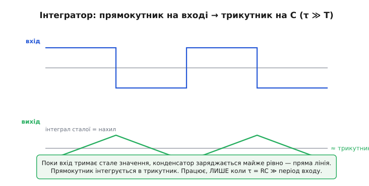
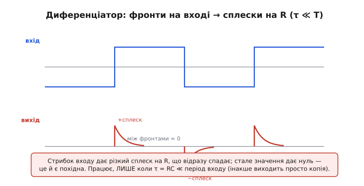
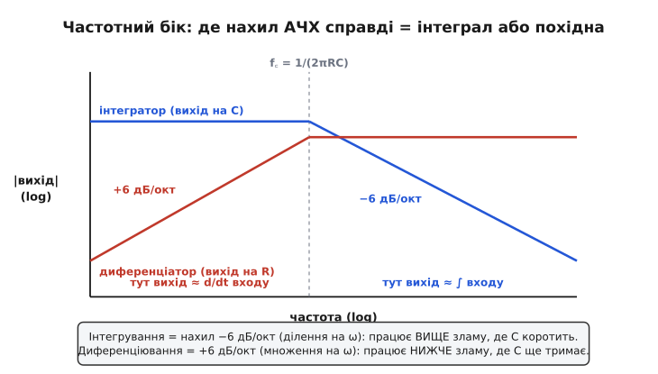

# RC-інтегратор і диференціатор

Дві найдешевші математичні машини в електроніці — це резистор і конденсатор, поставлені поряд. З тих самих двох деталей, лише змінивши, з якого боку знімати напругу, ви дістаєте або інтеграл вхідного сигналу в часі, або його похідну. Жодного живлення, жодної мікросхеми — сама фізика заряду робить обчислення. Варто зрозуміти, *чому* це працює, бо та сама ідея потім повертається у фільтрах, у формуванні фронтів, у згладжуванні шумних показів давача — скрізь, де треба «накопичити» або «зреагувати лише на зміну».

Інтеграл (лат. *integer* — цілий, нерозділений) — це накопичена сума, площа під кривою сигналу. Похідна (лат. *derivare* — відводити, відгалужувати) — це швидкість зміни, нахил кривої цієї миті. Конденсатор уміє і те, і те, бо його напруга — це накопичений заряд, а струм крізь нього — це швидкість, з якою заряд міняється. Уся стаття росте з одного фізичного рівняння конденсатора, тож почнімо з нього.

## Звідки в конденсаторі ховається калькуляція

Конденсатор тримає заряд Q пропорційно до напруги на ньому: Q = C·V. Струм — це потік заряду за секунду, тобто швидкість зміни Q. Продиференціюймо першу рівність — і дістанемо стрижневий закон конденсатора:

```
i = C · (dV/dt)
```

Прочитаймо його двома різними поглядами, і кожен дасть свою машину.

**Погляд інтегратора.** Перепишемо закон навпаки — виразимо напругу через струм:

```
V(t) = (1/C) · ∫ i dt
```

Напруга на конденсаторі — це *проінтегрований* струм. Конденсатор за самою своєю природою накопичує: він додає весь струм, що в нього втік, і тримає підсумок як напругу. Якщо ми примусимо крізь нього текти струм, пропорційний вхідному сигналу, то напруга на ньому стане інтегралом цього сигналу. Як цього домогтися найдешевше — поставити перед конденсатором резистор.

**Погляд диференціатора.** А ось і прямий бік: струм крізь конденсатор пропорційний *похідній* напруги на ньому. Поки напруга стоїть на місці, струму нема взагалі — конденсатор повністю заряджений і нічого не пропускає. Щойно напруга смикнулася, тече струм, тим більший, чим різкіший ривок. Якщо ми перетворимо цей струм на напругу (знову ж таки резистором), дістанемо сигнал, пропорційний швидкості зміни входу.

Отже, обидві машини — це той самий резистор R і той самий конденсатор C, з'єднані послідовно між входом і землею. Уся різниця — звідки знімати вихід: з конденсатора чи з резистора.


*Один і той самий RC-ланцюжок дає дві протилежні операції залежно від точки знімання: повільний бік (конденсатор) накопичує — це інтеграл; швидкий бік (резистор) відгукується лише на зміну — це похідна.*

> 🔧 **Навіщо це.** Часто не треба ні процесора, ні коду. Згладити сигнал кнопки від брязкоту контактів, витягти лише фронт тактового імпульсу, зробити просту лінію затримки, отримати з прямокутника пилкоподібну розгортку — усе це робить пара R і C за копійки й без жодного такту обчислень. Розуміючи, який бік RC що рахує, ви бачите половину аналогової схемотехніки одразу.

## Інтегратор: повільний бік, що накопичує

Зберемо RC-ланцюжок і знімемо вихід із конденсатора. Вхідна напруга через резистор заганяє струм у конденсатор, той заряджається, і напруга на ньому повзе вгору. Що тут роль R? Резистор обмежує струм. За законом Ома струм у будь-яку мить — це (V_вх − V_C) / R: різниця між тим, що на вході, і тим, що вже накопичилося, поділена на опір.

Тут і ховається пастка. Щоб вихід був *чесним* інтегралом входу, струм має залежати тільки від V_вх, а не від V_C. Тобто накопичена напруга V_C мусить лишатися крихітною супроти V_вх — інакше вона починає сама гальмувати власне заряджання, і замість прямої лінії виходить загнута вниз експонента. Умова чесного інтегрування одна:

```
V_C ≪ V_вх   ⇔   τ = R·C  ≫  період вхідного сигналу
```

Стала часу τ = RC (грецька τ, *tau*) — це характерний час, за який конденсатор устигає помітно зарядитися. Якщо τ набагато більша за період сигналу, конденсатор за один період ледь зрушується з місця, працює на самому початку своєї експоненти — а початок експоненти майже прямий. Виходить лінійне накопичення: справжній інтеграл. [Сталу часу τ = RC та її експоненційний сенс](topic:hw-analog/rc-time-constant) розбираємо окремо — тут досить знати, що це час «розгону» конденсатора.

Подивімось на класичний дослід: подамо на вхід прямокутну хвилю.


*Поки вхід тримає стале високе значення, конденсатор заряджається майже рівномірно — пряма похила лінія; на низькому рівні так само рівно розряджається. Інтеграл сталої — це лінійний нахил, тож прямокутник стає трикутником. Працює лише за τ ≫ T.*

Чому прямокутник дає трикутник, видно прямо з означення. Інтеграл сталої величини — це лінійно зростаюча величина: ∫ (стале) dt = (стале)·t. Поки вхід тримає верхній рівень, інтеграл рівномірно росте — пряма вгору. Щойно вхід падає на нижній рівень, інтеграл рівномірно спадає — пряма вниз. З'єднайте ці прямі — і маєте трикутну хвилю. Це не наближення «на вигляд», а буквально те, що означає інтегрувати прямокутник.

**Чому інтегратор завжди «дірявий».** Пасивний RC-інтегратор має вбудовану ваду: він не лише накопичує, а й потроху «забуває». Накопичена напруга V_C сама створює струм назад крізь резистор і помалу стікає. Тому такий інтегратор називають дірявим (англ. *leaky integrator* — інтегратор із витоком): він інтегрує лише свіже минуле, а далеке поступово тане. Для багатьох задач — навіть бажано (постійна складова не накопичується нескінченно), але якщо потрібен ідеальний інтеграл без витоку, беруть [операційний підсилювач](topic:hw-analog/ideal-opamp), що активно тримає V_C біля нуля й знімає це обмеження.

> 🔧 **Навіщо це.** Дірявий інтегратор — це і є та сама проста ланка згладжування (RC-фільтр), яку ставлять на вихід ШІМ, щоб дістати з нього майже постійну напругу, або на вхід АЦП, щоб приглушити викиди. «Дірявість» тут не вада, а корисна риса: схема пам'ятає недавнє середнє й сама забуває застарілі дані. Та сама ланка на вході давача усереднює шум, не вимагаючи жодного рядка коду.

## Диференціатор: швидкий бік, що відгукується на зміну

Тепер той самий ланцюжок, але вихід знімаємо з резистора, а конденсатор ставимо першим — між входом і вузлом виходу. Логіка дзеркальна. Струм крізь конденсатор пропорційний швидкості зміни напруги на ньому; цей струм тече крізь резистор; напруга на резисторі (наш вихід) дорівнює цьому струму, помноженому на R. Складемо ланцюжок:

```
V_вих = R · i = R · C · (dV_вх/dt) = τ · (dV_вх/dt)
```

Вихід пропорційний похідній входу — швидкості його зміни. Поки вхід стоїть, струму нема, вихід нуль. Щойно вхід різко смикнувся — конденсатор пропускає короткий імпульс струму, і на резисторі вискакує сплеск.

Умова чесного диференціювання дзеркальна до інтеграторської. Щоб вихід відповідав похідній, конденсатор має встигати повністю реагувати на кожну зміну — тобто заряджатися й розряджатися *швидше*, ніж міняється сигнал:

```
τ = R·C  ≪  період вхідного сигналу
```

Якщо τ замала, конденсатор миттю відпрацьовує кожен фронт і встигає «забути» його до наступного — саме це й потрібно для похідної. Якщо ж τ завелика, конденсатор не встигає розрядитися між змінами, тримає заряд, і схема перестає диференціювати — вихід стає просто послабленою копією входу.


*Кожен стрибок входу породжує різкий сплеск на резисторі, який одразу спадає; між фронтами, поки вхід сталий, вихід дорівнює нулю. Це і є похідна: ненульова лише в моменти зміни. Працює лише за τ ≪ T.*

Сплеск спадає, а не тримається, бо щойно конденсатор зарядився до нового рівня входу, струм припиняється — і вихід падає назад до нуля з тією самою сталою часу τ. Висота сплеску показує, наскільки *різким* був фронт: круте наростання дає високий вузький пік, повільне — низький широкий. Це буквальне зображення похідної: де вхід міняється швидко, там вихід великий.

> 🔧 **Навіщо це.** Диференціатор виділяє події — моменти, коли щось *змінилося*. Найпоширеніше застосування: схема виявлення фронту, що з довгого рівневого сигналу робить короткий імпульс «ось тут почалося». Так формують імпульси запуску, ловлять натискання, перетворюють повільний перепад на чіткий тригерний фронт. Зворотний бік — диференціатор підкреслює й шум (бо шум — це швидкі зміни), тому в чистому вигляді його застосовують обережно і часто обмежують згори.

## Один погляд на обидві машини: частота

Часовий опис — інтуїтивний, але є другий, який одразу пояснює і умови τ, і чому ті самі схеми ще звуть фільтрами. Подивімось на конденсатор не як на накопичувач заряду, а як на опір, що залежить від частоти.

[Реактивний опір конденсатора](topic:hw-components/capacitive-reactance) — величина X_C = 1/(2πfC) — спадає зі зростанням частоти: для повільних сигналів конденсатор майже розрив, для швидких — майже коротке замикання. RC-ланцюжок виходить як дільник напруги, у якому одне плече (конденсатор) міняє свій опір залежно від частоти. Звідси все й випливає.

**Інтегратор — це фільтр нижніх частот.** Вихід знімаємо з конденсатора. На низьких частотах X_C велике, майже вся вхідна напруга падає на конденсаторі — сигнал проходить. На високих X_C мале, конденсатор шунтує вихід на землю — сигнал гасне. Вище частоти зламу f꜀ = 1/(2πRC) підсилення спадає рівно на 6 децибел на октаву (вдвічі на кожне подвоєння частоти). Цей нахил −6 дБ/окт — це ділення амплітуди на частоту ω, а ділити на ω в частотній області означає інтегрувати в часовій. Тому вище зламу — там, де схема ріже високі, — вона саме й працює інтегратором.

**Диференціатор — це фільтр верхніх частот.** Вихід із резистора. Тепер навпаки: на низьких частотах конденсатор-розрив не пускає сигнал, на резисторі майже нуль; на високих конденсатор-замкнення пропускає все, сигнал на резисторі повний. Нижче зламу підсилення *зростає* на +6 дБ/окт — а множення на ω в частотній області означає диференціювання в часовій. Тому нижче зламу схема працює диференціатором.


*Інтегрування відповідає спаду −6 дБ/окт (ділення на ω) і працює вище частоти зламу, де конденсатор уже коротить. Диференціювання — підйом +6 дБ/окт (множення на ω) і працює нижче зламу, де конденсатор ще тримає напругу. Точка зламу f꜀ = 1/(2πRC) — спільна межа обох операцій.*

Звідси й вилазять обидві умови τ, тепер уже без окремого пояснення. Інтегрувати треба сигнали *вище* зламу, тобто з періодом меншим за τ — а це і є τ ≫ T. Диференціювати треба *нижче* зламу, з періодом більшим за τ — тобто τ ≪ T. Часова умова й частотна — це те саме твердження двома мовами. [Формальне виведення передавальних функцій і умов точності](topic:hw-analog/rc-integrator-differentiator/math-rc-transfer.md) подане окремо — там показано з рівнянь, чому нахил саме 6 дБ/окт і яка похибка лишається на межі смуги.

## Порахуймо у прошивці

Найкорисніше, що дає цей розділ програмісту вбудованих систем, — це навіть не сама схема, а її цифровий двійник. Дірявий інтегратор — це точнісінько експоненційне згладжування (англ. *exponential moving average*), яким приглушують шумний АЦП. Та сама фізика, той самий τ, лише замість заряду — змінна в пам'яті. Покажемо обидва боки на реальному C.

**Умова: сигнал давача з періодом близько 1 мс, частота опитування 10 кГц (крок 0.1 мс). Згладити шум RC-інтегратором зі сталою часу τ = 5 мс.**

:::tabs

```c
// Цифровий двійник RC-інтегратора (дірявого): експоненційне згладжування.
// V_out += (dt/τ) · (V_in − V_out)  — рівно те, що робить конденсатор за крок dt.
#include <stdint.h>

static float v_out = 0.0f;          // «напруга на конденсаторі» — згладжений вихід

float rc_integrate(float v_in) {
    const float dt    = 0.1e-3f;    // крок опитування, 0.1 мс
    const float tau   = 5.0e-3f;    // стала часу RC, 5 мс
    const float alpha = dt / tau;   // частка нового струму за крок ≈ 0.02
    v_out += alpha * (v_in - v_out);
    return v_out;
}
```

```micropython
# Цифровий двійник RC-інтегратора (дірявого): експоненційне згладжування.
# v_out += (dt/τ) · (v_in − v_out) — рівно те, що робить конденсатор за крок dt.
DT    = 0.1e-3     # крок опитування, 0.1 мс
TAU   = 5.0e-3     # стала часу RC, 5 мс
ALPHA = DT / TAU   # частка нового струму за крок ≈ 0.02

_v_out = 0.0       # «напруга на конденсаторі» — згладжений вихід

def rc_integrate(v_in):
    global _v_out
    _v_out += ALPHA * (v_in - _v_out)
    return _v_out
```

:::

Розберімо рядок `v_out += alpha * (v_in - v_out)`. Різниця `(v_in - v_out)` — це та сама (V_вх − V_C), що задає струм у схемі. Множник `alpha = dt/τ` каже, яку *частку* цієї різниці конденсатор устигає накопичити за один крок dt. Оскільки τ (5 мс) набагато більша за період сигналу (1 мс), alpha виходить мала (0.02) — за крок вихід зрушується ледь-ледь, рівно як заряд у схемі за τ ≫ T. Так і має бути: чим сильніше згладжуємо, тим повільніше реагуємо.

А ось дзеркальний бік — диференціатор, що дає лише зміну між сусідніми відліками:

:::tabs

```c
// Цифровий двійник RC-диференціатора: вихід ∝ швидкості зміни входу.
static float v_prev = 0.0f;

float rc_differentiate(float v_in) {
    const float dt  = 0.1e-3f;          // крок 0.1 мс
    const float tau = 5.0e-3f;          // та сама стала часу
    float deriv = tau * (v_in - v_prev) / dt;   // τ · dV/dt
    v_prev = v_in;
    return deriv;                       // сплеск на зміні, нуль на сталому вході
}
```

```micropython
# Цифровий двійник RC-диференціатора: вихід ∝ швидкості зміни входу.
DT  = 0.1e-3       # крок 0.1 мс
TAU = 5.0e-3       # та сама стала часу

_v_prev = 0.0

def rc_differentiate(v_in):
    global _v_prev
    deriv = TAU * (v_in - _v_prev) / DT   # τ · dV/dt
    _v_prev = v_in
    return deriv                          # сплеск на зміні, нуль на сталому вході
```

:::

Тут `(v_in - v_prev)/dt` — це чисельна похідна (приріст за крок), а множення на τ дає ту саму амплітуду сплеску, що й R·C·(dV/dt) у залізі. На сталому вході сусідні відліки рівні, різниця нуль — і вихід нуль, точно як аналоговий диференціатор мовчить між фронтами. Видно й вроджену проблему: якщо у `v_in` є шум, різниця сусідніх відліків його роздуває — тому диференціатор у прошивці майже завжди пускають слідом за згладжуванням.

## Де ці дві машини стрічаються в реальній схемі

Підсумуймо причинно, а не списком. Уся поведінка обох схем — це одне рівняння конденсатора, прочитане з двох боків: напруга на ньому є інтегралом струму, а струм крізь нього є похідною напруги. Поставивши резистор перед конденсатором і знявши вихід із конденсатора, дістаємо інтегратор — повільну ланку, що накопичує й згладжує, чесну доти, доки τ ≫ T. Помінявши деталі місцями й знявши вихід із резистора, дістаємо диференціатор — швидку ланку, що реагує лише на зміну, чесну доти, доки τ ≪ T. Той самий злам f꜀ = 1/(2πRC) розділяє дві смуги: вище нього RC інтегрує й ріже високі, нижче — диференціює й ріже низькі.

Тому ці два кола ніколи не бувають екзотикою. Кожен RC-фільтр на платі — це з погляду форми сигналу або інтегратор, або диференціатор; кожне коло формування фронтів, виявлення подій, згладжування показів — це вони ж. А найдешевший спосіб приборкати шум давача в коді — їхній цифровий двійник у три рядки. Розумієте дві деталі та з якого боку знімати напругу — і ціла родина аналогових ланок стає очевидною.
