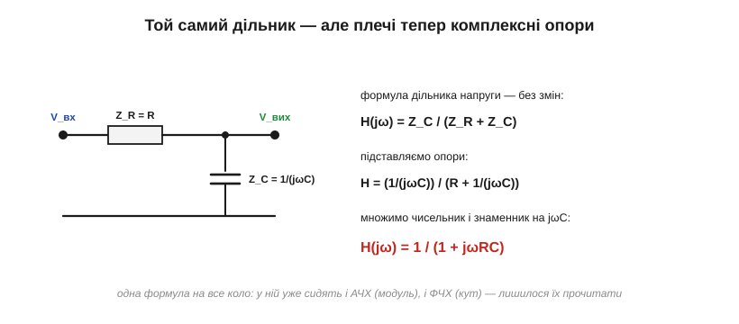
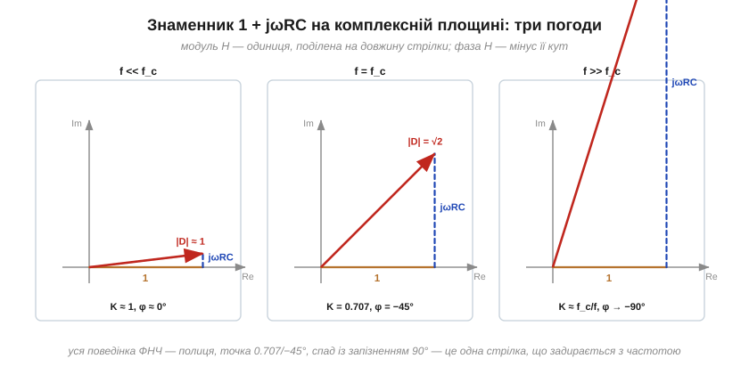
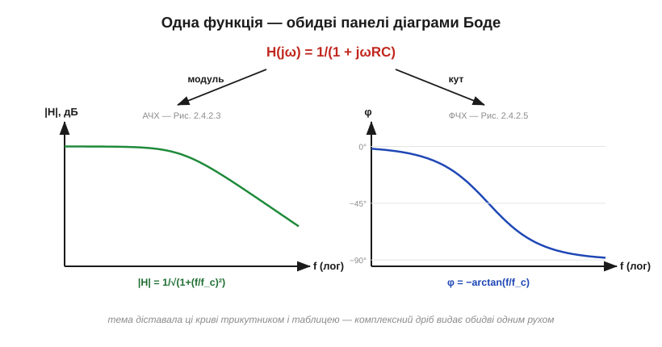

# 🧮 Передавальна функція RC: модуль і фаза з одного дробу

> Це математична вставка про передавальну функцію [RC-фільтра низьких частот](topic:hw-analog/rc-low-pass). Коефіцієнт передачі K(f) можна діставати трикутником опорів, а фазу — окремою таблицею. Тут той самий результат вийде за два рядки — мовою [чисел-стрілок (фазорів)](topic:ph-electromagnetism/phasors), і не парою формул, а **однією**, в якій сидить усе: і АЧХ, і ФЧХ, і слово «полюс» із діаграм Боде.

### Дільник, у якого плечі — комплексні

Для синусоїд конденсатор поводиться як комплексний «опір» Z_C = 1/(jωC), а правило дільника напруги працює з такими опорами так само, як зі звичайними резисторами. Тоді відповідь ФНЧ записується одразу:


*Формула дільника → підстановка опорів → множимо чисельник і знаменник на jωC. Два рядки алгебри — і все коло стиснулося в один дріб.*

```
H(jω) = Z_C/(Z_R + Z_C) = (1/(jωC))/(R + 1/(jωC)) = 1/(1 + jωRC)
```

Цей дріб зветься **передавальною функцією** (*transfer function*): він каже, на що множиться вхідна «стрілка», щоб стати вихідною, — для кожної частоти ω = 2πf. Комплексне число множить стрілку двома способами одночасно: **розтягує** (модуль) і **повертає** (кут). Тож в одному H уже запаковані обидві характеристики кола.

### Читаємо модуль: АЧХ

Модуль дробу — модуль чисельника, поділений на модуль знаменника. Знаменник 1 + jωRC — це стрілка з катетами 1 і ωRC, її довжина √(1 + (ωRC)²). Отже:

```
|H| = 1/√(1 + (ωRC)²) = 1/√(1 + (f/f_c)²),   де f_c = 1/(2πRC)
```

— знайома формула теми, тільки трикутник тепер намалювався сам: він просто **і є** знаменник на комплексній площині.

### Читаємо кут: ФЧХ

Кут дробу — кут чисельника **мінус** кут знаменника (ділення обертає у зворотний бік). Чисельник — одиниця, кут нуль; знаменник задертий на arctan(ωRC/1). Тому:

```
φ = −arctan(f/f_c)
```

І вся таблиця фаз теми випливає з однієї стрілки: на низьких частотах вона лежить уздовж дійсної осі (φ ≈ 0), на f = f_c її катети рівні — кут 45°, довжина √2 (ось звідки **одночасно** 0.707 і −45°: це не збіг, а одна й та сама стрілка!), а високо вгорі вона майже вертикальна — φ → −90°, |H| ≈ f_c/f:


*Три погоди одного знаменника. Що вища частота, то довша уявна «нога» jωRC: стрілка довшає (передача падає) і задирається (фаза відстає). Полиця, точка −3 дБ/−45° і спад із запізненням — один малюнок.*

### Чому jω взагалі законний

Звідки право заміняти похідну на множення? У лінійному колі [синус лишається синусом](topic:hw-analog/frequency-response) — міняються лише амплітуда й фаза. А для стрілки, що обертається як e^(jωt), похідна за часом — це [множення на jω](topic:ph-electromagnetism/phasors). Тому закон конденсатора i = C·dv/dt, [що й породжує цей jωC](topic:ph-electromagnetism/capacitance/math-derivative-current.md), перетворюється на «омівське» I = jωC·V — і вся машинерія [диференціальних рівнянь RC-кола](topic:hw-analog/rc-time-constant/math-exponential-ode.md) для синусоїд згортається в алгебру дробів. У цьому й сенс методу: **диференціювати важко, ділити легко**.

### Той самий метод — будь-яке коло

Рецепт загальний: запиши імпеданси → склади дільник → прочитай модуль і кут. [Фільтр високих частот](topic:hw-analog/rc-high-pass) — просто інший вихід того самого дільника:

```
H = R/(R + 1/(jωC)) = jωRC/(1 + jωRC)
|H| = 1/√(1 + (f_c/f)²)        φ = 90° − arctan(f/f_c)
```

Обидві формули [фільтра високих частот](topic:hw-analog/rc-high-pass) — включно з «випередженням до +90°» — випали автоматично: чисельник jωRC сам додає свої +90°. Так само за хвилину виводиться [LC-фільтр, смуговий контур чи будь-яка інша драбинка](topic:hw-analog/lc-rlc-filters).


*H(jω) = 1/(1+jωRC) розщеплюється на модуль (АЧХ) і кут (ФЧХ) — рівно ті дві панелі, з яких складається [діаграма Боде](topic:hw-analog/bode-plot).*

І ще один місток до мови Боде. На [діаграмі Боде](topic:hw-analog/bode-plot) злам характеристики звуть «полюсом». Видно, де він живе у формулі: це частота, на якій знаменник передавальної функції «вмикає» свою уявну частину — ωRC стає одиницею, і дріб починає падати. Один знаменник першого степеня — один полюс — −20 дБ/дек; у фільтра другого порядку в знаменнику сидить ω² — два полюси. Слова з графіків і символи з формул — одна й та сама анатомія кола.

### Де це працює

Передавальна функція — робоча мова всієї інженерії сигналів: каскади множаться як дроби H₁·H₂ (тому їхні [децибели](topic:hw-analog/decibels) додаються), взаємне навантаження каскадів видно як зміну знаменника, а коли в [операційних підсилювачах](topic:hw-analog/ideal-opamp) мова заходить про стійкість петлі, саме H петлі вирішує, чи завиє схема (це й привело [Гендріка Боде](topic:hw-analog/frequency-response/hist-bode.md) до його діаграм). Хто вміє записати H(jω) дільником і прочитати з нього модуль та кут — тому більше не потрібні готові формули фільтрів: вони виводяться швидше, ніж шукаються.
