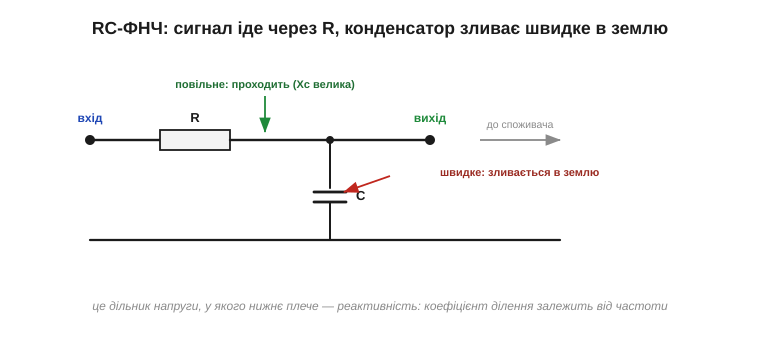
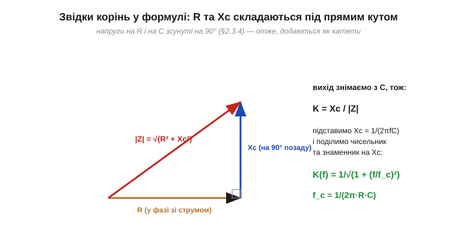
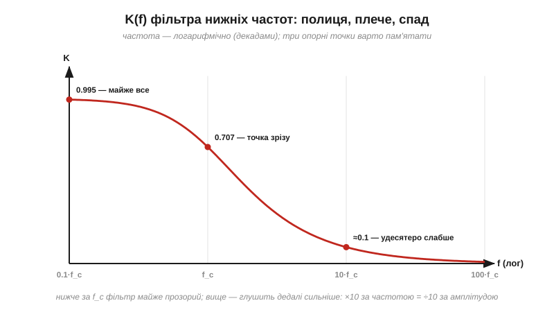
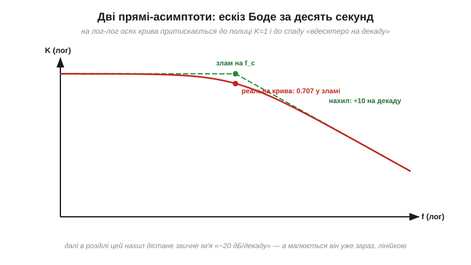
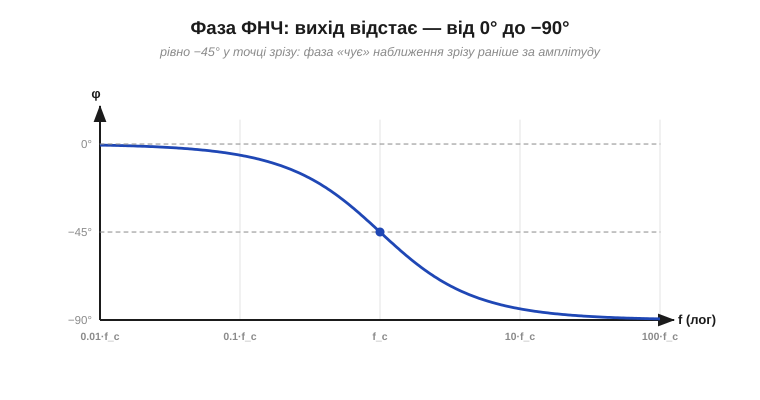
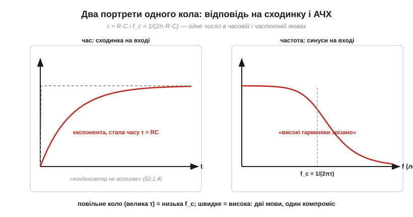
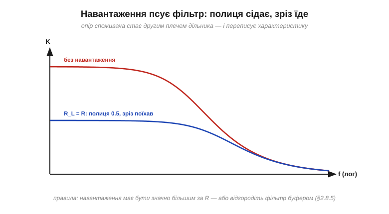

# RC-фільтр низьких частот: частота зрізу

Резистор у шлях сигналу, конденсатор у землю — і коло пропускає повільне, ріже швидке. Зробімо з цього ескіза робочий інструмент: чесну формулу K(f), одну характерну точку, яку треба знати напам'ять, і пару прямих, якими ця крива малюється за десять секунд. RC-фільтр нижніх частот — мабуть, найтиражованіше коло в електроніці взагалі: він стоїть на входах вимірювань, у колах живлення, в аудіотрактах, у лініях скидання — а головне, він є **мимоволі** скрізь, де є опір і ємність. Розібравши його один раз як слід, ви отримаєте ключ до половини схем, які будь-коли побачите.

### Схема і механізм


*Сигнал іде до виходу через R; конденсатор підпирає вихід знизу. Для повільних складників Xc величезна — зливати нікуди, все доходить до виходу. Для швидких Xc мізерна — вони стікають у землю, не дійшовши. Це дільник напруги, в якого нижнє плече залежить від частоти.*

**Фільтр нижніх частот** (*low-pass filter*, ФНЧ) — це [дільник напруги](root:hw-analog/voltage-divider) з резистором угорі та конденсатором унизу. Вся частотна поведінка успадкована від [ємнісного реактивного опору](root:hw-components/capacitive-reactance) Xc = 1/(2πfC): нижнє плече дільника «тане» зі зростанням частоти, і дедалі менша частка вхідної напруги дістається виходу.

### Виводимо K(f)

Скільки саме дістається? Для звичайного дільника K = R₂/(R₁+R₂). Тут нижнє плече — реактивність, а вона не складається з опором арифметично: напруги на R і на C зсунуті між собою на [90°](root:hw-components/phase-shift), тож додавати їх треба **як катети прямокутного трикутника** — точно так само, як рахують повний опір |Z| послідовного RC у [вставці про фазори](root:ph-electromagnetism/phasors).


*R і Xc перпендикулярні, повний опір — гіпотенуза √(R² + Xc²). Вихід знімаємо з конденсатора, тож K = Xc/√(R² + Xc²); поділивши все на Xc, отримуємо канонічний вигляд формули.*

```
K = Xc / √(R² + Xc²)        (дільник з урахуванням 90°)

поділимо чисельник і знаменник на Xc та підставимо Xc = 1/(2πfC):

K(f) = 1 / √(1 + (f/f_c)²),        де   f_c = 1/(2π·R·C)
```

Уся крива залежить від частоти лише через відношення f/f_c — тобто **одна-єдина точка** f_c повністю задає характеристику. Її звуть **частотою зрізу** (*cutoff frequency*). Та сама точка має ще два обличчя: це частота, де [ємнісний опір зрівнюється з R](root:hw-components/capacitive-reactance) (Xc = R), і — придивіться до формули — це ж 1/(2πτ) зі [сталою часу](root:hw-analog/rc-time-constant) τ = RC. Часова й частотна мови сходяться в одному числі.

> 🧮 **Математична вставка:** [передавальна функція RC — модуль і фаза з одного дробу](root:hw-analog/rc-low-pass/math-transfer-function.md). Той самий результат за два рядки мовою комплексного дільника H(jω) = 1/(1 + jωRC): трикутник виявляється знаменником на комплексній площині, формула фази випадає безплатно, а слово «полюс» дістає формульне обличчя.

### Читаємо криву: три опорні точки


*На декаду нижче зрізу фільтр практично прозорий (K ≈ 0.995); у самому зрізі передає 0.707; на декаду вище — глушить удесятеро. Це і є робочий «скелет» будь-якого ФНЧ першого порядку.*

Підставте у формулу три частоти — і отримаєте таблицю, яку варто пам'ятати:

```
f = 0.1·f_c:   K = 1/√1.01 ≈ 0.995    (проходить майже все)
f = f_c:       K = 1/√2    ≈ 0.707    (точка зрізу)
f = 10·f_c:    K = 1/√101  ≈ 0.0995   (≈ удесятеро слабше)
```

**Приклад (порахуємо конкретний фільтр).** R = 1.6 кОм, C = 100 нФ:

```
τ   = R·C = 1600 · 100×10⁻⁹ = 160 мкс
f_c = 1/(2π·τ) = 1/(2π·160×10⁻⁶) ≈ 1 кГц

сигнал 100 Гц:  K ≈ 0.995  — пройде незайманим
завада 10 кГц:  K ≈ 0.1    — ослабне вдесятеро
```

Один резистор і один конденсатор — і коло вже відрізняє корисний сигнал від завади у сто разів вищої частоти.

Чому за «офіційну» межу взято саме 0.707, а не, скажімо, 0.9? Коротка відповідь: 0.707² = 0.5 — у цій точці до виходу доходить рівно **половина потужності** сигналу, тож вона чесно ділить частоти на «здебільшого проходять» і «здебільшого ні». Звідси й звичне ім'я цієї точки — [«−3 дБ»](root:hw-analog/decibels), за яким відлічують [смугу пропускання](root:hw-analog/bandwidth-3db). Головне запам'ятати: **зріз — це половина потужності, а не нуль сигналу**. Фільтр на f_c ще цілком жвавий — він глушить по-справжньому лише далі.

### Вибір номіналів: одна f_c — багато пар R·C

Формула f_c = 1/(2πRC) задає лише **добуток** R·C: пара «1.6 кОм + 100 нФ» дає той самий кілогерц, що «16 кОм + 10 нФ» чи «160 Ом + 1 мкФ». Яку обрати? Тут і живе інженерія. **Завеликий R** (сотні кілоом і вище) робить вузол високоомним: він ловить наведення (усе довкола є антеною й [паразитним конденсатором](root:hw-components/capacitor)), помітно реагує на [витік конденсатора](root:hw-components/capacitor-parasitics) і на струми входу, до якого підключений. **Замалий R** (десятки ом) перекладає роботу на джерело сигналу: воно мусить ганяти чималий струм у конденсатор, і його власний вихідний опір почне додаватися до R, зсуваючи зріз. Звідси буденне правило: R беруть у діапазоні одиниць-десятків кілоом — значно більшим за вихідний опір джерела і значно меншим за вхідний опір споживача, — а C добирають під потрібну f_c, пильнуючи тип діелектрика: для передбачуваного зрізу краще стабільна кераміка класу 1 чи плівка, бо «10 мкФ» класу 2 під напругою можуть виявитися шістьма ([вставка про MLCC](root:hw-components/capacitor/comp-mlcc.md)).

### Асимптоти: ескіз Боде за десять секунд

Тут і спрацьовує фокус із [історії Боде](root:hw-analog/frequency-response/hist-bode.md). Подивіться на формулу в крайніх випадках. Далеко **нижче** зрізу (f ≪ f_c) одиниця під коренем головує: K ≈ 1 — горизонтальна **полиця**. Далеко **вище** (f ≫ f_c) головує (f/f_c)²: K ≈ f_c/f — амплітуда падає **обернено до частоти**: подвоїли частоту — удвічі слабше, удесятеро — удесятеро. На логарифмічних осях обидві ділянки — **прямі лінії**:


*Полиця K = 1 і спад «удесятеро на декаду» — дві прямі, що перетинаються рівно на f_c. Реальна крива всюди тулиться до асимптот, відходячи помітно лише біля зламу (там вона проходить через 0.707). Ескіз будь-якого RC-фільтра малюється лінійкою: полиця — злам — похила.*

Найбільша похибка ескіза — якраз у зламі, і вона відома наперед: реальна крива там на 0.707 замість 1. Скрізь далі асимптоти брешуть менш ніж на кілька відсотків. Цей нахил «÷10 на декаду» — головний будівельний блок будь-якої частотної діаграми; у [децибелах](root:hw-analog/decibels) він має своє традиційне ім'я, але малювати його ви вмієте вже зараз.

### Фаза: вихід запізнюється

Друга половина [частотного портрета](root:hw-analog/frequency-response) — фаза — у ФНЧ теж проста. На низьких частотах конденсатор «не заважає» — вихід іде в ногу зі входом, φ ≈ 0. На високих колом командує конденсатор, а його [напруга відстає від струму на 90°](root:hw-components/phase-shift) — вихід запізнюється до −90°. А в точці зрізу, де R і Xc рівні, — рівно **−45°**, посередині:


*Фаза ФНЧ повзе від 0° до −90°, проходячи −45° точно на f_c. Зверніть увагу, яка вона «розлога»: помітний зсув починається вже за декаду до зрізу — фаза відчуває наближення f_c раніше, ніж амплітуда. Саме тому в задачах стійкості стежать насамперед за фазою.*

### Дві мови, одне коло

Зведемо найважливіший місток. Те саме RC, на яке подають **сходинку**, дає [експоненту зі сталою часу](root:hw-analog/rc-time-constant) τ = RC. Подайте на нього **синуси** — і дістанете криву з зрізом f_c = 1/(2πτ). Це не два кола, а два портрети одного:


*Часовий портрет (експонента, τ) і частотний (полиця-спад, f_c) пов'язані жорстко: f_c = 1/(2πτ). «Конденсатор не встигає зарядитися» і «високі гармоніки зрізано» — одне й те саме речення двома мовами. Повільне коло = низький зріз; швидке = високий.*

Практичний наслідок цієї пари: хочете, щоб фільтр пропускав швидші сигнали — мирітеся з тим, що він повільніше встановлюється, і навпаки. Компроміс «швидкість проти гладкості» неминучий, бо це одна ручка — добуток RC.

### Другий фах ФНЧ: добути середнє з імпульсів

У часовій мові в ФНЧ є робота, яку частотна мова описує особливо красиво: **усереднення**. Подайте на фільтр прямокутні імпульси, що повторюються значно швидше за f_c. Зі [спектрального погляду](root:hw-analog/frequency-response) такий сигнал — це постійна складова (його середнє значення) плюс гармоніки на частоті повторення й вище. Якщо частота повторення лежить на декаду-дві за зрізом, усі гармоніки глушаться вдесятеро-всотеро, а постійна складова (f = 0 — глибоко на «полиці») проходить незайманою. На виході лишається **середнє** вхідного сигналу з невеликими брижами.

А середнім легко керувати: ширші імпульси — вище середнє, вужчі — нижче. Тож пара «швидкі прямокутні імпульси змінної ширини + RC-ФНЧ» — це найдешевший у світі спосіб зробити з цифрового виходу **керовану постійну напругу**: мікроконтролер вміє лише «нуль» та «одиницю», а після фільтра отримує будь-що між ними. На цьому фундаменті — гармоніки за зріз, середнє на полицю — стоїть [згладжування ШІМ у постійну напругу](root:embedded/pwm-power-control).

### Пастка навантаження

Формула K(f) виведена для фільтра, з виходу якого **нічого не тече**. Реальний споживач має власний опір R_L — і він вмикається паралельно конденсатору, стаючи другим плечем дільника:


*З навантаженням R_L = R полиця сідає до 0.5, а зріз їде вгору — характеристика вже не та, яку ви рахували. Правило: опір споживача має бути значно більшим за R фільтра, інакше між ними потрібен буфер.*

Ліки стандартні: або обирати R фільтра в десятки разів меншим за опір навантаження, або відгородити фільтр [повторювачем напруги](root:hw-analog/voltage-follower) — він бере з фільтра мізерний струм і чесно повторює напругу для будь-якого споживача. Та сама пастка взаємного навантаження зачаїлася й тоді, коли фільтри ставлять один за одним.

**Приклад (проєктуємо фільтр під задачу).** Давач видає корисний сигнал до 10 Гц, а на провід наводиться мережева завада 50 Гц. Куди поставити зріз? Спробуємо f_c = 20 Гц:

```
K(10 Гц) = 1/√(1+0.25) ≈ 0.89    (сигнал трохи притиснули)
K(50 Гц) = 1/√(1+6.25) ≈ 0.37    (завада ослабла лише втричі)
```

Слабко. Зсунемо зріз нижче, f_c = 10 Гц: сигнал на краю діапазону отримає чесні 0.707, зате завада — 0.196, уп'ятеро. Краще, але видно межу: **один RC — пологий фільтр**, і коли сигнал із завадою близькі за частотою, доводиться або жертвувати сигналом, або переходити до [крутіших фільтрів вищого порядку](root:hw-analog/lc-rlc-filters).

> 🔌 **Компонентна вставка:** [RC-фільтр на вході вимірювання](root:hw-analog/rc-low-pass/comp-input-rc.md). Найтиражніше місце цього кола — між давачем і АЦП: як обрати зріз у чотири числа, чому R затиснутий між опором джерела і примхами входу АЦП, скільки мілісекунд коштує гладкість — і чесне слово про заваду 50 Гц.

> 🔧 **Навіщо це.** RC-ФНЧ — перше, що ставлять між «брудним» світом і чутливим входом: він знімає тремтіння з показів давача, вигладжує прямокутні імпульси в майже постійну напругу, не пускає високочастотне сміття у вимірювальний тракт. Розрахунок завжди той самий, у два рядки: обрати f_c (вище за корисний сигнал, нижче за заваду) і взяти будь-яку пару R·C = 1/(2π·f_c) — з оглядкою лише на навантаження (R значно менший за опір споживача) і на джерело (R значно більший за його вихідний опір). Це найдешевший фільтр у світі — і найчастіше його якраз і досить.

Отже, RC-ФНЧ — дільник напруги з реактивним нижнім плечем; його характеристика **K(f) = 1/√(1+(f/f_c)²)** повністю задана однією точкою — частотою зрізу **f_c = 1/(2πRC) = 1/(2πτ)**. Нижче зрізу — полиця K ≈ 1, у зрізі — 0.707 і фаза −45°, вище — спад «удесятеро на декаду», який на лог-осях малюється прямою. Часовий і частотний портрети кола жорстко пов'язані через τ, а формули чинні, поки фільтр не навантажено. А якщо поміняти R і C місцями, те саме коло почне пропускати швидке й зрізати повільне — це вже [RC-фільтр високих частот](root:hw-analog/rc-high-pass).

---
