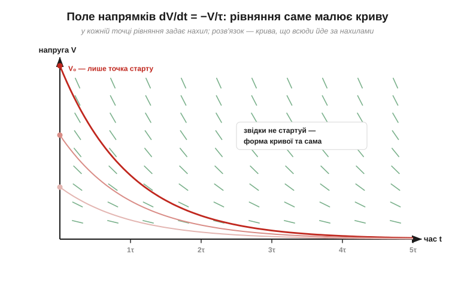
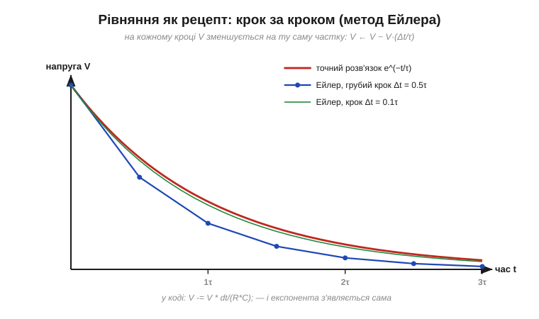

# 🧮 Експонента й диференціальне рівняння RC-кола

> Це математична вставка про [сталу часу RC-кола](topic:hw-analog/rc-time-constant). У розряді конденсатора експоненту легко взяти готовою: «швидкість зміни пропорційна залишку шляху», крива, формула V(t) = V₀·e^(−t/τ). Тут зробимо останній крок строго: запишемо це спостереження як **рівняння**, розв'яжемо його — і побачимо, що τ = R·C не вгадана, а **випливає** з математики сама.

### Два означення

**Похідна** (*derivative*) dV/dt — це миттєва швидкість зміни величини: на скільки вольтів за секунду змінюється напруга **саме зараз**. Формально — відношення малого приросту ΔV до малого проміжку Δt, коли Δt беруть усе коротшим; на графіку це нахил дотичної в точці. Запис dV/dt читається як одне ціле («де-V по де-t»), а не як дріб із двох окремих чисел.

**Диференціальне рівняння** (*differential equation*) — рівняння, в якому невідома — не число, а ціла **функція**, і яке пов'язує її значення з її ж швидкістю. Фізика говорить такими рівняннями постійно, бо закони природи зазвичай кажуть не «де система опиниться», а «як швидко вона змінюється тут і тепер». Розв'язати таке рівняння — означає відновити функцію цілком.

### Рівняння розряду — у два рядки

Конденсатор C, заряджений до напруги V, замкнули на резистор R. Два знайомі факти:

```
струм через резистор:      I = V / R                  (закон Ома)
струм — це винос заряду:   I = −dQ/dt = −C · dV/dt    (бо Q = C·V)
```

Зв'язок Q = C·V — це [означення ємності](topic:ph-electromagnetism/capacitance): заряд на обкладках прямо пропорційний напрузі. Мінус каже: струм тече **з** конденсатора, тож заряд і напруга спадають. Це один і той самий струм — прирівняймо:

```
−C · dV/dt = V / R        →        dV/dt = −V / (R·C)
```

Ось і все рівняння RC-кола. Прочитаймо його словами: **швидкість спаду напруги пропорційна самій напрузі**, з коефіцієнтом 1/(R·C). Та сама пропорційність, яку видно на кривій розряду, тепер записана точно.

### Розв'язок: функція, що дорівнює власній швидкості

Яка функція спадає так, що її швидкість у кожну мить пропорційна її ж поточному значенню? У математиці така функція (з точністю до сталого множника) одна — **експонента**. Число e ≈ 2.718 саме цим і визначене: похідна функції e^t дорівнює їй самій. А для e^(−t/τ) правило ланцюжка дає похідну −(1/τ)·e^(−t/τ) — та сама функція, поділена на −τ.

Перевіримо здогад V(t) = V₀·e^(−t/τ) підстановкою:

```
підставляємо:    dV/dt = V₀ · (−1/τ) · e^(−t/τ) = −V/τ
рівняння хоче:   dV/dt = −V/(R·C)
збіг можливий лише при    τ = R·C
```

Стала часу виявилася не означенням, а **наслідком**: експонента задовольняє рівняння лише з τ = R·C. А множник V₀ — це **початкова умова**, напруга в момент t = 0: рівняння задає форму кривої, початкова умова — звідки її «запустили».


*Поле напрямків: у кожній точці площини (t, V) рівняння задає нахил (зелені рисочки) — крутий угорі, пологий унизу. Розв'язок — крива, що всюди йде за цими нахилами. Стартів може бути багато (V₀ — лише початкова умова), а форма в усіх одна: експонента.*

Хто хоче пройти без здогаду — шлях теж короткий: зібрати все з V ліворуч, усе з t праворуч і «накопичити» зміни з обох боків (це і є інтегрування):

```
dV / V = −dt / (R·C)
ln V − ln V₀ = −t / (R·C)      (ln — функція, обернена до експоненти)
V = V₀ · e^(−t/(R·C))
```

Заряджання зводиться до того самого рівняння дзеркальною заміною: для «залишку шляху» u = V₀ − V виходить du/dt = −u/(R·C), тобто експоненційно спадає **відстань до мети** — звідси V(t) = V₀·(1 − e^(−t/τ)) і знайоме «63% за τ».

### Рівняння як покроковий рецепт

Є й третій погляд, найрідніший для програміста: диференціальне рівняння — це **рецепт оновлення**. Розбий час на короткі кроки Δt і на кожному кроці зміни напругу за її поточною швидкістю:

```
V ← V + Δt · (−V/(R·C))        тобто        V −= V · Δt/(R·C)
```

Це метод Ейлера (*Euler's method*) — найпростіший спосіб розв'язати диференціальне рівняння чисельно. На грубому кроці він неточний, на дрібному — практично зливається з істиною; але головне, що він **показує**, звідки береться самоподібність кривої: кожен крок забирає однакову **частку** залишку, тож за фіксований час крива завжди долає той самий відсоток шляху. «63% за τ» — це просто (1 − 1/e), накопичене з нескінченно дрібних кроків.


*Те саме рівняння, виконане «як код», крок за кроком. Грубий крок 0.5τ дає ламану, що вже поводиться правильно; крок 0.1τ майже зливається з точним розв'язком. Так диференціальні рівняння розв'язує і симулятор схем, і прошивка мікроконтролера.*

З готового розв'язку легко дістати й інші зручні числа: до половини напруга спадає за t = τ·ln 2 ≈ 0.693·τ, до десятої частини — за τ·ln 10 ≈ 2.3·τ, а «правило 5τ» — це лише e⁻⁵ ≈ 0.7% залишку.

### Де це працює

Рівняння «швидкість пропорційна залишку» — найуживаніше диференціальне рівняння в електроніці, і воно ховається за багатьма знайомими процесами: [розряд конденсатора](topic:hw-analog/rc-time-constant) через резистор, [просідання накопичувача під навантаженням](topic:hw-components/capacitor-uses), повільний [саморозряд через витік](topic:hw-components/capacitor-parasitics). Та сама форма описує перехідні процеси котушки з резистором — лише [стала часу там буде L/R](topic:hw-analog/rl-time-constant), — остигання нагрітого компонента й навіть програмне згладжування шумних показів давача. Побачили в системі «темп ∝ залишок» — і ви вже знаєте наперед і криву, і її сталу часу, і правило п'яти τ.
