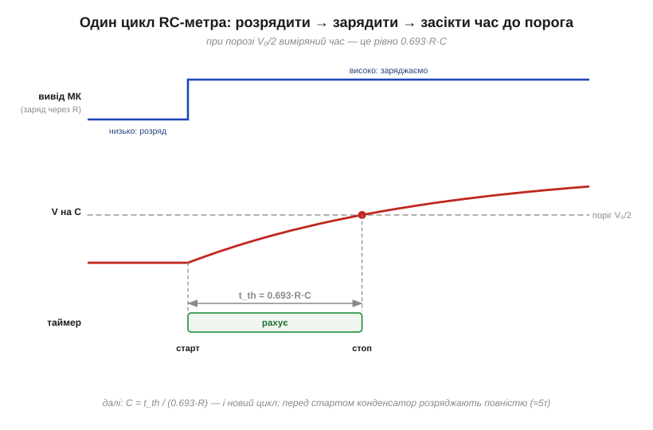
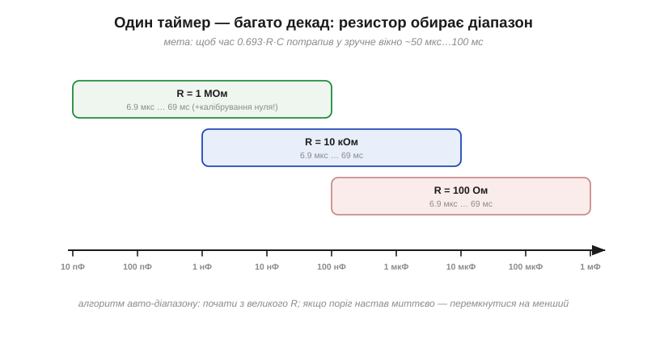

# ⚙️ RC-метр: вимірюємо ємність часом заряду до порога

> Конденсатор крізь резистор заряджається за відомим законом: стала часу τ = R·C, а напруга росте експонентою. Перевернімо це: якщо резистор **відомий**, а час заряджання можна **виміряти**, то ємність обчислюється. Саме так працює режим вимірювання ємності в мультиметрі й у саморобних тестерах компонентів.

### Задача

Дано: невідомий конденсатор, відомий резистор R, цифровий вивід мікроконтролера (вміє видавати «низько/високо»), вхід, що спрацьовує на певному порозі напруги, і таймер. Знайти C з точністю в кілька відсотків — від пікофарад до сотень мікрофарад.

### Ідея

Крива заряджання: V(t) = V₀·(1 − e^(−t/τ)). Час, за який напруга доросте до порога V_th, прямо пропорційний τ, а отже й C:

```
t_th = τ · ln( V₀ / (V₀ − V_th) ) = k · R · C
```

Коефіцієнт k залежить лише від **частки**, яку поріг становить від живлення. Найзручніший випадок — поріг на половині живлення:

```
V_th = V₀/2:   k = ln 2 ≈ 0.693     →     C = t_th / (0.693 · R)
```

Тож увесь вимір — це «розрядити, ввімкнути заряд крізь R, засікти час до порога»:


*Три доріжки одного циклу: вивід мікроконтролера спершу тримає конденсатор розрядженим, потім подає високий рівень через R; напруга на конденсаторі повзе вгору експонентою; таймер рахує від старту заряду до перетину порога. Виміряний час ділимо на 0.693·R — і маємо C.*

### Код

Вивід `PIN_DRIVE` заряджає й розряджає конденсатор крізь відомий R, а вхід `PIN_SENSE` спрацьовує на своєму логічному порозі (беремо його за ≈ V₀/2, тож k = ln2 = 0.693). Уся тонкість — у розряді: поріг бачить лише перетин V₀/2, тож «повний нуль» ним не зловити, і розряджати доводиться наперед відомий час ≥ 5τ, оцінений із попереднього заміру.

Від мікроконтролера потрібні три речі, і вони є в кожному: вивід у режимі push-pull, вхід із визначеним логічним порогом і вільний лічильник мікросекунд. Далі різняться самі лише імена — `micros()` в Arduino, `esp_timer_get_time()` в ESP-IDF, регістр лічильника вільного таймера в STM32.

:::tabs

```arduino
// C = t / (k·R), де k = ln2 ≈ 0.693 при порозі V₀/2.
float measure_capacitance(float R_ohms) {
    static uint32_t discharge_us = 200000;   // щедрий старт на перший цикл

    pinMode(PIN_DRIVE, OUTPUT);
    digitalWrite(PIN_DRIVE, LOW);            // 1. розряд крізь R
    uint32_t d0 = micros();
    while (micros() - d0 < discharge_us) { /* тримаємо, поки не сяде до ~0 */ }

    uint32_t t0 = micros();
    digitalWrite(PIN_DRIVE, HIGH);           // 2. старт заряду й таймера воднораз

    while (digitalRead(PIN_SENSE) == LOW) { } // 3. чекаємо перетину порога V₀/2
    uint32_t t_us = micros() - t0;           //    тривалість заряду ≈ 0.69·τ

    discharge_us = 8 * t_us;                 // наступний розряд: 8·0.69τ ≈ 5.5τ ≥ 5τ
    return (t_us * 1e-6f) / (0.693f * R_ohms); // 4. ділимо на k·R → фаради
}
```

```esp-idf
#include "driver/gpio.h"
#include "esp_timer.h"
// esp_timer_get_time() — вільний 64-бітний лічильник мікросекунд від старту.

float measure_capacitance(float R_ohms) {
    static int64_t discharge_us = 200000;    // щедрий старт на перший цикл

    gpio_config_t io = { .pin_bit_mask = 1ULL << PIN_DRIVE, .mode = GPIO_MODE_OUTPUT };
    gpio_config(&io);
    io.pin_bit_mask = 1ULL << PIN_SENSE; io.mode = GPIO_MODE_INPUT;
    gpio_config(&io);

    gpio_set_level(PIN_DRIVE, 0);            // 1. розряд крізь R
    int64_t d0 = esp_timer_get_time();
    while (esp_timer_get_time() - d0 < discharge_us) { /* поки не сяде до ~0 */ }

    int64_t t0 = esp_timer_get_time();
    gpio_set_level(PIN_DRIVE, 1);            // 2. старт заряду й таймера воднораз

    while (gpio_get_level(PIN_SENSE) == 0) { } // 3. чекаємо перетину порога V₀/2
    int64_t t_us = esp_timer_get_time() - t0;  //    тривалість заряду ≈ 0.69·τ

    discharge_us = 8 * t_us;                 // наступний розряд: 8·0.69τ ≈ 5.5τ ≥ 5τ
    return (t_us * 1e-6f) / (0.693f * R_ohms); // 4. ділимо на k·R → фаради
}
```

```stm32
extern TIM_HandleTypeDef htim2;  // 32-біт, прескалер під 1 такт = 1 мкс,
                                 // запущений раз через HAL_TIM_Base_Start(&htim2)

float measure_capacitance(float R_ohms) {
    static uint32_t discharge_us = 200000;   // щедрий старт на перший цикл

    GPIO_InitTypeDef g = { .Pin = DRIVE_PIN, .Mode = GPIO_MODE_OUTPUT_PP,
                           .Pull = GPIO_NOPULL, .Speed = GPIO_SPEED_FREQ_LOW };
    HAL_GPIO_Init(DRIVE_PORT, &g);

    HAL_GPIO_WritePin(DRIVE_PORT, DRIVE_PIN, GPIO_PIN_RESET);  // 1. розряд крізь R
    uint32_t d0 = __HAL_TIM_GET_COUNTER(&htim2);
    while (__HAL_TIM_GET_COUNTER(&htim2) - d0 < discharge_us) { /* поки не сяде */ }

    uint32_t t0 = __HAL_TIM_GET_COUNTER(&htim2);
    HAL_GPIO_WritePin(DRIVE_PORT, DRIVE_PIN, GPIO_PIN_SET);    // 2. старт заряду

    while (HAL_GPIO_ReadPin(SENSE_PORT, SENSE_PIN) == GPIO_PIN_RESET) { } // 3. поріг
    uint32_t t_us = __HAL_TIM_GET_COUNTER(&htim2) - t0;        //    ≈ 0.69·τ

    discharge_us = 8 * t_us;                 // наступний розряд: 8·0.69τ ≈ 5.5τ ≥ 5τ
    return (t_us * 1e-6f) / (0.693f * R_ohms); // 4. ділимо на k·R → фаради
}
```

:::

Різниця двох знімків лічильника на беззнакових числах правильна навіть через його переповнення. Складність — O(1) на вимір; сам вимір триває ≈ 0.7·R·C плюс розряд. Для усереднення шуму цикл повторюють кілька разів і беруть середнє.

### Вибір R: одна формула — вісім декад

Час t_th мусить потрапити у вікно, яке таймер міряє зручно: надто короткий (одиниці мікросекунд) тоне в похибці старту, надто довгий — дратує. Вихід — **авто-діапазон**: кілька резисторів на вибір.


*Той самий алгоритм покриває вісім декад ємності — резистор лише зсуває вікно часу: 1 МОм для пікофарад і нанофарад, 10 кОм для середини, 100 Ом для великих електролітів. Початок із найбільшого R: якщо поріг настав «миттєво» — конденсатор великий, перемикаємось на менший R і міряємо знову.*

**Приклад (перевірка масштабів).** R = 10 кОм, виміряний час t = 7.6 мс:

```
C = t / (0.693 · R)
C = (7.6×10⁻³ с) / (0.693 · 10⁴ Ом)
C ≈ 1.1×10⁻⁶ Ф ≈ 1.1 мкФ
```

### Пастки на мікроконтролері

- **Розряд великого конденсатора напряму на вивід.** Незаряджений конденсатор поводиться як коротке замикання: заряджений електроліт, замкнений виводом на землю, дає кидок струму понад допустимий для ніжки. Розряджати теж через резистор (сотні ом).
- **Очікування в циклі з перериваннями.** Якщо процесор відволікся між перетином порога й зупинкою таймера, час «пливе». Правильний шлях — апаратний таймер, що сам фіксує момент події; програмний цикл годиться лише для повільних діапазонів.
- **Паразитна ємність плати.** Доріжки й вивід самі мають десятки пікофарад — будь-які дві провідні поверхні утворюють [конденсатор](root:hw-components/capacitor), — і для діапазону пікофарад це порівнянне з вимірюваним. Ліки прості: виміряти «порожній» вхід без конденсатора й віднімати цей нуль (калібрування).
- **Поріг, що «плаває».** Якщо поріг входу — фіксована частка живлення, система самокомпенсується: у k входить лише відношення V_th/V₀, і коливання живлення скорочуються. А от поріг, заданий незалежним джерелом, цю властивість ламає.
- **Неідеальні конденсатори.** Великий витік електроліта занижує видиму ємність (частина струму тече повз заряд), а керамічний конденсатор класу 2 покаже різні значення за різної прикладеної напруги (ефект DC bias — його ємність падає під постійною напругою зміщення). RC-метр чесно міряє «ємність у цих умовах», а не напис на корпусі.

### Де ще працює цей прийом

Та сама схема «час заряду до порога» живе всюди, де треба дешево оцифрувати аналогову величину без АЦП: виміряти опір (поміняти місцями відоме й невідоме — відомий C, невідомий R), зчитати резистивний давач, і навіть відчути дотик пальця: палець додає кілька пікофарад до сенсорної площадки, час заряду трохи зростає — так працює ємнісна кнопка.
