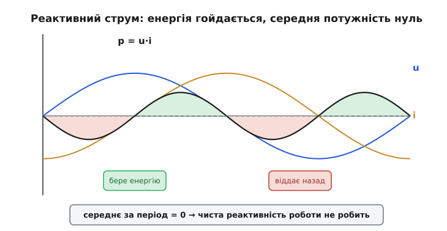
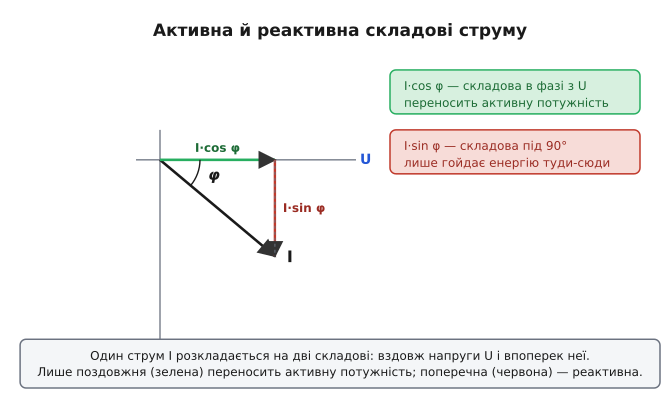
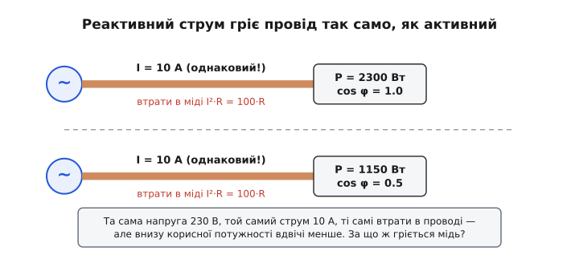
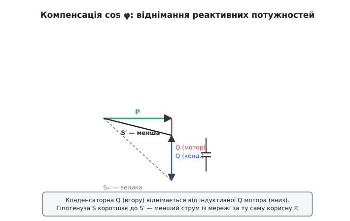

# Реактивна потужність і коефіцієнт потужності

Уявіть провід, у якому тече добрячий струм, на ньому є повна напруга — а лічильник стоїть. Прилад показує десять ампер, вольтметр показує двісті тридцять вольт, та платіжний лічильник не крутиться. Звучить як фокус, але це буденність будь-якого кола зі змінним струмом, де є котушка чи конденсатор. Струм є, напруга є, а «корисної» потужності — нуль. Щоб зрозуміти, як таке можливе, треба розрізнити дві геть різні речі, що ховаються за одним словом «потужність»: ту, що **робить роботу** (гріє, світить, крутить вал), і ту, що лише **гойдається** туди-сюди між джерелом і навантаженням, нічого по дорозі не залишаючи. Перша — активна потужність. Друга — **реактивна** (лат. *re-* — назад + *actio* — дія: «зворотна дія»). А число, що каже, яка частка спожитого струму справді працює, зветься **коефіцієнтом потужності** (англ. *power factor*).

Тема ця не абстрактна. Саме через реактивну потужність заводи доплачують за електрику, трансформатори рейтингують у дивних «вольт-амперах», а в цехах висять шафи з батареями конденсаторів, єдина робота яких — гасити те, чого ніби й немає. Розберімо, звідки береться ця «потужність-привид» і чому за неї все одно доводиться платити.

### Звідки взялася потужність, що не працює

Корінь усього — **зсув фаз**. У колі з чистим опором (лампа розжарення, нагрівач) струм слухняно повторює напругу: коли напруга на піку — струм на піку, коли напруга нуль — струм нуль. Вони йдуть **в ногу**. А от реактивні елементи — конденсатор і котушка — зсувають струм відносно напруги на чверть періоду. Звідки цей зсув і чому він рівно 90° — окрема історія самої [реактивності](topic:hw-components/reactance): конденсатор реагує на швидкість зміни напруги, а котушка — на швидкість зміни струму, і саме ця залежність «від швидкості, а не від значення» повертає синусоїду струму на чверть оберту.

> 🔧 **Навіщо це.** Усе подальше тримається на одному факті: у реальному навантаженні (мотор, дросель, трансформатор, довгий кабель) струм майже завжди трохи **відстає** від напруги, бо в ньому є індуктивність. Цей зсув — не помилка й не дефект, його не можна «полагодити» в самому моторі. Але можна порахувати, скільки він коштує, і компенсувати ззовні. Уся енергетика щодня має справу саме з цим.

Тепер ключове питання: чому зсув струму взагалі щось міняє для потужності? Бо потужність — це **добуток** миттєвих напруги й струму, p = u·i, у кожну мить часу. І коли два множники зсунуті, їхній добуток поводиться зовсім інакше, ніж коли вони в ногу.

Простежмо за чистою реактивністю — скажімо, за конденсатором, де струм випереджає напругу рівно на 90°. Чверть періоду напруга й струм мають однаковий знак (обидва додатні або обидва від'ємні) — їхній добуток додатний, конденсатор **бере** енергію з мережі й запасає її в полі. Наступну чверть один із них уже змінив знак — добуток від'ємний, конденсатор **віддає** запасене назад у мережу. Бере — віддає — бере — віддає, з частотою вдвічі вищою за частоту сигналу. У середньому за повний період він не забирає **нічого**.


*Напруга (синя) і струм (помаранчевий) зсунені на 90°. Їхній добуток p = u·i (чорна крива) однакову частину часу додатний (зелене — елемент бере енергію) і від'ємну (червоне — віддає назад). Площі рівні, тож середнє за період — рівно нуль: чиста реактивність роботи не робить.*

Ось і весь фокус із лічильника. Енергія справді тече в навантаження — але рівно стільки ж тече назад. Лічильник активної енергії бачить **середнє** за період і чесно показує нуль. А от провід, що з'єднує джерело з навантаженням, цього «нуля» не бачить — крізь нього в обидва боки тече цілком реальний струм. І в цьому вся підступність реактивної потужності: середнє нульове, а струм — справжній.

### Реальне навантаження: дещо працює, дещо гойдається

Чистих реактивностей у житті майже немає. Реальний мотор, трансформатор чи блок живлення — це **суміш**: трохи опору (обмотки гріються, вал крутиться — робота робиться) і чимало індуктивності (магнітне поле щоразу запасається й віддається — робота не робиться). Тому струм такого навантаження зсунутий відносно напруги не на повні 90°, а на якийсь проміжний кут φ (грецька «фі») — десь між нулем чистого резистора й дев'яноста градусами чистої котушки.

Найясніше це видно, якщо подумки **розкласти** один струм навантаження на дві складові. Одну — точно **в фазі** з напругою; саме вона переносить активну потужність. Другу — точно **під 90°**; вона лише гойдає енергію, як чиста реактивність. Реальний струм — їхня векторна сума.


*Повний струм I під кутом φ до напруги U розпадається на поздовжню складову I·cos φ (зелена, у фазі — робить роботу) і поперечну I·sin φ (червона, під 90° — лише гойдається). Що більший кут φ, то довша марна поперечна складова й коротша корисна поздовжня.*

Звідси одразу видно роль кута φ. Якщо φ малий (навантаження майже чисто активне), струм майже весь поздовжній — майже весь працює. Якщо φ великий (багато індуктивності), велика частина струму йде в поперечну складову — тече туди-сюди, гріє провід і нічого не дає. **Косинус** цього кута й каже, яка частка струму корисна:

```
cos φ = (корисна складова струму) / (повний струм) = I·cos φ / I
```

Це і є **коефіцієнт потужності**. Він міняється від 1 (φ = 0, чистий резистор — увесь струм працює) до 0 (φ = 90°, чиста реактивність — нічого не працює). Лампа розжарення має cos φ ≈ 1; ненавантажений мотор — cos φ ≈ 0.2; типовий навантажений асинхронний мотор — десь 0.8.

> 🔧 **Навіщо це.** Коефіцієнт потужності — це не «якість» приладу в побутовому сенсі, а міра того, **наскільки струм збігається з напругою в часі**. Низький cos φ означає: щоб дати навантаженню той самий ват корисної потужності, мережа мусить прогнати крізь проводи **більший** струм. А струм — це нагрів, переріз міді й рахунок. Тому в паспортах моторів і блоків живлення cos φ стоїть поряд із потужністю: він прямо каже, скільки струму прилад тягтиме понад «корисний мінімум».

### Три потужності: активна, реактивна, повна

Коли кут φ названо, природно дати ім'я кожній частині. Помножимо повний струм та його дві складові на ту саму напругу — і дістанемо три потужності.

**Активна потужність** P = U·I·cos φ — та, що справді робить роботу. Її міряють у звичних **ватах** (Вт, W). Це те, за що крутиться лічильник і що гріє нагрівач.

**Реактивна потужність** Q = U·I·sin φ — та сама «гойдалка», середнє якої нуль, але струм реальний. Щоб не плутати її з активною, для неї завели окрему одиницю — **вар** (англ. *VAR — volt-ampere reactive*, «реактивний вольт-ампер»). Розмірність та сама, що й у вата, але назва навмисне інша: побачив «вар» — знаєш, що йдеться про потужність, яка не працює.

**Повна потужність** S = U·I — просто добуток того, що показують вольтметр і амперметр, без жодних косинусів. Її міряють у **вольт-амперах** (В·А, VA). Це «видима» потужність — стільки мережа реально мусить «прокачати» крізь дроти, незалежно від того, яка частина з неї корисна.

Три потужності пов'язані не арифметично, а за теоремою Піфагора — бо їхні струмові складові перпендикулярні: S² = P² + Q². Чому саме прямокутний трикутник, як із нього випливає cos φ = P/S і чому через ту саму логіку трансформатори рейтингують у вольт-амперах, а не у ватах — це окремий, варта окремого розбору формальний бік, винесений у математичну вставку.

> 🧮 **Математична вставка:** [активна, реактивна й повна потужність — трикутник P, Q, S](topic:hw-components/phase-shift/math-power-triangle.md). Як три потужності складаються у прямокутний трикутник, звідки в активній береться множник cos φ (через миттєву потужність p = u·i) і чому шильдик трансформатора пишуть у VA, а не у ватах.

Для розрахунків тут досить тримати в голові смисл: P — що працює (Вт), Q — що гойдається (вар), S — що тече по дротах (В·А), а cos φ = P/S — частка корисного у видимому.

### Чому за «потужність-привид» доводиться платити

Якщо реактивна потужність у середньому нульова, чому за неї взагалі мова про гроші? Бо платять не за середню потужність, а за **наслідки струму**, який її переносить. А наслідки цілком матеріальні.

Головний із них — нагрів проводів. Втрати в будь-якому проводі — це джоулеве тепло I²·R, і воно залежить **тільки від струму**, байдуже, у фазі той струм із напругою чи зсунутий. Реактивний струм гріє мідь точнісінько так само, як активний. Уявімо дві однакові лінії з однаковим струмом 10 А, але різним cos φ.


*Дві лінії: однакова напруга, однаковий струм 10 А, однакові втрати в проводі I²·R. Зверху cos φ = 1 — уся видима потужність корисна (2300 Вт). Знизу cos φ = 0.5 — корисної лише 1150 Вт, але провід гріється так само, бо струм той самий. Друга лінія «возить» стільки ж струму за вдвічі менший результат.*

Друга лінія прокачує той самий струм і гріє ту саму мідь, а корисної роботи віддає вдвічі менше. Для енергокомпанії це означає: щоб обслужити навантаження з поганим cos φ, потрібні **товстіші** дроти, **потужніші** трансформатори, **більші** підстанції — усе розраховане на повний струм, тобто на повну потужність S у вольт-амперах, а не на активну P у ватах. Залізо й мідь коштують грошей на струм і напругу, а не на фазу.

Тому промисловим споживачам енергокомпанія часто виставляє рахунок не лише за активну енергію (кВт·год), а й **штраф за низький cos φ** — або просто рахує плату за **повною** потужністю S. Типовий поріг — cos φ нижчий за 0.85–0.95: опустився під нього — доплачуєш за «зайвий» реактивний струм, що вантажить її мережу, нічого не виробляючи. Побутових споживачів це поки що зазвичай не зачіпає (там лічильник міряє лише активну енергію), але для заводу з десятками моторів різниця в рахунку — відчутна.

**Приклад (наскільки виростає струм через поганий cos φ).** Цех споживає корисну (активну) потужність P = 50 кВт від мережі 400 В. Порівняймо струм за доброго й поганого коефіцієнта потужності.

```
S = P / cos φ              (повна потужність)
I = S / U                  (струм у лінії)

cos φ = 0.95:  S = 50000/0.95 ≈ 52.6 кВ·А  →  I = 52600/400 ≈ 132 А
cos φ = 0.70:  S = 50000/0.70 ≈ 71.4 кВ·А  →  I = 71400/400 ≈ 179 А
```

Та сама корисна робота 50 кВт — а струм виріс зі 132 до 179 А, на третину. На третину товщі мають бути дроти, на третину більший нагрів (I²·R росте навіть швидше — майже у двічі), на третину важче навантажений трансформатор. Усе це через те, що 30 % струму просто гойдається туди-сюди, не роблячи нічого.

### Як гасять реактивну потужність: компенсація

Тут криється елегантний вихід. Майже всі промислові навантаження **індуктивні** — мотори, дроселі, трансформатори запасають енергію в магнітному полі, і їхній струм **відстає** від напруги. А конденсатор — точне дзеркало: його струм напругу **випереджає**. Реактивні потужності котушки й конденсатора мають **протилежний знак**. Тож якщо поставити поряд із мотором конденсатор потрібної ємності, його «випереджальна» реактивна потужність **відніметься** від «відстаючої» реактивної потужності мотора.


*Індуктивна Q мотора тягне трикутник униз, велика гіпотенуза S. Конденсатор додає свою Q протилежного знаку (вгору), залишкова Q зменшується, гіпотенуза коротшає до S′. Активна P не змінилася — а струм із мережі впав, бо S′ менша за S.*

Що тут діється фізично, варто бачити ясно. Енергія, яку мотор щопівперіоду «висмоктує» в своє магнітне поле, тепер береться не з далекої електростанції, а з **сусіднього конденсатора**, що саме в цей момент розряджається. А коли мотор віддає енергію поля назад — конденсатор її приймає, заряджаючись. Реактивна енергія більше не бігає туди-сюди по всій лінії від станції — вона **гойдається на місці**, у короткій петлі «мотор ↔ конденсатор». Мережа цієї гойдалки вже майже не бачить: їй лишається постачати тільки активну частину. Це і є **компенсація коефіцієнта потужності** (англ. *power factor correction*). Саме тому в цехах висять шафи з батареями конденсаторів — їхня єдина робота полягає в тому, щоб локально замкнути реактивну гойдалку й зняти її з мережі.

**Приклад (скільки реактивної потужності треба загасити).** Мотор споживає P = 50 кВт за cos φ = 0.70. Хочемо підняти cos φ до 0.95. Скільки реактивної потужності має дати конденсаторна батарея?

```
tan φ = Q / P             →   Q = P · tan φ

було:    φ₁ = arccos 0.70 ≈ 45.6°,  tan φ₁ ≈ 1.020  →  Q₁ = 50·1.020 ≈ 51.0 квар
треба:   φ₂ = arccos 0.95 ≈ 18.2°,  tan φ₂ ≈ 0.329  →  Q₂ = 50·0.329 ≈ 16.4 квар

ємнісна потужність батареї:  Q_C = Q₁ − Q₂ ≈ 51.0 − 16.4 ≈ 34.6 квар
```

Батарея на ~35 квар прибирає дві третини реактивної потужності, і cos φ підстрибує з 0.70 до 0.95 — рівно те, що зводить струм такої лінії з 179 А назад до ~132 А. Жодного вата корисної потужності при цьому не додалося й не зникло: P як було 50 кВт, так і лишилося. Змінилося тільки те, скільки **марного** струму ганяє мережа.

> 🔧 **Навіщо це.** Компенсація — це буквально арифметика реактивних потужностей: знайди індуктивну Q навантаження, додай ємнісну Q протилежного знаку, поки залишок не стане прийнятним. На цьому стоїть ціла галузь — від маленького конденсатора в баласті лампи до автоматичних шаф, що ступінчасто підмикають секції конденсаторів услід за навантаженням цеху. Перебільшувати теж не можна: якщо ємності забагато, струм почне **випереджати** напругу, і cos φ знову поповзе вниз, тільки вже з іншого боку.

### Один корінь усього — фаза

Варто зібрати нитку докупи. Усе в цій темі виростає з одного: струм у реальному навантаженні зсунутий відносно напруги. Цей [зсув фаз](topic:hw-components/phase-shift) розколює струм на дві складові — поздовжню, що робить роботу, і поперечну, що лише гойдає енергію. Поздовжня дає активну потужність P (вати, лічильник, тепло, робота). Поперечна дає реактивну потужність Q (вари, гойдалка, нуль у середньому). Повний струм дає повну потужність S (вольт-ампери, реальний нагрів дротів, рахунок). А косинус кута зсуву, cos φ = P/S, каже, яка частка видимої потужності справді працює.

І найважливіше, що часто збиває з пантелику: реактивна потужність у середньому нульова — але **струм, який її переносить, цілком реальний**, і він гріє мідь, вантажить трансформатори й коштує грошей. Тому її не ігнорують, а гасять: ставлять поряд із індуктивним навантаженням конденсатор, що замикає реактивну гойдалку на місці й знімає її з мережі. Звідси й cos φ у паспортах, і вольт-ампери на шильдиках, і шафи з конденсаторами в цехах — усе це різні боки однієї простої думки: коли струм і напруга не в ногу, частина струму працює даремно, і за неї однаково доводиться платити.

> 📜 **Історична вставка:** [хто назвав «потужність-привид»: вар, Будяну й суперечка про реактивну потужність](topic:hw-analog/reactive-power/hist-budeanu-var.md). Як румунський інженер Константин Будяну дав ім'я одиниці реактивної потужності, чому IEC ухвалила «вар» 1930 року в Стокгольмі — і чому навколо самого означення реактивної потужності досі тривають наукові суперечки.
