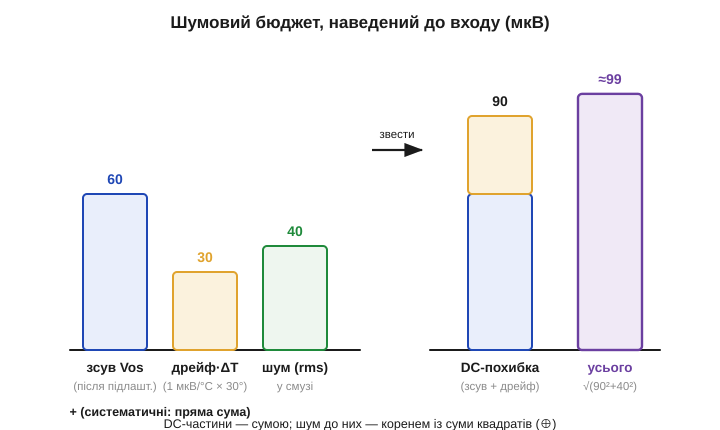
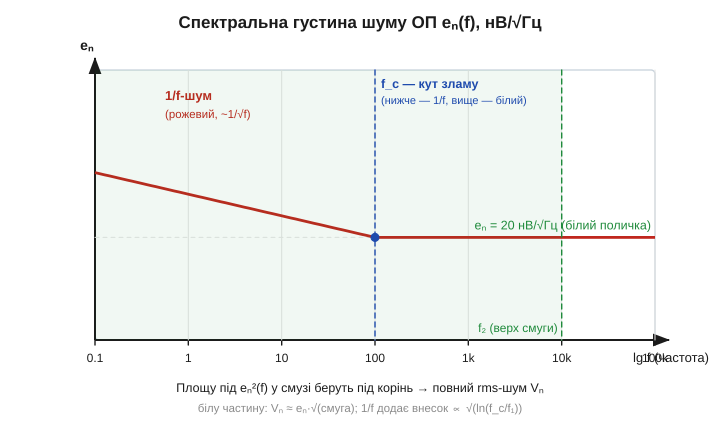

# 🧮 Шумовий бюджет входу ОП: зсув, дрейф, нВ/√Гц

> Реальний операційний підсилювач має три вади, що псують **точність на вході**: напругу зсуву (*offset*), її **дрейф** із температурою й власний **шум**. Поодинці їх легко зрозуміти; а от інженерові треба інше — **одне число**: на скільки мікровольтів реальний ОП «бреше» проти ідеального, перш ніж помножити це на підсилення. Тут — як зібрати всі три в єдиний **[бюджет похибки](root:math-probability/error-budget)**, наведений до входу, і де яка складова кусає.

### Навіщо «наводити до входу»

Спершу домовмося про мову. Усі ці вади зручно перераховувати не на вихід, а **на вхід** — питаємо: «яку фіктивну напругу довелося б подати на ідеальний ОП, щоб дістати таку саму похибку, як від реального?». Це й зветься **наведенням до входу** *(input-referred)*. Так зручно, бо бюджет **не залежить** від підсилення схеми: похибка входу множиться на той самий [коефіцієнт підсилення G](root:hw-analog/inverting-noninverting), що й корисний сигнал, — тож порівнювати їх найчесніше саме на вході.

```
похибка_виходу = G · похибка_входу
```

Звідси й головне інженерне питання теми: **наскільки мала корисна напруга з давача, яку ще видно на тлі цієї похибки входу?** Якщо давач дає 100 мкВ, а похибка входу ОП — теж під сотню мікровольтів, вимір безнадійний, хоч би яким великим було підсилення: помножиться і те, і те.

### Три доданки бюджету

Тепер придивімося, з чого ж та похибка входу складається. Її дають **три** величини, усі — у мікровольтах, наведених до входу.

**1. Напруга зсуву Vos** *(offset voltage)*. Стала вроджена несиметрія входів: наче на вхід завжди подано кілька мілівольтів (у звичайних ОП) чи кілька мікровольтів (у прецизійних). Це **систематична** похибка — для даного примірника за даної температури вона стала, тож її можна частково **скомпенсувати** (підлаштуванням нуля), але після компенсації лишається залишок.

**2. Дрейф зсуву** *(offset drift, ΔVos/°C)*. Зсув **повзе** з температурою. Подають його як стільки-то **мкВ на градус**; помноживши на робочий перепад температури ΔT, дістаємо внесок дрейфу. Підступність у тім, що дрейф **не вловлюється** разовим підлаштуванням нуля: ви обнулили зсув за кімнатних 25 °C, а на сонці плата нагрілась — і він знову виповз.

**3. Шум eₙ** *(input-referred voltage noise)*. На відміну від перших двох, шум — **випадковий**: ледь чутне «шипіння» з транзисторів усередині. Його густину задають дивною на вигляд одиницею — **нановольти на корінь із герца** *(nV/√Hz)*, — і чому саме такою, розберемо нижче. Поки що: це випадкова добавка, що накопичується тим більше, чим **ширша смуга** частот, у якій ми слухаємо сигнал.


*Бюджет, наведений до входу. Систематичні складові (зсув + дрейф·ΔT) додаються **арифметично** в одну DC-похибку. Випадковий шум приєднується до неї не сумою, а **коренем із суми квадратів**. Зсув можна підлаштувати, дрейф — ні, шум — лише звузити смугою.*

### Як їх складати: сума vs корінь

Найважливіше — складати їх правильно, бо **два різні** способи. Систематичні похибки (зсув і дрейф) **завжди тягнуть в один бік** для даного примірника й температури, тож вони додаються **арифметично**:

```
V(DC) = Vos(залишок) + (ΔVos/°C)·ΔT
```

А от шум — **випадковий**, незалежний від зсуву. Незалежні випадкові величини додаються **не сумою, а коренем із суми квадратів** *(RSS, root-sum-square)* — бо їхні піки рідко збігаються, і пряма сума завищила б оцінку. Тому повний бюджет входу:

```
V(заг) = √( V(DC)² + Vₙ² )
```

де Vₙ — повний (інтегрований) rms-шум, який порахуємо нижче. Знак «⊕» часто й означає це «складання квадратами».

**Приклад (прецизійний ОП).** Нехай після підлаштування лишок зсуву Vos = 60 мкВ, дрейф 1 мкВ/°C, робочий перепад ΔT = 30 °C, а повний шум у смузі Vₙ = 40 мкВ. Тоді:

```
V(DC)  = 60 + 1·30        = 90 мкВ      (систематична частина)
V(заг) = √(90² + 40²)
       = √(8100 + 1600)
       = √9700  ≈ 98.5 мкВ  ≈ 0.1 мВ
```

Висновок: повна похибка входу — близько **0.1 мВ**. Якщо корисний сигнал давача — одиниці мілівольт, це похибка в одиниці відсотка; якщо ж сигнал — сотні мікровольт, бюджет його «з'їдає». І зверніть увагу: систематична частина (90 мкВ) тут більша за шумову (40 мкВ), тож **дрейф і зсув** — головний клопіт, а не шум. Бюджет одразу показує, **за що** братися.

### Звідки дивна одиниця нВ/√Гц

Тепер обіцяне — чому шум міряють у нановольтах **на корінь із герца**, а не просто в нановольтах. Причина в тім, що шум **розмазаний по частотах**: у кожнім вузенькому шматочку смуги Δf сидить своя крихітна порція. Для «білого» шуму ця порція однакова на всіх частотах, тож **потужність** шуму (а вона ∝ квадрату напруги) росте **пропорційно смузі**:

```
Vₙ² = eₙ² · Δf        →        Vₙ = eₙ · √Δf
```

Ось воно: напруга шуму росте як **корінь** зі смуги. Тому густину зручно задавати величиною eₙ = Vₙ/√Δf — і вона саме в **В/√Гц** (на практиці нВ/√Гц). Помножив на корінь зі смуги — дістав rms-напругу. Наприклад, eₙ = 20 нВ/√Гц у смузі 10 кГц дає:

```
Vₙ = 20 нВ/√Гц · √10000 Гц = 20·10⁻⁹ · 100 = 2·10⁻⁶ В = 2 мкВ
```

Звідси важлива практична думка: **звузити смугу — зменшити шум** (удвічі вужча смуга — у √2 менший rms-шум). Тому слабкий повільний сигнал з давача навмисне пропускають крізь вузький фільтр: швидкість не потрібна, а кожне відрізане «зайве» Гц прибирає шум.

### Білий шум і «рожевий» 1/f

Та одного числа eₙ замало, бо в реального ОП густина шуму **не зовсім** пласка. На високих частотах вона справді стала — це **білий шум** (поличка eₙ). А на **низьких** частотах вступає **фліккер-шум**, або **1/f-шум** *(flicker noise)*: його густина росте, коли частота падає. Межу між двома режимами звуть **кутом зламу** *(corner frequency, f_c)*: нижче f_c панує 1/f, вище — біла поличка.


*Густина шуму eₙ(f) у лог-лог осях. Нижче кута f_c густина росте як 1/√f (рожевий 1/f-шум); вище — виходить на сталу поличку eₙ (білий шум). Повний rms-шум — це корінь із **площі під eₙ²(f)** у вашій смузі. Біла частина дає eₙ·√(смуга); 1/f додає внесок, що росте логарифмічно вниз по частоті.*

Чому це важливо саме для нас? Бо вимір **постійної** напруги з давача (тензодавач, термопара) живе якраз на **низьких** частотах — там, де лютує 1/f, і мала біла поличка eₙ оманлива. Тому для прецизійного постійного виміру не досить «нВ/√Гц на 1 кГц» — треба знати ще й кут f_c та шум на низьких частотах (його часто задають як розмах **від піка до піка у смузі 0.1…10 Гц**). Радикальний прийом проти 1/f — ОП із **автоматичним обнуленням** (*chopper*, *auto-zero*): вони переносять обробку на високу частоту, де 1/f уже немає. Такий ОП має й мікровольтовий зсув, і майже нульовий дрейф, і пригнічений 1/f — тому їх і люблять у точних вимірах.

### Інтегрування по смузі: повний rms

Зведімо все докупи. Повний rms-шум, наведений до входу, — це корінь із **усієї площі** під кривою eₙ²(f) у вашій робочій смузі від f₁ до f₂. Грубо її ділять на дві частини:

```
Vₙ²  ≈  eₙ²·(f₂ − f_c)        ← біла частина (вище кута)
     +  eₙ²·f_c·ln(f_c/f₁)    ← 1/f-частина (нижче кута)
```

Для **широкосмугового** сигналу (звук, відеосмуга) панує перший доданок, і чесно працює просте Vₙ ≈ eₙ·√(смуга). Для **вузькосмугового низькочастотного** (давач постійної величини) f₂ невелике, зате f₁ тягнеться до часток герца — і вирішальним стає **другий**, 1/f-доданок. Який шум вам шкодить — залежить від того, **де по частоті** живе ваш сигнал.

> 🔧 **Навіщо це.** Бюджет входу — це чесний спосіб відповісти, **чи взагалі видно** ваш сигнал. Складіть три числа з даташита: лишок зсуву **плюс** дрейф×ΔT (арифметично, бо систематичні), а тоді приєднайте шум **коренем із суми квадратів**. Порівняйте підсумок із корисним сигналом давача — якщо вони одного порядку, ні підсилення, ні фільтр уже не врятують: треба прецизійніший ОП. І дивіться на **правильну** частину спектра: для постійного виміру головні вороги — зсув, дрейф і 1/f-шум (тут рятує chopper/auto-zero ОП), а для широкосмугового — біла поличка eₙ, яку приборкують вузькою смугою.

### Спільне коріння трьох вад

Усі три вади мають спільне коріння в нутрі приладу — у [вхідній диференційній парі](root:hw-analog/opamp-input-stage): зсув і дрейф родяться від неідеальної **спареності** двох вхідних транзисторів, а шум — від випадкових процесів у тих самих транзисторах (тому **тип** входу, біполярний чи польовий, задає і рівень шуму, і його характер). А саме наведення до входу спирається прямо на те, що похибка множиться на [підсилення схеми](root:hw-analog/inverting-noninverting) — точнісінько як корисний сигнал.
