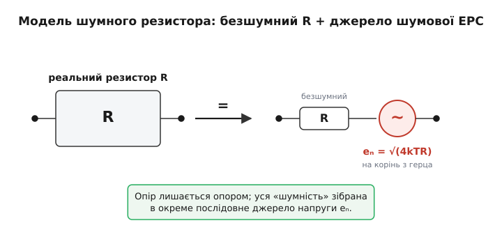
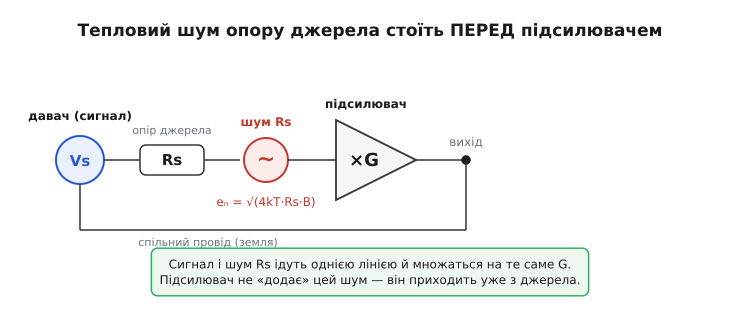
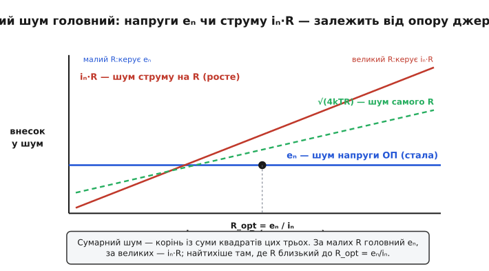

# Резистор як джерело шуму: тепло, що стає напругою на схемі

Розгорніть будь-яку схему й погляньте на резистор у ній очима теорії кіл. Зазвичай ми малюємо його одним символом з одним числом — стільки-то омів — і вважаємо, що він робить рівно те, що каже [закон Ома](root:hw-analog/ohms-law): пропускає струм, спадає на ньому напруга, ніяких сюрпризів. Але цей символ — спрощення. Кожен реальний резистор, навіть той, крізь який не тече жодного струму від схеми, **сам по собі породжує крихітну змінну напругу** на своїх виводах. Не від наводки, не від поганого паяння — від власного тепла. І коли ви рахуєте, наскільки слабкий сигнал ваша схема ще здатна розгледіти, саме ця напруга ставить стіну, нижче якої не пройти.

Називають її **тепловий шум** (*thermal noise*), а за іменами тих, хто його виміряв і пояснив, — **шум Джонсона—Найквіста**. Нас тут цікавить не стільки фізика його народження (це окрема історія — чому теплий рух електронів обертається на напругу), скільки інженерний бік: **як цей шум поводиться на схемі**. Де він «сидить» в еквівалентній моделі, як проходить крізь дільники й підсилювачі, як складається від кількох резисторів і як його порахувати, перш ніж проєктувати слабкосигнальний тракт. Бо щойно ви навчитеся бачити в кожному опорі ще й джерело напруги, аналіз шуму стане таким самим звичним, як розрахунок струмів за Кірхгофом.

> 🔧 **Навіщо це.** Без цього вміння слабкосигнальна схема перетворюється на лотерею. Інженер ставить дорогий малошумний підсилювач, а на виході все одно «трава» — і починає міняти деталі навмання. А насправді шумить резистор у дільнику зміщення чи високоомний опір давача, і жоден підсилювач цього не виправить: шум прийшов **до** нього. Хто вміє порахувати тепловий шум кожного опору в тракті, той одразу бачить винуватця й знає, який важіль крутити.

### Резистор у моделі: ідеальний опір плюс джерело шумової ЕРС

Щоб ввести тепловий шум у звичний апарат теорії кіл, його треба представити **елементом схеми**. І тут є гарний хід: реальний шумливий резистор еквівалентний **ідеальному, безшумному резистору того самого опору R, послідовно з яким увімкнене мале джерело змінної напруги** — джерело шумової ЕРС. Опір лишається опором (він так само спадає напругу за законом Ома, так само ділить струм), а вся його «шумність» зібрана в окреме послідовне джерело. Це той самий прийом, що й у [теоремі Тевеніна](root:hw-analog/thevenin): складну поведінку згортають у джерело напруги плюс опір, тільки тут джерело — не корисний сигнал, а шум.


*Зліва — реальний резистор-«чорна скринька». Справа — його еквівалент для аналізу шуму: безшумний R плюс послідовне джерело шумової ЕРС eₙ. Опір рахуємо як завжди; усю випадкову напругу несе окреме джерело.*

Величину цього джерела дала термодинаміка. Середньоквадратична (RMS) шумова напруга резистора в смузі частот B дорівнює:

```
Uш(rms) = √(4 · k · T · R · B)
```

де k = 1.38×10⁻²³ Дж/К — стала Больцмана, T — абсолютна температура в кельвінах (кімнатна ≈ 300 К), R — опір в омах, B — смуга частот вимірювання в герцах. Звідки взявся саме такий вигляд формули, чому шум росте з температурою й опором і чому в нього входить смуга частот — детально розібрано у фізичній статті; для роботи зі схемою нам досить самого результату й трьох його наслідків, які прямо керують проєктуванням.

> Чому теплий рух електронів обертається на напругу, звідки в формулі стала Больцмана й добуток kTR, і чому шум «білий» (рівний на всіх частотах) — у статті [Тепловий шум Джонсона—Найквіста: межа, яку не можна вимкнути](root:ph-condensed/thermal-noise). Там — механізм і виведення √(4kTRB) з термодинаміки; тут ми беремо формулу як інструмент і дивимося, що вона робить у колі.

**Перший наслідок — корінь.** Шум росте не пропорційно множникам, а як **корінь** із них. Щоб удвічі стишити напругу шуму, опір треба зменшити вчетверо. Це означає, що боротьба за тишу дається важко: учетверо менший резистор шумить лише вдвічі тихіше. Але корінь працює й на нас: випадкові похибки в розрахунку шуму теж пом'якшуються.

**Другий наслідок — байдужість до «начинки».** У формулі немає ні матеріалу, ні розміру, ні технології резистора. Вуглецевий, металоплівковий, дротяний — за однакових R, T і B вони дають **однаковий** тепловий шум. Це фундаментальна підлога: жоден резистор не шумить **менше**, ніж √(4kTRB). (Шуміти **більше** реальний резистор може — вуглецеві додають струмовий «надлишковий» шум під струмом, — але нижче теплової межі не опуститься жоден.)

**Третій наслідок — без смуги число безглузде.** Шумова напруга залежить від того, в **якій смузі частот** ви її міряєте, бо тепловий шум розмазаний по всіх частотах рівно. «Резистор шумить на 2 мкВ» — неповне твердження, поки не сказано, в якій смузі. Ширша смуга — більший шум; вужча — менший, причому напруга йде як √B. Це робить смугу головним безкоштовним важелем тиші, до якого ми ще повернемося.

### Тепло, з якого нема виходу

Спершу здається, що тут щось не сходиться. Резистор лежить сам по собі, нікуди не під'єднаний, енергію ззовні не дістає — а на виводах напруга. Хіба це не вічний двигун, з якого можна качати потужність? Ні, і розуміння чому рятує від хибних надій.

Напруга справді є, але спробуйте взяти з неї користь — і резистор тут-таки **остудиться**. Енергію шумова напруга бере з власного теплового запасу резистора: тепло на мить «вигулькує» в електричну форму й одразу повертається назад. Якщо під'єднати до шумного резистора другий, холодніший, перший віддаватиме йому енергію через шум — і охолоджуватиметься, поки температури не зрівняються. Це звичайний перетік тепла від гарячого до холодного, лише в електричній одежі; ніякого дарового джерела тут немає. Саме тому формула містить температуру T: шум — це теплова рівновага, що визирнула назовні.

Звідси випливає й найрадикальніший спосіб стишити шум — **охолодити**. Зменшити T удвічі (з 300 К до 150 К) — стишити шум у √2 раза. У звичайній техніці цим не користуються (кімнатних 300 К нікуди не подіти), але радіоастрономи й фізики, що ловлять найслабші сигнали, занурюють вхідні каскади в рідкий азот чи гелій саме заради цього. Для нас важливіший висновок інший: оскільки T задана, а R задано опором схеми, **єдиний важіль, що завжди під рукою, — це смуга B**.

### Шум сидить послідовно з сигналом — і входить у тракт першим

Тепер головне для проєктувальника. Уявіть давач, що віддає слабкий сигнал: термопара, тензоміст, фотодіод, мікрофонна капсула. У моделі це джерело корисної напруги Vs із якимось **вихідним опором** Rs ([внутрішнім опором](root:hw-analog/internal-resistance) джерела). І ось ключове: цей Rs **шумить за Найквістом** — у ньому сидить шумове джерело eₙ = √(4kT·Rs·B), увімкнене **послідовно з корисним сигналом**, ще до того, як сигнал дійшов до будь-якого підсилювача.


*Давач Vs має вихідний опір Rs; саме Rs несе шумову ЕРС eₙ. Сигнал і цей шум ідуть однією лінією й множаться на той самий коефіцієнт підсилення G. Підсилювач не «додає» цей шум — він приходить уже з джерела.*

Наслідок суворий: **шум опору джерела підсилюється разом із сигналом**. Хоч який тихий підсилювач ви поставите — навіть ідеальний, абсолютно безшумний, — нижче за тепловий шум власного опору давача ви не опуститесь. Це абсолютна підлога тракту, поставлена не вашою схемотехнікою, а фізикою джерела. Тому, обираючи давач для слабких сигналів, дивляться не лише на чутливість, а й на **вихідний опір**: високоомне джерело шумить дужче й важче піддається тихому підсиленню.

Це відразу пояснює, чому корисне співвідношення сигналу до шуму краще рахувати **на вході**, наведеним до джерела. Корисний сигнал Vs і шум eₙ множаться на однакове підсилення G, тож на виході їхнє відношення таке саме, як на вході:

```
SNR = Vs / eₙ = Vs / √(4kT·Rs·B)
```

Підсилення з цього відношення **скорочується** — воно піднімає і сигнал, і шум однаково. Звідси одна з найважливіших істин слабкосигнальної техніки: **підсилення не покращує відношення сигналу до шуму.** Воно лише робить уже наявне відношення зручнішим для подальших каскадів. Якщо сигнал потонув у тепловому шумі ще на вході, жодне підсилення його не витягне — множиться і сигнал, і шум.

> 🔧 **Навіщо це.** Звідси — золоте правило входу: **тиша робиться в першому елементі, далі лише гірше.** Найперший резистор у тракті (опір давача, вхідний дільник, опір зміщення) визначає шумову підлогу всього каналу; усе, що після нього, додає свій шум згори, але вже не може прибрати того, що ввійшло. Тому проєктування слабкосигнального тракту завжди починають із входу: туди ставлять найтихіші, найнижчоомні рішення, а економлять — далі, де шум уже не критичний.

Спорідненість сигналу й шуму в одному відношенні — це і є [відношення сигнал/шум](root:hw-analog/signal-noise-ratio), наскрізна мірка якості будь-якого аналогового каналу; тепловий шум резистора джерела часто й виявляється тим знаменником, що його обмежує.

### Скільки це в числах

Абстракція стає відчутною, щойно підставити цифри. Візьмімо типову для аналогового входу ситуацію.

**Тепловий шум резистора 10 кОм у звуковій смузі.** Скільки шумить опір 10 кОм при кімнатній температурі, якщо ми слухаємо смугу до 20 кГц?

```
дано:  R = 10 000 Ом,  T = 300 К,  B = 20 000 Гц,  k = 1.38×10⁻²³ Дж/К
4kTR = 4 × 1.38×10⁻²³ × 300 × 10 000
4kTR = 1.656×10⁻¹⁶   В²/Гц   (це «густина квадрата напруги»)
Uш² = 4kTR · B = 1.656×10⁻¹⁶ × 20 000 = 3.31×10⁻¹²  В²
Uш  = √(3.31×10⁻¹²) ≈ 1.82×10⁻⁶ В ≈ 1.8 мкВ (rms)
```

Майже два мікровольти шуму з простого резистора — лише тому, що він теплий і стоїть у смузі 20 кГц. Для сигналу в кілька вольтів це дрібниця: відношення сигнал/шум під 120 дБ, ніхто й не згадає. А для тензодавача, що віддає одиниці мікровольтів, це вже стіна — шум опору зрівнявся з корисним сигналом, і вимір на межі безнадії.

Тепер відчуймо, як корінь крутить цей результат. Захочемо стишити шум **ушестеро** — звузити смугу теж ушестеро **не досить**: корінь вимагає звузити її аж у 36 разів, до ~550 Гц. Те саме з опором: тихіше джерело з R = 1 кОм (удесятеро менший опір) шумітиме лише в √10 ≈ 3.2 раза тихіше. Корінь — і подарунок, і кайдани: легких перемог він не дає, але й помилки прощає.

Корисно тримати в голові один опорний орієнтир, від якого все масштабується усно. Опір **1 кОм** при кімнатній температурі дає приблизно **4 нановольти на корінь із герца** (нВ/√Гц) — це його шумова густина. Звідси будь-який інший опір рахується миттєво: густина росте як √R, тож 10 кОм дають ≈ 4·√10 ≈ 12.6 нВ/√Гц, а 100 кОм — ≈ 40 нВ/√Гц. Помножив на корінь зі своєї смуги — дістав повну напругу шуму. Цей орієнтир «1 кОм → 4 нВ/√Гц» варто завчити, як завчають падіння 0.6 В на діоді: він економить безліч дрібних розрахунків.

> 🔧 **Навіщо це.** З цього орієнтира народжується щоденне правило вибору опорів у тихих місцях схеми: **там, де сигнал слабкий, опори тримай малими.** Резистор 1 МОм у ланцюзі зміщення малошумного входу — це вже ≈ 126 нВ/√Гц, він сам по собі може звести нанівець увесь бюджет шуму. Якщо схема дозволяє, той самий поділ чи зміщення роблять на опорах у кілоомах, а не в мегаомах, — і шумова підлога падає вдесятеро задарма.

### Як шум резисторів складається

Резистори в схемі рідко стоять самотою. Що буде з шумом, коли їх кілька? Тут спрацьовує те, що тепловий шум кожного резистора **незалежний** від інших — це окремі випадкові процеси, що не змовляються між собою. А незалежні випадкові напруги додаються **не арифметично, а коренем із суми квадратів** (RSS, *root-sum-square*): їхні миттєві піки рідко збігаються, тож пряма сума завищила б результат.

```
Uш(заг) = √( Uш1² + Uш2² + … )
```

З цього випливає кілька корисних, спершу несподіваних речей. **Два однакові резистори послідовно** дають не подвійний шум, а лише в √2 ≈ 1.41 раза більший. Утім, до того ж результату веде й сама формула напряму: два опори R послідовно — це опір 2R, а √(4kT·2R·B) = √2·√(4kTR·B). Обидва шляхи сходяться, і це гарна перевірка, що модель «джерело шуму на резистор» узгоджена із законом Найквіста.

Цікавіше з **паралельним з'єднанням**. Здавалося б, два джерела шуму — більше шуму. Та насправді два однакові резистори R паралельно дають опір R/2, а отже й шум √(4kT·(R/2)·B) = шум одного, поділений на √2 — тобто **менший**. Паралельне з'єднання резисторів **стишує** тепловий шум, бо знижує сумарний опір. Це не магія: шумові джерела двох гілок частково «закорочують» одне одного через малий спільний опір. Звідси й проста перевірка чуття: коли вас питають про шум складного з'єднання резисторів, рахуйте не кожне джерело окремо, а спершу **сумарний опір** двополюсника — і підставляйте його прямо в √(4kTRB). Тепловий шум будь-якої пасивної сітки резисторів визначається її повним опором між тими двома точками, де ви слухаєте, — це найшвидший шлях до відповіді.

Найважливіше правило з усього цього — **домінує найбільший**. Через квадрати в RSS більший внесок придушує менші: якщо одне джерело шумить на 100 нВ, а друге на 30 нВ, разом вони дають √(100² + 30²) = √(10000 + 900) ≈ 104 нВ — другий майже не чути. Тому в аналізі шуму схеми не треба зважувати всі резистори порівну: знаходять **найбільший за шумом** (зазвичай найвищоомний у сигнальному тракті) і дивляться насамперед на нього. Решта, якщо вони помітно тихіші, до бюджету майже не додають.

### Коли шумить не лише опір: підсилювач і його два внески

Досі ми говорили про шум **резисторів** у тракті. Але сам підсилювач теж не безшумний, і його шум зручно описувати тими самими поняттями — як **два** зведені до входу джерела: шумову **напругу** eₙ (наче маленька шумова ЕРС послідовно з входом) і шумовий **струм** iₙ (наче шумовий струм, що тече у вхід). Перший важливий завжди; другий дається взнаки лише тоді, коли вхідний струм тече крізь опір — бо на опорі R він створює додаткову шумову напругу iₙ·R.

Чому це важливо для теми теплового шуму? Бо всі три джерела — тепловий шум опору джерела √(4kT·Rs·B), шум напруги eₙ і шум струму iₙ·Rs — зведені до того самого входу й складаються тим самим коренем із суми квадратів. А головне, **їхня вага залежить від опору джерела Rs** по-різному, і це визначає, що саме обмежує тракт.


*Зі зростанням опору джерела R шум напруги eₙ лишається сталим (горизонталь), а шум струму iₙ·R росте прямо, тепловий шум самого R — як корінь. За малих R головний eₙ; за великих — iₙ·R; найтихіша точка там, де R близький до R_opt = eₙ/iₙ.*

Звідси прояснюється логіка вибору підсилювача під джерело. Для **низькоомного** джерела (термопара, мікрофон, шунт — одиниці й десятки омів) головує шум напруги eₙ: тут потрібен підсилювач з малим eₙ, а його шум струму майже неважливий. Для **високоомного** джерела (фотодіод, п'єзодавач, електрод — мегаоми) навпаки: шум струму iₙ, помножений на великий опір, стає головним, тож вибирають підсилювач із дуже малим iₙ (зазвичай на польових транзисторах на вході). Між ними лежить «солодка точка» R_opt = eₙ/iₙ, де обидва внески рівні; підсилювач найкраще пасує джерелу, чий опір близький до його R_opt. Це і є суть **узгодження за шумом** — окрема велика тема, але корінь її саме тут: тепловий шум опору джерела задає тло, а два шуми підсилювача лягають на нього по-різному залежно від того самого опору.

Те, як ці три внески зводять до входу й рахують єдиним бюджетом для операційного підсилювача — з реальними нВ/√Гц із даташита, — детально показано у вставці [шумовий бюджет входу ОП](root:hw-analog/real-opamp-limits/math-noise-budget.md): там тепловий шум зовнішніх резисторів стає однією з трьох складових поряд із власним шумом мікросхеми.

### Смуга — головний важіль тиші

Повернімося до того множника, який згадувався раз по раз: **смуга частот B**. З усіх ручок у формулі √(4kTRB) саме вона найчастіше під рукою, найдешевша й найдієвіша — і водночас та, про яку найлегше забути.

Логіка проста. Тепловий шум рівномірно розмазаний по частотах, тож скільки смуги ви відкрили, стільки шуму й впустили. А корисний сигнал майже завжди займає лише **частину** доступної смуги: тензоміст міняється повільно (одиниці-десятки герц), термопара ще повільніше, звук — до 20 кГц. Якщо ж тракт пропускає, скажімо, до 100 кГц, то весь шум із частот вище за смугу сигналу — **зайвий**: він прийшов звідти, де сигналу нема й близько, і лише псує відношення сигнал/шум.

Звідси найдешевша перемога над шумом, яка взагалі буває: **поставити фільтр, що зрізає все вище смуги сигналу.** Він викидає весь зайвий шум, не чіпаючи корисний сигнал, — і відношення сигнал/шум підскакує задарма. Найпростіший [RC-фільтр низьких частот](root:hw-analog/rc-low-pass) на виході підсилювача часто дає більше виграшу в шумі, ніж заміна підсилювача на вдесятеро дорожчий. Тому перше, що роблять зі слабкосигнальним трактом, — не женуть смугу ширшою, ніж справді потрібно сигналу.

Та сама логіка пояснює, **чому повільні вимірювання точніші**. Коли мультиметр чи АЦП усереднює довше (бере менше відліків за секунду), він фактично **звужує смугу** — і впускає менше теплового шуму. Тому в режимі високої роздільності прилади навмисно сповільнюються: кожен зайвий розряд точності купується вужчою смугою й довшим часом. Швидкість і тиша — завжди компроміс, і формула √(4kTRB) показує його точну ціну.

> 🔧 **Навіщо це.** Практичне правило входу складається з двох кроків, і обидва — про корінь і смугу. Перший: **тримай опори в тихих місцях малими** (шум росте як √R). Другий: **звужуй смугу до тієї, що потрібна сигналу** (шум росте як √B). Перше зменшує висоту шумової полиці, друге — ширину вікна, крізь яке ви її бачите. Разом вони дають найбільший виграш у відношенні сигнал/шум за найменші гроші — ще до того, як ви почали вибирати дорогий малошумний підсилювач.

Те, як саме порахувати «ефективну» ширину смуги для реального фільтра (бо плавний спад пропускає трохи більше шуму, ніж ідеальна прямокутна межа), — окрема тонкість, винесена в тему [шумова смуга](root:hw-analog/noise-bandwidth): там показано, чому в формулу шуму підставляють не звичайну смугу −3 дБ, а дещо ширшу еквівалентну.

### Що варто винести

Кожен резистор у схемі — це не лише опір, а й мале джерело шумової напруги √(4kTRB), увімкнене з ним послідовно; так його й вводять в апарат теорії кіл. Ця напруга росте з температурою й опором, але лише як **корінь**, і обов'язково прив'язана до **смуги** вимірювання — без неї число безглузде. У тракті шум опору джерела сидить **послідовно з сигналом перед підсилювачем**, тож множиться разом із ним: підсилення не покращує відношення сигнал/шум, а тиша робиться в першому елементі. Шуми кількох резисторів складаються коренем із суми квадратів, де домінує найбільший; паралельне з'єднання стишує, бо знижує опір. Сам підсилювач додає два власні внески — шум напруги eₙ і шум струму iₙ, — і яка з них головна, вирішує опір джерела. А найдешевший важіль тиші, доступний майже завжди, — **звузити смугу** до тієї, що реально потрібна сигналу. Хто навчився бачити цей шум на схемі й рахувати його наперед, той проєктує слабкосигнальний вхід усвідомлено, а не б'ється з «травою» навмання.

---
