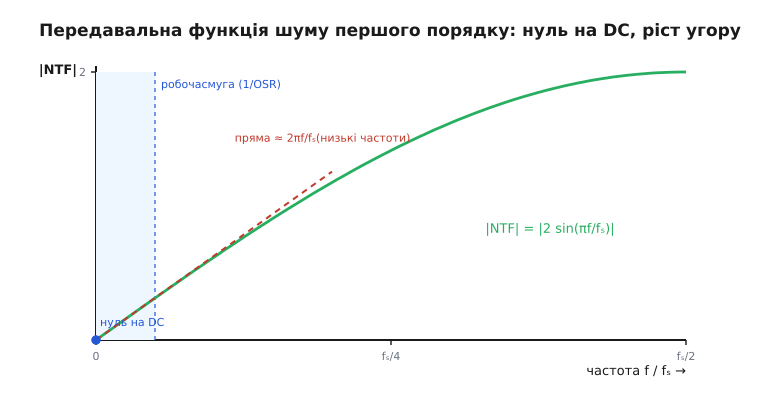

# 🧮 Математика формування шуму: звідки беруться 9 дБ за октаву

Розкидати ввімкнені такти рівномірно й сказати «шум витиснуто вгору» — це гарна картинка, але картинка ще нічого не доводить. Лишилося головне інженерне питання, на яке картинка не відповідає: **скільки саме** тиші ми за це купуємо. Якщо подвоїти тактову частоту модулятора — наскільки тихіше стане в робочій смузі? На 3 децибели? На 9? На 15? Різниця тут не косметична: вона вирішує, чи потягне ваш процесор задану якість на тих обертах, які він має, чи доведеться лізти на вищий порядок або в апаратний блок. А ще картинка не пояснює, **чому** проста ШІМ з усередненням виграє від тих самих обертів куди скупіше, ніж формування, — хоча, здавалося б, обидві просто розмазують похибку по ширшій смузі.

Щоб відповісти точно, доведеться один раз акуратно порахувати. Не страшно: уся арифметика тримається на трьох простих цеглинах — рівень шуму квантування, форма, якою петля його перефарбовує вздовж частоти, і площа під цією формою в робочій смузі. Складемо їх причинно, від першопричини, і число «дев'ять децибел за октаву» випаде саме, без жодного зазубреного коефіцієнта. А заразом стане видно, звідки беруться скупі «три» в усереднення й щедрі «п'ятнадцять» у другого порядку — це та сама формула з іншим показником степеня.

> 🔧 **Навіщо це.** Це той розрахунок, який роблять **до** написання прошивки. Вам кажуть: «треба 16 розрядів звуку з ніжки процесора» — а ви, маючи в руках лише ці формули, за хвилину прикидаєте, чи вистачить вашого таймера на 1 МГц, чи це безнадія й потрібен другий порядок. Без цієї математики тактову частоту вибирають навмання й або марнують обчислення на зайвий запас, або потім дивуються, чому в смузі гуде. З нею — ви заздалегідь знаєте ціну кожного децибела.

## Цеглина перша: скільки шуму робить грубий вихід

Почнімо з того, що взагалі є шум квантування й скільки його. Будь-який однобітний вихід — це найгрубіший квантувач на світі: він уміє сказати лише «повна шкала» або «нуль», а будь-яке число між ними передає не точно, а з похибкою округлення. Цю похибку — різницю між тим, що треба було видати, і тим, що грубий вихід насправді видав, — і звуть шумом квантування.

Щоб з нею рахувати, потрібна одна модель, і вона напрочуд проста. Коли сигнал перетинає багато рівнів квантування й робить це «непередбачувано» (а потік sigma-delta саме такий — він весь час смикається), похибка округлення поводиться як **рівномірний випадковий шум** у межах одного кроку квантування. Крок позначимо Δ (це відстань між сусідніми рівнями; для однобітного виходу — повна шкала). Похибка з однаковою ймовірністю лежить будь-де в проміжку від −Δ/2 до +Δ/2. Потужність (середній квадрат) такого рівномірного шуму — класичний результат, який легко взяти інтегралом середнього квадрата по рівномірному розподілу:

```
потужність шуму квантування = Δ² / 12
```

Звідки дванадцятка: середній квадрат рівномірної величини на відрізку шириною Δ дорівнює Δ²/12 — це інтеграл (1/Δ)·∫ e² de від −Δ/2 до +Δ/2. Запам'ятовувати її не треба, треба лише знати, що **повна потужність шуму квантування фіксована** — вона визначається тільки грубістю виходу (кроком Δ) і нічим більше. Скільки б ми не химичили з петлею, цю потужність ми не зменшимо ні на йоту: біт є біт. Усе, що ми можемо, — **переселити** цю фіксовану потужність уздовж частоти. Оце і є ключ до всього: гра не на кількості шуму, а на його **розташуванні**.

Цю модель — рівномірна похибка, потужність Δ²/12, і чому з неї випливає славнозвісне «6.02 децибела на кожен біт роздільності» — детально розгортає [шум квантування](root:hw-analog/quantization-noise). Тут нам досить однієї думки: повна потужність шуму стала, питання лише, де вона ляже на осі частот.

> 🔧 **Навіщо це.** Саме тому формування шуму взагалі можливе. Якби квантувач якось зменшував повну потужність похибки — не було б що переселяти, і весь прийом утратив би сенс. Але повна потужність прибита цвяхом до Δ²/12, тож єдиний важіль — перерозподіл за частотою. Зрозумівши це, ви ніколи не сплутаєте формування шуму з «фільтрацією шуму»: фільтр прибирає потужність, формування — лише пересуває її туди, де її потім легко прибрати фільтром.

## Цеглина друга: куди ця потужність лягає без формування

Перш ніж формувати, треба знати, від чого відштовхуємося. Уявімо найпростіший випадок — **жодного формування**, просто грубий вихід, який тактуємо швидко й усереднюємо (це і є проста ШІМ або звичайна передискретизація). Куди лягає шум тут?

Рівномірно. Це другий стандартний факт: шум квантування «білий» — його потужність розмазана рівним шаром по всій смузі частот аж до половини тактової (до Найквіста). Якщо повна потужність Δ²/12, а вона розкладена рівно на смугу від 0 до fₛ/2, то на кожен герц припадає однакова частка — **щільність** шуму стала по частоті.

Тепер дивимося, що дає передискретизація сама по собі. Хитрість усього прийому ось у чім: корисний сигнал займає лише вузеньку смугу внизу — від 0 до f_смуги (для звуку це до 20 кГц), а тактуємо ми набагато швидше. **Коефіцієнт передискретизації** (англ. oversampling ratio, OSR) — це і є відношення, у скільки разів частота Найквіста ширша за робочу смугу:

```
OSR = (fₛ / 2) / f_смуги
```

Повна потужність шуму Δ²/12 розмазана по всій смузі до fₛ/2. Але нам шкодить лише та частка, що випала **в робочу смугу** — решта (величезна, якщо OSR великий) лежить вище й буде зрізана фільтром. Оскільки щільність стала, частка шуму в смузі — це просто відношення ширини смуги до всієї смуги до Найквіста:

```
шум-у-смузі = (повна потужність) · (f_смуги / (fₛ/2)) = (Δ²/12) · (1 / OSR)
```

Ось перший корисний висновок, чисто з геометрії. **Подвоїли OSR — удвічі менше шуму в смузі.** Удвічі менша потужність — це 10·log₁₀(2) ≈ 3 децибели. Звідси й береться знаменита цифра: **проста передискретизація з усередненням дає 3 децибели за октаву** (за кожне подвоєння тактової частоти), що в перекладі на роздільність — півбіта за октаву. Шуму не поменшало, ми просто розмазали його ширше й більшу частку винесли за межі смуги.


*Сигнал петля проводить як є, а шум множить на цю криву: біля нуля частоти вона сама нуль, тож постійну й повільну складову шуму придушено майже повністю; угорі крива велика — туди шум і витискається.*

Тут варто розвіяти поширену плутанину, бо її легко зустріти й самому в неї вступити. Іноді кажуть, що усереднення дає «6 децибел за октаву». Це сплутані дві різні «шістки»: справжній **частотний** виграш простого усереднення — саме 3 дБ за октаву передискретизації (½ біта), а «6 децибел» — це інша, не пов'язана з частотою величина: **6.02 дБ на кожен доданий розряд** роздільності квантувача (це Bennett, 1948 — усталений результат, що випливає з тієї самої Δ²/12). Дві шкали, два явища: одне про те, скільки бітів у квантувачі, друге про те, у скільки разів ми перетактовуємо. За октаву передискретизації простий усереднювач набирає 3 дБ, не 6 — і саме на цю чесну планку ми дивимося, коли питаємо, чого вартує формування.

## Цеглина третя: що петля робить із цією формою

Тепер увімкнімо формування й подивімося, що зміниться. Уся різниця sigma-delta від простого усереднення в одній речі: петля зі зворотним зв'язком не лишає щільність шуму рівною — вона **множить її на криву**, яка душить низ і піднімає верх. Цю криву звуть передавальною функцією шуму (англ. noise transfer function, NTF): вона показує, у скільки разів петля підсилює чи приглушує шум квантування на кожній частоті, перш ніж той вийде на вихід.

Звідки вона береться — видно з самої будови петлі. Згадаймо, що в осерді sigma-delta стоїть акумулятор (інтегратор): він додає до себе різницю такт за тактом. Сигнал, який петля проводить на вихід без спотворення, і шум квантування, що народжується вже **після** інтегратора (у точці округлення «увімкнено/вимкнено»), проходять петлю **по-різному**. Сигнал іде наскрізь як є. А шум, щоб вийти, мусить «перебороти» зворотний зв'язок через інтегратор — і саме інтегратор визначає, як легко це вдається на різних частотах.

Інтегратор — це накопичувач, тож із повільним він справляється чудово, а на швидке майже не реагує (поки він збирає одну повільну хвилю, швидка встигає багато разів змінити знак і самознищитися в сумі). У термінах петлі це означає: на низьких частотах зворотний зв'язок дуже сильний (підсилення інтегратора велике) і тисне шум майже до нуля; на високих зворотний зв'язок слабкий — і шум проходить вільно. Якщо це записати точно, для модулятора **першого порядку** (один інтегратор) передавальна функція шуму виходить такою:

```
NTF(z) = 1 − z⁻¹
```

Запис із z⁻¹ — це мова затримки на один такт (z⁻¹ означає «значення такт тому»); похідне виведення цієї форми з рівняння петлі лежить у [z-перетворенні для дискретних систем](root:com-signal/z-transform), і брати його напам'ять не треба. Нам потрібен лише **модуль** цієї функції на кожній частоті — наскільки вона велика, бо саме на квадрат модуля множиться потужність шуму. Підставивши z = e^(j2πf/fₛ) (точка на одиничному колі, що відповідає частоті f) і взявши модуль різниці двох одиничних векторів, дістаємо чисту, наочну форму:

```
|NTF(f)| = |1 − e^(−j2πf/fₛ)| = 2 · sin(π f / fₛ)
```

Ця формула — серце всього. Прочитаймо її очима, бо в ній уже видно весь прийом. **На нулі частоти** (f = 0, постійна складова, DC) синус дорівнює нулю — отже, |NTF| = 0: постійну й найповільнішу складову шуму петля давить **до нуля**, повністю. Це і є той самий «нуль на DC», що його дає інтегратор. Що далі від нуля вгору, то більший синус і то слабше придушення; на Найквісті (f = fₛ/2) синус дорівнює одиниці, і |NTF| = 2 — там шум не лише не приглушено, а **підсилено вдвічі**. Крива монотонно лізе від нуля внизу до двійки нагорі: рівно те, що нам треба, — внизу тихо, шум зметено вгору.

А ще важливіше — **як саме** вона росте біля нуля, бо робоча смуга сидить у самому низу. Для малих кутів синус майже дорівнює своєму аргументу (sin x ≈ x), тож у робочій смузі, де f мала проти fₛ:

```
|NTF(f)| ≈ 2 · (π f / fₛ) = 2π f / fₛ        (низькі частоти)
```

Передавальна функція шуму внизу — це **пряма, що виходить із нуля з нахилом 2π/fₛ**. Лінійний ріст від нуля: подвоїли частоту — подвоїли |NTF|. Ось ця проста лінійність і дасть нам зараз потрібне число. (На фігурі вгорі ця пряма — пунктир, що тримається кривої біля початку й відходить угорі, де синус уже згинається до насичення.)

> 🔧 **Навіщо це.** Форма |NTF| — це і є «обіцянка» модулятора, яку він дає вашій робочій смузі. Дивлячись на неї, ви одразу бачите дві речі: де шум прибрано (унизу, біля нуля) і де його стало навіть більше, ніж було (нагорі, біля Найквіста). Звідси практичний наслідок: вашу робочу смугу треба тримати **якнайнижче відносно тактової**, у тому самому клині біля нуля, де крива притиснута до підлоги, — а весь піднятий шум лишити вгорі на поживу вихідному фільтру. Тактова частота, OSR і поведінка фільтра — це не три окремі налаштування, а три кінці однієї цієї кривої.

## Складаємо все: інтеграл шуму в робочій смузі

Тепер маємо всі три цеглини й можемо порахувати головне — **скільки шумової потужності лишилося в робочій смузі** після формування. Логіка пряма: щільність шуму на кожній частоті — це стала щільність білого шуму, помножена на квадрат |NTF| (бо множиться потужність, а потужність ∝ квадрат амплітуди). Потужність у смузі — це площа під цією щільністю від 0 до f_смуги, тобто **інтеграл**.

Запишімо. Біла щільність шуму — це повна потужність Δ²/12, поділена на ширину, по якій вона розмазана (від 0 до fₛ/2). Помножмо її на |NTF(f)|² і проінтегруймо по робочій смузі:

```
шум-у-смузі = ∫₀^f_смуги  (щільність) · |NTF(f)|²  df
```

У робочій смузі ми вже знаємо наближення: |NTF(f)| ≈ 2πf/fₛ, тож |NTF(f)|² ≈ (2πf/fₛ)² = 4π²f²/fₛ². Підставляємо й беремо інтеграл — а він елементарний, бо під ним усього лиш f²:

```
шум-у-смузі ≈ (Δ²/12) · (2/fₛ) · ∫₀^f_смуги (2π f / fₛ)² df
             = (Δ²/12) · (2/fₛ) · (4π²/fₛ²) · ∫₀^f_смуги f² df
             = (Δ²/12) · (2/fₛ) · (4π²/fₛ²) · (f_смуги³ / 3)
```

Тут (2/fₛ) — це 1/(fₛ/2), нормування білої щільності на смугу до Найквіста; а ∫ f² df = f³/3 — уся «магія» інтеграла. Зберімо й виразимо через OSR. Згадаймо, що OSR = (fₛ/2)/f_смуги, тобто f_смуги = (fₛ/2)/OSR = fₛ/(2·OSR). Підставивши це в f_смуги³ і прибравши спільні множники, після охайного скорочення (степені fₛ скорочуються начисто) лишається напрочуд чистий результат:

```
шум-у-смузі ≈ (Δ²/12) · (π² / 3) · (1 / OSR³)
```

Зупинімося й роздивімося цю формулу — вона варта того. Три множники, кожен зі змістом. Перший, Δ²/12, — це **повна потужність шуму квантування**, та сама фіксована цеглина: формування її не міняє. Другий, π²/3, — **стала ціна форми** першого порядку: чистий безрозмірний коефіцієнт, що випав із інтеграла квадрата синуса (точніше, його лінійного наближення), і нічого, крім порядку модулятора, не відображає. А третій, **1/OSR³**, — і є вся сила формування: шум у смузі спадає як **куб** коефіцієнта передискретизації.

Порівняймо два світи в одному рядку. Просте усереднення давало шум-у-смузі ∝ 1/OSR (перша цеглина-висновок). Формування першого порядку дає ∝ 1/OSR³. Та сама передискретизація б'є по шуму **втричі сильнішим показником степеня** — не «вдвічі менше за подвоєння», а «увосьмеро менше за подвоєння». Звідси й уся арифметика децибелів, до якої ми зараз і дійдемо.


*Шум у смузі — площа під параболою від нуля до межі смуги. Бо біля нуля парабола росте круто з нуля, основна площа сидить біля правого краю смуги; відсунувши край удвічі ближче до нуля, ми відрізаємо аж сім восьмих площі — звідси «÷8 за октаву», тобто −9 дБ.*

## Звідки точно беруться дев'ять децибел

Тепер переведемо «увосьмеро менше» в децибели — і дістанемо обіцяну цифру строго, без жодного округлення наосліп. Подвоїти OSR (піднятися на одну октаву передискретизації) означає, за щойно виведеною формулою, поділити шум-у-смузі на 2³ = 8. У децибелах потужності зменшення у 8 разів — це:

```
виграш за октаву = 10 · log₁₀(8) = 10 · log₁₀(2³) = 30 · log₁₀(2) ≈ 30 · 0.301 ≈ 9.03 дБ
```

Ось вони, **дев'ять децибел за октаву** для першого порядку — не приблизно й не з таблиці, а як прямий наслідок куба в 1/OSR³. Те саме в розрядах роздільності: 9.03 дБ ділимо на 6.02 дБ-на-розряд і дістаємо ≈ 1.5 розряду за кожне подвоєння тактової частоти. Порівняння з усередненням тепер чисте, як день:

```
просте усереднення:   шум ∝ 1/OSR¹   →  10·log₁₀(2) ≈ 3 дБ/окт   (½ розряду)
формування 1-го пор.:  шум ∝ 1/OSR³   →  10·log₁₀(8) ≈ 9 дБ/окт   (1.5 розряду)
```

Та сама октава передискретизації коштує однаково (удвічі вища тактова частота — однакові обчислення), але формування витягає з неї **втричі більше тиші**: 9 дБ замість 3. Оце і є відповідь на питання, з якого ми починали, — і тепер видно, що вона не випадкова, а сидить у показнику степеня, який поставив інтегратор петлі.

> 🔧 **Навіщо це.** Цей рядок — інженерний компас. Треба добрати 60 дБ у смузі простим модулятором? Ділимо 60 на 9 — близько сімох октав передискретизації, тобто OSR ≈ 2⁷ = 128. Хочете прикинути, чи дасть подвоєння тактової частоти відчутний виграш? Так, рівно 9 дБ — півтора розряду, варто. А якби ви помилково взяли «3 дБ за октаву» (планку усереднення) для оцінки sigma-delta — недооцінили б її втричі й даремно полізли б на захмарні частоти. Знати, який саме показник у вас працює, — це знати, скільки октав купувати.

## Другий порядок: той самий доказ, інший показник

Найкрасивіше, що весь цей доказ **узагальнюється одним рухом**. Поставмо в петлю **два** інтегратори поспіль (модулятор другого порядку) — і передавальна функція шуму просто підноситься до квадрата: кожен інтегратор додає свій множник (1 − z⁻¹), тож

```
NTF₂(z) = (1 − z⁻¹)²        →        |NTF₂(f)| = (2 sin(π f / fₛ))²
```

У робочій смузі, де синус ≈ свій аргумент, це означає |NTF₂(f)|² ≈ (2πf/fₛ)⁴ — під інтегралом тепер не f², а f⁴. Інтеграл ∫ f⁴ df = f⁵/5 дає в смузі вже **п'яту** степінь, і після того самого скорочення через OSR виходить:

```
шум-у-смузі (2-й пор.) ≈ (Δ²/12) · (π⁴ / 5) · (1 / OSR⁵)
```

Стала форми змінилася (тепер π⁴/5 ≈ 19.5 — інтеграл четвертого степеня синуса), але головне в показнику: шум спадає вже як **OSR⁵**. Подвоєння OSR ділить шум на 2⁵ = 32:

```
виграш за октаву (2-й пор.) = 10 · log₁₀(32) = 50 · log₁₀(2) ≈ 15.05 дБ
```

**П'ятнадцять децибел за октаву** — 2.5 розряду за кожне подвоєння. Закономірність тепер очевидна, і її можна записати раз і назавжди. Для модулятора **порядку L** (L інтеграторів) передавальна функція — це (1 − z⁻¹)^L, у смузі квадрат модуля ∝ f^(2L), інтеграл дає f^(2L+1), і шум у смузі спадає як:

```
шум-у-смузі ∝ 1 / OSR^(2L+1)
виграш за октаву = 10 · log₁₀( 2^(2L+1) ) = (6L + 3) дБ/окт
```

Підставте L і прочитайте всю драбину одним поглядом: L = 0 (нема формування, просте усереднення) → 3 дБ; L = 1 → 9 дБ; L = 2 → 15 дБ; L = 3 → 21 дБ. Кожен доданий інтегратор додає рівно **6 децибел до нахилу** (один розряд за октаву) — бо додає двійку до показника степеня 2L+1, а кожна одиниця показника — це 10·log₁₀(2)·2 ≈ 6 дБ. Уся ця сім'я кривих народжується з одного й того самого доказу; різниться тільки скільки разів синус піднесено до степеня.


*Та сама вісь октав, три різні нахили: усереднення повзе по 3 дБ, перший порядок лізе по 9, другий — по 15. За шість октав передискретизації усереднення набирає 18 дБ, а другий порядок — 90: ось ціна того, що показник степеня більший.*

> 🔧 **Навіщо це.** Звідси й народжується головне практичне рішення в проєктуванні sigma-delta: **порядок проти тактової частоти**. Не тягне процесор потрібну частоту для першого порядку (як у звуковому прикладі теми, де виходило близько 4 МГц)? Перейдіть на другий — і той самий результат візьмете на тактовій у кілька разів нижчій, бо кожна октава тепер коштує 15 дБ замість 9. Платите за це складнішою петлею (два інтегратори) і клопотом зі стійкістю на високих порядках — але часто це дешевше, ніж ганяти ніжку на мегагерцах. Формула (6L+3) — це і є той самий розмін, виражений числом.

## Один наскрізний рахунок

Зведімо весь апарат в одну задачу й проженімо її від початку до кінця — щоб формули перестали бути формулами й стали відповіддю.

**Скільки октав і яка тактова частота потрібні для 16-розрядного звуку.** Хочемо віддати з ніжки звук смугою 20 кГц з якістю 16 розрядів — це SNR близько 16·6.02 + 1.76 ≈ 98 дБ. Питання: чи витягне це перший порядок і на якій тактовій частоті; а якщо ні — що дасть другий?

```
ціль:  SNR ≈ 98 дБ у смузі f_смуги = 20 кГц

— перший порядок (9 дБ/окт):
   октав ≈ 98 / 9 ≈ 10.9
   OSR   ≈ 2^10.9 ≈ 1900
   fₛ    = OSR · 2 · f_смуги ≈ 1900 · 2 · 20 000 ≈ 76 МГц     ← нереально для ніжки

— другий порядок (15 дБ/окт):
   октав ≈ 98 / 15 ≈ 6.5
   OSR   ≈ 2^6.5 ≈ 91
   fₛ    = OSR · 2 · f_смуги ≈ 91 · 2 · 20 000 ≈ 3.6 МГц       ← уже досяжно

— просте усереднення (3 дБ/окт), для контрасту:
   октав ≈ 98 / 3 ≈ 32.7
   OSR   ≈ 2^32.7 ≈ 7·10⁹                                       ← безнадія
```

**Висновок.** Той самий 16-розрядний звук вимагає від простого усереднення фантастичних мільярдів передискретизації (тобто принципово недосяжний — оце й була причина винайти формування), від першого порядку — десятки мегагерц (зависоко для перемикань у перериванні), а від другого порядку — лише близько 3.6 МГц, що для апаратного модулятора цілком реально. Один і той самий показник степеня 2L+1, який ми вивели з інтеграла, тут прямо вирішує, можлива задача чи ні. Це і є практична вага всієї цієї математики: вона не прикраса до картинки про розкидані біти, а той інструмент, яким наперед визначають, **що взагалі здійсненне** на наявному залізі — і чи варто платити за вищий порядок.

## Що варто винести

Уся «магія» формування шуму вкладається в один причинний ланцюг. Повна потужність шуму квантування фіксована (Δ²/12) — її не зменшити, можна лише переселити вздовж частоти. Петля sigma-delta першого порядку множить шум на передавальну функцію |NTF(f)| = 2·sin(πf/fₛ), яка дорівнює нулю на DC і лінійно росте внизу як 2πf/fₛ, — то й шум вона тисне до нуля внизу й піднімає вгорі. Інтеграл цього формованого шуму по вузькій робочій смузі дає в-смузі-потужність ∝ 1/OSR³ проти ∝ 1/OSR у простого усереднення; куб замість першого степеня — це **9 дБ за октаву проти 3**, тобто 1.5 розряду проти ½ за кожне подвоєння тактової частоти. (А «6 дБ» з фольклору — то інша шкала, 6.02 дБ на доданий розряд квантувача, не плутати з частотним виграшем.) Кожен доданий інтегратор підносить NTF до наступного степеня й додає двійку в показник 1/OSR^(2L+1), тобто рівно 6 дБ до нахилу: загальне правило — **(6L+3) дБ за октаву**, звідки 15 дБ для другого порядку й уся драбина вище. І саме цей показник степеня, виведений з одного простого інтеграла квадрата синуса, на практиці вирішує головне: яку тактову частоту й який порядок узяти, щоб задана якість узагалі вмістилася в наявне залізо.
