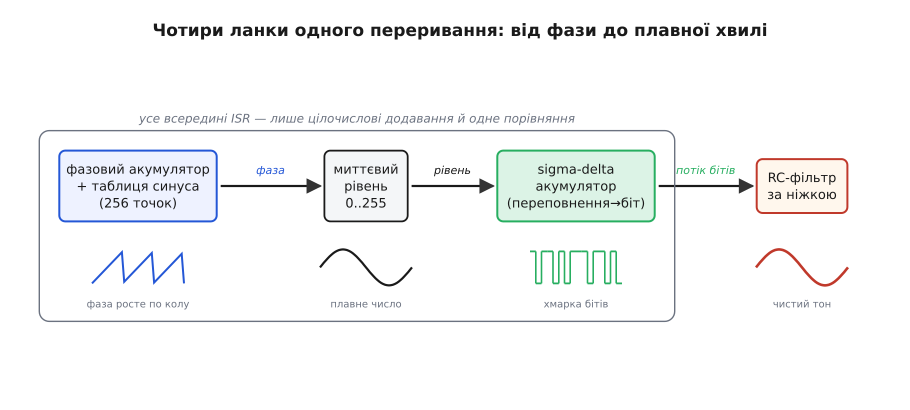

# ⚙️ Прошивка sigma-delta модулятора: синусоїда з голої ніжки

Уся теорія sigma-delta ШІМ варта рівно стільки, скільки коштує її запустити на залізі. А запускається вона напрочуд дешево: ядро модулятора — це **дві дії на такт**, додавання й порівняння, без жодного множення. Тут ми зберемо з цього ядра повний робочий тракт: табличний генератор синусоїди → миттєвий рівень → модулятор → один вивід процесора, — піднімемо його з першого порядку до другого, щоб шум став тихішим, і розберемо пастки, на яких такий код спотикається в реальному приладі: переповнення акумулятора, холості тони й заборону гальмувати переривання.

Усе нижче — справжній C для прошивки, не псевдокод. Регістри й макроси на кшталт `GPIO_SET` я лишаю узагальненими (на кожному мікроконтролері вони звуться інакше), а от математику тракту пишу точно так, як вона має лягти в кремній.

## Задача: видати плавний звук однією цифровою ніжкою

Сформулюймо вузько й чесно. **Дано:** мікроконтролер із одним цифровим виводом і таймером, що вміє кликати переривання на сталій високій частоті. Зовнішнього ЦАП немає, гідного апаратного ШІМ — теж (або його роздільності бракує). За виводом стоїть найпростіший однополюсний RC-фільтр і, скажімо, маленький динамік чи п'єзо. **Треба:** гнати в цей вивід синусоїду заданої частоти так, щоб після фільтра вийшов чистий тон, а не деренчання.

Чому це взагалі складно? Бо вивід уміє лише дві речі — притиснутися до живлення або до землі. Між ними нічого: ні половини напруги, ні третини. А синусоїда — це суцільна плавна крива, кожне її значення лежить десь **між** нулем і одиницею. Здавалося б, безвихідь: грубий двійковий вихід проти плавного аналогового сигналу. Уся sigma-delta ШІМ — це і є спосіб обернути цю безвихідь на перевагу, видаючи плавне середнє хмаркою коротких бітів, розкиданих так густо й рівномірно, що фільтрові лишається тільки злегка їх згладити. *Чому* саме розкидання робить пульсацію високочастотною й чому це формує шум угору частотою — пояснено в [статті-власнику про sigma-delta ШІМ](topic:hw-analog/sigma-delta-pwm); тут ми це беремо як даність і **програмуємо**.

Розкладімо тракт на ланки, кожна з яких — окремий шматок коду:

```
таблиця синуса → миттєвий рівень 0..N → модулятор (акумулятор) → біт → GPIO
     (фаза)          (що видати)           (як видати грубо)      (ON/OFF)
```

Перша ланка вирішує, **що** видати цієї миті (яке значення синуса). Друга — головна — вирішує, **як** видати це плавне число грубим бітом, не загубивши точності. Третя кладе біт на ніжку. Уся хитрість сидить у другій ланці, тож із неї й почнемо, а тоді обростимо її першою й третьою.

## Ідея: акумулятор-боржник, що ніколи нічого не забуває

Серце модулятора — один цілочисловий лічильник, який я зватиму **акумулятором** (лат. accumulare — нагромаджувати). У нього один обов'язок: пам'ятати весь борг округлення, який ми досі не віддали.

Аналогія, що тримає все, — касир, котрому треба видавати в середньому, скажімо, 0.375 монети за хід, а монети лише цілі. Дурний касир щоразу округляв би 0.375 до нуля й не давав нічого — середнє вийшло б нуль, чиста брехня. Розумний **записує борг**: щоходу додає 0.375 до рахунку, а коли там набереться ціла монета — видає її й віднімає одиницю, лишаючи здачу. На довгій дистанції він віддасть рівно 0.375 монети за хід, бо жодна крихта не пропадає — кожна рано чи пізно набереться на цілу й виправиться.

Переведімо це в цілі числа, бо процесор любить цілі, а не дроби. Замість «0.375 монети» візьмемо рівень як ціле від 0 до повної шкали. Хай повна шкала буде 256 (вісім розрядів роздільності), тоді 0.375 — це рівень 96. Акумулятор теж цілий. Щотакту:

```
acc += level          # додали борг (величину входу)
if acc >= 256:        # набралося на цілу монету?
    acc -= 256        # віддали монету, лишили здачу
    вихід = ON        # цей такт вивід притиснутий до живлення
else:
    вихід = OFF       # ще не набралося — вивід до землі
```

Оце і вся sigma-delta першого порядку. «Борг» — накопичена похибка в `acc`; «видав монету» — увімкнув вихід на такт; «віддав монету, лишив здачу» — `acc -= 256`, бо ввімкнений вихід доклав до середнього повну порцію, а решта боргу лишилася чекати. Що більший `level`, то швидше росте `acc`, то частіше він перескакує через 256, то густіший потік ввімкнених тактів — рівно як треба.

Зверніть увагу на тонку красу: умова `acc >= 256` і дія `acc -= 256` — це просто **переповнення восьмибітного розряду**. Якщо зробити акумулятор такої ширини, що молодші вісім бітів — це «здача», а дев'ятий — це «набралася монета», то перевірка переповнення стає геть безкоштовною: біт перенесення сам і є наш вихід. До цього трюку ми ще повернемося, коли вибиратимемо ширину акумулятора, — він прибирає навіть оте порівняння й віднімання.

> 🔧 **Навіщо це.** Здача в акумуляторі — це не дрібниця, а **вся точність** тракту. Саме вона робить різницю між sigma-delta й тупим округленням: викиньте здачу (`acc = 0` щотакту замість `acc -= 256`) — і ви отримаєте звичайну ШІМ із усіма її бідами, бо похибка перестане пам'ятатися й накопичуватися в правильний бік. Та сама пам'ять похибки живить і [sigma-delta АЦП](topic:hw-analog/sigma-delta-adc), тільки там петля працює на вході (оцифровує напругу), а в нас — на виході (синтезує її).

## Перша ланка: звідки беремо рівень — таблиця синуса

Перш ніж модулювати, треба щось модулювати — потік миттєвих рівнів синусоїди. Рахувати `sin()` у перериванні на кожному такті — найгірше, що можна вигадати: ця функція повільна, тягне за собою плаваючу кому, і ми б наглухо забили нею процесор (чому це смертельно для ISR — окрема пастка нижче). Натомість синус рахують **один раз наперед** і кладуть у таблицю, а в роботі лише вибирають із неї за поточною фазою. Це класична табличний генератор, або пряма цифрова генерація — той самий принцип, що в апаратних [DDS-синтезаторах](topic:hw-analog/dds-synthesis): фаза накопичується, а таблиця перетворює її на миттєву амплітуду.

Таблицю на 256 точок наповнюємо одним циклом на старті:

```c
#include <stdint.h>
#include <math.h>

#define SINE_POINTS   256u          // точок на період синуса (степінь 2 — навмисне)
#define SINE_MID      128           // 0 синуса лягає на середину шкали
#define SINE_AMP      120           // амплітуда (трохи менша за 128 — лишаємо запас)

static uint8_t sine_tab[SINE_POINTS];

// Викликати ОДИН раз на старті, поза будь-яким перериванням.
void sine_table_init(void)
{
    for (uint16_t i = 0; i < SINE_POINTS; ++i) {
        double phase = 2.0 * M_PI * (double)i / (double)SINE_POINTS;
        double s     = sin(phase);                 // -1 .. +1
        // Перенесли в діапазон рівня 0..255: середина 128 + амплітуда·синус.
        sine_tab[i] = (uint8_t)(SINE_MID + SINE_AMP * s + 0.5);
    }
}
```

Чому амплітуда 120, а не повні 127? Бо синус, доведений до самого краю шкали (0 і 255), заганяє модулятор у кути, де він гірше поводиться: коло рівнів «майже завжди ON» і «майже завжди OFF» потік бітів стає рідким і нерівним, спотворення росте. Лишивши невеликий запас з обох боків, ми тримаємо модулятор у його комфортній зоні, де він найточніший. Це той самий запас, що в аналоговій техніці зветься недовантаженням і рятує від кліпування на краях.

Тепер — як по цій таблиці бігти з потрібною частотою тону. Фазу накопичуємо так само цілочислово, окремим лічильником, а швидкість бігу задаємо кроком (англ. phase increment). Що більший крок — то швидше проскакуємо таблицю — то вищий тон:

```c
#define PHASE_BITS    24u                       // ширина фазового акумулятора
#define PHASE_MAX     (1uL << PHASE_BITS)        // повний оберт фази

static uint32_t phase_acc;                       // поточна фаза (накопичується)
static uint32_t phase_inc;                       // крок фази за такт → задає тон

// Перерахунок кроку фази під бажану частоту тону (Гц) і такт ISR (Гц).
// f_тону = f_такт · phase_inc / 2^PHASE_BITS  →  phase_inc = f_тону · 2^PHASE_BITS / f_такт
void set_tone_hz(uint32_t tone_hz, uint32_t isr_hz)
{
    phase_inc = (uint32_t)(((uint64_t)tone_hz << PHASE_BITS) / isr_hz);
}

// Один крок генератора: повернути миттєвий рівень синуса 0..255.
static inline uint8_t next_sine_level(void)
{
    phase_acc += phase_inc;                                  // крутимо фазу
    uint8_t idx = (uint8_t)(phase_acc >> (PHASE_BITS - 8));  // старші 8 бітів → індекс таблиці
    return sine_tab[idx];
}
```

Тонкість, заради якої фазовий акумулятор широкий (24 біти), а таблиця коротка (256): **роздільність частоти й роздільність форми — різні речі**. Якби фаза мала ту саму розрядність, що й таблиця, ми могли б задавати лише грубий набір частот (одна точка таблиці за такт — і все). Широка фаза дозволяє крихітний крок — частку точки за такт, — тож тон налаштовується тонко, до часток герца, а таблиця лишається маленькою. Старші вісім бітів фази обирають точку таблиці, молодші шістнадцять — це дробова частина фази, яка просто копиться до наступного перескоку індексу.

> 🔧 **Навіщо це.** Розділення «фаза 24 біти / таблиця 256 точок» — стандартний хід будь-якого цифрового генератора звуку чи зв'язку. Він дає те, що в апаратних DDS коштує окремої мікросхеми: точне налаштування частоти тонким кроком при дешевій короткій таблиці. Захочете кілька тонів водночас — заведіть кілька пар (`phase_acc`, `phase_inc`) і складіть їхні рівні; захочете не синус, а пилку чи трикутник — поміняйте лише вміст таблиці, решта тракту не зміниться.

## Складаємо тракт: перший порядок у перериванні таймера

Тепер з'єднаємо три ланки в одне переривання. Таймер сконфігуровано тикати на сталій високій частоті — хай 250 кГц; на кожен тик зайде наша ISR, прокрутить фазу, дістане рівень, прожене його крізь модулятор і виставить ніжку. Ось ядро модулятора окремою функцією, точно як міркували вище:

```c
// ── Sigma-delta модулятор ПЕРШОГО порядку ─────────────────────────────────
// level — потрібний середній рівень 0..255 (8 розрядів роздільності).
// Повертає 1, якщо вивід на цей такт треба ввімкнути, інакше 0.

#define SD_SCALE   256u                  // повна шкала рівня (8 розрядів)

static uint16_t sd_acc;                  // акумулятор похибки — ШИРШИЙ за рівень

static inline uint8_t sd1_tick(uint8_t level)
{
    sd_acc += level;                     // накопичуємо «борг»
    if (sd_acc >= SD_SCALE) {            // набралося на цілу порцію?
        sd_acc -= SD_SCALE;              // лишаємо тільки здачу
        return 1;                        // вихід ON цей такт
    }
    return 0;                            // ще не набралося — вихід OFF
}
```

А ось саме переривання — повний тракт від фази до ніжки:

```c
// ── Прив'язка до заліза (узагальнено; на вашому МК макроси інші) ──────────
#define SPK_PORT   GPIOA
#define SPK_PIN    5u
#define GPIO_SET(port, pin)   ((port)->BSRR = (1u << (pin)))          // ніжка → 1
#define GPIO_CLR(port, pin)   ((port)->BSRR = (1u << ((pin) + 16u)))  // ніжка → 0

// Виклик ІЗ переривання таймера на сталій частоті (напр. 250 кГц).
void TIMER_ISR(void)
{
    TIMER_CLEAR_FLAG();                  // ПЕРШИМ ділом — зняти прапор переривання

    uint8_t level = next_sine_level();   // 1) що видати цієї миті
    uint8_t bit   = sd1_tick(level);     // 2) як видати грубим бітом

    if (bit)                             // 3) кладемо біт на ніжку
        GPIO_SET(SPK_PORT, SPK_PIN);
    else
        GPIO_CLR(SPK_PORT, SPK_PIN);
}
```

Дев'ять рядків роботи — і з ніжки вже йде синусоїда, яку RC-фільтр перетворить на чистий тон. Зверніть увагу на дві речі, що відрізняють це від ШІМ. Перше: частота переривання **стала** — модулятор завжди тикає однаково й щоразу вирішує лише «так чи ні», тоді як ШІМ міняв би **ширину** імпульсу в кадрі. Кадру тут немає взагалі. Друге: `level` можна міняти будь-коли й як завгодно плавно — модулятор підхопить нове значення з наступного ж такту, бо він ні до чого не прив'язаний, окрім власного акумулятора. Саме тому синусоїда виходить гладенька: рівень повзе по таблиці точка за точкою, а модулятор слухняно за ним устигає.


*Чотири ланки одного переривання: фаза обирає точку таблиці, таблиця дає рівень, акумулятор перетворює рівень на потік бітів, RC-фільтр повертає з потоку плавну хвилю. Усе всередині ISR — лише цілочислові додавання й одне порівняння.*

## Тихіше: перехід до другого порядку

Перший порядок працює, але його шум спадає з частотою лише по нахилу «дев'ять децибел на октаву» — кожне подвоєння тактової частоти прибирає з робочої смуги близько 9 дБ шуму (це усталений результат теорії формування шуму; виведення — у [математиці формування шуму](topic:hw-analog/sigma-delta-pwm/math-noise-power.md)). Щоб витягти, скажімо, чистий звуковий тракт, першому порядку треба захмарна тактова частота. Дешевший шлях — **підняти порядок**: другий порядок дає вже близько 15 дБ на октаву, тобто за ту саму тактову частоту шуму в смузі помітно менше, а за ту саму тишу — нижча потрібна частота. (Загальне правило, теж усталене: модулятор N-го порядку дає (6·N + 3) дБ на октаву; перший — 9, другий — 15, третій — 21.)

Звідки береться вищий порядок? З того, що ми пам'ятаємо похибку **двічі глибше**. У першому порядку акумулятор інтегрує похибку один раз. У другому ми ставимо **два інтегрування поспіль**: похибку округлення не просто копимо, а копимо ще й її власне накопичення. Найзручніша для прошивки форма — так звана структура зі зворотним зв'язком за похибкою (англ. error feedback): ми точно знаємо, яку похибку округлення зробили цього такту (це різниця між тим, що хотіли видати, і повною/нульовою порцією, яку реально видали), і завертаємо цю похибку назад у вхід через фільтр другого порядку. Для другого порядку фільтр зворотного зв'язку — це `2·e[n−1] − e[n−2]`: подвоєна минула похибка мінус позаминула. Саме ця комбінація дає форму шуму (1 − z⁻¹)², тобто подвійний нахил угору.

На практиці це виглядає як **два акумулятори каскадом**. Перший збирає вхід, другий збирає вихід першого, а вирішує про вихідний біт переповнення другого:

```c
// ── Sigma-delta модулятор ДРУГОГО порядку (каскад двох акумуляторів) ──────
// Два інтегрування поспіль → шум спадає крутіше (≈15 дБ/октаву проти 9).
// Акумулятори знакові й ширші: у другому порядку розмах сигналу всередині
// петлі більший, ніж рівень, і може заходити в мінус.

static int32_t sd_acc1;                   // перший інтегратор
static int32_t sd_acc2;                   // другий інтегратор

static inline uint8_t sd2_tick(uint8_t level)
{
    // Порція, яку реально докладе вихід: повна шкала, якщо ON, інакше 0.
    // Рішення «ON чи OFF» беремо зі стану ДРУГОГО інтегратора.
    int32_t fb = (sd_acc2 >= 0) ? (int32_t)SD_SCALE : 0;

    // Два інтегрування: кожен акумулятор додає (вхід − зворотний зв'язок).
    sd_acc1 += (int32_t)level - fb;       // перший інтегратор
    sd_acc2 += sd_acc1        - fb;       // другий інтегратор бере вихід першого

    return (fb != 0) ? 1u : 0u;           // ON, якщо віддали повну порцію
}
```

Прочитаймо це причинно. Рішення про біт ухвалює знак другого інтегратора: додатний — пора видати порцію (ON), від'ємний — притримати (OFF). Щойно вирішили, ми **обом** інтеграторам відкладаємо те, що реально віддали (`fb` — повна шкала або нуль), і обидва накопичують різницю «хотіли − віддали». Перший інтегратор веде грубий борг, як і в першому порядку; другий інтегрує **сам цей борг** — і саме це друге інтегрування вигинає шум удвічі крутіше вгору частотою, бо повільні складові похибки тепер давляться двічі.

Підмінити перший порядок другим у тракті — це рівно один рядок: замість `sd1_tick(level)` викликати `sd2_tick(level)`. Решта переривання — фаза, таблиця, ніжка — не міняється ні на йоту. Ось чому варто було винести модулятор окремою функцією: порядок стає змінною налаштування, а не переписуванням тракту.


*Один акумулятор проти двох. Друге інтегрування коштує кількох зайвих додавань на такт, а натомість вигинає шум удвічі крутіше геть із робочої смуги — той самий результат, що й подвоєння тактової частоти першого порядку, але без подвоєння перемикань.*

Дарма це не дається. Другий порядок має дві розплати, обидві треба тримати в голові. Перша: всередині петлі гуляють **більші** числа, ніж сам рівень, і вони заходять у мінус — тому акумулятори тут знакові (`int32_t`) і з добрячим запасом ширини, а не вісімнадцятибітні без знаку. Друга: вищі порядки схильні до **нестійкості** на входах коло самого краю шкали — петля може «розгойдатися», і другий інтегратор поповзе в нескінченність. Саме тому ми раніше навмисне взяли амплітуду синуса з запасом (120, не 127), а нижче, у пастках, поставимо ще й запобіжник-обмежувач. Для звуку до третього порядку зазвичай зупиняються: вище за третій без хитрого приборкання петля стає примхливою, а виграш у тиші вже не вартий мороки.

## Дві ручки якості: тактова частота й ширина акумулятора

Коли модулятор написано, лишаються два числа, що вирішують усю якість тракту: **як швидко** тикати й **якої ширини** робити акумулятор. Розберімо обидва, бо помилка тут — найчастіша причина, чому «той самий код у когось співає, а в мене хрипить».

**Тактова частота — це передискретизація, а передискретизація — це тиша.** Чим частіше тикає ISR порівняно зі смугою корисного сигналу, то більше «октав» формування шуму ми набираємо, то тихіше в робочій смузі. Залежність пряма: кожне подвоєння тактової частоти прибирає 9 дБ (перший порядок) або 15 дБ (другий). Прикиньмо потрібну частоту на конкретному завданні.

**Приклад-розрахунок: яка тактова частота дасть 60 дБ у звуковій смузі.**

```
Ціль: 60 дБ сигнал/шум у смузі до 20 кГц.

Перший порядок (9 дБ/октаву):
  октав ≈ 60 / 9 ≈ 6.7
  OSR   = 2^6.7 ≈ 104
  f_такт ≈ OSR · 2 · 20 кГц = 104 · 40 кГц ≈ 4.2 МГц   ← забагато для ISR

Другий порядок (15 дБ/октаву):
  октав ≈ 60 / 15 = 4.0
  OSR   = 2^4 = 16
  f_такт ≈ 16 · 2 · 20 кГц = 16 · 40 кГц ≈ 0.64 МГц     ← цілком реально
```

**Висновок.** Та сама тиша, що першому порядку коштує 4 МГц перемикань (непідйомно для переривання — процесор захлинеться), другому дається на ~640 кГц. Оце і є практичний сенс другого порядку: він **купує тишу не швидкістю, а пам'яттю**. Загальне правило тримайте в голові завжди: тактову частоту бережіть якнайвищою (наскільки терпить процесор), бо кожне її подвоєння прямо віддає вам 9 чи 15 дБ; а коли впираєтесь у стелю частоти — піднімайте порядок. Тонше про розмін передискретизації на роздільність — у темі [передискретизації й децимації](topic:hw-analog/oversampling-decimation).

**Ширина акумулятора — щоб «здача» нікуди не втекла.** Акумулятор має вміщати суму без власного, непередбаченого переповнення, інакше здача губиться, і вся точність провалюється. Правило просте: акумулятор має бути **ширший за рівень рівно настільки, щоб у ньому містилася повна шкала плюс найбільша можлива здача**. Для першого порядку з восьмибітним рівнем (шкала 256) досить шістнадцяти бітів: молодші вісім — здача, дев'ятий — біт переповнення, решта — недосяжний запас.

І ось тут той самий трюк, що я обіцяв на початку. Якщо взяти ширину акумулятора **точно** під шкалу — щоб переповнення розряду саме й означало «набралася монета», — то порівняння й віднімання зникають зовсім, бо за нас їх робить апаратне переповнення:

```c
// Найдешевший перший порядок: повна шкала = 2^16, тож переповнення uint16_t
// САМЕ Й Є «набралася монета». Жодного порівняння, жодного віднімання.
// level масштабуємо на повний діапазон 16 бітів (level8 << 8).

static uint16_t sd_acc16;

static inline uint8_t sd1_tick_fast(uint16_t level16)
{
    uint16_t prev = sd_acc16;
    sd_acc16 += level16;                 // акумулятор крутиться по колу 0..65535
    // Перенесення = акумулятор «обгорнувся» через 0, тобто новий < старого.
    return (sd_acc16 < prev) ? 1u : 0u;  // обгорнувся → монета → вихід ON
}
```

Тут повна шкала — це повний оберт шістнадцятибітного лічильника, а «переповнення через шкалу» перетворилося на природне обгортання `uint16_t` через нуль, яке ми ловимо порівнянням `новий < старий`. Здача лишається в `sd_acc16` сама собою — ми її ніколи й не чіпали. Це найшвидше можливе ядро: одне додавання й одне порівняння, жодного віднімання. Платимо лише тим, що рівень треба подати масштабованим на повні шістнадцять бітів (для восьмибітної цілі — `level << 8`).

> 🔧 **Навіщо це.** Вибір ширини — не педантизм, а пряма межа між «співає» і «хрипить». Замала ширина — і акумулятор переповнюється не там, де треба, ковтаючи здачу: на виході замість тону лізе грязь, причому тим гірша, чим тонший рівень ви намагаєтесь видати. У другому порядку це вдвічі підступніше, бо там числа всередині петлі більші за рівень і ще й знакові, — тому беріть `int32_t` із запасом, а не «впритул», і не економте тут такти-байти: переповнення акумулятора — це не «трохи шуму», це раптовий стрибок виходу на пів-шкали, чутний як тріск.

## Пастки

Алгоритм короткий, але живе серед кількох пасток, і кожна вже когось підводила. Розберімо з механізмом, а не списком «обережно».

**Переповнення акумулятора — найтихіша й найзліша.** Ми щойно про неї говорили, але повторю окремо, бо вона не подає тривоги. Коли акумулятор завузький, він обгортається не на тій межі — і «здача», що мала чекати наступного такту, безслідно зникає. Зовні код працює, помилки не кидає, але потік бітів перестає точно відповідати входу: на виході з'являється сторонній шум або тон, а на «незручних» рівнях — раптові стрибки на пів-шкали, чутні як тріск. Лікування одне — рахунок ширини наперед: акумулятор мусить уміщати повну шкалу плюс найбільшу здачу, і в другому порядку з добрячим запасом і зі знаком. Перевірте подумки найгірший випадок (максимальний рівень, максимальна накопичена здача) — і дайте ширини більше за нього.

**Холості тони — свист на тиші.** Коли вхід застигає на місці, ще й на «зручному» для петлі рівні (рівно половина, чверть, третина шкали), потік бітів може зірватися в коротку правильну петлю, що повторюється такт у такт. Періодичний потік — це чистий тон: на виході виникає тонкий свист на цілком конкретній частоті, **навіть коли сам сигнал мовчить** (звідси й назва — холості тони, англ. idle tones). Підступність у тому, що частота цього свисту залежить від рівня входу, тож він гуляє й виринає там, де його не чекаєш. Це усталено вивчене явище: на сталому вході модулятор впадає в граничний цикл, і його основна частота пропорційна цьому входу.

Лікують холості тони **дизерингом** (англ. dither — тремтіння): до входу домішують крихітний випадковий шум, який щотакту трохи смикає рівень і не дає потоку застигнути в правильну петлю. Тон розмазується в тихий рівний шурхіт, який вуху чути куди менше, ніж чистий свист. Платимо за це дещицею загального шуму (трохи піднімаємо «підлогу»), але вбиваємо найнеприємніше — періодичність:

```c
// ── Дизеринг: розбити холості тони крихітним шумом на вході ───────────────
// Дешевий генератор псевдовипадкових чисел (xorshift) — швидкий, без множень.
static uint32_t rng_state = 0x1234ABCDu;

static inline uint32_t rng_next(void)
{
    uint32_t x = rng_state;
    x ^= x << 13; x ^= x >> 17; x ^= x << 5;   // три зсуви — і готово
    return (rng_state = x);
}

// Додати дизер до рівня ПЕРЕД модулятором. Амплітуда дизера крихітна:
// одиниці молодшого розряду, не більше — інакше задавимо корисний сигнал.
static inline uint8_t add_dither(uint8_t level)
{
    int32_t d = (int32_t)(rng_next() & 0x3u) - 1;   // шум у межах -1..+2 LSB
    int32_t v = (int32_t)level + d;
    if (v < 0)   v = 0;                              // не випасти за межі шкали
    if (v > 255) v = 255;
    return (uint8_t)v;
}
```

У перериванні дизер вставляється однією заміною: `sd1_tick(add_dither(level))` замість `sd1_tick(level)`. Тримайте амплітуду дизера мінімальною — буквально одиниці молодшого розряду: цього досить, щоб розбити петлю, але мало, щоб не зіпсувати корисний сигнал. Завеликий дизер вилікує тони ціною загального гулу — а це обмін шила на мило.

> 🔧 **Навіщо це.** Холості тони — улюблений «привид» у простих звукових трактах на мікроконтролері: усе тихо, аж раптом на певній гучності чи на паузі лізе тонкий писк, який ніяк не зловити осцилографом за один знімок. Перш ніж винуватити залізо, додайте крихту дизера — найчастіше писк зникає, бо це й був холостий тон модулятора, а не наводка. Глибше про природу дизера й чому крихта шуму **покращує** точність — у [математиці дизерингу](topic:hw-analog/adc-resolution/math-dithering.md).

**Нестійкість другого порядку — стеж за межею.** Як ми бачили, вищі порядки розгойдуються на входах коло самого краю шкали: другий інтегратор поповзе в нескінченність, і вихід зірветься. Запобіжник — **обмежувач** (англ. clamp) на другому інтеграторі: не пускати його за розумні межі, відрубаючи розгін на корені. Це усталена практика — структури зі зворотним зв'язком за похибкою саме так і стабілізують, бо при перевантаженні їхня похибка стає необмеженою:

```c
// Запобіжник від розгону другого інтегратора: тримати його в межах.
// Межу беруть із запасом над нормальним розмахом — кілька повних шкал.
#define SD2_CLAMP   (4 * (int32_t)SD_SCALE)

static inline void sd2_clamp(void)
{
    if (sd_acc2 >  SD2_CLAMP) sd_acc2 =  SD2_CLAMP;
    if (sd_acc2 < -SD2_CLAMP) sd_acc2 = -SD2_CLAMP;
}
```

Виклик `sd2_clamp()` ставлять одразу після оновлення інтеграторів у `sd2_tick`. Разом із запасом амплітуди на вході (та сама причина, чому синус мав 120, а не 127) це надійно тримає петлю в стійкій зоні. Обмежувач трохи спотворює сигнал на самих піках, але це незмірно краще за зрив у нескінченність, де вихід просто замовкає або застрягає.

**Гальмувати переривання — смертельно.** І найголовніша пастка, бо вона валить увесь тракт незалежно від решти. Наша ISR викликається на сталій високій частоті — 250 кГц означає, що між тиками лише **чотири мікросекунди**. Усе, що ми робимо в перериванні, **мусить** укластися в цей проміжок із запасом, інакше наступний тик прийде раніше, ніж ми впораємось із попереднім, — і тракт розсиплеться: біти підуть нерівно, тон попливе, у гіршому разі система зависне в перериваннях, не лишивши часу головному кодові.

Звідси — залізні заборони всередині цієї ISR. **Жодного `sin()`, `cos()`, ділення, плаваючої коми** — саме тому синус лежить у таблиці, а не рахується щотакту: один `sin()` коштує сотні тактів, ми б не вклалися й близько. **Жодних повільних операцій** — звернень по інтерфейсах (UART, I²C, SPI), очікувань, циклів невідомої довжини. **Жодних `printf`** і подібного — це найповільніше, що буває. Усе важке — наповнення таблиці, перерахунок кроку фази під нову частоту, зміна гучності — робиться **поза** перериванням, у головному коді, а в ISR залишаються самі додавання, одне-два порівняння й виставлення ніжки.

```c
// ПРАВИЛЬНО: в ISR — лише цілочислова дешева робота.
void TIMER_ISR(void)
{
    TIMER_CLEAR_FLAG();
    uint8_t level = next_sine_level();          // вибірка з таблиці — дешево
    uint8_t bit   = sd1_tick(add_dither(level));// додавання + порівняння — дешево
    if (bit) GPIO_SET(SPK_PORT, SPK_PIN);
    else     GPIO_CLR(SPK_PORT, SPK_PIN);
}

// НЕПРАВИЛЬНО (так робити НЕ можна): важка математика просто в ISR.
void TIMER_ISR_bad(void)
{
    TIMER_CLEAR_FLAG();
    double s = sin(2.0 * M_PI * t);             // ← сотні тактів, не вкладемось
    uint8_t level = (uint8_t)(128 + 120 * s);   // ← плаваюча кома в перериванні
    t += dt;
    // ... наступний тик уже прийшов, поки ми тут рахували sin() → тракт зламано
}
```

Є ще тонкість зі **спільними змінними**. Рівень гучності, частоту тону, прапор «грати/мовчати» головний код міняє, а ISR читає. Якщо ISR прочитає таку змінну в момент, коли головний код її наполовину записав (а 32-бітну величину на 8- чи 16-бітному МК пишуть кількома кроками), вийде покручене значення. Тому такі змінні позначають `volatile`, а оновлення ширших за слово величин роблять атомарно — коротко вимкнувши переривання на час запису:

```c
volatile uint32_t shared_phase_inc;     // міняє головний код, читає ISR

// Безпечно оновити крок фази з головного коду (атомарно проти ISR).
void set_phase_inc_safe(uint32_t inc)
{
    DISABLE_IRQ();                       // на мить закрили переривання
    shared_phase_inc = inc;              // запис цілком, без розриву
    ENABLE_IRQ();                        // одразу відкрили назад
}
```

Вимкнення переривань тут — на лічені такти, рівно на один запис; це не порушує заборони «не гальмувати ISR», бо саму ISR ми не сповільнюємо, а лише захищаємо одну змінну від розриву. Тримати переривання закритими **довго** — то вже інша смертна пастка тієї ж природи: поки вони закриті, наш таймер мовчить, тики губляться, тон затинається.

> 🔧 **Навіщо це.** «Не гальмуй ISR» — не стиль, а умова життя всього тракту. Sigma-delta тримається на тому, що біти виходять **рівно в строк**: кожен запізнілий чи пропущений тик — це викривлений потік, тобто чутне спотворення або клац. Тому ядро в перериванні роблять аскетично дешевим (додавання й порівняння), а все, що пахне часом, виносять назовні. Це загальне правило будь-якої ISR, але в sigma-delta воно особливо безжальне: тут переривання — це і є годинник, який не має права збитися.

## Підсумок: грубий вихід, що співає

Зберімо все докупи. Sigma-delta модулятор у прошивці — це акумулятор-боржник, що пам'ятає кожну крихту округлення й рано чи пізно її віддає; обростивши його табличним генератором спереду й однією ніжкою ззаду, ми з голого цифрового виводу дістаємо плавну синусоїду, чисту після найпростішого RC. Перший порядок — дев'ять рядків і дев'ять децибел на октаву; другий — кілька зайвих додавань і вже п'ятнадцять, тобто та сама тиша за вчетверо нижчої тактової частоти. Дві ручки якості — частота тиків і ширина акумулятора — вирішують усе: першу бережіть високою, другу беріть із запасом. А три пастки — зниклу здачу переповнення, свист холостих тонів і будь-яку повільну дію в перериванні — тримайте на оці постійно, бо кожна валить тракт тихо, без повідомлення про помилку.

Найкрасивіше тут — сам інженерний хід. Грубий однобітний вихід, що вміє лише «вгору-вниз», здавався безнадійним для плавного звуку; ми обернули його слабкість на силу, давши йому **швидкість** і **пам'ять про власну похибку**, — і він заспівав. Жодного ЦАП, жодного аналогового вузла в коді: сама цілочислова арифметика, що тікає в строк.
