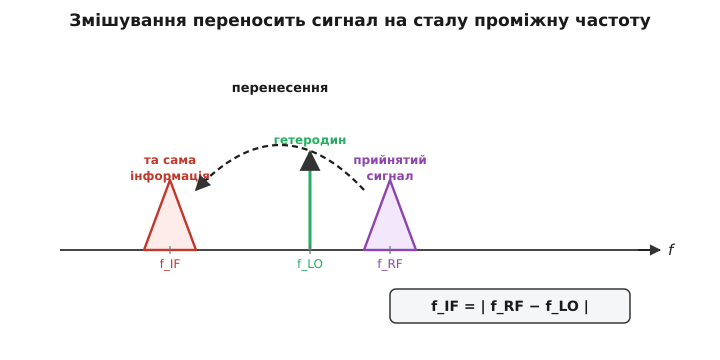
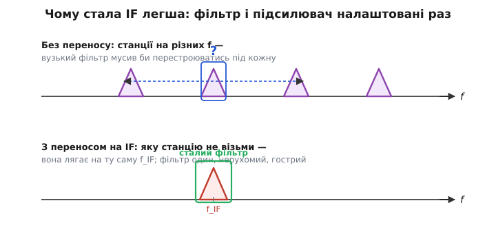
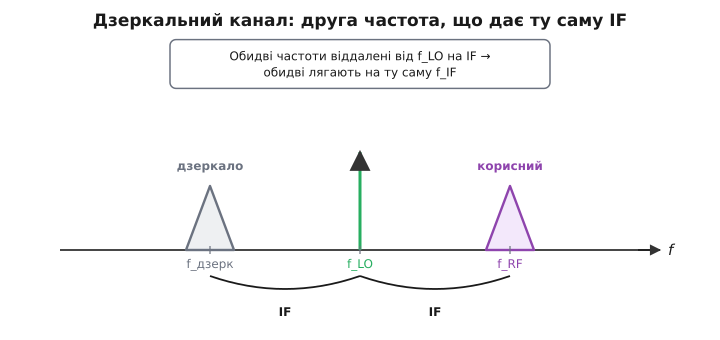
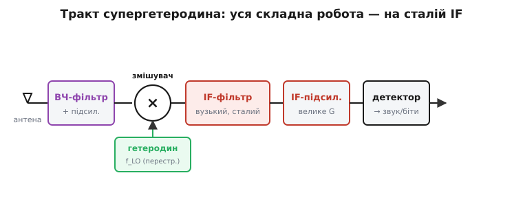

# Супергетеродин

Уяви, що ти хочеш зробити приймач, який ловить будь-яку станцію в широкому діапазоні — скажімо, від 88 до 108 МГц. Наївний шлях: на кожній частоті, куди ти налаштовуєшся, треба збудувати **гострий вузький фільтр**, що пропустить саме цю станцію й відріже сусідні, та ще й сильний підсилювач для цієї ж частоти. І все це мусить **перестроюватися** разом, коли ти крутиш ручку настройки. Зробити фільтр, який лишається однаково гострим, гуляючи по всьому діапазону, — інженерний жах: на високих частотах це дорого, нестабільно й майже неможливо тримати під контролем.

**Супергетеродин** (з латинського *super* — «над, понад» і грецьких *heteros* — «інший» + *dynamis* — «сила»; разом — «змішування з іншою, доданою ззовні силою-частотою») розв'язує цю проблему одним сміливим ходом. Замість того щоб ганятися фільтром за станцією, він **переносить будь-яку прийняту частоту на одну й ту саму фіксовану** — і вже там, на ній одній, робить усю важку роботу. Це архітектура майже кожного приймача, який ти тримав у руках: радіо, телевізора, рації, GPS, Wi-Fi-чипа. Розберімо, чому вона така живуча.

### Серце ідеї: змішати й перенести

Уся хитрість тримається на одній фізичній дії — **змішуванні** (*mixing*). Якщо взяти прийнятий сигнал на частоті f_RF (англ. *radio frequency*, радіочастота) і **перемножити** його з коливанням власного генератора приймача на частоті f_LO (англ. *local oscillator*, гетеродин), на виході народжуються **нові частоти** — сума й різниця:

```
вхід:  f_RF  (прийнятий сигнал)
×      f_LO  (гетеродин приймача)
=      f_RF + f_LO   (сума, високо — її викидаємо)
       f_RF − f_LO   (різниця — її лишаємо)
```

Чому з множення двох синусоїд народжуються саме сума й різниця — це проста тригонометрична тотожність про добуток косинусів:

```
cos(A) · cos(B) = ½·cos(A − B) + ½·cos(A + B)
```

Тобто добуток двох коливань — це завжди сума двох нових: на різницевій частоті (A − B) і на сумарній (A + B). Нам зараз важливий **результат**: різниця f_RF − f_LO і є та сама **проміжна частота** (англ. *intermediate frequency*, IF, або ПЧ). Її роблять сталою — наприклад, класичні 455 кГц для AM-радіо чи 10.7 МГц для FM.


*Прийнятий сигнал на високій f_RF, перемножений із гетеродином f_LO, переноситься на низьку сталу f_IF = |f_RF − f_LO|. Уся інформація (форма горбика) зберігається — змінюється лише частота, на якій вона сидить. Гетеродин — це «ручка», що зсуває потрібну станцію точно на IF.*

Ключове: переноситься **вся обвідна сигналу** — модуляція, у якій захована інформація, лишається недоторканою. Те, як саме інформацію «садять» на несучу й чому її можна так переносити без втрат, — це тема [модуляції](topic:com-modulation/why-modulation): на IF живе той самий модульований сигнал, просто на зручнішій частоті. Змішувач не псує повідомлення — він лише пересуває його по шкалі частот.

### Гетеродин як «ручка настройки»

Тепер найкрасивіше. Раз IF = |f_RF − f_LO| і ми хочемо, щоб IF **завжди** дорівнювала одному й тому ж числу, то налаштування на іншу станцію означає просто **зсунути f_LO** рівно настільки ж, наскільки змінилася f_RF. Хочеш зловити станцію на 100 МГц із IF 10.7 МГц — став гетеродин на 110.7 МГц. Перейшов на 95 МГц — пересунь гетеродин на 105.7 МГц. Різниця весь час та сама.

```
станція 100.0 МГц  →  f_LO = 110.7  →  IF = 10.7
станція  95.0 МГц  →  f_LO = 105.7  →  IF = 10.7
станція  88.0 МГц  →  f_LO =  98.7  →  IF = 10.7
```

Тобто **ручка настройки приймача — це насправді ручка гетеродина**. Ти крутиш одну-єдину частоту — частоту власного генератора, — а вся інша частина приймача навіть не «знає», яку станцію ти зараз слухаєш: до неї завжди приходить сигнал на тих самих 10.7 МГц. Сам гетеродин — це коливальний контур із підсилювачем, що сам себе розгойдує; як влаштований такий [генератор синусоїди](topic:hw-analog/pierce-oscillator), розглянуто окремо. У старих приймачах його перестроювали змінним конденсатором, у сучасних — синтезатором частоти під керуванням цифри.

### Чому фіксована IF — це виграш

Ось де окупається вся витівка. Коли частота, на якій треба фільтрувати й підсилювати, **завжди одна й та сама**, інженерне життя стає незрівнянно простішим.


*Угорі — світ без переносу: станції розкидані по частоті, і вузький фільтр мусив би «бігати» за кожною, лишаючись однаково гострим, — майже нездійсненно. Унизу — з переносом: яку станцію не візьми, вона лягає на ту саму f_IF, тож фільтр і підсилювач один раз налаштували — і вони стоять нерухомо.*

Розкладімо вигоду по совісті. **Перше — селективність.** Головне завдання приймача — відрізнити потрібну станцію від сусідньої, що стоїть поруч за частотою. Для цього треба дуже **гострий** фільтр зі стрімкими краями. Зробити такий фільтр на **одній фіксованій** частоті — посильна задача: його можна виточити до досконалості (кварцові, керамічні, на ПАХ-резонаторах фільтри саме на 10.7 МГц чи 455 кГц), і він нікуди не «їде». А робити такий самий гострий фільтр, який ще й перестроюється по всьому діапазону без втрати форми, — практично нездійсненно. Перенос на сталу IF перетворює неможливий перестроюваний фільтр на простий нерухомий.

**Друге — підсилення.** Слабкий сигнал від далекої станції треба підсилити в багато тисяч разів. Підсилювач із великим коефіцієнтом підсилення на високій частоті схильний **самозбуджуватися** — перетворюватися на генератор через паразитні зв'язки. На нижчій, фіксованій IF тримати велике стабільне підсилення значно легше: каскади спокійні, налаштовані раз і працюють однаково для кожної станції.

**Третє — повторюваність.** Раз уся «розумна» частина приймача завжди працює на одній частоті, її можна спроєктувати, налагодити й випускати мільйонними тиражами однаково. Не треба, щоб фільтр і підсилювач якось узгоджено перебудовувалися слідом за настройкою.

> 🔧 **Навіщо це.** Саме тому в даташиті будь-якого радіо-чипа ти побачиш слово «IF» (або згадку про *zero-IF* / *low-IF* — варіанти, де IF нульова чи майже нульова). Розуміючи архітектуру, ти знаєш, де в приймачі шукати **селективність** (вузький IF-фільтр — він визначає, наскільки добре відсікаються сусідні канали) і де — **підсилення** (IF-каскади). А головне — знаєш, що «настройка на станцію» фізично означає **зміну частоти гетеродина**: коли налагоджуєш чи ремонтуєш приймач і станції «з'їхали», дивися насамперед на гетеродин і синтезатор, бо саме вони задають, що приймач почує.

### Дзеркальний канал: плата за елегантність

У кожної красивої ідеї є ціна, і в супергетеродина вона дуже конкретна. Уся вона захована в одному значку формули IF = |f_RF − f_LO| — у **модулі** різниці. А модуль не розрізняє знаку. Це означає, що **дві різні** прийняті частоти дають **однакову** IF — одна вище гетеродина, друга рівно на стільки ж нижче.


*Корисний сигнал стоїть на IF **вище** гетеродина (f_RF = f_LO + IF). Але є й друга частота, на IF **нижче** гетеродина (f_дзерк = f_LO − IF) — її різниця з f_LO за модулем та сама. Обидві після змішування лягають точно на f_IF, і фільтр IF уже не може їх розрізнити. Ця небажана частота — **дзеркальний канал**.*

Розпишімо чисельно. Нехай гетеродин на 110.7 МГц, IF — 10.7 МГц. Корисна станція — на 100 МГц:

```
корисний:  |100.0 − 110.7| = 10.7  →  IF ✓
дзеркало:  |121.4 − 110.7| = 10.7  →  IF теж!
```

Частота 121.4 МГц віддалена від гетеродина на ті самі 10.7 МГц, тільки з іншого боку (110.7 + 10.7). Якщо в ефірі на 121.4 МГц щось є — потужна станція, перешкода, — воно після змішування **впаде точно на IF** і змішається з корисним сигналом. Фільтр IF тут безсилий: для нього обидва сигнали тепер на 10.7 МГц, не відрізнити. Це й є **дзеркальний канал** (*image channel*): друга, симетрична відносно гетеродина частота, рознесена з корисною рівно на 2·IF.

```
відстань між корисним і дзеркалом = 2 × IF = 21.4 МГц
```

### Як перемогти дзеркало

Раз фільтр **після** змішувача (на IF) дзеркало вже не бере, ловити його треба **до** змішувача — поки корисний сигнал і дзеркало ще рознесені по частоті на цілих 2·IF. Звідси два головні прийоми, і вони не виключають, а доповнюють один одного.

**Перший — вхідний ВЧ-фільтр.** Перед змішувачем ставлять фільтр, налаштований на корисний діапазон. Йому **не** треба бути гострим до окремої станції — достатньо, щоб він пропускав корисну частоту й давив те, що віддалене на 2·IF убік дзеркала. А це вже **широкий** проміжок (21.4 МГц у нашому прикладі), і відсіяти на такій відстані набагато легше, ніж розділяти сусідні станції. Ось ще одна причина, чому IF роблять не надто малою: що **більша** IF, то **далі** відлітає дзеркало й то простіше його відфільтрувати на вході.

**Другий — розумний вибір IF.** Інженер може навмисне підібрати IF так, щоб дзеркало впало на частоту, де нічого корисного немає (порожня ділянка спектра), або поєднати кілька переносів — спершу на високу IF (щоб дзеркало було далеко й легко відсіювалося), потім на низьку (щоб робити гострий канальний фільтр). Це називають **подвійним перетворенням** (*double conversion*) — типова річ у якісних приймачах і рацях.

Тут видно гарний інженерний конфлікт. **Велика** IF — дзеркало далеко, фільтрувати його легко, але робити гострий канальний фільтр на високій частоті важко. **Мала** IF — навпаки: канальний фільтр гострий і дешевий, зате дзеркало стоїть близько й давити його тяжко. Класичні значення (455 кГц, 10.7 МГц) — це усталені компроміси між цими двома бідами; подвійне перетворення дозволяє взяти краще з обох світів.

### Як це збирається в приймач

Складімо все докупи й пройдімо шлях сигналу від антени до звуку.


*Сигнал з антени проходить вхідний ВЧ-фільтр і попередній підсилювач (давлять дзеркало, піднімають слабкий сигнал), потім змішувач, куди знизу подано перестроюваний гетеродин. На виході змішувача — стала IF, і далі весь тракт працює лише на ній: вузький IF-фільтр задає селективність, IF-підсилювач дає основне підсилення, детектор знімає інформацію.*

Спершу — **антена** й **вхідний тракт**: ВЧ-фільтр пропускає робочий діапазон і давить дзеркало, а попередній підсилювач (його часто звуть *LNA*, малошумний підсилювач) трохи піднімає слабкий сигнал, не додаючи свого шуму. Далі — **змішувач**, серце схеми: у нього з одного боку йде прийнятий сигнал, з іншого (знизу) — **гетеродин**. На виході народжується IF. Потім — **IF-фільтр**: той самий гострий нерухомий фільтр, що відрізає сусідні канали й задає селективність усього приймача. За ним — **IF-підсилювач**, де набирається основне підсилення (тут же часто стоїть автоматичне регулювання підсилення, щоб гучні й тихі станції звучали рівно). І нарешті — **детектор**, який знімає з несучої корисну інформацію: для AM це обвідна амплітуди, для FM — відхилення частоти, для цифри — біти.

Зверни увагу на головну рису всієї конструкції: **щойно сигнал пройшов змішувач, його частота вже стала й більше не залежить від того, яку станцію ти слухаєш**. Уся «важка» частина приймача — гострий фільтр, велике підсилення, детектор — працює в комфортних, незмінних умовах. Перестроюється лише одна річ — гетеродин. У цьому й уся сила супергетеродина: він зводить мінливу задачу «зловити будь-яку з тисяч частот» до однієї незмінної «обробити сигнал на сталій IF».

### Хто це придумав

Працездатну архітектуру супергетеродинного приймача збудував **Едвін Говард Армстронг** (*Edwin Howard Armstrong*, 1890–1954), американський інженер-радіотехнік: він розробляв її під час служби у Франції наприкінці Першої світової війни, а патент подав **30 грудня 1918 року**. Самé поняття «гетеродин» увів ще раніше **Реджинальд Фессенден** (*Reginald Fessenden*). Але, як майже з усіма винаходами, історія тут **колективна**, а не казка про самотнього генія — і це той випадок, де чесність особливо важлива. Над тією самою ідею перетворення частоти змішуванням незалежно й **паралельно** працювали інші: французький інженер **Люсьєн Леві** (*Lucien Lévy*) подав патент навіть **раніше** за Армстронга (заявка серпня 1917 року), а німець **Вальтер Шотткі** (*Walter Schottky*) — у 1918-му. Пріоритет роками оспорювався в судах. Тож чесне формулювання таке: ідея гетеродинного перетворення витала в повітрі й мала **кількох** авторів-сучасників; заслуга Армстронга — не в самій ідеї, а в **практичній, працездатній архітектурі приймача**, яку він із неї зробив і яка прижилася. Глибше цю історію — разом із драмою патентних війн навколо самого Армстронга — розбирає [історична вставка про Армстронга й FM](topic:com-modulation/why-modulation/hist-armstrong.md).

Те, що схему придумали понад сто років тому, робить її не музейним експонатом, а навпаки — це мірило її геніальності: супергетеродин і досі живе в мільярдах пристроїв, від кишенькового радіо до радіо-блоку всередині мікроконтролера на кшталт ESP32. Принцип «перенеси все на одну зручну частоту й там працюй» виявився таким міцним, що пережив усі зміни елементної бази — від ламп до цифрових синтезаторів.

Супергетеродин зводить весь приймач до однієї думки: **не ганяйся за станцією — притягни її до себе**. Змішування з гетеродином переносить будь-яку прийняту частоту на сталу IF, і вся складна робота — гострий фільтр для селективності й велике стабільне підсилення — робиться раз і назавжди на цій одній частоті. Платою є дзеркальний канал, але його давить вхідний ВЧ-фільтр і розумний вибір IF. Запам'ятай два акценти: **ручка настройки — це частота гетеродина**, а **селективність приймача живе у вузькому IF-фільтрі**.

---
