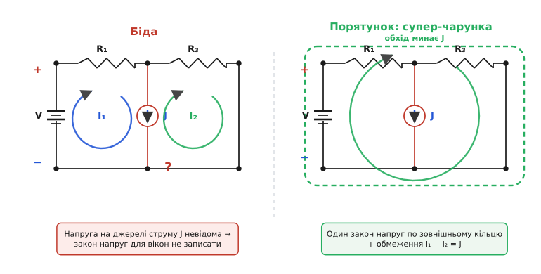
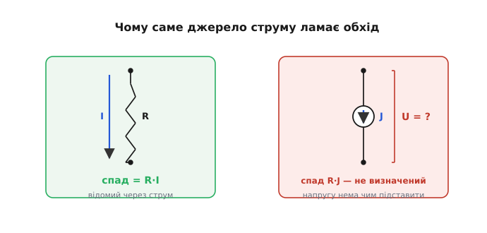
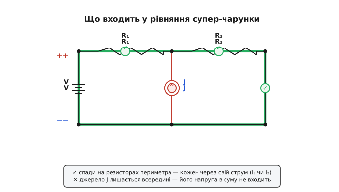
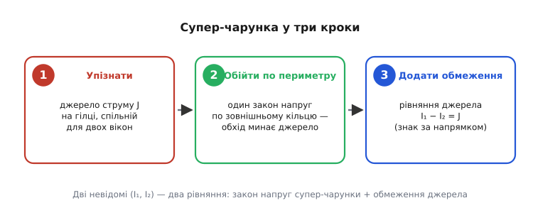

# Супер-чарунка

Метод контурних струмів дає на диво гладкий рецепт: полічи «вікна» схеми, на кожне напиши [закон напруг](root:hw-analog/kvl) у термінах контурних струмів — і дістанеш невелику акуратну систему, відповідь якої й є всі струми кола. Рецепт працює механічно, доки кожну гілку можна охарактеризувати її **опором**: спад напруги на резисторі — це `R·I`, відоме через невідомий струм, і саме такі спади складаються в рівняння обходу. Та є один елемент, на якому весь шаблон раптом затинається — **ідеальне джерело струму** на гілці, спільній для двох сусідніх вікон.

Чому саме воно ламає рецепт, видно з самої природи джерела струму. Воно тримає крізь себе наперед заданий струм, а напругу на собі **приймає яку завгодно** — рівно таку, якої цей струм потребує від решти кола. Опору в нього немає, тож спаду «опір помножити на струм» теж немає: підставити в закон напруг нема чого. Коли таке джерело сидить лише в одному вікні, це навіть подарунок — воно прямо задає контурний струм того вікна. Але коли воно стоїть на **спільній** гілці двох вікон, обидва ці вікна хочуть пройти крізь нього своїм обходом, а напруга на ньому невідома обом — і обидва рівняння провисають на одній і тій самій невідомій напрузі.

**Супер-чарунка** (англ. *supermesh* — «над-чарунка», від *mesh* — чарунка сітки) — прийом, що цю провислу нитку зв'язує. Замість писати закон напруг окремо для кожного з двох проблемних вікон, ми **об'єднуємо їх в один більший обхід**, який оминає незручне джерело стороною, — і пишемо закон напруг для цього спільного контуру одразу. Розберімо, чому це чесно й чому розв'язує проблему до кінця.


*Суть прийому. Зліва — біда: спільну гілку вікон I₁ та I₂ займає ідеальне джерело струму J, напруга на ньому невідома, тож закон напруг ні для лівого, ні для правого вікна окремо записати не можна. Справа — порятунок: обходимо обидва вікна одним зовнішнім кільцем (супер-чарункою), що минає внутрішню гілку з джерелом. Напруга на джерелі в це кільце не входить — і з рівняння зникає.*

## Спершу — чому метод контурних струмів узагалі гладкий

Щоб побачити, де він спотикається, варто коротко згадати, **на чому** тримається його гладкість. Ідея методу — обрати невідомими не струми в кожній гілці окремо (їх багато, і вони зв'язані купою рівнянь), а по одному **контурному струмові** на кожне замкнене вікно схеми: уявному струмові, що біжить по всьому кільцю вікна, не розгалужуючись. Реальний струм у конкретній гілці — це сума контурних струмів, що крізь неї проходять; у гілці, спільній для двох вікон, накладаються два.

Головне ж — як складаються рівняння. Для кожного вікна пишемо [закон напруг](root:hw-analog/kvl): обходимо кільце й прирівнюємо суму спадів напруги до суми ЕРС у напрямку обходу. А кожен спад ми **виражаємо через контурні струми** за [законом Ома](root:hw-analog/ohms-law): на резисторі R, який оточує вікно зі струмом I, спад дорівнює `R·I` (а на спільному резисторі — `R·(I − I_сусід)`, бо чужий контурний струм тече крізь нього назустріч). Жодних нових невідомих — самі контурні струми. Виходить рівно стільки рівнянь, скільки вікон, і система розв'язується.

> 🔧 **Навіщо це.** Метод контурних струмів — ваш ручний «симулятор» для схем, складніших за дільник: подивився, скільки у схемі вікон, написав стільки ж рівнянь за одним шаблоном — і система готова. Це той кістяк, на який спирається будь-яка перевірка схеми руками перед тим, як довіритися машині; а ще це майже те, що симулятор робить усередині. І саме тому варто знати єдину дірку в цьому методі: ідеальне джерело струму на спільній гілці — бо інакше наївне «складемо спади навколо вікна» впирається в стіну невідомої напруги, і ви не зрозумієте, чому рецепт раптом не їде.

Уся гладкість, як бачимо, тримається на тому, що **кожен спад виражається через струми**. Спад на резисторі — `R·I`. Спад на джерелі напруги — це сама ЕРС, відома стала. Поки в гілці одне з двох, рівняння обходу пишеться без проблем. Джерело струму вибивається з обох випадків — і тут рецепт зупиняється.

## Де метод ламається: джерело струму на спільній гілці

Поставмо тепер на гілку, спільну для лівого вікна I₁ і правого I₂, не резистор, а **ідеальне джерело струму** J — пристрій, що жене крізь себе струм J хоч би що, а напругу на собі бере яку доведеться. І спробуймо написати закон напруг для лівого вікна.

Обходимо кільце лівого вікна, складаючи спади. На «своїх» резисторах — знаємо: `R·I₁`. А спад на джерелі струму J, коли обхід проходить крізь спільну гілку? Ось тут стоп. Джерело струму **не має власного опору** й тому **не диктує** своєї напруги: воно підніме на собі стільки вольтів, скільки знадобиться, аби продавити свій струм J крізь усе зовнішнє коло. Ця напруга визначається **всім рештою кола**, а не самим джерелом, тож виразити її через контурні струми — як ми робили з резисторами — **неможливо**. Закон Ома тут не діє: множити J на нульовий опір, щоб дістати спад, не випадає.

Виходить, у рівнянні обходу лівого вікна зринає **зайва невідома** — напруга на джерелі. Тих самих неприємностей повна й у правому вікні: там сидить та сама невідома напруга, тільки обхід проходить її в інший бік. Метод, що так гладко їхав, раптом має зайву невідому, спільну для двох рівнянь, і застрягає.


*Чому саме джерело струму ламає обхід. На резисторі спад дорівнює R·I — відома величина через невідомий струм, її охоче бере закон напруг. На ідеальному джерелі струму напруга невідома (опору немає, спад R·J не визначений), і її нема чим підставити в рівняння обходу. Один елемент на спільній гілці — і два рівняння провисають на спільній невідомій напрузі.*

Чому ж біда настає саме на **спільній** гілці? Бо якби джерело струму належало **лише одному** вікну, ніякого клопоту не було б — навпаки, був би подарунок. Тоді контурний струм цього вікна **просто дорівнював** би струмові джерела (інших шляхів у того струму немає), ця невідома відразу ставала б відомою й випадала б із системи — одним рівнянням менше. Клопіт настає лише тоді, коли джерело сидить на гілці, яку **ділять два** контури: тоді жодне з них поодинці не дорівнює J (крізь джерело тече їхня різниця), і обидва обходи напорюються на невідому напругу. Саме цей випадок і лікує супер-чарунка.

## Сам прийом: об'єднай два вікна в обхід, що минає джерело

Згадаймо, **на чому** стоїть закон напруг. Він каже: обійди будь-який замкнений контур, склади всі спади напруги вздовж нього — і сума дорівнює сумі ЕРС у цьому контурі (бо потенціал, обійшовши коло, повертається до себе). Контур цей не зобов'язаний бути однією чарункою-вікном! Закон однаково правдивий для **будь-якого** замкненого шляху по схемі, хоч би скільки вікон він охоплював. А якщо так — ми вільні вибрати такий шлях, що **обходить незручну гілку стороною**.

> 🔧 **Навіщо це.** Думка «закон напруг тримається для будь-якого замкненого контуру, не лише для окремого вікна» — інструмент далеко поза супер-чарункою. Нею перевіряють, чи зійдеться потенціал по великому кільцю через кілька каскадів плати; нею знаходять, де загубився вольт-другий на довгій доріжці живлення; нею міркують про падіння напруги вздовж землі. Супер-чарунка — найчистіший приклад того, як вибір зручного обхідного контуру дає рівняння там, де обхід окремого вікна впирається в невідому напругу.

Отже, робимо так. Беремо контур, що **охоплює обидва проблемні вікна разом**, але йде по їхньому **зовнішньому периметру**, не заходячи на внутрішню спільну гілку з джерелом J, — це і є **супер-чарунка**. І пишемо закон напруг для цього зовнішнього кільця: складаємо спади **лише на тих резисторах, що лежать на самому периметрі** (по них проходить обхід). А підступна напруга на джерелі J — її в цьому обході **просто немає**, бо контур повз джерело не йде, він його обминув. Невідому, що псувала картину, ми не вгадали й не обчислили — ми її **акуратно виключили** з рівняння, провівши обхід стороною.

Тонкість одна, але важлива: хоча контур іде по периметру, **струми** в кожній його гілці лишаються тими самими контурними струмами вікон. На гілках, що належать лише лівому вікну, тече I₁; на гілках лише правого — I₂; на спільних із зовнішніми вікнами — відповідні різниці. Тобто, обходячи супер-чарунку, на кожному резисторі ми пишемо спад через **той** контурний струм, що крізь цей резистор насправді тече. Об'єднали ми вікна **для рівняння-обходу**, а самі невідомі I₁ та I₂ нікуди не поділися — їх так само дві.


*Що входить у рівняння супер-чарунки. Обхід іде по зовнішньому периметру обох вікон, складаючи спади на резисторах, що на цьому периметрі лежать — кожен через той контурний струм (I₁ чи I₂), що крізь нього тече. Внутрішня спільна гілка з джерелом J лишається осторонь — обхід її не торкає, тож невідома напруга на джерелі в суму не потрапляє. Одне чесне рівняння замість двох зіпсованих.*

## Чого бракує: рівняння-обмеження від самого джерела

Стривайте — ми об'єднали два вікна в один обхід і написали **одне** рівняння замість двох. Але невідомих усе ще **дві**: I₁ та I₂. Одного рівняння на дві невідомі замало. Де взяти друге?

А воно вже є — і дало його **саме джерело**. Адже джерело J не просто так сидить на спільній гілці: крізь цю гілку тече **різниця** контурних струмів двох вікон, і ця різниця мусить точно дорівнювати струмові, що джерело жене. Це і є друге рівняння, **рівняння-обмеження**:

```
I₁ − I₂ = J
```

Просте й точне. Знак залежить лише від того, як напрямлені обидва контурні струми крізь спільну гілку відносно стрілки джерела: який із контурів тече «за стрілкою», той і додатний. Те, що раніше **псувало** обхід (невідома напруга), тепер обернулося на **дарунок**: джерело забрало в нас одне рівняння напруг, але натомість віддало рівняння на струм. Обмін рівноцінний — невідомих дві, рівнянь знову дві.

Складаємо докупи: **одне** рівняння закону напруг для супер-чарунки **плюс одне** рівняння-обмеження `I₁ − I₂ = J`. Дві невідомі, два рівняння — система замкнена й розв'язується, як звичайно. Метод контурних струмів, що був застряг, поїхав далі — супер-чарунка вирівняла рахунок рівнянь і невідомих, нічого не вгадуючи.

**Worked-приклад: дві чарунки зі спільним джерелом струму.** Джерело напруги V = 12 В стоїть у лівій вітці; від нього по периметру йдуть резистори R₁ = 100 Ω (тільки ліве вікно) та R₃ = 300 Ω (тільки праве вікно); спільну гілку між вікнами займає **джерело струму J = 20 мА**, напрямлене так, що тече за струмом I₁ (тобто з гілки лівого вікна в гілку правого). Невідомі — контурні струми I₁ та I₂, обидва за годинниковою стрілкою.

Спершу закон напруг для супер-чарунки — обходу по зовнішньому периметру обох вікон. На периметрі лежать V, R₁ та R₃; джерело J — усередині, його обхід минає. По R₁ тече I₁, по R₃ тече I₂. Сума спадів дорівнює ЕРС:

```
супер-чарунка:   R₁·I₁  +  R₃·I₂  =  V
```

Тепер обмеження від джерела струму (тече за I₁):

```
обмеження:   I₁ − I₂ = J
```

Підставляємо числа (опори в Ω, струми в А, напруга у В):

```
100·I₁ + 300·I₂ = 12
I₁ − I₂         = 0.02
```

З другого: I₁ = I₂ + 0.02. Підставляємо в перше:

```
100·(I₂ + 0.02) + 300·I₂ = 12
100·I₂ + 2 + 300·I₂ = 12
400·I₂ = 10
I₂ = 0.025 А,   I₁ = 0.045 А
```

Контурні струми знайдено: I₁ = 45 мА, I₂ = 25 мА, а їхня різниця 45 − 25 = 20 мА — рівно J, як і має бути за обмеженням. Коло з «неможливою» гілкою порахувалося так само механічно, як і без неї. А ось і код, що розв'язує цю саму пару рівнянь, — звичайна підстановка, яку зручно тримати поряд із проєктом:

```c
// Супер-чарунка на дві чарунки: джерело напруги V у периметрі, резистори
// R1 (лише ліве вікно) і R3 (лише праве вікно), спільну гілку займає джерело
// струму J (тече за контурним струмом I1, тобто I1 − I2 = J).
// Рівняння супер-чарунки:  R1*I1 + R3*I2 = V
// Обмеження джерела струму: I1 − I2 = J   →   I1 = I2 + J
// Підставляємо:            R1*(I2 + J) + R3*I2 = V
// Звідси I2, далі I1. Опори в омах, струми в амперах, напруги у вольтах.
typedef struct { float i1, i2; } MeshCurr;

MeshCurr supermesh_solve(float V, float R1, float R3, float J)
{
    float i2 = (V - R1 * J) / (R1 + R3);    // розв'язок щодо I2
    MeshCurr r;
    r.i2 = i2;
    r.i1 = i2 + J;                          // обмеження джерела струму
    return r;
}
// supermesh_solve(12.0f, 100.0f, 300.0f, 20e-3f) -> i1 ≈ 0.045 А, i2 ≈ 0.025 А
```

## Рецепт у три кроки

Зведімо прийом до короткої послідовності, яку видно з будь-якої схеми.

**Крок перший — упізнати.** Щойно бачите ідеальне джерело струму на гілці, яку **ділять два** вікна, — це привід для супер-чарунки. Якщо ж джерело струму належить **лише одному** вікну, супер-чарунка не потрібна: контурний струм того вікна просто дорівнює струмові джерела, і ця невідома зникає сама.

**Крок другий — об'єднати й обійти.** Подумки злийте обидва вікна в один контур по їхньому зовнішньому периметру, що минає внутрішню гілку з джерелом. Напишіть **один** закон напруг для цього кільця, складаючи спади **лише** на резисторах периметра — кожен через той контурний струм (I₁ чи I₂), що крізь нього тече. Джерело струму ігноруємо — обхід його не торкає.

**Крок третій — додати обмеження.** Допишіть рівняння `I₁ − I₂ = J` зі знаком за напрямком джерела крізь спільну гілку. Тепер рівнянь стільки ж, скільки невідомих, — розв'язуйте систему.


*Рецепт супер-чарунки. Упізнати джерело струму на гілці двох вікон; об'єднати вікна в обхід по зовнішньому периметру й записати один закон напруг (спади на резисторах периметра); додати рівняння-обмеження I₁ − I₂ = J. Дві невідомі — два рівняння.*

Якщо в схемі кілька джерел струму на спільних гілках, прийом застосовують **до кожного** — стільки супер-чарунок, скільки таких джерел; кожне дарує своє рівняння-обмеження. А коли на спільній гілці сидить **залежне** [джерело струму](root:hw-analog/dependent-sources) (кероване струмом чи напругою деінде в колі), усе працює так само — лише в обмеженні замість сталого J стоїть вираз керування (наприклад, `I₁ − I₂ = β·I_x`), а керівну величину I_x теж виражають через контурні струми.

Те, як ці рівняння лягають у **матричний** вигляд (опорів R·I = V) і чому супер-чарунка — це акуратне «склеювання» рядків матриці опорів, а промисловий симулятор бере напругу джерела струму за окрему невідому й узагалі обходиться без розпізнавання конфігурацій, винесено в окремий [розбір системи рівнянь супер-чарунки](root:hw-analog/supermesh/math-supermesh-system.md): там той самий прийом показано на матриці, як його робить машина.

## Двійник прийому й коли він не потрібен

У супер-чарунки є дзеркальний родич у методі вузлових потенціалів — [суперузол](root:hw-analog/supernode). Там та сама халепа, тільки навпаки: коли між двома не-земляними вузлами стоїть ідеальне джерело **напруги**, не вдається записати баланс струмів (крізь джерело напруги невідомий **струм**). Ліки симетричні: обводять обидва вузли спільною межею-«суперузлом» і додають обмеження за напругою джерела `V_a − V_b = E`. Той самий хід думки — заховати незручний елемент усередину об'єднаної області (тут — обвести стороною) і дозичити рівняння від нього самого. Уся пара прийомів — дзеркало двоїстості напруги й струму: де у вузловому методі джерело напруги між вузлами, там у контурному джерело струму на спільній гілці; де там обмеження на напругу, тут — на струм.

> 🔧 **Навіщо це.** Те, що супер-чарунка й суперузол — точні дзеркала, не цікавинка, а практичний орієнтир: обираючи метод під схему (за тим, де менше невідомих — вікон чи вузлів), ви наперед знаєте, яким буде «важкий» елемент. Підете вузлами — стережіться джерел напруги між вузлами; підете контурами — джерел струму на спільних гілках. Обидва — не глухий кут, а штатний прийом; знати обидва означає не боятися жодної схеми, хоч би з чого вона була зібрана.

Інколи супер-чарунки можна **уникнути зовсім**. Якщо джерело струму ввімкнене **паралельно з резистором**, цю пару можна за [перетворенням джерел](root:hw-analog/source-transformation) замінити еквівалентним [джерелом напруги](root:hw-analog/dependent-sources) з послідовним резистором — і незручне джерело струму на гілці зникає, а з ним і потреба в супер-чарунці. Але якщо джерело **ідеальне** (без паралельного опору) — перетворити нема що, і супер-чарунка лишається найпрямішим шляхом. Тому в задачах із ідеальними джерелами струму на спільних гілках це не екзотика, а штатний прийом.

> 🔧 **Навіщо це.** Супер-чарунка — не хитрість заради хитрощів, а ремонт єдиної тріщини в інакше бездоганному методі. Метод контурних струмів розв'язує будь-яке лінійне коло механічно, доки в ньому самі резистори й джерела напруги; ідеальне джерело струму на спільній гілці — єдиний випадок, де він спотикається, і супер-чарунка його залатує точно й остаточно. Знати цей прийом — означає вміти просунути аналіз (чи зрозуміти, що зробив симулятор) там, де наївне «складемо спади навколо вікна» впирається в стіну невідомої напруги.

Уся суть тримається на двох думках, простих, коли їх побачив. Перша: закон напруг правдивий не лише для окремого вікна, а для **будь-якого замкненого контуру** — тож обвести два вікна зовнішнім кільцем, що минає джерело, цілком чесно, і невідома напруга джерела з рівняння зникає сама. Друга: те джерело, що відібрало в нас одне рівняння напруг, **повертає** його у вигляді жорсткого зв'язку `I₁ − I₂ = J` між контурними струмами. Відняли — додали, рахунок зійшовся; коло, що здавалося нерозв'язним контурним методом, піддається тим самим конвеєром, що й будь-яке інше.
