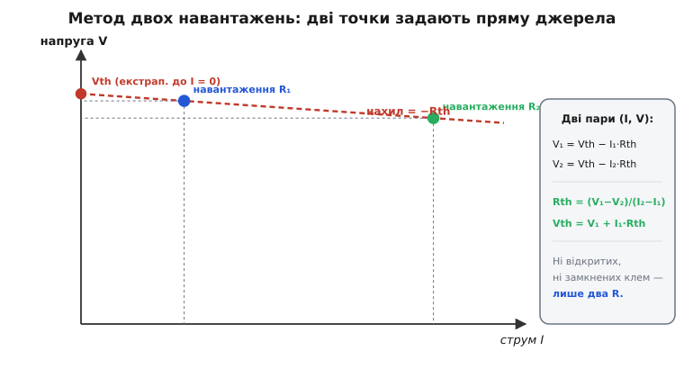
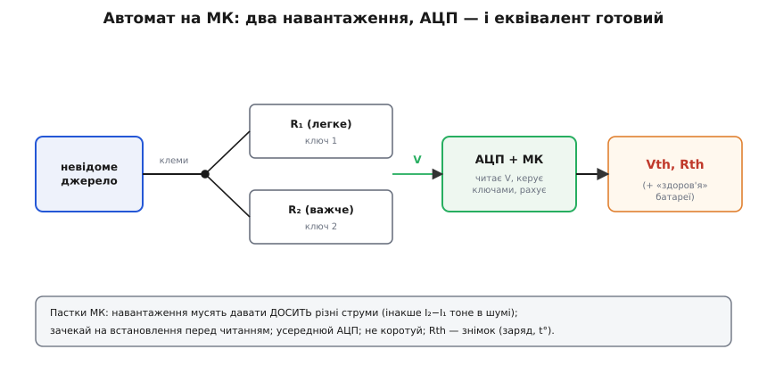

# ⚙️ Виміряти Vth і Rth на столі: метод двох навантажень

> Коли коло відоме на схемі, [еквівалент Тевеніна](root:hw-analog/thevenin) — напругу холостого ходу Vth і внутрішній опір Rth — рахують олівцем. А що, як перед вами **чорна скринька**: батарея, блок живлення, вихід давача, — нутра якої не видно? Тоді Vth і Rth доводиться **виміряти** ззовні, не розкриваючи корпус. Найнадійніший спосіб для цього — **метод двох навантажень**, і він напрочуд зручно лягає на мікроконтролер.

### Чому не можна просто «зміряти»

Здавалося б, дістати Vth елементарно: тицьни вольтметр у клеми — ось і напруга холостого ходу. Часто так і роблять, але цьому числу не завжди можна вірити. Вольтметр має скінченний вхідний опір, тож **сам трохи навантажує** джерело, і показ виходить дещо нижчим за справжній Vth — тим помітніше, чим більший внутрішній опір. У сильно «висілої» батареї чи у виходу давача з опором у сотні кілоом ця похибка вже не дрібниця.

З Rth іще гірше. Прямий його вимір — це режим короткого замикання: замкнув клеми, поділив Vth на струм короткого I_кз. Та реально замикати клеми зарядженого джерела **небезпечно** — потече величезний струм, який стресує саме джерело й гріє ключ, а літієву батарею може й підпалити. Отже, обидві крайнощі — і чистий холостий хід, і коротке — або ненадійні, або небезпечні. Потрібен спосіб, що тримається **посередині**: подає лише помірні, наперед відомі навантаження.

### Ідея: дві точки задають пряму

Тут рятує сама фізика [реального джерела](root:hw-analog/internal-resistance). Його вольт-амперна характеристика — **пряма**:

```
V = Vth − I·Rth
```

Напруга на клемах падає лінійно з відібраним струмом, а нахил цього падіння — і є внутрішній опір. Пряму ж однозначно задають **дві точки**. Звідси весь задум: подаймо два різні відомі навантаження R₁ і R₂, зміряймо на клемах напруги V₁ і V₂ (струми порахуємо просто як I = V/R) — і дістанемо дві точки на цій прямій. Через них проходить рівно одна лінія, а отже, Vth і Rth визначені однозначно.


*Два навантаження дають дві пари (I, V) на прямій V = Vth − I·Rth. Нахил прямої — це −Rth, а її продовження вліво до I = 0 — це Vth. Не потрібні ні розімкнені клеми (холостий хід), ні замкнені (коротке) — лише два безпечні резистори.*

Запишемо обидві точки в рівняння прямої:

```
V₁ = Vth − I₁·Rth
V₂ = Vth − I₂·Rth
```

Тут дві невідомі (Vth і Rth) і два рівняння — система розв'язна. Віднімемо друге від першого: однакові Vth скоротяться, лишиться тільки опір.

```
V₁ − V₂ = (I₂ − I₁)·Rth
```

Звідси обидва числа:

```
Rth = (V₁ − V₂) / (I₂ − I₁)
Vth = V₁ + I₁·Rth
```

Геометрично це те саме, що бачимо на графіку: **нахил** прямої дає −Rth, а її продовження до осі I = 0 (нульовий відібраний струм — той самий холостий хід, але дістаний екстраполяцією, а не розмиканням) дає Vth. Жодних крайнощів: ні короткого замикання, ні чистого холостого ходу — обидві робочі точки лежать у безпечній середині характеристики.

Варто наголосити, чому це працює саме для **двох** навантажень, а не для одного. З однією точкою (I, V) ми маємо одне рівняння на дві невідомі — пряму крізь неї можна провести під будь-яким нахилом, тож Rth лишається невизначеним. Друга точка фіксує нахил, і система замикається. Третя й дальші точки нічого нового не додали б ідеально лінійному джерелу, зате на реальному стали б у пригоді: за кількома вимірами видно, **наскільки** характеристика справді пряма, а де вже гнеться (глибокий розряд, насичення). Але для самого еквівалента Тевеніна двох точок досить — більше потрібно лише заради контролю якості.

### Worked-приклад: рахуємо руками

Перш ніж довіряти числа мікроконтролеру, проженемо їх власноруч на конкретних значеннях.

**Приклад. Літій-іонний елемент. Навантаження R₁ = 10 Ω дало на клемах V₁ = 3.90 В; навантаження R₂ = 2.7 Ω дало V₂ = 3.60 В. Знайти Vth і Rth.**

```
Струми з закону Ома (I = V/R):
        I₁ = V₁/R₁ = 3.90 / 10  = 0.390 А
        I₂ = V₂/R₂ = 3.60 / 2.7 = 1.333 А
Внутрішній опір — нахил прямої:
        Rth = (V₁ − V₂)/(I₂ − I₁)
            = (3.90 − 3.60) / (1.333 − 0.390)
            = 0.30 / 0.943              = 0.318 Ω
Напруга Тевеніна — екстраполяція до I = 0:
        Vth = V₁ + I₁·Rth = 3.90 + 0.390·0.318 = 4.02 В
Перевірка другою точкою:
        Vth = V₂ + I₂·Rth = 3.60 + 1.333·0.318 = 4.02 В  ✓
```

Обидві точки дали той самий Vth = 4.02 В — пряма зійшлася, числа правильні. Виходить еквівалент **4.02 В за 0.32 Ω**, і ми дістали його, жодного разу не замкнувши клеми накоротко й не покладаючись на «ідеальний» вольтметр.

### Робочий код для мікроконтролера

Самі обчислення тривіальні, тож їх легко доручити прошивці. МК перемикає два навантаження ключами (транзисторами), читає напругу на клемах через АЦП і рахує еквівалент. Ось закінчена функція мовою C — рівно та сама арифметика, що в прикладі вище:

:::tabs
```cpp
#include <cstdint>

// заглушки під вашу платформу:
extern std::uint16_t adc_read_raw();          // один сирий відлік АЦП
extern void          load_select(std::uint8_t n); // 1 → R1, 2 → R2, 0 → відключити
extern void          delay_ms(std::uint32_t ms);

struct Thevenin { float vth; float rth; };

namespace {
    constexpr float R1_OHM   = 10.0f;    // легке навантаження, Ом
    constexpr float R2_OHM   = 2.7f;     // важче навантаження, Ом
    constexpr float ADC_VREF = 3.30f;    // опорна напруга АЦП, В
    constexpr float ADC_MAX  = 4095.0f;  // 12-бітний АЦП
    constexpr std::uint32_t SETTLE_MS = 50;  // пауза на встановлення після перемикання
    constexpr std::uint8_t  N_AVG     = 16;  // скільки відліків усереднити

    // усереднене читання напруги на клемах (у вольтах)
    float read_terminal_v() {
        std::uint32_t acc = 0;
        for (std::uint8_t i = 0; i < N_AVG; ++i)
            acc += adc_read_raw();
        return (static_cast<float>(acc) / N_AVG) * (ADC_VREF / ADC_MAX);
    }
}

Thevenin measure_thevenin() {
    load_select(1);                 // легке навантаження
    delay_ms(SETTLE_MS);            // дочекатися встановлення
    const float v1 = read_terminal_v();
    const float i1 = v1 / R1_OHM;

    load_select(2);                 // важче навантаження
    delay_ms(SETTLE_MS);
    const float v2 = read_terminal_v();
    const float i2 = v2 / R2_OHM;

    load_select(0);                 // зняти навантаження — не гріти джерело

    Thevenin r;
    r.rth = (v1 - v2) / (i2 - i1);  // нахил прямої = внутрішній опір
    r.vth = v1 + i1 * r.rth;        // екстраполяція до I = 0
    return r;
}
```
```python
import time
from dataclasses import dataclass

import pyvisa  # автоматизація стендового вимірювача (DMM + комутатор навантажень)

R1_OHM = 10.0    # легке навантаження, Ом
R2_OHM = 2.7     # важче навантаження, Ом
SETTLE_S = 0.05  # пауза на встановлення після перемикання, с
N_AVG = 16       # скільки відліків усереднити


@dataclass
class Thevenin:
    vth: float
    rth: float


def read_terminal_v(dmm) -> float:
    """Усереднене читання напруги на клемах (у вольтах)."""
    samples = (float(dmm.query("MEAS:VOLT:DC?")) for _ in range(N_AVG))
    return sum(samples) / N_AVG


def measure_thevenin(dmm, load) -> Thevenin:
    load.select(1)                  # легке навантаження
    time.sleep(SETTLE_S)            # дочекатися встановлення
    v1 = read_terminal_v(dmm)
    i1 = v1 / R1_OHM

    load.select(2)                  # важче навантаження
    time.sleep(SETTLE_S)
    v2 = read_terminal_v(dmm)
    i2 = v2 / R2_OHM

    load.select(0)                  # зняти навантаження — не гріти джерело

    rth = (v1 - v2) / (i2 - i1)     # нахил прямої = внутрішній опір
    vth = v1 + i1 * rth             # екстраполяція до I = 0
    return Thevenin(vth, rth)


if __name__ == "__main__":
    rm = pyvisa.ResourceManager()
    dmm = rm.open_resource("USB0::0x0000::0x0000::INSTR")   # ваш мультиметр
    load = LoadSwitch(rm)                                   # комутатор R1/R2/off
    result = measure_thevenin(dmm, load)
    print(f"Vth = {result.vth:.2f} В,  Rth = {result.rth:.2f} Ом")
```
:::

Підставте в розум платні значення з прикладу — функція поверне ті самі 4.02 В і 0.32 Ω. Саме так влаштовані тестери акумуляторів і вимірювачі внутрішнього опору: прошивка сама прикладає навантаження, читає напругу й видає пару чисел.


*Мікроконтролер перемикає два відомі навантаження R₁ і R₂, читає напругу на клемах через АЦП і сам рахує Vth та Rth — по суті, готовий тестер внутрішнього опору й «здоров'я» батареї.*

### Пастки на мікроконтролері

Арифметика проста, та диявол — у деталях вимірювання. Кожна з пасток нижче псує саме знаменник `i2 − i1` або саму напругу, тож недбалість тут дорого коштує.

- **Навантаження мають давати ДОСИТЬ різні струми.** У знаменнику стоїть (I₂ − I₁); якщо два навантаження близькі, ця різниця крихітна, і шум АЦП роздуває похибку до безглуздя — ділення на майже-нуль. Бери одне **легке**, друге помітно **важче**, щоб точки лягли далеко одна від одної на прямій. У прикладі вище струми відрізнялися втричі — це здоровий запас. Орієнтир для вибору: важче навантаження бажано порівнянне за порядком із самим Rth (тоді просадка V₁ − V₂ добре помітна на тлі шуму), але не настільки мале, щоб зайти в небезпечну зону струму. Якщо Rth наперед невідомий зовсім, роблять пробний вимір абияк, прикидають порядок опору — і вже потім підбирають пару резисторів свідомо.
- **Час встановлення.** Після перемикання напруга на клемах усідається не вмить: заважають хімія батареї та паразитні ємності. Якщо прочитати АЦП одразу, зміряєш перехідний процес, а не сталий рівень — звідси `delay_ms(SETTLE_MS)` перед кожним читанням.
- **Шум і усереднення.** Віднімання V₁ − V₂ двох близьких чисел підсилює шум удвічі-втричі. Тому функція усереднює `N_AVG` відліків АЦП; ще краще — побільшити різницю навантажень, щоб корисний сигнал V₁ − V₂ вивищувався над шумом.
- **Не перевантаж джерело.** Замале R наближає коротке замикання: стресує джерело й ключ, а батарею **гріє й садить** через [джоулеве тепло](root:ph-electromagnetism/joule-heating) (втрати I²·R). Тримай струми в безпечних межах; для слабких джерел корисне **імпульсне** навантаження — коротко ввімкнув, зміряв, вимкнув (саме тому код одразу викликає `load_select(0)`).
- **Rth — це знімок, а не стала.** [Внутрішній опір](root:hw-analog/internal-resistance) батареї залежить від заряду, температури й самого струму. Виміряне Rth справедливе **тут і зараз**; за іншого режиму воно інше. Це не вада методу, а властивість джерела — просто пам'ятайте, що міряєте миттєвий стан.

> 🔧 **Навіщо це.** Маючи лише два резистори, два ключі й АЦП, мікроконтролер визначає еквівалент Тевеніна будь-якого реального джерела, не наражаючись на коротке замикання. Це готовий блок для зарядних пристроїв, павербанків і вимірювачів стану батареї: з тієї самої пари чисел миттю виходить і [еквівалент Нортона](root:hw-analog/norton), і прогноз просадки під майбутнім навантаженням. А головне практичне застосування — стеження за «здоров'ям» акумулятора: внутрішній опір повільно зростає з віком, тож зростання виміряного Rth певно вказує, що батарея старіє й час її міняти.
