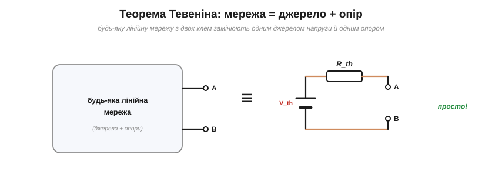
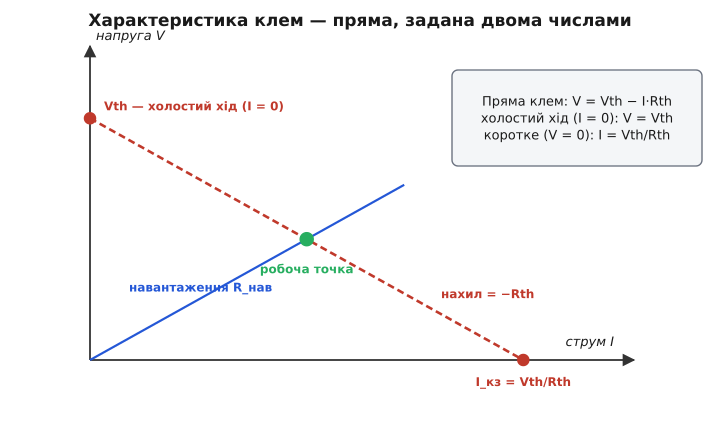
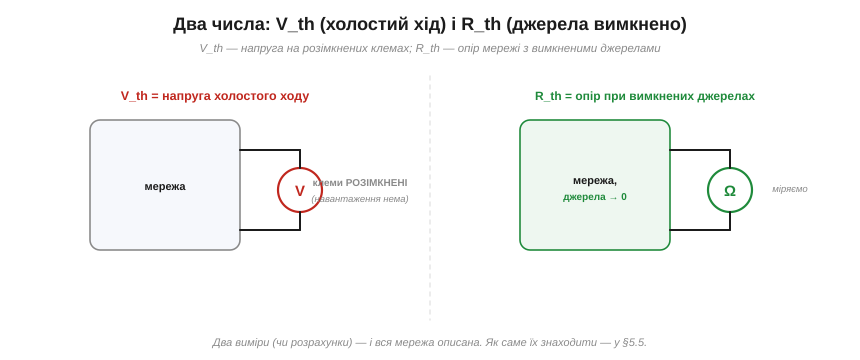
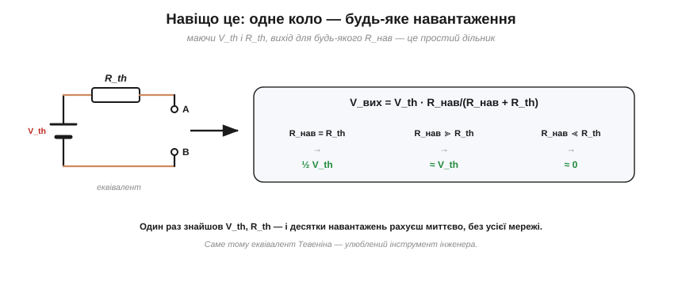
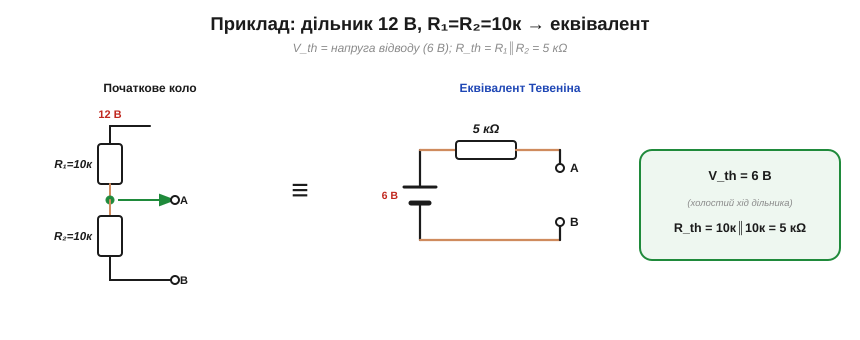
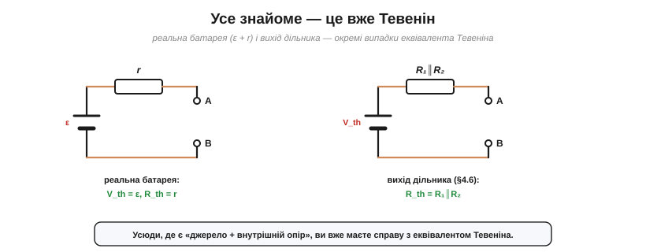

# Теорема Тевеніна

<preknowlist>
- [Закон Ома](topic:hw-analog/ohms-law) — напруга = струм · опір; базовий зв'язок трьох величин.
- [Лінійність кола](topic:hw-analog/linear-circuit) — відгук пропорційний до збудження, а збудження додаються.
- [Суперпозиція](topic:hw-analog/superposition) — у лінійному колі внесок кожного джерела рахують окремо, тоді додають.
- [Дільник напруги](topic:hw-analog/voltage-divider) — як напруга розподіляється між послідовними опорами.
- [Послідовне](topic:hw-analog/series-connection) й [паралельне](topic:hw-analog/parallel-connection) з'єднання — згортання кількох опорів в один.
</preknowlist>

Уявіть плату: десяток резисторів, кілька джерел, усе сплетено так, що око губиться. Назовні з неї виходять лише **дві клеми**, і до них ви збираєтеся приєднати навантаження — лампу, мотор, вхід іншого каскаду. Питання просте: яка буде напруга на клемах і який потече струм? Можна щоразу розв'язувати всю мережу [повним аналізом кола](root:embedded/circuit-analysis). Та якщо навантажень десять, доведеться десять разів перелопатити ту саму плату. Мусить бути коротший шлях — і він є.

**Теорема Тевеніна** каже річ, що спершу звучить як завелика обіцянка: **будь-яку** лінійну мережу з джерел і опорів, хоч яку заплутану, якщо дивитися на неї **з двох клем**, можна замінити **одним джерелом напруги й одним послідовним опором**.


*Теорема Тевеніна: будь-яку лінійну мережу, хоч яку складну, з двох клем можна замінити одним джерелом напруги V_th послідовно з одним опором R_th. Для навантаження різниці немає.*

Джерело цієї напруги позначають **V_th**, послідовний опір — **R_th** (за іменем Леона Шарля Тевеніна, *Léon Charles Thévenin*). «Замінити» тут означає сильну річ: **жодне** навантаження на клемах не відрізнить оригінальну мережу від цієї схемки з двох елементів — обидві дадуть йому однакові напругу й струм. Уся внутрішня складність стискається у **два числа**. Лишається зрозуміти дві речі: **чому** так можна взагалі — і звідки беруться ці числа.

### Погляд із двох клем: усе, що можна виміряти

Станьмо на місце навантаження. Що воно взагалі здатне «відчути» в мережі? Лише те, що діється **на двох клемах**: яку напругу V вони тримають і який струм I через них тече. Скільки там усередині джерел, як сплетені резистори — навантаженню недоступно й байдуже. Отже, вся поведінка мережі назовні — це **зв'язок між V та I на клемах**: потягнеш більший струм — побачиш якусь напругу; менший струм — іншу напругу. Цей зв'язок «напруга проти струму» і є все, чим мережа себе виявляє. Назвімо його **вольт-амперною характеристикою** клем.

Тоді ціла задача звужується до одного питання: **яка вона, ця крива V(I)?**

### Чому характеристика — пряма

Тут і спрацьовує **лінійність**. Мережа зроблена з опорів і лінійних джерел, а в такому колі відгук на суму збуджень дорівнює сумі окремих відгуків — це [суперпозиція](topic:hw-analog/superposition). Прикладімо її до наших клем. Уявімо, що ми **самі** женемо в клеми струм I (ніби зовнішнім джерелом струму) і питаємо, яку напругу V побачимо. За суперпозицією ця напруга складається з двох незалежних внесків:

- внесок **власних джерел** мережі, коли наш струм вимкнено (I = 0);
- внесок **нашого струму I**, коли всі власні джерела мережі вимкнено.

Перший внесок — це просто якесь стале число. Власні джерела при розімкнених клемах (I = 0) тримають на них певну напругу; позначмо її V_th. Від нашого струму вона не залежить — його ж тут вимкнено.

Другий внесок порахуймо окремо. Власні джерела мережі вимикаємо (за правилом суперпозиції: джерело напруги — в коротке замикання, джерело струму — в розрив), і з клем лишається **сама пасивна мережа опорів**. Будь-яке плетиво опорів між двома клемами згортається [послідовно](topic:hw-analog/series-connection) й [паралельно](topic:hw-analog/parallel-connection) в **один** еквівалентний опір; назвімо його R_th. Наш струм I на цьому опорі дає спад напруги I·R_th — зі знаком мінус, бо струм, який ми **вганяємо** в клеми, напругу на них знижує. Отже другий внесок — це −I·R_th.

Додаємо обидва внески:

```
V = V_th − I·R_th
```

Ось і вся відповідь. Характеристика V(I) — **пряма лінія**. І не абияка, а з украй наочними параметрами: вільний член V_th і нахил −R_th. Хоч би зі скількох елементів була мережа, назовні вона поводиться як ця одна пряма.


*Вольт-амперна характеристика лінійної мережі з клем — пряма V = V_th − I·R_th. Перетин з віссю напруги (I = 0, холостий хід) дає V_th; нахил дорівнює −R_th; перетин з віссю струму (V = 0, коротке замикання) — це струм V_th/R_th. Робоча точка з будь-яким навантаженням — перетин цієї прямої з характеристикою навантаження.*

### Два числа задають усе

Пряму на площині повністю задають **два** числа — і ми їх уже маємо. Це й пояснює, чому мережа зводиться саме до **двох** параметрів, не більше й не менше: більшого не треба, щоб задати пряму, а меншого — замало.

Обидва числа мають прозорий фізичний сенс, який видно прямо на прямій:

- **V_th — напруга холостого ходу.** Покладемо I = 0 (клеми розімкнені, навантаження нема): з рівняння лишається V = V_th. Це напруга на вільних клемах — те, що показав би ідеальний вольтметр.
- **R_th — опір самої мережі з клем.** Це нахил прямої: наскільки просідає напруга на кожен ампер відібраного струму. Він дорівнює опору пасивної мережі, коли всі **незалежні** джерела вимкнено.


*Два числа задають еквівалент. V_th — напруга на розімкнених клемах (холостий хід). R_th — опір мережі з клем, коли всі незалежні джерела вимкнено (джерело напруги — в коротке замикання, струму — в розрив).*

Оскільки пряму задають рівно два числа, еквівалент **єдиний**: жодна інша пара (V_th, R_th) не відтворить ту саму характеристику. А **як саме** обчислити ці числа для конкретної схеми — окрема практична вправа з кількома прийомами (згорнути опір; поділити напругу холостого ходу на струм короткого; прикласти пробне джерело). Її розкладено в темі [«Пошук еквівалента Тевеніна»](topic:hw-analog/thevenin-equivalent). Тут важливе інше — **чому** така пара взагалі існує; а існує вона тому, що характеристика лінійної мережі є пряма.

### Що означає «еквівалентна»

Тепер видно, чому проста схемка «джерело V_th + опір R_th» справді **незамінна** на оригінал. Складіть її характеристику: ідеальне джерело тримає V_th, послідовний опір віднімає I·R_th, разом V = V_th − I·R_th. **Та сама пряма.** А навантаження бачить лише характеристику — саму криву V(I), і більш нічого. Дві мережі з однаковою прямою для нього **нерозрізненні**: за будь-якого струму вони пропонують однакову напругу.

Звідси тонкість, яку легко проґавити: навантаження може бути **яким завгодно**, навіть нелінійним — діод, лампа розжарення, мотор. Теорема вимагає лінійності **лише від мережі, яку згортаємо**, а не від того, що до неї приєднано. Це й робить еквівалент таким корисним: заплутане лінійне коло зводимо до двох чисел раз і назавжди, а далі чіпляємо до нього хоч лінійні, хоч нелінійні речі.

### Одна формула для будь-якого навантаження

Ось де окупається вся робота. Приєднаймо до еквівалента опір навантаження R_нав. Виходить проста послідовна пара R_th і R_нав — тобто звичайний [дільник напруги](topic:hw-analog/voltage-divider):

```
V_вих = V_th · R_нав / (R_нав + R_th)
```


*Маючи V_th і R_th, вихід для будь-якого навантаження — простий дільник V_вих = V_th·R_нав/(R_нав+R_th). Одне знайдене V_th, R_th — і десятки навантажень рахуєш миттєво.*

Хочете спробувати десять різних навантажень? Замість десять разів розв'язувати всю мережу, ви підставляєте десять чисел в одну формулу. Складну роботу зроблено **один раз** — далі сама арифметика. Перевірмо на конкретному колі.


*Приклад: дільник 12 В з R₁=R₂=10 кΩ. Його еквівалент Тевеніна: V_th = 6 В (напруга відводу на холостому ході), R_th = R₁∥R₂ = 5 кΩ.*

**Приклад. Джерело 12 В живить дільник R₁ = 10 кΩ і R₂ = 10 кΩ; вихід знімаємо з відводу між ними. Знайти еквівалент і напругу під навантаженням 5 кΩ.**

```
V_th — напруга холостого ходу (на відводі, без навантаження):
        V_th = 12 · R₂/(R₁+R₂) = 12·10/20        = 6 В
R_th — опір із клем при вимкненому джерелі (12 В → КЗ):
        R₁ і R₂ стають паралельними:
        R_th = R₁ ∥ R₂ = 10к∥10к                 = 5 кΩ
Під навантаженням R_нав = 5 кΩ:
        V_вих = 6 · 5/(5+5)                       = 3 В
```

Уся «сила» дільника описана двома числами — **6 В за 5 кΩ**, — і напруга під навантаженням 5 кΩ просідає рівно вдвічі, бо навантаження зрівнялося з R_th. Жодного повторного аналізу кола: самий дільник із готового еквівалента.

А якщо навантаження **нелінійне**? Формула дільника вже не годиться, зате годиться картинка. Робоча точка — це перетин **прямої джерела** V = V_th − I·R_th із вольт-амперною характеристикою навантаження. Для лінійного навантаження характеристика — теж пряма, і перетин рахується формулою; для діода — крива, і перетин знаходять графічно чи чисельно. Цей прийом «перетину двох характеристик» — [метод навантажувальної прямої](topic:hw-analog/load-line), і еквівалент Тевеніна дає в ньому саме ту пряму джерела.

### R_th — це вихідний опір

Погляньмо на R_th ще раз, під кутом практики. У формулі V = V_th − I·R_th він каже, **наскільки просідає** напруга на клемах під струмом. Малий R_th — джерело «жорстке»: тягни струм, а напруга майже не падає. Великий R_th — «м'яке»: навіть помірне навантаження суттєво занижує вихід. Це число й називають **вихідним опором** вузла.

> 🔧 **Навіщо це.** Вихідний опір — це мова, якою вузли стикуються між собою. Щоб з'єднати два каскади, досить знати V_th і R_th першого та вхідний опір другого: якщо вхід наступного багато більший за R_th попереднього, дільник майже не губить сигнал; якщо ні — вихід просяде, і треба або зробити джерело жорсткішим (менший R_th), або поставити [повторювач](topic:hw-analog/voltage-follower) буфером між ними. Звідси й звичка інженера питати про будь-який вихід — блок живлення, давач, каскад: «а який у нього еквівалент Тевеніна?» Два числа — і ти вже знаєш, чи витягне він твоє навантаження.

### Усе знайоме — це вже Тевенін

Щойно ви це побачили, Тевенін почне впізнаватися всюди, хоч його там і не називають прямо.


*Усе знайоме виявляється Тевеніном: реальна батарея — це V_th = ε, R_th = r; вихід дільника — це V_th = напруга відводу, R_th = R₁∥R₂.*

[Реальна батарея](topic:hw-analog/internal-resistance) — це буквально еквівалент Тевеніна: ідеальна ЕРС ε як V_th і внутрішній опір r як R_th, через що напруга просідає під струмом (V = ε − I·r). [Вихід дільника](topic:hw-analog/voltage-divider) — теж: його V_th — напруга відводу, R_th = R₁∥R₂. Будь-який реальний вихід — блока живлення, сенсора, каскаду підсилювача — це «джерело плюс внутрішній опір», себто Тевенін. Теорема лише підвела під цю звичну картину строгий фундамент: **так виглядає з клем будь-яка лінійна мережа, без винятку**.

Цю відповідь дав 1883 року Леон Шарль Тевенін, інженер французького телеграфу. Той самий результат ще 1853-го — за тридцять років до нього — вивів фізик Герман фон Гельмгольц; ім'я закріпилося за Тевеніном, бо його доведення ближче до інженерної практики. Докладніше про народження обох теорем — у [історії Тевеніна й Нортона](topic:hw-analog/internal-resistance/hist-thevenin-norton.md).

### Де теорема перестає діяти

Межі теореми випливають прямо з того, як ми її довели.

**Лінійність — не забаганка, а фундамент.** Уся викладка трималася на суперпозиції, а суперпозиція живе лише в лінійному колі. Додайте в мережу діод чи транзистор у нелінійному режимі — і характеристика клем перестане бути прямою: вона **вигнеться**. А вигнуту криву двома числами V_th, R_th не задати — потрібна вся крива. Тому нелінійний вузол еквівалентом Тевеніна не замінюється: його описують [навантажувальною прямою](topic:hw-analog/load-line) чи [диференційним опором](topic:hw-analog/differential-resistance) у робочій точці.

**Еквівалент прив'язаний до конкретної пари клем.** V_th і R_th — це властивість **виводів**, з яких дивишся, а не мережі взагалі. Оберіть іншу пару вузлів тієї самої плати — дістанете іншу пряму, інші два числа.

**Залежні джерела: лінійність є, а «вимкнути» їх не можна.** У колах із [залежними джерелами](topic:hw-analog/dependent-sources) (їх дають [транзистори](topic:hw-components/transistor-idea) й [операційні підсилювачі](topic:hw-analog/ideal-opamp)) теорема чинна — коло лишається лінійним, характеристика лишається прямою. Але знайти R_th, «вимкнувши джерела й згорнувши опір», уже не вийде: залежне джерело кероване, його не вимкнути. Тоді R_th дістають пробним джерелом — і це знову ж частина [техніки пошуку](topic:hw-analog/thevenin-equivalent), а не самої теореми.

### Дзеркало й наступне питання

У теореми Тевеніна є точний двійник для струму — [теорема Нортона](topic:hw-analog/norton): та сама мережа, але як джерело **струму** I_n паралельно з тим самим опором R_th. Це дві мови для однієї прямої: Тевенін читає її перетин з віссю напруги (V_th), Нортон — перетин з віссю струму (I_n = V_th/R_th), а нахил у них спільний. Перехід між ними — [перетворення джерел](topic:hw-analog/source-transformation) — це просто вибір, яку вісь називати першою.

Звівши мережу до прямої, природно спитати про її **межу віддачі**: за якого навантаження джерело передасть найбільшу потужність? Відповідь читається просто з R_th і веде до [узгодження потужності](topic:hw-analog/power-matching) — наступного кроку, що його еквівалент Тевеніна аж проситься зробити.
