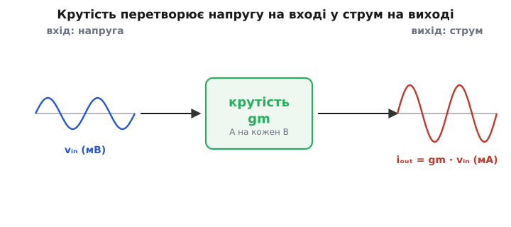
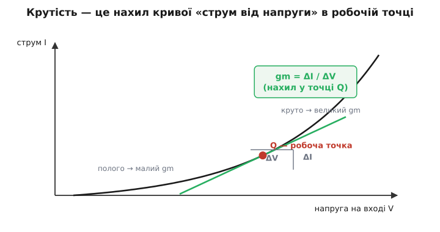
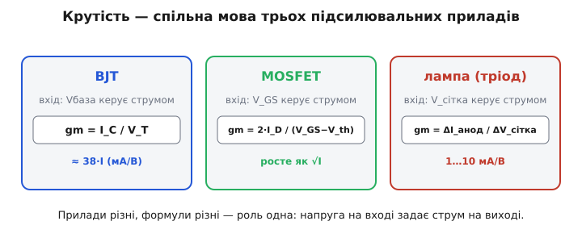

# Крутість (gm): як транзистор «конвертує» напругу у струм

Поставте поряд резистор і транзистор — і ви побачите два геть різні способи зв'язати напругу зі струмом. У резисторі напруга й струм живуть на одних і тих самих двох виводах: прикладену напругу він обертає на струм **крізь себе**, і чим менший опір, тим більший струм. Це звичайна провідність. Транзистор робить дивнішу річ: напругу він читає **в одному місці** (на вході — базі чи затворі), а струм видає **в іншому** (на виході — колекторі чи стоці). Вхід і вихід — різні виводи, майже не пов'язані постійним струмом. Ось цей «перенос» керування з входу на вихід — від напруги тут до струму там — і називають **крутістю** (англ. *transconductance*, від *transfer* — перенос + *conductance* — провідність; позначають gm).

Слово склали свідомо. «Провідність» (англ. *conductance*) — бо одиниця та сама, що в резистора: струм поділити на напругу. «Транс-» (лат. *trans* — через, поперек) — бо провідність ця не «крізь той самий вивід», а «навхрест»: вхід керує виходом. У старій літературі її так і звали — **взаємна провідність** (англ. *mutual conductance*), наголошуючи, що зв'язані дві різні пари виводів. Це не словесна забаганка: саме ця «навхрестність» робить транзистор підсилювачем, а не просто опором.

> 🔧 **Навіщо це.** Уся аналогова схемотехніка тримається на думці «напруга на вході → струм на виході». Підсилення каскаду, поведінка диференційної пари, вхід операційного підсилювача, активні фільтри — усе це рахують через gm. Зрозумівши крутість як одне число — «скільки ампер виходу на кожен вольт входу», — ви дістаєте ключ, яким відмикається більшість транзисторних схем без жодного даташита.

### Чому це найприродніший погляд на активний прилад

Спокуса дивитися на транзистор як на «підсилювач напруги» велика, але оманлива. Усередині прилад **не множить напругу** — він керує **струмом**. У біполярного транзистора напруга на базі відкриває потік носіїв і задає струм колектора; у польового напруга на затворі керує провідністю каналу й так само задає струм стоку. У жодному з них вихід — це не «вхід, помножений на число вольт». Вихід — це **струм**, що слухається вхідної **напруги**. Напруга на виході з'являється вже потім — коли цей струм пускають крізь резистор навантаження.

Звідси й уся стратегія. Якщо головна дія прилада — «напруга задає струм», то й описувати його треба числом, що зв'язує саме ці дві величини. Це число й є gm:

```
gm = iₒᵤₜ / vᵢₙ        (скільки струму виходу на одиницю напруги входу)
```


*Слабка напруга на вході (ліворуч) керує струмом на виході (праворуч) тієї самої форми, але вже як струм. Крутість — це «обмінний курс» між ними: скільки ампер виходу припадає на кожен вольт входу. Усе, що прилад робить для сигналу, ховається в цьому одному множнику.*

Подивіться на одиницю. Струм поділити на напругу — це провідність, обернена до опору; її одиниця — **сименс** (англ. *siemens*, S; раніше казали «мо», англ. *mho* — «ом» навпаки, бо це обернений ом). Один сименс крутості означає: один вольт на вході дає один ампер на виході. На практиці транзистори дають частки сименса, тож зручніше тримати в голові **міліампери на вольт** (мА/В): «посунув вхід на мілівольт — вихід ворухнувся на стільки-то мікроампер».

> Сименс — одиниця провідності, обернена до ому (1 S = 1 А/В = 1/Ом). Назву офіційно закріпили в 1930-х на честь родини Сіменсів; стара назва «мо» (ohm задом наперед) це підказку про оберненість несе прямо в слові. Та сама одиниця міряє і провідність резистора, і крутість транзистора — різниця лише в тому, чи струм тече «крізь той самий вивід», чи «навхрест».

Тут і ховається відповідь, чому крутість — природна, а «коефіцієнт підсилення напруги» — похідна. Підсилення напруги в транзистора **не існує саме по собі**: воно з'являється лише тоді, коли ви оберете резистор навантаження. Поставте малий резистор — підсилення мале; великий — велике. А крутість — властивість самого прилада в даному режимі, ще до того, як ви щось до нього під'єднали. Спершу прилад дає струм за крутістю, а вже потім схема обертає цей струм на напругу.

### Крутість — це нахил

Найгеометричніший спосіб відчути gm — намалювати, як струм виходу залежить від напруги входу, і подивитися на **нахил** цієї кривої.

У будь-якого активного прилада ця крива нелінійна: при малій вхідній напрузі струму майже немає, далі він починає рости, і чим вища напруга, тим крутіше. Але в робочій схемі прилад тримають в одній **робочій точці** — на одному місці кривої — і подають зверху лише слабкий сигнал, що ледь гойдає його туди-сюди. У такому малому околі крива майже не відрізняється від прямої, і важливий лише її **нахил саме тут**. Цей нахил і є крутість.

```
gm = ΔI / ΔV        (наскільки круто струм відгукується на напругу в робочій точці)
```


*Крива «струм від напруги» загнута: унизу полога, угорі крута. Крутість у робочій точці Q — це нахил дотичної саме там, тобто відношення приросту струму ΔI до приросту напруги ΔV. Де крива полога, нахил малий — і крутість мала; де круто, малий поштовх напруги дає великий стрибок струму.*

Звідси й буквальність назви «крутість»: круто нахилена крива — велика крутість; полога — мала. І ще один важливий висновок: крутість **не стала**. Вона залежить від того, в якій точці кривої ми сидимо, тобто від робочого струму. Той самий транзистор на більшому струмі стоїть на крутішій ділянці кривої — і має більшу крутість. Тому крутість — це не «паспортна цифра прилада», а властивість **режиму**, в якому прилад працює.

Те, що крутість — нахил, дозволяє рахувати її точно з рівняння прилада. Для біполярного транзистора крива струму колектора експонентна, і її нахил виходить напрочуд простим — лише робочий струм поділити на тепловий потенціал (≈26 мВ при кімнатній температурі). Як саме цей нахил перетворює нелінійний прилад на жменю лінійних чисел, докладно розбирає [мала-сигнальна модель](root:hw-analog/bjt-small-signal): там крутість, її обернена величина й вхідний опір виводяться з одного робочого струму.

> Для біполярного транзистора крутість рахується без даташита: gm = I_C / V_T, де V_T ≈ 26 мВ — тепловий потенціал. Зручне правило для пам'яті: gm ≈ 38·I_C (струм у міліамперах, крутість у мА/В), бо 1/26 мВ ≈ 38. Повне виведення й супутні числа (re, rπ) — у [малосигнальній моделі BJT](root:hw-analog/bjt-small-signal).

### Від крутості — до підсилення напруги

Якщо прилад дає струм, а нам потрібна напруга, лишилося одне: пустити цей струм крізь резистор. Струм на резисторі обертається на напругу за законом Ома — і ось так із крутості народжується підсилення напруги.

Простежмо ланцюжок на найпоширенішому каскаді. Сигнальна напруга vᵢₙ заходить на вхід. Прилад відгукується струмом на виході iₒᵤₜ = gm·vᵢₙ. Цей струм тече крізь резистор навантаження R і створює на ньому напругу:

```
vₒᵤₜ = iₒᵤₜ · R = gm · vᵢₙ · R
```

Підсилення — це відношення виходу до входу. Поділивши, дістаємо чисту й глибоку формулу:

```
Aᵥ = vₒᵤₜ / vᵢₙ = gm · R
```

Ось де ховається сенс. Підсилення каскаду — це **просто крутість, помножена на опір навантаження**. Прилад дає струм (крутість), резистор обертає струм на напругу (опір) — і добуток цих двох речей є коефіцієнт підсилення. Жодного «магічного множення напруги» всередині прилада немає; є керування струмом плюс закон Ома зовні.

**Приклад. Крізь транзистор тече 1 мА, у колекторі резистор R = 4.7 кОм. Яке підсилення напруги?**
```
gm = I_C / V_T = 1 мА / 26 мВ ≈ 0.038 А/В   (38 мА/В)
Aᵥ = gm · R = 0.038 · 4700 ≈ 180
```
Один мілівольт на вході перетвориться приблизно на 180 мВ на виході. Зверніть увагу, що в формулі немає коефіцієнта підсилення струму β — підсилення напруги визначають лише робочий струм (через gm) та опір навантаження.

Ця формула одразу показує важливий компроміс. Хочете більше підсилення — беріть більший R або більший струм (щоб зросла крутість). Але великий R з'їдає більше напруги живлення, а великий струм гріє прилад. Тому реальне підсилення завжди — перемовини між крутістю, навантаженням і запасом живлення; gm у цій трійці — внесок самого прилада.

> 🔧 **Навіщо це.** Формула Aᵥ = gm·R — найшвидша оцінка підсилення в голові. Знаєте робочий струм — знаєте крутість; помножили на резистор навантаження — маєте коефіцієнт підсилення, ще не торкнувшись паяльника. І щойно ви бачите підсилення як «крутість × навантаження», стає ясно, чому той самий каскад на більшому струмі підсилює сильніше і чому навантаження зовнішнім малим опором підсилення вбиває.

### Обернений бік: малий сигнал бачить крутість як опір

У крутості є дзеркальне число, і воно теж щодня в роботі. Якщо gm каже «скільки струму на вольт напруги», то обернена величина каже «скільки напруги на ампер струму» — а це вже **опір**:

```
re = 1 / gm        (опір, який крутість показує «з іншого боку»)
```

Це не паяний резистор усередині прилада — це **видимий для сигналу опір** самого керованого переходу, наслідок крутизни кривої. Його неможливо виміряти омметром (омметр пустив би постійний струм і зсунув би робочу точку), але для слабкого сигналу він поводиться як справжній маленький опір. Для біполярного транзистора з нього виходить знамените «золоте правило»: re ≈ 26/I (струм у міліамперах, опір в омах) — при 1 мА це ≈26 Ом, при 10 мА ≈2.6 Ом.

Дві мови, один прилад. Інженер, що думає «крутість», скаже: вихідний струм = gm·vᵢₙ. Інженер, що думає «опір», скаже: той самий струм = vᵢₙ/re. Це одне й те саме рівняння, переписане навиворіт, бо re = 1/gm. Зручно мати обидві: крутість природна, коли рахуєш струм виходу від напруги входу; обернений опір re — коли прикидаєш, який опір сигнал «бачить» з боку емітера чи витоку.

### Кероване джерело: модель крутості

Як же намалювати прилад, що «читає напругу тут, дає струм там»? Звичайним резистором — ніяк: резистор зв'язує струм і напругу на **тих самих** виводах. Потрібен новий елемент — **кероване джерело струму** (англ. *voltage-controlled current source*, VCCS): джерело, чий струм заданий не наперед, а **величиною напруги десь-інде** в схемі.

Саме таким елементом і моделюють крутість. Для сигналу активний прилад замінюють джерелом струму силою gm·vᵢₙ, де vᵢₙ — напруга на вході. Воно й передає всю суть: вхідна напруга керує вихідним струмом, а множником служить крутість. Уся нелінійність, уся фізика переходів згортається в одне число gm перед керованим джерелом.

> Кероване джерело струму (VCCS) — ідеалізований елемент, чий струм дорівнює напрузі в іншій точці кола, помноженій на коефіцієнт (тут — на gm). Це той самий будівельний блок, яким моделюють будь-який підсилювальний прилад: вхід керує виходом. Докладніше про сам цей блок і його родичів — у статті про [залежні джерела](root:hw-analog/dependent-sources).

Ось чому крутість має одиницю провідності, а не безрозмірний коефіцієнт. Безрозмірним було б відношення «напруга до напруги» чи «струм до струму». А крутість зв'язує **різнорідні** величини — струм виходу й напругу входу, — тож її розмірність неминуче «ампер на вольт», тобто провідність. Сам тип величини вже каже, що це прилад, який перетворює напругу на струм, а не масштабує однорідне.

### Одна роль — різні прилади

Крутість — не властивість конкретно біполярного транзистора. Це спільна мова **всіх** підсилювальних приладів, де вхідна напруга керує вихідним струмом. Змінюється формула, якою крутість рахують, але роль однакова.


*Біполярний транзистор, польовий транзистор і електронна лампа — прилади різної фізики, з різними формулами крутості. Та роль у всіх одна: напруга на вході (база, затвор, сітка) задає струм на виході. Крутість — це число, яким описують цю спільну дію.*

У **біполярного** транзистора крутість пропорційна струмові: gm = I_C/V_T. Подвоїли струм — подвоїли крутість; це найкрутіша залежність із трьох, тому біполярні прилади дають найбільшу крутість на даний струм.

У **польового** транзистора (MOSFET) крутість росте з робочим струмом лише як корінь: gm = 2·I_D/(V_GS − V_th), що пропорційно √I_D. Тому, щоб добитися тієї самої крутості, що в біполярного, польовому треба значно більший струм. Натомість польовий майже не бере струму на вході (керує полем, а не потоком носіїв) — і це окремий козир.

В **електронній лампі** (тріоді) крутість — це нахил кривої анодного струму від напруги на сітці, типово одиниці міліампер на вольт. Сам термін «крутість» народився саме тут, у лампову епоху, коли треба було одним числом описати, наскільки добре сітка керує анодним струмом.

> 📜 **Звідки взялося слово.** Термін «взаємна провідність», а згодом «крутість», виник у часи електронних ламп — і має конкретних авторів та дату стандартизації. Як від лампового «наскільки сітка керує анодом» поняття перейшло до транзисторів і чому одиницею стала провідність — в [історії крутості](root:hw-analog/transconductance/hist-mutual-conductance.md).

Те, що крутість — спільна характеристика, має практичну вагу. Замінюючи лампу транзистором, біполярний прилад польовим чи проєктуючи каскад «з нуля», інженер міркує одними поняттями: яка потрібна крутість, який струм її дасть, який резистор оберне струм на потрібну напругу. Прилади різні — арифметика однакова.

### Прилади, побудовані просто на крутості

Є цілий клас схем, де крутість — не проміжна величина, а **сам продукт**. Тут вихід так і лишають струмом, не обертаючи його на напругу резистором, бо керований струм зручніший за керовану напругу.

Найяскравіший приклад — **диференційна пара**: два однакові транзистори зі спільним хвостовим струмом, що реагують на **різницю** вхідних напруг струмом на виході. Це вхідний каскад майже кожного операційного підсилювача й компаратора. Його поведінку природно описувати саме крутістю всієї пари: різниця вхідних напруг помножується на gm пари й дає вихідний струм, який далі качає наступні каскади.

> Диференційна пара перетворює різницю двох вхідних напруг на вихідний струм, і коефіцієнтом цього перетворення служить крутість пари. Це вхідний каскад операційних підсилювачів і компараторів. Як саме пара ділить хвостовий струм між двома гілками залежно від різниці напруг — у статті про [диференційну пару](root:hw-analog/opamp-input-stage).

Окремий клас приладів так і називають — **підсилювач крутості** (англ. *operational transconductance amplifier*, OTA): мікросхема, що видає на виході струм, пропорційний різниці вхідних напруг, причому сам коефіцієнт gm можна налаштовувати зовнішнім струмом. Це робить підсилення керованим «на льоту» — звідси перебудовні фільтри, регулятори гучності, помножувачі сигналів. Там, де звичайний операційний підсилювач дає напругу, підсилювач крутості дає **струм** і дозволяє керувати самою крутістю.

### Де ця картина спрощує

Крутість як одне число — потужне, але це наближення, і чесно знати його межі.

**Тільки малий сигнал.** Уся думка трималася на тому, що ми сидимо в малому околі робочої точки, де крива ≈ пряма, отже нахил (gm) сталий. Жени великий сигнал — і прилад пройде по ділянках кривої з різним нахилом: крутість уже не одна, з'являється спотворення. Для біполярного транзистора орієнтир такий: розмах вхідної напруги має бути добре меншим за тепловий потенціал (26 мВ), інакше нахил по дорозі помітно змінюється.

**Крутість залежить від режиму, не лише від прилада.** Спокусливо сказати «у цього транзистора крутість така-то», але це неповно: крутість змінюється з робочим струмом (а в біполярного — ще й з температурою через V_T). Та сама деталь у двох різних схемах має дві різні крутості. Тому крутість завжди називають **для конкретної робочої точки**.

**Вихід не ідеально струмовий.** Ми припускали, що вихідний струм залежить лише від вхідної напруги й анітрохи — від напруги на самому виході. Насправді є слабка залежність (вихідний струм трохи росте з вихідною напругою), тож паралельно керованому джерелу варто домалювати великий, але скінченний вихідний опір. У грубих прикидках ним нехтують; у каскадах із дуже великим підсиленням саме він ставить стелю.

Попри ці застереження, крутість лишається одним із найробочіших понять аналогової електроніки. Вона зводить норовливий нелінійний прилад до простої думки — «стільки струму на кожен вольт» — і з цієї думки виростає майже все: підсилення каскаду (gm·R), вхідний каскад операційного підсилювача, активні фільтри, керовані підсилювачі. Транзистор перестає бути загадкою: для сигналу він — кероване напругою джерело струму, а вся його дія сидить в одному числі, яке задає робочий режим.
