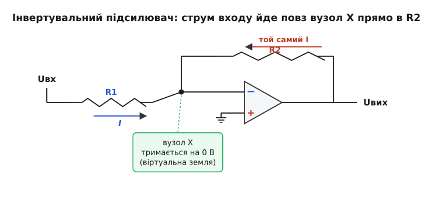
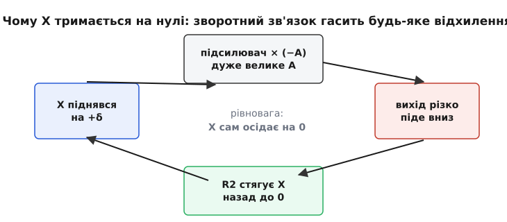
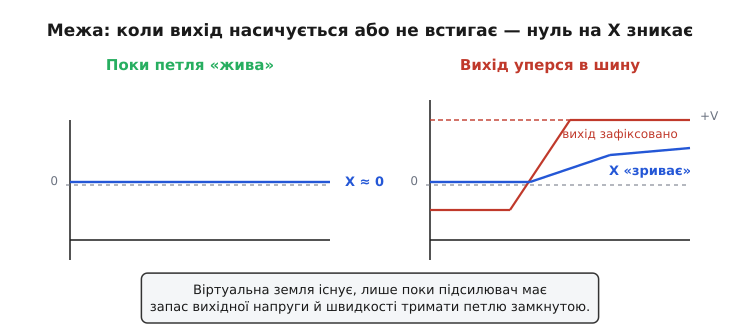

# Віртуальна земля

Уявіть вузол у схемі, до якого ви не під'єднали жодного проводу до землі, — а вольтметр на ньому вперто показує нуль. І не просто нуль: ви чіпляєте до цього вузла різні резистори, женете крізь нього струми туди й сюди, а він **усе одно тримається на нулі**, ніби намертво прибитий до спільного проводу. Прямого з'єднання немає, а потенціал — як у справжньої землі. Ось це й називають **віртуальною землею** (лат. *virtualis* — уявний, потенційний; земля тут — спільний нульовий провід схеми): вузол, який **поводиться** як заземлений, хоча фізично до землі не приєднаний.

Звучить як фокус. Але це не фокус, а пряма робота від'ємного зворотного зв'язку, і коли ви зрозумієте механізм, то побачите його всюди — в інвертувальних підсилювачах, суматорах, інтеграторах, перетворювачах струму в напругу. Віртуальна земля — це той вузол, навколо якого зібрано добру половину аналогової схемотехніки. Розберімо, чому вона виникає, як нею користуватися й де вона раптом перестає бути нулем.

## Що саме означає «віртуальна»

Слово «віртуальна» тут точне. Воно не означає «несправжня» чи «така собі земля». Воно означає: **за наслідками** — повноцінна земля, **за пристроєм** — ні. Якщо ви аналізуєте струми й напруги довкола цього вузла, ви маєте повне право вважати його потенціал нулем — і всі ваші розрахунки збіжаться з реальністю. Але якщо спробуєте через нього **злити струм у землю** напряму, як через справжній провід, — нічого не вийде, бо проводу немає.

Аналогія: уявіть рівень води в шлюзі, який автоматика тримає рівно на позначці. Шлюз не з'єднаний трубою з тим водоймищем, що задає позначку, — але насос невпинно підкачує чи зливає воду так, щоб рівень не відхилявся. Для будь-кого, хто міряє рівень, він **дорівнює** еталонному. Аналогія ламається в одному: приберіть живлення від насоса — і рівень попливе. Так само й віртуальна земля: вимкніть підсилювач — і нуль зникне миттєво. Це **активно утримуваний** нуль, а не пасивне з'єднання.

> 🔧 **Навіщо це.** Віртуальна земля — це інструмент, що дає вам у схемі **нерухому точку**, до якої зручно «приколоти» струми. Коли один вивід резистора висить на віртуальній землі, напруга на цьому резисторі визначена однозначно (бо один його кінець на нулі), а отже й струм крізь нього — теж. Це перетворює заплутану схему із взаємним впливом гілок на просту арифметику: кожна вхідна гілка дає свій струм незалежно від інших, і всі вони збираються в одній точці. Саме тому підсилювачі на віртуальній землі так легко рахувати й так точно вони працюють.

## Звідки береться нуль: від'ємний зворотний зв'язок

Щоб віртуальна земля виникла, потрібні дві речі: підсилювач із **дуже великим** підсиленням і петля [від'ємного зворотного зв'язку](root:hw-analog/negative-feedback), яка повертає частину виходу назад на вхід. Майже завжди цим підсилювачем служить [операційний підсилювач](root:hw-analog/opamp) — мікросхема, яка підсилює **різницю** напруг між двома своїми входами в десятки й сотні тисяч разів.

Ось ключова думка. Операційний підсилювач рахує `Uвих = A · (U₊ − U₋)`, де A — те саме величезне підсилення, тисяч сто. Переставимо рівняння:

```
U₊ − U₋ = Uвих / A
```

Вихід підсилювача не може вискочити за межі живлення — він живе в діапазоні, скажімо, ±15 В. Поділіть ці 15 вольтів на A = 100000 і отримаєте різницю входів **0.00015 В** — півтори десятих частки мілівольта. Тобто поки підсилювач працює в робочому діапазоні (вихід не вперся в шину живлення), різниця між його входами **притиснута майже до нуля**. Не тому, що ми так захотіли, а тому, що інакше вихід полетів би в нескінченність, а він не може.

Тепер під'єднаймо «плюсовий» вхід до справжньої землі: `U₊ = 0`. Тоді з притиснутої до нуля різниці випливає, що й `U₋ ≈ 0`. **Мінусовий вхід сам собою опинився на нулі** — хоча проводом до землі він не з'єднаний. Ось вона, віртуальна земля: вузол на інвертувальному вході сидить на потенціалі землі, бо підсилювач старанно тримає різницю входів коло нуля, а другий вхід заземлено по-справжньому.

Те, що **обидва** входи опиняються на майже однаковій напрузі, називають [віртуальним коротким замиканням](root:hw-analog/virtual-short): входи ніби закорочені, хоча струму між ними майже не тече. Віртуальна земля — це частковий випадок, коли один із входів сидить на справжній землі, тож «нуль різниці» перетворюється на «нуль абсолютний».


*Класичний інвертувальний підсилювач. «Плюс» заземлено, тому підсилювач тримає вузол X («мінус») теж на нулі — це віртуальна земля. Струм I, заданий вхідною напругою на R1, не може зайти у вхід підсилювача (той майже нічого не бере), тож увесь тече далі крізь R2 на вихід. Один і той самий струм у двох резисторах — звідси й коефіцієнт підсилення.*

## Як механізм тримає вузол на місці

Сказати «різниця входів мала, бо підсилення велике» — правильно, але це опис, а не механізм. Подивімося, **що фізично відбувається**, коли вузол намагається відхилитися від нуля.

Хай через якесь збурення потенціал на вузлі X трохи **піднявся** — став, скажімо, +1 мВ замість нуля. Підсилювач бачить: на «мінусі» тепер більше, ніж на «плюсі» (який на нулі). Різниця `U₊ − U₋` стала від'ємною. Множимо на велике додатне A — вихід **різко йде вниз**. А вихід зв'язаний з вузлом X через резистор зворотного зв'язку R2. Вихід пішов униз — він **потягнув за собою** вузол X через R2 назад, до нуля. Щойно X повернувся на нуль, різниця знову зникла, рух зупинився. Рівновага.

Симетрично: просів би X нижче нуля — підсилювач погнав би вихід угору, той підтягнув би X назад. Хоч куди смикни вузол, петля повертає його на місце. Що сильніший підсилювач (більше A), то жорсткіше тримається нуль і то менше залишкове відхилення. У границі нескінченного A відхилення дорівнює нулю точно — звідси й зручне правило «вважай вузол строго на нулі».


*Петля від'ємного зворотного зв'язку як саморегулятор. Піднявся X — підсилювач кинув вихід униз — R2 стягнув X назад. Коло замикається в стійку рівновагу, у якій X осідає рівно на нулі. Нуль на віртуальній землі — це не задана напруга, а точка, у якій петля заспокоюється.*

Зверніть увагу на тонкість: вузол тримається на нулі **не тому, що туди щось «вливає» нуль вольтів**, а тому, що вся система влаштована як терези, які весь час урівноважуються. Це принципово: віртуальна земля — наслідок роботи зворотного зв'язку, і живе вона рівно стільки, скільки петля замкнута й справна.

## Чому це робить розрахунок простим

Тепер найкорисніше — як віртуальна земля перетворює аналіз схеми на арифметику. Повернімося до інвертувального підсилювача й порахуймо його підсилення з нуля, спираючись лише на два факти про ідеальний операційний підсилювач: **входи майже нічого не споживають** (вхідний струм ≈ 0) і **вузол X сидить на віртуальній землі** (0 В).

Вхідна напруга Uвх прикладена до резистора R1, другий кінець якого — на віртуальній землі (0 В). Отже напруга на R1 — це просто Uвх, і струм крізь нього:

```
I = (Uвх − 0) / R1 = Uвх / R1
```

Цей струм добігає до вузла X. Куди йому далі? У вхід підсилювача він зайти не може — той майже нічого не бере. Лишається єдиний шлях: **увесь** струм тече далі крізь R2 на вихід. Той самий I, без втрат у вузлі. А напруга на R2 — це різниця між вузлом X (0 В) і виходом Uвих:

```
I = (0 − Uвих) / R2
```

Маємо два вирази для **одного** струму. Прирівнюємо:

```
Uвх / R1 = −Uвих / R2
Uвих = −Uвх · (R2 / R1)
```

Готово. Підсилення — це просто відношення двох резисторів, зі знаком «мінус» (звідси «інвертувальний»). Жодних рівнянь на петлю, жодного A в результаті — велике підсилення вже зробило свою справу, забезпечивши віртуальну землю. Уся складність схеми згорнулася в один рядок саме тому, що ми мали **тверду точку 0 В**, до якої прив'язалися.

**Worked-приклад: підсилювач мікрофонного сигналу.** Треба підсилити сигнал у 22 рази зі зміною знаку. Беремо R1 = 1 кОм; тоді R2 = 22 кОм дасть `R2/R1 = 22`. Перевіримо на конкретному вхідному рівні 50 мВ:

```
I  = Uвх / R1 = 0.05 / 1000        = 50 мкА   (струм у R1)
Uвих = −I · R2 = −50e-6 · 22000     = −1.1 В   (вихід)
|Uвих/Uвх| = 1.1 / 0.05            = 22        ✓
```

У прошивці часто треба перерахувати потрібний резистор зворотного зв'язку під заданий коефіцієнт — наприклад, коли цифровий потенціометр на місці R2 виставляє підсилення:

```c
// Підбір R2 під бажаний коефіцієнт інвертувального підсилювача.
// gain — це |Uвих/Uвх| (модуль, бо знак мінус задає сама схема).
// R1, R2 — омах.
float feedback_resistor(float r1, float gain)
{
    return gain * r1;            // |Uвих/Uвх| = R2/R1  →  R2 = gain · R1
}
// feedback_resistor(1000.0f, 22.0f) -> 22000 Ом = 22 кОм
```

Ця сама точка-нуль дає ще одну важливу властивість: на вхід R1 джерело сигналу «бачить» опір рівно R1 до землі (бо за резистором — віртуальний нуль). Це **вхідний опір** інвертувального підсилювача, і він передбачуваний — теж завдяки віртуальній землі.

## Збираємо струми: суматор

Найкраще сила віртуальної землі видно там, де треба **скласти** кілька сигналів. Підведемо до вузла X не один резистор, а три — R1, R2, R3 — кожен зі своїм вхідним джерелом. Що станеться?

Оскільки вузол X тримається на нулі **незалежно** від того, що до нього під'єднано, кожен вхід «не знає» про сусідів: напруга на його резисторі — це просто його власна вхідна напруга (бо інший кінець на нулі). Тому кожен дає свій струм самостійно:

```
I1 = U1 / R1,   I2 = U2 / R2,   I3 = U3 / R3
```

Усі три струми збігаються у вузлі X і разом течуть крізь резистор зворотного зв'язку Rзз. Сума струмів дає вихід:

```
Uвих = −Rзз · (U1/R1 + U2/R2 + U3/R3)
```

Це **аналоговий суматор** — він складає напруги (з вагами, заданими резисторами) однією мікросхемою. І працює він лише завдяки віртуальній землі: саме вона **розв'язує** входи між собою, не даючи їм впливати один на одного. Якби вузол X не тримався на твердому нулі, зміна одного входу зрушувала б напругу у вузлі й перекручувала б струми всіх інших — складання перетворилося б на місиво. Нерухома точка робить гілки незалежними. Докладне виведення підсилення інвертувального каскаду й суматора через віртуальну землю, з усіма проміжними кроками й врахуванням скінченного підсилення, зібрано окремо.[Виведення передавальних співвідношень](root:hw-analog/virtual-ground/math-inverting-transfer.md) — там показано, як той самий прийом «прирівняти струми у вузлі-нулі» дає формули інвертувального підсилювача, суматора та перетворювача струм-напруга, і як з'являється поправка на кінцеве A.

> 🔧 **Навіщо це.** На віртуальній землі будують перетворювач струму в напругу — серце вимірювання сигналу з [фотодіода](root:hw-analog/transimpedance-amplifier). Фотодіод дає струм, а не напругу; його заводять прямо у вузол-нуль, і весь цей струм тече крізь резистор зворотного зв'язку, перетворюючись на пропорційну напругу `Uвих = −I · Rзз`. Чому саме у віртуальну землю? Бо так на самому фотодіоді **майже немає напруги** (один його кінець на справжньому нулі, другий — на віртуальному), а це найточніший режим: діод не «бачить» вихідної напруги, його власна нелінійність не псує вимір. Без віртуальної землі такого чистого перетворення струму в напругу не зробити.

## Де нуль перестає бути нулем

Тепер найважливіше для практики — **межі**, де віртуальна земля тихо перестає працювати, а недосвідчений розробник продовжує на неї покладатися й отримує загадкові помилки.

**Насичення виходу.** Уся конструкція тримається на тому, що вихід **вільно рухається** й може підтягнути вузол назад до нуля. Але вихід не може вийти за межі живлення. Щойно ви попросили забагато підсилення або подали завеликий вхід — вихід упирається в шину (скажімо, +14 В при живленні +15 В) і **застрягає** там. З цієї миті він уже не може компенсувати відхилення вузла: петля розірвана. Вузол X **зривається з нуля** й починає жити сам по собі. Віртуальної землі більше немає, формули `Uвих = −Uвх·R2/R1` більше не діють — підсилювач просто «лежить» на шині.


*Дві картини того самого вузла. Ліворуч — петля жива: вихід має куди рухатися, тому тримає X рівно на нулі. Праворуч — вихід наїхав на шину живлення й зафіксувався, керувати вузлом більше нема чим, і X сповзає з нуля слідом за виходом. Віртуальна земля існує лише там, де підсилювач має запас вихідної напруги.*

**Частота й швидкість.** Підсилення A — велике лише на низьких частотах; з ростом частоти воно [спадає](root:hw-analog/real-opamp-limits). Що менше A на даній частоті, то «гірша» віртуальна земля: різниця входів `Uвих/A` уже не мікровольти, а помітна величина, і нуль «розмивається». На високих частотах вузол перестає бути твердим нулем — він трохи гойдається разом із сигналом. Додає клопоту й обмежена швидкість наростання виходу: якщо сигнал змінюється швидше, ніж вихід встигає за ним рухатися, петля на мить «відстає», і вузол знову відхиляється. Тому віртуальна земля — поняття **низькочастотне** за духом: чим вище, тим вона умовніша.

**Скінченне підсилення.** Навіть на постійному струмі A не нескінченне, тож вузол сидить не точно на нулі, а на крихітному `−Uвих/A`. Зазвичай це частки мілівольта, якими сміливо нехтують. Але в прецизійних схемах — там, де ловлять мікровольти, — ця залишкова напруга вже має значення, і її доводять до уваги. Точна земля — лише в границі нескінченного підсилення; реальна — дуже близька, але не ідеальна.

**Струмова межа.** Вузол тримає нуль, лише поки підсилювач **встигає** прокачати потрібний струм зворотного зв'язку через свій вихід. Попросіть більше струму, ніж вихід може віддати, — і він знову «здасться». Віртуальна земля не є джерелом струму необмеженої сили; вона тверда рівно настільки, наскільки сильний вихідний каскад підсилювача.

Спільна суть усіх цих меж одна: **віртуальна земля — це не властивість вузла, а стан петлі**. Поки зворотний зв'язок замкнутий, працює в лінійному режимі й має запас по напрузі, струму та швидкості — вузол твердо на нулі. Вийшли за будь-яку з цих меж — і нуль зникає тієї ж миті. Тримати це в голові важливіше за будь-яку формулу: спершу переконайся, що петля жива, і лише тоді користуйся віртуальною землею.

## Звідки взялося саме поняття

Ідея «вузла, який підсилювач тримає на сталому потенціалі», народилася не в теорії, а з практичної потреби рахувати. У 1940-х аналогові обчислювачі складали диференціальні рівняння з підсилювачів, що виконували математичні дії над напругами; саме там підсилювач із зворотним зв'язком уперше назвали «операційним» — бо він виконував **операції**. Вузол на його вході, що тримався на нулі, виявився настільки зручним для розрахунку інтеграторів і суматорів, що став окремим робочим поняттям. [Як народилася віртуальна земля](root:hw-analog/virtual-ground/hist-virtual-ground.md) — коротка історія від теорії від'ємного зворотного зв'язку Гарольда Блека в Bell Labs до статті Раґаззіні 1947 року, що дала операційному підсилювачу його назву, і перших серійних обчислювальних підсилювачів Філбрика; саме в цьому колі ідей віртуальна земля з прийому розрахунку перетворилася на наріжний камінь аналогової схемотехніки.

Сьогодні віртуальна земля — це перше, що ви шукаєте поглядом, коли дивитеся на схему з операційним підсилювачем: знайдіть заземлений вхід, знайдіть зворотний зв'язок — і протилежний вхід майже напевно є віртуальною землею, твердою точкою-нулем, до якої прив'язана вся логіка каскаду.
