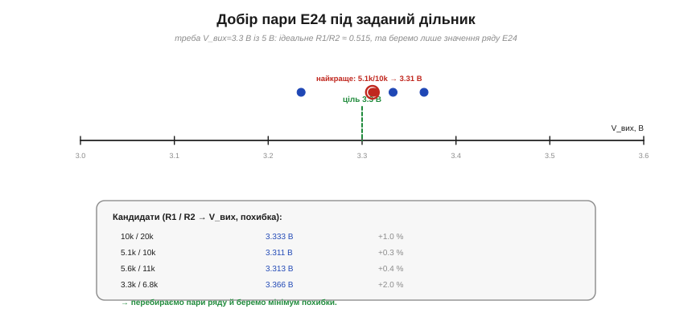
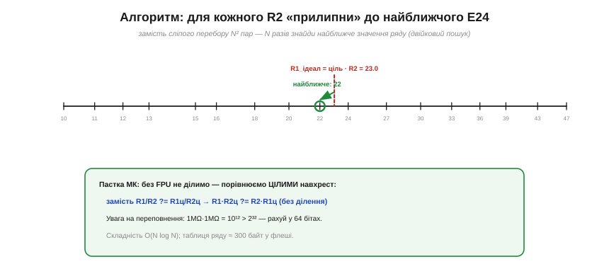

# ⚙️ Добір пари зі стандартного ряду: перебір E24 під задане співвідношення

> Алгоритмічна вставка до теми [дільник напруги](topic:hw-analog/voltage-divider). Формула дільника каже, яке **відношення** опорів потрібне. Та довільних номіналів не існує — лише [ряди **E**](topic:hw-components/resistor) (E24: 24 значення на декаду). Як автоматично знайти **пару** реальних резисторів, що дає потрібну напругу найточніше? Це маленька, але повчальна задача пошуку.

### Задача

Хай треба дістати V_вих = 3.3 В із 5 В. З [формули дільника](topic:hw-analog/voltage-divider): R₂/(R₁+R₂) = 3.3/5 = 0.66, звідки ідеальне відношення R₁/R₂ = (1−0.66)/0.66 ≈ **0.515**. Біда в тому, що резистора «5.15 кΩ» у продажу нема. Є лише сітка значень ряду E24, повторена по декадах (10, 11, 12, 13, 15… ×10ⁿ). Завдання: серед усіх пар (R₁, R₂) із цієї сітки знайти ту, чиє **фактичне** відношення найближче до 0.515.

### Ідея: перебір сітки


*Кожна пара E24 дає свою V_вих; відкладемо кандидатів на осі біля цілі 3.3 В. Пара 5.1k/10k дає 3.31 В (похибка +0.3 %) — найближче. Перебравши пари ряду й узявши мінімум похибки, знаходимо найкращу.*

Найпростіше — **повний перебір**: спробувати кожну пару (R₁, R₂), порахувати її відношення й лишити ту, де похибка найменша. Якщо в таблиці N значень (для 10 Ω…1 МΩ це ~120–150), пар буде N² ≈ 20 000 — мить для будь-якого комп'ютера, і навіть на МК це мікросекунди.

Та є й **розумніший** шлях, що відкидає квадрат. Відношення залежить лише від R₁/R₂, тож переберімо **тільки R₂**, а для кожного порахуймо **ідеальне** R₁ = (ціль)·R₂ і «прилипнімо» до **найближчого** значення E24 — його знаходять двійковим пошуком у відсортованій таблиці ряду.


*Розумний варіант: для обраного R2 ідеальне R1 = ціль·R2 = 23.0 «прилипає» до найближчого значення ряду (22). Унизу — цілочисловий трюк для МК без FPU: порівнюємо відношення навхрест, без ділення, пильнуючи переповнення.*

### Код

:::tabs
```python
from bisect import bisect_left

def nearest(sorted_e, x):
    """Найближче до x значення у відсортованій таблиці ряду (двійковий пошук)."""
    i = bisect_left(sorted_e, x)
    if i == 0:
        return sorted_e[0]
    if i == len(sorted_e):
        return sorted_e[-1]
    lo, hi = sorted_e[i - 1], sorted_e[i]
    return hi if hi - x < x - lo else lo

def find_pair(target, e_series):
    """target = бажане R1/R2 = (1−k)/k з потрібного виходу.
       e_series — усі значення E24 по декадах (відсортовані)."""
    best, best_err = None, float("inf")
    for r2 in e_series:
        r1_ideal = target * r2
        r1 = nearest(e_series, r1_ideal)              # двійковий пошук
        err = abs(r1 - target * r2) / (target * r2)   # відносна похибка (без ділення R1/R2)
        if err < best_err:
            best_err, best = err, (r1, r2)
    return best, best_err
```
```cpp
#include <cstdint>
#include <cstddef>

// e_series — усі значення E24 по декадах (відсортовані), в омах.
// Ціль (бажане R1/R2) задаємо дробом num/den, щоб працювати без плаваючої коми.
struct Pair { std::uint32_t r1, r2; };

// Найближче до ТОЧНОГО ідеалу goal/den значення у відсортованій таблиці ряду.
// goal = num·R2 — чисельник ідеального R1 = goal/den, den — спільний знаменник цілі.
// Важливо: ідеал НЕ округлюємо до цілого — інакше на межі між двома E24 обрали б гірший.
static std::uint32_t nearest(const std::uint32_t* e, std::size_t n,
                             std::uint64_t goal, std::uint32_t den) {
    std::size_t lo = 0, hi = n;
    while (lo < hi) {                      // межа: перший e[i], для якого e[i]·den >= goal
        std::size_t mid = lo + (hi - lo) / 2;
        if ((std::uint64_t)e[mid] * den < goal) lo = mid + 1; else hi = mid;
    }
    if (lo == 0) return e[0];
    if (lo == n) return e[n - 1];
    // Відстані рахуємо ТОЧНО, навхрест цілими: |e·den − goal| (спільний den при виборі зникає).
    std::uint64_t hi_dist = (std::uint64_t)e[lo] * den - goal;      // e[lo]·den >= goal
    std::uint64_t lo_dist = goal - (std::uint64_t)e[lo - 1] * den;  // e[lo-1]·den <= goal
    return hi_dist < lo_dist ? e[lo] : e[lo - 1];
}

Pair find_pair(std::uint32_t num, std::uint32_t den,
               const std::uint32_t* e, std::size_t n) {
    Pair best{0, 0};
    std::uint64_t best_num = 1, best_den = 0;          // best_err = best_num/best_den = ∞
    for (std::size_t j = 0; j < n; ++j) {
        std::uint32_t r2 = e[j];
        std::uint64_t goal = (std::uint64_t)num * r2;             // чисельник ідеального R1
        std::uint32_t r1 = nearest(e, n, goal, den);             // двійковий пошук за ТОЧНИМ ідеалом
        // err = |r1·den − num·R2| / (num·R2); порівнюємо дроби навхрест, без ділення
        std::uint64_t diff = (std::uint64_t)r1 * den;
        std::uint64_t err_num = diff > goal ? diff - goal : goal - diff;
        std::uint64_t err_den = goal;                            // масштаб похибки: err_num/goal
        // err_num/err_den < best_num/best_den  ⟺  err_num·best_den < best_num·err_den
        if (err_num * best_den < best_num * err_den) {
            best_num = err_num; best_den = err_den; best = Pair{r1, r2};
        }
    }
    return best;
}
```
:::

Кожна ітерація — це O(log N) на двійковий пошук, разом **O(N log N)**: для N~150 це сотні операцій, миттєво навіть на восьмибітному МК.

### Складність і пастки на МК

- **Складність.** O(N log N) у розумному варіанті (чи O(N²) у наївному — теж дрібниця). Пам'ять: таблиця ряду ~150 значень × 2 байти ≈ **300 байт** у флеші.
- **Без плаваючої коми.** Багато дешевих МК не мають FPU, тож ділення R₁/R₂ повільне чи недоступне. Порівнюй відношення **навхрест цілими**: замість `R₁/R₂ ?= R₁ц/R₂ц` рахуй `R₁·R₂ц` проти `R₂·R₁ц` — без жодного ділення.
- **Переповнення.** Опори сягають мегаомів, а добуток 10⁶·10⁶ = 10¹² **не влазить** у 32 біти (макс ≈ 4·10⁹). Рахуй проміжки в **64 бітах** або масштабуй значення.
- **Бюджет струму й тепла.** Сам пошук мусить рахуватися з повним опором R₁+R₂: замалий — марний струм і [тепло I²R](topic:ph-electromagnetism/joule-heating), завеликий — [просідання під навантаженням](topic:hw-analog/voltage-divider) і шум. Обмеж пошук **вікном** допустимих сум.
- **Точність під допуск.** Немає сенсу ганятися за 0.01 % відношення, якщо [резистори ±5 %](topic:hw-analog/voltage-divider/math-tolerance.md): узгодь точність пошуку з допуском, а для справді точного — застосуй трюк **узгодженої пари**.

Отак банальний «підбери два резистори» виявляється повноцінною задачею пошуку — з вибором алгоритму, цілочисловою арифметикою й оглядкою на фізичні межі. Саме такі дрібні оптимізації й відрізняють робочу прошивку від «теоретично правильної».
