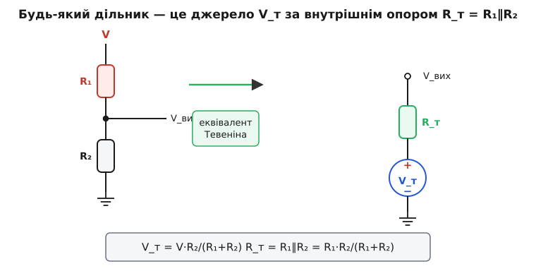
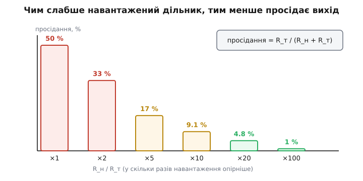
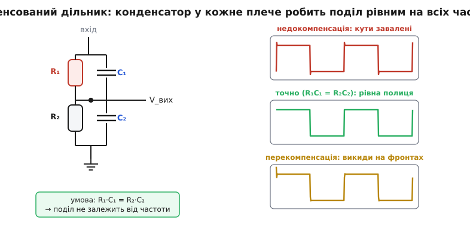

# Дільник напруги

<preknowlist>
- [Закон Ома](topic:hw-analog/ohms-law) — напруга на резисторі дорівнює струм · опір (U = I·R).
- [Послідовне з'єднання](topic:hw-analog/series-connection) — крізь елементи, увімкнені один за одним, тече спільний струм.
- [Паралельне з'єднання](topic:hw-analog/parallel-connection) — як складаються опори двох гілок між тими самими вузлами (R₁∥R₂ = R₁R₂/(R₁+R₂)).
- [Закон напруг Кірхгофа](topic:hw-analog/kvl) — сума спадів напруги вздовж замкнутого контуру дорівнює прикладеній напрузі.
- [Ємнісний опір](topic:hw-components/capacitive-reactance) — опір конденсатора змінному струму падає зі зростанням частоти (знадобиться в частині про змінний струм).
</preknowlist>

У живленні майже кожного пристрою є одна «головна» напруга — 5 В, 12 В, 3.3 В, — а окремим вузлам потрібна **менша**: опорні 1.65 В на середину діапазону, поріг у частку вольта, дрібна частка для входу АЦП. Найдешевший спосіб дістати частку напруги — поставити два резистори один за одним і зняти напругу з точки **між** ними. Ця схемка — **дільник напруги** — трапляється на платі частіше за будь-що інше.

Та за її простотою ховається річ, на якій «горить» багато початківців: дільник поводиться **не як джерело напруги**, а як джерело зі своїм **внутрішнім опором**, і саме цей опір вирішує, спрацює схема чи ні. Тому розберемо дільник до самого дна: звідки береться формула, чому будь-який дільник — це насправді **еквівалент Тевеніна**, як це диктує вибір номіналів, що стається на високих частотах і де все це працює по-справжньому.

### Формула: один спільний струм — і все випливає

Два резистори, R₁ і R₂, увімкнені **послідовно** між напругою V і землею; вихід знімають із вузла між ними. Оскільки резистори стоять один за одним, крізь обидва тече **той самий** струм — це суть послідовного з'єднання. Його величину дає закон Ома для повного опору кола:

```
I = V / (R₁ + R₂)
```

Вихідна напруга — це спад на нижньому резисторі, тобто V_вих = I·R₂. Підставивши струм, дістаємо формулу дільника:

```
V_вих = V · R₂ / (R₁ + R₂)
```

Уся вона каже одну просту річ: напруга ділиться між резисторами **пропорційно опорам**, і на вихід (нижнє плече) припадає частка R₂/(R₁+R₂) від повної напруги. Домовмося про позначення раз і назавжди: **R₂** — це резистор, з якого знімають вихід, **нижнє** плече між відводом і землею; **R₁** — верхнє, між входом і відводом. Переставите їх — дістанете іншу частку, R₁/(R₁+R₂).

Тут ховається перша тонкість, з якої почнеться все подальше. Частку задає **лише відношення** опорів, а не самі номінали: дільники 10к/10к і 100к/100к дають ту саму половину. Але «однакові за часткою» дільники геть **не однакові** за поведінкою — і щоб зрозуміти чому, треба спершу побачити, чим дільник є насправді.

> 🧮 **А наскільки точна ця частка?** Реальні [резистори](topic:hw-components/resistor) мають допуск (±5 %, ±1 %), і їхні похибки складаються у вихід **несподівано** — не сумою, а **різницею**: однаково відхилені (узгоджені) резистори дають точний дільник попри свій допуск. Виведення похибки dk/k = (1−k)(ε₂−ε₁), гірший випадок проти статистики (RSS) і прийом узгодженої пари — у вставці [Допуски складаються](topic:hw-analog/voltage-divider/math-tolerance.md).

### Дільник — це джерело з внутрішнім опором

Погляньмо на дільник **з боку виходу** — як на нього дивиться те, що ми до нього приєднаємо. Будь-яке лінійне коло з парою виводів, хай яке складне всередині, ззовні поводиться як **одне** ідеальне джерело напруги за **одним** послідовним опором — це [теорема Тевеніна](topic:hw-analog/thevenin) (за іменем французького інженера Леона Тевеніна). Знайдімо ці дві величини для дільника; з них випливе геть усе.

**Напруга джерела** V_т — це напруга на виході, коли до нього **нічого не приєднано** (холостий хід). Її ми вже маємо:

```
V_т = V · R₂ / (R₁ + R₂)
```

**Внутрішній опір** R_т — це опір, який «бачить» навантаження, дивлячись у вихід. Щоб його знайти, застосуймо стандартний прийом: **знеструмлюємо** джерело живлення. Ідеальне джерело напруги при цьому замінюють коротким замиканням (адже воно тримає на своїх виводах фіксовану напругу — для приростів це те саме, що нуль опору). Тоді верхній кінець R₁ виявляється **з'єднаним із землею**, і, дивлячись у вихідний вузол, ми бачимо R₁ та R₂, увімкнені **паралельно** — обидва йдуть від вузла до землі:

```
R_т = R₁ ∥ R₂ = R₁ · R₂ / (R₁ + R₂)
```


*Будь-який дільник ззовні — це джерело напруги V_т = V·R₂/(R₁+R₂) за внутрішнім опором R_т = R₁∥R₂. Ліворуч — два резистори й вихід; праворуч — той самий вузол як еквівалент Тевеніна. Знеструмивши V, бачимо у виході R₁ паралельно R₂ — звідси й R_т.*

Ось де ключ до всього. Дільник **тотожний** ідеальному джерелу V_т, за яким сидить резистор R_т. Ці дві величини незалежні: **відношення** R₂/(R₁+R₂) задає V_т, а **самі номінали** через R₁∥R₂ задають R_т. Тепер зрозуміло, чому 10к/10к і 100к/100к — не одне й те саме: обидва дають V_т = V/2, але перший має R_т = 5 кΩ, а другий — 50 кΩ. Однакова напруга, вдесятеро різний внутрішній опір. А внутрішній опір вирішує **все** — від просідання під навантаженням до швидкодії й шуму.

### Підступ навантаження: чому вихід просідає

Формула V·R₂/(R₁+R₂) справджується, лише поки до виходу **нічого не приєднано**. Щойно ви підключите реальне навантаження R_н (вхід наступного каскаду, світлодіод, будь-що зі скінченним опором), воно стає **паралельним** до R₂ — і вихід просідає. Через еквівалент Тевеніна це видно одразу й без плутанини: навантаження R_н утворює **новий дільник** уже з внутрішнім опором R_т:

```
V_вих(під навантаженням) = V_т · R_н / (R_н + R_т)
```

Відносне просідання — це та частка напруги, що «губиться» на внутрішньому опорі:

```
просідання = R_т / (R_н + R_т)
```


*Просідання = R_т/(R_н+R_т). Рівне навантаження (R_н = R_т) валить вихід удвічі; десятикратне лишає ≈9 % просідання, двадцятикратне — ≈5 %. Ось звідки правило: навантаження має бути щонайменше вдесятеро-вдвадцятеро опірніше за R_т дільника.*

Звідси — практичне правило дільника. Щоб просідання було невідчутним, навантаження мусить бути **набагато опірнішим** за внутрішній опір дільника: при R_н ≥ 10·R_т втрата ≈9 %, при R_н ≥ 20·R_т — уже ≈5 %. Саме тому входи, які **читають** напругу (вхід АЦП, вхід підсилювача), навмисне роблять **високоомними**: щоб не навантажувати те, що вони міряють.

**Приклад. Дільник 10к/10к під 10 В навантажили опором 10 кΩ. Що на виході?**

```
V_т = 10 · 10/(10+10)        = 5.0 В        (холостий хід)
R_т = 10·10/(10+10)          = 5.0 кΩ       (внутрішній опір)
V_вих = V_т · R_н/(R_н+R_т)  = 5·10/(10+5)  ≈ 3.33 В
просідання = R_т/(R_н+R_т)   = 5/15         ≈ 33 %
```

Вихід упав із 5.0 до 3.33 В — на третину, хоч у самому дільнику ми «нічого не міняли». Причина прозора: навантаження 10 кΩ лише **вдвічі** опірніше за R_т = 5 кΩ, а правило вимагало щонайменше десятикратного запасу. Головний висновок: **дільник — це не джерело живлення**. Він чудово задає **опорну напругу** для високоомного входу, але не годиться, щоб живити струмоємне навантаження.

### Жорсткий чи кволий: ціна вибору номіналів

Відношення опорів ми зафіксували часткою — лишається свобода вибрати самі номінали. І ось тут доводиться платити, хоч куди підеш.

**Малі опори — «жорсткий» дільник.** Візьміть R₁, R₂ малими (скажімо, сотні ом) — і R_т = R₁∥R₂ теж мале. Такий дільник **майже не просідає** під навантаженням, слабко ловить наводки й **швидко** віддає напругу. Але за це платимо струмом: дільник **постійно** споживає I = V/(R₁+R₂), і що менші опори, то більший цей марний струм і [тепло I²R](topic:ph-electromagnetism/joule-heating) на резисторах. Для пристрою від батарейки це неприйнятно.

**Великі опори — «кволий» дільник.** Візьміть мегаоми — і струм спокою впаде до мікроампер, батарея дякуватиме. Та R_т стане величезним, і вилазять три біди одразу. По-перше, дільник **просідає** від найменшого навантаження. По-друге, високоомний вузол — це фактично **антена**: він легко ловить мережеву наводку й шум. По-третє (найпідступніше), внутрішній опір разом із неминучою паразитною ємністю вузла утворює **фільтр**, що гальмує швидкі зміни сигналу. Зокрема, вхід АЦП має скінченний час на **зарядження** своєї вхідної ємності; якщо R_т завеликий, напруга не встигає встановитися за час вибірки, і [АЦП](topic:hw-analog/adc) читає похибку. Тому в паспортах АЦП прямо вказують **максимальний опір джерела** на вході.

Практичний компроміс — десятки кілоом: струм спокою в частки міліампера, R_т у одиниці-десятки кілоом, прийнятний і для швидкодії, і для більшості АЦП. А коли потрібна і **тверда** опорна напруга, і **економність** водночас, тупик розриває **буфер**: після дільника ставлять [повторювач напруги](topic:hw-analog/voltage-follower) на операційному підсилювачі. Він має гігантський вхідний опір (не навантажує дільник — той може бути хоч мегаомним і економним) і малий вихідний (тримає напругу під навантаженням). Дільник задає **значення**, буфер дає **силу**.

> ⚙️ **А де взяти такі номінали?** Потрібне відношення рідко збігається зі стандартним рядом E24 — тоді найкращу **пару** резисторів шукають перебором сітки значень (повний перебір O(N²) або розумніший O(N log N) із двійковим пошуком), пильнуючи цілочислову арифметику без FPU й переповнення на мікроконтролері: [Добір пари зі стандартного ряду](topic:hw-analog/voltage-divider/proj-divider-search.md).

### Дільник на змінному струмі: паразитна ємність і компенсація

Досі резистори були ідеальні, а частота — нульова (постійний струм). У реальному колі ні те, ні те не справджується: паралельно кожному резистору неминуче висить дрібна **паразитна ємність** (монтажу, самого резистора, входу приладу), і сигнал буває швидким. А конденсатор — це частотозалежний опір: його [ємнісний опір](topic:hw-components/capacitive-reactance) (реактанс, від латин. *re-actio* — «протидія») **падає** зі зростанням частоти. Тож у кожному плечі дільника паралельно резистору стоїть іще один, «частотний» шлях струму.

Наслідок: **частка дільника перестає бути сталою**. На постійному струмі та низьких частотах усе вирішують резистори, і поділ — R₂/(R₁+R₂). На дуже високих частотах реактанси ємностей стають набагато меншими за опори, струм тече переважно крізь них, і поділ визначають уже **ємності** — дільник стає ємнісним, C₁/(C₁+C₂). Між цими краями відношення **пливе з частотою** — а це означає, що швидкий сигнал (з багатьма частотними складовими) на виході **спотворюється**: різкі фронти завалюються або дзвенять. Що більший R_т, то з нижчої частоти починається це неподобство.

Є напрочуд елегантний вихід — **компенсований дільник**. Додаймо до кожного плеча конденсатор **навмисно** й підберімо їх так, щоб сталі часу обох плечей збіглися:

```
R₁ · C₁ = R₂ · C₂
```

Чому це справджується, видно з повного опору плеча. Резистор паралельно з ємністю має опір Z = R/(1 + jωRC) — той самий R, поділений на частотний множник (1 + jωRC), де ω — кутова частота, а j помічає реактивну (зсунуту за фазою) складову. Якщо сталі часу рівні, R₁C₁ = R₂C₂ = τ, то множник (1 + jωτ) в **обох** плечах однаковий — і в частці Z₂/(Z₁+Z₂) він скорочується дощенту:

```
V_вих/V = Z₂/(Z₁+Z₂) = [R₂/(1+jωτ)] / [(R₁+R₂)/(1+jωτ)] = R₂/(R₁+R₂)
```

Частота зникла: поділ той самий на **всіх** частотах. На постійному струмі це R₂/(R₁+R₂); на дуже високих — C₁/(C₁+C₂), і за умовою R₁C₁ = R₂C₂ ці дві дроби **рівні**. Дільник знову ділить чесно, хай яка швидка форма сигналу.


*Умова компенсації R₁C₁ = R₂C₂ робить поділ незалежним від частоти. Реакція на прямокутний сигнал одразу показує стан: недокомпенсація — завалені фронти, перекомпенсація — викиди, точна рівність RC — рівна «полиця». Так налаштовують щуп осцилографа.*

Це не абстракція, а те, як влаштований **щуп осцилографа ×10**. Резистор щупа ≈9 МΩ послідовно з входом [осцилографа](topic:hw-sensing/oscilloscope) ≈1 МΩ дає поділ 1:10 на постійному струмі. Але вхід приладу шунтований ємністю ≈15–20 пФ, і без компенсації щуп нищив би швидкі фронти. Тому в щуп вбудовано підлаштовний конденсатор: його крутять, дивлячись на **прямокутний** сигнал калібратора, поки «полиця» не стане рівною (завалені кути — недокомпенсація, викиди — пере-).

**Приклад. Яку ємність компенсації має мати щуп ×10 під вхід осцилографа 1 МΩ ∥ 20 пФ?**

```
R_щ·C_щ = R_ос·C_ос                          (умова компенсації)
C_щ = C_ос · R_ос/R_щ = 20 пФ · (1 МΩ / 9 МΩ) ≈ 2.2 пФ
```

Ось чому конденсатор щупа крихітний і підлаштовний: він мусить бути вдев'ятеро меншим за ємність входу приладу, а точні пікофаради «доводять» уже по прямокутнику. Той самий частотозалежний поділ, тільки під контролем, лежить і в основі [RC-фільтра низьких частот](topic:hw-analog/rc-low-pass), де вихід беруть саме з ємнісного плеча.

### Де це працює по-справжньому

**Читання давачів.** Найгарніше застосування дільника — **аналогові давачі**. Багато з них — це просто резистори, чий опір змінюється від умов: [термістор](topic:hw-sensing/ntc-thermistor) (від температури), [фоторезистор](topic:hw-sensing/photo-sensors) (від освітлення), тензодавач (від деформації). Поставивши давач одним плечем, а звичайний резистор — другим, ми перетворюємо **зміну опору** на **зміну напруги**, яку [АЦП](topic:hw-analog/adc) мікроконтролера легко зчитує. Тонкість, що відрізняє робочу схему від наївної: другий резистор беруть **близьким** до опору давача в цікавій робочій точці — тоді частка змінюється навколо половини, де крутість V_вих за опором **найбільша**, тож і чутливість максимальна. А коли треба вимірювати **малі** відхилення на тлі великого опору (тензодавач), один дільник уже не тягне, і його замінюють на **два** — [міст Вітстона](topic:hw-sensing/wheatstone-bridge), що віднімає опорну половину й лишає саму різницю.

**Зміщення транзистора.** Щоб транзистор працював підсилювачем, на його базу треба подати сталу опорну напругу — і роблять це саме дільником. Але тут дільник сам стає жертвою власного підступу: база **відбирає** струм, тобто є навантаженням. Щоб робоча точка не «плавала» від розкиду коефіцієнта підсилення, дільник роблять **жорстким** — струм крізь нього беруть у кілька разів більшим за струм бази, щоб той майже не просаджував відвід. Це той самий підступ навантаження, лише навантаженням тут є база: дільник напруги в колі [зміщення транзисторного підсилювача](topic:hw-analog/bjt-amplifier).

**Зсув логічних рівнів.** Дільник масштабує сигнал 5-вольтової логіки до 3.3 В, аби завести його у 3.3-вольтовий вхід. Дешево — і одразу три застереження. Він працює лише в **один** бік (донизу за напругою), постійно **тратить** струм і, найголовніше, впирається в ту саму частотну біду: паразитна та вхідна ємності разом із R_т роблять із дільника фільтр, і на швидких лініях фронти **завалюються**. Для повільних сигналів дільник годиться, для швидких — беруть спеціальний [перетворювач рівнів](topic:hw-digital/voltage-domain-interface).

**Потенціометр.** Якщо середній відвід зробити **рухомим**, дільник стає регульованим — це [потенціометр](topic:hw-components/potentiometer) (від латин. *potentia* — «сила» + грец. *metron* — «міра»). Повзунок ділить суцільну резистивну доріжку на «верхнє» й «нижнє» плечі, і, крутячи ручку, ми плавно змінюємо частку від 0 до 1. Так влаштовані регулятори гучності та яскравості й так мікроконтролер читає положення «крутилки».

**Драбинка R-2R.** Нарешті, дільники можна **зчепити** в повторюваний візерунок із опорів R і 2R — і тоді набір цифрових ключів задає **зважену** суму напруг. Так із самих лише резисторів будують цифро-аналоговий перетворювач: [драбинка R-2R](topic:hw-analog/r2r-ladder).

> 🔧 **Навіщо це.** Дільник напруги — ваш щоденний інструмент, щоб **задати опорну напругу** й **зчитати давач**. Тримайте в голові три речі. Перша: дільник — це джерело з внутрішнім опором R_т = R₁∥R₂, і навантаження має бути **щонайменше вдесятеро** опірніше за нього (інакше вихід просяде). Друга: номінали — це компроміс між струмом спокою (малі опори — гаряче й ненажерливо) і швидкодією/шумом (великі опори — кволо й повільно); десятки кілоом підходять майже завжди, а треба тверду напругу — ставте **буфер**. Третя: на швидких сигналах пам'ятайте про ємність — або компенсуйте дільник, або не женіть крізь нього фронти.

---

**Дільник напруги** — два послідовні резистори з відводом посередині, V_вих = V·R₂/(R₁+R₂): напруга ділиться пропорційно опорам, і частку задає **відношення** плечей. Але глибша правда в тому, що дільник — це **джерело Тевеніна**: ідеальна напруга V_т = V·R₂/(R₁+R₂) за внутрішнім опором R_т = R₁∥R₂. З цієї пари випливає все — просідання під навантаженням (R_н має бути ≫ R_т), компроміс жорсткого й кволого дільника, потреба в буфері, частотна поведінка та її компенсація. Через дільник мікроконтролери читають аналоговий світ, транзистори дістають зміщення, а щупи осцилографів залишаються чесними на будь-якій частоті. Дзеркальний аналог для струму — [дільник струму](topic:hw-analog/current-divider): там спільною є напруга, а ділиться струм — обернено до опорів.

---
