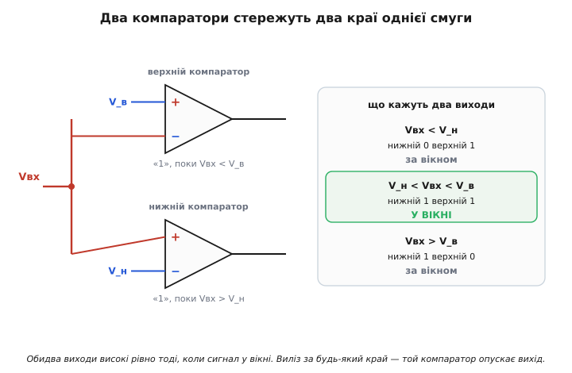
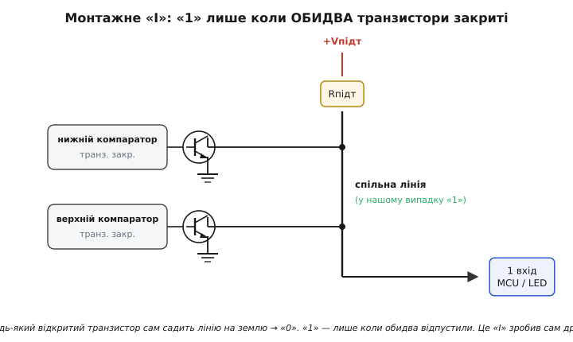
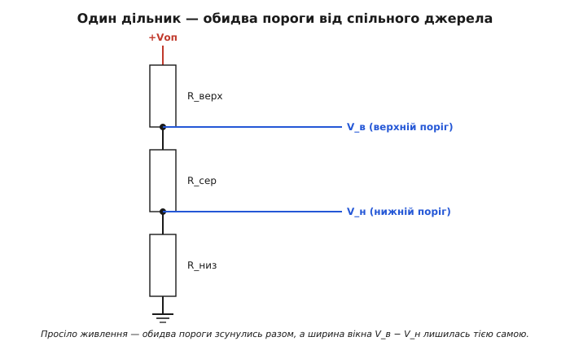
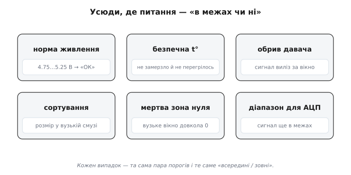

# Віконний компаратор

Звичайний [компаратор](root:hw-analog/comparator) ставить світові одне-єдине запитання: сигнал **вищий** за поріг чи **нижчий**? Одна межа, дві відповіді. Та реальні задачі часто формулюються інакше. «Чи напруга живлення **в нормі**?» — а норма це не «більше за щось», а **смуга**: не нижче 4.75 В і не вище 5.25 В. «Чи температура **в безпечному діапазоні**?» — теж смуга: не замерзло й не перегрілося. Тут потрібна відповідь не на «вище/нижче», а на **«всередині чи зовні»** — потрапив сигнал у дозволене вікно значень чи виліз за його край.

Один поріг такого сказати не вміє: він розрізняє лише два півпростори, а вікно має **дві** стінки. Напрошується очевидне: візьмімо два пороги — нижню межу й верхню — і питаймо про кожну окремо. Саме це й робить **віконний компаратор** (англ. *window* — вікно): пара компараторів, що разом стережуть два краї однієї смуги й кажуть одне просте слово — сигнал **у вікні** чи **за вікном**.

### Що таке «вікно» й чому одного порога замало

Уявімо вісь напруги. Сигнал гуляє вздовж неї. Ми хочемо знати не його точне значення, а лише чи лежить він у відрізку від нижньої межі V_н до верхньої V_в. Цей відрізок і є **вікно**; усе під V_н — «занизько», усе над V_в — «зависоко».

```
   занизько   │      У ВІКНІ       │   зависоко
 ─────────────┼───────────────────┼─────────────►  Vвх
             V_н                  V_в
```

Один компаратор дає лінію, що ділить вісь надвоє. Щоб вирізати **відрізок**, ліній треба **дві**: одна каже «вище V_н?», друга — «нижче V_в?». Сигнал у вікні **тоді й лише тоді**, коли обидві відповіді «так» водночас: він **і** перевищив нижню межу, **і** ще не дістав верхньої. Двозначна умова — два пороги. Звідси й уся конструкція: два компаратори та логічне «**І**» над їхніми відповідями.

> 🔧 **Навіщо це.** Щойно в задачі звучить «у межах», «у нормі», «у діапазоні», «не замало й не забагато» — це сигнал, що одного порога не вистачить, потрібне вікно. Контроль живлення, межі температури, перевірка, що давач не обірвався й не закоротив, сортування деталей за розміром — усе це задачі про смугу, а не про однобічну межу.

### Як це працює: два компаратори й одне «І»

Складемо вікно з того, що вже маємо. Сигнал Vвх заводимо **одночасно** на обидва компаратори. Кожному даємо свій поріг і обертаємо його так, щоб він стежив за **своїм** краєм вікна.

Нижній компаратор стежить, чи сигнал **не провалився** під нижню межу. Подамо V_н на його інвертуючий вхід «−», а сигнал — на «+». Тоді його вихід високий, поки `Vвх > V_н`, тобто поки сигнал **над** дном вікна.

Верхній компаратор стежить, чи сигнал **не виліз** над верхню межу. Тут входи дзеркальні: V_в на «+», сигнал — на «−». Його вихід високий, поки `Vвх < V_в`, тобто поки сигнал **під** стелею вікна.

```
Нижній компаратор:   «+»=Vвх,  «−»=V_н   →   «1», поки Vвх > V_н
Верхній компаратор:  «+»=V_в,  «−»=Vвх   →   «1», поки Vвх < V_в
```

Тепер придивімося, що кажуть ці два виходи в кожній із трьох зон:

```
Vвх < V_н  (занизько):  нижній «0»,  верхній «1»   → НЕ обидва
V_н<Vвх<V_в (у вікні):  нижній «1»,  верхній «1»   → ОБИДВА «1»
Vвх > V_в  (зависоко):  нижній «1»,  верхній «0»   → НЕ обидва
```

Закономірність проступає сама: **обидва виходи високі рівно тоді, коли сигнал у вікні**. Виліз за будь-який край — і той компаратор, що стереже цей край, опускає свій вихід. Отже, відповідь «сигнал у вікні» — це логічне **«І»** двох виходів: `у_вікні = нижній І верхній`. Поза вікном завжди хоч один із них каже «ні».


*Сигнал подано одночасно на два компаратори з порогами V_н і V_в. Нижній тримає «1», поки сигнал над дном; верхній — поки під стелею. Обидва високі лише в смузі між порогами — це й є вікно.*

Лишилося зробити з двох сигналів один. Поставити логічний вентиль «І» — можна, але є спосіб елегантніший, без жодного вентиля, і саме його використовують на практиці.

### Складання виходів без вентиля: монтажне «І»

Майже всі компараторні мікросхеми мають вихід із [відкритим колектором](root:hw-components/open-collector-output): усередині сидить транзистор, що вміє лише **притягувати** вихід до землі, а «1» утворюється тим, що зовнішній підтяжний резистор тягне лінію до живлення. Сам по собі такий вихід пасивний угору й активний униз. Ось чому це безцінно для вікна.

З'єднаймо **обидва** виходи в одну точку й почепимо на неї **один** підтяжний резистор до живлення. Що відбувається? Лінія підніметься до «1» лише тоді, коли **обидва** транзистори відпущені (закриті) — тобто коли обидва компаратори кажуть «1». Досить **хоч одному** транзистору відкритися — і він **сам** садить спільну лінію на землю, хай би що робив другий. Один притягнув — уся лінія внизу.

Це і є потрібне нам «І», зроблене самим дротом, без логічного елемента. Його звуть **монтажним «І»** (англ. *wired-AND* — з'єднане дротом «І»): функцію виконує саме з'єднання, а не окремий вентиль.

```
Vвх у вікні      → обидва транзистори закриті → підтяжка тягне ВИХІД угору → «1»
Vвх за вікном    → хоч один транзистор відкритий → садить ВИХІД на землю   → «0»
```

Виходить напрочуд ощадливо: два компаратори, два резистори-дільники на пороги, один підтяжний — і готовий індикатор «у нормі / поза нормою» на одному дроті. Жодного вентиля, жодної логіки.


*Виходи обох компараторів зведено в одну точку на спільний підтяжний резистор. «1» з'являється лише коли обидва транзистори закриті (сигнал у вікні). Будь-який відкритий транзистор стягує лінію вниз — це монтажне «І» без вентиля.*

> 🔧 **Навіщо це.** Відкритий колектор перетворює дріт на безкоштовний вентиль «І» — і це причина, чому віконний компаратор так часто роблять на готовому **здвоєному чи зчетвереному** компараторі (наприклад, класі LM393/LM339): два канали в одному корпусі, обидва з відкритим колектором, лишається тільки зліпити їхні виходи й додати одну підтяжку. Якби виходи були звичайні, двотактні, так з'єднати їх **не можна** — два джерела билися б за лінію; саме відкритий колектор робить трюк можливим.

### Звідки беруться пороги

Два пороги треба десь узяти. Найпростіше — **дільник напруги** з трьох резисторів між живленням і землею: дві проміжні точки дадуть одразу V_н і V_в, причому **обидві від одного джерела**. Це не дрібниця: якщо живлення трохи попливе, обидва пороги попливуть **разом**, тож ширина вікна (різниця V_в − V_н) лишиться сталою. Вікно «дихає» вгору-вниз як ціле, але не розпливається.


*Три послідовні резистори між живленням і землею дають дві проміжні точки — нижній і верхній пороги одразу. Спільне джерело означає, що від просідання живлення обидва пороги зсуваються разом, а ширина вікна тримається.*

Простий резистивний дільник годиться, коли від точності вікна не залежить нічого критичного — індикатор «приблизно в нормі», груба сортувalka. Та коли вікно має тримати реальну межу — скажімо, контролювати, що живлення процесора не вийшло за ±5 %, — пороги беруть не від живлення (воно ж і є те, що ми перевіряємо!), а від окремого **стабільного опорного джерела**, чия напруга не залежить ні від температури, ні від просідання шини.

> 🔧 **Навіщо це.** Вікно точне рівно настільки, наскільки точні його стінки. Дешевий дільник дає дешеве вікно — стінки гуляють із температурою й живленням. Для відповідального контролю пороги прив'язують до опорного джерела (стабілітрон чи бандгеп), і тоді вікно стоїть твердо там, де його поставили, незалежно від погоди в схемі.

Тонкощі вибору опори тут варто знати глибше: чому простий дільник пливе й чим його замінюють — у статті [«Джерела опорної напруги»](root:hw-analog/voltage-reference-sources) (стабілітрон і бандгеп-осередок дають напругу, що майже не залежить від температури й струму).

### Логіка «у вікні» проти «поза вікном»

Іноді зручніше, щоб схема спрацьовувала **не** коли сигнал у нормі, а навпаки — коли він **виліз** за межі (тривога, аварійне вимкнення). Це лиш питання, який рівень вважати «активним».

При монтажному «І», описаному вище, вихід **високий усередині** вікна й **низький зовні**. Хочете протилежного — «низький усередині, високий зовні» (зручно як сигнал тривоги «вийшли за межу!») — переверніть обидва компаратори: поміняйте місцями входи кожного. Тоді кожен тримає «1», коли його край **порушено**, і монтажне з'єднання дає «1», щойно сигнал вийшов за **будь-яку** межу. Виходить пряма протилежність: спокій усередині, сигнал — на вихід за край.

Обидва прочитання рівноправні; обирають за тим, що зручніше навісити далі. Для світлодіода «все добре» беруть «високий усередині»; для входу скидання мікроконтролера (reset, що має спрацювати при виході живлення за норму) — «активний зовні».

### Worked-приклад: вікно «живлення в нормі» 4.75…5.25 В

Зберімо монітор шини 5 В: світлодіод світиться, поки живлення в межах ±5 % (від 4.75 до 5.25 В), і гасне, щойно воно вилізло за край. Це класичний контроль норми.

Спершу порахуймо пороги триланковим дільником від стабільної опори. Хай опора V_оп = 5.00 В, а дільник із трьох резисторів задає V_н = 4.75 В і V_в = 5.25 В. Виберемо повний струм дільника невеликим, скажімо, через сумарні 10 кОм. Частки напруги мають бути 4.75/5.00 і 5.25/5.00 від опори.

**Дано:** опора 5.00 В; треба V_н = 4.75 В і V_в = 5.25 В; сумарний опір дільника ≈ 10 кОм.

```
Частка нижнього порога:  4.75 / 5.00 = 0.950
Частка верхнього порога: 5.25 / 5.00 = 1.050   ← більше за 1!
```

Тут видно пастку: верхній поріг 5.25 В **вищий** за опору 5.00 В, тож простим дільником від 5.00 В його не дістати — дільник лише ділить, тобто завжди дає **менше** за вхід. Висновок не косметичний, а принциповий: **опора має бути вищою за найвищий поріг вікна**. Візьмімо опору з запасом — наприклад, V_оп = 6.00 В (або окреме джерело трохи вище шини). Тоді частки лягають усередину діапазону:

```
Нижній поріг:  4.75 / 6.00 = 0.792   → нижній резистор бере 79.2 % напруги дільника
Верхній поріг: 5.25 / 6.00 = 0.875   → до верхньої точки набирається 87.5 %
```

Тепер розкинемо 10 кОм на три плечі. Знизу до нижньої точки треба 79.2 % опору, до верхньої — 87.5 %, решта — верхнє плече:

```
R_низ  (земля…V_н):  0.792 · 10 кОм = 7.92 кОм
R_сер  (V_н…V_в):   (0.875 − 0.792) · 10 кОм = 0.83 кОм
R_верх (V_в…+6В):   (1 − 0.875) · 10 кОм = 1.25 кОм
```

Перевіримо межі. Подамо на вікно типові значення живлення:

```
Vвх = 5.00 В (норма):  > 4.75 (нижній «1») і < 5.25 (верхній «1») → ОБИДВА «1» → світить
Vвх = 4.60 В (просіло): < 4.75 → нижній «0»                      → погасло
Vвх = 5.40 В (стрибок): > 5.25 → верхній «0»                     → погасло
```

Вікно тримає смугу 4.75…5.25 В, як і хотіли. Мікроконтролер читає такий вихід однією лінією:

:::tabs
```cpp
// вихід віконного компаратора заведено на ніжку GPIO;
// HIGH = живлення в нормі (обидва компаратори відпустили відкриті колектори)
if (digitalRead(POWER_OK_PIN) == HIGH) {   // у вікні 4.75…5.25 В
    status_led_on();                        // «живлення в нормі»
} else {                                    // вийшло за край вікна
    status_led_off();
    enter_safe_mode();                      // напруга поза нормою — підстрахуватися
}
```
```micropython
from machine import Pin

power_ok = Pin(POWER_OK_PIN, Pin.IN)

# HIGH = живлення в нормі (обидва компаратори відпустили відкриті колектори)
if power_ok.value():                # у вікні 4.75…5.25 В
    status_led_on()                 # «живлення в нормі»
else:                               # вийшло за край вікна
    status_led_off()
    enter_safe_mode()               # напруга поза нормою — підстрахуватися
```
:::

### Брязкіт на краях — і той самий лік

У віконного компаратора **дві** межі, тож і вада звичайного компаратора подвоюється: біля **кожного** краю сигнал, зависнувши рівно на порозі, починає **брязкати** — найменший шум совгає його туди-сюди, і вихід нервово смикається на вході й виході вікна. Корінь той самий, що й у простого порога: межа нескінченно гостра.

Лік теж той самий — **гістерезис**: дати кожному краю не одну лінію, а дві (трохи вище для входу й трохи нижче для виходу), щоб шум у кілька мілівольт не міг переметнути сигнал через межу туди-назад. На практиці кожному з двох компараторів додають дрібний **додатний** зворотний зв'язок, як і одиничному. Як саме два пороги гасять брязкіт і чому це робить додатний зв'язок — у статті [«Гістерезис і тригер Шмітта»](root:hw-analog/schmitt-trigger) (частку виходу повертають на «+», і єдиний поріг розщеплюється на два, між якими вихід глухий до шуму).

Тонкість лише в тому, що тепер гістерезис ставлять на **обидва** компаратори, і слід пильнувати, щоб смужки гістерезису країв не налізли одна на одну, коли вікно вузьке. Доки вікно ширше за суму обох гістерезисів — усе чисто.

> 🔧 **Навіщо це.** Голий віконний компаратор у живу схему ставлять рідко з тієї самої причини, що й голий одиничний: на краях він брязкає. Дрібний гістерезис на кожному компараторі (одиниці–десятки мВ) робить обидва переходи чистими — індикатор «у нормі» не мерехтить на самій межі, а reset не смикає процесор пачкою скидань, коли живлення повзе через поріг.

### Готова мікросхема замість двох компараторів

Найпоширеніша задача для вікна — стежити за живленням — настільки масова, що під неї роблять **окремі мікросхеми**: монітори (наглядачі) напруги, або супервізори (англ. *supervisor* — наглядач). Усередині такого чипа вже сидять обидва компаратори, точне опорне джерело й гістерезис — усе, що ми складали вручну, упаковане й відкаліброване на заводі. Зовні лишається кілька ніжок: вхід живлення, що стежимо, і вихід «у нормі / поза нормою» (часто це сигнал скидання мікроконтролера). Це і є віконний компаратор у заводській обгортці.

Такий чип не просто зручніший — він **точніший**: його внутрішнє опорне джерело й пороги відкаліброване набагато краще, ніж аматорський дільник, і не пливуть від температури. Тому в серйозній техніці контроль живлення майже завжди довіряють готовому супервізору, а не паяному вікну з двох компараторів. Конкретні моделі таких наглядачів — від простих однопорогових до багатоканальних віконних — живуть у каталозі живлення; а як народилася ціла галузь цих чипів — у вставці [«Наглядач живлення: від двох компараторів до супервізора»](root:hw-analog/window-comparator/hist-supervisor-ic.md).

> 🔧 **Навіщо це.** Перш ніж паяти вікно з двох компараторів для контролю живлення, варто згадати: під цю саму задачу є готовий супервізор за копійки, точніший і менший. Самостійне вікно справді доречне, коли пороги нетипові (контролюєш не живлення, а сигнал давача), коли треба нестандартна логіка виходу або коли вікно — лише частина більшої аналогової схеми. Для «стежити, що 3.3 В у нормі» беруть супервізор.

### Де ще стає в пригоді вікно

Контроль живлення — найгучніший, але далеко не єдиний приклад. Вікно потрібне всюди, де питання звучить як «в межах чи ні»:

- **межі температури:** тримати об'єкт у безпечній смузі — не замерзло й не перегрілося (термостат із двома краями);
- **перевірка цілісності давача:** справний давач дає сигнал десь у середині свого діапазону; вихід **за** вікно (надто близько до 0 чи до живлення) означає **обрив або коротке** — вікно ловить несправність, а не лише вимірюване;
- **сортування за розміром:** деталь, чий розмір (через давач) дає напругу у вузькому вікні, — придатна; зависоко чи занизько — брак, скинути з конвеєра;
- **детектор «нуля» з зоною нечутливості:** вузьке вікно довкола нуля каже «сигнал майже нульовий» — корисно, щоб не реагувати на дрібний дрейф;
- **контроль діапазону вхідного сигналу** перед аналого-цифровим перетворювачем: чи не вийшов сигнал за межі, де перетворення ще має сенс.


*Усюди, де питання — «в межах чи ні»: норма живлення, безпечна температура, обрив давача (сигнал виліз за вікно), сортування за розміром, мертва зона довкола нуля. Скрізь та сама пара порогів і те саме «всередині/зовні».*

Особливо вартий уваги другий випадок — **перевірка цілості давача**. Тут вікно стереже не саму величину, а **здоровий глузд** показання: реальний термістор чи давач тиску ніколи не видає рівно 0 В чи рівно напругу живлення — таке буває лише при обриві дроту чи короткому замиканні. Поставивши вікно довкола **робочого** діапазону давача, ловлять саме поломку проводки, а не зміну вимірюваного. Один віконний компаратор перетворює давач на **самодіагностований**: він сам сигналить, коли йому не можна вірити.

### Коротко про суть

Віконний компаратор відповідає на питання, якого одиничний компаратор поставити не може: сигнал **усередині** заданої смуги чи **зовні**? Складається він із двох компараторів — нижній стереже дно вікна, верхній стелю, — а їхні відповіді зводять логічним «І», яке найзручніше зробити самим дротом через відкриті колектори (монтажне «І»). Пороги беруть від спільного дільника чи, для точності, від стабільної опори, що має бути вища за верхній поріг. На краях вікна, як і в одиничного компаратора, рятує гістерезис. А коли вікно потрібне для масової задачі — контролю живлення, — його не паяють, а беруть готовим наглядачем-супервізором, де все вже всередині й відкаліброване. Усе вікно тримається на одній думці: дві межі замість однієї, і логічне «І» між «вище дна» та «нижче стелі».
