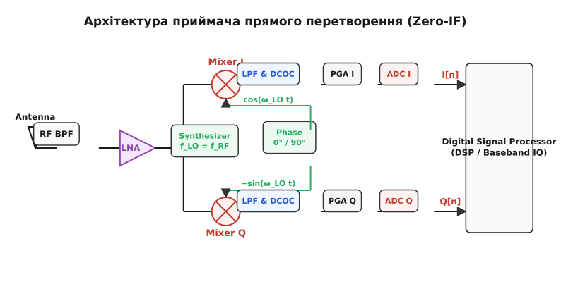
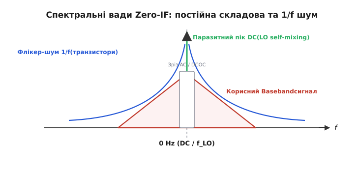
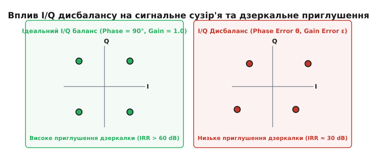
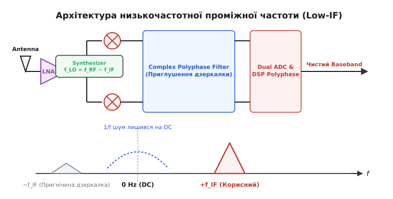

# Zero-IF та Low-IF архітектури

<preknowlist>
- [Супергетеродин](root:hw-analog/superheterodyne) — концепція переносу радіочастоти на проміжну за допомогою змішування.
- [Змішувач частот](root:hw-analog/mixer) — принципи перетворення частот та квадратурне змішування.
- [Локальний гетеродин](root:hw-analog/local-oscillator) — формування високочастотних коливань та фазовий шум.
- [Підсилювачі високої частоти](root:hw-analog/rf-amplifiers) — малошумний підсилювач (LNA) та динамічний діапазон.
</preknowlist>

Сучасний смартфон або модуль зв'язку безпілотника мусить працювати в десятках радіодіапазонів від 70 МГц до 6 ГГц, приймаючи канали із шириною смуги від 200 кГц до 100 МГц. Якщо будувати такий мультидіапазонний трансивер за класичною супергетеродинною схемою, для кожного діапазону знадобиться окремий зовнішній смуговий фільтр дзеркального каналу та громіздкий керамічний або кварцовий фільтр проміжної частоти (ПЧ). Розмістити десятки таких неінтегрованих дискретних компонентів на компактній друкованій платі фізично неможливо, а виготовити високодобротний ВЧ-фільтр безпосередньо всередині кремнієвої мікросхеми заважають високі втрати в напівпровідниковій підкладці.

Усунути дискретні фільтри й повністю інтегрувати весь радіочастотний тракт на один кремнієвий кристал вдалося завдяки переходу до архітектур **прямого перетворення** (англ. *Direct Conversion Receiver*, або **Zero-IF**) та **низькочастотної проміжної частоти** (**Low-IF**). Зміщуючи частоту локального гетеродина безпосередньо на несучу частоту сигналу або на відстань кількох сусідніх каналів, інженери перенесли важкі операції фільтрації та підсилення з високочастотної області в низьку базову смугу, де вони виконуються простими цифровими алгоритмами та інтегрованими активними фільтрами.

### Серце Zero-IF: квадратурний перенос у нульову ПЧ

Головна ідея приймача прямого перетворення (Zero-IF, або гомодинного приймача) полягає у виборі частоти гетеродина `f_LO`, яка **точно дорівнює несучій частоті** прийнятого радіосигналу `f_RF`:

```
f_LO = f_RF
f_IF = |f_RF − f_LO| = 0 Hz
```

Коли прийнятий високочастотний сигнал перемножується з гетеродином такої ж частоти, різницева проміжна частота стає рівною нулю (`0 Гц`). Модульований радіосигнал миттєво переноситься зі своєї гігагерцової несучої прямо в спектральну область базової смуги (англ. *baseband*), симетрично розгортаючись довкола нуля.


*Приймач Zero-IF переносить ВЧ-сигнал безпосередньо в базову смугу за допомогою квадратурних змішувачів I та Q, керованих зсунутими на 90 градусів гетеродинами.*

На перший погляд, таке рішення скасовує головний біль супергетеродина — **проблему дзеркального каналу**. Нагадаємо, що в супергетеродіні дзеркальною є частота `f_img = f_RF ± 2 · f_IF`, яка лягає на ту ж проміжну частоту й вимагає гострого зовнішнього ВЧ-фільтра для її пригнічення. У Zero-IF проміжна частота `f_IF = 0`, тому дзеркальна частота `f_img = f_RF`, тобто дзеркальним каналом для прийнятого сигналу є... сам корисний сигнал (його власні верхня та нижня бічні смуги).

Проте виникає новий геометричний виклик: якщо сигнал перенести в базову смугу одним звичайним змішувачем, його позитивні та негативні частотні компоненти накладуться одна на одну відносно нуля. Верхня бічна смуга (`f_RF + Δf`) та нижня бічна смуга (`f_RF − Δf`) після перетворення опиняться на одній і тій самій позитивній частоті `Δf`, перетворившись на нероздільну мішанину.

Щоб зберегти амплітудну й фазову інформацію та розділити верхню і нижню бічні смуги, Zero-IF приймач обов'язково будується за **квадратурною схемою**. Вхідний радіосигнал розділяється на два паралельні канали й подається на два незалежні змішувачі:
- **Синфазний канал I (In-phase)**: перемножується з синусоїдою гетеродина `cos(w_LO · t)`.
- **Квадратурний канал Q (Quadrature)**: перемножується з тією ж синусоїдою, зсунутою за фазою точно на 90 градусів: `−sin(w_LO · t)`.

Пара оцифрованих відліків `I[n]` та `Q[n]` утворює комплексний сигнал `Z[n] = I[n] + j · Q[n]`. У комплексному просторі позитивні та негативні частоти є математично ортогональними. Це дає змогу цифровому сигнальному процесору (DSP) без жодних втрат демодулювати будь-які складні види модуляцій (QPSK, 16-QAM, 256-QAM, OFDM). Детальний огляд того, як ідеї прямого перетворення пройшли шлях від поодиноких ламп 1920-х років до масового силікону, викладено в матеріалі про [історію прямого перетворення](root:hw-analog/zero-if-receiver/hist-direct-conversion.md).

### Формування квадратурних опорних сигналів (LO Quadrature Generation)

Оскільки точність квадратурних віток I та Q визначає загальну працездатність Zero-IF приймача, генерації двох синусоїдальних сигналів із відносною фазою `90.00°` приділяють особливу увагу в архітектурі ВЧ-синтезаторів. 

У сучасних інтегральних мікросхемах застосовують два основні методи формування квадратурних тонів:

1. **Дільник частоти на 2 на тригерах (Divide-by-2 Quadrature Divider)**: Синтезатор генератора, керованого напругою (VCO), налаштовується на подвоєну робочу частоту `2 · f_LO`. Вихідний сигнал подається на два паралельні тригери розширеного цифрового дільника, один із яких спрацьовує по наростаючому фронту годинникового імпульсу, а другий — по спадаючому. На виході дільника виникають два меандрові сигнали на частоті `f_LO`, що мають ідеальну теоретичну фазову різницю в 90 градусів у широкому діапазоні частот. Цей метод є найпоширенішим у сучасних CMOS-трансиверах, оскільки не залежить від температури та технологічних розкидів компонентів, проте вимагає від VCO роботи на подвоєній частоті (наприклад, 12 ГГц для діапазону 6 ГГц).
2. **Поліфазні фазообертальні мережі RC-CR (Polyphase Quadrature Networks)**: Сигнал гетеродина на частоті `f_LO` пропускається через пасивну мікроаналогову мережу з резисторів та конденсаторів. Одна вітка має ФНЧ-характеристику (зсув фази `-45°`), а друга — ФВЧ-характеристику (зсув фази `+45°`), що забезпечує різницю у `90°`. Цей метод застосовують там, де VCO не може працювати на подвоєній частоті, проте поліфазні мережі мають високі втрати потужності та вужчу смугу частот.

### Чотири бар'єри Zero-IF та фізика їх подолання

Незважаючи на привабливу простоту — відсутність неінтегрованих ПЧ-фільтрів та повна відсутність класичного дзеркального каналу — приймач прямого перетворення довгі десятиліття вважався непридатним для масового виробництва. Причиною були чотири важкі фізичні вади, притаманні перенесенню спектра на нульову частоту.

#### 1. Постійна складова (DC Offset)

У Zero-IF приймачі спектр корисного сигналу розташований безпосередньо довкола `0 Гц`. Будь-яка постійна напруга (DC voltage) на виході змішувача потрапляє точно в центр корисного спектра.


*Паразитне протікання гетеродина створює велетенський пік DC на нульовій частоті, а транзисторний 1/f шум піднімає шумові пороги довкола DC, що вирішується зрізом або компенсацією DCOC.*

Джерелами виникнення паразитної постійної складової є два фізичні ефекти:

- **Самозмішування гетеродина (LO Self-Mixing)**: Напруга гетеродина на виході синтезатора має високу амплітуду (близько 300–500 мВ). Через паразитні ємності напівпровідникової підкладки, випромінювання доріжок плати або ємності корпусу мікросхеми частина потужності гетеродина протікає на вхід малошумного підсилювача (LNA) або на вхідний порт змішувача. Цей паразитний сигнал витоку `v_leak(t)` підсилюється й перемножується в змішувачі з тим же сигналом гетеродина `v_LO(t)`. З огляду на тригонометричну тотожність:
  ```
  cos(w_LO · t) · cos(w_LO · t) = ½ + ½ · cos(2w_LO · t)
  ```
  на виході виникає постійна напруга `½`. Навіть мікровольтні протікання гетеродина після підсилення створюють на виході змішувача постійну напругу у десятки мілівольт — що у тисячі разів перевищує корисний радіосигнал і заганяє наступні підсилювачі низької частоти (PGA) та АЦП у насичення.

- **Динамічний крок AGC**: Особливо підступною проблема DC offset стає при роботі автоматичного регулювання підсилення (AGC). Коли приймач перемикає коефіцієнт підсилення LNA або PGA на початку прийому пакета, амплітуда постійного зміщення змінюється стрибкоподібно. Цей стрибок сприймається цифровим демодулятором як потужний імпульс завади й збиває синхронізацію преамбули кадру.

- **Самозмішування потужних завад (Jammer Self-Mixing)**: Якщо поруч працює потужний передавач сусіда, його сигнал протікає в порт гетеродина змішувача або викликає квадратичне детектування на нелінійностях другого порядку (`IP2`). В результаті виникає динамічне постійне зміщення, амплітуда якого змінюється залежно від потужності завади в ефірі.

Для боротьби з DC offset застосовують два підходи:
1. **Аналоговий зріз (AC Coupling)**: Між змішувачем та підсилювачем базової смуги ставлять роздільний конденсатор або фільтр високих частот із частотою зрізу в кілька кілогерц. Це вирізає постійну складову, проте утворює «спектральну діру» (англ. *DC hole*) в центрі корисного сигналу.
2. **Цифрова система DCOC (Dynamic DC Offset Cancellation)**: Адаптивний цифровий фільтр у DSP в реальному часі оцінює ковзне середнє значення відліків АЦП та віднімає його, а за потреби подає компенсуючу напругу через допоміжний ЦАП назад в аналоговий тракт.

#### 2. Флікер-шум транзисторів (1/f Noise)

У польових транзисторах (MOSFET), з яких будують сучасні CMOS-мікросхеми, носії заряду під час руху каналом періодично захоплюються й вивільняються пастками на межі кремній-діелектрик. Цей хаотичний процес створює низхідний шум, спектральна щільність потужності якого зростає за законом `1/f` зі зменшенням частоти.

Частота зрізу флікер-шуму (англ. *flicker corner frequency*, `f_c`) у сучасних CMOS-процесах становить від 100 кГц до 2 МГц. У супергетеродіні корисний сигнал підсилюється на високій ПЧ (10.7 МГц), де флікер-шум вже відсутній і панує лише білий тепловий шум. У Zero-IF корисний сигнал потрапляє точно в область `0...f_c`, де флікер-шум максимальний. Це призводить до різкого погіршення відношення сигнал/шум (SNR) для вузькосмугових сигналів.

#### 3. I/Q Дисбаланс (Фазовий та амплітудний розбаланс)

Для ідеального розділення позитивних і негативних частот квадратурні вітки I та Q мусять мати абсолютно однаковий коефіцієнт підсилення (`K_I = K_Q`) та фазовий зсув точно `90.00°`.

В реальних мікросхемах технологічний розкид виготовлення транзисторів створює амплітудну похибку `ε = K_I / K_Q − 1` та фазову похибку `θ`. Наслідком цієї асиметрії є неповне пригнічення негативних частот: частина енергії сигналу з одного боку спектра «перетікає» на протилежний бік, створюючи дзеркальну заваду відносно 0 Гц.


*Фазові та амплітудні похибки квадратурних віток викривляють сигнальне сузір'я та призводять до витікання дзеркального каналу в корисну смугу прийму.*

Коефіцієнт приглушення дзеркального каналу (IRR) за наявності дисбалансу обчислюється за спрощеною формулою:

```
IRR_dB ≈ 10 · log10( 4 / (ε² + θ²) )
```

Чисто аналоговими методами на кремнії вдається витримати точність `ε ≈ 1%` та `θ ≈ 1°`, що дає пригнічення дзеркалки лише біля `40 дБ`. Для досягнення потрібних у сучасних мережах `60...70 дБ` застосовують цифрові алгоритми ортогоналізації Ґрама-Шмідта або адаптивну фільтрацію LMS у DSP.

Строгі математичні формули виведення коефіцієнтів витікання та розрахунок IRR зведено у [математичному аналізі I/Q дисбалансу](root:hw-analog/zero-if-receiver/math-iq-imbalance.md).

Зіставлення практичного коду алгоритмів DCOC та цифрового калібрування I/Q мовами C та C++ подано у матеріалі про [практичну реалізацію DCOC та калібрування I/Q](root:hw-analog/zero-if-receiver/proj-dcoc-iq-calib.md).

#### 4. Нелінійність другого порядку (IP2 / IIP2)

У супергетеродіні нелінійності парного порядку (зокрема квадратична нелінійність змішувача `a_2 · v_in²`) створюють продукти комбінаційних частот вида `|f_1 − f_2|`, які лягають далеко від високої ПЧ і легко відфільтровуються.

У Zero-IF, якщо в ефірі є дві потужні завади на близьких частотах `f_1` та `f_2`, їхня різниця `|f_1 − f_2|` лягає прямо у базову смугу `0...B/2`. Цей процес зветься інтермодуляцією другого порядку (IM2). Потужні побічні радіозавади детектуються на нелінійності змішувача й створюють низькочастотний шум, який накладається на корисний сигнал. 

Щоб завади не глушили слабкий корисний сигнал, змішувачі Zero-IF будують за суворо симетричною повністю диференціальною топологією (наприклад, здвоєний балансний змішувач Гілберта). У симетричній схемі парні гармоніки та індуковані струми другого порядку взаємно віднімаються на протифазних виходах, що піднімає точку перехоплення `IIP2` до високих інженерних рівнів `+60...+80 дБм`.

---

### Фільтрація базової смуги та вимоги до АЦП

Оскільки у Zero-IF приймачі вся селективність виділення корисного сигналу перенесена в базову смугу, аналогова фільтрація після змішувачів I та Q виконується за допомогою інтегрованих активних RC-фільтрів або фільтрів на перемикальних конденсаторах (Switched-Capacitor Filters).

Найчастіше на чіпі реалізують 4-й або 6-й порядок активних фільтрів Баттерворта або Чебишева:
- **Фільтр Баттерворта (Butterworth)**: забезпечує максимально плоску амплітудно-частотну характеристику в смузі пропускання без пульсацій, що мінімізує міжелементні спотворення (ISI) в цифрових модуляціях.
- **Фільтр Чебишева (Chebyshev)**: забезпечує крутіший спад АЧХ на межі смуги пропускання, що дозволяє краще відфільтрувати потужні завади від сусідніх радіоканалів, проте має незначні пульсації коефіцієнта підсилення.

Особливе місце в Zero-IF посідають **вимоги до розрядності та динамічного діапазону АЦП**. У супергетеродіні вузькосмуговий кварцовий фільтр ПЧ повністю зрізає сусідні завади *до* підсилення та оцифрування. У Zero-IF аналоговий LPF базової смуги має помірну крутизну спаду, тому потужний сусідній канал може потрапляти на вхід АЦП разом із слабким корисним сигналом.

Для того щоб АЦП міг одночасно оцифрувати слабкий корисний сигнал (наприклад, `-95 дБм`) та заваду сусіднього каналу (`-35 дБм`) без квантового насичення, розрядність АЦП у Zero-IF приймачах підвищують до **12–14 біт** (порівняно з 8-бітовими АЦП у супергетеродинах).

---

### Архітектура низькочастотної ПЧ (Low-IF)

Для подолання дилеми між неінтегрованими фільтрами супергетеродина та низькочастотними вадами Zero-IF (постійною складовою та флікер-шумом) було розроблено компромісну архітектуру — **низькочастотну проміжну частоту** (Low-IF).

У Low-IF приймачі частоту гетеродина зміщують від несучої на відстань одного або двох сусідніх каналів:

```
f_LO = f_RF ± f_IF
```

де проміжна частота `f_IF` робиться дуже низькою — від кількох сотень кілогерц до 1–2 Мегагерц.


*У Low-IF гетеродин зміщується на кілька каналів вбік, переносячи сигнал на низьку ПЧ (1–2 МГц) вище зони флікер-шуму та DC, проте повертається вимога до приглушення дзеркального каналу.*

Головні переваги Low-IF:
1. **Повне зникнення DC offset та 1/f шуму**: Оскільки корисний сигнал після змішувача розміщується довкола низької ПЧ `f_IF = 1...2 МГц`, він повністю виходить із зони дії флікер-шуму `1/f` та паразитних піків постійної напруги DC, що залишаються на `0 Гц`.
2. **Збереження високої інтеграції**: Проміжна частота 1 МГц залишається достатньо низькою, щоб усю смугову фільтрацію каналу виконувати безпосередньо на кремнієвому чіпі — за допомогою активних RC-поліфазних фільтрів або цифровими фільтрами в DSP після АЦП. Жодних зовнішніх керамічних фільтрів не потрібно.

Проте за це доводиться платити поверненням **проблеми дзеркального каналу**. У Low-IF дзеркальний канал розміщується на частоті `f_img = f_RF ∓ 2 · f_IF`. Оскільки `f_IF` становить лише 1–2 МГц, дзеркальний канал знаходиться на відстані всього 2–4 МГц від корисного сигналу. Жоден вхідний ВЧ-фільтр антени не здатен відфільтрувати заваду, яка стоїть так близько.

Тому в Low-IF приглушення дзеркалки повністю покладається на **квадратурне пригнічення** за допомогою комплексних поліфазних фільтрів (англ. *Complex Polyphase Filters*) або цифрових схем Хартлі/Уівера в DSP. Комплексний фільтр має асиметричну амплітудно-частотну характеристику: він безперешкодно пропускає позитивну частоту `+f_IF` (корисний сигнал) та люто глушить негативну частоту `−f_IF` (дзеркальну заваду). Якість цього приглушення, як і в Zero-IF, прямо залежить від точності калібрування I/Q віток.

---

### Архітектурний вибір: Zero-IF чи Low-IF у практичних радіосистемах

Вибір між Zero-IF та Low-IF у сучасній радіоелектроніці визначається перш за все **шириною каналу** зв'язку.

```
                  ┌─────────────────────────────────────────┐
                  │          Ширина каналу зв'язку          │
                  └────────────────────┬────────────────────┘
                                       │
                     ┌─────────────────┴─────────────────┐
                     ▼                                   ▼
        Широкий канал (B > 10 МГц)            Вузький канал (B < 2 МГц)
         (Wi-Fi 6, 5G NR, LTE)                  (Bluetooth LE, ZigBee, LoRa)
                     │                                   │
                     ▼                                   ▼
          Архітектура ZERO-IF                   Архітектура LOW-IF
  • Діра DC (20 кГц) < 0.1% смуги        • Спектр зміщено з 0 Гц над 1/f
  • OFDM зануляє DC-піднесучі            • Зберігає чутливість без втрат
  • Найменша частота вибірки АЦП         • Дзеркалка глушиться поліфазником
```

1. **Широкосмугові системи (Zero-IF)**: У стандартах Wi-Fi 6/7, 4G LTE та 5G NR ширина каналу становить від 20 до 100 МГц. Втрата вузької центральної ділянки у 20–50 кГц через зріз DCOC є мізерною (менше 0.1% смуги). OFDM-модуляція просто зануляє центральні піднесучі (*DC subcarriers*), а низька частота вибірки АЦП мінімізує споживання батареї.
2. **Вузькосмугові системи (Low-IF)**: У стандартах Bluetooth Low Energy (канал 1–2 МГц), ZigBee, LoRa (125–500 кГц) або FM-радіо смуга сигналу співмірна з зоною дії флікер-шуму. Застосування Zero-IF тут вирізало б чверть корисного спектра. Тому Bluetooth-чипи та LoRa-трансивери (наприклад, Semtech SX1262) будують виключно за архітектурою Low-IF з ПЧ 250...1000 кГц.
3. **Широкосмугові SDR-трансивери**: Інтегральні трансивери типу Analog Devices AD9361 (серце USRP та багатьох систем БПЛА) містять перемикальну архітектуру: для широких смуг вони вмикають режим Zero-IF, а для вузькосмугових сигналів програма перемикає їх у режим Low-IF.

Докладний порівняльний розбір технічних характеристик, АЦП та сфер застосування Zero-IF, Low-IF та супергетеродина наведено у матеріалі про [порівняльний аналіз Zero-IF та Low-IF](root:hw-analog/zero-if-receiver/comp-zero-low-if.md).

---

### Підсумок та інженерні висновки

Архітектури Zero-IF та Low-IF здійснили справжню революцію у бездротових комунікаціях. Скасувавши потребу в неінтегрованих важких фільтрах ПЧ, вони давали змогу вмістити повний радіоприймач на один кремнієвий чіп. 

Проєктуючи або налагоджуючи сучасний радіочастотний тракт, пам'ятятайте головні практичні правила:
- **Шукайте постійну складову**: Якщо при налагодженні Zero-IF трансивера зникає чутливість або АЦП показує постійне насичення, перевіряйте кола екранування гетеродина (LO leakage) та налаштування блоку DCOC.
- **Слідкуйте за дзеркальним каналом**: Якщо у Low-IF приймачі виникають завади від сусіднього каналу, причина ховається у погіршенні I/Q балансу. Запускайте процедуру повторного цифрового калібрування Ґрама-Шмідта.
- **Обирайте архітектуру за смугою**: Для широких каналів OFDM користуйтеся перевагами Zero-IF, а для вузькосмугових сенсорних мереж обирайте Low-IF.
