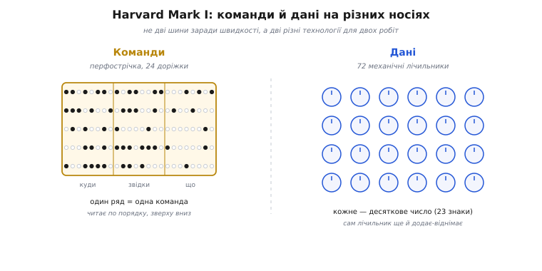

# 📜 Звідки взялася назва «Гарвардська»

Слово «Гарвардська» в назві архітектури наштовхує на думку про кафедру, де мудрі люди сіли й вивели: команди та дані краще тримати нарізно. Насправді все було майже навпаки. Машина, яка дала назву, стояла в Гарварді й справді тримала програму окремо від чисел — але зробила це не з архітектурного розрахунку, а тому, що інакше її просто не вдавалося скласти з наявних деталей. А сама назва «Гарвардська архітектура» з'явилася на тридцять років пізніше, коли тієї машини вже давно не було, і придумали її зовсім інші люди для зовсім іншого заліза. Розберімо цю історію так, як вона була — бо навколо неї наросло чимало міфів, і найпоширеніший з них перевертає причину й наслідок.

## Машина, яку не хотіли будувати електричною

1935 рік, Гарвардський університет. Говард Гатевей Айкен (англ. Howard Hathaway Aiken, 1900–1973), американський фізик, б'ється над докторською про провідність вакуумних ламп. Робота впирається в диференціальні рівняння, які годі розв'язати на папері — лишається чисельне наближення, а це гори одноманітної арифметики, яку хтось мусить крутити руками годинами. Айкенові набридло бути тим «кимось».

> 🔧 **Навіщо це.** Ця сцена — не декорація, а корінь усього. Розділення команд і даних, яке ви бачите в кожному сучасному мікроконтролері, народилося не з теорії, а з дуже приземленої потреби: автоматично прокрутити довгий стовпчик обчислень без людини за кермом. Коли зрозумієте, з якої задачі виросла машина, стане ясно, **чому** її пам'ять улаштована саме так — і чому пізнішу назву легко зрозуміти хибно.

Айкен надихався [аналітичною машиною](topic:hw-arch/what-is-processor) Чарлза Беббіджа (англ. Charles Babbage) — механічним задумом XIX століття, де хід обчислення задавали перфокартами. Ідея розділити «що робити» (картки) і «над чим» (регістри-лічильники) прийшла звідти, з механіки, а не з електроніки. У листопаді 1937-го Айкен приніс проєкт до IBM. Компанія погодилася збудувати й оплатити машину; інженери Клер Лейк (англ. Clair Lake), Френк Гамільтон (англ. Frank Hamilton) і Бенджамін Дарфі (англ. Benjamin Durfee) втілили задум у металі. Складали її на заводі IBM в Ендикотті, а в лютому 1944-го привезли до Гарварда. Офіційно машину подарували університету 7 серпня 1944 року; ще до того, у травні, вона рахувала для Бюро корабельної справи ВМС США (англ. US Navy Bureau of Ships). *(Дати, імена й місця — усталений факт, підтверджений архівом Гарварда та профільними джерелами з історії обчислень.)*

Офіційно машина звалася **ASCC** — Automatic Sequence Controlled Calculator, «автоматичний обчислювач із керуванням послідовністю». Ім'я «Harvard Mark I» пристало пізніше, як зручне скорочення. І тут — перша важлива подробиця, яку часто проминають: **це була не електронна машина, а електромеханічна**. Її обчислення робили не лампи й не транзистори, а звичайні телефонні реле — електромагнітні перемикачі, що клацанням замикають і розмикають струм.

Масштаб вражав. Машина завдовжки близько 16 метрів і заввишки понад 2 метри; коло 765 тисяч деталей, тисячі реле (близько 3500 багатополюсних, із десятками тисяч контактів), і, за оцінкою, сотні кілометрів дротів усередині. Працювала вона **в десятковій системі**, не в двійковій: числа зображали не нулі-одиниці, а положення механічних коліщат. Швидкість — за сьогоднішнім мірилом смішна: близько трьох додавань за секунду, множення — шість секунд, ділення — понад п'ятнадцять. *(Ці числа — усталений факт; невеликі розбіжності між джерелами стосуються способу підрахунку деталей, не порядку величин.)*

Запам'ятаймо цю цифру — три додавання за секунду. Вона підважує найпоширеніший міф, до якого ми ще повернемося.

## Дві пам'яті — але не заради швидкості

Ось як Mark I робив свою справу, і саме тут — джерело назви. Машина мала **дві геть різні системи зберігання**, фізично не схожі одна на одну.

**Числа** (дані) жили в **лічильниках** — механічних коліщатах-регістрах. Їх було 72, і кожен тримав одне десяткове число на 23 знаки зі знаком плюс-мінус. Лічильник умів не лише зберігати, а й додавати чи віднімати сам у собі — тобто пам'ять даних була водночас арифметикою.

**Програму** (команди) машина читала зовсім інакше — з **перфострічки**, паперової стрічки з пробитими дірками. Стрічка мала 24 доріжки завширшки, і кожен її ряд кодував одну команду. Двадцять чотири доріжки ділили на три поля по вісім: перше поле казало, **куди** покласти результат (номер лічильника-приймача), друге — **звідки** взяти число (номер лічильника-джерела), третє — **яку** дію виконати. Машина читала ряд за рядом, виконувала команду за командою, суворо по порядку. *(Формат стрічки — усталений факт; порядок полів — приймач, джерело, дія — за описом машини.)*

*Схема того, що дало назву. Ліворуч — паперова перфострічка: кожен ряд із 24 отворів кодує одну команду трьома полями (куди · звідки · що зробити), і машина читає її ряд за рядом. Праворуч — 72 механічні лічильники, кожен тримає 23-значне десяткове число. Програма фізично живе окремо від даних — не на іншій «шині», а на іншому носії (папір проти коліщат). Саме цей поділ через тридцять років назвуть «Гарвардською архітектурою».*

Зверніть увагу, **чому** так вийшло. Айкен не сидів і не вибирав між «однією пам'яттю» та «двома» — самого поняття єдиної пам'яті-сховища, куди рівноправно кладуть і код, і дані, тоді ще не існувало як інженерної ідеї. Він мав два різні завдання й розв'язав кожне найприроднішим для 1930-х способом. Числа треба крутити в арифметиці — отже, механічні лічильники, що самі й рахують. Послідовність дій треба задати наперед і мати змогу легко переробити — отже, паперова стрічка, яку зручно пробити на клавіатурі й склеїти в кільце, щоб програма крутилася по колу. Перфострічка й лічильники — це просто **дві різні технології для двох різних робіт**, а не свідоме архітектурне розділення заради паралелізму.

Річард Пòсон (англ. Richard Pawson), історик обчислень, у розборі 2022 року в *IEEE Annals of the History of Computing* показує це прямо: єдине сховище на Mark I потребувало б спільного формату «слова» і для команд, і для чисел, ширшого діапазону адрес — і зруйнувало б зручну десяткову арифметику лічильників та стрічку, яку так легко правити на клавіатурі. Іншими словами, поєднати код і дані було б **важче й гірше**, а не простіше. Розділення далося задарма, бо носії й так були різні. *(Це — фахова історіографічна теза Посона, добре обґрунтована; вона виправляє популярний переказ.)*

## Чому це не про швидкість

Тепер — головний міф, який варто розібрати начисто. Сучасну Гарвардську модель хвалять за те, що дві окремі шини дають процесору **водночас** діставати команду й читати дані: доки одна дорога везе наступний наказ, друга везе операнд, і черги на спільному проводі немає. Це чиста правда — але **для мікроконтролерів і сигнальних процесорів**, а не для машини Айкена.

Mark I так не вмів. Він читав команду зі стрічки, виконував її, і аж тоді брав наступний ряд — строго по одному, у сувору чергу. Ніякого «водночас» не було й бути не могло: коли ти робиш три додавання за секунду електромеханічними реле, паралельний доступ до пам'яті нічого не пришвидшує — вузьке горло машини не в шинах, а в самих реле й коліщатах. Розділення на Mark I давало **зручність побудови**, а не швидкість. Приписувати релейній машині 1944 року вигоду, яку розділення дасть лише кремнієвим чипам 1970-х, — це підміна: правильне твердження про пізніше залізо натягують на ранню машину, до якої воно не стосується. *(Посон наголошує саме на цьому; статус — фахово обґрунтоване виправлення поширеної помилки.)*

Ба більше — сам Mark I спершу навіть **не вмів розгалужуватися**. Ніяких умовних переходів, ніяких «якщо — то»: стрічка крутилася лінійно, а щоб зробити розгалуження, машину доводилося зупиняти й вручну перекладати або перемикати стрічки. Обмежену подобу умовного виразу додали аж 1946 року. Тобто це навіть не був повноцінний обчислювач із гнучким керуванням — тим паче дивно вбачати в ньому продуману «архітектуру майбутнього». *(Усталений факт: автоматичне розгалуження з'явилося пізнішими доробками.)*

## Назва, що прийшла на тридцять років пізніше

Коли ж виникло саме словосполучення «Гарвардська архітектура»? Не в 1944-му й близько. Люди Айкена так свою машину не називали — та й не могли: не було ще з чим її протиставляти, бо ідея єдиної пам'яті ще не оформилася.

Протиставлення народилося з іншого документа. 1945 року Джон фон Нейман (угор.-амер. John von Neumann) поширив «Перший начерк звіту про EDVAC» (англ. *First Draft of a Report on the EDVAC*) — текст, що вперше чітко описав машину з **єдиною** пам'яттю, куди команди й дані кладуть як рівноправні числа, і які можна навіть змінювати на льоту. Ідея була колективна (над EDVAC працювала ціла команда, зокрема Джон Мочлі й Преспер Еккерт), але звіт вийшов за одним підписом і рознісся світом як «модель фон Неймана». *(Авторство «Першого начерку» та суперечка про частку фон Неймана — усталено; про колективність винаходу — теж.)*

Аж коли єдина пам'ять стала нормою, знадобилося слово для **протилежного** підходу — коли команди й дані лишаються нарізно. І тут назва пристала до Гарварда ретроспективно, як контраст: он там, у Гарварда, машини Айкена тримали програму окремо — назвімо такий устрій «Гарвардським». Причому спершу так називали навіть не сам Mark I, а пізніші Mark III і Mark IV: їх будували вже **після** перших машин із програмою в пам'яті, і сучасники сприймали окрему пам'ять команд як крок назад, як упертість. Саме до цієї «реакційної» риси й приклеїли ярлик. *(Так це подають Геннессі й Паттерсон у класичному підручнику з архітектури — усталена версія.)*

А хто вимовив словосполучення першим? За розслідуванням Посона — найпевніше інженери **Texas Instruments** на початку 1970-х, коли робили перший однокристальний обчислювач (те, що згодом назвуть мікроконтролером). Посон схиляється до Ґері Буна (англ. Gary Boone) або когось із його команди; 2021 року історик розшукав живого учасника тих робіт, Чарлза Бріксі (англ. Charles Brixey), і той згадав, що термін «Гарвардська архітектура» ходив у команді змалку — але звідки взявся, ніхто вже не пам'ятав. У **друці** ж словосполучення не трапляється аж до 1982 року, і то вже в значенні, яке до машин Айкена не пасувало б. *(Статус: авторська історіографічна реконструкція Посона, спирається на усні свідчення й датований друк; точне «хто перший вимовив» лишається правдоподібним, але не доведеним документально.)*

Ось чому це важливо для розуміння. У мікроконтролера TI команди й дані теж лежали нарізно — але знову **не з архітектурної краси, а з потреби**: програма мусила пережити вимкнення живлення, отже, її клали в ПЗП (флеш-подібну незмінну пам'ять), а мінливі дані — в ОЗП. Дві різні пам'яті виникли з різних вимог до носіїв — точнісінько як колись у Айкена стрічка проти лічильників. А от паралельний доступ, який дає окрема шина ПЗП, приклепана прямо до лічильника команд, — це вже властивість кремнієвого чипа, а не Mark I. Стара назва накрила два різні явища, і в цьому корінь плутанини.

## Міф про пророка, не визнаного за життя

Лишається останній шар — найспокусливіший, і його теж варто назвати чесно. Із ретроспективної назви виріс красивий переказ: буцімто Айкен геніально передбачив кращу архітектуру, ніж фон Нейман, а світ цього не оцінив і аж через десятиліття «повернувся» до Гарвардської ідеї. Betamax проти VHS, тільки в залізі: нібито раніше-й-краще програло пізніше-й-гіршому.

Цю нотку подавали й люди, близькі до Айкена. Грейс Гоппер (англ. Grace Hopper) — одна з перших програмісток Mark I, згодом піонерка програмування — згадувала, що Айкен завжди наполягав: дані й програму слід зберігати незалежно, а коли світ почав тримати програму в одній пам'яті з числами, «це насадило в програми більше помилок, ніж будь-що інше». Колега Айкена Пітер Калінгарт (англ. Peter Calingaert) теж писав, що нинішня мудрість хвалить окреме зберігання команд і даних як «Гарвардську архітектуру». *(Обидві цитати — справжні, наведені Посоном; це свідчення сучасників, забарвлене повагою до вчителя.)*

Але тверезий погляд не тримається. По-перше, у Mark I не було ніякої «архітектури» в сучасному сенсі — не було документа-задуму на кшталт «Першого начерку», з якого можна збудувати нову машину; був один конкретний виріб, зроблений під одну задачу засобами свого часу. По-друге, побоювання Айкена щодо мінливості програми не справдилося: саме змінюваний код у спільній пам'яті вможливив завантажувачі, операційні системи, компілятори — усе те, без чого сучасних обчислень нема. Тримати команди у незмінному сховищі, як Mark I, з появою операційних систем виявилося б просто непрацездатним. Посон формулює це так: Айкена справедливо шанують як піонера автоматичних обчислень і засновника першої повноцінної аспірантури з того, що ми звемо інформатикою, — але «пророка розділення, не визнаного за життя» з нього робити не варто, бо його осторога не була слушною навіть тоді. *(Це виважена фахова оцінка, а не применшення заслуг Айкена; статус — обґрунтована історіографічна теза.)*

## Що з цього лишається

Отже, історія назви коротко: релейний Гарвардський Mark I справді тримав програму на перфострічці окремо від чисел у механічних лічильниках — це усталений факт, і звідси пішов ярлик. Але сам поділ був **природним побічним наслідком** того, що в 1930-х команди й числа зручно зберігати різними технологіями, а не свідомим вибором заради швидкості: машина була електромеханічна, робила три додавання за секунду й спершу навіть не вміла розгалужуватися, тож паралельний доступ їй нічого не давав. Саме словосполучення «Гарвардська архітектура» народилося аж у 1970-х у інженерів мікрокристалів, ретроспективно — як контраст до єдиної пам'яті фон Неймана, — і в друці вигулькнуло лише 1982 року. А поширений переказ про Айкена-провидця, чию ідею світ недооцінив, — це вже міф, що плутає причину з наслідком.

Практичний висновок для того, хто читає це, тримаючи в руках мікроконтролер: коли ви бачите код у флеші й дані в RAM за різними адресами, ви дивитеся не на втілення давнього геніального задуму, а на те саме, що й у Айкена, — на **дві різні пам'яті, покликані до життя різними вимогами**, яким пізніше дали спільне гучне ім'я. Розуміти це корисно бодай тому, що вбереже від хибної думки, ніби «Гарвардська» завжди означає швидше: означає лише «команди й дані нарізно», а що з цього поділу вийде — зручність, швидкість чи просто спадок історії — залежить уже від конкретного заліза.
