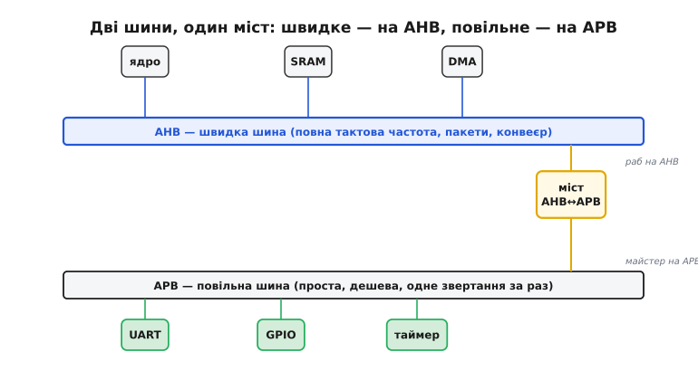
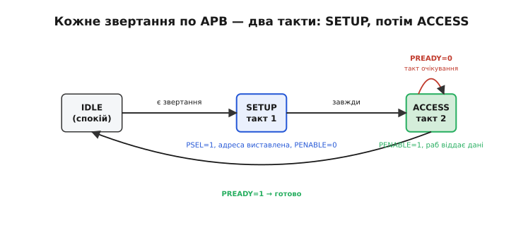
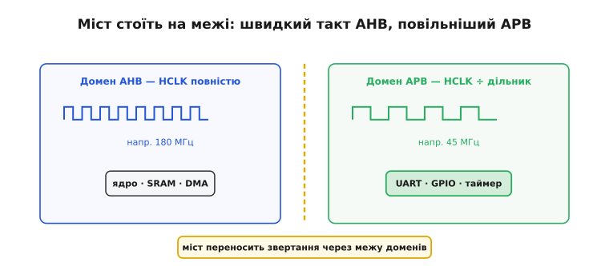

# Шинна ієрархія AHB/APB у Cortex-M

Уявімо, що всередині мікроконтролера все — і ядро, і пам'ять, і кнопка з UART'ом — висить на одній спільній шині. Ядро на 180 мегагерцах хоче за такт дістати слово з пам'яті. А поряд на тій самій шині сидить UART, чия логіка не встигає відповісти швидше, ніж за десяток тактів. Що станеться зі спільною шиною? Її темп задаватиме **найповільніший** учасник. Швидка пам'ять не допоможе, бо шина мусить дочекатися, поки UART договорить, перш ніж пустити наступне звертання. Виходить абсурд: ми поставили дороге швидке ядро, а працює воно у ритмі найтупішої периферії.

Саме з цього конфлікту й народилася шинна **ієрархія**. Замість однієї шини на всіх у мікроконтролерах на ядрах Cortex-M будують **дві**: одну швидку — для тих, кому потрібна вся смуга, і одну повільну — для дрібної периферії, якій вистачить малого. З'єднує їх спеціальний вузол — **міст**. Ця пара шин зветься за стандартом ARM: швидка — **AHB** (англ. *Advanced High-performance Bus* — вдосконалена високопродуктивна шина), повільна — **APB** (англ. *Advanced Peripheral Bus* — вдосконалена периферійна шина).


*Дві шини, з'єднані мостом. Угорі — **AHB**: на ній сидять ті, кому потрібна повна смуга (ядро, пам'ять, DMA), і вона крутиться на повній тактовій частоті пакетами. Унизу — **APB**: проста, повільна, для дрібної периферії, де швидкість ні до чого. **Міст** — раб на AHB (звертання приходить до нього згори) і майстер на APB (він сам веде звертання внизу). Так повільний UART уже не гальмує пам'ять: він в іншому «дворі».*

## Чому саме дві, а не одна швидка

Може виникнути думка: якщо швидка шина краща, зробімо всю систему на AHB — і периферію туди ж. Технічно можна. Але це дорого відразу з двох боків, і саме розуміння цієї ціни пояснює, навіщо взагалі потрібен поділ.

По-перше, **швидка шина складна**. AHB, щоб бути швидкою, робить кілька хитрощів одночасно: розбиває кожне звертання на дві фази — виставлення адреси й передавання даних — і дозволяє їм **накладатися** в часі (поки йдуть дані одного звертання, уже виставляється адреса наступного, як [конвеєр на ядрі](root:hw-arch/pipeline)); підтримує **пакети** (одне рукостискання — багато слів поспіль); терпить кількох [майстрів з арбітражем](root:hw-arch/bus-arbitration). Уся ця машинерія коштує вентилів. Причепити її до кожного GPIO-порту — це поставити гоночний двигун на дитячий самокат: вузол UART чи миготіння світлодіодом не потребує ні пакетів, ні конвеєра, а логіку інтерфейсу до шини все одно довелося б робити повну й дорогу.

По-друге, і це важливіше, **швидка шина крихка до повільних учасників**. Конвеєр і пакети дають виграш лише тоді, коли всі на шині відповідають швидко й передбачувано. Один повільний раб, що на кожне звертання просить кілька тактів очікування, ламає конвеєр: наступна фаза не може початися, поки поточна не завершилась, і красива швидка шина глохне на кожному звертанні до нього. Тобто повільна периферія не просто «не користується» швидкістю AHB — вона **активно її псує**, коли сидить на тій самій шині.

Звідси й розв'язок: винести повільних у **окремий двір** — на свою просту шину APB — і поставити на межі **міст**, який спілкується вгору по-швидкому (мовою AHB), а вниз — по-повільному (мовою APB). Ядро й [DMA](root:hw-arch/dma-controller) на AHB більше не спотикаються об UART; а сам UART отримав рівно ту шину, якої заслуговує, — дешеву й просту. Виграш обопільний: швидкі лишаються швидкими, дешеві — дешевими.

> 🔧 **Навіщо це.** Коли в даташиті бачите, що DMA «бачить» пам'ять і кілька периферій напряму, а до купи інших ходить «через міст», — це і є ця ієрархія. Практичний наслідок: перекидання великого блоку між двома ділянками SRAM (обидві на AHB) летить на повній швидкості, а сплеск дрібних звертань до регістрів UART чи GPIO (за мостом на APB) коштує помітно більше тактів на кожне слово. Тому гарячий шлях у прошивці намагаються тримати на AHB-стороні, а рідкісне налаштування периферії лишають за мостом — там повільно, зате й звертань мало.

## Мова повільної шини: два такти на звертання

Щоб зрозуміти, чому APB така дешева, погляньмо, як вона працює. Її протокол свідомо зроблено найпростішим із можливих: жодних пакетів, жодного накладання фаз, жодного арбітражу (майстер на APB завжди один — це сам міст). Кожне звертання — читання чи запис одного слова — розкладається рівно на **два такти**, через маленький автомат станів.


*Життя одного звертання по APB. **IDLE** — спокій, нічого не діється. Приходить звертання — крок у **SETUP** (перший такт): міст виставляє адресу, дані й піднімає `PSEL` потрібному рабу, але тримає `PENABLE=0`. Наступний такт — **ACCESS**: піднімається `PENABLE`, і раб відповідає. Якщо раб готовий (`PREADY=1`) — звертання завершилось, назад у IDLE. Якщо повільний (`PREADY=0`) — автомат стоїть в ACCESS зайві такти очікування (петля), поки раб не впорається. Мінімум — два такти; повільний раб додає скільки треба.*

Логіка тут прозора до останнього дроту. Перший такт (**SETUP**) — це «постукати й назватися»: міст кладе на шину адресу регістра, дані (якщо це запис) і сигналом вибору `PSEL` (англ. *peripheral select* — вибір периферії) вказує, до **кого** саме звертається. Але поки що нічого не відбувається — `PENABLE` опущено, це лише підготовка. Другий такт (**ACCESS**) — це «а тепер відповідай»: піднімається `PENABLE` (англ. *peripheral enable* — дозвіл дії), і саме в цю мить раб виконує звертання — читає дані з шини або кладе на неї відповідь. Раб підтверджує готовність сигналом `PREADY` (англ. *peripheral ready* — раб готовий): підняв — звертання завершено.

А що, коли раб повільний і за один такт не встигає? Тоді він просто тримає `PREADY=0`, і міст **чекає** — автомат стоїть в ACCESS, вставляючи такти очікування (англ. *wait states*), поки раб не підніме `PREADY`. Уся хитрість повільної шини на цьому й закінчується: два такти в найкращому разі, більше — за потреби раба. Порівняйте це з машинерією AHB — і стане очевидно, чому одну шину роблять простою й дешевою, а другу складною й швидкою: вони розв'язують різні задачі.

Ось як цей поділ дає про себе знати в коді. Дрібне звертання до регістра периферії за мостом виглядає буденно, але кожне з них — це ті самі два (чи більше) такти APB:

```c
#include <stdint.h>

/* Регістр даних UART сидить за мостом, у домені APB */
#define UART_DR  (*(volatile uint32_t *)0x40011004)

/* Кожен запис — це повне звертання по APB: SETUP + ACCESS (мінімум 2 такти APB),
   а часто ще й такти очікування, поки повільний UART підтвердить PREADY. */
void uart_send_byte(uint8_t b) {
    UART_DR = b;          /* одне звертання через міст на повільну шину */
}

/* Тому «висипати» рядок побайтово в тісному циклі — марнотратно:
   кожен байт окремо платить за перехід через міст. */
void uart_send_str(const char *s) {
    while (*s) {
        uart_send_byte((uint8_t)*s++);   /* звертання за мостом на кожен символ */
    }
}
```

Саме тому потоки даних крізь повільну периферію рано чи пізно віддають [DMA](root:hw-arch/dma-controller): він знімає з ядра ці нескінченні дрібні звертання за міст, а ядро тим часом рахує на швидкій стороні, не застрягаючи на кожному байті.

## Міст на межі двох тактів

Найтонше в цій конструкції те, що дві шини живуть не лише на різних *швидкостях*, а часто й у різних **тактових доменах** — тобто цокають від різних (чи по-різному поділених) джерел такту. AHB зазвичай іде на повній системній частоті, а APB — за **дільником** (англ. *prescaler* — переддільник) від неї: удвічі, вчетверо повільніше. І тут міст показує свою другу роль: він не просто перекладає протокол AHB на APB — він **переносить звертання через межу доменів**, узгоджуючи два різні темпи.


*Дві половини кристала цокають по-різному. Ліворуч домен AHB б'ється на повній системній частоті — там ядро, SRAM, DMA. Праворуч домен APB цокає рідше, за дільником, — там дрібна периферія, якій швидкий такт ні до чого (а часто й шкідливий: менша частота — менше [спожитої потужності](root:hw-arch/clock-frequency)). Пунктирна лінія — межа доменів; на ній стоїть **міст**, єдиний, хто говорить обома темпами й переносить кожне звертання з одного боку на інший.*

Навіщо взагалі уповільнювати APB окремим дільником, коли можна було б і її гнати на повній частоті? Бо це задарма економить енергію й спрощує розведення. Периферія на APB здебільшого не має від чого поспішати: таймер, що відлічує мілісекунди, чи GPIO, що раз на секунду смикає ніжку, чудово живуть і на чверті частоти ядра. А що повільніший такт домену, то менше він спалює [динамічної потужності](root:hw-arch/clock-frequency) — тож ганяти APB на повній швидкості означало б палити струм ні за що. Тому в реальних чипах APB навмисно тримають на нижчій частоті, а критичне швидке — ядро, пам'ять, DMA — лишають на повній HCLK за мостом.

Розв'язати два домени такту не безкоштовно: щоб надійно передати сигнал з домену в домен, на межі ставлять синхронізатор, і це додає кілька тактів затримки на кожне звертання за міст. Це та сама фізична межа, що змушує будь-який вузол на стику асинхронних тактів [синхронізувати сигнали ланцюжком тригерів](root:hw-arch/bus-arbitration) — інакше на межі виникає метастабільність. Тож «повільність» походу за міст — це не лише нижча частота APB, а ще й неминучий податок на перетин межі доменів.

## Як це виглядає в живому чипі

Абстракція стане конкретною на прикладі поширеної родини мікроконтролерів STM32 (на ядрах Cortex-M від STMicroelectronics). Там AHB-домен цокає на повній частоті — скажімо, до 180 МГц, — а периферія розкидана вже по **двох** повільніших шинах APB: одну звуть **APB1** (нижча, скажімо до 45 МГц), другу — **APB2** (вища, до 90 МГц). Розподіл простий за логікою: те, що потребує швидшого доступу (АЦП, перший таймер, деякі порти), вішають на швидшу APB2; повільніше й терплячіше (UART'и, I²C, звичайні таймери) — на APB1.

Тактову частоту кожного домену розробник задає **дільниками** в регістрах керування тактуванням — і саме тут абстракція шинної ієрархії перетворюється на конкретні числа в коді:

```c
#include <stdint.h>

/* Регістр конфігурації тактів (адреси/поля умовні, з даташита STM32-класу) */
#define RCC_CFGR  (*(volatile uint32_t *)0x40023808)

/* Дільники доменів: AHB на повну, APB1 ділимо на 4, APB2 — на 2 */
#define HPRE_DIV1   (0u  << 4)    /* AHB = SYSCLK (повна частота ядра й пам'яті) */
#define PPRE1_DIV4  (5u  << 10)   /* APB1 = HCLK / 4  — повільна периферія */
#define PPRE2_DIV2  (4u  << 13)   /* APB2 = HCLK / 2  — швидша периферія */

void clocks_setup(void) {
    /* Ядро, SRAM і DMA — на повній HCLK; дві APB навмисно повільніші,
       щоб не палити струм там, де швидкість периферії ні до чого. */
    RCC_CFGR = HPRE_DIV1 | PPRE1_DIV4 | PPRE2_DIV2;
}
```

Тут ховається знаменита пастка, через яку спотикаються майже всі новачки на STM32, — і вона прямо випливає з шинної ієрархії. Коли дільник APB **не дорівнює одиниці** (тобто шину сповільнено), апаратура автоматично **подвоює** такт, що йде на *таймери* цього домену. Тобто якщо APB1 іде на 45 МГц (поділено), то таймери на ній тактуються від 90 МГц, а не 45. Зроблено це навмисно: інакше сповільнення периферійної шини заразом псувало б точність таймерів, а так вони зберігають роздільність. Наслідок для прошивки різкий: людина рахує період таймера з частоти шини APB1, а виходить удвічі коротший інтервал, ніж очікувалося, — бо реальний такт таймера вдвічі вищий за такт його шини. Хто знає походження — множить на два й не дивується; хто ні — годинами шукає «плаваючий баг», якого немає.

## Що з цього тримати в голові

Одна спільна шина програє тому, що змушена бігти в темпі найповільнішого учасника, — тож у Cortex-M систему ділять на дві шини: швидку **AHB** для тих, кому потрібна вся смуга (ядро, пам'ять, DMA), і повільну **APB** для дрібної периферії. Між ними стоїть **міст** — раб на боці AHB, майстер на боці APB, — і він же переносить звертання через межу двох тактових доменів, бо APB зазвичай цокає повільніше за дільником, аби не палити струм там, де швидкість зайва. Повільна шина навмисно проста: кожне звертання — це два такти через автомат SETUP → ACCESS із сигналами `PSEL`/`PENABLE`/`PREADY`, а повільний раб додає такти очікування. Практичний висновок один і чіткий: **звертання за міст дороге** — гарячі потоки тримайте на AHB-стороні або віддавайте DMA, а рідкісне налаштування периферії спокійно лишайте за мостом на APB, де повільно, зате дешево. І пам'ятайте про тактову арифметику доменів: частота шини APB і частота таймера на ній — не завжди те саме число.

Уся ця ієрархія — не історична випадковість, а стандарт ARM під назвою [AMBA, що зростав крок за кроком](root:hw-arch/ahb-apb-bus/hist-amba.md) від першої периферійної шини 1996 року до сучасних високопродуктивних інтерфейсів.
