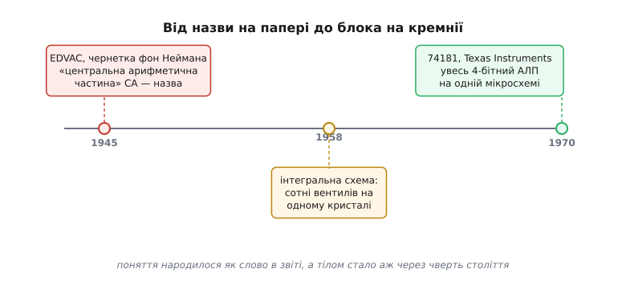

# 📜 Від слова в звіті до блока на кремнії

Поняття «арифметико-логічний пристрій» прожило дивне життя. Спершу воно з'явилося як **назва** — кілька літер у машинописному звіті 1945 року, коли жодної машини, здатної цю назву носити, ще не існувало. І аж через двадцять п'ять років ту саму ідею відлили в **тіло**: цілий арифметичний блок помістився на один шматочок кремнію завбільшки з ніготь. Між назвою й тілом — чверть століття, дві зовсім різні епохи техніки й одна повчальна історія про те, як легко ім'я одного винахідника затирає працю цілого гурту.

Розберімо обидва кінці цієї дуги: як народилося саме поняття «центральна арифметична частина» машини — і як воно вперше стало окремою деталлю, яку можна купити, впаяти й забути про сотні дротів усередині.


*Двадцять п'ять років між ідеєю та кремнієм. Назва народилася як слово в звіті фон Неймана 1945 року, коли машини ще будували на лампах і реле. Тілом поняття стало аж тоді, коли інтегральна схема навчилася вкладати сотні вентилів в один кристал — і 1970 року весь арифметичний блок уперше вмістився в одну мікросхему.*

## Що бентежило до 1945-го: машина без плану поділу

Щоб зрозуміти вагу тієї назви, треба уявити, як виглядав обчислювальний пристрій **до** неї. Найзнаменитіша машина тих років — **ENIAC** (англ. *Electronic Numerical Integrator and Computer*), збудований у Мурській школі електротехніки Пенсильванського університету (англ. *Moore School of Electrical Engineering*) під час війни для розрахунку балістичних таблиць. Це була величезна споруда на майже вісімнадцять тисяч електронних ламп, і рахувала вона справді швидко. Та була в ній засаднича вада, яку інженери відчували щодня.

ENIAC не мав чіткого поділу на «частину, що рахує» і «частину, що керує». Арифметика була **розмазана** по всій машині: додавачі-акумулятори стояли окремими шафами, і щоб машина виконала новий розрахунок, її доводилося **перекомутовувати руками** — перетикати сотні кабелів і виставляти перемикачі. Програма жила не в пам'яті, а у **фізичному з'єднанні дротів**. Змінити задачу означало кілька днів роботи з кабелями. Машина рахувала за секунди те, на що налаштовувалася днями.

Звідси й постало питання, яке бентежило групу Мурської школи: а що, як розкласти машину на **чіткі функціональні органи**, кожен зі своєю роллю, і зробити так, щоб програма зберігалася **всередині** машини нарівні з числами? Тоді зміна задачі — це просто інші числа в пам'яті, а не перетикання кабелів. Ця думка визрівала в розмовах інженерів ENIAC — насамперед **Джона Моклі** (англ. *John Mauchly*) і **Преспера Еккерта** (англ. *J. Presper Eckert*) — ще під час будівництва самого ENIAC, коли його вади вже впадали в очі. Наступну машину задумали одразу правильною й назвали **EDVAC** (англ. *Electronic Discrete Variable Automatic Computer*).

> 🔧 **Навіщо це.** Поділ машини на окремі органи — не academічна забаганка, а те, чим ти користуєшся щодня в будь-якому мікроконтролері. Коли в даташиті процесора ти бачиш окремо «ALU», окремо «register file», окремо «control unit» — це прямий нащадок того першого поділу 1945 року. Уся архітектура, у якій програма лежить у тій самій пам'яті, що й дані, і виконується крок за кроком, дотепер зветься **фоннейманівською** — саме за звітом, про який мова.

## Звіт, написаний у потязі

Улітку 1944 року до проєкту EDVAC долучився **Джон фон Нейман** (угор. *Neumann János Lajos*; нар. 1903 у Будапешті, Австро-Угорщина) — математик світового рівня, що на той час працював над Мангеттенським проєктом у Лос-Аламосі й потребував потужних обчислень для розрахунків вибуху. Він приїхав до Мурської школи як консультант, побачив ENIAC, розпитав Еккерта й Моклі про задум наступної машини — і взявся викласти всю концепцію **формальною мовою логіки**.

Тут варто бути точним щодо ідентичності, бо джерела люблять називати фон Неймана просто «американцем». Він народився в **Будапешті** в єврейській родині, здобув освіту в Угорщині та Німеччині (докторат із математики в Будапешті, габілітація в Берліні), і лише 1930 року переїхав до США, громадянином яких став 1937-го. Тобто до 1945 року за плечима вже був **угорсько-німецький** математичний вишкіл — і саме ця школа строгого формального мислення дала звітові його небувалу ясність. Це **усталений факт**: угорське походження й європейська освіта фон Неймана добре задокументовані.

Писав він цей звіт незвично. Навесні 1945-го фон Нейман курсував потягом між Мурською школою у Філадельфії та Лос-Аламосом у Нью-Мексико — і **писав від руки просто в дорозі**, надсилаючи рукописні нотатки поштою назад до Філадельфії. Там їх передрукувала на машинці й упорядкувала команда проєкту. Так народився документ із сухою назвою **«First Draft of a Report on the EDVAC»** — «Перша чернетка звіту про EDVAC».

Дати варто закріпити точно, бо вони згодом виявляться доленосними. **24 копії** чернетки роздали учасникам проєкту **25 червня 1945 року**; на самому машинописі стоїть дата **30 червня 1945**. Тобто документ пішов у люди наприкінці червня 1945-го — це **усталено** й підтверджено кількома незалежними джерелами.

## Народження назви: шість органів і «центральна арифметична частина»

Головне для нас — що саме фон Нейман зробив у тому звіті з арифметикою. Він **розклав** усю обчислювальну машину на шість функціональних органів, і кожному дав ім'я та літеру:

```
CA  — центральна арифметична частина  (central arithmetical part)
CC  — центральне керування            (central control)
M   — пам'ять                         (memory)
I   — вхід                            (input)
O   — вихід                           (output)
R   — зовнішній носій                 (recording medium: перфокарти, стрічка)
```

Ось де вперше в історії арифметика машини дістала **власну назву й власне місце** в структурі — **центральна арифметична частина, CA**. Це прямий предок того, що ми сьогодні звемо АЛП. Фон Нейман міркував про неї так: раз є чотири основні дії арифметики — додавання, віднімання, множення, ділення (`+ − × ÷`), — то розумно, щоб машина мала **спеціалізовані органи саме для цих дій**. Складніші функції — логарифми, тригонометрію, квадратний корінь — він пропонував брати з таблиць та інтерполювати, тобто **зводити** до тих самих чотирьох дій. Уся арифметика машини стягувалася до невеликого ядра базових операцій — точнісінько та сама думка, що й дотепер лежить в основі будь-якого АЛП.

Аналогія, якою мислив фон Нейман, була **біологічна**. Він щойно прочитав працю **Воррена Мак-Каллока** (англ. *Warren McCulloch*) і **Волтера Піттса** (англ. *Walter Pitts*) про формальну модель нейрона — і в звіті описував органи машини як мережу ідеалізованих **нейронів**, що спрацьовують за сигналом. Це була гарна й смілива аналогія: вона підказувала, що складну поведінку можна скласти з безлічі однакових простих перемикачів. Та вона й **ламалася** — реальні лампи й реле поводяться інакше за нейрони, а мозок не працює двійковими розрядами. Проте сама ідея — «складна функція з простих однотипних елементів» — виявилася напрочуд плідною і згодом справдилася буквально: сучасний АЛП і є мережею мільярдів однакових перемикачів-транзисторів.

Важливо тримати міру: фон Нейман **не будував** машини й не паяв ламп. Його внесок — не залізо, а **формальний опис**: він узяв інженерні задуми групи й виклав їх мовою логіки так ясно, що документ став **кресленням цілої епохи**. Розрізняти тут ідею, теорію й реалізацію конче потрібно — і саме на цьому розрізненні спіткнулася вся подальша історія з авторством.

## Суперечка про авторство: одне ім'я замість гурту

Тепер найгостріша частина, яку не можна оминути, бо вона про справедливість. На чернетці стояло **одне-єдине ім'я — фон Неймана**. Ні Еккерта, ні Моклі, ні решти інженерів Мурської школи в авторах не було. А тим часом:

- **робочу машину ENIAC**, з якої все виросло, спроєктували й збудували саме **Еккерт і Моклі** — вони були її головними інженерами;
- **ідея збереженої програми** та поділу на органи, за свідченнями учасників, **визрівала в спільних нарадах** групи ще до того, як фон Нейман долучився;
- значну частину звіту самі інженери вважали «**лише перекладом** обговорених концепцій на мову формальної логіки», а не новим винаходом.

Що ж сталося? **Герман Голдстайн** (англ. *Herman Goldstine*), офіцер зв'язку проєкту, розіслав чернетку широким колом — зі згадкою **тільки фон Неймана** на титулі. Документ був блискучий, ім'я фон Неймана вже гриміло у світі науки — і кредит за всю архітектуру **осів на ньому одному**. Відтоді й дотепер її звуть «**фоннейманівською**», хоча чесніша назва була б «еккерт-моклі-фоннейманівська» або просто «архітектура Мурської школи».

Це — **не імперський міф**, а добре задокументована історія про те, як **колективний винахід** буває несправедливо приписано одній гучній постаті. Тут немає лиходія: фон Нейман справді зробив велику річ — виклад був його. Але робоче залізо й значна частка самих ідей належали інженерам, чиїх імен на папері не виявилося. Розрізняти «хто ясно **сформулював**» і «хто **придумав і збудував**» — саме та дисципліна, якої вимагає чесна історія техніки.

І кара наздогнала швидко, причому в найпрозаїчнішій — патентній — площині. Оскільки чернетку **розіслали публічно** наприкінці червня 1945-го, це згодом визнали **оприлюдненням винаходу**. А оприлюднення сталося **більш ніж за рік** до того, як Еккерт і Моклі подали патентну заявку на EDVAC. За патентним правом США це означало, що заявка **запізнилася**: винахід уже став суспільним надбанням. Патент на архітектуру збереженої програми зробився **непридатним до захисту**. Іронія повна: розголос, що приніс фон Нейманові всесвітню славу, водночас **позбавив** справжніх будівничих машини їхнього патенту. Це теж **усталений факт** судової та історичної практики навколо EDVAC.

## Двадцять п'ять років по тому: коли назва шукала тіло

Отже, до 1945 року поняття вже мало **ім'я**. А от **тіла** — компактного, окремого, зробленого-раз-і-назавжди арифметичного блока — не було ще довго. І причина суто фізична.

Машини кінця 1940-х і 1950-х будували на **електронних лампах**, потім на **окремих транзисторах**. Кожен вентиль — це окрема деталь, яку треба спаяти дротами із сусідніми. Арифметичний блок навіть на кілька розрядів — це **сотні** вентилів, а отже сотні деталей і тисячі паяних з'єднань, цілі шафи заліза. Такий «АЛП» неможливо було зробити окремою маленькою деталлю — він завжди був **розкиданий** по монтажних платах, як колись у ENIAC, тільки менш безнадійно. Назва є, а взяти її в руку не можна.

Усе змінила [інтегральна схема](root:hw-components/integrated-circuit) — винахід кінця 1950-х, що навчився вирощувати багато транзисторів і з'єднань **разом на одному кристалі кремнію**. Раптом «сотні вентилів» перестали означати «сотні деталей»: їх можна було вкласти в один корпус. І що далі, то більше вентилів вміщалося на кристал — це і є славнозвісне подвоєння, яке згодом назвуть [законом Мура](root:hw-components/moore-law). Настав момент, коли на **один** кристал уже вміщувався **цілий арифметичний блок**. Назва нарешті могла дістати тіло.

> 🔧 **Навіщо це.** Ця пара — «ідея окремо, реалізація окремо» — універсальна в інженерії. Функцію можна чітко означити задовго до того, як з'явиться спосіб втілити її дешево й компактно. АЛП чекав на інтегральну схему; так само багато сучасних задач (скажімо, апаратне шифрування чи нейромережеві прискорювачі) спершу були лише кресленням, а тілом ставали, коли підростала технологія кристала. Розуміння цього розриву між «що треба» і «чим це зробити» — половина інженерного чуття.

## 74181: увесь АЛП в одній мікросхемі

І ось у **лютому 1970 року** фірма **Texas Instruments** випустила мікросхему з непоказним номером **74181** — і це був **перший повний арифметико-логічний пристрій на одному кристалі**. Уперше ту саму «центральну арифметичну частину», яку фон Нейман назвав чвертю століття тому, можна було **купити однією деталлю**, впаяти в плату й отримати готовий блок, що рахує.

Що вміла ця мікросхема? Вона брала два **4-бітні** операнди й видавала 4-бітний результат, а керувалася кодом операції, який вибирав дію. І дій було багато — **шістнадцять арифметичних** (додавання, віднімання, інкремент, декремент, порівняння тощо) й **шістнадцять логічних** (усі можливі побітові функції двох входів: «і», «або», «виключне або», інверсія та інші). Усе це — на кристалі складністю приблизно **75 вентилів**, у звичайному корпусі TTL-логіки (англ. *transistor-transistor logic* — родина мікросхем на біполярних транзисторах, що панувала в ту епоху).

Чому саме **4 біти**, коли комп'ютери оперували 8, 16, 32? Бо 74181 задумали як **скибку** (англ. *bit slice*) — будівельний блок, який **зчіплюють** у ланцюг для будь-якої ширини слова. Треба 16-бітний АЛП — став чотири 74181 поруч і з'єднай їхні переноси. Треба 32-бітний — вісім штук. Щоб перенос не повз повільно від скибки до скибки, до них додавали окрему мікросхему-компаньйона **74182** — генератор прискореного переносу (англ. *carry lookahead generator*), що обчислював переноси для всієї групи **наперед і паралельно**, а не чекав, поки одиниця пробіжить усі розряди. П'ять 74182 на шістнадцять 74181 давали навіть 64-бітний АЛП. Модульність повна: одна деталь — одна скибка, скільки треба — стільки й став.

### Дивна на вигляд, але логічна всередині

Цікава деталь, яку помітить кожен, хто гляне в даташит 74181: серед її операцій є **геть химерні**. Поряд зі звичними «A плюс B» чи «A і B» там трапляється, наприклад, «**A плюс (A і не-B)**» — дія, якою у здоровому глузді ніхто ніколи не скористається. Звідки такий звіринець?

Причина глибша, ніж примха розробників, і вона повчальна. Інженери TI не складали список **корисних** операцій — вони пішли іншим шляхом. Арифметична частина 74181 влаштована як «**A плюс f(A,B) плюс перенос**», де `f(A,B)` — **будь-яка** з усіх шістнадцяти побітових функцій двох входів. Тобто вони взяли повний набір логічних функцій (усі 16, які взагалі бувають) і **механічно** підставили кожну в один і той самий арифметичний вузол. Більшість комбінацій дали корисні дії (додати, відняти, порівняти), а деякі — те саме безглузде «A плюс (A і не-B)». Ці химери — просто **побічний продукт** того, що схему оптимізували під **прискорений перенос**, а не під людський список команд. Регулярність кремнію переважила охайність таблиці: простіше й швидше було випустити всі шістнадцять функцій «як є», ніж вибирати з них гарні.

> 🔧 **Навіщо це.** Тут видно засадничу різницю між тим, як думає **людина** й як думає **кремній**. Людині зручний короткий список осмислених команд. Кремнієві зручна **регулярність** — однакові структури, що добре лягають на кристал і швидко рахуються. 74181 обрала бік кремнію, і тому має «зайві» операції. Це та сама логіка, за якою й сьогодні набори команд процесорів мають дивні на вигляд інструкції: вони випадають не з корисності, а з того, що так **лягає залізо**.

### Міст між двома епохами

Найважливіше в 74181 — її **місце в історії**. Вона стала **мостом** між двома світами процесорів:

- **позаду** — процесори 1960-х, зібрані з **окремих логічних вентилів**, шафами й платами, як прямі нащадки ENIAC;
- **попереду** — однокристальні **мікропроцесори** 1970-х, де на одному кристалі вміститься вже **весь** процесор, а не лише його арифметичне ядро.

74181 — рівно посередині: арифметичне ядро вже **на одному кристалі**, але керування, регістри й решта — ще окремі мікросхеми поруч. Це проміжна сходинка, і саме тому вона так довго й широко жила.

А жила вона справді довго, живлячи цілі покоління машин. Першою комерційною системою на 74181 став **Data General Nova 1200** того ж 1970 року — 16-бітний комп'ютер на чотирьох таких скибках. Далі — знаменитий міні-комп'ютер **PDP-11** фірми DEC (процесорний модуль KD11-A на чотирьох 74181 для 16-бітних дій), робоча станція **Xerox Alto** (та сама, де вперше з'явився графічний інтерфейс із вікнами й мишею), і навіть могутній **супермінікомп'ютер VAX-11/780** — машина, що стала еталоном продуктивності на роки. Одна невеличка мікросхема виявилася арифметичним серцем цілого зоопарку історично важливих комп'ютерів. Усе це — **усталені, добре задокументовані** факти комп'ютерної історії.

## Що каже ця дуга

Складімо обидва кінці разом — і виходить рідкісно чиста ілюстрація того, як живуть інженерні поняття.

**Спершу — ім'я.** 1945 року фон Нейман у звіті, написаному від руки в потязі, назвав арифметичне серце машини «центральною арифметичною частиною» й дав йому чітке місце в шістці органів. Поняття народилося як **слово** — коли машини, гідної цього слова, ще не було, а кредит за ідею несправедливо осів на одному імені замість гурту інженерів Мурської школи.

**Потім — тіло.** 1970 року, коли інтегральна схема доросла, Texas Instruments випустила 74181 — і те саме поняття вперше стало **окремою деталлю**, яку тримаєш у руці. Дивна на вигляд, оптимізована під кремній, а не під людський список команд, вона проклала міст від процесорів-на-вентилях до однокристальних мікропроцесорів і живила комп'ютери на десятиліття вперед.

Двадцять п'ять років між назвою й тілом — і за цей проміжок поняття не змінилося ні на йоту в **суті**: два операнди, набір операцій, вибір однієї за кодом. Змінилося тільки те, з **чого** його зроблено — від шаф на лампах до нігтя кремнію. Сама ж ідея, названа в потязі 1945-го, працює точнісінько так само в кожному процесорі, що рахує зараз.
