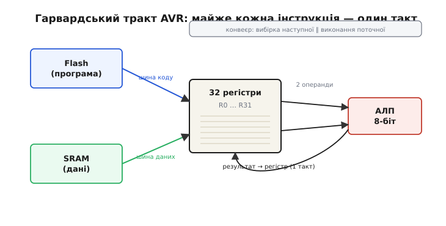
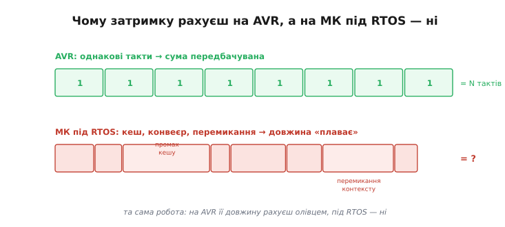

# AVR-клас

AVR-клас — це 8-бітні мікроконтролери з RISC-ядром (англ. *Reduced Instruction Set Computer* — «обчислювач зі скороченим набором команд»), які стали еталоном прозорого, передбачуваного заліза. Сама назва «AVR» офіційно не розшифровується: Atmel заявляла, що це не акронім, а популярне «Alf + Vegard + RISC» (за іменами авторів) — пізніший backronym, вигаданий для краси. Хоч би звідки взялися три літери, суть класу проста: між вашим кодом і виконанням немає зайвих шарів. Жодного кешу, жодного планувальника, жодного помножувача частоти, який крутить ядро невидимо для програми. Те, що написано в інструкції, — рівно те, що робить кремній, і рівно за стільки тактів, скільки сказано в даташиті.

Народилося це ядро в середині 1990-х: двоє норвезьких студентів спроєктували 8-бітник з чистого аркуша одразу під компілятор C і під принцип «одна інструкція — один такт». Як студентський задум перетворився на серце Arduino — у вставці [історія AVR](topic:hw-arch/avr/hist-avr.md).

## Чому такт можна порахувати

Архітектурне рішення, що зробило AVR придатним для навчання й точного часування, — **модифікована гарвардська модель** (англ. *Harvard architecture* — за гарвардським комп'ютером Mark I, де програма й дані лежали на різних носіях) з однотактними інструкціями. Програма й дані в AVR мають **окремі шини**: поки ядро виконує поточну команду, наступну вже вибирає з пам'яті програм паралельним каналом. Цей короткий, двоступеневий конвеєр і дає головну рису: більшість команд завершуються за **один такт**.

Декремент регістра — один такт. Умовний стрибок — два такти, якщо стрибок справді відбувається, інакше один. Множень і ділень для довгих чисел це не стосується, але для арифметики й логіки в межах 8 біт правило тримається чесно. Порівняйте з [конвеєром і кешем ESP32](topic:hw-arch/esp32-architecture): там та сама операція може зайняти від двох до двадцяти тактів залежно від промаху кешу, стану конвеєра й активності планувальника [FreeRTOS](topic:sf-devices/freertos). Це не вада ESP32 — це ціна потужності. Але для задач, де треба точно знати, скільки часу займе цикл, ціна висока.



*Тракт 8-бітного AVR зсередини: окремі шини коду й даних сходяться на 32-регістровому файлі та АЛП, а короткий конвеєр готує наступну команду, поки виконується поточна — тому майже кожна інструкція завершується за один такт.*

Із цього однотактного детермінізму виростає вся «простота, яку можна порахувати». 32 робочих регістри загального призначення (замість традиційних для старих 8-бітників чотирьох-восьми) дають компілятору простір тримати змінні прямо в регістрах, без постійних рейсів до пам'яті. Тому C на AVR компілюється в щільний, швидкий код, а такти лишаються видимими наскрізь.

> 🔧 **Навіщо це.** Коли треба згенерувати сигнал із точним таймінгом — скажімо, імітувати нестандартний протокол bit-bang'ом на голих ніжках, — на AVR-класі це робиться підрахунком тактів у голові. На ESP32 [під RTOS](topic:sf-devices/freertos) той самий трюк практично неможливий без апаратного таймера або спеціального блока (як-от RMT): планувальник може перемкнути контекст будь-якої миті й зруйнувати ваш ручний рахунок.

## Worked-приклад: скільки тактів у затримці

Задача: оцінити програмну затримку на 8-бітнику @ 16 МГц і зрозуміти, як підібрати її точно.

```c
// Цикл затримки: лічильник крутиться, поки не дійде до нуля.
// На кожній ітерації: DEC (1 такт) + BRNE (2 такти, якщо перехід відбувся).
// Один NOP додає рівно 1 такт — ним «добирають» час до круглого числа.

void delay_loop(void) {
    uint8_t n = 200;          // LDI: 1 такт (одноразово)
    while (n--) {             // DEC + BRNE = 3 такти на ітерацію
        __asm__("nop");       // + NOP = +1 такт → 4 такти/ітерацію
    }
}

// Покроково:
//   тактів на ітерацію ≈ 4   (NOP + DEC + BRNE)
//   ітерацій           = 200
//   разом              = 4 × 200 = 800 тактів
//
//   період такту = 1 / 16 000 000 Гц = 62.5 нс
//   затримка     = 800 × 62.5 нс = 50 мкс
//
// Потрібно рівно 100 мкс? Це 100 мкс × 16 МГц = 1600 тактів.
// Подвоївши N до 400 (uint16_t), дістаємо 4 × 400 = 1600 тактів = 100 мкс.
```

Головне тут не конкретне число, а сам факт: затримку **рахуєш заздалегідь**, бо кожна інструкція коштує відому кількість тактів. На ESP32 під RTOS така арифметика не діє — між двома вашими рядками планувальник може вклинити чужу задачу. Саме тому програмні протоколи на голих ніжках (однопровідні давачі, нестандартний послідовний обмін, керування адресними світлодіодами) на AVR пишуться напряму циклом із порахованими тактами, а на потужнішому МК потребують апаратного блока, який витримає таймінг замість процесора.



*Та сама робота двома смугами: на AVR кожна інструкція — рівний блок фіксованої довжини, і сума передбачувана до такту; на потужному МК під RTOS ту саму роботу рвуть промахи кешу, конвеєр і перемикання контексту, тож її довжина «плаває».*

## Прозора периферія

Периферія AVR-класу влаштована так само відверто, як ядро. GPIO-ніжки керуються трьома [регістрами DDRx, PORTx, PINx](topic:sf-devices/gpio-registers) — без матриці перемикань, без мультиплексора (на ESP32, навпаки, GPIO Matrix дозволяє перенаправити будь-який сигнал на будь-яку ніжку). [Таймери](topic:hw-arch/timer-counter) — 8- і 16-бітні, тоді як ESP32 має 64-бітні. [АЦП](topic:hw-analog/adc) простий і лінійний, на відміну від нелінійного перетворювача ESP32. Поріг входу низький: хочеш переривання на зміну рівня на ніжці — пишеш кілька бітів у два регістри, і все працює.

Ціна цієї простоти очевидна й чесна. Кілобайти Flash і SRAM замість мегабайтів. Десятки МГц замість сотень. 8-бітний АЛП означає, що арифметика на числах більших за 255 вимагає кількох інструкцій. Дії з рухомою комою виконуються програмно й повільно — апаратного FPU немає (на відміну від [Cortex-M4](topic:hw-arch/cortex-m)). Немає радіо, немає DMA на базових моделях. AVR не змагається в потужності — він виграє в передбачуваності.

Варто розуміти, звідки беруться ці обмеження, бо саме з них випливає й перевага. Регістр шириною 8 біт тримає число від 0 до 255; додати два 16-бітних значення — це вже дві інструкції з перенесенням, а помножити два 32-бітних — десятки. Тому код, що ганяє великі числа чи дробову математику, на AVR помітно роздувається й сповільнюється: кожна «велика» операція розкладається на ланцюжок дрібних. Але та сама ширина, що обмежує арифметику, тримає ядро простим — а просте ядро тому й передбачуване. Брак кешу означає, що пам'ять відповідає за сталий час; брак планувальника означає, що ваш цикл ніхто не перерве несподівано; брак помножувача частоти означає, що такт стабільний від першої секунди. Кожне «чого немає» в AVR — це водночас «чого не треба боятися».

## Де AVR доречний сьогодні

Попри вік, AVR-клас живий і досі в активному виробництві. Канонічні представники — родини **ATmega** (більші, з багатшою периферією; саме ATmega328P стоїть на Arduino Uno) і **ATtiny** (крихітні, на кілька ніжок, для найпростіших вузлів). Є три ніші, де такий чип лишається розумним вибором.

Перша — **масові прості вироби без зв'язку**, де ціна й споживання вирішують усе: на тиражі в тисячі штук копійки за чіп множаться у відчутні гроші, а ATtiny на батарейці працює роками. Друга — **навчання**: залізо видно наскрізь, між студентом і тактом немає нічого зайвого, тож причинно-наслідковий зв'язок «біт у регістрі → напруга на ніжці» проступає без посередників. Третя — **задачі з жорстким таймінгом на голих регістрах без операційної системи**, де детермінізм важливіший за функції. Саме остання ніша — головна причина, чому Arduino Uno й Nano досі в продажу.

> 🔌 Як цей чип живе на платі — дебаг-інтерфейс, кнопка скидання, рівні сигналів: [анатомія Uno/Nano](topic:hw-arch/avr/comp-uno-nano.md).

AVR — 8-бітна стеля. Коли задача виходить за неї і потрібні 32-бітні числа, складний протокол або апаратна рухома кома, вибір стоїть між потужним, але монолітним [ESP32](root:embedded/esp32-vs-8bit) і чимось посередині — як-от 32-бітне ядро [ARM Cortex-M](topic:hw-arch/cortex-m), що зберігає передбачуваність 8-бітника при значно більшій обчислювальній спромозі. Сам же AVR народився в Atmel; 2016 року Atmel влилася в Microchip, тож нові ATmega і ATtiny виходять уже під цією маркою — але ядро лишається тим самим прозорим 8-бітником, на якому ціле покоління написало першу прошивку.

---
