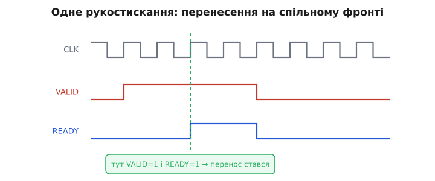
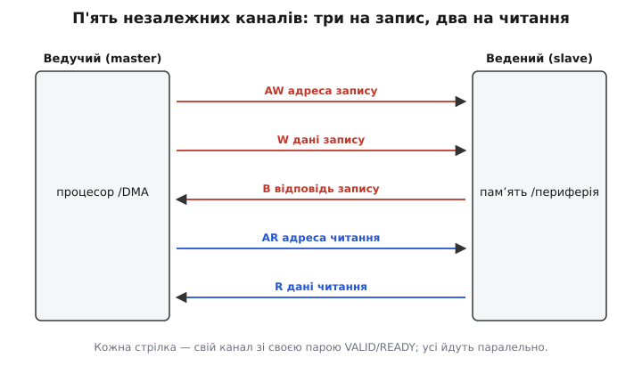
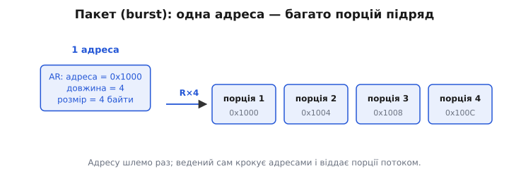

# Шина AXI

Усередині сучасної мікросхеми — системи-на-кристалі (SoC) — тісниться десяток самостійних вузлів: одне чи кілька процесорних ядер, контролер зовнішньої пам'яті, відеовихід, мережевий блок, криптоприскорювач. Усі вони мусять читати й писати спільну пам'ять і достукуватися одне до одного. Постає просте на вигляд питання: як їх з'єднати всередині кремнію так, щоб це працювало швидко, не плуталося й не залежало від того, хто саме який вузол проєктував? Відповідь — домовитися про **спільну мову обміну**, той самий набір ліній і правил, якого тримаються всі. Найпоширеніша така мова у світі процесорів на ядрах ARM зветься **AXI** (англ. *Advanced eXtensible Interface* — «розширюваний інтерфейс підвищеної якості»).

AXI — це не дріт і не мікросхема, а **протокол**: угода про те, які сигнали є, коли кожен має право змінитися і що це означає. Двоє вузлів, які обидва розмовляють по AXI, з'єднаються й запрацюють, хоч би їх робили різні команди в різних кутках світу — рівно тому, що обидва тримаються тієї самої угоди. Саме заради цього протоколи й існують.

### Навіщо взагалі протокол, а не просто дроти

Найпростіше з'єднання пам'яті з процесором на вигляд не потребує жодного протоколу: дай адресу, тримай сигнал «читай», за такт-другий забери дані з ліній. Так і будували перші процесорні шини. Проблема вилазить, щойно вузлів стає багато й вони різношвидкісні. Процесор хоче адресу «прямо зараз», а пам'ять цієї миті зайнята оновленням і відповість лише за п'ять тактів. Відеоблок жене суцільний потік, а криптоприскорювач працює ривками. Якщо всі жорстко чекають одне на одного за фіксований час, найповільніший вузол диктує темп усім, а будь-яка затримка означає зіпсовані чи загублені дані.

Отже, потрібне правило, яке дозволяє кожній стороні сказати іншій дві речі: «я готовий» і «зачекай». Тоді швидкий не мчить поперед повільного, повільний не гальмує всіх без потреби, а обмін відбувається рівно тоді, коли **обидві** сторони до нього готові. На цьому спостереженні тримається весь AXI, і почати варто саме з нього — бо все інше є надбудовою над цією однією ідеєю.

> 🔧 **Навіщо це.** Коли ви під'єднуєте свій блок (скажімо, власний прискорювач у ПЛІС) до процесорної системи, ви не вигадуєте, як «поговорити» з пам'яттю — ви реалізуєте AXI-інтерфейс, і система приймає вас як рідного. Уся складність узгодження швидкостей уже вирішена протоколом; ваша справа — правильно виставляти два сигнали й дивитися на два інші.

### Атом усього: рукостискання VALID/READY

Уся передача в AXI зведена до одного простого механізму, який повторюється всюди однаково. Є **джерело** (той, хто передає) і **приймач** (той, хто бере). Джерело має сигнал **VALID** («дані на лініях дійсні, бери»), приймач — сигнал **READY** («я готовий узяти»). Правило одне-єдине: **перенесення відбувається в той такт, коли VALID і READY високі водночас** — на спільному фронті тактового сигналу. Не раніше, не пізніше.

Розберімо, чому саме так, а не інакше. Якби перенесення означало сам лише VALID, приймач не мав би способу сказати «стривай, я ще не звільнився» — і швидке джерело завалило б повільний приймач. Якби воно означало сам READY, приймач брав би дані, яких джерело ще не поклало. Потрібні **обидва** підтвердження: одне каже «є що брати», друге — «є кому брати», а збіг обох на одному фронті й фіксує факт передачі. Це те саме, що потиск двох рук: доки одна рука не простягнута, а друга не стиснула — рукостискання нема.


*Джерело виставило VALID рано й тримає його. Приймач був зайнятий і підняв READY згодом. Перенесення стається рівно на тому фронті такту, де обидва сигнали високі одночасно (зелена лінія); до того джерело терпляче чекає, тримаючи дані незмінними.*

Звідси випливає перша чеснота протоколу: **гнучкість темпу**. Швидкий приймач тримає READY завжди високим — і бере порцію щотакту без затримок. Повільний піднімає READY лише коли справді готовий — і джерело саме́ його чекає, не псуючи даних. Той самий інтерфейс без переробки працює і на повній швидкості, і на черепашачій — вирішує сторона, якій зараз важко.

### Золоте правило: VALID не чекає READY

У цій простій схемі ховається одна пастка, і протокол закриває її окремим суворим правилом. Уявіть, що обидві сторони обережні: джерело вирішує «підніму VALID лише коли побачу READY», а приймач — «підійму READY лише коли побачу VALID». Тоді ніхто не піднімає свій сигнал першим, обидва вічно чекають одне на одного, і обмін зависає назавжди. Це **взаємне блокування** (англ. *deadlock* — «мертвий замок»).

Щоб такого не сталося ніколи, AXI встановлює несиметричне правило: **джерело зобов'язане підняти VALID, не чекаючи на READY**. Тобто хочеш передати — оголоси про це негайно, поклади дані й підніми VALID, а далі терпляче тримай, доки приймач не відповість своїм READY. Приймачеві, навпаки, **дозволено** дочекатися VALID, перш ніж піднімати READY, — це безпечно, бо джерело в цей час не сидить склавши руки, а вже сигналить. Асиметрія і є запобіжником: раз одна сторона завжди ходить перша, зациклитися на взаємному очікуванні нема як.

> 🔧 **Навіщо це.** Це найчастіша помилка початківця, який пише AXI-блок: у логіці він ставить VALID у залежність від READY («видам дані, коли партнер готовий»). Синтез проходить, а система намертво зависає на першому ж зверненні до цього блоку — і зависання дуже незручно ловити. Тримайте в голові тверде: **VALID підіймається сам по собі, READY може озиратися на VALID — але не навпаки.**

### Чому каналів аж п'ять

Одного рукостискання досить, щоб перенести одну порцію. Але повне звернення до пам'яті — це не одна порція. Щоб **записати**, треба сказати три речі: за якою адресою, які дані, і потім дізнатися, чи запис вдався. Щоб **прочитати** — дві: за якою адресою, і забрати те, що звідти прийшло. AXI не змішує їх в один потік, а розводить по **п'яти незалежних каналах**, кожен зі своєю парою VALID/READY:

- **AW** (*Write Address*) — адреса запису: куди писатимемо;
- **W** (*Write Data*) — самі дані запису;
- **B** (*Write Response*, буква від *Buffered*) — відповідь: запис пройшов чи сталася помилка;
- **AR** (*Read Address*) — адреса читання: звідки читати;
- **R** (*Read Data*) — дані, що прийшли з читання.


*Три канали обслуговують запис (адреса, дані, відповідь), два — читання (адреса, дані). Кожен має власне рукостискання й рухається сам по собі, тож повільна відповідь на запис не блокує читання, а зайнятий канал даних не тримає канал адрес.*

Навіщо таке дроблення? Бо **незалежність каналів дає волю в часі**. Адресу читання можна відправити, ще не забравши дані попереднього читання, — тож у пам'яті одразу кілька запитів «у польоті», і поки одні дані повзуть назад, наступні адреси вже прийняті. Запис і читання йдуть **водночас**: канали різні, вони одне одному не заважають. Той, хто веде обмін і сам починає звернення, зветься [**ведучим** (англ. *master*, у новіших редакціях стандарту — *manager*)](topic:hw-arch/axi-bus/hist-amba.md); хто лише відгукується — **веденим** (*slave* / *subordinate*). Ведучий — це процесор чи блок прямого доступу до пам'яті; ведений — сама пам'ять чи периферійний регістровий блок.

Розділення адреси й даних — не примха AXI, а стара ідея процесорних шин, і саме тут корисно знати, з чого AXI виріс. Він з'явився 2003 року як частина третього покоління сімейства шин [AMBA від компанії ARM](topic:hw-arch/axi-bus/hist-amba.md) — на зміну простішій шині, де адреса й дані ділили один спільний цикл. Що привело до п'яти каналів і чому попередні шини вже не тягли зростання швидкостей — коротка, але повчальна історія.

### Пакет: одна адреса, багато порцій

Тепер найважливіше для швидкості. Якби на кожне слово даних доводилося окремо слати адресу, половина роботи шини йшла б на адреси, а не на корисні дані. Тому AXI вміє **пакети** (англ. *burst* — «черга, залп»): ведучий шле адресу **один раз** і каже, скільки порцій підряд піде, — а далі порції (кожну звуть *beat*, «удар») течуть потоком, і ведений сам крокує адресами за наперед відомим правилом.


*Ведучий шле по каналу адрес одну адресу 0x1000 з довжиною 4. Ведений сам відлічує адреси 0x1000, 0x1004, 0x1008, 0x100C і віддає чотири порції поспіль по каналу даних. Адресна робота — раз на весь пакет, тож майже вся смуга йде під корисні дані.*

Довжину пакета несе окреме поле (для запису — `AWLEN`, для читання — `ARLEN`), і закодована вона хитро — **на одиницю менше** за справжню кількість порцій: нуль означає одну порцію, значення 255 — двісті п'ятдесят шість. Дрібниця, але саме через неї в четвертій редакції протоколу, [**AXI4**, пакет розтягнули до 256 порцій](topic:hw-arch/axi-bus/hist-amba.md), тоді як у ранньому AXI3 поле мало лише 4 біти й межа була 16. Що передача довшими пакетами, то менша частка накладних витрат на адреси — тим AXI4 і швидший на потокових даних.

Остання деталь запису, без якої буде плутанина, — **побайтові дозволи** (англ. *write strobes*, сигнал `WSTRB`). Шина даних широка, скажімо 4 байти, а записати часом треба лише один байт усередині слова. `WSTRB` має по одному біту на кожен байт лінії даних: біт піднято — цей байт пишемо, опущено — не чіпаємо. Так один запис по широкій шині акуратно змінює хоч єдиний байт, не зачепивши сусідів.

### AXI повний і AXI-Lite

П'ять каналів, пакети, порядок звернень «не по черзі» — це потужно, але для простого діла надмірно. Багато периферії — це всього-на-всього купка керівних регістрів: записав слово за адресою — увімкнув блок; прочитав слово — дізнався стан. Пакети тут ні до чого, кожне звернення — рівно одне слово.

Для таких випадків є полегшена відміна — **AXI-Lite**. Ті самі п'ять каналів і те саме рукостискання VALID/READY, але без пакетів (кожне звернення — одна порція) і без порядку «не по черзі». Логіка веденого стає в рази простішою, а процесорові однаково: він так само пише й читає окремі слова. Тому периферію в SoC і ПЛІС масово чіпляють саме через AXI-Lite, а повний AXI лишають туди, де ллються великі об'єми, — до пам'яті, відео, мережі.

> 🔧 **Навіщо це.** Пишете свій керівний блок для ПЛІС — беріть AXI-Lite: менше логіки, менше нагод помилитися, а процесор бачить ваші регістри як звичайні комірки пам'яті за їхніми адресами. Повний AXI з пакетами вмикайте свідомо й лише там, де справді женете потік, — інакше платите складністю за швидкість, якої не використовуєте.

### Як це виглядає з боку програми

Найприємніше в усій цій машинерії — що з боку прошивки її **майже не видно**. Периферію, під'єднану по AXI-Lite, процесор бачить як звичайну пам'ять: кожен її регістр має адресу, і робота з ним — це просте читання чи запис за вказівником. Усі п'ять каналів, обидва рукостискання, дозволи байтів — усе це відпрацьовує залізо шини під капотом, поки ваш код лиш присвоює значення.

**Умова: блок таймера під'єднано по AXI-Lite за базовою адресою 0x40001000; регістр `CTRL` (зсув 0x00) вмикає лічбу бітом 0, регістр `COUNT` (зсув 0x04) віддає поточне значення лічильника.**

```c
#include <stdint.h>

// База периферії на шині — така сама адреса, яку бачить канал адрес AXI.
#define TIMER_BASE  0x40001000u
#define TIMER_CTRL  (*(volatile uint32_t *)(TIMER_BASE + 0x00))
#define TIMER_COUNT (*(volatile uint32_t *)(TIMER_BASE + 0x04))

void timer_start(void) {
    // Запис слова: процесор жене адресу по AW, дані по W, чекає B.
    TIMER_CTRL = 0x1u;            // біт 0 = 1 → лічити
}

uint32_t timer_read(void) {
    // Читання слова: адреса по AR, дані повертаються по R.
    return TIMER_COUNT;           // одне звернення — одне слово
}
```

Слово `volatile` тут не прикраса, а необхідність: воно забороняє оптимізатору вважати, ніби значення в комірці не змінюється саме́ по собі, і змушує щоразу справді ходити на шину. Кожне таке присвоєння `TIMER_CTRL = 0x1u` розгортається в залізі в повне AXI-звернення на запис: адреса 0x40001000 виставляється на канал AW, значення 0x1 — на канал W, а процесор чекає підтвердження по каналу B, перш ніж рушити далі. Читання `TIMER_COUNT` так само породжує звернення по AR і забирає слово з R. Уся ця розмова каналами схована за одним рядком коду — і в цьому весь сенс: складне рукостискання вирішене раз на рівні протоколу, а прикладний код лишається простим.

### Що лишається в голові

AXI виглядає громіздким через п'ять каналів і жаргон, та вся його суть тримається на одній цеглині — **рукостисканні VALID/READY**, де перенесення стається на такті, коли обидва сигнали високі. Каналів п'ять, бо повне звернення до пам'яті розпадається на адресу, дані й відповідь окремо для запису й для читання, а незалежність каналів дає волю в часі й дає лити запис і читання водночас. Пакети відправляють адресу раз на цілу низку порцій — і саме тут ховається швидкість. А золоте правило «VALID не чекає READY» рятує від зависань. Знаючи ці чотири речі, ви розумієте AXI по суті; решта — подробиці кодування полів, які завжди можна звірити зі стандартом.
