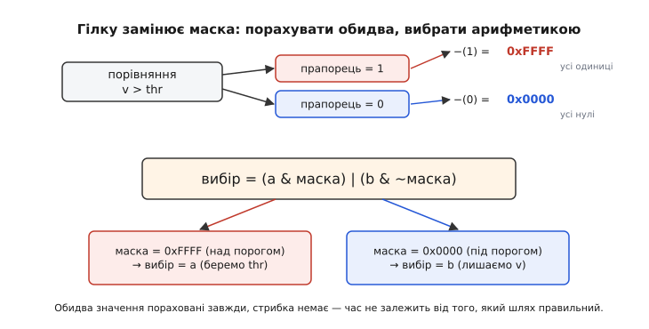

# ⚙️ Безгілковий код: як прибрати непередбачувану гілку з гарячого циклу

Гілка коштує нуль тактів, поки процесор угадує її наперед правильно. Уся підступність починається там, де вгадати **неможливо в принципі** — коли умова стрибає туди-сюди без ладу, за даними, яких ніхто не знає наперед. Тоді кожна ітерація гарячого циклу — це підкидання монетки, і половину разів [конвеєр](topic:hw-arch/pipeline) ловить промах: увесь спекулятивний хвіст летить у смітник, і замість однієї команди гілка коштує глибину конвеєра. У прошивці такі місця конкретні й болючі: поріг у фільтрі давача, кліпінг сигналу, вибір за випадковим прапорцем у циклі на десятки тисяч ітерацій. Тут і народжується прийом, що звучить парадоксально: **прибрати гілку зовсім** — порахувати обидві вітки завжди й вибрати потрібну чистою арифметикою, без жодного стрибка. Розберімо, як це робиться в реальному C, коли це виграє в рази, а коли тільки шкодить.

## Задача

Візьмімо найбуденнішу річ — обмеження сигналу зверху (кліп, англ. *clip* — «зрізати»). З давача йде потік вибірок, і кожну, що перевищила поріг, треба притиснути до порога. Класичний, найчистіший запис:

```c
// Гаряча обробка потоку з давача: зрізати все, що вище порога
void clip(uint16_t *buf, size_t n, uint16_t thr) {
    for (size_t i = 0; i < n; i++) {
        if (buf[i] > thr)      // ← гілка на КОЖНІЙ вибірці
            buf[i] = thr;
    }
}
```

Код бездоганний на вигляд. Питання одне: **як часто спрацьовує цей `if`?** Якщо сигнал майже завжди нижчий за поріг (кліп — рідкісний аварійний випадок), гілка стабільна, передбачувач вивчає її до 99% і штрафу практично нема — чіпати тут нічого. Але уявімо інше: сигнал коливається **навколо** порога — шумить, гуляє вгору-вниз близько межі. Тоді умова `buf[i] > thr` спрацьовує то так, то ні, приблизно навпіл і **без будь-якої закономірності**. Це найгірше можливе харчування для передбачувача: він не має за що зачепитися, влучає близько 50%, і кожна друга вибірка коштує повний штраф промаху. На потоці в десятки тисяч вибірок, що крутиться в реальному часі, це вже помітна дірка в бюджеті тактів.

Мета вузька: **прибрати цю гілку так, щоб час обробки не залежав від даних узагалі** — щоб кожна вибірка коштувала однаково, чи вона над порогом, чи під ним. Іншими словами, замінити «стрибни або ні» на «порахуй завжди».

## Ідея

Корінь у простому спостереженні: гілка потрібна лише тому, що ми **не хочемо** виконувати зайву роботу — обчислювати те, що не знадобиться. Але робота тут копійчана (одне присвоєння), а стрибок при промаху — дорогий. Тож перевернімо баланс: **зробімо обидві вітки завжди**, а тоді виберімо результат без стрибка. Ключ — перетворити булеву умову на **число** й použити його як важіль арифметики.

У C порівняння `a > b` дає `0` або `1`. Це вже пів справи. А другий, головний трюк — **маска**. Візьмемо `-(cond)` на беззнаковому типі: якщо `cond == 1`, то `-1` у доповняльному коді (англ. *two's complement*) — це **всі одиниці** (`0xFFFF…`); якщо `cond == 0`, то `-0` — **усі нулі** (`0x0000…`). Одна операція перетворює прапорець «так/ні» на суцільну маску бітів, якою можна **вибирати** між двома значеннями чистим AND/OR, без жодної гілки:

```
cond = 1  →  -(cond) = -1 = 0xFFFF   (маска «бери це»)
cond = 0  →  -(cond) =  0 = 0x0000   (маска «не бери»)

вибір = (a & маска) | (b & ~маска)
        якщо маска = 0xFFFF → вибір = a
        якщо маска = 0x0000 → вибір = b
```


*Як булеве стає вибором без гілки. Порівняння дає прапорець 0 або 1. Операція `-(прапорець)` у доповняльному коді розтягує його на всю ширину слова: 1 → усі одиниці (0xFFFF), 0 → усі нулі. Ця маска й вибирає: `(a & маска)` пропускає `a`, коли маска суцільна, і зануляє його, коли порожня; `(b & ~маска)` робить навпаки. OR склеює половинки. Обидва значення пораховані завжди, стрибка немає — час не залежить від того, який шлях «правильний».*

> 🔧 **Навіщо це.** Прийом `-(cond)` — робоча конячка всього безгілкового коду в прошивці. Він працює **без множення й без ділення** (лише порівняння, віднімання, AND/OR/зсув), тож живий навіть на найдрібнішому мікроконтролері без апаратного множника, де кожен зайвий такт на рахунку. І він дає **сталий час** незалежно від даних — а це критично там, де обробка мусить укладатися в жорсткий такт реального часу (обробник переривання давача, крок керма мотором): час не має гуляти від того, який шлях узяла умова.

Для нашого кліпу вітки навіть не треба зводити маскою вручну — досить `min`. Адже «притиснути до порога, якщо вище» — це рівно «взяти менше з двох»: `buf[i] = min(buf[i], thr)`. А `min` без гілки будується тим самим фокусом.

## Робочий код

Ось три щаблі того самого кліпу: наївний із гілкою, безгілковий через маску вручну (щоб побачити механізм голим) і практичний через `min`. Усі три роблять **той самий** результат до біта; різниця лише в тому, чи є в гарячому циклі стрибок.

**Умова.** Той самий буфер `uint16_t buf[N]`, поріг `thr`; сигнал шумить навколо порога, тож гілка непередбачувана (~50% спрацьовувань без ладу).

```c
#include <stdint.h>
#include <stddef.h>

// 1. Наївно: гілка на кожній вибірці (страждає на шумі коло порога)
void clip_branch(uint16_t *buf, size_t n, uint16_t thr) {
    for (size_t i = 0; i < n; i++)
        if (buf[i] > thr)
            buf[i] = thr;
}

// 2. Безгілково, маска вручну — видно весь механізм
void clip_mask(uint16_t *buf, size_t n, uint16_t thr) {
    for (size_t i = 0; i < n; i++) {
        uint16_t v    = buf[i];
        uint16_t over = -(uint16_t)(v > thr);   // v>thr → 0xFFFF, інакше 0x0000
        // над порогом беремо thr, під порогом лишаємо v:
        buf[i] = (thr & over) | (v & ~over);
    }
}

// 3. Безгілково й читабельно — те саме через min без гілки
static inline uint16_t umin(uint16_t a, uint16_t b) {
    // b < a ? b : a, але без стрибка:
    uint16_t m = -(uint16_t)(b < a);            // b<a → 0xFFFF
    return (b & m) | (a & ~m);
}
void clip_min(uint16_t *buf, size_t n, uint16_t thr) {
    for (size_t i = 0; i < n; i++)
        buf[i] = umin(buf[i], thr);
}
```

Розберімо `clip_mask` по рядку, бо в ньому вся суть. `v > thr` дає `0` або `1`. `-(uint16_t)(…)` перетворює це на `0x0000` або `0xFFFF` — маску `over` («вибірка над порогом»). Далі `thr & over` — це `thr`, коли ми над порогом, і `0`, коли ні; `v & ~over` — навпаки, це `v`, коли під порогом, і `0`, коли над. Рівно один із доданків ненульовий, другий занулено, тож `|` просто склеює правильну відповідь. Жодного `if`, жодного стрибка — самі порівняння й побітові операції, які конвеєр ковтає без ризику промаху.

**Наскільки це виграє.** Прикиньмо на пальцях, аби відчути масштаб. Нехай глибина конвеєра до розв'язання гілки — 12 тактів (типово для короткого конвеєра), корисна робота на вибірку — ~2 такти, а гілка непередбачувана (влучань 50%):

```
Гілкова версія (промах у половині ітерацій):
  такти/вибірку ≈ 2 (робота) + 0.5 × 12 (штраф) = 2 + 6 = 8 тактів

Безгілкова версія (стрибка нема — штраф нуль завжди):
  такти/вибірку ≈ 4 (трохи більше арифметики, зате без гілки)

виграш ≈ 8 / 4 = 2× на непередбачуваних даних
```

Двократне прискорення на гарячому циклі — це багато. Але вчитайтеся в цифри уважно: увесь виграш прийшов зі штрафу `0.5 × 12`. Якби гілка була **передбачувана** (влучань 99%), штраф упав би до `0.01 × 12 ≈ 0.12` такту, гілкова версія коштувала б ~2.1 такту проти наших 4 — і безгілковий варіант став би **удвічі повільнішим**. Ось чому цей прийом — не «завжди краще», а точковий інструмент саме проти непередбачуваності. Реальний масштаб не вгадують, а **міряють**: [профілювальник](topic:sf-release/profiling) показує і частку промахів передбачення, і час обох варіантів на вашому залізі та ваших даних.

### Що з цього бачить компілятор

Тут ховається важлива тонкість, від якої залежить, чи варто взагалі писати маску руками. Сучасні компілятори самі вміють перетворювати простий `if`-вибір на безгілковий код — коли на цільовому процесорі є для цього команда. На x86 це **CMOV** (умовне пересилання, англ. *conditional move*): команда бере значення й записує його в регістр **лише якщо** прапорець стоїть — тобто робить вибір без стрибка, апаратно. Її додали ще в Pentium Pro 1995 року саме для того, щоб позбутися дорогих гілок у `?:`-подібному коді (усталений факт: CMOVcc з'явилася в поколінні P6). На ARM, де живе більшість прошивок, є свій еквівалент — **умовне виконання**: у Thumb-2 блок `IT` (англ. *If-Then*) робить умовними до чотирьох наступних команд поспіль, і процесор просто «проходить крізь» непотрібні, не гілкуючись (це стандартна можливість Thumb-2 у Cortex-M).

Отже, часто досить написати **природний** `if` або тернар — і компілятор із увімкненою оптимізацією сам покладе cmov чи умовне виконання:

```c
// Компілятор з -O2 нерідко сам зробить це безгілковим (cmov / IT-блок):
buf[i] = (buf[i] > thr) ? thr : buf[i];
```

Що саме вийде — cmov, IT-блок чи все-таки гілка — видно лише в асемблері, і залежить від процесора, рівня оптимізації та евристик компілятора; як він до цього доходить, розібрано в темі про [стадії компілятора](topic:sf-lang/compiler-stages). Звідси практичне правило: **спершу напиши чисто й глянь, що згенерував компілятор**. Якщо він уже поклав cmov — ручна маска нічого не додасть, лише зробить код нечитабельним. Ручна маска потрібна там, де компілятор **не наважився** (складніша вітка, побічні ефекти, він оцінив гілку як передбачувану) — а профіль каже, що вона таки непередбачувана й болить.

## Таблиця замість гілок

Окремий, дуже прошивковий випадок безгілковості — коли гілок не одна, а **пучок**: `switch` чи довгий `if / else if` вибирає одне з багатьох. Кожна така розв'язка — потенційний промах, а `switch` через непрямий стрибок ще й б'є по буферу цілей переходів. Якщо гілки роблять по суті одне — **вертають значення** за дискретним входом, — увесь пучок згортається в **таблицю замін** (англ. *lookup table*, LUT): замість «порахувати, куди стрибнути» просто **читаємо готову відповідь** за індексом.

Класика прошивки — декодер станів чи мапа кодів. Порівняйте:

```c
// Гілки: кожен код — окрема розв'язка, на гарячому шляху низка порівнянь
uint8_t level_branch(uint8_t code) {
    if (code == 0) return 0;
    else if (code == 1) return 10;
    else if (code == 2) return 25;
    else if (code == 3) return 50;
    else return 100;
}

// Таблиця: жодної гілки на гарячому шляху — одне читання за індексом
static const uint8_t LEVEL[5] = { 0, 10, 25, 50, 100 };
uint8_t level_table(uint8_t code) {
    return (code < 5) ? LEVEL[code] : 100;   // одна перевірка меж — і читання
}
```

Гілкова версія на кожен виклик проганяє низку порівнянь, і якщо коди йдуть у випадковому порядку, передбачувач плутається на кожному. Таблична — читає один байт із масиву; на гарячому шляху лишається єдина перевірка меж (а часто й вона не потрібна, якщо вхід гарантовано в діапазоні). Це той самий обмін, що й із маскою: **пам'ять і трохи попередньої роботи замість непередбачуваного розгалуження**. Глибше — коли таблиця виграє, як її будувати й де вона, навпаки, надмір (велика розріджена мапа гірша за кілька `if`) — у темі про [таблиці замін](topic:sf-algorithms/lookup-table).

Таблиця має і другу перевагу, що часто важить більше за самі такти: **сталий час**. Читання за індексом коштує однаково для будь-якого коду, тоді як ланцюг `if` коштує тим більше, чим далі відповідь у списку. Для коду реального часу передбачуваність часу цінна сама по собі.

## Підказки компілятору: коли гілку лишаємо, але допомагаємо

Не кожну гілку треба (чи можна) прибрати. Часто гілка **передбачувана**, і чіпати її не варто — але корисно **підказати** компілятору, який шлях частий, щоб він гарно розклав код. Для цього є `__builtin_expect` (у GCC і Clang), а зручні обгортки над ним — макроси `likely`/`unlikely`, що прийшли з ядра Linux:

```c
#define likely(x)   __builtin_expect(!!(x), 1)
#define unlikely(x) __builtin_expect(!!(x), 0)

// Гаряча перевірка: помилка — рідкість, тож ведемо частий шлях прямо
for (size_t i = 0; i < n; i++) {
    if (unlikely(sample_invalid(buf[i])))   // рідкісна аварійна вітка
        handle_error(i);                    // ← винесеться геть із гарячого шляху
    process(buf[i]);                        // ← частий шлях лишиться прямим
}
```

Що це реально дає — важливо зрозуміти точно, бо тут повно міфів. Головний ефект — **не** «умовляння» динамічного передбачувача (той однаково вчиться на фактичній поведінці й ігнорує наші побажання). Ефект у **розкладці коду**: компілятор ставить частий шлях **суцільно, одразу за перевіркою** (fall-through), а рідкісну вітку виносить кудись убік. Від цього виграє і статичне передбачення (наперед-«не стрибати» на прямий шлях спрацьовує частіше), і — головне — [кеш інструкцій](topic:hw-arch/cache): гарячий код лежить щільно, без дірок від рідко потрібних гілок, тож менше промахів по інструкціях. У C++20 ту саму підказку стандартизували як атрибути `[[likely]]` / `[[unlikely]]` (та сама механіка, лише синтаксис мовний, а не через вбудовану функцію).

Застереження суворе: підказка діє, лише коли ви **справді** знаєте розклад, і **шкодить**, коли вгадали навпаки — повісите `likely` на насправді рідкісний шлях, і компілятор оптимізує саме той, що майже ніколи не виконується, а частий поверне в невигідну розкладку. Ставте `likely`/`unlikely` тільки там, де співвідношення очевидне з природи задачі (рідкісна помилка, майже завжди-успіх) або підтверджене профілем — не «про всяк випадок».

## Складність і пастки

За класичною міркою алгоритмів безгілковий і гілковий варіанти **однакові** — той самий O(n), те саме число вибірок. І знову ця міра осліплена до головного: вона рахує операції, але не бачить, що одна передбачена гілка коштує нуль, а одна непередбачена — глибину конвеєра. Уся різниця, заради якої ми це робимо, живе саме в тому, чого O(n) не помічає. Ось на що зважати, аби прийом допомагав, а не шкодив.

- **Головна пастка — застосувати це до передбачуваної гілки.** Це найчастіша й найдорожча помилка. Безгілковий варіант завжди рахує **обидві** вітки, тож на передбачуваних даних (де гілка й так коштувала ~0) він просто додає роботи й виходить **повільнішим** за чесний `if`. Прийом виграє **лише** там, де гілка справді непередбачувана — шумить за даними без ладу. Перш ніж прибирати гілку, доведи, що вона болить: [зміряй](topic:sf-release/profiling) частку промахів. Немає промахів — немає чого лікувати.
- **Обидві вітки мусять бути безпечні для обчислення завжди.** Ми рахуємо їх **обидві**, тож жодна не сміє мати побічного ефекту чи впасти на «неправильному» шляху. Класичний капкан: `x != 0 ? a / x : 0` **не можна** просто зробити безгілковим множенням маски — безгілкова версія порахує `a / x` **і при `x == 0`**, тобто ділення на нуль станеться до того, як маска його «відкине». Гілка тут — не гальмо, а **захист**, і прибирати її не можна. Безгілковість годиться лише коли обидві вітки — чисте, завжди-дозволене обчислення.
- **Читабельність — реальна ціна.** `(thr & over) | (v & ~over)` наступний читач розшифрує не одразу, а помилитися в такій магії легко. Тому: ховайте прийом у крихітну `static inline`-функцію з ясною назвою (`umin`, `clamp`, `select`), лишайте поруч коментар із наміром, і застосовуйте **лише** в доведено гарячих місцях. У холодному коді безгілковість — чистий програш: ні швидше (гілка й так дешева), зате плутаніше.
- **Спершу довірся компілятору.** На `-O2` він часто сам покладе cmov або IT-блок для простого тернара — тоді ручна маска зайва. Правило порядку дій: **напиши чисто → глянь асемблер → зміряй → лізь у ручну маску лише якщо компілятор не впорався, а профіль каже, що болить**. Передчасна ручна безгілковість — це складність без доказу потреби.
- **На дрібному МК без множника — тримайся AND/OR і зсувів.** Прийом `-(cond)` цим і гарний: він не потребує множення. Якщо ж «оптимізуєте» гілку через множення на прапорець (`v * cond`), а множник на кристалі повільний або емульований, легко зробити **гірше** за просту гілку. Вибирай маскою (AND/OR), а не арифметикою множення, коли залізо слабке.

Висновок один і твердий: гілку прибирають **не тому, що гілки погані**, а тому, що конкретна гілка **непередбачувана** й тому дорога. Порахувати обидві вітки й вибрати маскою, згорнути пучок розв'язок у таблицю, підказати компілятору розкладку частого шляху — три різні відповіді на три різні ситуації, і всі три виграють лише під прицілом профілю. Машина винагороджує передбачуване; там, де дані відмовляють у передбачуваності, найшвидша гілка — та, якої немає.
