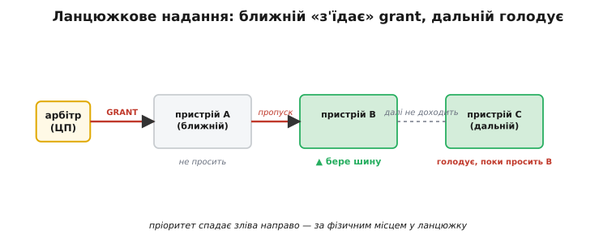
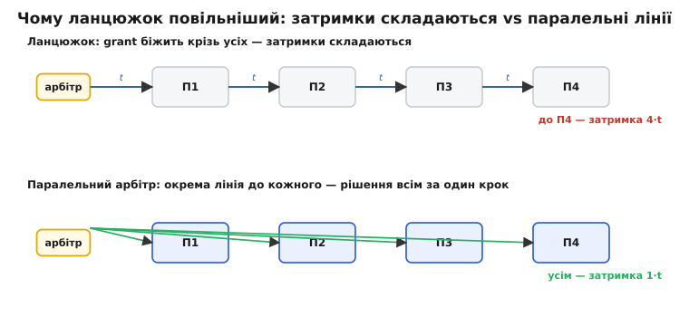

# 📜 Гірлянда з однієї лінії: як ланцюжковий пріоритет судив шину в перших мінікомп'ютерах

Уявіть, що вам треба збудувати суддю для шини — того, хто в кожну мить пускає на спільні дроти рівно одного майстра. Логіка каже: проведи від судді окрему лінію надання до кожного, хто може попросити шину, і вмикай потрібну. Просто. Але тепер згадайте, у якому світі це вперше довелося робити насправді — і «просто» розсиплеться.

Кінець 1960-х. Мінікомп'ютер — це шафа завбільшки з холодильник, а не чип. Кожна лінія на об'єднувальній платі (англ. *backplane* — задня, об'єднувальна плата, у яку встромляють карти) — це фізичний провідник, роз'єм, контакт, гроші й місце. Карти вводу-виводу тих машин були великі саме тому, що майже будь-яку функцію доводилося складати з окремих корпусів логіки — плата була дефіцитом. І от у цьому світі інженер, що хоче дати кожному з, скажімо, дванадцяти пристроїв власну лінію надання, раптом бачить: це дванадцять окремих провідників через усю плату, дванадцять контактів у роз'ємі процесора, дванадцять входів у його арбітражну логіку. А якщо пристроїв двадцять? А якщо плата має вільні слоти під майбутні карти, і кожен слот теж мусить мати свою лінію напоготові?

Ось де народилася хитрість, гідна свого імені. Замість пучка ліній — **одна**. Одна лінія надання, що не розходиться зіркою до кожного, а **проходить крізь усі пристрої послідовно**, від найближчого до процесора до найдальшого, ниткою. Кожен пристрій вмонтований у цю нитку: сигнал входить у нього з боку процесора й виходить далі до наступного. Схему назвали **ланцюжковим пріоритетом**, або **гірляндою** (англ. *daisy chain* — гірлянда з маргариток; квіти нанизують стебло крізь стебло в одну нитку, і провідники так само тягнуть послідовно, з виходу одного у вхід наступного). Одне слово, один провідник — і суддя, який коштує майже нічого.

Ця вставка — про те, як така нитка судила шину в реальних машинах, чому вона була геніально дешевою, які три вади в неї були зашиті від народження, і чому наступне покоління шин її, зрештою, замінило.

## Одна лінія, що тече крізь усіх

Щоб відчути ідею до кінця, простежмо шлях сигналу надання вздовж нитки — крок за кроком, як його бачить залізо.

Процесор (він же арбітр) вирішує: час дати комусь шину. Він піднімає лінію надання — але піднімає її лише на **першому** відрізку, тому, що йде до найближчого пристрою. Сигнал доходить до пристрою A. Далі — розвилка, і вся суть схеми саме в ній. Пристрій дивиться сам на себе: **я зараз прошу шину?**

- Якщо **ні** — пристрій пропускає надання наскрізь: бере його зі свого входу й виставляє на свій вихід, до наступного пристрою в нитці. Нитка тече далі, ніби пристрою тут і немає.
- Якщо **так** — пристрій **перехоплює** надання: бере його собі, стає майстром шини й **не виставляє** сигнал на свій вихід. Нитка на ньому обривається. До всіх, хто стоїть далі по ланцюжку, надання просто не доходить — його там фізично немає.


*Надання (GRANT) виходить з арбітра й тече крізь пристрої по черзі. Пристрій A не просить — пропускає сигнал далі. Пристрій B просить — «з'їдає» надання, бере шину й не пускає його далі. До пристрою C надання не доходить, хоч він теж просить: поки просить ближчий B, дальній C голодує. Пріоритет заданий самим лише фізичним місцем у ланцюжку.*

Придивімося, що з цього випливає, бо тут ховається вся краса й уся біда схеми одночасно. **Пріоритет ніхто не програмує — його задає порядок пайки.** Хто ближче до арбітра в нитці, той бачить надання раніше й перехоплює його першим; дальній дістає шину лише тоді, коли жоден ближчий її не просить. Не треба ні регістрів пріоритету, ні лічильників, ні окремих ліній запиту від кожного — уся дисципліна доступу вшита в геометрію плати. Це і є **фіксований пріоритет за місцем** у найчистішому, найдешевшому його втіленні: пріоритет — це відстань від судді, виміряна в слотах.

> 🔧 **Навіщо це.** Той самий принцип «сигнал іде послідовно, кожен або пропускає, або перехоплює» дожив до сьогодні — це логіка ланцюжкового підтвердження переривань і послідовного сканування (як у ланцюжку JTAG, де дані течуть крізь мікросхеми низкою). Побачивши в даташиті чи схемі слова *grant in / grant out*, *daisy chain*, *priority in / priority out* — ви одразу знаєте: тут порядок на платі **дорівнює** пріоритету, і пристрій, ближчий до контролера, завжди виграє. Це не деталь реалізації, а те, від чого залежить, хто в системі голодуватиме першим.

## Де це працювало насправді: UNIBUS фірми DEC

Найвідоміше й найкраще задокументоване втілення гірлянди — шина **UNIBUS** компанії Digital Equipment Corporation (DEC). Її розробили близько 1969 року Гордон Белл (*Gordon Bell*) та студент Гарольд Макфарланд (*Harold McFarland*) ще в Університеті Карнегі — Меллона, а світ вона побачила разом із мінікомп'ютером **PDP-11**, який DEC продавала з 1970 року й аж до кінця 1990-х — рідкісне довголіття для однієї архітектури. *(Статус: усталений факт, підтверджений документацією DEC і кількома незалежними джерелами з історії обчислювальної техніки.)*

UNIBUS зробив річ, яка тоді була сміливою: злив пам'ять і периферію в **одну** спільну шину. Усе — і оперативна пам'ять, і диски, і термінали — висіло на тих самих дротах адреси, даних і керування. А раз шина одна на всіх, то й арбітраж потрібен строгий: хтось мусить вирішувати, чия зараз черга. І DEC зробила його гірляндою.

Розгляньмо, як саме, бо конкретика тут повчальна. Пристрій просив шину не однією лінією, а по одній із кількох — залежно від того, наскільки терміново йому треба:

```
BR4, BR5, BR6, BR7  — Bus Request, чотири рівні пріоритету запиту
NPR                 — Non-Processor Request, запит на прямий доступ до пам'яті
```

На кожен рівень запиту процесор відповідав своєю лінією надання, і **кожна з цих ліній надання була окремою гірляндою** крізь усі слоти:

```
BG4, BG5, BG6, BG7  — Bus Grant, надання на відповідному рівні
NPG                 — Non-Processor Grant, надання на прямий доступ до пам'яті
```

Тобто рівнів пріоритету було кілька (грубий, наперед заданий порядок терміновості), а **всередині кожного рівня** тонкий порядок вирішувала гірлянда: серед усіх, хто просив на рівні BR6, шину діставав той, хто фізично ближчий до процесора в ланцюжку BG6. Двоярусна схема: рівень задає клас важливості, місце в нитці — чергу всередині класу.

Фізично надання йшло саме так, як ми описали: сигнал заходив у карту через контакт «вхід надання» і виходив через контакт «вихід надання» до наступного слота. Дослівно з інженерного опису шини — надання «розводиться гірляндою вздовж шини: воно з'єднане дротом з вихідного контакту одного слота на вхідний контакт наступного слота, для кожної пари сусідніх слотів». Просив пристрій шину — він перехоплював надання й **блокував** його подальшу передачу; не просив — пропускав далі. Так тривало, доки якийсь пристрій не візьме надання або доки нитка не добіжить до кінця шини. Проста, послідовна, невблаганна логіка.

## Пастка порожнього слота: карта-перемичка

Ось перша тонкість, у якій ланцюжкова природа схеми показує зуби — і яку жоден проєктувальник зіркової розводки навіть не уявив би собі як проблему.

Нитка тече крізь **карти**. А що, як слот **порожній**? Зіркова лінія до відсутнього пристрою просто нікуди не веде — і байдуже. Але гірлянда — це нитка: якщо вийняти одну намистину, нитка рветься, і все, що нанизане далі, відпадає. Порожній слот у ланцюжку надання означає розрив: сигнал доходить до діри, і **до всіх пристроїв за нею надання не потрапляє ніколи**. Вони німіють — не тому, що зламані, а тому, що обірвано провідник, яким до них ішло право говорити.

DEC розв'язала це прямолінійно й дешево — окремою крихітною картою, чия єдина робота: **замкнути нитку крізь порожній слот**. Називалася вона **картою неперервності надання** (англ. *grant continuity card*). Усередині — жодного активного компонента; тільки провідники, що з'єднують контакти «вхід надання» з контактами «вихід надання», щоб сигнал перестрибнув порожнє місце й побіг далі.

Тут навіть є повчальна еволюція деталі. Перша така карта, **G727**, несла крізь слот лише лінії надання переривань — BG4, BG5, BG6, BG7. Але ж була ще окрема гірлянда NPG — надання на прямий доступ до пам'яті. Якщо в порожньому слоті стояла G727, вона зшивала BG-нитки, але **лишала розірваною** нитку NPG — і прямий доступ до пам'яті переставав діставатися до дальших карт. Тому пізніше з'явилася **G7273**, яка несла крізь слот **і** BG4-BG7, **і** NPG — усі гірлянди разом. *(Статус: усталений факт, підтверджений технічною документацією UNIBUS.)*

Зупинімося на цьому, бо звідси видно природу схеми як на долоні. Дешевина гірлянди — не безкоштовна: за неї платять **крихкістю нитки**. Кожен слот стає ланкою, від якої залежать усі наступні; порожнє місце вимагає фізичної затички; додавання чи виймання карти зачіпає весь хвіст ланцюжка за нею. Зіркова розводка про такі клопоти й не чула — але зіркова розводка коштувала пучка проводів, якого в тій шафі не було зайвого. Уся інженерія — це такий обмін: DEC виміняла провідники на дисципліну обслуговування, і для машини-шафи, яку налаштовує інженер, а не кінцевий покупець, обмін був вигідний.

## Три вади, зашиті від народження

Гірлянда працювала — мінікомп'ютери на ній жили роками. Але в самій її будові було закладено три слабкості, кожна з яких прямо випливає з ідеї «одна нитка, послідовно, за місцем». Розгляньмо їх по черзі, бо саме вони, накопичившись, і відправили схему на пенсію.

### Жорсткий пріоритет за місцем — і голодування дальніх

Перша вада — зворотний бік головної переваги. Пріоритет заданий геометрією й **незмінний**: щоб підняти пристрій у черзі, його треба фізично **переставити ближче** до процесора. Жодного способу сказати програмно «сьогодні хай цей дальній буде важливішим» немає — пріоритет запаяний у плату.

І з цього прямо росте **голодування** (англ. *starvation* — голодна смерть задачі): якщо якийсь ближчий пристрій просить шину часто й наполегливо, дальній за ним не дістане її, поки ближчий не замовкне. Уявімо активний диск ближче до процесора й повільний термінал далі: доки диск ганяє блоки, надання щоразу перехоплюється на ньому, і термінал, хоч і тримає запит піднятим, чекає й чекає. Він живий, він просить — а черга до нього не доходить, бо нитка обривається раніше. У фіксованому пріоритеті за місцем це не збій, а **закладена поведінка**: сильніший за розташуванням завжди перший, і немає механізму, який дав би слабшому гарантований оберт.

### Затримка проходження крізь ланцюжок

Друга вада — фізична, і вона тим гостріша, чим довша нитка. Надання не з'являється в усіх одночасно; воно **біжить** крізь пристрої по черзі. Кожна карта, крізь яку сигнал проходить, додає свою маленьку затримку — логіка на вході мусить прийняти рівень і виставити його на вихід. Ці затримки **складаються** вздовж усього ланцюжка.


*Чому нитка повільніша. Угорі ланцюжок: надання проходить крізь П1, П2, П3 до П4, кожен переход додає затримку t, і дальній чекає суму — тут 4·t. Унизу паралельний арбітр веде окрему лінію до кожного, тож рішення доходить до всіх за той самий один крок 1·t, скільки б їх не було. Послідовність економить проводи, але платить часом, що росте з довжиною.*

Цифри тут не абстрактні. Пізніша й компактніша шина DEC — **QBUS** (LSI-11) — прямо нормувала цю затримку в специфікації: **проходження надання крізь один слот мусить бути меншим за 500 наносекунд**. А спеціальна мікросхема-буфер тих ліній, DEC DC010, укладалася приблизно в 95-220 нс на слот. *(Статус: усталений факт із документації QBUS/LSI-11.)* Помножте це на десяток слотів — і отримаєте помітну паузу, поки надання добіжить до дальнього кінця. Кожен доданий пристрій робить шину не лише «зайнятішою», а й буквально **повільнішою в реакції** для всіх, хто стоїть за ним: довша нитка — довший шлях сигналу.

Зверніть увагу на прикру асиметрію. Ближній пристрій дістає надання швидко й майже завжди виграє; дальній чекає і його рішення приходить пізніше, і в черзі він позаду. Обидві вади — і несправедливість пріоритету, і затримка — тиснуть в один бік, караючи той самий дальній кінець нитки двічі.

### Гонка на нитці: два майстри на одній шині

Третя вада — найпідступніша, бо вона не про «повільно» чи «несправедливо», а про **тихе псування даних**. І щоб її побачити, треба глянути на найнаївнішу реалізацію логіки пропуску.

Здавалося б, «пропускати або перехоплювати» описується одним рядком: виставляй надання на вихід тоді, коли воно є на вході **і** я сам шину не прошу.

```c
/* Наївний пропуск надання далі по ланцюжку — з прихованою гонкою */
grant_out = grant_in && !bus_request;
```

Виглядає бездоганно. Але згадаймо, що `bus_request` і `grant_in` — сигнали з **різних, не узгоджених у часі** джерел: запит породжує сам пристрій за власним тактом, а надання приходить від процесора за його тактом. І от два майстри піднімають запити майже одночасно — настільки близько, що арбітр не встигає чисто «клацнути» в один бік. Тригер, який має вирішити «цьому чи тому», на якийсь час зависає **між** станами — у хиткій рівновазі, яку звуть **метастабільністю** (гр. *metá* — поза, за межею, + лат. *stabilis* — стійкий). А поки він вагається, його вихід — не чіткий нуль і не чітка одиниця, а щось посередині, що різні пристрої вздовж нитки можуть **прочитати по-різному**.

Наслідок катастрофічний саме для гірлянди. Один пристрій вирішив, що надання призначене йому, і став майстром; сусід тієї ж миті вирішив, що надання пройшло повз і дісталося йому, — і теж став майстром. **Два майстри на одній шині.** Обидва женуть свої рівні на спільні дроти адреси й даних — і на шині немає ні того, ні того, а є мішанина. На словах авторів інженерного розбору цієї шини — таке «переплутає пам'ять або дані на вашому диску». Тихо, без явної помилки, дані просто псуються.

Тут ми впритул підходимо до фундаментальної межі, яку варто знати окремо.

> Метастабільність — не хиба конкретного чипа, а невитравна властивість будь-якого арбітра, що судить дві події, які збіглися в часі: немає наперед відомого терміну, за який тригер із хиткої рівноваги вийде. Уперше це строго задокументували Т. Дж. Чейні (*T. J. Chaney*) та Ч. Е. Молнар (*C. E. Molnar*) з Вашингтонського університету 1973 року в статті «Anomalous Behavior of Synchronizer and Arbiter Circuits» (IEEE Transactions on Computers). Боряться з нею не усуненням, а ймовірнісно — даючи тригеру кілька тактів «устоятися», перш ніж його рішення кудись піде. Докладніше — у вставці [про метастабільність арбітра](root:hw-arch/bus-arbitration/math-metastability.md).

Як же лікували гонку на реальній шині? Тим самим ліком, тільки вбудованим у ланцюжок: між приходом надання й моментом, коли пристрій виставляє його далі чи перехоплює, **вставляли затримку** — кілька тригерів-«відра в естафеті», що дають метастабільному стану кілька наносекунд розв'язатися, перш ніж він вплине на нитку. У протоколі переривань QBUS, наприклад, ранній сигнал давав щонайменше 150 нс на те, щоб будь-яка метастабільність устигла зникнути, і лише потім приходило власне надання. *(Статус: усталений факт із документації QBUS.)* Але зверніть увагу на іронію: цей самий рятівний захід **ще додає затримки** в нитку — тобто лікування третьої вади погіршує другу. Схема заганяла себе в кут: щоб бути безпечною, гірлянда мусила бути ще повільнішою.

## Чому нитку зрештою замінили

Отже, маємо суддю, який майже нічого не коштує проводами, але несе в собі три вбудовані вади: незмінний пріоритет із голодуванням дальніх, затримку, що росте з довжиною, і гонку, яку можна приборкати лише ще більшою затримкою. Доки шина була короткою, а система — шафою, яку налаштовує інженер, обмін лишався вигідним. Але світ навколо змінювався, і кожна зі змін била саме по слабких місцях гірлянди.

Мікросхеми дешевшали, а провідники й контакти — не так стрімко; «зайва» логіка перестала бути розкішшю, і дозволити собі багато ліній стало легше. Систем ставало більше, майстрів на шині — теж, а отже нитка довшала, і затримка з голодуванням дальніх переставали бути дрібницею. З'явилася потреба ділити шину **справедливо** — щоб критичний, але дальній пристрій не морили голодом, — а гірлянда за самою будовою справедливості дати не вміла.

Відповіддю став **паралельний арбітраж**. Замість однієї нитки, що біжить крізь усіх, — окрема лінія запиту від кожного майстра до центрального арбітра й окрема лінія надання назад. Арбітр бачить **усі** запити одночасно і вирішує сам, за будь-яким правилом, яке в нього закладене. Виграш прямий і б'є точно по вадах гірлянди:

- **Пріоритет уже не прибитий до місця.** Арбітр може судити не лише за фіксованим рангом, а й **каруселлю** (англ. *round-robin* — по колу): щоразу починати обхід із наступного майстра, щоб кожен гарантовано діставав оберт. Голодування дальніх зникає — бо «дальніх» більше немає, усі рівновіддалені від судді.
- **Затримка не росте з довжиною.** Рішення доходить до кожного власною лінією за один крок, скільки б майстрів не було; сигнал більше не мусить пробігати крізь усіх послідовно.
- **Гонку легше локалізувати.** Синхронізація й приборкання метастабільності живуть в одному місці — у центральному арбітрі, — а не розмазані по кожній ланці нитки, де кожен пристрій мусив сам не наплутати з пропуском.

Показовий рубіж — шина **Multibus**, яку Intel випустила 1975 року (пізніше вона стала стандартом IEEE 796, ратифікованим 1983-го). Вона підтримувала **обидва** способи розсудити майстрів: і послідовний, ланцюжковий (той самий daisy chain), і паралельний, з окремим вирішувачем пріоритету. *(Статус: усталений факт із документації Multibus / IEEE 796.)* Тобто галузь не викинула гірлянду одним махом як «неправильну» — вона якийсь час тримала обидві поруч, і паралельна схема поступово перемагала там, де майстрів багато, де потрібна справедливість і де затримка нитки почала кусатися. Гірлянда залишилася там, де вона й досі найдоречніша: де майстрів мало, лінії дорогі, а жорсткий пріоритет за місцем — саме те, що треба.

Ось у чому головний урок цієї історії, і він не про застарілу шину. **Кожна схема арбітражу — це обмін одного дефіциту на інший.** Гірлянда виміняла проводи й логіку на затримку, справедливість і крихкість нитки — ідеально, коли дефіцит саме в проводах. Паралельний арбітр робить зворотний обмін: витрачає лінії й логіку, щоб купити швидкість і справедливість, — ідеально, коли дефіцит у часі й у гарантіях. Той самий торг триває й досі всередині кожного чипа: коли розробник обирає між фіксованим пріоритетом і каруселлю, між довгим пакетом і коротким, він розв'язує рівно ту саму задачу, яку інженери DEC розв'язували ниткою крізь слоти наприкінці шістдесятих. Змінилися масштаб і ціна дефіцитів — а суть суду над спільною шиною лишилася тією самою.
