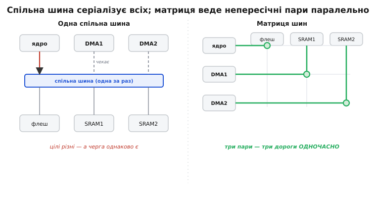
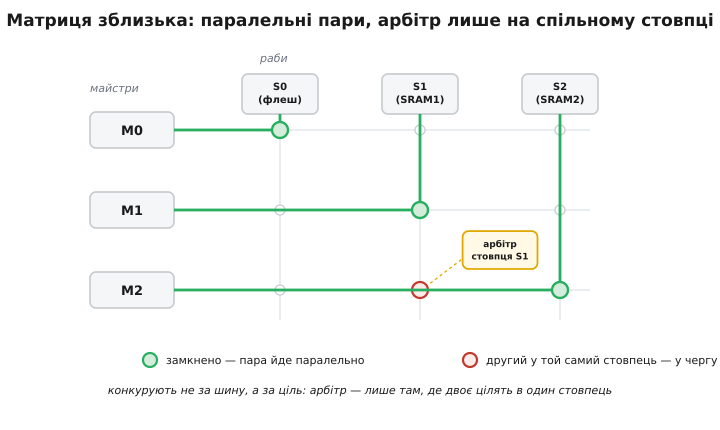

# Матриця шин (bus matrix)

Усередині сучасного мікроконтролера рахують не одне ядро й возять дані не один DMA. Уявімо буденну мить: ядро вибирає інструкцію з флеш-пам'яті, DMA переливає блок з АЦП у SRAM, а другий DMA виштовхує кадр із іншої SRAM у дисплей. Три майстри (той, хто сам починає звертання на шині), три різні цілі. Якби всі троє висіли на **одній спільній шині**, вона фізично веде одну транзакцію за раз — тож двоє неминуче стояли б у черзі до [арбітра](root:hw-arch/bus-arbitration), хоча жоден не заважає іншому: вони ж звертаються до **різних** блоків пам'яті. Смуга простоює не тому, що її бракує, а тому, що дорога до всіх цілей одна.

Ось де народжується інша ідея. А що, коли не змушувати трьох ділити один провід, а прокласти **окрему дорогу від кожного майстра до кожної цілі** — і пускати їх одночасно, поки вони не сходяться в тій самій точці? Саме цю конструкцію й називають **матрицею шин** (англ. *bus matrix*), або **кросбаром** (англ. *crossbar* — «перехресна планка», від телефонних комутаторів, де контакти стояли на перетині рядків і стовпців). Замість однієї шини на всіх — ґратка з'єднань: рядки — майстри, стовпці — раби (цілі: банк SRAM, флеш, порт периферії), а на кожному перетині — комутатор, що за потреби змикає цей рядок із цим стовпцем.


*Дві відповіді на те саме питання. Ліворуч — спільна шина: усі майстри сходяться в одну точку, арбітр пускає одного, решта простоює навіть тоді, коли їхні цілі різні. Праворуч — матриця: кожен майстер має свій рядок, кожен раб — свій стовпець, а на перетинах — комутатори. Поки трійка звертається до трьох різних стовпців (флеш, SRAM1, SRAM2), усі три дороги працюють **паралельно** — черги немає взагалі.*

## Чому одна шина стає вузьким горлом

Щоб оцінити виграш матриці, треба спершу побачити, що саме програє спільна шина. Її біда не в швидкості проводів, а в **топології**: усі майстри й усі раби зведені до одного набору дротів, тож у кожну мить активна рівно одна пара «хтось → хтось». Додаєш другого DMA — і пропускна здатність не подвоюється, вона **ділиться**: два потоки, що фізично не перетинаються (кожен у свою SRAM), однаково стають у чергу, бо чергу диктує не ціль, а сам факт спільного дроту.

Це принципова межа, і полагодити її кращим арбітром не можна. Хоч який розумний [суддя](root:hw-arch/bus-arbitration/hist-daisy-chain.md), він розподіляє **один** ресурс — і його робота лише в тому, щоб чесно вирішити, чий зараз хід; він не здатен пустити двох одночасно, бо дорога одна. Виходить абсурдна картина: кристал напханий швидкою пам'яттю в кількох незалежних банках, а користуватися ними по-справжньому паралельно не виходить, бо між усіма стоїть єдина шина-пляшкове горло.

> 🔧 **Навіщо це.** Коли на платі з одним спільним внутрішнім зв'язком вмикають DMA поряд із роботою ядра, профіль часу раптом «плаває»: ядро то летить, то спотикається — і винен не код, а те, що воно ділить єдину дорогу з DMA. На кристалі з матрицею та сама пара живе спокійно, поки ядро й DMA ходять у різні банки пам'яті. Тому, читаючи даташит, варто одразу знайти схему внутрішнього зв'язку: одна шина з арбітром чи матриця — це прямо визначає, чи можна в цій системі рахувати й возити дані по-справжньому одночасно.

## Ґратка: рядки-майстри, стовпці-раби

Матриця розв'язує вузьке горло тим, що **розмножує дороги**. Кожен майстер дістає власну лінію (рядок ґратки), кожен раб — власну (стовпець). Комутатор на перетині рядка `i` та стовпця `j` уміє одне: коли майстер `i` хоче звернутися до раба `j`, зімкнути саме цей перетин, з'єднавши їхні дроти адреси й даних. Уся матриця — це набір таких перемикачів; скільки одночасних, непересічних пар «майстер → раб» вони можуть замкнути, стільки транзакцій і йде водночас.

Ключове слово тут — **непересічних**. Дві пари не заважають одна одній, поки вони не діляться ані рядком, ані стовпцем: різні майстри до різних рабів — цілком паралельно. Конфлікт виникає лише в одній-єдиній ситуації — коли **два майстри цілять в той самий стовпець**, тобто в того самого раба. Тоді на вході цього стовпця (і тільки його) вмикається маленький [арбітр](root:hw-arch/bus-arbitration), який вирішує, чий доступ пропустити першим. Матриця не прибирає арбітраж узагалі — вона **зводить його до точки реального суперництва**: один арбітр на стовпець, а не один на всю систему.


*Матриця зблизька. Рядки — майстри, стовпці — раби, кружечки на перетинах — комутатори. Три зелені перетини — три пари, замкнені **одночасно**, бо кожна у свій стовпець: жодного суперництва. А коли в один стовпець (S1) цілять двоє (M1 і M2), на вході саме цього стовпця прокидається арбітр — він, і лише він, ставить одного в чергу. Уся інша ґратка тим часом працює без затримки.*

Звідси й головна теза, яку варто закарбувати: **у матриці конкурують не за шину, а за ціль**. Поки майстри звертаються до різних рабів — вони незалежні; черга виникає точково, лише перед спільною ціллю. Це прямо протилежно спільній шині, де черга виникає завжди, тільки-но заговорили двоє, незалежно від того, куди.

## Скільки коштує матриця й де межа

Дарма нічого не буває. Матриця N майстрів × M рабів — це, грубо, N×M комутаторів плюс арбітр і мультиплексор на кожен стовпець. Площа кристала й складність розведення ростуть як **добуток** сторін: подвоїв кількість майстрів і рабів — учетверо більше перетинів. Тому повну, «усі з усіма», матрицю будують лише там, де паралелізм справді потрібен; в іншому вона палила б вентилі й місце ні за що.

Через цю ціну реальні чипи майже ніколи не роблять матрицю **повною**. Дивишся на схему зв'язку в даташиті — і бачиш, що не кожен майстер дотягується до кожного раба: деякі перетини просто не розведені. Зроблено це свідомо: якщо певний DMA за задумом ніколи не звертається до певного банку, комутатор на тому перетині — мертвий вентиль, і його прибирають. Виходить **розріджена** матриця (англ. *sparse crossbar*) — дешевша, але з обмеженням: пари, чийого перетину немає, крізь матрицю просто не проходять. Саме тому в описі системи трапляється фраза на кшталт «цей майстер бачить лише ці ділянки пам'яті» — це не примха, а видимий слід прибраних перетинів.

Є й другий, тонший компроміс — між **портами й доменами**. Швидка матриця (як-от на [AXI](root:hw-arch/bus-matrix/hist-amba.md)) складна: кожен її порт несе повну логіку інтерфейсу з конвеєром звертань і чергами. Причепити повноцінний матричний порт до дрібної периферії — марнотратство: UART чи GPIO не потребують ані паралельних доріг, ані пакетів. Тому периферію не садять у матрицю прямо, а зводять на просту повільну шину за [мостом](root:hw-arch/ahb-apb-bus): матриця з'єднує лише «важкоатлетів» — ядра, банки пам'яті, DMA, — а дрібнота живе окремо, в іншому дворі. Матриця дає паралелізм там, де він окупається, і не платить за нього там, де він зайвий.

## Як це працює в коді: паралельно, поки цілі різні

Абстракція стане відчутною, щойно перекласти її в звичну для прошивки ситуацію. Хай ядро крутить обчислення над масивом у банку `SRAM1`, а DMA тим часом переливає свіжі відліки з АЦП у **інший** банк — `SRAM2`. На кристалі з матрицею ці двоє звертаються до різних стовпців, тож ідуть **одночасно**: DMA возить, ядро рахує, ніхто нікого не гальмує.

```c
#include <stdint.h>

/* Два РІЗНІ банки пам'яті — різні стовпці матриці шин */
static uint8_t buf_a[4096] __attribute__((section(".sram1")));  /* тут працює ядро */
static uint8_t buf_b[4096] __attribute__((section(".sram2")));  /* сюди возить DMA */

/* DMA залив нові дані у buf_b (стовпець SRAM2), поки ядро
   обробляє buf_a (стовпець SRAM1). Різні цілі → матриця веде
   обидві транзакції паралельно, без черги перед арбітром. */
uint32_t process(void) {
    uint32_t acc = 0;
    for (int i = 0; i < (int)sizeof buf_a; i++)
        acc += buf_a[i];          /* ядро → SRAM1 */
    return acc;                   /* тим часом DMA → SRAM2 незалежно */
}
```

А тепер зламаймо ідилію одним рядком — покладімо робочий буфер ядра й приймальний буфер DMA в **той самий банк**. Логіка коду не змінилась, але фізика — так: обидва майстри тепер цілять в один стовпець, і на його вході прокидається арбітр. Паралелізм зникає, з'являється черга, і час обробки «плаває» залежно від того, наскільки жадібно DMA займає спільний банк.

```c
#include <stdint.h>

/* Обидва буфери — в ОДНОМУ банку: один стовпець матриці */
static uint8_t buf_a[4096] __attribute__((section(".sram1")));  /* ядро */
static uint8_t buf_b[4096] __attribute__((section(".sram1")));  /* DMA — той самий банк! */

/* Тепер ядро й DMA конкурують за один стовпець SRAM1.
   Арбітр стовпця чергує доступи — обробка сповільнюється саме тоді,
   коли активний DMA. Той самий код, що вище, але вже НЕ паралельний. */
```

Різниця між двома фрагментами — не в жодному рядку логіки, а в тому, **де лежать дані**. Це і є практична суть матриці: розкладеш гарячі потоки по різних банках — вони поїдуть одночасно; зіштовхнеш в один банк — впораєшся об арбітр стовпця. Тому в прошивках під матрицю розміщення буферів у пам'яті — це не косметика, а свідоме керування паралелізмом.

> 🔧 **Навіщо це.** Класична пастка на кристалі з матрицею: DMA дисплея й ядро сидять у тій самій SRAM, і кадри періодично «підвисають», хоча смуги начебто вистачає. Лікують не прискоренням ядра, а **рознесенням буферів по різних банках** — тоді DMA й ядро перестають ділити стовпець і йдуть паралельно. Це видно з лінкер-скрипта, а не з алгоритму: пів справи продуктивності на таких чипах — правильно розкласти дані по банках пам'яті.

## Що арбітр стовпця робить, а чого — ні

Варто чітко відділити дві ролі, які легко сплутати. [Арбітр](root:hw-arch/bus-arbitration) у матриці нікуди не подівся — але його повноваження **звузилися до одного стовпця**. Він судить лише тих майстрів, що саме зараз цілять у цього конкретного раба; до решти системи йому байдуже. Тому в матриці не один арбітр «на все», а стільки маленьких арбітрів, скільки рабів, і кожен прокидається, тільки коли перед його стовпцем справді збіглися двоє.

Правило, за яким він судить, — знову ж таки [карусель або фіксований пріоритет](root:hw-arch/bus-arbitration), як у будь-якого арбітра шини; матриця тут нічого нового не додає, вона лише **локалізує** місце суперництва. Практичний наслідок цього звуження приємний: підняти пріоритет критичного майстра перед одним банком можна, не зачіпаючи його доступ до інших, — бо кожен стовпець судять окремо. На спільній шині такого важеля немає: там пріоритет глобальний, він діє на всі звертання разом.

Є й тонка межа, про яку варто пам'ятати. Матриця усуває чергу за **дорогу**, але не здатна усунути чергу за **ціль**: якщо два майстри фізично звертаються до одного банку одночасно, один із них однаково зачекає — інакше зіпсуються рівні на спільних дротах цього стовпця. Іншими словами, матриця робить паралельним усе, що можна зробити паралельним, і чесно серіалізує лише те, що серіалізувати доводиться за фізикою. Більшого від неї вимагати марно: два записи в одну й ту саму комірку одночасно не мають сенсу, хоч яка розкішна ґратка.

## Що з цього тримати в голові

Спільна шина програє не швидкістю, а топологією: усі майстри й раби зведені до однієї дороги, тож будь-які двоє, хай навіть із незалежними цілями, стають у чергу до єдиного арбітра. Матриця шин розв'язує це, **розмножуючи дороги**: рядки — майстри, стовпці — раби, на перетинах — комутатори, і скільки непересічних пар «майстер → раб» вони змикають, стільки транзакцій іде водночас. Черга в матриці виникає точково — лише коли двоє цілять в один стовпець, — і саме там, на вході стовпця, сидить маленький арбітр; конкурують не за шину, а за ціль. Платить за це матриця площею, що росте як добуток сторін, тож реальні чипи роблять її розрідженою (не кожен майстер бачить кожного раба) і не заводять у неї дрібну периферію — та живе за мостом на повільній шині. А для прошивки з усього цього випливає один різкий висновок: на кристалі з матрицею продуктивність вирішує **розкладка даних по банках пам'яті** — гарячі потоки в різні банки їдуть паралельно, зіштовхнуті в один банк упираються об арбітр стовпця. Уся ця конструкція — не самоціль, а частина стандарту ARM [AMBA, що доріс від однієї шини до матричних інтерконектів](root:hw-arch/bus-matrix/hist-amba.md), коли одного спільного дроту системам стало замало.
