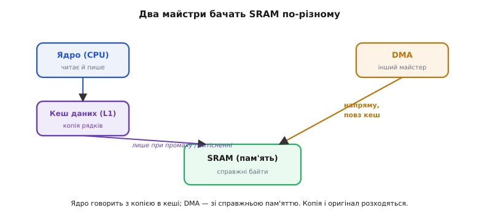
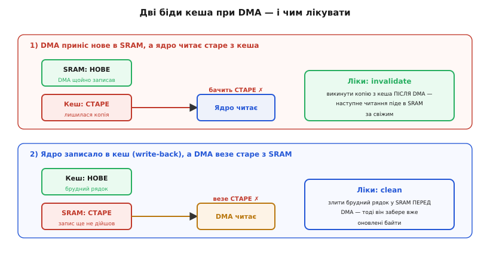
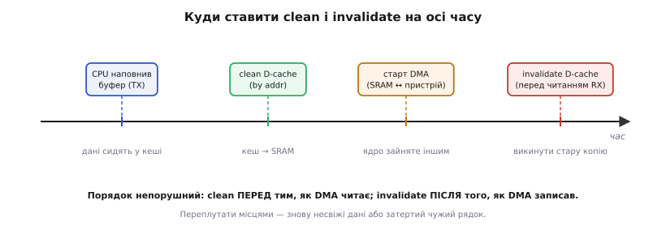

# Кеш-коерентність у мікроконтролері

Уяви звичайну сцену з прошивки: ти налаштував [прямий доступ до пам'яті](topic:hw-arch/dma) так, щоб він сам, без участі ядра, вичитав пакет з інтерфейсу в буфер у SRAM. DMA відпрацював, підняв прапорець «готово», ти читаєш буфер — а там половина старого сміття або взагалі нулі. Код правильний до останньої коми. Той самий проєкт на дрібнішому чипі працював роками. А тут — наче дані ходять окремими дорогами й десь розминаються.

Так воно і є. На потужнішому мікроконтролері (як-от ядро Cortex-M7) між процесором і пам'яттю з'явився **кеш** — маленька швидка копія гарячих даних упритул до ядра. І щойно поряд з ядром до тієї самої пам'яті починає ходити **ще один майстер** (DMA, другий процесор, контролер периферії), виникає підступна річ: ядро дивиться у свою копію в кеші, а інший майстер — у справжню пам'ять, і ці двоє бачать різне. Узгодженість того, що бачать усі учасники, називають **когерентністю кеша** (лат. *cohaerentia* — зчепленість, злагодженість). У великих процесорах її стереже спеціальне залізо. У мікроконтролері — здебільшого ти сам, руками, з коду.

> 🔧 **Навіщо це.** Це чи не найпідступніший клас багів у сучасній прошивці: код бездоганний, а дані «псуються» лише коли ввімкнено кеш і працює DMA. Хто розуміє механізм, ставить дві правильні операції в двох правильних місцях — і баг зникає назавжди. Хто не розуміє — вимикає кеш «щоб працювало» і викидає в кошик ту саму продуктивність, заради якої кеш і ставили.

## Дві дороги до однієї пам'яті

Розберімо корінь від початку. У найпростішому мікроконтролері ядро говорить з пам'яттю напряму: попросило байт за адресою — [контролер пам'яті](topic:hw-arch/memory-controller) віддав його з мікросхеми. Одна пам'ять, одна правда; хто б до неї не звернувся — ядро чи DMA — бачить те саме. Проблеми когерентності тут просто не існує.

Кеш ламає цю простоту в обмін на швидкість. Звертатися в SRAM щоразу — повільно (десятки тактів), тож ядро тримає копії найгарячіших [рядків пам'яті](topic:hw-arch/memory-hierarchy) (англ. *cache line*, типово 32 байти) у крихітній надшвидкій пам'яті поруч із конвеєром. Читаєш адресу, копія якої вже в кеші, — відповідь за такт-два, у саму SRAM ядро й не потикається. Це **влучання** (англ. *cache hit*). Виграш величезний — але з'явилася **друга копія тих самих даних**, і тепер їх дві: оригінал у SRAM і копія в кеші.

Поки з пам'яттю працює лише ядро, дві копії не сваряться: кеш — прозорий посередник, ядро завжди бачить свіже, бо саме через кеш і ходить. Правда рветься, коли до **тієї самої SRAM** приходить **інший майстер шини**, який кеша ядра не бачить і бачити не мусить. Найтиповіший такий майстер — DMA: він возить дані між периферією і пам'яттю власною дорогою, повз кеш ядра, бо в тому й сенс — розвантажити ядро. Виходить дві незалежні дороги до одних байтів: ядро — через кеш, DMA — просто в SRAM.


*Ядро розмовляє з копією в кеші; DMA — зі справжньою пам'яттю. Поки обидва лише читають те, що не міняється, все гаразд. Щойно один щось записав — копія й оригінал розходяться, і другий майстер цього не помічає.*

Ключ до всієї теми — усвідомити: кеш **невидимий** для DMA, а SRAM «застаріла» **для ядра**. Ніхто зі стін не бреше; просто кожен дивиться у своє дзеркало, а дзеркала більше не однакові.

## Чому записи роблять усе гіршим: політика write-back

Якби кеш лише читав, біда була б половинчаста. Але ядро ще й **пише**, і тут вирішальну роль грає політика, за якою записи потрапляють (чи не потрапляють) у SRAM.

Кеш даних Cortex-M7 у звичайній області пам'яті працює за політикою **зворотного запису** (англ. *write-back*): коли ядро пише в адресу, чий рядок лежить у кеші, воно оновлює **лише копію в кеші** й позначає рядок «брудним» (англ. *dirty* — змінений відносно пам'яті). У SRAM цей запис **не йде одразу**. Він доходить туди пізніше й не за розкладом програми — лише коли рядок доведеться **витіснити** (англ. *evict*), звільняючи місце під інший, або коли ти явно накажеш його злити. Це швидко (запис не чекає повільної пам'яті) — але означає, що **між моментом запису й моментом, коли байт реально ляже в SRAM, минає невизначений час**.

Протилежна політика — **наскрізний запис** (англ. *write-through*): кожен запис одразу дублюється в SRAM. Тоді пам'ять завжди свіжа для читачів ззовні, зате кожен запис платить за похід у повільну пам'ять, і сенс кеша на записах тане. Cortex-M7 дозволяє вибрати політику для області пам'яті через [блок захисту пам'яті](topic:hw-arch/mpu-cortex-m) (англ. *Memory Protection Unit*, MPU — вузол, що задає права й атрибути кешування для ділянок адрес), але за замовчуванням гаряча SRAM — саме write-back, бо він швидший. А отже, брудний рядок у кеші й черствий байт у SRAM — норма, з якою треба вміти жити.

Складімо два факти — «дві дороги» і «write-back» — і побачимо, звідки беруться рівно **дві** біди.

## Дві біди — і як їх звати

**Біда перша: ядро читає несвіже (типово після приймання по DMA).** DMA привіз новий пакет і поклав його в SRAM. Але для тих самих адрес у кеші ядра лежить **стара копія** з минулого разу. Ядро читає буфер — і потрапляє у **влучання по застарілому рядку**: бачить старе, а не те, що приніс DMA. Пам'ять свіжа, кеш черствий.

**Біда друга: DMA везе несвіже (типово перед передаванням по DMA).** Ядро наповнило буфер у пам'яті — але через write-back свіжі байти осіли **лише в кеші**, помічені брудними, а в SRAM ще лежить старе. Ти запускаєш DMA на передавання з цього буфера — і DMA читає **застарілу SRAM**, бо про брудний рядок у кеші він не знає. Кеш свіжий, пам'ять черства.


*Дві дзеркальні біди й дві дзеркальні операції-ліки. Угорі свіже в пам'яті, черстве в кеші — треба викинути копію (invalidate). Унизу свіже в кеші, черстве в пам'яті — треба злити копію (clean). Плутанина, який бік свіжий, — головна причина цих багів.*

Обидві біди — це той самий розлад «копія розійшлася з оригіналом», просто з різних боків. І ліки теж дзеркальні, їх рівно два.

## Два ліки: clean і invalidate

Кеш-майнтененс (англ. *cache maintenance* — обслуговування кеша) — це набір операцій, якими ти вручну примирюєш копію з оригіналом. По суті їх дві, і назви кажуть самі за себе.

**Clean (злити)** — «запиши всі брудні рядки цієї області в SRAM». Після clean пам'ять наздогнала кеш: те, що ядро понаписувало в копію, реально лягло в SRAM. Лікує другу біду: **clean роблять перед тим, як DMA читатиме буфер**, щоб DMA забрав уже оновлені байти, а не черстві.

**Invalidate (знедійснити)** — «викинь копії рядків цієї області з кеша, познач їх недійсними». Після invalidate наступне читання цих адрес **промахнеться повз кеш** і піде за свіжим у SRAM. Лікує першу біду: **invalidate роблять після того, як DMA записав буфер**, щоб ядро перечитало пам'ять, а не старий кеш.

І комбінована **clean+invalidate** — спершу злити брудне в пам'ять, потім викинути копію; потрібна, коли той самий буфер по черзі і пишеться ядром, і перезаписується DMA.

Час — частина рецепта не менша за саму операцію. Порядок непорушний.


*Clean — ПЕРЕД тим, як DMA читає буфер (щоб віддати свіже); invalidate — ПІСЛЯ того, як DMA записав буфер (щоб забрати свіже). Переставиш місцями — злиття затре щойно прийняте, а знедійснення викине те, чого ще не злив.*

На ядрах Cortex-M ці операції дає стандартний рівень доступу до системного блока керування (CMSIS, набір заголовків від виробника ядра). Функції адресні — щоб чіпати лише свій буфер, а не гатити весь кеш:

```c
// TX: ядро наповнило tx_buf → злити в SRAM → тоді пускати DMA на передавання
SCB_CleanDCache_by_Addr((uint32_t *)tx_buf, sizeof(tx_buf));
dma_start_tx(tx_buf, sizeof(tx_buf));

// RX: DMA записав rx_buf → знедійснити копію → тоді читати з пам'яті
// (invalidate — уже ПІСЛЯ того, як прийшло переривання «DMA завершив»)
SCB_InvalidateDCache_by_Addr((uint32_t *)rx_buf, sizeof(rx_buf));
uint8_t first = rx_buf[0];   // тепер це справді те, що приніс DMA
```

Одна деталь тут не косметична, а обов'язкова. Кеш живе **рядками по 32 байти** й обслуговує пам'ять теж рядками — окремий байт викинути не можна, лише цілий рядок. Тому буфер під DMA має **починатися на межі 32 байтів і мати розмір, кратний 32**. Інакше invalidate зачепить сусідній рядок, у якому лежить **чужа змінна**, і викине з кеша її свіжу копію — вилікуєш один баг, посієш другий, ще підступніший.

**Приклад: чому вирівнювання рятує від псування сусіда.**

```c
// НЕБЕЗПЕЧНО: буфер не вирівняний, ділить рядок кеша з лічильником
uint8_t  rx_buf[40];      // 40 не кратне 32; адреса довільна
volatile uint32_t ticks;  // цілком може лягти в той самий 32-байтний рядок

// invalidate по rx_buf зачепить увесь рядок → викине й свіже значення ticks

// БЕЗПЕЧНО: власний рядок, нікого поруч
uint8_t rx_buf[64] __attribute__((aligned(32)));  // 64 = 2×32, старт на межі
```

Порахуймо, чому саме 32 і чому кратність. Рядок кеша — 32 байти, тож його адреса завжди кратна 32 (молодші 5 бітів адреси — нульові, бо 2⁵ = 32). Операція invalidate працює **по рядках цілком**: дай їй будь-яку адресу всередині рядка — постраждає весь рядок від його початку до +31. Якщо буфер починається не на межі, його перший рядок «висить» одним краєм у чужих даних; якщо розмір не кратний 32 — те саме з останнім рядком. Вирівняли старт на 32 і взяли розмір, кратний 32, — межі буфера збіглися з межами рядків, і жоден сусід у гру не втягнутий.

## Чому мікроконтролер не робить це сам

Тут природно спитати: великі процесори кишать ядрами й кешами, а такого мороку з ручним clean/invalidate у прикладному коді не видно. Чому мікроконтролеру не дали того самого автомата?

Бо автомат коштує заліза, а мікроконтролер його економить. У багатоядерному процесорі кеші **самі підслуховують** спільну шину (англ. *snooping* — підслуховування): щойно один майстер пише в адресу, копії якої тримають інші кеші, ті це чують і на льоту оновлюють або викидають свої копії. Найвідоміша схема таких правил — **протокол MESI** (за чотирма станами рядка: Modified, Exclusive, Shared, Invalid), відомий також як [«іллінойський протокол» за місцем народження](topic:hw-arch/cache-coherency-mcu/hist-mesi-illinois.md). Він робить когерентність невидимою: прикладний код нічого не зливає руками, залізо стежить саме.

Але це залізо велике й енергоємне: кожен кеш мусить порівнювати чужі адреси зі своїм умістом на кожній транзакції шини. Мікроконтролер б'ється за кожен міліват і кожен квадратний міліметр кристала, і його типовий сценарій — **одне ядро плюс кілька DMA**, а не купа рівноправних ядер. Ставити повний апарат підслуховування заради ядра-одинака й пари каналів DMA невигідно. Тож інженери зробили чесний розмін: **залізо дешевше, зате когерентність DMA — на совісті програміста**. Дві операції у двох місцях — невисока ціна за кеш, який в усьому іншому працює сам.

(Межа розмита: частина сучасніших мікроконтролерів уже має острівці апаратної когерентності для окремих майстрів — але за замовчуванням і на найпоширеніших Cortex-M7 діє саме ручний режим, і саме його треба знати.)

## Ще два способи прибрати проблему — і чому вони гірші

Раз проблема з кешем, спокуса — просто його прибрати. Такі шляхи є, і в них своя ціна.

**Некешована область під буфери DMA.** Через MPU можна оголосити шматок SRAM «пристроєвим» або некешованим — тоді ядро ходить туди повз кеш, копій не виникає, а DMA й ядро завжди бачать те саме. Жодного clean/invalidate. Ціна: ядро втрачає швидкість кеша **на цих даних** — кожне звернення до буфера йде в повільну SRAM. Для нечастих або невеликих буферів це чудовий, надійний вибір; для гарячого потоку, який ядро ще й активно жує, — дорого.

**Наскрізний запис (write-through) на область буферів.** Тоді хоча б друга біда (DMA везе несвіже) зникає сама: кожен запис ядра одразу в SRAM, для DMA-читача пам'ять завжди свіжа, clean не потрібен. Але перша біда лишається: після DMA-**запису** ядро все одно тримає стару копію, і invalidate нікуди не дівається. Тобто write-through прибирає половину проблеми ціною сповільнення записів — компроміс на любителя.

Найповніше вимкнути кеш узагалі — і разом з ним викинути всю продуктивність, заради якої ставили Cortex-M7 замість дешевшого ядра. Це «лікування» гільйотиною: баг зникне разом із сенсом чипа. Тому робочий шлях у більшості прошивок — **лишити кеш увімкненим і ставити два ручні ліки в двох правильних місцях**, а некешовану область берегти для випадків, де ручна дисципліна надто крихка.

## Складаємо картину

Когерентність кеша в мікроконтролері — це не якась окрема підсистема, а **наслідок двох простих фактів**, помножених один на одного. Факт перший: кеш створює **другу копію** даних, невидиму для інших майстрів шини. Факт другий: write-back дозволяє цій копії й оригіналу в SRAM **розходитися в часі**. Разом вони й дають дві дзеркальні біди — ядро читає черстве після приймання, DMA везе черстве перед передаванням.

Ліки теж рівно два й теж дзеркальні: **clean** зливає кеш у пам'ять (перед тим, як DMA читатиме), **invalidate** викидає копію з кеша (після того, як DMA записав), і обидва — лише по вирівняному на 32 байти буфері, щоб не зачепити сусіда. Великий процесор робить це саме через підслуховування шини (MESI); мікроконтролер заради економії заліза перекладає обов'язок на тебе. А хто зрозумів, з якого боку зараз лежить свіже, той ніколи не переплутає, що ставити — clean чи invalidate, — і поверне собі і кеш, і спокій. Повний драйвер кільцевого буфера з DMA, де ці операції розставлені по місцях разом з обробкою переривань, розібрано [в окремому робочому прикладі](topic:hw-arch/cache-coherency-mcu/proj-dma-ring-buffer.md).
