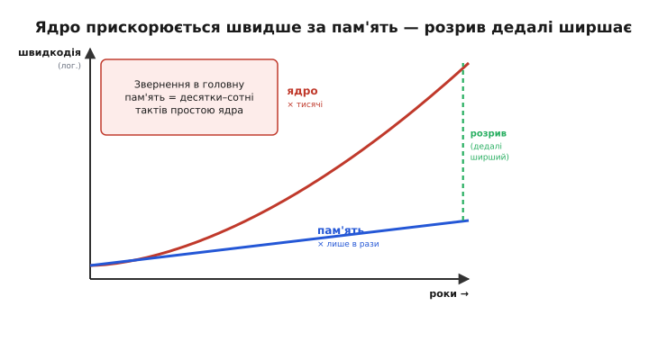
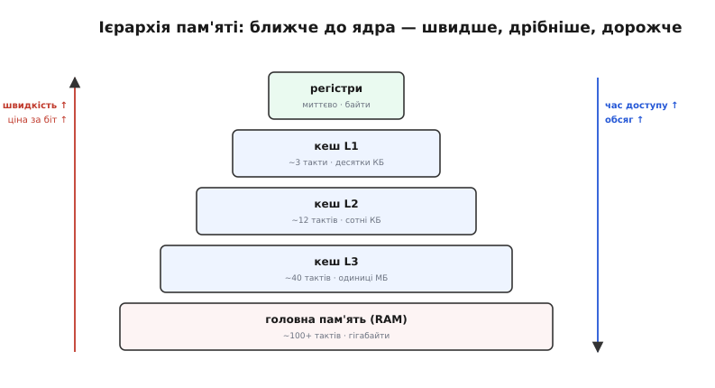
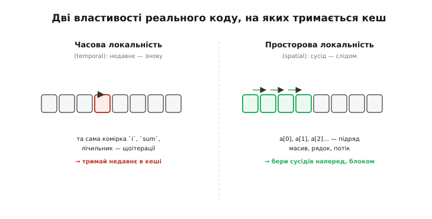
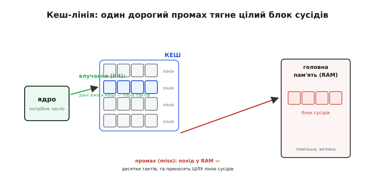
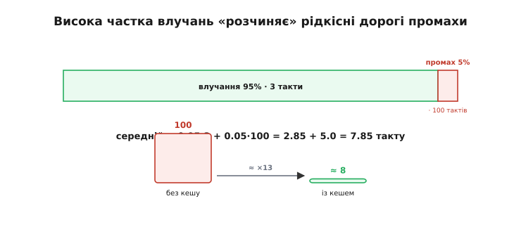
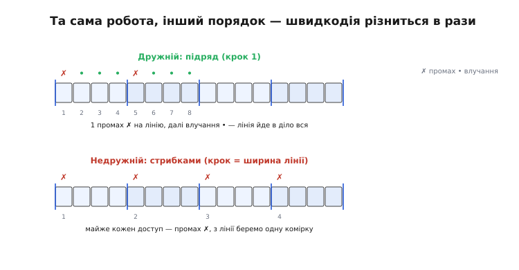

# Кеш

Уся розвилка [RISC проти CISC](root:embedded/risc-cisc) має одну мету — щоб ядро виконувало команди якнайшвидше: прості однакові кроки, гладкий конвеєр, CPI близько одиниці. Та є прикра обставина, що раз по раз зводить нанівець усі ці зусилля, і вона зринає скрізь — у [«вузькому місці фон Неймана»](root:hw-arch/processor-parts), у простоях команди `LOAD`, у [заторах конвеєра](root:hw-arch/pipeline). Назвімо її прямо: пам'ять не встигає за ядром. Ядро навчилося рахувати блискавично, а от **діставати** числа з пам'яті лишилося повільним — і ось ядро, здатне на мільярди дій за секунду, тупо стоїть і чекає, поки приповзе чергове число. Ця тема — про те, звідки взявся цей розрив, чому не можна просто зробити всю пам'ять швидкою, і про дотепний обхідний хід, яким його приборкують: **кеш** (від французького *cache* — «схованка», запас під рукою). Розберемо, що таке ієрархія пам'яті, чому кеш узагалі може працювати (локальність), як він влаштований у дії (лінії, влучання й промахи) — і чому через нього **порядок**, у якому ваш код торкається даних, може змінити швидкодію в рази.

### Розрив швидкостей: ядро мчить, пам'ять пасе задніх

Корінь усього в тому, що **швидкодія ядер і швидкість пам'яті росли різними темпами**. Без цієї обставини кеш виглядав би дивним ускладненням нізащо — тож із неї й почнімо.


*За десятиліття швидкодія процесорних ядер зросла в тисячі разів, а швидкість доступу до головної пам'яті — лише в рази. Криві розходяться, і прірва між ними дедалі ширшає; цей розрив так і звуть — «стіна пам'яті» (*memory wall*). Наслідок: одне звернення до головної пам'яті коштує ядру десятки, а то й сотні тактів простою — те саме [«вузьке місце»](root:hw-arch/processor-parts), тільки в усій гостроті.*

Вдумаймося, наскільки це боляче. Ядро на 240 МГц встигає виконати просту команду за лічені такти — але якщо для неї треба число з головної пам'яті, по нього доводиться **йти**, і цей похід триває десятки тактів. Усе, що вигадали для швидкості — конвеєр, RISC, висока частота, — захлинається, щойно ядро впирається в очікування даних. Навіть [конвеєр](root:hw-arch/pipeline) тут безсилий: він уміє перекривати роботу, та якщо потрібного числа ще немає, перекривати **нíчим** — конвеєр просто стає. Виходить парадокс: ми відшліфували ядро до блиску, а воно більшу частину часу могло б простоювати в очікуванні повільної пам'яті.

Напрошується наївне питання: то чому б не зробити **всю** пам'ять такою ж швидкою, як ядро? Відповідь — у фізиці й економіці. Дуже швидка пам'ять виходить **дорогою** і через те **малою** (її роблять із прудких, але ненажерливих до місця й грошей комірок); велика й дешева пам'ять — навпаки, **повільна**. Хочеться неможливого: пам'яті водночас великої, швидкої й дешевої. Прямо це не виходить — і саме тут інженери зробили хитрий хід убік.

### Рішення — ієрархія пам'яті

Якщо не можна зробити всю пам'ять і великою, і швидкою, то можна **схитрувати**: поставити **кілька** пам'ятей різного калібру одна за одною — і тримати найгарячіші дані в найшвидшій.


*Ієрархія пам'яті (*memory hierarchy*): що ближче до ядра, то швидше, дрібніше й дорожче. На вершині — [**регістри**](root:hw-arch/processor-parts), миттєві, але їх жменя. Нижче — **кеш**: L1 (крихітний, майже миттєвий), L2 (більший, трохи повільніший), L3 (ще більший). В основі — велика повільна **головна пам'ять** (RAM). Числа орієнтовні, та головне видно: від вершини до основи час доступу росте в десятки разів, а обсяг — у тисячі.*

Ось у чому суть. **Кеш** — це невелика, але дуже швидка пам'ять-посередник між ядром і повільною головною пам'яттю, куди складають **копії** даних, якими ядро користується просто зараз. Працює ця піраміда просто: ядро спершу шукає потрібне на найшвидшому рівні (L1); не знайшло — спускається на L2, тоді на L3, і лише як ніде немає — аж тоді йде в повільну головну пам'ять. Оскільки переважна більшість звернень знаходить дані вже на верхніх, швидких рівнях, ядро здебільшого **не чекає**, і повільна головна пам'ять смикається рідко.

Зверніть увагу: це той самий принцип, що й у [регістрах](root:hw-arch/processor-parts) — тримати гаряче під рукою, а холодне далеко. Регістри — це, по суті, **вершина** цієї піраміди, найшвидша її сходинка. Кеш просто додає між регістрами й головною пам'яттю **проміжні** сходинки, щоб падіння швидкості від ядра до пам'яті було не різким обривом, а пологими щаблями. Але вся ця конструкція трималася б на піску, якби не одна щаслива властивість реальних програм.

### Чому кеш узагалі працює: локальність

Тут постає законне сумнівне питання. Кеш малий — у нього влізе мізерна частка даних. Якби ядро зверталося до пам'яті **навмання**, по всьому її простору, то потрібне майже завжди було б **не** в кеші, і вся витівка не мала б сенсу. Кеш рятує лише тому, що реальні програми поводяться зовсім не випадково.


*Дві закономірності реального коду. **Часова локальність** (*temporal locality*): до чого зверталися недавно, скоро знадобиться знову — як лічильник `i` чи сума `sum`, що їх чіпають кожної ітерації циклу. **Просторова локальність** (*spatial locality*): якщо взяли якусь комірку, скоро візьмемо **сусідню** — як при обході масиву `a[0], a[1], a[2]…` по порядку. Саме ці дві властивості й роблять кеш дієвим.*

Назвімо ці дві властивості на ім'я, бо вони — фундамент усього. Сам термін **локальність** (від латинського *locus* — «місце») означає просто: звертання **купчаться** в часі та просторі, а не розсіяні рівномірно. **Часова локальність**: якщо ядро щойно звернулося до якоїсь комірки, велика ймовірність, що воно звернеться до неї **знову** найближчим часом. Так буває постійно: змінна циклу, накопичувач суми, лічильник — їх торкаються раз за разом. Звідси проста стратегія для кешу: **що недавно брали — те й тримай**, бо його, найпевніше, попросять ще. **Просторова локальність**: якщо ядро взяло якусь комірку, велика ймовірність, що скоро воно візьме її **сусідку**. Так буває щоразу, коли програма йде масивом, рядком тексту чи списком підряд. Звідси друга стратегія: коли вже йдемо в повільну пам'ять по одне число, **прихопімо заразом і його сусідів** — вони, найпевніше, знадобляться слідом.

Підкреслимо чесно: локальність — це не залізний закон, а **спостережена закономірність** того, як влаштований типовий код. Можна написати програму, що зухвало скаче по всій пам'яті й нищить будь-яку локальність — і тоді кеш справді не зарадить. Але такі програми рідкісні; переважна більшість реального коду — глибоко локальна, бо цикли, масиви й послідовна обробка є скрізь. Саме на цю властивість і робить ставку кеш — і ставка майже завжди виграє. Лишається побачити, **як** конкретно він обертає локальність на швидкість.

### Як кеш працює: лінії, влучання й промах

Тепер зведімо разом ієрархію й локальність — і подивімося на сам механізм. Дві щойно названі стратегії втілені в кеші напрочуд прямо.


*Кеш зберігає копії гарячих блоків головної пам'яті у **кеш-лініях** (*cache lines*) — кожна лінія тримає не одну комірку, а цілий блок **сусідніх** (це і є втілення просторової локальності; типова лінія — 64 байти). Коли ядру треба число, його шукають у кеші. Є там — **влучання** (*hit*): дані віддаються за пару тактів, ядро не чекає. Нема — **промах** (*miss*): доводиться йти в повільну головну пам'ять, але приносять звідти не одне число, а **цілу лінію** сусідів — і кладуть її в кеш.*

Розберемо два ключові поняття. **Влучання** (*cache hit*, від англ. *hit* — «влучити, попасти») — це коли потрібні дані вже лежать у кеші: ядро дістає їх майже миттєво, без походу в повільну пам'ять. **Промах** (*cache miss*, від англ. *miss* — «промахнутися, не застати») — коли в кеші їх немає: тоді ядро змушене йти в головну пам'ять, і це ті самі десятки тактів простою. Здавалося б, промах усе псує — але придивіться до тонкощі: з пам'яті приносять не саме запитане число, а **цілу кеш-лінію** — блок сусідніх комірок навколо нього. Це і є фокус, що перетворює просторову локальність на виграш: заплативши **один раз** за дорогий похід по лінію, ядро потім **безкоштовно** (влучаннями) бере всіх сусідів із цієї лінії. Перший доступ до `a[0]` — промах, що тягне лінію `a[0..15]`; зате `a[1]`, `a[2]`, … `a[15]` — уже влучання, бо вони приїхали тією самою лінією.

А часова локальність втілена в тому, що кеш **малий**, тож коли він повний, нова лінія витісняє якусь стару — і витісняють зазвичай ту, до якої **найдовше не зверталися** (раз давно не чіпали — навряд чи скоро знадобиться). Так у кеші природно осідає саме недавнє, найгарячіше. Виходить злагоджена пара: просторову локальність ловлять **лінії** (беремо сусідів наперед), часову — **витіснення найстарішого** (тримаємо недавнє). Обидві стратегії працюють автоматично, без жодної участі програми. Лишається оцінити, **наскільки** все це пришвидшує.

### Влучання, промах і середній час доступу

Може здатися: якщо промах такий дорогий (сотня тактів!), то навіть зрідка натрапляючи на нього, ми все втрачаємо. Та арифметика середнього показує протилежне — і саме в ній прихована вся сила кешу.


*Кожне звернення — або влучання (часто, дешево), або промах (рідко, дорого). Середній час доступу — це зважена суміш: ймовірність влучання × час кешу плюс ймовірність промаху × час пам'яті. Підставивши реалістичні числа (95% влучань по 3 такти, 5% промахів по 100), дістаємо ≈ 7.85 такту на звернення — замість 100 тактів без кешу.*

Ось ключова формула, проста й промовиста:

```
середній час  ≈  P(влучання) · t(кеш)  +  P(промах) · t(пам'ять)

приклад:      ≈  0.95 · 3 такти       +  0.05 · 100 тактів
              ≈  2.85                  +  5.0
              =  7.85 такту на звернення
```

Без кешу кожне звернення коштувало б близько 100 тактів; із кешем — менш ніж вісім. Майже на порядок швидше — і це попри те, що промахи нікуди не зникли, вони просто стали рідкісними. У цьому й уся краса: дорогі промахи трапляються зрідка, тож їхня велика ціна, поділена на безліч дешевих влучань, дає невелику **середню** надбавку. Звідси й головна мета всіх кешів — тримати високу **частку влучань** (*hit rate*): що ближча вона до одиниці, то ближчий середній час доступу до швидкості самого кешу.

Зверніть увагу й на зворотний бік цієї арифметики, бо він прямо стосуватиметься вашого коду. Оскільки промах **дорогий**, навіть скромне падіння частки влучань помітно б'є по швидкодії. Якби в нашому прикладі влучань стало не 95%, а 80%, середнє підскочило б до 0.8·3 + 0.2·100 ≈ 22 такти — майже втричі гірше від невеликої, на перший погляд, зміни. Кеш великодушний, поки ви влучаєте, і суворо карає, щойно починаєте промахувати. А чи влучаєте ви — залежить не лише від заліза, а й від того, **як** написано вашу програму.

### Практичний наслідок: код, дружній до кешу

Дотепер кеш був невидимою машинерією заліза, що працює сама. Та ось чому ця тема — не лише академічна: **порядок**, у якому ваш код торкається даних, вирішує, влучає кеш чи промахує, — а отже, прямо керує швидкодією.


*Той самий обсяг корисної роботи, та різна швидкість. **Дружній обхід** — по порядку (`a[0], a[1], a[2]…`): перший елемент тягне цілу лінію промахом, а решта лінії — це вже влучання; виходить **один** дорогий промах на цілий блок сусідів. **Недружній** — скоками через пам'ять (`a[0], a[K], a[2K]…`): кожен потрібний елемент лежить в **іншій** лінії, тож майже **кожен** доступ — промах, а решта принесеної щоразу лінії викидається даремно.*

Подивімося на це на найбуденнішому коді — обході двовимірного масиву. У мові C матриця `a[N][N]` лежить у пам'яті **рядок за рядком**: `a[0][0]`, `a[0][1]`, … — сусіди, а `a[0][0]` і `a[1][0]` — далеко, через цілий рядок. Тепер просумуймо всі клітинки двома способами, що відрізняються лише порядком вкладених циклів:

**Умова.** Масив `float a[1024][1024]` (4 МБ — у кеш не влазить), лінія 64 байти = 16 елементів `float`. Пройдемо всі `1024² ≈ 10⁶` клітинок двома способами й порахуймо промахи.

```c
// Дружній: внутрішній цикл біжить УЗДОВЖ рядка (так, як масив лежить)
float sum = 0;
for (int r = 0; r < 1024; r++)        // рядок за рядком
    for (int c = 0; c < 1024; c++)    // сусідні комірки, крок 1
        sum += a[r][c];               // промах лише на межі лінії

// Недружній: ті самі дії, цикли переставлено — крок = цілий рядок
float sum = 0;
for (int c = 0; c < 1024; c++)        // стовпець
    for (int r = 0; r < 1024; r++)    // стрибаємо рядками, крок = 1024 елементи
        sum += a[r][c];               // майже кожен доступ — новий промах
```

```
Дружній обхід (крок 1):
  на кожну лінію (16 елементів) — 1 промах, далі 15 влучань
  промахів ≈ 10⁶ / 16 ≈ 65 тис.

Недружній обхід (крок = 1024):
  кожне звернення — в нову лінію → промах майже щоразу
  промахів ≈ 10⁶

відношення промахів ≈ 16×  →  на залізі з кешем різниця в часі — кілька разів
```

Той самий результат, та сама кількість дій — а недружній варіант робить у ~16 разів більше дорогих промахів, бо кожну принесену лінію використовує лише на одну клітинку з шістнадцяти, а решту викидає. Кеш працює **автоматично** — ви не керуєте ним напряму, не кажете, що класти й що витісняти. Але ви повністю керуєте тим, **у якому порядку** ваш код звертається до даних, — і саме цей порядок вирішує долю кешу.

> 🔧 **Навіщо це.** Кеш — не далека теорія «великих» процесорів, а механізм, що прямо впливає на швидкість вашого коду, навіть на мікроконтролері. Перше й найголовніше: **порядок доступу до даних вирішує швидкодію** — обходьте масиви послідовно, тримайте часто вживане поряд; той самий алгоритм може бути в рази швидшим лише тому, що дружній до кешу. Друге: розуміння **влучань і промахів** пояснює загадкові «провали» швидкодії — коли код раптом гальмує без видимої причини, винні часто промахи кешу (стрибки по пам'яті, надто великі дані, що не влізли в кеш). Третє: пам'ятайте про **ієрархію** — [регістри](root:hw-arch/processor-parts) найшвидші, далі кеш, тоді RAM; тримати робоче ближче до ядра — універсальний принцип, від вибору змінних до розкладки даних. Четверте: кеш — апаратна відповідь на «вузьке місце» між ядром і пам'яттю; він не прибирає цей розрив, а **ховає** його за рахунок локальності. Не намагайтеся керувати кешем напряму — натомість пишіть локальний код, і залізо віддячить швидкістю.

Окрема пастка чекає там, де крім ядра в ту саму пам'ять пише ще хтось — наприклад, контролер [прямого доступу до пам'яті (DMA)](root:sf-tasks/dma-cache-races). Кеш тримає **копію** даних, і ця копія може розійтися з тим, що насправді в RAM: ядро записало число — воно осіло в кеші, а DMA читає з повільної пам'яті ще **стару** версію; або навпаки, DMA приніс свіжі дані в RAM, а ядро бачить у кеші **застарілу** копію. Саме тому буфери під DMA або тримають у некешованій ділянці пам'яті, або кеш навколо них вручну скидають і знеправлюють. Це той самий кеш, лише з несподіваного боку: те, що його прискорює, тут стає джерелом тонких помилок.

---

**Коротко.** Ядро рахує блискавично, а **діставати** числа з пам'яті лишилося повільним — звідси «стіна пам'яті»: одне звернення в головну пам'ять коштує десятки–сотні тактів простою (загострене [«вузьке місце»](root:hw-arch/processor-parts)). Зробити всю пам'ять швидкою не можна (швидка — дорога й мала), тож вигадали **ієрархію пам'яті**: [регістри](root:hw-arch/processor-parts) → кеш L1 → L2 → L3 → RAM, де ближче до ядра — швидше, дрібніше, дорожче. **Кеш** — швидка пам'ять-посередник із копіями гарячих даних. Працює він завдяки **локальності** реального коду: **часовій** (недавнє знадобиться знову → тримай його) і **просторовій** (скоро візьмемо сусіда → бери дані блоками-**лініями**). Звернення — це **влучання** (дані в кеші, пара тактів) або **промах** (нема, похід у RAM по цілу лінію, десятки тактів). Магія в середньому: за високої **частки влучань** рідкісні дорогі промахи розчиняються, і середній час доступу падає близько до швидкості кешу (≈ 8 тактів замість 100). Найважливіше практично: кеш працює сам, але **порядок доступу до даних** у вашому коді вирішує, влучає він чи промахує, — послідовний обхід у рази швидший за скоки по пам'яті. Кеш не усуває розрив ядро–пам'ять, а **ховає** його, спираючись на локальність.
