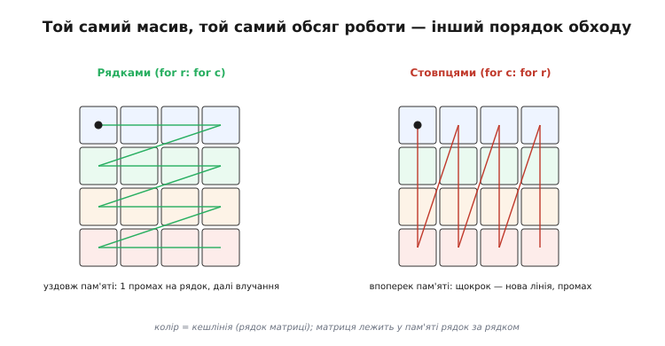
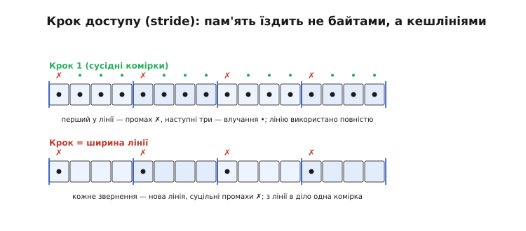

# ⚙️ Код, дружній до кешу: чому порядок обходу масиву міняє швидкість у рази

> [Кеш](topic:hw-arch/cache) — це **властивість заліза**: маленька швидка схованка, що влучає, поки доступ передбачуваний. Тут — зворотний бік тієї самої медалі: як **ваш код** або підіграє кешу, або б'є мимо нього, навіть не міняючи жодної формули. Найяскравіше це видно на найбуденнішій операції — обході масиву: переставите два цикли місцями, обсяг обчислень той самий до байта, а програма стає в рази швидшою чи повільнішою. Розберімо, чому, і виведемо кілька простих правил для мікроконтролера.

## Задача

Маємо звичайний двовимірний масив (матрицю) `A` розміром `N × N` — скажімо, кадр із давача чи таблицю чисел — і простий намір: пройти **всі** його клітинки й щось із кожною зробити (додати, відфільтрувати, скласти суму). Обсяг роботи тут жорстко заданий: рівно `N²` звернень, по одному на клітинку, хоч як їх упорядкуй. Питання вузьке й практичне: чи правда, що **порядок**, у якому ми обходимо клітинки, впливає на час, — і якщо так, то на скільки й чому. Відповідь, яка спершу дивує: на однаковій кількості звернень різниця в часі сягає **кількох разів** — і вся вона захована не в обчисленнях, а в тому, як доступ лягає на [кеш](topic:hw-arch/cache).

## Ідея

Щоб побачити корінь різниці, треба скласти докупи **дві** речі. Перша: двовимірний масив насправді лежить у пам'яті **плоско**, одним рядком за одним (так звана *row-major* розкладка, як у C). Тобто `A[0][0], A[0][1], …` — сусіди в пам'яті, а `A[0][0]` і `A[1][0]` — далеко одне від одного, через цілий рядок. Друга: кеш підтягує дані не по одному байту, а **цілими блоками-сусідами** — кешлініями (*cache line*). Один промах тягне з пам'яті відразу всю лінію — десятки сусідніх байтів (типово 64).


*Масив лежить у пам'яті рядок за рядком; колір клітинки — кешлінія, у яку вона потрапляє. Ліворуч обхід **рядками** (`for r: for c`) іде вздовж того, як дані лежать у пам'яті: витягли лінію — і одразу беремо з неї всі клітинки (один промах, далі влучання). Праворуч обхід **стовпцями** (`for c: for r`) на кожному кроці стрибає в нову лінію: щоразу промах, лінію тягнемо заради однієї клітинки й кидаємо.*

Складемо це разом — і все стає ясно. Якщо обходити масив **рядками**, у тому самому порядку, як він лежить, то перший доступ у рядку дає промах і тягне цілу лінію, а наступні кілька клітинок беруться вже **з кеша**, бо вони — сусіди в тій самій лінії. Якщо ж обходити **стовпцями**, кожен наступний доступ стрибає на цілий рядок далі, тобто майже завжди — у **нову** лінію: суцільні промахи, і кожну витягнуту лінію ми використовуємо лише на одну клітинку, а решту викидаємо, не торкнувшись. Тут і працює **просторова локальність**: рядковий обхід її береже, стовпцевий — топче.


*Пам'ять їздить блоками. Послідовний доступ (0, 1, 2, 3, …): перший у лінії — промах, наступні три — влучання, лінію використано **повністю**. Стрибковий доступ із кроком у ширину лінії (0, 4, 8, …): кожен — у новій лінії, суцільні промахи, з кожної лінії в діло йде лише одна комірка. Звідси й береться різниця в рази на однаковій кількості звернень.*

Цей самий механізм лежить в основі поняття **кроку доступу** (*stride*, від англ. «крок, розмах») — відстані в пам'яті між двома послідовними зверненнями. Крок 1 (сусідні комірки) — найкращий випадок: дані течуть лінія за лінією, кеш встигає, ще й апаратний випереджальний читач (*prefetch*) часто підтягує наступну лінію наперед. Великий крок (стрибок через рядок, через структуру) — найгірший: кожне звернення в нову лінію, кеш не встигає нічим зарадити. Правило, отже, формулюється одним рядком: **іди по пам'яті поспіль, з найменшим кроком, яким дозволяє задача.**

## Робочий код

Уся «оптимізація» тут зводиться до того, щоб **внутрішній** цикл біг уздовж того виміру, що лежить у пам'яті суцільно. Для row-major масиву це означає: зовнішній цикл — по рядках, внутрішній — по стовпцях. Ось обидва варіанти на справжньому C, з підрахунком, скільки промахів робить кожен.

**Умова.** `float A[1024][1024]` (4 МБ, у кеш не влазить), кешлінія 64 байти = 16 елементів `float`. Просумуймо всі клітинки двома способами.

```c
// Кеш-дружній обхід: внутрішній цикл — уздовж рядка (так, як масив лежить)
float sum = 0;
for (int r = 0; r < 1024; r++)        // зовнішній: рядок за рядком
    for (int c = 0; c < 1024; c++)    // внутрішній: уздовж рядка — крок 1, сусіди
        sum += A[r][c];               // доступ поспіль → промах лише на межі лінії

// Кеш-ВОРОЖИЙ обхід: та сама робота, цикли переставлено
float sum = 0;
for (int c = 0; c < 1024; c++)        // зовнішній: стовпець
    for (int r = 0; r < 1024; r++)    // внутрішній: стрибаємо рядками — крок = 1024
        sum += A[r][c];               // майже кожен доступ — новий промах
```

```
Дружній (крок 1):    16 елементів на лінію → 1 промах + 15 влучань
                     промахів ≈ 1024² / 16 ≈ 65 тис.

Ворожий (крок 1024): кожне звернення — в нову лінію → промах майже щоразу
                     промахів ≈ 1024² ≈ 1.05 млн.

відношення ≈ 16×  →  на залізі з кешем час різниться в кілька разів
```

Різниця між двома фрагментами — порядок двох рядків `for`, і більше нічого: ті самі `N²` додавань, ті самі індекси, той самий `sum`. Уся ціна — в тому, **яким кроком** внутрішній цикл біжить пам'яттю: ворожий варіант тягне з RAM у ~16 разів більше ліній і кожну використовує лише на одну клітинку з шістнадцяти.

## Складність і пастки на МК

За класичною міркою алгоритмів **обидва** обходи однакові — O(N²) операцій, бо вона рахує **кількість** звернень і не бачить, що одне звернення в кеш і одне звернення в пам'ять коштують геть по-різному. Саме тут ця міра й оманлива: реальний час визначає не лише число звернень, а й **частка промахів**, а її задає порядок обходу. Тому два O(N²)-цикли на практиці різняться в рази — і ось на що зважати на мікроконтролері.


*Ліворуч: якщо обходять **одне** поле з масиву об'єктів, масив структур (AoS) тягне в лінію й непотрібні поля — корисна лише частка лінії; структура масивів (SoA) кладе однакові поля поспіль, і вся лінія йде в діло. Праворуч: чи є з цього зиск, залежить від заліза — на 8-бітному МК без кеша (доступ до SRAM ~такт) порядок майже не важить, а на МК із кешем флешу (як ESP32) важить сильно, як на ПК.*

- **Спершу спитай, чи є тут кеш узагалі.** Це найважливіша засторога, і вона рятує від хибних висновків. На класичному 8-бітному МК (AVR-клас) пам'ять даних — це SRAM на кристалі з доступом за ~такт, **кеша немає** взагалі: будь-яка комірка однаково близька, і порядок обходу майже не міняє часу. А от на потужнішому МК, де код і дані відображено з повільного зовнішнього флешу через **кеш** (ESP32-клас, кеш ~32 КБ на ядро), порядок важить так само сильно, як на великому процесорі. Тож «кеш-оптимізація» дає зиск там, де між ядром і пам'яттю **є** кеш; на найдрібніших МК її ефект близький до нуля — і це нормально.
- **Розкладка даних б'є порядок обходу.** Часто виграш не в тому, **як** обходити, а в тому, **як покласти** дані. Якщо ви регулярно проходите масив об'єктів і чіпаєте лише **одне** поле кожного (скажімо, лише `x` зі структур `{x, y, z}`), то «масив структур» (*array of structs*, AoS) щоразу тягне в лінію й непотрібні `y, z` — корисна лише третина лінії. Перекладіть у «структуру масивів» (*struct of arrays*, SoA) — окремий масив на кожне поле, — і всі потрібні `x` ляжуть поспіль, лінія йтиме повністю в діло. Це той самий принцип локальності, лише прикладений до **форми** даних.
- **Послідовний доступ — подарунок для prefetch.** Навіть там, де «справжнього» кеша немає, флеш-пам'ять часто віддає дані блоками (рядок-буфер, випереджальне читання), тож суцільний доступ виграє й тут. Висновок універсальний: лінійний прохід масиву — майже завжди найшвидший спосіб його обійти, і це ще один доказ зробити внутрішній цикл найдовшим і найпослідовнішим.
- **Не плутай це з «передчасною оптимізацією».** Переставити два цикли чи покласти дані суцільно — **безкоштовно**: ні рядком довше, ні на йоту складніше для читання. Це не хитра оптимізація, яку варто відкладати, а просто **гігієна** роботи з пам'яттю: за тих самих зусиль код або дружить із кешем, або ні. Складні трюки (ручне «нарізання» масиву на кеш-блоки, *blocking*) лишіть на потім і лише там, де профіль доведе потребу; а от обхід пам'яті поспіль варто робити **одразу** й завжди.

Висновок: [кеш](topic:hw-arch/cache) — це залізна **ставка на локальність**; ваш код цю ставку або підтримує, або руйнує, навіть не міняючи жодного обчислення. Іти по масиву **поспіль**, з найменшим кроком, і класти **поряд** те, що читаєте разом, — два правила, що нічого не коштують, а на залізі з кешем дають швидкість у рази. Урок той самий, лише з боку пам'яті: машина винагороджує **передбачуване, упорядковане** — і карає хаотичне.
